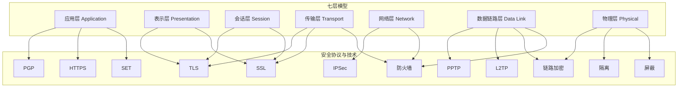

# 基础知识

## 一、函数依赖的公理系统（Armstrong公理）

### 1.1 基本概念

### 什么是函数依赖

设 R(U) 是一个关系模式，X、Y 是 U 的子集。若对于 X 的每一个值，Y 都有**唯一确定**的值与之对应，则称 **X 函数决定 Y**，记作：

```
X → Y
```

- X 称为**决定因素**（Determinant）
- Y 称为**被决定因素**（Dependent）

### 直观理解

> 函数依赖 = "知道 X 就能唯一确定 Y"

**例：** 学号 → 姓名（知道学号，就能唯一确定该学生的姓名）

---

### 符号读法速查

#### 函数依赖符号 `→`

| 符号 | 念法 | 含义 |
|------|------|------|
| `X → Y` | **X 函数决定 Y**（最标准） | X 决定 Y 的值 |
| | **X 决定 Y**（简称） | |
| | **Y 函数依赖于 X**（从被决定方角度） | |

#### 集合关系符号

| 符号 | 念法 | 含义 |
|------|------|------|
| `Y ⊆ X` | **Y 包含于 X** | Y 是 X 的子集（**可以相等**） |
| | **Y 是 X 的子集** | |
| | **X 包含 Y**（从反方向读） | |
| `Y ⊂ X` | **Y 真包含于 X** | Y 是 X 的**真**子集（**不能相等**） |
| `XZ` | **X 并 Z** | 即 X ∪ Z，属性集的并集简写 |

#### 其他符号

| 符号 | 念法 | 含义 |
|------|------|------|
| `A⁺` | **A 的闭包** 或 **A plus** | 属性集 A 的闭包 |
| `F⁺` | **F 的闭包** | 函数依赖集 F 的闭包 |
| `⟹` | **蕴含** / **推出** | 逻辑推导关系 |
| `∈` | **属于** | 元素属于集合 |
| `∪` | **并** | 集合的并运算 |
| `⊆` | **包含于** | 子集关系 |

> **提示：** 考试答题时写 `→` 即可，口头回答或论述时说"**函数决定**"最规范。

---

### 1.2 Armstrong 三条基本公理

```
┌─────────────────────────────────────────────────────────┐
│              Armstrong 公理系统（1974）                    │
│                                                         │
│   公理1: 自反律    Y ⊆ X  ⟹  X → Y                      │
│   公理2: 增广律    X → Y  ⟹  XZ → YZ                    │
│   公理3: 传递律    X → Y, Y → Z  ⟹  X → Z               │
│                                                         │
│   ───────── 完备且可靠的推理规则系统 ─────────            │
└─────────────────────────────────────────────────────────┘
```

### 公理1：自反律（Reflexivity）

> **若 Y ⊆ X，则 X → Y**

**含义：** 大集合一定函数决定它的小子集（平凡函数依赖）

```
┌──────────────────────────────────────┐
│        自 反 律  示 意 图              │
│                                      │
│   属性集 X = {A, B, C}               │
│   属性集 Y = {B, C}    (Y ⊆ X)       │
│                                      │
│        ┌─────────┐                   │
│        │   A,B,C  │                  │
│        │  ┌─────┐ │                  │
│        │  │ B,C  │ │    Y是X的子集    │
│        │  └─────┘ │                  │
│        └─────────┘                   │
│             │                        │
│             │ 自动成立（平凡依赖）       │
│             ▼                        │
│         {B, C}                       │
│                                      │
│   结论: {A,B,C} → {B,C}              │
└──────────────────────────────────────┘
```

**实例：**

| 关系 | 学号 | 姓名 | 课程号 | 成绩 |
|------|------|------|--------|------|
| 1    | S01  | 张三 | C01    | 90   |
| 2    | S01  | 张三 | C02    | 85   |

`{学号, 姓名} → {姓名}` — 不需要验证，永远成立

---

### 公理2：增广律（Augmentation）

> **若 X → Y，则 XZ → YZ**

**含义：** 两边同时加上相同的属性集，依赖仍然成立

```
┌──────────────────────────────────────────────┐
│              增 广 律  示 意 图                │
│                                              │
│   已知:  X → Y                               │
│                                              │
│   ┌─────┐          ┌─────┐                   │
│   │  X  │─────────▶│  Y  │   原始依赖         │
│   └─────┘          └─────┘                   │
│                                              │
│   两边同时添加 Z:                              │
│                                              │
│   ┌─────┐   ┌───┐          ┌─────┐   ┌───┐   │
│   │  X  │ + │ Z │ ───────▶ │  Y  │ + │ Z │   │
│   └─────┘   └───┘          └─────┘   └───┘   │
│       │                        │              │
│       ▼                        ▼              │
│     XZ                       YZ               │
│                                              │
│   结论: XZ → YZ                              │
└──────────────────────────────────────────────┘
```

**实例：**

```
已知: 学号 → 姓名

添加{课程号}后:
{学号, 课程号} → {姓名, 课程号}
```

---

### 公理3：传递律（Transitivity）

> **若 X → Y 且 Y → Z，则 X → Z**

**含义：** 依赖可以传递推导

```
┌──────────────────────────────────────────────┐
│              传 递 律  示 意 图                │
│                                              │
│         X ──────────▶ Y                      │
│         │                                     │
│         │ 已知: X → Y                         │
│         │      Y → Z                          │
│         ▼                                     │
│         Z                                     │
│                                              │
│   推导: X ──────────────────▶ Z               │
│         （通过 Y 间接决定）                     │
│                                              │
│   ┌──────┐      ┌──────┐      ┌──────┐        │
│   │ 学号  │───▶ │ 系名  │───▶ │系主任 │        │
│   └──────┘      └──────┘      └──────┘        │
│        ╲                                    ╱  │
│         ╲                                  ╱   │
│          ╲                                ╱    │
│           ╲──────────────▶◀──────────────╱     │
│                   学号 → 系主任                │
└──────────────────────────────────────────────┘
```

**实例：**

```
学号 → 系名      （学号确定，所在系名确定）
系名 → 系主任    （系名确定，系主任确定）
─────────────────────────────────
学号 → 系主任    （学号确定，系主任确定）
```

---

### 1.3 三条推理规则（导出定理）

由三条基本公理可以推导出以下常用规则：

### 推理规则1：合并律（Union）

> **若 X → Y 且 X → Z，则 X → YZ**

```
┌──────────────────────────────────────────────┐
│              合 并 律  示 意 图                │
│                                              │
│              ┌─────┐                          │
│              │  X  │                          │
│              └──┬──┘                          │
│              ╱  ╲                              │
│             ╱    ╲                             │
│            ▼      ▼                            │
│         ┌───┐  ┌───┐                          │
│         │ Y │  │ Z │    已知: X → Y            │
│         └───┘  └───┘         X → Z            │
│             ╲  ╱                               │
│              ╲╱                                │
│              ▼                                 │
│           ┌─────┐                              │
│           │ YZ  │    结论: X → YZ              │
│           └─────┘                              │
└──────────────────────────────────────────────┘
```

**证明过程：**
```
X → Y          （已知）
X → Z          （已知）
XZ → YZ        （增广律，在 X→Y 两边加 Z）
X → XZ         （增广律，在 X→Z 左边加 X，自反律 X⊆XZ）
X → YZ         （传递律：X→XZ, XZ→YZ）
```

---

### 推理规则2：分解律（Decomposition）

> **若 X → YZ，则 X → Y 且 X → Z**

```
┌──────────────────────────────────────────────┐
│              分 解 律  示 意 图                │
│                                              │
│              ┌─────┐                          │
│              │  X  │                          │
│              └──┬──┘                          │
│                 │                              │
│                 ▼                              │
│            ┌─────────┐                         │
│            │   YZ    │   已知: X → YZ           │
│            └────┬────┘                         │
│              ╱  ╲                               │
│             ╱    ╲                              │
│            ▼      ▼                             │
│         ┌───┐  ┌───┐                           │
│         │ Y │  │ Z │   结论: X → Y, X → Z       │
│         └───┘  └───┘                           │
└──────────────────────────────────────────────┘
```

**证明过程：**
```
X → YZ         （已知）
YZ → Y         （自反律，Y ⊆ YZ）
X → Y          （传递律）

同理: X → Z
```

---

### 推理规则3：伪传递律（Pseudotransitivity）

> **若 X → Y 且 WY → Z，则 XW → Z**

```
┌────────────────────────────────────────────────────┐
│              伪 传 递 律  示 意 图                   │
│                                                    │
│    ┌─────┐          ┌─────┐                        │
│    │  X  │─────────▶│  Y  │     已知: X → Y        │
│    └──┬──┘          └──┬──┘                        │
│       │                │                           │
│       │          ┌─────┴─────┐                     │
│       │          │     W     │                     │
│       │          └─────┬─────┘                     │
│       │                │                           │
│       ▼                ▼                           │
│         XW ──────▶   WY                            │
│                      │                              │
│                      ▼                              │
│    ┌─────────────┐ ┌───┐                            │
│    │     WY      │─▶│ Z │    已知: WY → Z           │
│    └─────────────┘ └───┘                            │
│                      │                               │
│    结论: XW ──────────────────▶ Z                    │
└────────────────────────────────────────────────────┘
```

**证明过程：**
```
X → Y          （已知）
XW → YW        （增广律，两边加 W）
YW → Z         （已知，即 WY → Z）
XW → Z         （传递律）
```

---

### 1.4 属性闭包 X⁺

### 定义

**属性集 X 的闭包 X⁺** = 所有能从 X 通过 Armstrong 公理推导出的属性的集合。

### 计算算法

```
┌────────────────────────────────────────────────────┐
│            求属性闭包 X⁺ 的算法                      │
│                                                    │
│   Step 1:  X⁺ ← X（初始化为自身）                    │
│                                                    │
│   Step 2:  遍历每个函数依赖 A → B                   │
│            如果 A ⊆ X⁺，则 X⁺ ← X⁺ ∪ B              │
│                                                    │
│   Step 3:  重复 Step 2，直到 X⁺ 不再增大             │
│                                                    │
│   Step 4:  返回 X⁺                                 │
└────────────────────────────────────────────────────┘
```

### 计算示例

已知 R(A, B, C, D, E)，函数依赖集 F = {A→B, B→C, CD→E}

**求 A⁺：**

```
步骤  A⁺ 的演化          说明
────  ──────────────    ────────────────────────
 ①   {A}                初始化
 ②   {A, B}             A→B, A⊆{A}，加入B
 ③   {A, B, C}          B→C, B⊆{A,B}，加入C
 ④   {A, B, C}          CD→E, CD⊈{A,B,C}，跳过
 ⑤   不再变化 → 停止

结果: A⁺ = {A, B, C}
```

**求 CD⁺：**

```
步骤  (CD)⁺ 的演化       说明
────  ──────────────    ────────────────────────
 ①   {C, D}             初始化
 ②   {C, D}             A→B, A⊈{C,D}，跳过
 ③   {C, D}             B→C, B⊈{C,D}，跳过
 ④   {C, D, E}          CD→E, CD⊆{C,D}，加入E
 ⑤   不再变化 → 停止

结果: (CD)⁺ = {C, D, E}
```

---

### 1.5 候选键的求解

### 候选键的定义

**候选键（Candidate Key）** = 最小属性集 K，满足 K⁺ = U（能推出所有属性）

### 属性分类法（快速判断）

```
┌────────────────────────────────────────────────────────┐
│          函数依赖中属性的四类分类                        │
│                                                        │
│   L类   只出现在左边  →  必须在候选键中                  │
│   R类   只出现在右边  →  不可能在候选键中                │
│   LR类  左右都出现    →  可能在候选键中                  │
│   N类   左右都不出现  →  必须在候选键中                  │
└────────────────────────────────────────────────────────┘
```

### 求解步骤

```
┌────────────────────────────────────────────────────────┐
│                  候选键求解步骤                          │
│                                                        │
│   1. 将属性分类为 L、R、LR、N 类                        │
│                                                        │
│   2. 令 X = L类 ∪ N类（一定在候选键中的属性）             │
│                                                        │
│   3. 计算 X⁺                                            │
│      - 若 X⁺ = U → X 是唯一候选键                       │
│      - 若 X⁺ ⊂ U → 依次添加 LR 类属性，计算闭包          │
│      - 若 X 已包含全部属性 → X 为候选键                  │
│                                                        │
│   4. 确保候选键的"最小性"（去掉任一属性就不再是键）       │
└────────────────────────────────────────────────────────┘
```

### 完整实例

已知 R(A, B, C, D, E)，F = {A→B, B→C, C→D, D→A, AE→B, E→C}

**Step 1: 分类**

| 属性 | 出现位置 | 类别 |
|------|----------|------|
| A    | 左(A→B, D→A, AE→B)、右(C→D, D→A) | LR |
| B    | 右(A→B, AE→B)、左(B→C) | LR |
| C    | 右(B→C, E→C)、左(C→D) | LR |
| D    | 右(C→D)、左(D→A) | LR |
| E    | 左(AE→B, E→C) | L |

**Step 2:** L类 = {E}，N类 = ∅，X = {E}

**Step 3:** 求 E⁺

```
E⁺ = {E} → {E,C}(E→C) → {E,C,D}(C→D) → {E,C,D,A}(D→A) → {E,C,D,A,B}(A→B)
E⁺ = {A, B, C, D, E} = U
```

**Step 4:** {E}⁺ = U，且 {E} 只有一个属性（已是最小）

**结论：候选键 = {E}**

---

### 1.6 Armstrong公理的性质

| 性质 | 含义 | 说明 |
|------|------|------|
| **可靠性（Soundness）** | 公理推导出的依赖一定成立 | 不会推出错误的依赖 |
| **完备性（Completeness）** | 所有成立的依赖都能被推导 | 不会漏掉正确的依赖 |

```
┌────────────────────────────────────────────────────────┐
│                                                        │
│   F（已知函数依赖集）                                    │
│   │                                                    │
│   │ 应用 Armstrong 公理                                 │
│   ▼                                                    │
│                                                        │
│   F⁺（F 的闭包 = F 逻辑蕴含的所有函数依赖）              │
│   │                                                    │
│   │ 可靠性: F⁺ 中的每个依赖都在现实中成立                │
│   │ 完备性: 现实中成立的每个依赖都在 F⁺ 中               │
│   ▼                                                    │
│                                                        │
│   判断 X → Y 是否成立 ⟺ Y ⊆ X⁺                         │
│                                                        │
└────────────────────────────────────────────────────────┘
```

---

### 1.7 与范式判定的关系

```
┌─────────────────────────────────────────────────────────────┐
│              Armstrong 公理 ──▶ 范式判定                     │
│                                                             │
│   1. 求候选键（利用闭包计算）                                  │
│      ↓                                                      │
│   2. 判断主属性 vs 非主属性                                    │
│      ↓                                                      │
│   3. 检查部分依赖 ──▶ 判断 2NF                                │
│      ↓                                                      │
│   4. 检查传递依赖 ──▶ 判断 3NF                                │
│      ↓                                                      │
│   5. 检查决定因素是否超键 ──▶ 判断 BCNF                       │
│                                                             │
│   核心工具: 属性闭包 X⁺ 计算                                  │
└─────────────────────────────────────────────────────────────┘
```

---

## 二、关系代数：笛卡尔积与自然连接

### 1. 笛卡尔积（Cartesian Product）

#### 定义

设关系 R 有 n 个元组，关系 S 有 m 个元组，则 **R × S** 的结果有 **n × m** 个元组，每个元组是 R 中的一个元组与 S 中的一个元组的**拼接**。

```
┌─────────────────────────────────────────────────────────┐
│                 笛 卡 尔 积 示 意 图                      │
│                                                         │
│   关系 R (2行)          关系 S (2行)                     │
│   ┌───────┬───────┐     ┌───────┬───────┐               │
│   │  A    │  B    │     │  C    │  D    │               │
│   ├───────┼───────┤     ├───────┼───────┤               │
│   │  a1   │  b1   │     │  c1   │  d1   │               │
│   │  a2   │  b2   │     │  c2   │  d2   │               │
│   └───────┴───────┘     └───────┴───────┘               │
│                                                         │
│                    R × S                                │
│            (2 × 2 = 4 行, 4 列)                         │
│   ┌───────┬───────┬───────┬───────┐                     │
│   │  A    │  B    │  C    │  D    │                     │
│   ├───────┼───────┼───────┼───────┤                     │
│   │  a1   │  b1   │  c1   │  d1   │  ← 第1行×第1行       │
│   │  a1   │  b1   │  c2   │  d2   │  ← 第1行×第2行       │
│   │  a2   │  b2   │  c1   │  d1   │  ← 第2行×第1行       │
│   │  a2   │  b2   │  c2   │  d2   │  ← 第2行×第2行       │
│   └───────┴───────┴───────┴───────┘                     │
│                                                         │
│   行数 = |R| × |S|    列数 = R列数 + S列数               │
└─────────────────────────────────────────────────────────┘
```

#### 具体实例

**学生表 R：**

| 学号 | 姓名 |
|------|------|
| 001  | 张三 |
| 002  | 李四 |

**课程表 S：**

| 课程号 | 课程名 |
|--------|--------|
| C01    | 数学   |
| C02    | 英语   |

**R × S 的结果：**

| 学号 | 姓名 | 课程号 | 课程名 |
|------|------|--------|--------|
| 001  | 张三 | C01    | 数学   |
| 001  | 张三 | C02    | 英语   |
| 002  | 李四 | C01    | 数学   |
| 002  | 李四 | C02    | 英语   |

> 每个学生配每门课程 —— **盲目的"拉郎配"**，不考虑任何关联条件。

#### 特点

| 特点 | 说明 |
|------|------|
| **结果行数** | |R| × |S|（行数相乘） |
| **结果列数** | R 的列数 + S 的列数（列全部保留） |
| **有无筛选** | 无，所有组合都产生 |
| **实际用途** | 单独使用意义不大，通常是其他运算（如连接）的中间步骤 |

---

### 2. 自然连接（Natural Join）

#### 定义

**自然连接**（记作 R ⋈ S）是笛卡尔积的一个**带筛选条件的子集**。它自动在**同名属性**上做等值匹配，并**去除重复列**。

```
┌─────────────────────────────────────────────────────────┐
│                自 然 连 接 示 意 图                       │
│                                                         │
│   学生表 R                成绩表 S                       │
│   ┌───────┬───────┐       ┌───────┬───────┐             │
│   │ 学号  │ 姓名  │       │ 学号  │ 成绩  │             │
│   ├───────┼───────┤       ├───────┼───────┤             │
│   │  001  │ 张三  │       │  001  │  90   │             │
│   │  002  │ 李四  │       │  002  │  85   │             │
│   │  003  │ 王五  │       │  004  │  78   │             │
│   └───┬───┴───────┘       └───┬───┴───────┘             │
│       │                       │                         │
│       │   同名属性"学号"匹配    │                         │
│       └───────────┬───────────┘                         │
│                   ▼                                     │
│              R ⋈ S（自然连接）                           │
│   ┌───────┬───────┬───────┐                             │
│   │ 学号  │ 姓名  │ 成绩  │                             │
│   ├───────┼───────┼───────┤                             │
│   │  001  │ 张三  │  90   │  ← 学号001匹配               │
│   │  002  │ 李四  │  85   │  ← 学号002匹配               │
│   └───────┴───────┴───────┘                             │
│                                                         │
│   注意:                                                 │
│   - 王五(003)无成绩 → 被"丢掉"（悬浮元组）                │
│   - 成绩(004)无对应学生 → 也被"丢掉"                      │
│   - 只保留一个"学号"列（去重）                            │
└─────────────────────────────────────────────────────────┘
```

#### 计算步骤（理解自然连接的本质）

```
┌────────────────────────────────────────────────────┐
│          自然连接 R ⋈ S 的计算步骤                   │
│                                                    │
│   Step 1: 计算 R × S（笛卡尔积）                    │
│            ↓                                       │
│   Step 2: 筛选同名属性值相等的元组                   │
│           σ[R.A = S.A](R × S)                      │
│            ↓                                       │
│   Step 3: 去掉重复的同名列                          │
│            ↓                                       │
│   Step 4: 得到最终结果                              │
└────────────────────────────────────────────────────┘
```

#### 具体实例

**学生表 R：**

| 学号 | 姓名 |
|------|------|
| 001  | 张三 |
| 002  | 李四 |
| 003  | 王五 |

**成绩表 S：**

| 学号 | 成绩 |
|------|------|
| 001  | 90   |
| 002  | 85   |
| 004  | 78   |

**R ⋈ S 的结果（按学号自然连接）：**

| 学号 | 姓名 | 成绩 |
|------|------|------|
| 001  | 张三 | 90   |
| 002  | 李四 | 85   |

> 王五（003）没有成绩记录，学生004不在学生表中 —— 这些**悬浮元组被丢弃**。

---

### 3. 笛卡尔积 vs 自然连接 对比

```
┌───────────────────────────────────────────────────────────────┐
│           笛 卡 尔 积  vs  自 然 连 接  对 比                  │
│                                                               │
│  ┌─────────────────┬──────────────────┬──────────────────┐    │
│  │     比较项       │   笛卡尔积 R × S  │  自然连接 R ⋈ S   │    │
│  ├─────────────────┼──────────────────┼──────────────────┤    │
│  │ 行数            │ |R| × |S|        │ ≤ |R| × |S|      │    │
│  │                 │ （全部组合）      │ （只保留匹配的）   │    │
│  ├─────────────────┼──────────────────┼──────────────────┤    │
│  │ 列数            │ R列 + S列        │ R列 + S列 - 同名列 │    │
│  │                 │ （全部保留）      │ （重复列去重）     │    │
│  ├─────────────────┼──────────────────┼──────────────────┤    │
│  │ 是否有条件       │ 无条件           │ 同名属性等值匹配   │    │
│  ├─────────────────┼──────────────────┼──────────────────┤    │
│  │ 悬浮元组        │ 不会丢失          │ 会丢失（不匹配的被 │    │
│  │                 │                  │   筛掉）           │    │
│  ├─────────────────┼──────────────────┼──────────────────┤    │
│  │ 运算量          │ 大（全组合）      │ 相对小（先积后筛） │    │
│  ├─────────────────┼──────────────────┼──────────────────┤    │
│  │ 实际用途        │ 理论运算/中间步骤  │ 实际查询中最常用   │    │
│  └─────────────────┴──────────────────┴──────────────────┘    │
│                                                               │
│  关系: 自然连接 = 笛卡尔积 + 等值筛选 + 去重列                 │
│                                                               │
│       R ⋈ S = π去重( σ同名等值(R × S) )                       │
│                                                               │
└───────────────────────────────────────────────────────────────┘
```

### 4. 符号读法

| 符号 | 念法 | 含义 |
|------|------|------|
| `R × S` | **R 叉乘 S** / **R 笛卡尔积 S** | 笛卡尔积 |
| `R ⋈ S` | **R 自然连接 S** | 自然连接 |
| `R ⋈_{A=B} S` | **R 关于 A等于B 连接 S** | 条件连接（θ连接） |
| `σ_{条件}(R)` | **选择 R，条件为...** | 选择运算 |
| `π_{列名}(R)` | **投影 R，取...列** | 投影运算 |

### 5. 与外连接的对比

```
┌────────────────────────────────────────────────────────┐
│              连接运算家族                                │
│                                                        │
│   ┌─────────────┐                                      │
│   │  笛卡尔积    │  R × S  全部组合，无条件              │
│   └──────┬──────┘                                      │
│          │  + 等值筛选 + 去重                           │
│          ▼                                              │
│   ┌─────────────┐                                      │
│   │  自然连接    │  R ⋈ S  只保留匹配的，丢悬浮元组       │
│   └──────┬──────┘                                      │
│          │                                              │
│   ┌──────┴──────────────┬──────────────────────┐        │
│   ▼                     ▼                      ▼        │
│  左外连接              右外连接               全外连接    │
│  R ⟕ S               R ⟖ S               R ⟗ S       │
│  左边全保留            右边全保留            全部保留    │
│  右边不匹配填NULL      左边不匹配填NULL      不匹配填NULL │
└────────────────────────────────────────────────────────┘
```

| 运算 | 符号 | 保留规则 | 示例（接上文学生/成绩） |
|------|------|----------|------------------------|
| 自然连接 | R ⋈ S | 只保留匹配 | 张三、李四 |
| 左外连接 | R ⟕ S | 左表全保留 | 张三、李四、**王五(NULL)** |
| 右外连接 | R ⟖ S | 右表全保留 | 张三、李四、**(NULL, 004)** |
| 全外连接 | R ⟗ S | 全部保留 | 张三、李四、王五(NULL)、004(NULL) |

---

## 三、数据集成中的三类冲突

> 在**多数据库集成**和**全局模式设计**中，不同数据源的表结构合并时会遇到三类冲突：**属性冲突**、**结构冲突**和**命名冲突**。

```
┌────────────────────────────────────────────────────────────┐
│              数 据 集 成 三 类 冲 突                          │
│                                                            │
│   ┌──────────────┐   ┌──────────────┐   ┌──────────────┐   │
│   │  属性冲突     │   │  结构冲突     │   │  命名冲突     │   │
│   │              │   │              │   │              │   │
│   │ 同一属性的     │   │ 同一实体在     │   │ 名字与含义     │
│   │ 类型、取值     │   │ 不同数据源     │   │ 不一致        │   │
│   │ 范围、单位     │   │ 中的结构      │   │              │   │
│   │ 不同          │   │ 不同         │   │ 同名异义     │   │
│   │              │   │              │   │ 异名同义     │   │
│   └──────────────┘   └──────────────┘   └──────────────┘   │
└────────────────────────────────────────────────────────────┘
```

### 1. 属性冲突（Attribute Conflict）

#### 定义

同一属性在不同数据源中，其**数据类型**、**取值范围**或**计量单位**不一致。

```
┌─────────────────────────────────────────────────────────┐
│                 属 性 冲 突 示 意 图                      │
│                                                         │
│   数据源 A：学生表          数据源 B：学生表               │
│   ┌───────┬──────────┐      ┌───────┬──────────┐         │
│   │ 学号  │ 身高(cm)  │      │ 学号  │ 身高(m)   │         │
│   ├───────┼──────────┤      ├───────┼──────────┤         │
│   │ S001  │   175     │      │ S001  │   1.75   │         │
│   │ S002  │   168     │      │ S002  │   1.68   │         │
│   └───────┴──────────┘      └───────┴──────────┘         │
│                                                         │
│   冲突类型: 单位不一致（cm vs m）                          │
│   解决: 统一转换为 cm（或 m）                             │
└─────────────────────────────────────────────────────────┘
```

#### 三种子类型

| 子类型 | 说明 | 示例 | 解决方法 |
|--------|------|------|----------|
| **域冲突** | 数据类型不同 | A 库年龄是 INT，B 库年龄是 VARCHAR | 统一为同一种数据类型 |
| **取值范围冲突** | 取值范围/精度不同 | A 库成绩 0~100，B 库成绩 A/B/C/D | 建立映射转换表 |
| **单位不一致** | 计量单位不同 | A 库体重 kg，B 库体重 磅 | 统一单位并换算 |

#### 具体实例

```
┌─────────────────────────────────────────────────────────┐
│  数据源 A（中国校区）        数据源 B（美国校区）            │
│                                                         │
│  学号 │ 成绩 │ 体重(kg)      学号 │ 成绩 │ 体重(lb)       │
│  ─────┼──────┼────────      ─────┼──────┼────────        │
│  S01  │  90  │   65         S01  │  A   │  143          │
│  S02  │  75  │   70         S02  │  B   │  154          │
│                                                         │
│  冲突 1: 成绩类型不同（数值 vs 等级） → 域冲突              │
│  冲突 2: 体重单位不同（kg vs 磅）   → 单位不一致            │
│                                                         │
│  统一后:                                                 │
│  学号 │ 成绩(百分制) │ 体重(kg)                           │
│  ─────┼────────────┼────────                            │
│  S01  │    90      │   65                               │
│  S02  │    75      │   70                               │
└─────────────────────────────────────────────────────────┘
```

---

### 2. 结构冲突（Structural Conflict）

#### 定义

同一实体在不同数据源中，其**表结构设计**不一致——属性的组合方式、层级关系不同。

```
┌─────────────────────────────────────────────────────────┐
│                 结 构 冲 突 示 意 图                      │
│                                                         │
│   数据源 A：一个表包含完整信息                            │
│   ┌───────┬───────┬─────────┬─────────┐                 │
│   │ 学号  │ 姓名  │ 系名    │ 系主任   │                 │
│   └───────┴───────┴─────────┴─────────┘                 │
│                                                         │
│   数据源 B：拆成两个表                                    │
│   ┌───────┬───────┬───────┐    ┌───────┬─────────┐       │
│   │ 学号  │ 姓名  │ 系编号│    │ 系编号│ 系名    │       │
│   └───────┴───────┴───────┘    └───────┴─────────┘       │
│                                                         │
│   冲突: A 是扁平结构，B 是规范化结构（多了中间系编号）       │
│   解决: 合并时选择一种结构，或建立映射关系                   │
└─────────────────────────────────────────────────────────┘
```

#### 三种子类型

| 子类型 | 说明 | 示例 | 解决方法 |
|--------|------|------|----------|
| **属性组合冲突** | 同一信息在 A 中是单属性，在 B 中是复合属性 | A 库"姓名"是一列，B 库拆成"姓"+"名" | 拆分或合并列 |
| **结构扁平化/规范化** | A 库一张大表，B 库拆成多张表 | A 库(学生,系,系主任)，B 库(学生表+系表) | 选择一种结构统一 |
| **实体与属性的转换** | 在 A 中是独立实体（表），在 B 中是属性（列） | A 库"课程"是独立表，B 库中"课程名"是学生表的一列 | 决定是独立建表还是作为属性 |

#### 具体实例

```
┌─────────────────────────────────────────────────────────┐
│  数据源 A（简单设计）                                     │
│  ┌───────┬───────┬────────┐                             │
│  │ 姓名  │ 课程1 │ 课程2   │    ← 一个学生多个课程作为列    │
│  ├───────┼───────┼────────┤                             │
│  │ 张三  │ 数学  │ 英语    │                             │
│  │ 李四  │ 物理  │ 化学    │                             │
│  └───────┴───────┴────────┘                             │
│                                                         │
│  数据源 B（规范设计）                                     │
│  ┌───────┬──────┐          ┌───────┬──────┐              │
│  │ 姓名  │ 课程  │    或    │ 学号  │ 姓名  │              │
│  ├───────┼──────┤          ├───────┼──────┤              │
│  │ 张三  │ 数学  │          │ 001   │ 张三  │              │
│  │ 张三  │ 英语  │          └───────┴──────┘              │
│  │ 李四  │ 物理  │          ┌───────┬──────┐              │
│  │ 李四  │ 化学  │          │ 学号  │ 课程  │              │
│  └───────┴──────┘          ├───────┼──────┤              │
│                            │ 001   │ 数学  │              │
│  冲突: A 是非 1NF（重复组），B 是规范化的                   │
│                            │ 001   │ 英语  │              │
│  解决: 通常选择 B 的规范化结构                              │
│                            │ 002   │ 物理  │              │
│                            │ 002   │ 化学  │              │
│                            └───────┴──────┘              │
└─────────────────────────────────────────────────────────┘
```

---

### 3. 命名冲突（Naming Conflict）

#### 定义

不同数据源中，对象（表名、列名）的**名称与语义**不一致。

```
┌──────────────────────────────────────────────────────────────┐
│                    命 名 冲 突 示 意 图                         │
│                                                              │
│   ┌────────────────────┐      ┌────────────────────┐         │
│   │   同 名 异 义       │      │   异 名 同 义        │         │
│   │                    │      │                    │         │
│   │   不同含义，相同名字  │      │   相同含义，不同名字  │         │
│   │                    │      │                    │         │
│   │   A库: 项目="工程"   │      │   A库: 职工号       │         │
│   │   B库: 项目="课题"   │      │   B库: 员工编号      │         │
│   │                    │      │   → 都是员工ID       │         │
│   └────────────────────┘      └────────────────────┘         │
│                                                              │
│   ┌────────────────────┐                                     │
│   │   隐含同义（隐藏匹配）│                                     │
│   │                    │                                     │
│   │   A库: emp_name     │                                     │
│   │   B库: staff_full   │   → 都是员工全名，但名字看不出关系   │
│   │                    │                                     │
│   └────────────────────┘                                     │
└──────────────────────────────────────────────────────────────┘
```

#### 三种子类型

| 子类型 | 说明 | 示例 | 解决方法 |
|--------|------|------|----------|
| **同名异义** | 名字相同，含义不同 | A 库的"项目"=工程项目，B 库的"项目"=科研课题 | 分别重命名，加前缀区分 |
| **异名同义** | 名字不同，含义相同 | A 库"职工号"，B 库"员工编号" | 统一命名（选定一个标准名） |
| **隐含同义** | 名字看不出关联，但实际含义相同 | A 库"emp_name"，B 库"staff_full" | 建立同义词映射表 |

#### 具体实例

```
┌─────────────────────────────────────────────────────────┐
│  同名异义:                                                │
│                                                         │
│  A 库 ┌──────────┐    B 库 ┌──────────┐                 │
│       │ 部门     │          │ 部门     │                 │
│       ├──────────┤          ├──────────┤                 │
│       │ 部门编号  │          │ 部门编号  │                 │
│       │ 部门名称  │          │ 部门名称  │                 │
│       │ 负责人   │          │ 办公位置  │                 │
│       └──────────┘          └──────────┘                 │
│                                                         │
│  注意: "负责人"在A中是人名，在B中不存在                    │
│        "办公位置"在B中有，在A中没有                        │
│        虽然表名都叫"部门"，但结构不同                        │
│                                                         │
│  解决: 分别命名为 A_部门 和 B_部门，或合并为新_部门表       │
└─────────────────────────────────────────────────────────┘
```

---

### 4. 三类冲突对比总结

```
┌─────────────────────────────────────────────────────────────┐
│                  三 类 冲 突 对 比 总 结                      │
│                                                             │
│  ┌──────────┬──────────────────┬──────────────────────────┐ │
│  │ 冲突类型  │    关注层面        │      典型表现              │ │
│  ├──────────┼──────────────────┼──────────────────────────┤ │
│  │ 属性冲突  │  属性定义层面      │ 类型、范围、单位不一致     │ │
│  │          │                  │ "同样的东西，表示法不同"    │ │
│  ├──────────┼──────────────────┼──────────────────────────┤ │
│  │ 结构冲突  │  表结构层面        │ 组合方式、层级关系不同     │ │
│  │          │                  │ "同样的东西，组织方式不同"  │ │
│  ├──────────┼──────────────────┼──────────────────────────┤ │
│  │ 命名冲突  │  命名约定层面      │ 名字与含义不对应          │ │
│  │          │                  │ "同样的东西叫不同名字"      │ │
│  │          │                  │ "不同东西叫同样的名字"      │ │
│  └──────────┴──────────────────┴──────────────────────────┘ │
│                                                             │
│  解决顺序: 先解决命名冲突（明确对应关系）                      │
│            → 再解决结构冲突（统一表的组织方式）                │
│            → 最后解决属性冲突（统一属性定义）                  │
│                                                             │
└─────────────────────────────────────────────────────────────┘
```

### 5. 符号读法

| 术语 | 念法 |
|------|------|
| 属性冲突 | **属性冲突** |
| 结构冲突 | **结构冲突** |
| 命名冲突 | **命名冲突** |
| 同名异义 | **同名异义**（同一个名字，不同的含义） |
| 异名同义 | **异名同义**（不同的名字，相同的含义） |
| 隐含同义 | **隐含同义**（隐藏的同义词） |
| 域冲突 | **域冲突**（Domain Conflict） |

---

## 四、数据库范式（1NF / 2NF / 3NF）

### 4.1 什么是范式（总览）

**范式（Normal Form）** = 关系模式设计的"规则等级"。满足的范式级别越高，数据冗余和异常就越少。

```
┌─────────────────────────────────────────────────────────────┐
│           范 式 层 级 升 级（要 求 越 来 越 严 格）            │
│                                                             │
│   ┌─────────────┐                                           │
│   │    1NF      │  属性不可再分（原子性）                     │
│   │             │  ❌ "联系方式"不能同时放"电话+邮箱"          │
│   └──────┬──────┘                                           │
│          │ + 消除 非主属性 对 候选键 的 部分依赖              │
│          ▼                                                   │
│   ┌─────────────┐                                           │
│   │    2NF      │  先满足 1NF                                │
│   │             │  非主属性必须完全依赖整个候选键               │
│   │             │  ❌ (学号,课程号)→系名（只依赖学号一部分）    │
│   └──────┬──────┘                                           │
│          │ + 消除 非主属性 对 候选键 的 传递依赖              │
│          ▼                                                   │
│   ┌─────────────┐                                           │
│   │    3NF      │  先满足 2NF                                │
│   │             │  非主属性之间不能有依赖关系                  │
│   │             │  ❌ 学号→系名→系主任（传递依赖）             │
│   └──────┬──────┘                                           │
│          │ + 消除 主属性 对 候选键 的 部分/传递依赖           │
│          ▼                                                   │
│   ┌─────────────┐                                           │
│   │   BCNF      │  先满足 3NF                                │
│   │             │  所有决定因素必须是超键                      │
│   │             │  ❌ (学生,课程)→教师，但教师→课程           │
│   └─────────────┘                                           │
│                                                             │
│   记忆口诀：                                                  │
│   1NF — 格子要原子                                            │
│   2NF — 依赖要完整                                            │
│   3NF — 依赖要直接                                            │
│   BCNF — 决定因素要是超键                                     │
└─────────────────────────────────────────────────────────────┘
```

### 预备知识

判断范式需要用到以下概念（见本文档第一节）：

| 概念 | 含义 |
|------|------|
| **候选键** | 能唯一确定所有属性的最小属性集 |
| **主属性** | 属于某个候选键的属性 |
| **非主属性** | 不属于任何候选键的属性 |
| **部分依赖** | X→Y，但 X 的某个真子集也能决定 Y |
| **传递依赖** | X→Y, Y→Z，则 X→Z 是传递依赖 |

---

### 4.2 第一范式（1NF）：属性不可再分

#### 定义

> 关系模式的**每个属性都是原子值**（不可再分解的基本数据项）。

#### ASCII 对比图

```
┌─────────────────────────────────────────────────────────┐
│        1NF 反例（❌ 违反：属性可再分）                     │
│                                                         │
│  学生表：                                                 │
│  ┌───────┬───────┬───────────────────────┐               │
│  │ 学号  │ 姓名  │      联系方式          │               │
│  ├───────┼───────┼───────────────────────┤               │
│  │ S001  │ 张三  │ 电话:138xxxx, 邮箱:z@ │               │
│  │ S002  │ 李四  │ 电话:139xxxx, 邮箱:l@ │               │
│  └───────┴───────┴───────────────────────┘               │
│                                                         │
│  ❌ "联系方式"包含多个值 → 违反原子性                      │
└─────────────────────────────────────────────────────────┘

┌─────────────────────────────────────────────────────────┐
│        1NF 正例（✓ 符合：属性原子）                       │
│                                                         │
│  学生表：                                                 │
│  ┌───────┬───────┬───────────┬──────────┐               │
│  │ 学号  │ 姓名  │   电话    │   邮箱    │               │
│  ├───────┼───────┼───────────┼──────────┤               │
│  │ S001  │ 张三  │ 138xxxx   │ z@q.com  │               │
│  │ S002  │ 李四  │ 139xxxx   │ l@q.com  │               │
│  └───────┴───────┴───────────┴──────────┘               │
│                                                         │
│  ✓ 每个格子只放一个值 → 满足 1NF                          │
└─────────────────────────────────────────────────────────┘
```

#### 关键理解

```
┌────────────────────────────────────────────────────┐
│              1NF 的本质                              │
│                                                    │
│   一个格子（一个单元格）只能放一个值                   │
│                                                    │
│   以下都违反 1NF：                                    │
│   - 一个格子里放多个值（逗号分隔）                     │
│   - 一个属性可以再拆分成子属性                        │
│   - 表中表（嵌套关系）                               │
│   - 重复组（如"课程1""课程2""课程3"列）              │
│                                                    │
│   考试技巧：                                         │
│   看到"多值属性""复合属性""重复组"→ 不是 1NF          │
└────────────────────────────────────────────────────┘
```

---

### 4.3 第二范式（2NF）：消除部分依赖

#### 定义

> 满足 1NF，且**每个非主属性完全函数依赖于候选键**（不存在部分依赖）。

**注意：** 如果候选键是单属性，则自动满足 2NF（因为不存在"部分"可依赖）。

#### 什么是部分依赖？

```
┌─────────────────────────────────────────────────────────┐
│              部 分 依 赖 示 意 图                         │
│                                                         │
│   设主键 = (A, B)                                        │
│                                                         │
│   ┌─────────┐          ┌──────────┐                     │
│   │  A      │─────────▶│  非主属性 │  ← 只依赖 A 就够了！ │
│   │         │          └──────────┘                      │
│   │ 主键    │                                            │
│   │ (A, B)  │          ┌──────────┐                     │
│   │         │─────────▶│  非主属性 │  ← 需要 A+B 一起     │
│   └─────────┘          └──────────┘                      │
│          ↑                                                 │
│     只依赖主键的一部分 → 这就是"部分依赖"                   │
│     2NF 禁止这种情况！                                     │
└─────────────────────────────────────────────────────────┘
```

#### 反例分析

**学生选课表（不满足 2NF）：**

```
┌─────────────────────────────────────────────────────────┐
│  学生选课表 R(学号, 课程号, 姓名, 成绩, 系名)              │
│                                                         │
│  候选键: (学号, 课程号)  ← 复合主键                       │
│  主属性: 学号, 课程号                                      │
│  非主属性: 姓名, 成绩, 系名                                │
│                                                         │
│  函数依赖:                                               │
│  (学号, 课程号) → 成绩    ✓ 完全依赖（需要学号+课程号）    │
│  学号 → 姓名            ✗ 部分依赖（只需要学号）          │
│  学号 → 系名            ✗ 部分依赖（只需要学号）          │
│                                                         │
│  具体数据:                                               │
│  ┌──────┬──────┬──────┬──────┬────────┐                 │
│  │ 学号  │课程号│ 姓名  │ 成绩  │ 系名   │                 │
│  ├──────┼──────┼──────┼──────┼────────┤                 │
│  │ S001 │ C01  │ 张三  │  90  │ 计算机 │  ← 张三重复了！  │
│  │ S001 │ C02  │ 张三  │  85  │ 计算机 │  ← 张三重复了！  │
│  │ S001 │ C03  │ 张三  │  92  │ 计算机 │  ← 张三重复了！  │
│  │ S002 │ C01  │ 李四  │  78  │ 数学   │                 │
│  └──────┴──────┴──────┴──────┴────────┘                 │
│                                                         │
│  问题:                                                   │
│  1. 数据冗余: "张三""计算机"重复存储                      │
│  2. 更新异常: 张三换系，要改 3 条记录                     │
│  3. 插入异常: 新学生没选课，无法录入系名                  │
│  4. 删除异常: 删除张三最后一门课，学生信息也丢了           │
└─────────────────────────────────────────────────────────┘
```

#### 分解为 2NF

```
┌─────────────────────────────────────────────────────────┐
│  分解为 2NF：拆成两张表                                   │
│                                                         │
│  ┌─────────────────────────┐  ┌──────────────────────┐  │
│  │ SC(学号, 课程号, 成绩)  │  │ S(学号, 姓名, 系名)  │  │
│  ├──────┬──────┬──────┤    │  ├──────┬──────┬──────┤  │  │
│  │ 学号  │课程号│ 成绩  │    │  │ 学号  │ 姓名  │ 系名  │  │  │
│  ├──────┼──────┼──────┤    │  ├──────┼──────┼──────┤  │  │
│  │ S001 │ C01  │  90  │    │  │ S001 │ 张三  │计算机 │  │  │
│  │ S001 │ C02  │  85  │    │  │ S002 │ 李四  │ 数学  │  │  │
│  │ S001 │ C03  │  92  │    │  └──────┴──────┴──────┘  │  │
│  │ S002 │ C01  │  78  │    │                          │  │
│  └──────┴──────┴──────┘    │                          │  │
│                            │                          │  │
│  主键: (学号, 课程号)      │  主键: 学号               │  │
│  成绩完全依赖整个主键 ✓    │  姓名、系名完全依赖学号 ✓  │  │
│                                                         │
│  ✓ 两张表都满足 2NF                                      │
└─────────────────────────────────────────────────────────┘
```

---

### 4.4 第三范式（3NF）：消除传递依赖

#### 定义

> 满足 2NF，且**不存在非主属性对候选键的传递依赖**。

#### 什么是传递依赖？（回顾 Armstrong 传递律）

```
┌─────────────────────────────────────────────────────────┐
│              传 递 依 赖 示 意 图                         │
│                                                         │
│   设候选键 = K，非主属性为 A、B                            │
│                                                         │
│   ┌──────┐       ┌──────┐       ┌──────┐                │
│   │  K   │──────▶│  A   │──────▶│  B   │                │
│   │候选键 │       │非主属性│       │非主属性│                │
│   └──────┘       └──────┘       └──────┘                │
│                                                         │
│   K → A（正常）                                          │
│   A → B（非主属性依赖另一个非主属性）                     │
│   K → B（传递而来）                                      │
│                                                         │
│   ⚠ 这就是"传递依赖" → 3NF 禁止这种情况！                 │
└─────────────────────────────────────────────────────────┘
```

#### 反例分析

**学生表（不满足 3NF）：**

```
┌─────────────────────────────────────────────────────────┐
│  学生表 S(学号, 姓名, 系名, 系主任)                       │
│                                                         │
│  候选键: 学号                                             │
│  主属性: 学号                                             │
│  非主属性: 姓名, 系名, 系主任                             │
│                                                         │
│  函数依赖:                                               │
│  学号 → 姓名     ✓ 直接依赖                              │
│  学号 → 系名     ✓ 直接依赖                              │
│  系名 → 系主任   ← 非主属性之间的依赖！                    │
│  学号 → 系主任   ← 通过"系名"传递                        │
│                                                         │
│  ┌──────┬──────┬────────┬────────┐                      │
│  │ 学号  │ 姓名  │  系名   │ 系主任  │                      │
│  ├──────┼──────┼────────┼────────┤                      │
│  │ S001 │ 张三  │ 计算机  │ 王教授  │                      │
│  │ S002 │ 李四  │ 计算机  │ 王教授  │  ← 王教授重复了！    │
│  │ S003 │ 王五  │ 计算机  │ 王教授  │  ← 王教授重复了！    │
│  │ S004 │ 赵六  │ 数学    │ 刘教授  │                      │
│  │ S005 │ 孙七  │ 数学    │ 刘教授  │  ← 刘教授重复了！    │
│  └──────┴──────┴────────┴────────┘                      │
│                                                         │
│  问题:                                                   │
│  1. 数据冗余: "王教授"重复存储 3 次                       │
│  2. 更新异常: 计算机系换系主任，要改 3 条记录              │
│  3. 插入异常: 新建一个系（尚无学生），无法录入系主任        │
│  4. 删除异常: 计算机系最后一个学生毕业，系信息也丢了        │
└─────────────────────────────────────────────────────────┘
```

#### 分解为 3NF

```
┌─────────────────────────────────────────────────────────┐
│  分解为 3NF：拆出独立的系表                               │
│                                                         │
│  ┌─────────────────────────┐  ┌──────────────────┐      │
│  │ S(学号, 姓名, 系名)     │  │ D(系名, 系主任)   │      │
│  ├──────┬──────┬────────┤  │  ├────────┬────────┤      │
│  │ 学号  │ 姓名  │  系名   │  │  │  系名   │ 系主任  │      │
│  ├──────┼──────┼────────┤  │  ├────────┼────────┤      │
│  │ S001 │ 张三  │ 计算机  │  │  │ 计算机  │ 王教授  │      │
│  │ S002 │ 李四  │ 计算机  │  │  │ 数学    │ 刘教授  │      │
│  │ S003 │ 王五  │ 计算机  │  │  └────────┴────────┘      │
│  │ S004 │ 赵六  │ 数学    │  │                           │
│  │ S005 │ 孙七  │ 数学    │  │                           │
│  └──────┴──────┴────────┘  │                           │
│                            │                           │
│  系名是外键，引用 D 表的系名  │                           │
│                                                         │
│  S 表: 学号→姓名, 学号→系名 ✓（无传递依赖）               │
│  D 表: 系名→系主任 ✓（无传递依赖）                        │
│                                                         │
│  ✓ 两张表都满足 3NF                                      │
└─────────────────────────────────────────────────────────┘
```

---

### 4.5 BCNF（Boyce-Codd 范式）

#### 定义

> 满足 1NF，且对于**每个非平凡函数依赖 X → Y**，X 必须是**超键**。

#### 与 3NF 的区别

```
┌─────────────────────────────────────────────────────────┐
│          3NF vs BCNF 对 比                                │
│                                                         │
│  3NF 的要求:                                             │
│  对于 X → A，满足以下任一即可：                           │
│    (1) X 是超键                                          │
│    (2) A 是主属性（属于某个候选键）                        │
│                                                         │
│  BCNF 的要求:                                            │
│  对于 X → A，必须满足：                                   │
│    (1) X 是超键                                          │
│                                                         │
│  ┌───────────────────────────────────────────────────┐   │
│  │  关键区别: BCNF 比 3NF 更严格                        │   │
│  │  BCNF 不区分主属性和非主属性                         │   │
│  │  所有决定因素必须是超键                              │   │
│  │  3NF 允许"主属性传递依赖于非主属性"                   │   │
│  │  BCNF 不允许这种情况                                │   │
│  └───────────────────────────────────────────────────┘   │
│                                                         │
│  关系: BCNF ⟹ 3NF ⟹ 2NF ⟹ 1NF                          │
│  （满足 BCNF 一定满足 3NF，反之不一定）                    │
└─────────────────────────────────────────────────────────┘
```

#### BCNF 反例（满足 3NF 但不满足 BCNF）

```
┌─────────────────────────────────────────────────────────┐
│  场景: 学生选课，每个课程只有一个教师，每个教师教一门课     │
│                                                         │
│  表 R(学生, 课程, 教师)                                    │
│                                                         │
│  函数依赖:                                               │
│  (学生, 课程) → 教师    ← 每个学生的每门课有固定教师       │
│  (学生, 教师) → 课程    ← 每个教师只教一门课               │
│  教师 → 课程          ← 每个教师只教一门课                │
│                                                         │
│  候选键:                                                  │
│  K1 = (学生, 课程)                                        │
│  K2 = (学生, 教师)                                        │
│                                                         │
│  主属性: 学生, 课程, 教师（全为主属性，无非主属性）         │
│  因为没有非主属性 → 自动满足 3NF ✓                        │
│                                                         │
│  但 BCNF 检查:                                           │
│  教师 → 课程                                              │
│  "教师"不是超键！ ✗                                       │
│  → 违反 BCNF                                              │
│                                                         │
│  分解为 BCNF:                                            │
│  ┌──────────────┐    ┌──────────────┐                   │
│  │ R1(学生,教师) │    │ R2(教师,课程) │                   │
│  └──────────────┘    └──────────────┘                   │
│  R1: 教师是候选键 ✓    R2: 教师是候选键 ✓                 │
│  ✓ 满足 BCNF                                             │
└─────────────────────────────────────────────────────────┘
```

---

### 4.6 范式对比总结

#### 演进过程：同一个表的逐步分解

```
┌─────────────────────────────────────────────────────────────┐
│              范式演进：一张表如何逐步规范化                    │
│                                                             │
│  ┌─────────────────────────────────────────┐                │
│  │ 原始表（不满足1NF）                       │                │
│  │ ┌──────┬──────┬──────────────────┐      │                │
│  │ │ 学号  │ 姓名  │   选修课程       │      │                │
│  │ ├──────┼──────┼──────────────────┤      │                │
│  │ │ S001 │ 张三  │ C01数学,C02英语  │      │ ← 重复组！      │
│  │ │ S002 │ 李四  │ C03物理           │      │                │
│  │ └──────┴──────┴──────────────────┘      │                │
│  └─────────────────┬───────────────────────┘                │
│                    │ 拆分为原子属性                            │
│                    ▼                                          │
│  ┌─────────────────────────────────────────┐                │
│  │ 满足 1NF                                 │                │
│  │ ┌──────┬──────┬──────┬──────┐           │                │
│  │ │ 学号  │ 姓名  │课程号│ 成绩  │           │                │
│  │ ├──────┼──────┼──────┼──────┤           │                │
│  │ │ S001 │ 张三  │ C01  │  90  │           │                │
│  │ │ S001 │ 张三  │ C02  │  85  │           │ ← 姓名冗余！    │
│  │ │ S002 │ 李四  │ C03  │  78  │           │                │
│  │ └──────┴──────┴──────┴──────┘           │                │
│  └─────────────────┬───────────────────────┘                │
│                    │ 消除部分依赖（拆分）                      │
│                    ▼                                          │
│  ┌─────────────────────────┐ ┌─────────────────┐            │
│  │ 满足 2NF                 │ │                  │            │
│  │ ┌──────┬──────┬──────┐  │ │ ┌──────┬──────┐  │            │
│  │ │ 学号  │课程号│ 成绩  │  │ │ │ 学号  │ 姓名  │  │            │
│  │ ├──────┼──────┼──────┤  │ │ ├──────┼──────┤  │            │
│  │ │ S001 │ C01  │  90  │  │ │ │ S001 │ 张三  │  │            │
│  │ │ S001 │ C02  │  85  │  │ │ │ S002 │ 李四  │  │            │
│  │ │ S002 │ C03  │  78  │  │ │ └──────┴──────┘  │            │
│  │ └──────┴──────┴──────┘  │ └─────────────────┘            │
│  └─────────────────────────┘                                 │
│  （此例中姓名只依赖学号，已是2NF）                              │
│  如果还有"系名"且"学号→系名→系主任"，还需继续分解→3NF          │
└─────────────────────────────────────────────────────────────┘
```

#### 对比表

```
┌───────────────────────────────────────────────────────────────┐
│                     范 式 对 比 总 表                           │
│                                                               │
│  ┌────────┬──────────────┬────────────┬──────────────┐        │
│  │  范式   │   核心要求    │  消除的异常  │  典型违规表现  │        │
│  ├────────┼──────────────┼────────────┼──────────────┤        │
│  │  1NF   │ 属性原子性    │ 多值/复合  │ 一个格子多值    │        │
│  │        │              │ 属性异常    │ 重复组        │        │
│  ├────────┼──────────────┼────────────┼──────────────┤        │
│  │  2NF   │ 完全依赖      │ 部分依赖    │ 复合主键下      │        │
│  │        │              │ 引起的冗余   │ 非主属性       │        │
│  │        │              │            │ 只依赖一部分   │        │
│  ├────────┼──────────────┼────────────┼──────────────┤        │
│  │  3NF   │ 直接依赖      │ 传递依赖    │ 非主属性之间   │        │
│  │        │              │ 引起的冗余   │ 存在依赖       │        │
│  │        │              │            │ A→B→C        │        │
│  ├────────┼──────────────┼────────────┼──────────────┤        │
│  │  BCNF  │ 决定因素      │ 主属性传递  │ 决定因素        │        │
│  │        │ 必须是超键    │ 依赖引起的  │ 不是超键       │        │
│  │        │              │ 异常        │              │        │
│  └────────┴──────────────┴────────────┴──────────────┘        │
│                                                               │
│  判断流程:                                                     │
│  ┌────────┐   ┌────────┐   ┌────────┐   ┌────────┐           │
│  │ 满足1NF │──▶│ 满足2NF │──▶│ 满足3NF │──▶│满足BCNF │           │
│  │ 属性原子 │   │ 无部分  │   │ 无传递  │   │ 决定因素 │           │
│  │        │   │ 依赖    │   │ 依赖    │   │ 是超键   │           │
│  └────────┘   └────────┘   └────────┘   └────────┘           │
│                                                               │
│  考试口诀:                                                     │
│  1NF: 属性不可分                                               │
│  2NF: 非主属性完全依赖于码                                      │
│  3NF: 非主属性不依赖于非主属性（无传递依赖）                     │
│  BCNF: 所有决定因素都是超键                                    │
└───────────────────────────────────────────────────────────────┘
```

---

### 4.7 符号与术语读法

| 术语 | 念法 |
|------|------|
| 1NF / 第一范式 | **第一范式** / **one N F** |
| 2NF / 第二范式 | **第二范式** / **two N F** |
| 3NF / 第三范式 | **第三范式** / **three N F** |
| BCNF | **B C N F**（逐个字母读）/ **Boyce-Codd 范式** |
| 部分依赖 | **部分依赖**（Partial Dependency） |
| 传递依赖 | **传递依赖**（Transitive Dependency） |
| 候选键 | **候选键** / **候选码** |
| 超键 | **超键** / **Super Key** |
| 主属性 | **主属性**（Prime Attribute） |
| 非主属性 | **非主属性**（Non-prime Attribute） |
| 插入异常 | **插入异常** |
| 删除异常 | **删除异常** |
| 更新异常 | **更新异常** |
| 数据冗余 | **数据冗余**（Data Redundancy） |

---

## 五、IPv4 与 IPv6 对比

### 5.1 为什么需要 IPv6？

```
┌─────────────────────────────────────────────────────────────┐
│                    IPv4 地址耗尽问题                          │
│                                                             │
│  IPv4 地址总量: 2³² ≈ 43 亿                                 │
│  全球人口: 80 亿+                                            │
│  联网设备: 百亿级（手机、IoT、服务器、汽车…）                 │
│                                                             │
│  43 亿个地址 vs 百亿台设备 → 不够用！                         │
│                                                             │
│  IPv6 地址总量: 2¹²⁸ ≈ 3.4 × 10³⁸                          │
│  = 地球上每粒沙子都能分到一个 IP 地址                         │
│  = 每平方米约 6.7 × 10¹⁷ 个地址                              │
│                                                             │
│  ┌─────────────────────────────────────────────────────┐    │
│  │  形象比喻:                                            │    │
│  │  IPv4 = 一套 4 位数密码锁（0000~9999，1万个组合）    │    │
│  │  IPv6 = 一套 38 位数密码锁（几乎无限的组合）          │    │
│  └─────────────────────────────────────────────────────┘    │
└─────────────────────────────────────────────────────────────┘
```

### 5.2 核心对比总览

```
┌───────────────────────────────────────────────────────────────┐
│                   IPv4 vs IPv6 对 比 总 表                     │
│                                                               │
│  ┌──────────────────┬──────────────────┬──────────────────┐   │
│  │     对比项        │      IPv4        │      IPv6        │   │
│  ├──────────────────┼──────────────────┼──────────────────┤   │
│  │ 地址长度          │ 32 位             │ 128 位            │   │
│  ├──────────────────┼──────────────────┼──────────────────┤   │
│  │ 地址空间          │ 2³² ≈ 43 亿      │ 2¹²⁸ ≈ 3.4×10³⁸ │   │
│  ├──────────────────┼──────────────────┼──────────────────┤   │
│  │ 地址表示法        │ 点分十进制        │ 冒号十六进制       │   │
│  │                  │ 192.168.1.1      │ 2001:0db8::1    │   │
│  ├──────────────────┼──────────────────┼──────────────────┤   │
│  │ 地址分类          │ A/B/C/D/E 类     │ 全球单播/链路本地  │   │
│  │                  │ + 子网掩码       │ + 唯一本地/多播等  │   │
│  ├──────────────────┼──────────────────┼──────────────────┤   │
│  │ 头部长度          │ 20~60 字节（可变） │ 40 字节（固定）  │   │
│  ├──────────────────┼──────────────────┼──────────────────┤   │
│  │ 分片处理          │ 源主机和路由器    │ 仅源主机          │   │
│  ├──────────────────┼──────────────────┼──────────────────┤   │
│  │ 校验和            │ 有（头部校验和）   │ 无（交给上层协议） │   │
│  ├──────────────────┼──────────────────┼──────────────────┤   │
│  │ 配置方式          │ 手动/DHCP        │ SLAAC/DHCPv6     │   │
│  │                  │                  │ （支持自动配置）    │   │
│  ├──────────────────┼──────────────────┼──────────────────┤   │
│  │ NAT               │ 需要（地址不够用） │ 不需要（地址充足） │   │
│  ├──────────────────┼──────────────────┼──────────────────┤   │
│  │ IPSec             │ 可选             │ 内置支持（必选）   │   │
│  ├──────────────────┼──────────────────┼──────────────────┤   │
│  │ QoS               │ ToS 字段（弱支持）│ 流标签（原生支持） │   │
│  ├──────────────────┼──────────────────┼──────────────────┤   │
│  │ ARP/NDP           │ ARP 协议         │ NDP 协议         │   │
│  │                  │ （二层广播）      │ （ICMPv6 组播）   │   │
│  ├──────────────────┼──────────────────┼──────────────────┤   │
│  │ 广播              │ 支持广播          │ 无广播，用组播替代  │   │
│  └──────────────────┴──────────────────┴──────────────────┘   │
└───────────────────────────────────────────────────────────────┘
```

### 5.3 地址格式对比

#### IPv4 地址格式

```
┌─────────────────────────────────────────────────────────┐
│              IPv4 地址：点分十进制表示                     │
│                                                         │
│  32 位二进制:  11000000 10101000 00000001 00000001       │
│               ────┬─── ────┬─── ────┬─── ────┬───        │
│                   │         │         │         │         │
│  点分十进制:      192  .    168  .    1   .    1         │
│                                                         │
│  每段: 8 位（0~255），共 4 段                              │
│  分隔符: 点（.）                                         │
│  基数: 十进制                                            │
│                                                         │
│  示例:                                                    │
│  192.168.1.1       私有地址（家庭/企业内网）               │
│  10.0.0.1          私有地址                               │
│  127.0.0.1         回环地址（localhost）                  │
│  172.16.0.1        私有地址                               │
│  224.0.0.1         组播地址（D类）                        │
└─────────────────────────────────────────────────────────┘
```

#### IPv6 地址格式

```
┌─────────────────────────────────────────────────────────┐
│              IPv6 地址：冒号十六进制表示                    │
│                                                         │
│  128 位 = 8 组 × 16 位/组                                │
│                                                         │
│  完整形式:                                                │
│  2001:0db8:0000:0000:0000:0000:0000:0001                │
│                                                         │
│  ──┬── ──┬── ──┬── ──┬── ──┬── ──┬── ──┬──             │
│   第1组  第2组  第3组  第4组  第5组  第6组  第7组  第8组  │
│                                                         │
│  压缩规则 1: 省略前导零                                   │
│  2001:db8:0:0:0:0:0:1                                   │
│                                                         │
│  压缩规则 2: 连续的零段用 :: 替代（只能用一次！）          │
│  2001:db8::1                                            │
│                                                         │
│  ⚠ :: 只能出现一次！                                     │
│    2001::db8::1  ← ❌ 错误（歧义，不知道每段几个零）       │
│                                                         │
│  特殊地址:                                                │
│  ::1              回环地址（= 127.0.0.1）                │
│  ::               未指定地址（= 0.0.0.0）                │
│  fe80::/10        链路本地地址                            │
│  2000::/3         全球单播地址（公网地址）                 │
│  ff00::/8         组播地址                               │
└─────────────────────────────────────────────────────────┘
```

### 5.4 数据包头部对比

```
┌─────────────────────────────────────────────────────────────┐
│              IPv4 头部 vs IPv6 头部                          │
│                                                             │
│  ┌──────────────────────────────────────────────┐            │
│  │  IPv4 头部（20~60 字节，可变长度）            │            │
│  │                                              │            │
│  │  版本 │ IHL │ 服务类型  │     总长度          │            │
│  │  标识  │ 标志 │     片偏移                   │            │
│  │  TTL  │ 协议 │    头部校验和                  │  ← 有校验和 │
│  │              源 IP 地址                       │            │
│  │              目的 IP 地址                     │            │
│  │              选项（可选）…                    │  ← 可选字段  │
│  └──────────────────────────────────────────────┘            │
│                                                             │
│  ┌──────────────────────────────────────────────┐            │
│  │  IPv6 头部（40 字节，固定长度）               │            │
│  │                                              │            │
│  │  版本  │    流标签           │ 净荷长度       │            │
│  │  下一头部 │ 跳数限制          │                │  ← 更简洁   │
│  │              源 IP 地址（128 位）              │            │
│  │              目的 IP 地址（128 位）            │            │
│  │  ┌──────────────────────────────────┐         │            │
│  │  │ 扩展头部（可选，链式结构）         │         │            │
│  │  │ 逐跳选项 → 路由 → 分片 → 认证 →… │         │  ← 链式扩展 │
│  │  └──────────────────────────────────┘         │            │
│  └──────────────────────────────────────────────┘            │
│                                                             │
│  关键区别:                                                   │
│  1. IPv6 去掉了头部校验和 → 路由器处理更快                   │
│  2. IPv6 分片只在源端做 → 路由器不处理分片                   │
│  3. IPv6 用"下一头部"字段链式扩展 → 选项不占基本头部          │
│  4. IPv6 头部固定 40 字节 → 路由器解析更高效                 │
└─────────────────────────────────────────────────────────────┘
```

### 5.5 地址自动配置对比

```
┌─────────────────────────────────────────────────────────────┐
│              地 址 自 动 配 置 方 式                          │
│                                                             │
│  IPv4:                                                      │
│  ┌───────────────────────────────────────────┐              │
│  │  手动配置 → 管理员逐台设置 IP               │              │
│  │  DHCP   → 向 DHCP 服务器请求 IP            │              │
│  │           （租约制，有中心服务器）           │              │
│  └───────────────────────────────────────────┘              │
│                                                             │
│  IPv6:                                                      │
│  ┌───────────────────────────────────────────┐              │
│  │  手动配置 → 管理员逐台设置 IP               │              │
│  │  SLAAC  → 无状态地址自动配置               │  ← IPv6 独有 │
│  │           路由器发 RA 通告前缀              │              │
│  │           主机自己生成后缀（用 MAC 地址）   │              │
│  │           无需中心服务器！                  │              │
│  │  DHCPv6 → 有状态地址自动配置               │              │
│  │           类似 DHCP，可分配 DNS 等信息      │              │
│  └───────────────────────────────────────────┘              │
│                                                             │
│  SLAAC 工作流程:                                             │
│                                                             │
│  ┌──────┐   RS(路由器请求)   ┌────────┐                     │
│  │ 主机  │ ─────────────────▶│ 路由器  │                     │
│  │       │ ◀─────────────────│        │                     │
│  │       │  RA(路由器通告)    │        │                     │
│  │       │  前缀: 2001:db8::/64│        │                     │
│  │       │                    │        │                     │
│  │  自己生成地址:                                              │
│  │  2001:db8:: + MAC地址 → 2001:db8::aaaa:bbff:fecc:ddee    │
│  │  (EUI-64 格式)                                              │
│  └──────┘                                                     │
└─────────────────────────────────────────────────────────────┘
```

### 5.6 ARP vs NDP（地址解析对比）

```
┌─────────────────────────────────────────────────────────────┐
│           ARP（IPv4）  vs  NDP（IPv6）                       │
│                                                             │
│  IPv4 - ARP:                                                │
│  ┌─────────────────────────────────────────┐                │
│  │  问题: 知道 IP 192.168.1.100            │                │
│  │       想知道它的 MAC 地址                │                │
│  │                                         │                │
│  │  1. 广播 ARP Request:                   │                │
│  │     "谁是 192.168.1.100？告诉我你的MAC！"│                │
│  │     发给: FF:FF:FF:FF:FF:FF（广播）     │                │
│  │                                         │                │
│  │  2. 目标单播 ARP Reply:                 │                │
│  │     "我是！我的MAC是 aa:bb:cc:dd:ee:ff" │                │
│  │                                         │                │
│  │  ❌ 缺点: 广播包打扰所有设备              │                │
│  └─────────────────────────────────────────┘                │
│                                                             │
│  IPv6 - NDP (ICMPv6):                                       │
│  ┌─────────────────────────────────────────┐                │
│  │  问题: 知道 IP 2001:db8::100            │                │
│  │       想知道它的 MAC 地址                │                │
│  │                                         │                │
│  │  1. 组播 NS (Neighbor Solicitation):    │                │
│  │     "谁是 2001:db8::100？"              │                │
│  │     发给: 请求节点组播地址               │                │
│  │     （只有目标设备会收到，不打扰别人）    │                │
│  │                                         │                │
│  │  2. 单播 NA (Neighbor Advertisement):   │                │
│  │     "我是！我的MAC是 aa:bb:cc:dd:ee:ff" │                │
│  │                                         │                │
│  │  ✓ 优点: 用组播替代广播，减少网络干扰     │                │
│  └─────────────────────────────────────────┘                │
└─────────────────────────────────────────────────────────────┘
```

### 5.7 NAT 与端到端通信

```
┌─────────────────────────────────────────────────────────────┐
│                    NAT 问 题 与 IPv6 解 决                    │
│                                                             │
│  IPv4 世界（需要 NAT）:                                      │
│                                                             │
│  ┌──────────┐    ┌──────────────┐    ┌──────────┐           │
│  │ 电脑 A   │    │   NAT 路由器   │    │  互联网   │           │
│  │ 192.168  │───▶│ 192.168.1.1  │───▶│          │           │
│  │ .1.100   │    │ 203.0.113.5  │    │          │           │
│  └──────────┘    │ (地址转换)    │    └──────────┘           │
│                  └──────────────┘                           │
│                                                             │
│  问题:                                                      │
│  - 内网设备不能直接被外网访问（穿透困难）                      │
│  - P2P 通信需要 STUN/TURN/ICE 等复杂方案                    │
│  - 视频会议、在线游戏受影响                                 │
│  - 破坏了端到端通信模型                                     │
│                                                             │
│  IPv6 世界（无需 NAT）:                                      │
│                                                             │
│  ┌──────────┐                        ┌──────────┐           │
│  │ 电脑 A   │                        │  互联网   │           │
│  │ 2001::100│ ──── 直接通信 ────────▶ │          │           │
│  └──────────┘                        └──────────┘           │
│                                                             │
│  优势:                                                      │
│  - 每台设备都有公网 IP                                      │
│  - 真正的端到端通信                                          │
│  - P2P 通信无障碍                                           │
│  - 防火墙在主机层面控制安全                                  │
└─────────────────────────────────────────────────────────────┘
```

### 5.8 IPv4 向 IPv6 过渡技术

```
┌─────────────────────────────────────────────────────────────┐
│                    过 渡 技 术 对 比                          │
│                                                             │
│  ┌──────────────┬─────────────────────────────────────────┐ │
│  │  技术名称     │  说明                                    │ │
│  ├──────────────┼─────────────────────────────────────────┤ │
│  │  双栈        │  设备同时运行 IPv4 + IPv6                │ │
│  │  (Dual Stack)│  最常用、最简单的过渡方式                 │ │
│  │              │  ┌──────────────────────┐               │ │
│  │              │  │   主机（双栈）        │               │ │
│  │              │  │  IPv4 ─▶ 互联网      │               │ │
│  │              │  │  IPv6 ─▶ 互联网      │               │ │
│  │              │  └──────────────────────┘               │ │
│  ├──────────────┼─────────────────────────────────────────┤ │
│  │  隧道       │  IPv6 数据包封装在 IPv4 包中传输          │ │
│  │  (Tunneling)│  让 IPv6 "骑"在 IPv4 的背上穿越网络       │ │
│  │              │  ┌───┐  ┌────────┐  ┌───┐               │ │
│  │              │  │v6 │──▶│ v4隧道 │──▶│v6 │               │ │
│  │              │  └───┘  │ (封装)  │  └───┘               │ │
│  │              │        └────────┘                        │ │
│  │              │  常见: 6to4, ISATAP, Teredo             │ │
│  ├──────────────┼─────────────────────────────────────────┤ │
│  │  翻译       │  IPv4 ↔ IPv6 协议转换                    │ │
│  │  (Translation│  类似 NAT，但做的是 v4 ↔ v6 转换         │ │
│  │  )           │  ┌───┐  ┌────────┐  ┌───┐               │ │
│  │              │  │v4 │◀─▶│ 转换器 │◀─▶│v6 │               │ │
│  │              │  └───┘  └────────┘  └───┘               │ │
│  │              │  常见: NAT64/DNS64                      │ │
│  └──────────────┴─────────────────────────────────────────┘ │
│                                                             │
│  考试口诀: 过渡三招 — 双栈、隧道、翻译                        │
└─────────────────────────────────────────────────────────────┘
```

### 5.9 IPv6 地址类型

```
┌─────────────────────────────────────────────────────────────┐
│                  IPv6 地 址 类 型                             │
│                                                             │
│  ┌──────────────────────────────────────────────────────┐   │
│  │                                                      │   │
│  │  1. 单播（Unicast）— 一对一通信                       │   │
│  │  ┌──────────────────────────────────────────────┐    │   │
│  │  │  全球单播 (Global Unicast)                    │    │   │
│  │  │  2000::/3  → 公网地址，全球可达                 │    │   │
│  │  │  相当于 IPv4 的公网地址                        │    │   │
│  │  ├──────────────────────────────────────────────┤    │   │
│  │  │  链路本地 (Link-Local)                        │    │   │
│  │  │  fe80::/10 → 只在同一链路有效                 │    │   │
│  │  │  每台设备启动时自动生成                         │    │   │
│  │  │  相当于 IPv4 的 169.254.x.x                   │    │   │
│  │  ├──────────────────────────────────────────────┤    │   │
│  │  │  唯一本地 (Unique Local)                      │    │   │
│  │  │  fc00::/7 → 私有地址                          │    │   │
│  │  │  相当于 IPv4 的 10.0.0.0/8 等私有地址          │    │   │
│  │  └──────────────────────────────────────────────┘    │   │
│  │                                                      │   │
│  │  2. 组播（Multicast）— 一对多通信                     │   │
│  │  ff00::/8 → 替代 IPv4 的广播                          │   │
│  │  常见: ff02::1（全节点），ff02::2（全路由器）          │   │
│  │                                                      │   │
│  │  3. 任播（Anycast）— 一对最近的一个通信                │   │
│  │  多个设备共享同一地址，发给最近的                       │   │
│  │  常用于 DNS 根服务器、CDN                             │   │
│  │                                                      │   │
│  │  ⚠ IPv6 没有广播（Broadcast）！用组播替代              │   │
│  └──────────────────────────────────────────────────────┘   │
└─────────────────────────────────────────────────────────────┘
```

### 5.10 术语读法

| 术语 | 念法 |
|------|------|
| IPv4 | **I P v 4**（逐个字母 + 四） |
| IPv6 | **I P v 6**（逐个字母 + 六） |
| 点分十进制 | **点分十进制**（Dotted Decimal Notation） |
| 冒号十六进制 | **冒号十六进制**（Colon Hexadecimal） |
| SLAAC | **S L A A C** / **Stateless Address Auto-Configuration** |
| NDP | **N D P** / **Neighbor Discovery Protocol** |
| NAT | **N A T** / **Network Address Translation** |
| 双栈 | **双栈**（Dual Stack） |
| 隧道 | **隧道**（Tunneling） |
| 翻译 | **翻译**（Translation） |
| 单播 | **单播**（Unicast） |
| 组播 | **组播**（Multicast），也称**多播** |
| 任播 | **任播**（Anycast） |
| 广播 | **广播**（Broadcast） |
| EUI-64 | **E U I 六四**（Extended Unique Identifier-64） |

---

## 六、OSI 七层模型与安全协议映射

### 6.1 OSI 七层模型总览



### 6.2 七层 + 安全协议详解图

```
┌───────────────────────────────────────────────────────────────┐
│               OSI 七 层 模 型 + 安 全 协 议 映 射               │
│                                                               │
│  ┌─────────────────────────────────────────────────────────┐  │
│  │ 第7层  应用层    Application      ┌──────────────────┐  │  │
│  │                                    │ PGP  邮件加密    │  │  │
│  │  协议: HTTP, FTP, SMTP, DNS        │ HTTPS 安全超文本  │  │  │
│  │  安全: PGP, HTTPS, SET              │ SET   安全电子交易 │  │  │
│  │  ─────────────────────────────────── └──────────────────┘  │  │
│  ├─────────────────────────────────────────────────────────┤  │
│  │ 第6层  表示层    Presentation     ┌──────────────────┐  │  │
│  │                                    │ TLS  传输层安全   │  │  │
│  │  功能: 加密/解密、压缩、编码转换     │ SSL  安全套接层   │  │  │
│  │  安全: TLS, SSL（加解密）           │ (介于4/5/6层)     │  │  │
│  │  ─────────────────────────────────── └──────────────────┘  │  │
│  ├─────────────────────────────────────────────────────────┤  │
│  │ 第5层  会话层    Session          ┌──────────────────┐  │  │
│  │                                    │ TLS  建立安全会话 │  │  │
│  │  功能: 建立/管理/终止会话           │ SSL  会话管理     │  │  │
│  │  安全: TLS, SSL（会话管理）         └──────────────────┘  │  │
│  ├─────────────────────────────────────────────────────────┤  │
│  │ 第4层  传输层    Transport        ┌──────────────────┐  │  │
│  │                                    │ TLS/SSL 端到端加密 │  │  │
│  │  协议: TCP, UDP                    │ 防火墙 端口过滤    │  │  │
│  │  安全: 防火墙, TLS/SSL             │ (检查端口/连接)    │  │  │
│  │  ─────────────────────────────────── └──────────────────┘  │  │
│  ├─────────────────────────────────────────────────────────┤  │
│  │ 第3层  网络层    Network          ┌──────────────────┐  │  │
│  │                                    │ IPSec 网络层安全  │  │  │
│  │  协议: IP, ICMP, ARP               │ 防火墙 IP过滤      │  │  │
│  │  安全: IPSec, 防火墙               │ (检查IP包/路由)    │  │  │
│  │  ─────────────────────────────────── └──────────────────┘  │  │
│  ├─────────────────────────────────────────────────────────┤  │
│  │ 第2层  数据链路层  Data Link      ┌──────────────────┐  │  │
│  │                                    │ PPTP  隧道协议    │  │  │
│  │  协议: Ethernet, PPP, VLAN         │ L2TP  二层隧道    │  │  │
│  │  安全: PPTP, L2TP, 链路加密, 防火墙 │ 链路加密 逐跳加密  │  │  │
│  │  ─────────────────────────────────── │ 防火墙 MAC过滤   │  │  │
│  │                                    └──────────────────┘  │  │
│  ├─────────────────────────────────────────────────────────┤  │
│  │ 第1层  物理层    Physical         ┌──────────────────┐  │  │
│  │                                    │ 链路加密 物理加密  │  │  │
│  │  介质: 电缆, 光纤, 无线电波          │ 隔离  物理隔离    │  │  │
│  │  安全: 链路加密, 隔离, 屏蔽         │ 屏蔽  电磁屏蔽    │  │  │
│  │  ─────────────────────────────────── └──────────────────┘  │  │
│  └─────────────────────────────────────────────────────────┘  │
│                                                               │
│  图例:                                                          │
│  ─────── 层间分隔线                                             │
│  安全协议放在对应的 OSI 层级中                                    │
└───────────────────────────────────────────────────────────────┘
```

### 6.3 重点安全协议详解

#### TLS / SSL（传输层安全）

```
┌─────────────────────────────────────────────────────────┐
│              TLS / SSL  协议                              │
│                                                         │
│  ┌──────────────────────────────────────────────┐       │
│  │  SSL (Secure Sockets Layer)                   │       │
│  │  v1.0 → 未发布                                │       │
│  │  v2.0 → 1995年（有严重漏洞）                  │       │
│  │  v3.0 → 1996年（已被弃用）                    │       │
│  └──────────────────────┬───────────────────────┘       │
│                         │ 进化                          │
│                         ▼                               │
│  ┌──────────────────────────────────────────────┐       │
│  │  TLS (Transport Layer Security)               │       │
│  │  v1.0 → 1999年（SSL 3.0 的升级）              │       │
│  │  v1.1 → 2006年                                │       │
│  │  v1.2 → 2008年（广泛使用）                    │       │
│  │  v1.3 → 2018年（当前最新，更安全更快）         │       │
│  └──────────────────────────────────────────────┘       │
│                                                         │
│  工作流程（TLS 握手）:                                   │
│                                                         │
│  客户端                              服务器              │
│    │                                  │                 │
│    │ ───── ClientHello ──────────▶    │                 │
│    │    (支持的加密套件列表)          │                 │
│    │                                  │                 │
│    │ ◀──── ServerHello ──────────     │                 │
│    │    (选择的加密套件 + 证书)       │                 │
│    │                                  │                 │
│    │ ◀──── ServerKeyExchange ────     │                 │
│    │    (密钥交换参数)                │                 │
│    │                                  │                 │
│    │ ───── ClientKeyExchange ────▶    │                 │
│    │    (预主密钥)                    │                 │
│    │                                  │                 │
│    │     ═══ 双方生成会话密钥 ═══       │                 │
│    │                                  │                 │
│    │ ───── ChangeCipherSpec ────▶     │                 │
│    │    (切换到加密通信)              │                 │
│    │                                  │                 │
│    │ ◀──── ChangeCipherSpec ─────     │                 │
│    │                                  │                 │
│    │ ◀═══ 加密数据通信 ════▶          │                 │
└─────────────────────────────────────────────────────────┘
```

#### IPSec（网络层安全）

```
┌─────────────────────────────────────────────────────────┐
│                    IPSec 协议                              │
│                                                         │
│  位置: 网络层（Layer 3）                                  │
│  作用: 对 IP 数据包进行加密和认证                          │
│                                                         │
│  ┌────────────────────────────────────────────────┐     │
│  │  IPSec 包含两个核心协议:                         │     │
│  │                                                 │     │
│  │  1. AH (Authentication Header)                  │     │
│  │     认证 + 完整性，不加密                        │     │
│  │     ┌─────────────────────────────┐            │     │
│  │     │ IP头 │ AH头 │ 数据 │         │            │     │
│  │     └─────────────────────────────┘            │     │
│  │                                                 │     │
│  │  2. ESP (Encapsulating Security Payload)        │     │
│  │     加密 + 认证 + 完整性                        │     │
│  │     ┌─────────────────────────────┐            │     │
│  │     │ IP头 │ ESP头 │ 加密数据 │    │            │     │
│  │     └─────────────────────────────┘            │     │
│  └────────────────────────────────────────────────┘     │
│                                                         │
│  工作模式:                                               │
│                                                         │
│  传输模式 (Transport Mode):                              │
│  ┌──────┬──────┬──────────┐                             │
│  │ IP头  │ IPSec│ 原始数据  │  只加密数据部分              │
│  └──────┴──────┴──────────┘  用于主机到主机              │
│                                                         │
│  隧道模式 (Tunnel Mode):                                 │
│  ┌──────┬──────┬──────┬──────────┐                      │
│  │ 新IP  │ IPSec│ 原IP  │ 原始数据  │  整个包加密+新封装    │
│  │       │      │      │          │  用于 VPN 网关到网关  │
│  └──────┴──────┴──────┴──────────┘                      │
│                                                         │
│  对比 SSL/TLS:                                          │
│  ┌──────────┬─────────────┬─────────────┐              │
│  │          │   IPSec     │   SSL/TLS   │              │
│  ├──────────┼─────────────┼─────────────┤              │
│  │ 层级     │ 网络层(L3)   │ 传输/表示层  │              │
│  │ 加密范围  │ 整个IP包     │ 应用数据     │              │
│  │ 应用感知  │ 不需要       │ 不需要       │              │
│  │ 典型用途  │ VPN, 站点互联 │ HTTPS, 邮件 │              │
│  └──────────┴─────────────┴─────────────┘              │
└─────────────────────────────────────────────────────────┘
```

#### PGP（应用层安全）

```
┌─────────────────────────────────────────────────────────┐
│                    PGP 协议                               │
│                                                         │
│  PGP = Pretty Good Privacy                               │
│  位置: 应用层（Layer 7）                                  │
│  用途: 电子邮件加密 + 数字签名                            │
│                                                         │
│  加密流程:                                               │
│                                                         │
│  ┌──────────────────────────────────────────────┐       │
│  │  1. 用对称密钥加密邮件内容（快速）             │       │
│  │  2. 用接收方的公钥加密对称密钥（安全传输密钥） │       │
│  │  3. 发送: 加密内容 + 加密后的对称密钥          │       │
│  │                                                │       │
│  │  接收方:                                       │       │
│  │  4. 用自己的私钥解密对称密钥                   │       │
│  │  5. 用对称密钥解密邮件内容                     │       │
│  └──────────────────────────────────────────────┘       │
│                                                         │
│  ┌──────────────────────────────────────────────┐       │
│  │  PGP = 混合加密系统                           │       │
│  │       对称加密（内容）+ 非对称加密（密钥）     │       │
│  │                                              │       │
│  │  常用算法:                                    │       │
│  │  对称: AES, CAST5, IDEA                      │       │
│  │  非对称: RSA, ElGamal, ECC                   │       │
│  │  哈希: SHA-256, MD5                         │       │
│  └──────────────────────────────────────────────┘       │
└─────────────────────────────────────────────────────────┘
```

#### SET（应用层安全）

```
┌─────────────────────────────────────────────────────────┐
│                    SET 协议                               │
│                                                         │
│  SET = Secure Electronic Transaction                     │
│  位置: 应用层（Layer 7）                                  │
│  用途: 安全的信用卡在线支付                               │
│  制定者: Visa + MasterCard（1996年）                      │
│                                                         │
│  ┌──────────────────────────────────────────────┐       │
│  │  SET 核心机制:                                │       │
│  │                                              │       │
│  │  1. 双重签名 (Dual Signature)                  │       │
│  │     买家同时给商家和银行签名，但:               │       │
│  │     - 商家只能看到订单信息，看不到信用卡号      │       │
│  │     - 银行只能看到支付信息，看不到订单详情      │       │
│  │                                              │       │
│  │  2. 数字证书                                  │       │
│  │     买家、商家、银行都需持有证书               │       │
│  │     确保各方身份可信                          │       │
│  │                                              │       │
│  │  3. 端到端加密                                │       │
│  │     支付信息全程加密                          │       │
│  └──────────────────────────────────────────────┘       │
│                                                         │
│  SET vs SSL (电子商务场景):                              │
│  ┌──────────┬─────────────┬─────────────┐              │
│  │          │     SET     │   SSL/TLS   │              │
│  ├──────────┼─────────────┼─────────────┤              │
│  │ 加密范围  │ 订单+支付分离 │ 全通道加密   │              │
│  │ 身份认证  │ 三方都认证    │ 通常只认证服务器│             │
│  │ 商家可见  │ 看不到卡号    │ 看到卡号     │              │
│  │ 复杂度    │ 高（需证书）  │ 低           │              │
│  │ 普及度    │ 低（已被3DS替代）│ 高        │              │
│  └──────────┴─────────────┴─────────────┘              │
└─────────────────────────────────────────────────────────┘
```

#### PPTP / L2TP（数据链路层隧道）

```
┌─────────────────────────────────────────────────────────┐
│                PPTP / L2TP  隧道协议                       │
│                                                         │
│  ┌─────────────────────────┐   ┌─────────────────────┐  │
│  │  PPTP                   │   │  L2TP               │  │
│  │  Point-to-Point         │   │  Layer 2            │  │
│  │  Tunneling Protocol     │   │  Tunneling Protocol │  │
│  ├─────────────────────────┤   ├─────────────────────┤  │
│  │ 层级: L2（基于PPP）       │   │ 层级: L2            │  │
│  │ 加密: 自身无加密          │   │ 加密: 自身无加密     │  │
│  │       依赖MPPE           │   │       需配合IPSec   │  │
│  │ 端口: TCP 1723           │   │ 端口: UDP 1701      │  │
│  │ 封装: GRE协议            │   │ 封装: 自有协议       │  │
│  │ 安全性: 较低（已知漏洞）   │   │ 安全性: 较高(L2TP/IPSec)││
│  └─────────────────────────┘   └─────────────────────┘  │
│                                                         │
│  隧道原理:                                               │
│                                                         │
│  客户端 ──── 互联网 ──── VPN服务器                        │
│                                                         │
│  ┌────────────────────────────────────────────────┐     │
│  │  原始包: [PPP头 │ 原始数据]                      │     │
│  │        封装后:                                    │     │
│  │  [IP头 │ L2TP头 │ PPP头 │ 原始数据]              │     │
│  │  (外层IP在公网传输，内层PPP在隧道内)              │     │
│  └────────────────────────────────────────────────┘     │
│                                                         │
│  考试要点:                                               │
│  - PPTP 和 L2TP 都在数据链路层（L2）                      │
│  - 两者自身都不提供加密，需要配合其他协议                  │
│  - L2TP + IPSec 是更安全的组合                            │
└─────────────────────────────────────────────────────────┘
```

### 6.4 链路加密 vs 端到端加密

```
┌─────────────────────────────────────────────────────────────┐
│              链 路 加 密  vs  端 到 端 加 密                   │
│                                                             │
│  链路加密 (Link Encryption) — 数据链路层/物理层               │
│  ┌─────┐      ┌──────┐      ┌──────┐      ┌──────┐          │
│  │  A  │─加密─▶│路由1 │─加密─▶│路由2 │─加密─▶│  B  │          │
│  │     │◀─加密─│      │◀─加密─│      │◀─加密─│     │          │
│  └─────┘      └──────┘      └──────┘      └──────┘          │
│       每条链路独立加密/解密                                  │
│  数据在路由器中是明文的（⚠ 路由器被攻破就暴露）                │
│                                                             │
│  端到端加密 (End-to-End Encryption) — 传输层/应用层           │
│  ┌─────┐              ┌──────┐              ┌──────┐         │
│  │  A  │══════════════▶│路由1 │══════════════▶│  B  │         │
│  │     │  全程加密      │      │  全程加密      │     │         │
│  └─────┘              └──────┘              └──────┘         │
│       数据从源头到终点始终是密文                                │
│  路由器只能看到外层IP头，看不到内容（✓ 更安全）                │
│                                                             │
│  ┌──────────┬──────────────┬──────────────────┐             │
│  │          │   链路加密    │    端到端加密       │             │
│  ├──────────┼──────────────┼──────────────────┤             │
│  │ 加密层级  │ 物理/数据链路  │ 传输/应用          │             │
│  │ 加密粒度  │ 逐跳加密       │ 源到目的全程加密   │             │
│  │ 路由器    │ 需解密再加密   │ 不处理加密内容     │             │
│  │ 安全性    │ 路由器处暴露    │ 全程不暴露         │             │
│  │ 开销      │ 每跳都加密开销大 │ 只加密一次        │             │
│  │ 保护范围  │ 只保护链路     │ 保护整条路径       │             │
│  │ 典型技术  │ 链路加密设备   │ TLS, IPSec, PGP  │             │
│  └──────────┴──────────────┴──────────────────┘             │
└─────────────────────────────────────────────────────────────┘
```

### 6.5 防火墙与隔离

```
┌─────────────────────────────────────────────────────────────┐
│              防 火 墙 类 型 与 隔 离 技 术                     │
│                                                             │
│  防火墙工作的 OSI 层级:                                      │
│  ┌──────────────────────────────────────────────────┐       │
│  │                                                  │       │
│  │  包过滤防火墙    → L3 (IP) + L4 (端口)            │       │
│  │  ┌──────────────────────────────────────────┐   │       │
│  │  │ 检查每个IP包的源/目的IP、端口、协议         │   │       │
│  │  │ 规则: 允许/拒绝 → 快速但无状态             │   │       │
│  │  └──────────────────────────────────────────┘   │       │
│  │                                                  │       │
│  │  状态检测防火墙 → L3 + L4 + 连接状态             │       │
│  │  ┌──────────────────────────────────────────┐   │       │
│  │  │ 跟踪连接状态（新连接/已建立/关闭）          │   │       │
│  │  │ 只允许已建立连接的包通过 → 更安全          │   │       │
│  │  └──────────────────────────────────────────┘   │       │
│  │                                                  │       │
│  │  应用层防火墙    → L7（深度包检测）              │       │
│  │  ┌──────────────────────────────────────────┐   │       │
│  │  │ 检查应用层数据内容（HTTP请求、SQL注入等）  │   │       │
│  │  │ 也叫 WAF（Web Application Firewall）       │   │       │
│  │  │ 最安全但性能开销大                         │   │       │
│  │  └──────────────────────────────────────────┘   │       │
│  │                                                  │       │
│  └──────────────────────────────────────────────────┘       │
│                                                             │
│  隔离与屏蔽技术:                                             │
│  ┌──────────────────────────────────────────────────┐       │
│  │                                                  │       │
│  │  物理隔离     → 两套完全独立的网络，物理上不连接   │       │
│  │  （最高安全级别，如内网与外网物理断开）            │       │
│  │                                                  │       │
│  │  逻辑隔离     → 通过 VLAN、防火墙等实现逻辑分隔    │       │
│  │  （同一物理网络，逻辑上隔离）                      │       │
│  │                                                  │       │
│  │  气隙隔离     → Air Gap，完全不连通                │       │
│  │  （军事/核设施级别，物理断开+无无线信号）          │       │
│  │                                                  │       │
│  │  DMZ (隔离区) → 内外网之间的缓冲区域               │       │
│  │  ┌──────┐   ┌─────┐   ┌──────┐   ┌──────┐       │       │
│  │  │ 内网  │◀─▶│防火墙│◀─▶│ DMZ  │◀─▶│ 外网  │       │       │
│  │  │信任区 │   │     │   │Web/邮件│   │互联网 │       │       │
│  │  └──────┘   └─────┘   └──────┘   └──────┘       │       │
│  │                                                  │       │
│  │  屏蔽 (Shielding) → 物理层面的防护                 │       │
│  │  - 电磁屏蔽（防电磁泄漏/Tempest攻击）             │       │
│  │  - 法拉第笼（屏蔽无线信号）                        │       │
│  │  - 防辐射/防窃听                                  │       │
│  └──────────────────────────────────────────────────┘       │
└─────────────────────────────────────────────────────────────┘
```

### 6.6 术语读法

| 术语 | 念法 |
|------|------|
| PGP | **P G P** / **Pretty Good Privacy** |
| HTTPS | **H T T P S** / **HTTPS** |
| TLS | **T L S** / **Transport Layer Security** |
| SSL | **S S L** / **Secure Sockets Layer** |
| SET | **S E T** / **Secure Electronic Transaction** |
| IPSec | **I P S e c**（IP + Security） |
| PPTP | **P P T P** / **Point-to-Point Tunneling Protocol** |
| L2TP | **L 2 T P** / **Layer 2 Tunneling Protocol** |
| AH | **A H** / **Authentication Header** |
| ESP | **E S P** / **Encapsulating Security Payload** |
| WAF | **W A F** / **Web Application Firewall** |
| DMZ | **D M Z** / **Demilitarized Zone**（非军事区） |
| 链路加密 | **链路加密**（Link Encryption） |
| 端到端加密 | **端到端加密**（End-to-End Encryption） |
| 物理隔离 | **物理隔离** |
| 逻辑隔离 | **逻辑隔离** |
| 气隙隔离 | **气隙隔离**（Air Gap） |
| 电磁屏蔽 | **电磁屏蔽**（Electromagnetic Shielding） |
| 防火墙 | **防火墙**（Firewall） |

---

## 七、软件开发过程模型

### 7.1 传统过程模型

### 瀑布模型（Waterfall Model）

```
┌─────────────────────────────────────────────────────────┐
│                  瀑 布 模 型                              │
│                                                         │
│  需求分析 ──▶ 系统设计 ──▶ 编码实现 ──▶ 测试 ──▶ 运维    │
│     │            │            │           │              │
│     ▼            ▼            ▼           ▼              │
│   文档冻结      文档冻结      文档冻结    文档冻结        │
│                                                         │
│  特征: 线性顺序、阶段冻结、文档驱动、回溯成本高           │
│  适用: 需求明确且稳定、技术成熟、安全性要求高             │
│                                                         │
│  优点: 管理规范、文档齐全、阶段评审清晰                   │
│  缺点: 变更代价大、用户参与少、后期才发现需求问题          │
│                                                         │
│  识别关键字: "阶段冻结"、"线性顺序"、"需求明确且稳定"     │
└─────────────────────────────────────────────────────────┘
```

### V 模型（V-Model）

```
┌─────────────────────────────────────────────────────────┐
│                    V 模 型                                │
│                                                         │
│    需求分析 ───────────────────▶ 验收测试                 │
│       │                              ▲                   │
│       ▼                              │                   │
│    系统设计 ──────────────────▶ 系统测试                   │
│       │                              ▲                   │
│       ▼                              │                   │
│    概要设计 ──────────────────▶ 集成测试                   │
│       │                              ▲                   │
│       ▼                              │                   │
│    详细设计 ──────────────────▶ 单元测试                   │
│       │                              ▲                   │
│       ▼                              │                   │
│    ────────── 编码实现 ─────────                                             │
│                                                         │
│  ← 开发阶段 ←          → 测试阶段 →                       │
│                                                         │
│  对应关系:                                                │
│  需求分析 ⟷ 验收测试  |  系统设计 ⟷ 系统测试             │
│  概要设计 ⟷ 集成测试  |  详细设计 ⟷ 单元测试             │
│                                                         │
│  识别关键字: "测试与开发一一对应"、"验证与确认"           │
└─────────────────────────────────────────────────────────┘
```

### 原型模型（Prototyping Model）

```
┌─────────────────────────────────────────────────────────┐
│                    原 型 模 型                             │
│                                                         │
│  快速需求 ──▶ 快速设计 ──▶ 构建原型 ──▶ 用户评估 ──┐     │
│                                               ▲     │     │
│                                               │     │     │
│                                    修改/完善原型 ──┘     │
│                                                         │
│  两种类型:                                               │
│  ┌──────────────┐    ┌──────────────┐                   │
│  │  抛弃型原型   │    │  演化型原型   │                   │
│  │              │    │              │                   │
│  │ 只做演示验证  │    │ 原型逐步完善  │                   │
│  │ 不进入生产    │    │ 最终成为产品  │                   │
│  │ 快速且低成本  │    │ 质量要求更高  │                   │
│  └──────────────┘    └──────────────┘                   │
│                                                         │
│  适用: 需求不明确、用户无法清晰描述、创新类项目           │
│  识别关键字: "需求不明确"、"快速建模"、"抛弃型/演化型"    │
└─────────────────────────────────────────────────────────┘
```

### 增量模型（Incremental Model）

```
┌─────────────────────────────────────────────────────────┐
│                    增 量 模 型                             │
│                                                         │
│  ┌──────────────────────────────────────────┐           │
│  │  增量 1: 核心功能 ──▶ 可运行的产品        │           │
│  │  增量 2: 扩展功能 ──▶ 增强版产品          │           │
│  │  增量 3: 附加功能 ──▶ 完整版产品          │           │
│  │  ...                                     │           │
│  │  增量 N: 最终功能 ──▶ 最终交付            │           │
│  └──────────────────────────────────────────┘           │
│                                                         │
│  特征: 每个增量都是可独立运行的完整产品                   │
│  适用: 核心功能明确、需要快速交付部分功能、人员配置不足   │
│                                                         │
│  优点: 用户早期获得价值、风险分散、可灵活调整优先级       │
│  缺点: 需要良好的架构设计、增量接口需预先规划             │
│                                                         │
│  识别关键字: "分批交付"、"每个增量可独立运行"、"核心优先" │
└─────────────────────────────────────────────────────────┘
```

### 螺旋模型（Spiral Model）

```
┌─────────────────────────────────────────────────────────┐
│                    螺 旋 模 型                             │
│                                                         │
│                    ╱── 评估方案 ──╲                       │
│                  ╱                  ╲                    │
│                │    开发与测试     │                      │
│              ╱                      ╲                    │
│            │                        │                      │
│            │     制定方案           │                      │
│            │                        │                      │
│              ╲                      ╱                      │
│                │                  │                        │
│                  ╲              ╱                          │
│                    ╲── 风险分析 ─╱                          │
│                                                         │
│         每一轮螺旋包含四个象限:                            │
│         1. 确定目标与约束                                 │
│         2. 风险分析与解决方案                              │
│         3. 开发与测试                                     │
│         4. 评审与规划下一轮                                │
│                                                         │
│  适用: 大型复杂项目、高风险项目、需求可能变化              │
│  识别关键字: "风险分析"、"每轮风险评估"、"大型复杂项目"   │
└─────────────────────────────────────────────────────────┘
```

### 7.2 敏捷开发方法

### 敏捷宣言（Agile Manifesto）

```
┌─────────────────────────────────────────────────────────┐
│                  敏捷开发四价值观                          │
│                                                         │
│  ✓ 个体和互动  高于  过程和工具                          │
│  ✓ 可工作的软件 高于  详尽的文档                         │
│  ✓ 客户协作    高于  合同谈判                            │
│  ✓ 响应变化    高于  遵循计划                            │
│                                                         │
│  ┌──────────────────────────────────────────────────┐   │
│  │  关键理解: 右侧并非不重要，而是左侧更重要            │  │
│  │  "虽然重视右侧，但我们更重视左侧"                   │  │
│  └──────────────────────────────────────────────────┘   │
│                                                         │
│  12 原则核心要点:                                        │
│  1. 最高优先级: 客户满意度（持续交付有价值的软件）        │
│  2. 欢迎需求变化（即使开发后期）                          │
│  3. 频繁交付（数周而非数月）                              │
│  4. 业务人员与开发人员每日协作                            │
│  5. 可工作的软件是进度的主要度量                         │
│  6. 可持续的开发速度                                     │
│  7. 关注技术卓越和良好设计                              │
│  8. 简单——最大化减少不必要工作的艺术                     │
│  9. 自组织团队产生最佳架构、需求和设计                    │
│  10. 定期反思和改进                                     │
│                                                         │
│  识别关键字: "拥抱变化"、"可运行软件"、"自组织团队"       │
└─────────────────────────────────────────────────────────┘
```

### 敏捷方法对比

```
┌──────────────────────────────────────────────────────────┐
│                敏 捷 方 法 对 比 总 表                     │
│                                                          │
│ ┌──────────┬──────────────────┬──────────────────────┐   │
│ │  方法    │  最显著识别特征   │  核心要点             │   │
│ ├──────────┼──────────────────┼──────────────────────┤   │
│ │极限编程XP│ "结对编程"/TDD   │ 4价值观+12实践        │   │
│ │          │                  │ 强调工程实践          │   │
│ ├──────────┼──────────────────┼──────────────────────┤   │
│ │ Scrum    │ "Sprint迭代"     │ 3角色+4仪式+3工件     │   │
│ │          │ / 每日站会       │ 强调项目管理框架      │   │
│ ├──────────┼──────────────────┼──────────────────────┤   │
│ │水晶方法  │ "按规模分颜色"    │ 透明/黄/橙/红         │   │
│ │          │                  │ 随项目规模调整流程    │   │
│ ├──────────┼──────────────────┼──────────────────────┤   │
│ │FDD       │ "按Feature组织"   │ 5个过程、领域建模先行  │   │
│ │          │                  │ 适合大型团队          │   │
│ └──────────┴──────────────────┴──────────────────────┘   │
└──────────────────────────────────────────────────────────┘
```

### 极限编程（XP）

```
┌─────────────────────────────────────────────────────────┐
│                    极 限 编 程 (XP)                       │
│                                                         │
│  四个核心价值观:                                         │
│  沟通(Communication) · 简单(Simplicity)                 │
│  反馈(Feedback)     · 勇气(Courage)                      │
│                                                         │
│  十二个最佳实践（考试高频）:                               │
│  ┌──────────────────────────────────────────────────┐   │
│  │  1. 增量式开发           2. 小版本发布             │  │
│  │  3. 隐喻(共同愿景)        4. 简单设计              │  │
│  │  5. 测试驱动(TDD)         6. 重构                  │  │
│  │  7. 结对编程              8. 集体代码所有权         │  │
│  │  9. 持续集成              10. 编码标准             │  │
│  │  11. 40小时工作制         12. 现场客户             │  │
│  └──────────────────────────────────────────────────┘   │
│                                                         │
│  考试重点:                                               │
│  - 结对编程 = 两人一台电脑，一人编码一人审查             │
│  - TDD = 先写测试再写代码                                │
│  - 持续集成 = 频繁集成、快速发现问题                    │
│  - 集体代码所有权 = 任何人都可修改任何代码               │
│                                                         │
│  识别关键字: "结对编程"、"TDD"、"持续集成"、"小步快跑"   │
└─────────────────────────────────────────────────────────┘
```

### Scrum

```
┌─────────────────────────────────────────────────────────┐
│                      S c r u m                           │
│                                                         │
│  三个角色:                                               │
│  ┌──────────────┐ ┌──────────────┐ ┌──────────────┐     │
│  │ Product Owner│ │ Scrum Master │ │  开发团队     │     │
│  │ (产品负责人)  │ │ (过程指导者)  │ │ (3~9人)     │     │
│  │              │ │              │ │              │     │
│  │ 管理Product   │ │ 确保流程正确  │ │ 自组织       │     │
│  │ Backlog       │ │ 清除障碍     │ │ 跨职能       │     │
│  │ 确定优先级    │ │ 不是项目经理 │ │ 共同交付     │     │
│  └──────────────┘ └──────────────┘ └──────────────┘     │
│                                                         │
│  四个仪式(事件):                                         │
│  ┌──────────────────────────────────────────────────┐   │
│  │  Sprint计划会    │ 确定本迭代做什么               │  │
│  │  每日站会(Daily)  │ 15分钟、三问题                 │  │
│  │  Sprint评审      │ 演示完成的产品                 │  │
│  │  Sprint回顾      │ 反思改进流程                   │  │
│  └──────────────────────────────────────────────────┘   │
│                                                         │
│  三个工件:                                               │
│  ┌──────────────────────────────────────────────────┐   │
│  │  Product Backlog   │ 产品待办列表(所有需求)       │  │
│  │  Sprint Backlog    │ 迭代待办列表(本次任务)       │  │
│  │  增量(Increment)   │ 完成的可交付产品             │  │
│  └──────────────────────────────────────────────────┘   │
│                                                         │
│  Sprint 典型周期: 2~4 周                                 │
│  识别关键字: "Sprint"、"每日站会"、"Product Backlog"     │
└─────────────────────────────────────────────────────────┘
```

### 水晶方法（Crystal Methods）

```
┌─────────────────────────────────────────────────────────┐
│                    水 晶 方 法                             │
│                                                         │
│  核心思想: 不同规模的项目需要不同的流程（一刀切不行）      │
│                                                         │
│  按项目规模分类（颜色递进）:                               │
│  ┌──────────────────────────────────────────────────┐   │
│  │  颜色  │ 团队规模   │ 流程严格程度                  │  │
│  │  ──────┼───────────┼───────────────────────────  │  │
│  │  透明   │ 1~2 人    │ 几乎无流程                   │  │
│  │  黄色   │ 2~6 人    │ 轻量流程                     │  │
│  │  橙色   │ 6~20 人   │ 中等流程                     │  │
│  │  红色   │ 20~40 人  │ 较严格流程                   │  │
│  │  ...   │ 更大规模   │ 更多颜色(金/钻石等)          │  │
│  └──────────────────────────────────────────────────┘   │
│                                                         │
│  七个通用属性（每种水晶都关注）:                          │
│  频繁交付、用户参与、反射式改进、持续测试、              │
│  配置管理、快速响应、编码标准                            │
│                                                         │
│  识别关键字: "按项目规模分类"、"颜色等级"、"透明黄橙红"   │
└─────────────────────────────────────────────────────────┘
```

### 特性驱动开发（FDD）

```
┌─────────────────────────────────────────────────────────┐
│                  特 性 驱 动 开 发 (FDD)                   │
│                                                         │
│  核心思想: 按"特性（Feature）"来组织开发活动              │
│  一个 Feature = 一个小的、有价值的功能（两周内可完成）     │
│                                                         │
│  五个核心过程:                                           │
│  ┌──────────────────────────────────────────────────┐   │
│  │  1. 开发整体模型      │ 理解系统全貌               │  │
│  │  2. 构建特性列表      │ 分解为Feature              │  │
│  │  3. 按特性计划        │ 优先级排序                 │  │
│  │  4. 按特性设计        │ 每个Feature详细设计        │  │
│  │  5. 按特性构建        │ 编码+测试                  │  │
│  └──────────────────────────────────────────────────┘   │
│                                                         │
│  适用: 大型团队、需求相对明确、需要结构化方法            │
│  识别关键字: "按特性组织"、"领域建模先行"、"Feature"     │
└─────────────────────────────────────────────────────────┘
```

### 7.3 其他重要模型

### 构件组装模型（Component-Based Development）

```
┌─────────────────────────────────────────────────────────┐
│                  构 件 组 装 模 型                         │
│                                                         │
│  核心思想: 复用已有的软件构件来构建新系统                  │
│                                                         │
│  ┌──────────────────────────────────────────────────┐   │
│  │  构件获取 ──▶ 构件适配 ──▶ 构件组装 ──▶ 系统演化   │  │
│  │                                                    │  │
│  │  ┌──────┐  ┌──────┐  ┌──────┐  ┌──────┐          │  │
│  │  │ 用户  │  │ 日志  │  │ 数据库│  │ 通知  │          │  │
│  │  │ 构件  │  │ 构件  │  │ 构件  │  │ 构件  │          │  │
│  │  └──┬───┘  └──┬───┘  └──┬───┘  └──┬───┘          │  │
│  │     └─────────┴─────────┴─────────┘                │  │
│  │                      │                              │  │
│  │                      ▼                              │  │
│  │              ┌───────────────┐                      │  │
│  │              │  组装后的系统  │                      │  │
│  │              └───────────────┘                      │  │
│  └──────────────────────────────────────────────────┘   │
│                                                         │
│  CBD (Component-Based Development):                     │
│  优点: 复用已有构件、缩短开发周期、质量有保障            │
│  缺点: 构件匹配困难、接口不兼容、黑盒构件难调试          │
│                                                         │
│  识别关键字: "复用已有构件"、"CBD"、"软件复用"          │
└─────────────────────────────────────────────────────────┘
```

### 形式化方法模型

```
┌─────────────────────────────────────────────────────────┐
│                  形 式 化 方 法 模 型                      │
│                                                         │
│  核心思想: 用严格的数学方法规格说明和验证软件             │
│                                                         │
│  ┌──────────────────────────────────────────────────┐   │
│  │  数学逻辑 ──▶ 形式规格说明 ──▶ 形式验证 ──▶ 实现  │  │
│  │                                                    │  │
│  │  常用方法:                                         │  │
│  │  - Z 语言（基于集合论和一阶逻辑）                   │  │
│  │  - B 方法（支持自动生成代码）                       │  │
│  │  - Petri 网（并发系统建模）                        │  │
│  │  - 模型检测（自动验证状态空间）                     │  │
│  └──────────────────────────────────────────────────┘   │
│                                                         │
│  适用: 航空、核电、医疗设备等安全关键系统                │
│  优点: 数学证明正确性、最高可靠性                        │
│  缺点: 学习成本高、开发周期长、不适合一般项目            │
│                                                         │
│  识别关键字: "数学证明"、"安全关键"、"形式化验证"        │
└─────────────────────────────────────────────────────────┘
```

### RUP（Rational Unified Process）

```
┌─────────────────────────────────────────────────────────┐
│              RUP / 统一过程 (UP)                          │
│                                                         │
│  四个阶段（两维模型 — 时间维 × 工作流维）:                 │
│                                                         │
│  ┌──────────────────────────────────────────────────┐   │
│  │  阶段     │ 目标           │ 里程碑               │  │
│  │ ──────────┼───────────────┼────────────────────  │  │
│  │ 初始阶段  │ 确定范围与可行性 │ 生命周期目标里程碑   │  │
│  │ (Inception)│               │                      │  │
│  │ ──────────┼───────────────┼────────────────────  │  │
│  │ 细化阶段  │ 建立架构基线    │ 生命周期架构里程碑    │  │
│  │ (Elaboration)│             │                      │  │
│  │ ──────────┼───────────────┼────────────────────  │  │
│  │ 构造阶段  │ 构建产品        │ 初始运行能力里程碑    │  │
│  │ (Construction)│            │                      │  │
│  │ ──────────┼───────────────┼────────────────────  │  │
│  │ 移交阶段  │ 交付用户        │ 产品发布里程碑        │  │
│  │ (Transition)│              │                      │  │
│  └──────────────────────────────────────────────────┘   │
│                                                         │
│  九个核心工作流:                                         │
│  业务建模、需求、分析设计、实现、测试、部署               │
│  配置管理、项目管理、环境                               │
│                                                         │
│  三大特点:                                               │
│  用例驱动（Use-Case Driven）                            │
│  以架构为中心（Architecture-Centric）                   │
│  迭代增量（Iterative and Incremental）                  │
│                                                         │
│  RUP vs UP:                                             │
│  RUP = Rational 公司的商业实现                           │
│  UP  = 通用框架（开源/标准）                             │
│  两者框架相同，阶段名称一致                              │
│                                                         │
│  识别关键字: "四个阶段"、"用例驱动"、"架构为中心"        │
└─────────────────────────────────────────────────────────┘
```

### 7.4 模型演进与选择指南

```
┌─────────────────────────────────────────────────────────────┐
│              开 发 模 型 演 进 时 间 线                       │
│                                                             │
│  1970s        1980s        1990s          2000s            │
│    │            │            │              │               │
│    ▼            ▼            ▼              ▼               │
│  瀑布模型    螺旋模型    RUP/UP         敏捷开发            │
│  V模型       原型模型    构件组装       XP/Scrum            │
│  增量模型    形式化方法  FDD            Crystal             │
│                                                             │
│  趋势: 从"严格计划驱动" ──▶ "灵活响应变化"                   │
│        从"文档为中心"  ──▶ "可运行软件为中心"                │
│        从"个人英雄"    ──▶ "团队协作"                       │
└─────────────────────────────────────────────────────────────┘
```

### 模型选择决策树

```
┌─────────────────────────────────────────────────────────┐
│              如 何 选 择 开 发 模 型？                     │
│                                                         │
│  需求是否明确且稳定？                                     │
│  ├── 是 → 规模是否大且复杂？                             │
│  │     ├── 是 → 是否需要严格风险分析？                   │
│  │     │     ├── 是 → 螺旋模型                           │
│  │     │     └── 否 → RUP/UP                            │
│  │     └── 否 → 瀑布模型                                │
│  │                                                      │
│  └── 否 → 需求是否完全不清楚？                           │
│        ├── 是 → 原型模型（快速探索）                     │
│        └── 否 → 需求会变化但大方向明确？                 │
│              ├── 是 → 敏捷开发（XP/Scrum）              │
│              │                                          │
│              │  团队规模？                               │
│              │  ├── 小团队（<10人） → Scrum 或 XP        │
│              │  ├── 中型团队 → FDD                       │
│              │  └── 大团队 → Crystal + 规模化敏捷        │
│              │                                          │
│              └── 否 → 增量模型                          │
│                                                         │
│  是否安全关键系统？ → 形式化方法                          │
│  是否有大量可复用构件？ → 构件组装模型                    │
└─────────────────────────────────────────────────────────┘
```

### 7.5 模型对比总表（核心记忆表）

```
┌───────────────────────────────────────────────────────────────────────────────────────┐
│                    软件开发过程模型 · 考试对比总表                                       │
│                                                                                       │
│ ┌──────────┬──────────────────────┬───────────┬──────────────┬─────────────────────┐  │
│ │   模型   │  最显著识别特征       │  核心特点  │  适用场景     │  考试高频考点        │  │
│ ├──────────┼──────────────────────┼───────────┼──────────────┼─────────────────────┤  │
│ │ 瀑布模型  │ "阶段冻结"           │ 线性顺序   │ 需求明确      │ 文档驱动、变更代价大 │  │
│ │          │ 线性不可逆           │ 文档驱动   │ 变更少       │ 适合成熟技术项目     │  │
│ ├──────────┼──────────────────────┼───────────┼──────────────┼─────────────────────┤  │
│ │ V模型     │ "测试与开发一一对应"  │ 验证=确认  │ 需求明确      │ 需求⟷验收测试      │  │
│ │          │ 左开发右测试          │ 严格验证   │ 安全关键     │ 设计⟷单元/集成测试   │  │
│ ├──────────┼──────────────────────┼───────────┼──────────────┼─────────────────────┤  │
│ │ 原型模型  │ "需求不明确"         │ 快速建模   │ 需求模糊      │ 抛弃型vs演化型       │  │
│ │          │ 用户参与度高          │ 用户反馈   │ 创新项目     │ 探索需求本质         │  │
│ ├──────────┼──────────────────────┼───────────┼──────────────┼─────────────────────┤  │
│ │ 增量模型  │ "分批交付"           │ 核心优先   │ 快速交付      │ 每个增量可独立运行   │  │
│ │          │ 每个增量可独立运行     │ 风险分散   │ 人员不足     │ 需要良好架构设计     │  │
│ ├──────────┼──────────────────────┼───────────┼──────────────┼─────────────────────┤  │
│ │ 螺旋模型  │ "风险分析"           │ 迭代演进   │ 大型复杂      │ 每轮包含风险评估     │  │
│ │          │ 每轮风险评估          │ 四象限     │ 高风险项目   │ Boehm 提出          │  │
│ ├──────────┼──────────────────────┼───────────┼──────────────┼─────────────────────┤  │
│ │ 敏捷开发  │ "拥抱变化"           │ 4价值观    │ 需求多变      │ 可运行软件>详尽文档  │  │
│ │          │ 响应变化>遵循计划     │ 12原则     │ 快速迭代     │ 自组织团队          │  │
│ ├──────────┼──────────────────────┼───────────┼──────────────┼─────────────────────┤  │
│ │ XP       │ "结对编程"           │ 12实践     │ 小团队        │ TDD先测后码          │  │
│ │          │ TDD/持续集成          │ 工程实践   │ 需求变化快   │ 集体代码所有权       │  │
│ ├──────────┼──────────────────────┼───────────┼──────────────┼─────────────────────┤  │
│ │ Scrum    │ "Sprint迭代"         │ 3角色      │ 项目管理      │ 每日站会15分钟       │  │
│ │          │ 每日站会              │ 4仪式      │ 通用场景     │ 3工件Backlog+增量   │  │
│ │          │                      │ 3工件      │              │ 迭代2~4周           │  │
│ ├──────────┼──────────────────────┼───────────┼──────────────┼─────────────────────┤  │
│ │ Crystal  │ "按规模分颜色"        │ 适应性     │ 各种规模      │ 透明黄橙红递进       │  │
│ │          │ 透明/黄/橙/红         │ 流程可调   │ 灵活团队     │ 随人数调整严格度     │  │
│ ├──────────┼──────────────────────┼───────────┼──────────────┼─────────────────────┤  │
│ │ FDD      │ "按Feature组织"      │ 5个过程    │ 大型团队      │ 领域建模先行         │  │
│ │          │ 领域建模先行          │ 特性驱动   │ 需求明确     │ Feature两周可完成    │  │
│ ├──────────┼──────────────────────┼───────────┼──────────────┼─────────────────────┤  │
│ │ 构件组装  │ "复用已有构件"        │ CBD        │ 有成熟构件库  │ 降低开发成本         │  │
│ │          │ 软件复用              │ 组装集成   │ 快速开发     │ 构件匹配与适配是难点  │  │
│ ├──────────┼──────────────────────┼───────────┼──────────────┼─────────────────────┤  │
│ │ 形式化    │ "数学证明"           │ 形式验证   │ 安全关键      │ Z语言/B方法          │  │
│ │          │ 安全关键系统          │ 最高可靠性  │ 航空/核电    │ 学习成本高、周期长   │  │
│ ├──────────┼──────────────────────┼───────────┼──────────────┼─────────────────────┤  │
│ │ RUP/UP   │ "四个阶段"           │ 用例驱动    │ 中大型项目   │ 初始-细化-构造-移交  │  │
│ │          │ 初始细化构造移交       │ 架构中心   │ 企业级       │ 9个工作流           │  │
│ │          │                      │ 迭代增量   │              │ 3个里程碑(LO/LA/IOC) │  │
│ └──────────┴──────────────────────┴───────────┴──────────────┴─────────────────────┘  │
└───────────────────────────────────────────────────────────────────────────────────────┘
```

### 7.6 考试速记口诀

```
┌─────────────────────────────────────────────────────────────┐
│                    考试速记口诀                                │
│                                                             │
│  瀑布模型: 线性文档阶段冻，需求明确变更少                     │
│  V模型:   测试开发一一映，验证确认对应清                      │
│  原型法:   需求不明快建模，抛弃演化两类型                     │
│  增量法:   分批交付核心先，每增独立可运行                     │
│  螺旋法:   风险分析是核心，迭代演进大型项                     │
│  敏捷:     拥抱变化人为本，可运软件胜文档                     │
│  XP:      结对编程TDD，十二实践工程强                        │
│  Scrum:   Sprint站会三角色，产品迭代增三件                   │
│  Crystal: 规模颜色分七类，透明黄橙红递增                     │
│  FDD:     特性驱动五过程，领域建模打头阵                     │
│  构件法:   复用组装CBD，降低成本保质量                       │
│  形式化:   数学证明最可靠，安全关键用此法                     │
│  RUP:     四阶九流用例驱，架构中心迭增量                     │
└─────────────────────────────────────────────────────────────┘
```

### 7.7 术语读法

| 术语 | 念法 |
|------|------|
| Waterfall | **瀑布模型** |
| V-Model | **V 模型** |
| Prototyping | **原型模型** |
| Incremental | **增量模型** |
| Spiral | **螺旋模型** |
| Agile | **敏捷开发** |
| XP (Extreme Programming) | **极限编程** / **X P** |
| Scrum | **Scrum**（音译"思创"） |
| Sprint | **Sprint**（迭代周期） |
| Crystal | **水晶方法** |
| FDD | **F D D** / **Feature-Driven Development** |
| CBD | **C B D** / **Component-Based Development** |
| 形式化方法 | **形式化方法**（Formal Methods） |
| RUP | **R U P** / **Rational Unified Process** |
| UP | **U P** / **Unified Process** |
| TDD | **T D D** / **Test-Driven Development** |
| 结对编程 | **结对编程**（Pair Programming） |
| 持续集成 | **持续集成**（Continuous Integration） |
| 每日站会 | **每日站会**（Daily Standup） |
| Product Backlog | **产品待办列表** |
| Sprint Backlog | **迭代待办列表** |

---

## 八、McCabe 环形复杂度（Cyclomatic Complexity）

### 8.1 基本概念

McCabe 环形复杂度由 Thomas J. McCabe 于 1976 年提出，用于度量**程序控制流的独立路径数量**。

```
┌─────────────────────────────────────────────────────────────┐
│                  环 形 复 杂 度 的 本 质                      │
│                                                             │
│  独立路径 = 从入口到出口至少包含一条"新边"的路径              │
│                                                             │
│  环形复杂度 V(G) = 程序中线性无关路径的数量                   │
│                                                             │
│  ┌──────────────────────────────────────────────────┐       │
│  │  独立路径的含义：                                  │       │
│  │  每条新路径至少包含之前路径中没有出现过的边         │       │
│  │  即：引入至少一个新的判断分支或循环                │       │
│  └──────────────────────────────────────────────────┘       │
│                                                             │
│  意义：                                                     │
│  - V(G) 越大，程序越复杂，测试难度越高                       │
│  - V(G) 也是需要的最少测试用例数（基本路径测试）              │
│  - 工程建议：单个模块 V(G) ≤ 10                             │
└─────────────────────────────────────────────────────────────┘
```

### 8.2 两种计算公式

```
┌─────────────────────────────────────────────────────────────┐
│              环 形 复 杂 度 的 两 种 计 算 方 法                │
│                                                             │
│  ┌──────────────────────────────────────────────────────┐   │
│  │  方法一:  V(G) = P + 1                               │  │
│  │            P = 判定节点数（Predicate Node）           │
│  │            判定节点 = 有分支的判断条件（if/while/for）  │
│  │            适用: 给代码时，直接数 if/while 最快        │  │
│  └──────────────────────────────────────────────────────┘   │
│                                                             │
│  ┌──────────────────────────────────────────────────────┐   │
│  │  方法二:  V(G) = R（区域数）                          │  │
│  │            R = 流图中封闭区域的数量 + 外部区域 1 个    │  │
│  │            适用: 给出可视化流图时，数"圈"的数量        │  │
│  └──────────────────────────────────────────────────────┘   │
│                                                             │
│  两种方法结果完全相同！任选一种最方便的即可                   │
│                                                             │
│  考试识别关键字: "环形复杂度"、"McCabe"、"基本路径测试"       │
└─────────────────────────────────────────────────────────────┘
```

### 8.3 流图基础

在计算之前，需要理解什么是**程序流图（Flow Graph）**：

```
┌─────────────────────────────────────────────────────────┐
│              程序代码 → 流图的转换                         │
│                                                         │
│  伪代码:                    对应的流图节点:               │
│  ────────                   ───────────────────────      │
│  ① A = B + C             ①  ─▶ 顺序节点（一个框）         │
│  ② if (x > 0)            ②  ─▶ 判定节点（菱形，出度=2）   │
│  ③   y = x * 2           ③  ─▶ 顺序节点                 │
│  ④ else                  │                              │
│  ⑤   y = x - 1           ⑤  ─▶ 顺序节点                 │
│  ⑥ end if                │                              │
│  ⑦ print(y)              ⑦  ─▶ 顺序节点（出口）          │
│                                                         │
│  关键规则:                                                │
│  - 顺序结构 = 一个节点，一条边                            │
│  - if-else = 一个判定节点，两条出边                      │
│  - while/do-while = 一个判定节点，两条出边（循环）       │
│  - case/switch = 每个 case 分支 = 一条出边               │
│  - 复合条件（A && B）= 拆成两个判定节点                   │
│                                                         │
│  ⚠ 判定节点判定法: 出度 > 1 的节点就是判定节点            │
└─────────────────────────────────────────────────────────┘
```

### 8.4 计算示例 1：简单 if-else

```
┌─────────────────────────────────────────────────────────┐
│              例1: 简单 if-else 结构                       │
│                                                         │
│  代码:                                                  │
│  ┌──────────────────────────────────────────────┐       │
│  │  1. A = input()                              │       │
│  │  2. if (A > 0):                              │       │
│  │  3.     B = A * 2                            │       │
│  │  4. else:                                    │       │
│  │  5.     B = A - 1                            │       │
│  │  6. print(B)                                 │       │
│  └──────────────────────────────────────────────┘       │
│                                                         │
│  流图（箭头 = 控制流）:                                   │
│                                                         │
│         ┌───┐                                           │
│         │ 1 │  A = input()                              │
│         └─┬─┘                                           │
│           │                                              │
│         ┌─▼─┐                                            │
│         │ 2 │  A > 0 ?          ← 判定节点               │
│         └┬──┘                                            │
│       ┌──┘  └──┐                                        │
│     ┌─▼─┐    ┌─▼─┐                                      │
│     │ 3 │    │ 5 │                                      │
│     └─┬─┘    └─┬─┘                                      │
│       └──┐  ┌──┘                                        │
│         ┌─▼─┐                                            │
│         │ 6 │  print(B)                                 │
│         └───┘                                            │
│                                                         │
│  方法一（数判定节点）: P + 1                               │
│    判定节点 P = 1（节点2: if 判断）                       │
│    V(G) = 1 + 1 = 2  ✓                                   │
│                                                         │
│  方法二（数区域）: R                                      │
│    封闭区域: 1 个（2-3-6-5-2 围成的圈）                  │
│    外部区域: 1 个                                         │
│    V(G) = 1 + 1 = 2  ✓                                   │
│                                                         │
│  独立路径（2条）:                                         │
│  路径1: 1 → 2 → 3 → 6   (A > 0 为真)                     │
│  路径2: 1 → 2 → 5 → 6   (A > 0 为假)                     │
│                                                         │
│  结论: V(G) = 2，至少需要 2 个测试用例                    │
└─────────────────────────────────────────────────────────┘
```

### 8.5 计算示例 2：嵌套 if

```
┌─────────────────────────────────────────────────────────┐
│              例2: 嵌套 if 结构                            │
│                                                         │
│  代码:                                                  │
│  ┌──────────────────────────────────────────────┐       │
│  │  1. score = input()                          │       │
│  │  2. if (score >= 60):                        │       │
│  │  3.     if (score >= 90):                    │       │
│  │  4.         grade = "A"                      │       │
│  │  5.     else:                                │       │
│  │  6.         grade = "B"                      │       │
│  │  7. else:                                    │       │
│  │  8.     grade = "F"                          │       │
│  │  9. print(grade)                             │       │
│  └──────────────────────────────────────────────┘       │
│                                                         │
│  流图（仅标注节点和边）:                                   │
│                                                         │
│         ┌───┐                                            │
│         │ 1 │                                            │
│         └─┬─┘                                            │
│           │                                              │
│         ┌─▼─┐                                            │
│         │ 2 │  score >= 60 ?    ← 判定节点1              │
│         └┬──┘                                            │
│       ┌──┘  └──────────┐                                │
│     ┌─▼─┐             ┌─▼─┐                              │
│     │ 3 │             │ 8 │                              │
│     └┬──┘             │  │                              │
│   ┌──┘  └──┐          │  │                              │
│  ┌─▼─┐    ┌─▼─┐       │  │                              │
│  │ 4 │    │ 6 │       │  │                              │
│  └─┬─┘    └─┬─┘       │  │                              │
│    └───┐  ┌─┘         │  │                              │
│      ┌─▼──▼─┐         │  │                              │
│      │  9   │◀────────┘  │                              │
│      └──────┘            │                              │
│                                                         │
│  方法一（数判定节点）: P + 1                              │
│    判定节点 P = 2                                        │
│    （节点2: score >= 60）                                 │
│    （节点3: score >= 90）                                 │
│    V(G) = 2 + 1 = 3                                      │
│                                                         │
│  验证 方法二（数区域）:                                   │
│    封闭区域: 2 个（2-3-4-... 和 3-4-6-...）              │
│    外部区域: 1 个                                         │
│    V(G) = 2 + 1 = 3  ✓                                   │
│                                                         │
│  独立路径（3条）:                                         │
│  路径1: 1→2→3→4→9   (score >= 90，等级A)                  │
│  路径2: 1→2→3→6→9   (60 <= score < 90，等级B)             │
│  路径3: 1→2→8→9     (score < 60，等级F)                   │
│                                                         │
│  结论: V(G) = 3，至少需要 3 个测试用例                    │
└─────────────────────────────────────────────────────────┘
```

### 8.6 计算示例 3：含 while 循环

```
┌─────────────────────────────────────────────────────────┐
│              例3: 含 while 循环                           │
│                                                         │
│  代码:                                                  │
│  ┌──────────────────────────────────────────────┐       │
│  │  1. i = 0                                    │       │
│  │  2. sum = 0                                  │       │
│  │  3. while (i < 10):                          │       │
│  │  4.     sum = sum + i                        │       │
│  │  5.     i = i + 1                            │       │
│  │  6. print(sum)                               │       │
│  └──────────────────────────────────────────────┘       │
│                                                         │
│  流图:                                                   │
│                                                         │
│       ┌───┐    ┌───┐                                    │
│       │ 1 │───▶│ 2 │                                    │
│       └───┘    └─┬─┘                                    │
│                ┌─▼─┐                                    │
│          ┌─────│ 3 │◀──┐     ← 判定节点（循环条件）       │
│          │     └┬──┘   │                                │
│          │    ┌─▼─┐    │                                │
│          │    │ 4 │    │                                │
│          │    └─┬─┘    │                                │
│          │    ┌─▼─┐    │                                │
│          │    │ 5 │────┘     ← 循环回到节点3             │
│          │    └────┘                                    │
│          │                                              │
│        ┌─▼─┐                                            │
│        │ 6 │  ← 循环不满足时走到这里                     │
│        └───┘                                            │
│                                                         │
│  方法一（数判定节点）: P + 1                              │
│    判定节点 P = 1（节点3: while 循环条件）                │
│    V(G) = 1 + 1 = 2                                      │
│                                                         │
│  验证 方法二（数区域）:                                   │
│    封闭区域: 1 个（3-4-5-3 围成的循环圈）                │
│    外部区域: 1 个                                         │
│    V(G) = 1 + 1 = 2  ✓                                   │
│                                                         │
│  独立路径（2条）:                                         │
│  路径1: 1→2→3→6     （循环不执行，i >= 10 的情况）       │
│  路径2: 1→2→3→4→5→3→6  （循环至少执行一次）               │
│                                                         │
│  结论: V(G) = 2，至少需要 2 个测试用例                    │
│  - 一个测试循环0次的场景                                   │
│  - 一个测试循环至少1次的场景                              │
└─────────────────────────────────────────────────────────┘
```

### 8.7 计算示例 4：复合条件

```
┌─────────────────────────────────────────────────────────┐
│              例4: 复合条件（&& 和 ||）                    │
│                                                         │
│  代码:                                                  │
│  ┌──────────────────────────────────────────────┐       │
│  │  1. if (age >= 18 && score >= 60):           │       │
│  │  2.     print("合格")                         │       │
│  │  3. else:                                    │       │
│  │  4.     print("不合格")                       │       │
│  └──────────────────────────────────────────────┘       │
│                                                         │
│  复合条件 && 的流图拆解:                                 │
│                                                         │
│       ┌───┐                                             │
│       │ 1 │                                             │
│       └─┬─┘                                             │
│      ┌──┘                                               │
│    ┌─▼─┐                                                │
│    │ A │  age >= 18 ?    ← 判定节点1                    │
│    └┬──┘                                                │
│   ┌─┘ └──┐                                             │
│ ┌─▼─┐  ┌─▼─┐                                           │
│ │ B │  │ 4 │  ← age < 18，直接 else（短路）            │
│ └┬──┘  └──┘                                            │
│  │  score >= 60 ?  ← 判定节点2                         │
│ ┌┴──┐                                                   │
│ ┌─▼─┐  ┌─▼─┐                                           │
│ │ 2 │  │ 4 │  ← score < 60                            │
│ └─┬─┘  └─┬┘                                            │
│   └──┐  ┌┘                                              │
│    ┌─▼──▼─┐                                             │
│    │ 出口  │                                             │
│    └──────┘                                             │
│                                                         │
│  ⚠ 关键: age >= 18 && score >= 60 拆成 2 个判定节点！   │
│                                                         │
│  方法一（数判定节点）: P + 1                              │
│    判定节点 P = 2                                        │
│    （节点A: age >= 18）                                  │
│    （节点B: score >= 60）                                │
│    V(G) = 2 + 1 = 3                                      │
│                                                         │
│  验证 方法二（数区域）:                                   │
│    封闭区域: 2 个（A-B-4 和 A-4 各自围成的区域）          │
│    外部区域: 1 个                                         │
│    V(G) = 2 + 1 = 3  ✓                                   │
│                                                         │
│  独立路径（3条）:                                         │
│  路径1: 1→A→B→2→出口  (age>=18 且 score>=60)             │
│  路径2: 1→A→B→4→出口  (age>=18 但 score<60)              │
│  路径3: 1→A→4→出口    (age<18，短路，不检查score)         │
│                                                         │
│  结论: V(G) = 3，至少需要 3 个测试用例                    │
│                                                         │
│  ┌──────────────────────────────────────────────────┐   │
│  │  复合条件拆分规则（考试重点）:                      │  │
│  │                                                    │  │
│  │  A && B  → 2个判定节点，V(G) 增加 2                │  │
│  │  A || B  → 2个判定节点，V(G) 增加 2                │  │
│  │  A && B && C → 3个判定节点，V(G) 增加 3            │  │
│  │                                                    │  │
│  │  ⚠ 不能把复合条件当作"一个"判断！                    │  │
│  │  每个子条件都是独立的判定节点                        │  │
│  └──────────────────────────────────────────────────┘   │
└─────────────────────────────────────────────────────────┘
```

### 8.8 计算示例 5：case/switch 语句

```
┌─────────────────────────────────────────────────────────┐
│              例5: switch/case 多分支                      │
│                                                         │
│  代码:                                                  │
│  ┌──────────────────────────────────────────────┐       │
│  │  1. switch (day):                            │       │
│  │  2.   case 1: print("周一"); break;           │       │
│  │  3.   case 2: print("周二"); break;           │       │
│  │  4.   case 3: print("周三"); break;           │       │
│  │  5.   default: print("其他"); break;          │       │
│  │  6. end switch                               │       │
│  └──────────────────────────────────────────────┘       │
│                                                         │
│  方法一（数判定节点）: P + 1                              │
│    switch 有 4 条出边（3个case + 1个default）             │
│    判定节点 P = 出边数 - 1 = 4 - 1 = 3                    │
│    V(G) = 3 + 1 = 4                                      │
│                                                         │
│    快速口诀:                                              │
│    switch/case → V(G) = case 的数量 + 1                  │
│    = 3 + 1 = 4  ✓                                        │
│                                                         │
│  验证 方法二（数区域）:                                   │
│    封闭区域: 3 个（相邻 case 之间形成的区域）              │
│    外部区域: 1 个                                         │
│    V(G) = 3 + 1 = 4  ✓                                   │
│                                                         │
│  结论: V(G) = 4，至少需要 4 个测试用例（覆盖每个 case）   │
│                                                         │
│  ┌──────────────────────────────────────────────────┐   │
│  │  switch/case 的快速计算:                          │  │
│  │                                                    │  │
│  │  V(G) = case 的数量（不含 default） + 1           │  │
│  │       = 3 + 1 = 4                                 │  │
│  │                                                    │  │
│  │  或者说: V(G) = switch 的分支出边数               │  │
│  │       = 4（3个case + 1个default = 4条出边）       │  │
│  └──────────────────────────────────────────────────┘   │
└─────────────────────────────────────────────────────────┘
```

### 8.9 考试速记总结

```
┌─────────────────────────────────────────────────────────────┐
│              McCabe 环形复杂度 · 考试速记                    │
│                                                             │
│  ┌──────────────────────────────────────────────────────┐   │
│  │  两种方法（任选一个最方便的）:                         │  │
│  │                                                        │  │
│  │  V(G) = P + 1        ← 给代码时，数 if/while/case      │  │
│  │  V(G) = R              ← 有图时，数"圈"                 │  │
│  │                                                        │  │
│  └──────────────────────────────────────────────────────┘   │
│                                                             │
│  ┌──────────────────────────────────────────────────────┐   │
│  │  判定节点计数规则:                                     │  │
│  │                                                        │  │
│  │  if          → 1 个判定节点                            │  │
│  │  if-else     → 1 个判定节点                            │  │
│  │  while/do    → 1 个判定节点                            │  │
│  │  for         → 1 个判定节点                            │  │
│  │  A && B      → 2 个判定节点（拆开数）                  │  │
│  │  A || B      → 2 个判定节点（拆开数）                  │  │
│  │  switch n个case → n 个判定节点                        │  │
│  │                                                        │  │
│  └──────────────────────────────────────────────────────┘   │
│                                                             │
│  ┌──────────────────────────────────────────────────────┐   │
│  │  考试常见题型:                                         │  │
│  │                                                        │  │
│  │  1. 给流图 → 数区域 R 或数判定节点 P+1               │  │
│  │  2. 给代码 → 数 if/while/for/case → P+1               │  │
│  │  3. 问最少测试用例数 → 答案 = V(G)                     │  │
│  │  4. 问独立路径数 → 答案 = V(G)                         │  │
│  │  5. 问模块是否可维护 → V(G) ≤ 10 为合格               │  │
│  │                                                        │  │
│  └──────────────────────────────────────────────────────┘   │
│                                                             │
│  考试识别关键字: "McCabe"、"环形复杂度"、"基本路径测试"      │
│                     "独立路径"、"V(G)"                      │
└─────────────────────────────────────────────────────────────┘
```

### 8.10 术语读法

| 术语 | 念法 |
|------|------|
| McCabe | **麦凯布**（人名，Thomas J. McCabe） |
| Cyclomatic Complexity | **环形复杂度** / **圈复杂度** |
| V(G) | **V of G**（G 表示 Flow Graph） |
| Flow Graph | **流图** / **控制流图** |
| Predicate Node | **判定节点** / **谓词节点** |
| Independent Path | **独立路径** / **线性无关路径** |
| Basic Path Testing | **基本路径测试** |
| Region | **区域**（流图中的封闭区域） |

---

## 九、4+1 视图架构模型（Kruchten 模型）

### 9.1 总览

4+1 视图模型由 **Philippe Kruchten** 于 1995 年提出，用**五个视角**来描述一个软件架构，每个视角关注系统的不同方面。

```
┌──────────────────────────────────────────────────────────────┐
│                    4+1 视图模型总览                            │
│                                                              │
│         ┌────────────────────┐                               │
│         │    逻辑视图         │  关注: 功能需求                │
│         │   Logical View     │  受众: 最终用户                │
│         │  (类图/状态图)      │  回答: 系统提供什么功能？       │
│         └─────────┬──────────┘                               │
│                   │  关注                                    │
│                   │                                          │
│    ┌──────────────┴──────────────┐                          │
│    │                             │                          │
│ ┌──▼──────────┐          ┌───────▼──────────┐               │
│ │  开发视图    │          │     进程视图      │               │
│ │  Develop     │          │   Process View   │               │
│ │  View        │          │                  │               │
│ │  (组件图)     │          │  (活动图/序列图)  │               │
│ │              │          │                  │               │
│ │ 关注:模块组织  │          │  关注:并发/性能   │               │
│ │ 受众:程序员   │          │  受众:集成人员    │               │
│ │ 回答:如何编码? │          │  回答:如何运行?   │               │
│ └──────┬───────┘          └───────┬──────────┘               │
│        │                          │                          │
│        └──────────┬───────────────┘                          │
│                   │  部署                                    │
│              ┌────▼─────┐                                    │
│              │ 物理视图  │                                    │
│              │Physical   │                                    │
│              │View       │                                    │
│              │(部署图)    │                                    │
│              │关注:硬件拓扑│                                    │
│              │受众:运维    │                                    │
│              │回答:装在哪? │                                    │
│              └────────────┘                                   │
│                                                              │
│    ════════════════════════════════════════════════          │
│                    ↑                                         │
│              ┌───────┴──────┐                                 │
│              │  场景视图    │   ← "+1"                        │
│              │  Scenarios   │      驱动所有其他视图的"粘合剂"  │
│              │  /用例       │                                 │
│              │  (用例图)    │                                 │
│              └─────────────┘                                 │
│                                                              │
│  ┌──────────────────────────────────────────────────────┐    │
│  │  五个视图的关系：                                     │    │
│  │                                                      │    │
│  │  场景视图(+1) ──驱动──▶  逻辑视图（功能怎么实现）      │    │
│  │               ──驱动──▶  开发视图（代码怎么组织）      │    │
│  │               ──驱动──▶  进程视图（运行时怎么执行）    │    │
│  │               ──驱动──▶  物理视图（部署到哪里）        │    │
│  │                                                      │    │
│  │  场景视图 = "粘合剂" = 驱动四个视图的测试用例/场景     │    │
│  └──────────────────────────────────────────────────────┘    │
└──────────────────────────────────────────────────────────────┘
```

### 9.2 五个视图详解

### 逻辑视图（Logical View）

```
┌─────────────────────────────────────────────────────────┐
│                    逻 辑 视 图                             │
│                                                         │
│  ┌──────────────────────────────────────────────────┐   │
│  │  关注点:  系统为最终用户提供什么功能              │   │
│  │  目标受众: 最终用户、领域分析人员                 │   │
│  │  核心问题: "系统做什么？"                          │   │
│  └──────────────────────────────────────────────────┘   │
│                                                         │
│  描述内容:                                               │
│  ┌──────────────────────────────────────────────────┐   │
│  │  - 类（Class）之间的关系                          │   │
│  │  - 对象的状态和行为                              │   │
│  │  - 领域模型（Domain Model）                       │   │
│  │  - 功能的抽象描述，不涉及代码结构                 │   │
│  └──────────────────────────────────────────────────┘   │
│                                                         │
│  常用 UML 图:                                           │
│  ┌──────────┬─────────────────────────────────────┐    │
│  │  类图     │ 类、属性、方法、关联/继承关系        │    │
│  │  对象图   │ 某一时刻的对象实例及其链接           │    │
│  │  状态图   │ 对象的生命周期和状态变迁             │    │
│  └──────────┴─────────────────────────────────────┘    │
│                                                         │
│  ASCII 示例（类图片段）:                                 │
│  ┌──────────────────────────────────────────────┐       │
│  │  ┌──────────┐       ┌──────────┐            │       │
│  │  │  Student  │       │  Course  │            │       │
│  │  ├──────────┤       ├──────────┤            │       │
│  │  │ -id      │  选修  │ -code    │            │       │
│  │  │ -name    │──────▶│ -title   │            │       │
│  │  │ -grade   │  1..*  │ -credit  │            │       │
│  │  ├──────────┤   *   ├──────────┤            │       │
│  │  │ +enroll()│       │ +open()  │            │       │
│  │  └──────────┘       └──────────┘            │       │
│  │     ▲                    │                   │       │
│  │     │ 继承               │ 关联               │       │
│  │  ┌──┴──────┐        ┌────▼──────┐            │       │
│  │  │  Grad   │        │ Schedule  │            │       │
│  │  │ Student  │        │           │            │       │
│  │  └─────────┘        └───────────┘            │       │
│  └──────────────────────────────────────────────┘       │
│                                                         │
│  考试识别关键字: "功能需求"、"类"、"领域模型"、"最终用户" │
└─────────────────────────────────────────────────────────┘
```

### 开发视图（Development View）

```
┌─────────────────────────────────────────────────────────┐
│                    开 发 视 图                             │
│                                                         │
│  ┌──────────────────────────────────────────────────┐   │
│  │  关注点:  软件模块的组织结构、包管理、依赖关系     │   │
│  │  目标受众: 程序员、开发团队                        │   │
│  │  核心问题: "代码怎么组织？怎么编译？"               │   │
│  └──────────────────────────────────────────────────┘   │
│                                                         │
│  描述内容:                                               │
│  ┌──────────────────────────────────────────────────┐   │
│  │  - 包（Package）的层次结构                        │   │
│  │  - 子系统/模块的划分                              │   │
│  │  - 模块间的依赖关系                               │   │
│  │  - 配置管理（版本控制、构建流程）                  │   │
│  │  - 关注源码层面的组织，而非运行时的行为            │   │
│  └──────────────────────────────────────────────────┘   │
│                                                         │
│  常用 UML 图:                                           │
│  ┌──────────┬─────────────────────────────────────┐    │
│  │  组件图   │ 组件（库、模块）及其依赖             │    │
│  │  包图     │ 包的层次组织和包间依赖               │    │
│  └──────────┴─────────────────────────────────────┘    │
│                                                         │
│  ASCII 示例（包结构）:                                   │
│  ┌──────────────────────────────────────────────┐       │
│  │  ┌─────────────────────────────────────┐     │       │
│  │  │  com.example.app                    │     │       │
│  │  │  ┌───────────┐ ┌──────────────┐     │     │       │
│  │  │  │  ui       │ │  service     │     │     │       │
│  │  │  │ (界面层)   │ │ (业务逻辑层)  │     │     │       │
│  │  │  └─────┬─────┘ └──────┬───────┘     │     │       │
│  │  │        │ 依赖          │ 依赖         │     │       │
│  │  │  ┌─────▼─────────────▼───────┐       │     │       │
│  │  │  │  dao (数据访问层)          │       │     │       │
│  │  │  └───────────────────────────┘       │     │       │
│  │  └─────────────────────────────────────┘     │       │
│  │         │                                    │       │
│  │         ▼ 依赖                                │       │
│  │  ┌──────────────────┐                        │       │
│  │  │  第三方库         │                        │       │
│  │  │  spring / mybatis │                        │       │
│  │  └──────────────────┘                        │       │
│  └──────────────────────────────────────────────┘       │
│                                                         │
│  考试识别关键字: "模块"、"包"、"子系统"、"依赖"、         │
│                "程序员"、"代码组织"、"组件"               │
└─────────────────────────────────────────────────────────┘
```

### 进程视图（Process View）

```
┌─────────────────────────────────────────────────────────┐
│                    进 程 视 图                             │
│                                                         │
│  ┌──────────────────────────────────────────────────┐   │
│  │  关注点:  运行时的并发性、性能、容错、通信机制     │   │
│  │  目标受众: 系统集成人员、运维人员                  │   │
│  │  核心问题: "系统运行时怎么执行？"                  │   │
│  └──────────────────────────────────────────────────┘   │
│                                                         │
│  描述内容:                                               │
│  ┌──────────────────────────────────────────────────┐   │
│  │  - 进程和线程的划分                               │   │
│  │  - 进程间的通信机制（消息队列、RPC、共享内存）     │   │
│  │  - 同步/异步调用                                  │   │
│  │  - 并发控制（锁、信号量）                          │   │
│  │  - 性能指标（吞吐量、响应时间）                    │   │
│  │  - 容错机制（故障恢复、降级策略）                  │   │
│  └──────────────────────────────────────────────────┘   │
│                                                         │
│  常用 UML 图:                                           │
│  ┌──────────┬─────────────────────────────────────┐    │
│  │  活动图   │ 并发流程、同步/异步分支              │    │
│  │  序列图   │ 对象/进程间的交互时序               │    │
│  └──────────┴─────────────────────────────────────┘    │
│                                                         │
│  ASCII 示例（进程间通信）:                               │
│  ┌──────────────────────────────────────────────┐       │
│  │                                               │       │
│  │  ┌─────────┐      消息队列      ┌─────────┐   │       │
│  │  │  进程 A  │ ──── 发送 ────▶  │  进程 B  │   │       │
│  │  │ (生产者) │                  │ (消费者)  │   │       │
│  │  └─────────┘                  └─────────┘   │       │
│  │       │                          │           │       │
│  │       │ 共享内存                 │ 线程池      │       │
│  │       ▼                          ▼           │       │
│  │  ┌─────────┐                  ┌─────────┐   │       │
│  │  │  进程 C  │ ◀─── RPC ───── │  进程 D  │   │       │
│  │  │ (同步)   │                  │ (异步)   │   │       │
│  │  └─────────┘                  └─────────┘   │       │
│  │                                               │       │
│  │  ┌───────────────────────────────────────┐   │       │
│  │  │  并发控制: 锁 ──▶ 线程1 ←──▶ 线程2    │   │       │
│  │  └───────────────────────────────────────┘   │       │
│  └──────────────────────────────────────────────┘       │
│                                                         │
│  考试识别关键字: "并发"、"线程"、"性能"、"进程"、          │
│                "通信"、"同步"、"容错"、"运行时"           │
└─────────────────────────────────────────────────────────┘
```

### 物理视图（Physical View）

```
┌─────────────────────────────────────────────────────────┐
│                    物 理 视 图                             │
│                                                         │
│  ┌──────────────────────────────────────────────────┐   │
│  │  关注点:  软件到硬件的映射、网络拓扑、部署方案     │   │
│  │  目标受众: 运维人员、系统部署人员                  │   │
│  │  核心问题: "软件装在哪？怎么部署？"                 │   │
│  └──────────────────────────────────────────────────┘   │
│                                                         │
│  描述内容:                                               │
│  ┌──────────────────────────────────────────────────┐   │
│  │  - 物理服务器/节点的分布                          │   │
│  │  - 网络拓扑（LAN/WAN、防火墙）                    │   │
│  │  - 软件组件到物理节点的映射                       │   │
│  │  - 硬件配置（CPU、内存、存储）                    │   │
│  │  - 负载均衡策略                                  │   │
│  └──────────────────────────────────────────────────┘   │
│                                                         │
│  常用 UML 图:                                           │
│  ┌──────────┬─────────────────────────────────────┐    │
│  │  部署图   │ 节点（物理机器）和构件的映射关系     │    │
│  └──────────┴─────────────────────────────────────┘    │
│                                                         │
│  ASCII 示例（部署拓扑）:                                 │
│  ┌──────────────────────────────────────────────┐       │
│  │                                               │       │
│  │  ┌─────────────────────┐                      │       │
│  │  │   用户终端(浏览器)    │                      │       │
│  │  └─────────┬───────────┘                      │       │
│  │            │ HTTPS                             │       │
│  │            ▼                                   │       │
│  │  ┌─────────────────────┐                      │       │
│  │  │  防火墙 + 负载均衡器  │                      │       │
│  │  └─────────┬───────────┘                      │       │
│  │            │                                   │       │
│  │     ┌──────┴──────┐                            │       │
│  │     ▼             ▼                            │       │
│  │  ┌─────────┐  ┌─────────┐    ← 集群部署         │       │
│  │  │Web服务器1│  │Web服务器2│                      │       │
│  │  │:8080    │  │:8080    │                      │       │
│  │  └────┬────┘  └────┬────┘                      │       │
│  │       │            │                            │       │
│  │       └─────┬──────┘                            │       │
│  │             │ 内网                                │       │
│  │             ▼                                   │       │
│  │  ┌─────────────────────┐                        │       │
│  │  │   数据库服务器       │                        │       │
│  │  │   MySQL:3306        │                        │       │
│  │  │   磁盘阵列           │                        │       │
│  │  └─────────────────────┘                        │       │
│  │                                                 │       │
│  │  ┌─────────────────────────────────────┐       │       │
│  │  │  缓存服务器(Redis)                   │       │       │
│  │  │  消息队列(Kafka)                     │       │       │
│  │  └─────────────────────────────────────┘       │       │
│  └──────────────────────────────────────────────┘       │
│                                                         │
│  考试识别关键字: "部署"、"节点"、"服务器"、"网络"、        │
│                "物理"、"拓扑"、"硬件"、"映射"             │
└─────────────────────────────────────────────────────────┘
```

### 场景视图（Scenarios / Use Cases）—— 那个 "+1"

```
┌─────────────────────────────────────────────────────────┐
│                    场 景 视 图（+1）                       │
│                                                         │
│  ┌──────────────────────────────────────────────────┐   │
│  │  关注点:  关键用例、典型场景、驱动其他视图         │   │
│  │  目标受众: 所有角色（用户、开发、运维、管理）      │   │
│  │  核心问题: "用户怎么用这个系统？"                  │   │
│  │  特殊地位: "+1"——它是其余四个视图的"粘合剂"       │   │
│  └──────────────────────────────────────────────────┘   │
│                                                         │
│  作用:                                                   │
│  ┌──────────────────────────────────────────────────┐   │
│  │  1. 驱动设计: 用例场景指导其他四个视图的设计       │   │
│  │  2. 驱动验证: 用典型场景验证架构是否合理           │   │
│  │  3. 连接作用: 把四个独立视图"粘合"成一个完整架构   │   │
│  │  4. 沟通工具: 非技术人员也能理解的视角             │   │
│  └──────────────────────────────────────────────────┘   │
│                                                         │
│  常用 UML 图:                                           │
│  ┌──────────┬─────────────────────────────────────┐    │
│  │  用例图   │ 参与者（Actor）和用例（Use Case）    │    │
│  └──────────┴─────────────────────────────────────┘    │
│                                                         │
│  ASCII 示例（用例图）:                                   │
│  ┌──────────────────────────────────────────────┐       │
│  │                                               │       │
│  │    👤 学生          ┌──────────────┐          │       │
│  │      │              │  选课系统     │          │       │
│  │      ├─────────────▶│  查询课程     │          │       │
│  │      ├─────────────▶│  选择课程     │          │       │
│  │      └─────────────▶│  查看成绩     │          │       │
│  │                      └──────────────┘          │       │
│  │                                               │       │
│  │    👤 管理员         ┌──────────────┐          │       │
│  │      │               │  课程管理    │          │       │
│  │      ├──────────────▶│  添加课程    │          │       │
│  │      └──────────────▶│  删除课程    │          │       │
│  │                       └──────────────┘          │       │
│  │                                               │       │
│  │  场景验证示例:                                 │       │
│  │  "学生选课"场景 ──▶ 验证:                      │       │
│  │    逻辑视图: 有 Student、Course 类吗？          │       │
│  │    开发视图: 选课逻辑在哪个模块？               │       │
│  │    进程视图: 多人同时选课会并发冲突吗？         │       │
│  │    物理视图: 数据库能承受选课高峰吗？           │       │
│  └──────────────────────────────────────────────┘       │
│                                                         │
│  考试识别关键字: "用例"、"场景"、"粘合剂"、"驱动"、       │
│                "+1"、"验证架构"                          │
└─────────────────────────────────────────────────────────┘
```

### 9.3 如何区分五个视图（核心记忆表）

```
┌─────────────────────────────────────────────────────────────┐
│              五 视 图 区 分 总 表                              │
│                                                             │
│  ┌─────────┬──────────┬────────┬──────────┬──────────────┐  │
│  │  视图   │  关注什么  │  受众  │  UML图   │  关键字速查     │  │
│  ├─────────┼──────────┼────────┼──────────┼──────────────┤  │
│  │ 逻辑视图 │ 功能需求   │ 用户   │ 类图     │ "功能"、"类"   │  │
│  │         │ 做什么    │        │ 状态图   │ "用户要什么"   │  │
│  ├─────────┼──────────┼────────┼──────────┼──────────────┤  │
│  │ 开发视图 │ 代码组织   │ 程序员 │ 组件图   │ "模块"、"包"    │  │
│  │         │ 怎么编码   │        │ 包图     │ "子系统"、    │  │
│  │         │           │        │          │ "依赖"、"编译" │  │
│  ├─────────┼──────────┼────────┼──────────┼──────────────┤  │
│  │ 进程视图 │ 运行时行为  │ 集成员 │ 活动图   │ "并发"、     │  │
│  │         │ 怎么执行   │        │ 序列图   │ "线程"、"性能" │  │
│  │         │           │        │          │ "同步"、"通信" │  │
│  ├─────────┼──────────┼────────┼──────────┼──────────────┤  │
│  │ 物理视图 │ 硬件部署   │ 运维   │ 部署图   │ "部署"、     │  │
│  │         │ 装在哪     │        │          │ "服务器"、    │  │
│  │         │           │        │          │ "节点"、"网络" │  │
│  ├─────────┼──────────┼────────┼──────────┼──────────────┤  │
│  │ 场景视图 │ 用例场景   │ 全员   │ 用例图   │ "用例"、     │  │
│  │   (+1)  │ 驱动验证   │        │          │ "场景"、      │  │
│  │         │           │        │          │ "粘合剂"、    │  │
│  │         │           │        │          │ "驱动"        │  │
│  └─────────┴──────────┴────────┴──────────┴──────────────┘  │
│                                                             │
│  一句话记忆:                                                 │
│  逻辑视图 = 功能（做什么）                                    │
│  开发视图 = 代码（怎么编）                                    │
│  进程视图 = 运行（怎么跑）                                    │
│  物理视图 = 部署（装在哪）                                    │
│  场景视图 = 用例（怎么用 → 驱动其他四个）                     │
└─────────────────────────────────────────────────────────────┘
```

### 9.4 考试典型场景题

```
┌─────────────────────────────────────────────────────────────┐
│              考题关键字 → 视图快速判断                         │
│                                                             │
│  题目中出现以下关键字 → 直接选对应视图:                        │
│                                                             │
│  ┌──────────────────────────┬──────────────────────────┐    │
│  │  题 目 中 的 关 键 词      │  对 应 视 图               │    │
│  ├──────────────────────────┼──────────────────────────┤    │
│  │ "类之间的关系"            │  逻辑视图                 │    │
│  │ "功能需求"                │  逻辑视图                 │    │
│  │ "最终用户关心"            │  逻辑视图                 │    │
│  │ "对象的属性和方法"        │  逻辑视图                 │    │
│  ├──────────────────────────┼──────────────────────────┤    │
│  │ "软件模块组织"            │  开发视图                 │    │
│  │ "包/组件依赖"             │  开发视图                 │    │
│  │ "源代码结构"              │  开发视图                 │    │
│  │ "编译/构建"               │  开发视图                 │    │
│  │ "程序员关心的"            │  开发视图                 │    │
│  ├──────────────────────────┼──────────────────────────┤    │
│  │ "并发/多线程"             │  进程视图                 │    │
│  │ "进程间通信"              │  进程视图                 │    │
│  │ "性能/吞吐量"             │  进程视图                 │    │
│  │ "同步/异步"               │  进程视图                 │    │
│  │ "运行时行为"              │  进程视图                 │    │
│  ├──────────────────────────┼──────────────────────────┤    │
│  │ "部署到服务器"            │  物理视图                 │    │
│  │ "网络拓扑"                │  物理视图                 │    │
│  │ "节点分布"                │  物理视图                 │    │
│  │ "硬件配置"                │  物理视图                 │    │
│  │ "运维人员关心的"          │  物理视图                 │    │
│  ├──────────────────────────┼──────────────────────────┤    │
│  │ "用例驱动"                │  场景视图                 │    │
│  │ "典型场景验证"            │  场景视图                 │    │
│  │ "粘合四个视图"            │  场景视图                 │    │
│  │ "驱动架构设计"            │  场景视图                 │    │
│  └──────────────────────────┴──────────────────────────┘    │
└─────────────────────────────────────────────────────────────┘
```

### 9.5 考试速记口诀

```
┌─────────────────────────────────────────────────────────────┐
│                  4+1 视图考试口诀                               │
│                                                             │
│  逻辑视图: 功能需求类图描，用户关心做什么                     │
│  开发视图: 模块包组组件图，程序员看怎么编                     │
│  进程视图: 并发性能活动图，运行怎么跑起来                     │
│  物理视图: 部署节点服务器，运维关心装在哪                     │
│  场景视图: 用例驱动粘合剂，那个"+1"是它                      │
│                                                             │
│  提出者: Philippe Kruchten（1995年）                        │
│  核心: 4个结构视图 + 1个场景视图 = 5个视角                   │
│  关系: 场景驱动四个视图，四个视图用场景验证                   │
│                                                             │
│  考试识别关键字: "4+1视图"、"Kruchten"、"逻辑/开发/进程/      │
│                物理/场景"、"架构描述"                         │
└─────────────────────────────────────────────────────────────┘
```

### 9.6 术语读法

| 术语 | 念法 |
|------|------|
| 4+1 View Model | **4+1 视图模型** |
| Kruchten | **克鲁滕**（Philippe Kruchten，提出者） |
| Logical View | **逻辑视图** |
| Development View | **开发视图** |
| Process View | **进程视图** / **处理视图** |
| Physical View | **物理视图** |
| Scenarios / Use Cases | **场景视图** / **用例视图** |
| 粘合剂 | **粘合剂**（Glue，指场景视图连接四个视图） |

---

## 十、设计模式（GoF 23 种）

### 10.1 三大分类总览

```
┌─────────────────────────────────────────────────────────────┐
│                  设 计 模 式 三 大 分 类                      │
│                                                             │
│  ┌──────────────┬──────────────┬──────────────┐             │
│  │   创建型      │    结构型     │   行为型      │             │
│  │  (5种)       │    (7种)     │   (11种)     │             │
│  ├──────────────┼──────────────┼──────────────┤             │
│  │  怎么        │  怎么         │  怎么         │             │
│  │  NEW出来的    │  拼起来的     │  配合干活的   │             │
│  ├──────────────┼──────────────┼──────────────┤             │
│  │  单例        │  适配器       │  观察者       │             │
│  │  工厂方法     │  桥接         │  策略         │             │
│  │  抽象工厂     │  组合         │  状态         │             │
│  │  建造者       │  装饰         │  模板方法     │             │
│  │  原型         │  外观         │  命令         │             │
│  │              │  享元         │  责任链       │             │
│  │              │  代理         │  迭代器       │             │
│  │              │              │  中介者       │             │
│  │              │              │  备忘录       │             │
│  │              │              │  解释器       │             │
│  │              │              │  访问者       │             │
│  └──────────────┴──────────────┴──────────────┘             │
│                                                             │
│  题眼识别:                                                   │
│  - 题目出现"创建"、"实例化"、"生成" → 创建型                  │
│  - 题目出现"组合"、"接口"、"适配"  → 结构型                  │
│  - 题目出现"通信"、"行为"、"职责"  → 行为型                  │
└─────────────────────────────────────────────────────────────┘
```

### 10.2 创建型模式（5 种）

### 1. 单例模式（Singleton）

```
┌─────────────────────────────────────────────────────────┐
│                    单 例 模 式                             │
│                                                         │
│  关键字: "全局唯一"、"只有一个实例"、"getInstance"        │
│                                                         │
│  定义: 保证一个类在整个系统中只有一个实例                 │
│                                                         │
│  比喻: 皇帝（天下只有一个，谁要见皇帝都得通过他）         │
│                                                         │
│  核心区分:                                                 │
│  - vs 工厂: 工厂是"生产多个不同产品"，单例是"只要一个"     │
│  - vs 原型: 原型是"克隆多个副本"，单例是"不让你克隆"       │
│                                                         │
│  关联: 常与工厂模式配合（工厂本身是单例）                  │
│                                                         │
│  实现要点（考试）:                                        │
│  - 私有构造方法（防止外部 new）                            │
│  - 私有静态变量持有唯一实例                                │
│  - 公共静态方法 getInstance() 返回实例                   │
│  - 饿汉式（类加载时创建） vs 懒汉式（第一次使用时创建）    │
│  - 线程安全: 懒汉式需要双重检查锁定（DCL）                │
└─────────────────────────────────────────────────────────┘
```

### 2. 工厂方法模式（Factory Method）

```
┌─────────────────────────────────────────────────────────┐
│                  工 厂 方 法 模 式                          │
│                                                         │
│  关键字: "子类决定"、"延迟到子类"、"一个产品"             │
│                                                         │
│  定义: 定义一个创建对象的接口，由子类决定实例化哪个类     │
│                                                         │
│  比喻: 连锁餐厅——总部只规定"要有菜单接口"，各分店自己做    │
│        自己招牌菜（北京店做烤鸭、上海店做小笼包）          │
│                                                         │
│  核心区分:                                                 │
│  - vs 抽象工厂: 工厂方法生产"一个产品"，                   │
│                 抽象工厂生产"一族产品"                     │
│  - vs 简单工厂: 简单工厂是"一个工厂生产所有产品"（不是     │
│                 GoF 模式），工厂方法是"每个产品一个工厂子类" │
│                                                         │
│  关联: → 抽象工厂（升级版，生产一族产品）                  │
│                                                         │
│  考试要点:                                                │
│  - 核心角色: 抽象工厂 + 具体工厂子类 + 抽象产品 + 具体产品 │
│  - 开闭原则: 新增产品时只加子类，不改工厂代码               │
│  - 延迟实例化: 父类不知道具体类型，交给子类决定             │
└─────────────────────────────────────────────────────────┘
```

### 3. 抽象工厂模式（Abstract Factory）

```
┌─────────────────────────────────────────────────────────┐
│                  抽 象 工 厂 模 式                          │
│                                                         │
│  关键字: "一族产品"、"产品族"、"风格统一"、"主题切换"     │
│                                                         │
│  定义: 创建一族相关或依赖的对象，无需指定具体类           │
│                                                         │
│  比喻: 宜家买家具——选"北欧风格"就一整套（沙发+茶几+电视柜）│
│        都是统一风格，不用一件件挑                        │
│                                                         │
│  核心区分:                                                 │
│  - vs 工厂方法: 工厂方法 = "一个产品"（只造椅子）          │
│                 抽象工厂 = "一族产品"（椅子+桌子+柜子配套）  │
│                                                         │
│  关联: ← 工厂方法（降级版，只生产单个产品）                │
│                                                         │
│  考试要点:                                                │
│  - 核心角色: 抽象工厂 + 具体工厂（如北欧工厂/现代工厂）     │
│            + 多个抽象产品族（沙发/茶几/电视柜）            │
│            + 多个具体产品（北欧沙发/现代沙发...）          │
│  - 产品族约束: 同一个工厂出的产品必须风格一致               │
│  - 切换方便: 换一套风格只需换一个工厂实现                   │
│  - 缺点: 新增产品族容易，新增产品种类难（要改所有工厂）     │
└─────────────────────────────────────────────────────────┘
```

### 4. 建造者模式（Builder）

```
┌─────────────────────────────────────────────────────────┐
│                    建 造 者 模 式                          │
│                                                         │
│  关键字: "分步骤构建"、"复杂对象"、"构建过程"、           │
│         "一步一步"、"组装"                                │
│                                                         │
│  定义: 将一个复杂对象的构建与表示分离，同样的构建过程     │
│        可以创建不同的表示                                │
│                                                         │
│  比喻: 组装乐高——说明书规定步骤（①底座→②车身→③车轮→④车窗）│
│        用同样的步骤可以组装不同颜色的车                   │
│                                                         │
│  核心区分:                                                 │
│  - vs 工厂: 工厂关注"创建什么"，建造者关注"怎么一步步创建"  │
│  - vs 抽象工厂: 抽象工厂一次产出多个相关产品，              │
│                 建造者分步骤构建一个复杂对象               │
│                                                         │
│  关联: 常与组合模式配合（构建复杂树形结构）                │
│                                                         │
│  考试要点:                                                │
│  - 核心角色: 指挥者(Director) + 建造者(Builder)           │
│            + 具体建造者 + 产品(Product)                   │
│  - Director 控制构建步骤顺序，Builder 负责实现每个步骤    │
│  - 适合: 对象构建步骤多、步骤顺序固定但每步内容可变        │
└─────────────────────────────────────────────────────────┘
```

### 5. 原型模式（Prototype）

```
┌─────────────────────────────────────────────────────────┐
│                    原 型 模 式                             │
│                                                         │
│  关键字: "克隆"、"复制"、"clone"、"拷贝"、"深拷贝/浅拷贝" │
│                                                         │
│  定义: 用已有对象作为原型，通过克隆创建新对象             │
│                                                         │
│  比喻: 复印机——拿一份原件，按一个键就复制出一份一模一样的  │
│                                                         │
│  核心区分:                                                 │
│  - vs 单例: 单例是"不让克隆"，原型是"鼓励克隆"            │
│  - vs 建造者: 建造者是一步步构建，原型是一次性克隆整个     │
│                                                         │
│  关联: 常与工厂模式配合（工厂内部用原型克隆）              │
│                                                         │
│  考试要点:                                                │
│  - 浅拷贝: 只复制基本类型，引用类型共享（改一个影响另一个） │
│  - 深拷贝: 递归复制所有引用类型（完全独立）                │
│  - 适合: 创建代价大（如数据库查询后缓存的对象）、         │
│          需要保存对象当前状态                           │
│  - Java 实现: Cloneable 接口 + clone() 方法              │
└─────────────────────────────────────────────────────────┘
```

### 10.3 结构型模式（7 种）

### 6. 适配器模式（Adapter）

```
┌─────────────────────────────────────────────────────────┐
│                    适 配 器 模 式                          │
│                                                         │
│  关键字: "接口转换"、"不兼容"、"适配"、"包装"、           │
│         "旧系统兼容"                                    │
│                                                         │
│  定义: 将一个类的接口转换成客户期望的另一个接口           │
│                                                         │
│  比喻: 出国旅行带转换插头——欧标插头插不进国标插座，       │
│        加个转换插头就解决了                              │
│                                                         │
│  核心区分:                                                 │
│  - vs 桥接: 适配器是"事后补救"（已有不兼容接口），          │
│             桥接是"事前设计"（一开始就分离抽象和实现）      │
│  - vs 装饰: 适配器改变接口，装饰增加功能                   │
│                                                         │
│  关联: → 桥接（更主动的分离设计）                         │
│                                                         │
│  考试要点:                                                │
│  - 实现方式: 类适配器（继承） / 对象适配器（组合）        │
│  - 典型场景: 旧系统升级、第三方库集成                    │
│  - 角色: 目标接口 + 适配者（旧类） + 适配器（包装类）     │
└─────────────────────────────────────────────────────────┘
```

### 7. 桥接模式（Bridge）

```
┌─────────────────────────────────────────────────────────┐
│                    桥 接 模 式                             │
│                                                         │
│  关键字: "抽象与实现分离"、"多维度变化"、"自由组合"       │
│                                                         │
│  定义: 将抽象部分与实现部分分离，使它们可以独立变化       │
│                                                         │
│  比喻: 遥控器 + 电视——遥控器（抽象）可以控制任何电视      │
│        （实现），换电视不用换遥控器，换遥控器不用换电视    │
│                                                         │
│  核心区分:                                                 │
│  - vs 适配器: 桥接是"事前设计"（一开始就分离），           │
│               适配器是"事后补救"（已有不兼容）             │
│  - vs 继承: 继承是静态绑定，桥接是动态组合                │
│                                                         │
│  关联: ← 适配器（被动的适配）                             │
│                                                         │
│  考试要点:                                                │
│  - 核心思想: 用组合代替继承                                │
│  - 适合: 对象有两个或更多独立变化的维度                   │
│  - 例如: 形状(圆/方) × 颜色(红/蓝) = 2×2=4种组合          │
│        用桥接只需 2+2=4 个类，用继承需 4 个类             │
│        但扩展到 3 种形状 × 3 种颜色时:                    │
│        桥接 = 3+3=6 个类，继承 = 3×3=9 个类（爆炸增长）   │
└─────────────────────────────────────────────────────────┘
```

### 8. 组合模式（Composite）

```
┌─────────────────────────────────────────────────────────┐
│                    组 合 模 式                             │
│                                                         │
│  关键字: "树形结构"、"整体与部分"、"递归"、"文件夹"、     │
│         "统一对待"                                      │
│                                                         │
│  定义: 将对象组合成树形结构，使"整体"和"部分"             │
│        具有一致的接口，客户端可以统一对待                │
│                                                         │
│  比喻: 文件系统——文件夹（容器）和文件（叶子）             │
│        都支持 getSize()，不用关心是文件夹还是文件         │
│                                                         │
│  核心区分:                                                 │
│  - 独有特征: 树形结构、递归、容器/叶子统一接口              │
│  - 其他模式没有"整体=部分"这个概念                         │
│                                                         │
│  考试要点:                                                │
│  - 核心角色: Component(抽象) + Leaf(叶子) + Composite(容器)│
│  - 透明方式: 叶子和容器接口完全一致（推荐）                │
│  - 安全方式: 容器有额外方法（如 add/remove）              │
│  - 适合: 树形结构、菜单、组织结构图、XML 解析            │
└─────────────────────────────────────────────────────────┘
```

### 9. 装饰模式（Decorator）

```
┌─────────────────────────────────────────────────────────┐
│                    装 饰 模 式                             │
│                                                         │
│  关键字: "动态加功能"、"不改变接口"、"包装"、"叠加"       │
│                                                         │
│  定义: 动态地给对象添加额外职责，不改变原有接口           │
│                                                         │
│  比喻: 奶茶店点单——基础奶茶 + 珍珠 + 椰果 + 冰淇淋         │
│        每加一种料，还是用同一个杯子装（接口不变）          │
│                                                         │
│  核心区分:                                                 │
│  - vs 代理: 装饰 = "加功能"（奶茶加料），                  │
│             代理 = "控制访问"（中介代办）                  │
│  - vs 继承: 装饰是运行时动态加，继承是编译时静态加          │
│            装饰可以叠加（加珍珠+加椰果），继承不行          │
│                                                         │
│  关联: vs 代理（最易混淆，见对比表）                       │
│                                                         │
│  考试要点:                                                │
│  - 核心: 装饰类和被装饰类实现同一接口                     │
│  - 装饰器持有被装饰对象的引用                             │
│  - 可以多层嵌套（装饰器装饰装饰器）                       │
│  - Java I/O 流是经典应用: new BufferedReader(new          │
│    InputStreamReader(new FileInputStream(...)))           │
└─────────────────────────────────────────────────────────┘
```

### 10. 外观模式（Facade）

```
┌─────────────────────────────────────────────────────────┐
│                    外 观 模 式                             │
│                                                         │
│  关键字: "统一入口"、"简化接口"、"一键"、"门面"、         │
│         "隐藏复杂"                                      │
│                                                         │
│  定义: 为子系统提供一个统一的简化接口                     │
│                                                         │
│  比喻: 电脑一键开机——背后 BIOS 自检→加载系统→启动服务     │
│        你只需要按一个按钮，不用知道背后多少步骤           │
│                                                         │
│  核心区分:                                                 │
│  - 独有特征: "简化"——外观本身不做事，只是转发给子系统      │
│  - vs 适配器: 外观简化复杂系统，适配器转换不兼容接口       │
│  - vs 中介者: 外观是单向简化（客户端→子系统），            │
│               中介者是协调多对象之间的交互                 │
│                                                         │
│  关联: 常与单例配合（外观类本身是单例）                    │
│                                                         │
│  考试要点:                                                │
│  - 核心角色: 外观类(Facade) + 多个子系统类               │
│  - 外观类封装了子系统的调用顺序                           │
│  - 不增加新功能，只是让调用更简单                          │
│  - 适合: 复杂系统封装、API 简化、分层架构                 │
└─────────────────────────────────────────────────────────┘
```

### 11. 享元模式（Flyweight）

```
┌─────────────────────────────────────────────────────────┐
│                    享 元 模 式                             │
│                                                         │
│  关键字: "共享"、"复用"、"减少内存"、"对象池"、           │
│         "细粒度"                                        │
│                                                         │
│  定义: 通过共享技术复用已有对象，减少内存消耗             │
│                                                         │
│  比喻: 共享充电宝——不用每个人买一个充电宝，               │
│        大家共享同一批，用完归还                          │
│                                                         │
│  核心区分:                                                 │
│  - 独有特征: "内存优化"——享元的唯一目的就是省内存          │
│  - vs 单例: 单例是"一个实例"，享元是"多个共享实例"        │
│  - vs 原型: 原型是克隆新对象，享元是复用已有对象           │
│                                                         │
│  考试要点:                                                │
│  - 核心概念: 内部状态（共享的、不变的）                   │
│            + 外部状态（不共享的、调用时传入）             │
│  - 享元工厂: 维护享元池，先查有没有，没有再创建           │
│  - Java 经典应用: Integer 的 -128~127 缓存               │
│  - 适合: 大量细粒度对象、对象状态可分离为内/外两部分       │
└─────────────────────────────────────────────────────────┘
```

### 12. 代理模式（Proxy）

```
┌─────────────────────────────────────────────────────────┐
│                    代 理 模 式                             │
│                                                         │
│  关键字: "控制访问"、"代替"、"代理"、"中介"、"远程"       │
│                                                         │
│  定义: 为其他对象提供一个代理以控制对这个对象的访问       │
│                                                         │
│  比喻: 房产中介——你想买房不用直接找房东，                 │
│        中介代替房东处理交易，同时控制你能看到什么信息     │
│                                                         │
│  核心区分:                                                 │
│  - vs 装饰: 代理 = "控制访问"（中介限制你能做什么），      │
│             装饰 = "加功能"（奶茶加料，功能越来越多）      │
│  - 代理不增加新功能，只是控制是否允许访问                  │
│  - 装饰增加新功能，不限制访问                               │
│                                                         │
│  关联: vs 装饰（最易混淆，见对比表）                       │
│                                                         │
│  考试要点:                                                │
│  - 类型: 远程代理（RPC）/ 虚拟代理（延迟加载）             │
│        / 保护代理（权限控制）/ 智能引用代理               │
│  - 代理和被代理对象实现同一接口                           │
│  - Spring AOP 是代理模式的典型应用                       │
└─────────────────────────────────────────────────────────┘
```

### 10.4 行为型模式（11 种）

### 13. 观察者模式（Observer）

```
┌─────────────────────────────────────────────────────────┐
│                    观 察 者 模 式                          │
│                                                         │
│  关键字: "一对多"、"订阅"、"通知"、"自动更新"、           │
│         "发布-订阅"                                     │
│                                                         │
│  定义: 一个对象（主题）状态改变时，自动通知所有依赖它的   │
│        观察者，让它们自动更新                            │
│                                                         │
│  比喻: 公众号订阅——你关注了一个公众号（注册为观察者），   │
│        公众号发文时你自动收到推送（通知），不用主动去查   │
│                                                         │
│  核心区分:                                                 │
│  - vs 中介者: 观察者是一对多（一个主题多个观察者），        │
│               中介者是多对多（所有对象通过中介者通信）      │
│  - vs 命令: 观察者是被动的（自动通知），命令是主动的       │
│                                                         │
│  关联: vs 中介者、vs 发布订阅                             │
│                                                         │
│  考试要点:                                                │
│  - 核心角色: Subject(主题) + Observer(观察者)            │
│  - 操作: attach / detach / notify                        │
│  - 推模型（主动推数据） vs 拉模型（观察者自己拉数据）     │
│  - MVC 框架中 Model→View 的更新机制                       │
│  - 缺点: 观察者太多时通知开销大，循环依赖会导致崩溃       │
└─────────────────────────────────────────────────────────┘
```

### 14. 策略模式（Strategy）

```
┌─────────────────────────────────────────────────────────┐
│                    策 略 模 式                             │
│                                                         │
│  关键字: "算法替换"、"可替换"、"运行时切换"、"策略选择"   │
│                                                         │
│  定义: 定义一系列算法，使它们可以互相替换，               │
│        算法变化不影响使用算法的客户                       │
│                                                         │
│  比喻: 导航选路线——同样从 A 到 B，可以选"最快路线"、      │
│        "最短路线"、"最少收费路线"，随时切换              │
│                                                         │
│  核心区分:                                                 │
│  - vs 状态: 策略是"客户端主动选择用哪个算法"，             │
│             状态是"对象内部状态自动决定行为"               │
│  - 策略: 你知道有哪些策略，主动选一个                     │
│  - 状态: 你不知道内部逻辑，状态变了行为就变了              │
│                                                         │
│  关联: → 状态（行为由内部分配）                           │
│                                                         │
│  考试要点:                                                │
│  - 核心角色: Context(上下文) + Strategy(策略接口)         │
│            + ConcreteStrategy(具体策略)                   │
│  - 用组合代替 if-else（开闭原则）                         │
│  - 适合: 排序算法选择、支付方式选择、压缩算法选择         │
│  - 缺点: 策略类数量多时类爆炸                             │
└─────────────────────────────────────────────────────────┘
```

### 15. 状态模式（State）

```
┌─────────────────────────────────────────────────────────┐
│                    状 态 模 式                             │
│                                                         │
│  关键字: "状态驱动"、"状态改变行为"、"状态机"、           │
│         "内部切换"                                      │
│                                                         │
│  定义: 对象的内部状态改变时，其行为自动跟着改变           │
│                                                         │
│  比喻: 手机模式——静音模式下不响铃，飞行模式下断网，       │
│        正常模式下全开。模式变了，同样的来电行为就不同      │
│                                                         │
│  核心区分:                                                 │
│  - vs 策略: 状态是"内部自动切换"（你不知道内部逻辑），      │
│             策略是"外部主动选择"（你选哪个用哪个）         │
│  - 状态: 行为由当前状态决定，调用者无感知                 │
│  - 策略: 调用者明确知道自己在用哪个策略                   │
│                                                         │
│  关联: ← 策略（行为由外部选择）                           │
│                                                         │
│  考试要点:                                                │
│  - 核心角色: Context(上下文) + State(状态接口)            │
│            + ConcreteState(具体状态)                      │
│  - 每个状态类实现不同行为，Context 委托给当前状态         │
│  - 适合: 订单状态流转（待付款→已发货→已完成）             │
│          电梯运行（开门/关门/运行/停止）                  │
│  - vs if-else: 用状态类代替冗长的状态判断                 │
└─────────────────────────────────────────────────────────┘
```

### 16. 模板方法模式（Template Method）

```
┌─────────────────────────────────────────────────────────┐
│                  模 板 方 法 模 式                          │
│                                                         │
│  关键字: "骨架固定"、"步骤可变"、"算法框架"、"钩子"       │
│                                                         │
│  定义: 在父类中定义算法的骨架，将某些步骤延迟到子类实现   │
│                                                         │
│  比喻: 考试模板——填空题框架固定（第1题、第2题...），      │
│        但每题的具体答案由学生自己填                       │
│                                                         │
│  核心区分:                                                 │
│  - vs 策略: 模板方法是"步骤顺序固定，部分步骤内容可变"，   │
│             策略是"整个算法整体替换"                      │
│  - 模板方法: 父类控制流程，子类填空                       │
│  - 策略模式: 每个策略是完整的独立算法                     │
│                                                         │
│  关联: → 策略（整体替换算法）                             │
│                                                         │
│  考试要点:                                                │
│  - 核心: 模板方法 = final 方法（子类不能重写骨架）        │
│  - 抽象方法 = 子类必须实现的步骤                         │
│  - 钩子方法 = 子类可选覆盖的步骤（默认空实现）            │
│  - 好莱坞原则: "不要调用我们，我们来调用你"               │
│  - 适合: 框架设计（Spring 生命周期、Servlet 过滤器）      │
└─────────────────────────────────────────────────────────┘
```

### 17. 命令模式（Command）

```
┌─────────────────────────────────────────────────────────┐
│                    命 令 模 式                             │
│                                                         │
│  关键字: "请求封装为对象"、"撤销"、"排队"、"日志"、       │
│         "命令队列"                                      │
│                                                         │
│  定义: 将请求封装为对象，使调用者和接收者解耦             │
│                                                         │
│  比喻: 餐厅点餐——服务员把客人的请求写成"订单"（命令对象）  │
│        订单可以排队、可以撤销、可以记录日志              │
│                                                         │
│  核心区分:                                                 │
│  - 独有特征: "撤销(undo)"——命令模式是唯一支持撤销的模式   │
│  - 将"谁调用"和"谁执行"分离                              │
│                                                         │
│  考试要点:                                                │
│  - 核心角色: Command(命令接口) + Invoker(调用者)          │
│            + Receiver(接收者) + Client(客户端)            │
│  - execute() / undo() 是核心方法                         │
│  - 适合: 撤销/重做、宏命令、任务队列、事务日志            │
│  - 支持命令的排队执行、日志记录、宏命令（一组命令组合）   │
└─────────────────────────────────────────────────────────┘
```

### 18. 责任链模式（Chain of Responsibility）

```
┌─────────────────────────────────────────────────────────┐
│                  责 任 链 模 式                            │
│                                                         │
│  关键字: "层层传递"、"审批"、"谁处理算谁的"、"过滤器"     │
│                                                         │
│  定义: 使多个对象都有机会处理请求，将这些对象连成一条链，  │
│        请求沿链传递直到被处理                             │
│                                                         │
│  比喻: 公司审批——请假 1 天组长批，3 天经理批，              │
│        7 天总监批。逐级传递，谁有权限谁处理                │
│                                                         │
│  核心区分:                                                 │
│  - 独有特征: "链式传递"——请求在链上传递直到被处理          │
│  - 调用者不知道最终谁处理了请求                           │
│                                                         │
│  考试要点:                                                │
│  - 核心角色: Handler(处理器接口) + ConcreteHandler        │
│            + 后继引用(successor)                          │
│  - 纯责任链（必须被处理） vs 不纯责任链（可不被处理）     │
│  - 适合: 审批流程、异常处理、过滤器链、拦截器             │
│  - Spring 拦截器链是典型应用                             │
│  - 缺点: 请求可能没人处理（链走到尽头）                   │
└─────────────────────────────────────────────────────────┘
```

### 19. 迭代器模式（Iterator）

```
┌─────────────────────────────────────────────────────────┐
│                    迭 代 器 模 式                          │
│                                                         │
│  关键字: "遍历"、"不暴露内部"、"hasNext/next"、"游标"     │
│                                                         │
│  定义: 提供一种方法顺序访问聚合对象中的元素，             │
│        而不暴露对象的内部表示                            │
│                                                         │
│  比喻: 遥控器换台——你按"上/下"换台，不用知道电视内部     │
│        是怎么存储频道的（数组/链表都不知道）              │
│                                                         │
│  核心区分:                                                 │
│  - 独有特征: "遍历"——这是唯一专注遍历的模式               │
│  - 隐藏集合的内部结构                                    │
│                                                         │
│  考试要点:                                                │
│  - 核心角色: Iterator(迭代器接口) + Aggregate(聚合接口)   │
│  - 核心方法: hasNext() / next() / remove()               │
│  - Java 增强 for 循环（for-each）底层就是迭代器           │
│  - 适合: 集合遍历、隐藏数据结构                          │
└─────────────────────────────────────────────────────────┘
```

### 20. 中介者模式（Mediator）

```
┌─────────────────────────────────────────────────────────┐
│                    中 介 者 模 式                          │
│                                                         │
│  关键字: "集中协调"、"去中心化"、"减少耦合"、"调度中心"   │
│                                                         │
│  定义: 用中介者对象封装一组对象之间的交互，               │
│        使各对象不需要直接引用彼此                        │
│                                                         │
│  比喻: 机场塔台——飞机之间不直接通信，                     │
│        都通过塔台协调，避免撞机和混乱                    │
│                                                         │
│  核心区分:                                                 │
│  - vs 观察者: 中介者是多对多协调（所有对象通过中心通信），  │
│               观察者是一对多通知（主题→观察者）            │
│  - 中介者: 所有对象都认识中介者，对象之间不认识            │
│  - 观察者: 观察者认识主题，但观察者之间不认识              │
│                                                         │
│  关联: vs 观察者（一对多 vs 多对多）                       │
│                                                         │
│  考试要点:                                                │
│  - 核心角色: Mediator(中介者) + Colleague(同事类)         │
│  - 适合: 聊天室（多人消息通过中心转发）、GUI 控件协调     │
│  - 优点: 网状→星形，复杂度从 O(n²) 降到 O(n)             │
│  - 缺点: 中介者可能变得很复杂（上帝对象）                 │
└─────────────────────────────────────────────────────────┘
```

### 21. 备忘录模式（Memento）

```
┌─────────────────────────────────────────────────────────┐
│                    备 忘 录 模 式                          │
│                                                         │
│  关键字: "存档"、"恢复"、"撤销"、"历史记录"、"快照"       │
│                                                         │
│  定义: 在不破坏封装性的前提下，捕获并保存对象的内部状态，  │
│        以便以后恢复到该状态                               │
│                                                         │
│  比喻: 游戏存档——打 Boss 前存个档，失败了可以读档重来     │
│        存档不暴露游戏内部数据                            │
│                                                         │
│  核心区分:                                                 │
│  - vs 命令: 命令通过"反向操作"实现撤销，                   │
│             备忘录通过"状态快照"实现撤销                   │
│  - 备忘录: 保存的是"整个状态"                             │
│  - 命令: 保存的是"操作指令"                               │
│                                                         │
│  关联: vs 命令（两种撤销方式）                            │
│                                                         │
│  考试要点:                                                │
│  - 核心角色: Originator(发起人) + Memento(备忘录)         │
│            + Caretaker(管理者)                            │
│  - Originator 创建和恢复备忘录，Caretaker 只负责保管      │
│  - 封装性: Caretaker 看不到备忘录内部状态                 │
│  - 适合: 编辑器撤销、事务回滚、游戏存档                   │
│  - 缺点: 频繁创建备忘录消耗内存                           │
└─────────────────────────────────────────────────────────┘
```

### 22. 解释器模式（Interpreter）

```
┌─────────────────────────────────────────────────────────┐
│                    解 释 器 模 式                          │
│                                                         │
│  关键字: "语法"、"解释执行"、"语言"、"规则引擎"、"解析"   │
│                                                         │
│  定义: 给定一个语言，定义它的文法表示，                   │
│        并用解释器来解释语言中的句子                      │
│                                                         │
│  比喻: 翻译官——你给一句英文（语法），翻译官逐词翻译       │
│        成中文（解释执行）                                │
│                                                         │
│  核心区分:                                                 │
│  - 独有特征: "语法解释"——这是唯一用于语言解析的模式       │
│  - 将语言规则建模为类树结构                              │
│                                                         │
│  考试要点:                                                │
│  - 核心角色: AbstractExpression(抽象表达式)              │
│            + TerminalExpression(终结符)                   │
│            + NonterminalExpression(非终结符)              │
│            + Context(上下文)                              │
│  - 适合: SQL 解析、正则表达式、计算器表达式求值           │
│  - 缺点: 复杂语言的语法树庞大，维护困难                   │
│  - 软考少见，了解即可                                     │
└─────────────────────────────────────────────────────────┘
```

### 23. 访问者模式（Visitor）

```
┌─────────────────────────────────────────────────────────┐
│                    访 问 者 模 式                          │
│                                                         │
│  关键字: "不改变结构加操作"、"双击分派"、"数据结构稳定"   │
│                                                         │
│  定义: 在不改变数据结构的前提下，定义作用于其上           │
│        的新操作                                         │
│                                                         │
│  比喻: 海关检查——旅客（数据结构）不变，                   │
│        安检/海关/检疫（不同访问者）对同一批旅客           │
│        执行不同的检查操作                                │
│                                                         │
│  核心区分:                                                 │
│  - 独有特征: "数据结构不变 + 操作随便加"                   │
│  - 操作和数据分离                                      │
│  - 双击分派（Double Dispatch）：先按元素类型选方法，     │
│    再按访问者类型选实现                                  │
│                                                         │
│  考试要点:                                                │
│  - 核心角色: Visitor(访问者接口) + ConcreteVisitor        │
│            + Element(元素接口) + ConcreteElement          │
│            + ObjectStructure(对象结构)                    │
│  - 适合: 数据结构稳定但操作经常变化的场景                 │
│  - 例如: 编译器的 AST 遍历、报表生成（同一数据结构        │
│          生成 PDF/Excel/HTML 不同格式）                   │
│  - 缺点: 新增元素类型困难（要改所有访问者）               │
│  - 软考高频: 知道"双击分派"这个概念                      │
└─────────────────────────────────────────────────────────┘
```

### 10.5 易混淆模式对比（考试必考）

```
┌─────────────────────────────────────────────────────────────┐
│              四 组 最 易 混 淆 模 式                           │
│                                                             │
│  ┌──────────────────────────────────────────────────────┐   │
│  │  第一组: 工厂方法 vs 抽象工厂                          │  │
│  │                                                      │  │
│  │  工厂方法:                                            │  │
│  │  ├── 生产"一个产品"                                   │  │
│  │  ├── 子类决定具体类型                                 │  │
│  │  └── 比喻: 餐厅——每个分店做自己的招牌菜               │  │
│  │                                                      │  │
│  │  抽象工厂:                                            │  │
│  │  ├── 生产"一族产品"                                   │  │
│  │  ├── 工厂决定产品风格                                 │  │
│  │  └── 比喻: 宜家——选风格就配齐一整套家具               │  │
│  │                                                      │  │
│  │  区分题眼: "一个" → 工厂方法 ｜ "一族/配套" → 抽象工厂 │  │
│  └──────────────────────────────────────────────────────┘   │
│                                                             │
│  ┌──────────────────────────────────────────────────────┐   │
│  │  第二组: 装饰 vs 代理                                 │  │
│  │                                                      │  │
│  │  装饰:                                                │  │
│  │  ├── 目的: 加功能                                     │  │
│  │  ├── 结果: 功能越来越多                               │  │
│  │  ├── 比喻: 奶茶加珍珠加椰果                           │  │
│  │  └── 核心: 客户端知道装饰的存在（主动加料）           │  │
│  │                                                      │  │
│  │  代理:                                                │  │
│  │  ├── 目的: 控制访问                                   │  │
│  │  ├── 结果: 功能不变，但加了访问控制                   │  │
│  │  ├── 比喻: 房产中介（控制你能看什么房）               │  │
│  │  └── 核心: 客户端不知道代理的存在（以为直接和真身交互）│  │
│  │                                                      │  │
│  │  区分题眼: "加功能" → 装饰 ｜ "控制访问/权限" → 代理   │  │
│  └──────────────────────────────────────────────────────┘   │
│                                                             │
│  ┌──────────────────────────────────────────────────────┐   │
│  │  第三组: 策略 vs 状态                                 │  │
│  │                                                      │  │
│  │  策略:                                                │  │
│  │  ├── 谁决定: 客户端主动选择                           │  │
│  │  ├── 场景: "我要用快速排序"                          │  │
│  │  ├── 比喻: 导航选路线（主动选最快/最短/最省钱）       │  │
│  │  └── 核心: 调用者知道有哪些策略                       │  │
│  │                                                      │  │
│  │  状态:                                                │  │
│  │  ├── 谁决定: 内部状态自动切换                         │  │
│  │  ├── 场景: 订单自动从"待付款"变为"已发货"             │  │
│  │  ├── 比喻: 手机切换静音/飞行模式                      │  │
│  │  └── 核心: 调用者不知道内部状态逻辑                   │  │
│  │                                                      │  │
│  │  区分题眼: "主动选择/可替换" → 策略                   │  │
│  │             "状态改变行为/自动切换" → 状态             │  │
│  └──────────────────────────────────────────────────────┘   │
│                                                             │
│  ┌──────────────────────────────────────────────────────┐   │
│  │  第四组: 适配器 vs 桥接                               │  │
│  │                                                      │  │
│  │  适配器:                                              │  │
│  │  ├── 时机: 事后补救（已有不兼容接口）                 │  │
│  │  ├── 原因: 接口不匹配                                 │  │
│  │  ├── 比喻: 出国带转换插头                             │  │
│  │  └── 核心: 让不兼容的东西能一起用                     │  │
│  │                                                      │  │
│  │  桥接:                                                │  │
│  │  ├── 时机: 事前设计（一开始就分离）                   │  │
│  │  ├── 原因: 多维度独立变化                             │  │
│  │  ├── 比喻: 遥控器+电视（设计时就分离）                │  │
│  │  └── 核心: 让两个维度自由组合                         │  │
│  │                                                      │  │
│  │  区分题眼: "已有/不兼容/补救" → 适配器                │  │
│  │             "分离/多维度/自由组合" → 桥接              │  │
│  └──────────────────────────────────────────────────────┘   │
└─────────────────────────────────────────────────────────────┘
```

### 10.6 速记总表

```
┌──────────────────────────────────────────────────────────────┐
│                  GoF 23 种设计模式 · 考试速记总表               │
│                                                              │
│ ┌────┬──────────┬───────────────┬──────────────────────────┐ │
│ │分类│  模式名   │  最显著区分度   │      考试识别关键字       │ │
│ ├────┼──────────┼───────────────┼──────────────────────────┤ │
│ │    │ 单例     │ 全局唯一      │ 只有一个实例 getInstance  │ │
│ │    │ 工厂方法 │ 子类决定      │ 延迟到子类 一个产品       │ │
│ │创  │ 抽象工厂 │ 一族产品      │ 产品族 风格统一 主题切换  │ │
│ │建  │ 建造者   │ 分步骤构建    │ 一步步 复杂对象 Director  │ │
│ │型  │ 原型     │ 克隆          │ clone 拷贝 深/浅拷贝      │ │
│ ├────┼──────────┼───────────────┼──────────────────────────┤ │
│ │    │ 适配器   │ 接口转换      │ 不兼容 转换 包装 旧系统   │ │
│ │    │ 桥接     │ 抽象实现分离  │ 多维度 自由组合 代替继承  │ │
│ │    │ 组合     │ 树形结构      │ 整体=部分 递归 文件夹     │ │
│ │结  │ 装饰     │ 动态加功能    │ 加料 不改变接口 叠加      │ │
│ │构  │ 外观     │ 统一简化入口  │ 一键 门面 隐藏复杂        │ │
│ │型  │ 享元     │ 共享复用      │ 省内存 对象池 内部状态    │ │
│ │    │ 代理     │ 控制访问      │ 代替 中介 远程 权限       │ │
│ ├────┼──────────┼───────────────┼──────────────────────────┤ │
│ │    │ 观察者   │ 一对多通知    │ 订阅 推送 自动更新        │ │
│ │    │ 策略     │ 算法可替换    │ 主动选择 运行时切换       │ │
│ │    │ 状态     │ 状态驱动行为  │ 自动切换 状态机           │ │
│ │    │ 模板方法 │ 骨架固定      │ 算法框架 钩子 final方法   │ │
│ │    │ 命令     │ 请求封装对象  │ 撤销 排队 宏命令          │ │
│ │行  │ 责任链   │ 层层传递      │ 逐级审批 谁有权谁处理     │ │
│ │为  │ 迭代器   │ 统一遍历      │ hasNext next 不暴露内部   │ │
│ │型  │ 中介者   │ 集中协调      │ 调度中心 去耦合 星形      │ │
│ │    │ 备忘录   │ 状态存档      │ 存档 恢复 快照 undo       │ │
│ │    │ 解释器   │ 语法解释      │ 语言 规则引擎 解析        │ │
│ │    │ 访问者   │ 不改变结构加  │ 双击分派 数据结构稳定     │ │
│ │    │          │ 新操作        │ 操作与数据分离            │ │
│ └────┴──────────┴───────────────┴──────────────────────────┘ │
└──────────────────────────────────────────────────────────────┘
```

### 10.7 考试口诀

```
┌─────────────────────────────────────────────────────────────┐
│                  设计模式考试口诀                              │
│                                                             │
│  创建型（5种）:                                              │
│  唯一实例用单例，子类决定工厂方                              │
│  产品一族抽象厂，分步构建建造者                              │
│  拷贝克隆用原型                                            │
│                                                             │
│  结构型（7种）:                                              │
│  接口不适适配器，多维分离用桥接                              │
│  树形整体用组合，动态加料装饰器                              │
│  简化入口外观类，共享复用享元省                              │
│  控制访问代理办                                            │
│                                                             │
│  行为型（11种）:                                             │
│  一对通知观察者，算法替换策略选                              │
│  状态驱动行为变，骨架固定模板填                              │
│  请求封装命令撤销，逐级传递责任链                            │
│  统一遍历迭代器，集中协调中介者                              │
│  存档恢复备忘录，语法解释解释器                              │
│  结构不变加操，双击分派访问者                              │
│                                                             │
│  最易混淆四组:                                               │
│  工厂抽象看数量——一个还是一族                               │
│  装饰代理看目的——加功能还是控访问                           │
│  策略状态看主体——主动选择还是自动切换                       │
│  适配桥接看时机——事后补救还是事前设计                       │
└─────────────────────────────────────────────────────────────┘
```

### 10.8 软考论文题高频模式

```
┌─────────────────────────────────────────────────────────────┐
│              论文题最常考的 6 个模式                          │
│                                                             │
│  ┌──────────┬──────────────────────────────────────────┐   │
│  │  模式    │  论文题常见场景                            │   │
│  ├──────────┼──────────────────────────────────────────┤   │
│  │ 观察者   │ 事件驱动系统、消息通知、状态同步           │   │
│  │ 策略     │ 算法选择、支付方式、路由策略               │   │
│  │ 工厂方法 │ 插件架构、可扩展产品创建                   │   │
│  │ 适配器   │ 旧系统迁移、第三方库集成                   │   │
│  │ 装饰     │ I/O 流增强、动态权限/日志添加              │   │
│  │ 命令     │ 撤销/重做、任务调度、事务管理              │   │
│  └──────────┴──────────────────────────────────────────┘   │
│                                                             │
│  论文写作模板:                                               │
│  1. 项目背景 + 遇到的问题                                     │
│  2. 为什么选这个模式（不用XX会导致什么问题）                  │
│  3. 模式的三个角色在项目中对应什么                            │
│  4. 代码片段 / 类图                                          │
│  5. 效果（可维护性提升、扩展性提升等）                        │
└─────────────────────────────────────────────────────────────┘
```

### 10.9 术语读法

| 术语 | 念法 |
|------|------|
| GoF | **G o F**（Gang of Four，四人帮） |
| Singleton | **单例模式** / **辛格尔顿** |
| Factory Method | **工厂方法** |
| Abstract Factory | **抽象工厂** |
| Builder | **建造者模式** |
| Prototype | **原型模式** |
| Adapter | **适配器模式** |
| Bridge | **桥接模式** |
| Composite | **组合模式** |
| Decorator | **装饰器模式** |
| Facade | **外观模式** / **fa-sad** |
| Flyweight | **享元模式** |
| Proxy | **代理模式** |
| Observer | **观察者模式** |
| Strategy | **策略模式** |
| State | **状态模式** |
| Template Method | **模板方法模式** |
| Command | **命令模式** |
| Chain of Responsibility | **责任链模式** |
| Iterator | **迭代器模式** |
| Mediator | **中介者模式** |
| Memento | **备忘录模式** |
| Interpreter | **解释器模式** |
| Visitor | **访问者模式** |
| Double Dispatch | **双击分派** |
## 十一、软件架构风格

> 来源：系统架构设计师考试大纲 + 历年真题考点 + 案例专题整理

---

### 11.1 分类总览（五大类 13 种子风格）

软考将软件架构风格分为五大类，核心区分依据是**组件间的交互方式**：

```
软件架构风格
├── 一、数据流风格（数据在组件间单向流动）
│   ├── 1. 管道-过滤器（增量处理、支持并发）
│   └── 2. 批处理序列（整体处理、必须等待）
│
├── 二、调用/返回风格（通过调用和返回交互）
│   ├── 3. 主程序-子程序（自顶向下、结构化）
│   ├── 4. 层次结构/分层架构（相邻层通信）
│   └── 5. 面向对象（封装、消息传递）
│
├── 三、独立构件风格（独立实体间通信）
│   ├── 6. 进程通信（显式消息传递）
│   └── 7. 事件驱动/隐式调用（发布-订阅、事件触发）
│
├── 四、虚拟机风格（解释或推理执行）
│   ├── 8. 解释器（解释执行自定义语法）
│   └── 9. 规则系统（规则库+推理引擎）
│
└── 五、仓库风格（中央数据存储/共享）
    ├── 10. 数据库系统（以数据库为中心）
    ├── 11. 黑板系统（多知识源协作、非确定性）
    └── 12. 超文本系统（节点+链接、网状导航）
```

**快速区分五大类的核心问题：**
| 问题 | 对应类别 |
|------|---------|
| 数据在组件间流动？ | 数据流风格 |
| 通过调用和返回交互？ | 调用/返回风格 |
| 独立实体间通信？ | 独立构件风格 |
| 解释或推理执行？ | 虚拟机风格 |
| 中央数据存储/共享？ | 仓库风格 |

---

### 11.2 数据流风格（Data Flow Style）

核心特征：**数据是流动的，组件对数据进行处理和转换**。以数据流动方式区分子类。

#### 11.2.1 管道-过滤器模式（Pipe-Filter）🔴

**定义：** 数据像水流一样逐个处理单元传递，每个处理单元称为过滤器（Filter），过滤器之间的通道称为管道（Pipe）。**不需要等待前一步完全做完**即可开始处理下一部分。

```
数据源 ──▶ [过滤器1] ──▶ [过滤器2] ──▶ [过滤器3] ──▶ 数据汇
         (词法分析)     (语法分析)     (代码生成)
            │              │              │
         增量输出 ──▶ 增量输出 ──▶ 增量输出  ← 支持并发
```

**比喻：** 工厂流水线。零件一生产出来就进入下一个工序，不需要等一整批零件都做完。

**关键词：** 增量、并发、流式、不需要等待、异步、逐步处理

**典型例子：**
1. **编译器**：词法分析 → 语法分析 → 语义分析 → 中间代码生成 → 代码优化 → 目标代码生成
2. **Unix Shell 管道**：`cat log.txt | grep ERROR | sort | uniq -c`
3. **图像处理流水线**：读取 → 缩放 → 滤镜 → 压缩 → 保存

**优点：**
- 高并发：过滤器可以并行执行
- 高复用：过滤器独立，可重组
- 可维护：每个过滤器职责单一

**缺点：**
- 不适合交互式应用
- 数据格式必须统一（过滤器间协议固定）
- 过度拆分增加传输开销

**识别关键字（看到即选管道-过滤器）：**
> "增量处理"、"数据流逐个传递"、"支持并发"、"不需要等待前一步完成"、"数据逐个处理单元传递"

---

#### 11.2.2 批处理序列模式（Batch Sequential）

**定义：** 每一步必须等前一步**完全做完**，数据作为**一个整体**传给下一阶段。**必须等待，顺序执行**。

```
原始数据 ──▶ [步骤1] ──▶ [步骤2] ──▶ [步骤3] ──▶ 最终结果
            (全部做完)  (全部做完)  (全部做完)
               │          │          │
            必须等待 ──▶ 必须等待 ──▶ 必须等待  ← 顺序执行
```

**比喻：** 快递中转站。必须等一车包裹全部到达，才能统一分拣发往下一站。

**关键词：** 整体、等待、顺序执行、离线处理、全部完成

**典型例子：**
1. **银行日终结算**：等全天交易全部完成 → 对账 → 结算 → 生成报表
2. **批量报表生成**：等全部数据采集完 → 数据清洗 → 统计汇总 → 生成报表
3. **离线日志分析**：等一天日志全部收集完 → 解析 → 聚合 → 出报告

**优点：**
- 简单、易于理解
- 数据完整性好（整体处理）
- 适合离线大批量处理

**缺点：**
- 无法并发、性能低
- 实时性差
- 中间结果不可见

**识别关键字（看到即选批处理序列）：**
> "必须等前一步完成"、"数据作为一个整体传递"、"离线处理"、"全部做完"

---

#### 11.2.3 管道-过滤器 vs 批处理序列 对比（常考辨析）

| 对比维度 | 管道-过滤器 | 批处理序列 |
|---------|-----------|-----------|
| 数据传递方式 | **增量传递**（边做边传） | **整体传递**（做完再传） |
| 并发性 | **支持并发**（过滤器并行） | **顺序执行**（不可并发） |
| 等待性 | **不需要等待** | **必须等待**前一步完成 |
| 实时性 | 高（流式处理） | 低（离线处理） |
| 典型场景 | 编译器、实时数据处理 | 日终结算、批量报表 |

**区分题眼（考试只看这两个词）：**
- 题干出现 "增量"、"并发"、"不需要等待" → **管道-过滤器**
- 题干出现 "整体"、"等待"、"必须全部完成" → **批处理序列**

---

### 11.3 调用/返回风格（Call/Return Style）

核心特征：**组件之间通过显式的调用和返回进行交互**，有明确的控制流。

#### 11.3.1 主程序-子程序模式

**定义：** 自顶向下、逐步求精。主程序控制执行流程，调用子程序完成具体功能。

```
主程序
├── 调用子程序A
│   ├── 调用子程序A1
│   └── 调用子程序A2
├── 调用子程序B
└── 调用子程序C
```

**关键词：** 结构化、自顶向下、逐步求精、控制流、调用栈

**典型例子：**
1. 传统 C 语言程序（main 函数调用各个函数）
2. 结构化软件开发方法

**优点：** 简单直观、控制流清晰
**缺点：** 紧耦合、不易扩展和复用

**识别关键字：** "自顶向下"、"逐步求精"、"主程序控制"、"结构化开发"

---

#### 11.3.2 层次结构/分层架构（Layered/Hierarchical）

**定义：** 系统分为若干层，每层只与**相邻层**交互，下层为上层提供服务，**不允许跨层调用**。

```
┌─────────────────────────────┐
│  表现层 (UI)   ← 用户交互    │  ← 只与相邻层交互
├─────────────────────────────┤
│  业务逻辑层    ← 业务规则    │  ← 不能跨层访问数据层
├─────────────────────────────┤
│  数据访问层    ← CRUD操作   │
├─────────────────────────────┤
│  数据库层      ← 数据存储    │
└─────────────────────────────┘
   每层只与相邻层通信
```

**比喻：** 公司组织架构。员工→主管→经理→CEO，不能越级汇报。

**关键词：** 层次分离、相邻层交互、抽象层级、服务提供、不允许跨层

**典型例子：**
1. **三层/五层架构**：表现层 + 业务逻辑层 + 数据访问层（+ 缓存层 + 网关层）
2. **OSI 七层模型**：物理层 → 数据链路层 → 网络层 → 传输层 → 会话层 → 表示层 → 应用层
3. **TCP/IP 四层模型**：网络接口层 → 网际层 → 传输层 → 应用层

**优点：**
- 职责分离、各层独立演化
- 易于替换某一层的实现
- 支持标准化（层间定义接口）

**缺点：**
- 跨层操作需要逐层传递，性能损失
- 层次过多增加复杂度
- 不适合高度交互的场景

**识别关键字（考试）：**
> "每层只与相邻层交互"、"不允许跨层调用"、"下层为上层提供服务"、"层次分离"

---

#### 11.3.3 面向对象模式（Object-Oriented）

**定义：** 对象封装数据和行为，对象之间通过**消息传递**通信。对象之间是**平等的**，不存在层次依赖。

**关键词：** 封装、继承、多态、消息传递、类、对象平等

**典型例子：**
1. Java/C++ 应用程序
2. GUI 框架（Swing、Qt）
3. 领域驱动设计（DDD）

**优点：** 封装性好、易复用、易扩展
**缺点：** 过度设计风险、性能开销（虚函数等）

**识别关键字：** "对象封装"、"消息传递"、"继承和多态"、"类间协作"

---

#### 11.3.4 调用/返回风格三者对比

| 对比维度 | 主程序-子程序 | 层次结构 | 面向对象 |
|---------|-------------|---------|---------|
| 控制方式 | 自顶向下调用 | 相邻层调用 | 消息传递 |
| 耦合度 | 紧耦合 | 中耦合（层间接口） | 松耦合 |
| 扩展性 | 差 | 中 | 好 |
| 对象关系 | 主从关系 | 层次关系 | 平等关系 |
| 典型场景 | 传统结构化程序 | 企业Web应用 | 现代OOP系统 |

---

### 11.4 独立构件风格（Independent Component Style）

核心特征：**构件是独立的、并发的实体**，通过某种方式交互。每个构件有独立的执行流。

#### 11.4.1 进程通信模式（Communicating Processes）

**定义：** 独立的进程通过**显式消息传递**进行通信和协调。各进程并发执行，通过发送和接收消息交换数据。

```
进程A ──消息1──▶ 进程B
  ◀──消息2──
进程A ──消息3──▶ 进程C
  ◀──消息4──
```

**关键词：** 独立进程、显式消息传递、并发执行、分布式

**典型例子：**
1. 分布式计算系统（MPI）
2. 并行处理系统
3. 操作系统内核与守护进程

**优点：** 高度解耦、天然支持分布式
**缺点：** 消息传递开销大、调试困难

**识别关键字：** "独立进程"、"消息传递"、"并发执行"、"分布式"

---

#### 11.4.2 事件驱动/隐式调用（Event-Driven / Implicit Invocation）🔴

> ⚠️ **考试重点：事件驱动 = 隐式调用，同一概念的两种叫法！**

**定义：** 构件不直接调用彼此，而是**发布事件**到事件总线。其他构件**订阅**感兴趣的事件，事件发生时自动触发回调。**调用者是隐式的**——发布者不知道谁在处理它的事件。

```
构件A ──发布事件E──▶ [事件总线/消息队列]
构件B ◀──订阅事件E──◀ [事件总线/消息队列]  ← 自动触发
构件C ◀──订阅事件E──◀ [事件总线/消息队列]  ← A不知道B和C在处理
```

**比喻：** 广播电台。电台播放节目（发布事件），听众自行收听（订阅事件），电台不知道具体谁在听。

**关键词：** 发布-订阅、事件触发、回调、松耦合、异步、隐式调用

**典型例子：**
1. **GUI 事件处理**：按钮点击 → 触发事件 → 多个监听器响应
2. **消息队列系统**：Kafka、RabbitMQ
3. **微服务事件溯源**：订单创建事件 → 库存服务扣减 + 通知服务发信
4. **浏览器 DOM 事件**：addEventListener

**优点：**
- 松耦合：发布者不知道也不关心订阅者
- 高扩展：新增订阅者无需修改发布者
- 天然支持异步

**缺点：**
- 控制流不清晰（隐式调用难以追踪）
- 事件顺序和一致性难保证
- 调试困难

**识别关键字（看到即选事件驱动/隐式调用）：**
> "发布-订阅"、"事件触发"、"广播"、"隐式调用"、"事件总线"、"松耦合"、"监听器"、"回调"

---

#### 11.4.3 独立构件风格两者对比

| 对比维度 | 进程通信 | 事件驱动/隐式调用 |
|---------|---------|-----------------|
| 调用方式 | **显式**消息（知道发给谁） | **隐式**触发（不知道谁处理） |
| 耦合度 | 中 | 极低 |
| 控制流 | 可追踪 | 难以追踪 |
| 典型模式 | 点对点消息、RPC | 发布-订阅、事件总线 |

**区分题眼：**
- 题干说 "显式消息传递"、"进程间通信" → **进程通信**
- 题干说 "隐式调用"、"发布-订阅"、"广播"、"事件触发" → **事件驱动**

---

### 11.5 虚拟机风格（Virtual Machine Style）

核心特征：**系统模拟（解释或推理）一个不存在的机器**，用来执行自定义的语言、规则或规范。

#### 11.5.1 解释器模式（Interpreter）

**定义：** 将输入的语言/脚本/规则通过**解释引擎**解释执行。系统模拟了一个"虚拟机器"来运行自定义语法。

```
自定义脚本/规则
       │
       ▼
┌─────────────────┐
│   解释引擎       │
│  ┌───────────┐  │
│  │ 词法分析  │  │
│  │ 语法分析  │  │
│  │ 语义解释  │  │
│  │ 执行引擎  │  │
│  └───────────┘  │
└─────────────────┘
       │
       ▼
   执行结果
```

**比喻：** 翻译官。把外语（自定义脚本）逐句翻译成母语并执行。

**关键词：** 解释执行、语法规则、伪代码、引擎驱动、自定义语言

**典型例子：**
1. **正则表达式引擎**：解释正则表达式并匹配文本
2. **SQL 解释器**：解释 SQL 语句并执行查询
3. **Python/JavaScript 解释器**
4. **业务规则引擎**（规则解释执行）
5. **模板引擎**：解释模板语法生成 HTML

**优点：** 灵活性极高、可动态修改规则、领域专家可编写规则
**缺点：** 执行效率低、实现复杂

**识别关键字：** "解释执行"、"自定义语言"、"语法规则"、"解释引擎"、"伪代码"

---

#### 11.5.2 规则系统（Rule-Based System）

**定义：** 由**规则库**（产生式规则集合）、**推理引擎**和**事实库**（当前状态数据）三部分组成。推理引擎根据事实和规则进行推理得出结论。

```
┌──────────┐     ┌──────────┐     ┌──────────┐
│  规则库   │◀───▶│ 推理引擎  │◀───▶│  事实库   │
│ IF-THEN  │     │ 匹配+执行 │     │  当前状态  │
│ 产生式规则 │     └──────────┘     └──────────┘
└──────────┘
```

**比喻：** 医生诊断。症状（事实）+ 医学知识（规则）→ 诊断推理 → 结论。

**关键词：** 规则库、推理引擎、事实库、产生式规则（IF-THEN）、正向/反向推理

**典型例子：**
1. **专家系统**：医疗诊断、故障排查
2. **Drools 业务规则引擎**
3. **防火墙规则匹配系统**
4. **审批流程规则引擎**

**优点：** 规则与代码分离、易于修改和维护规则
**缺点：** 规则冲突难检测、性能随规则数增长下降

**识别关键字：** "规则库"、"推理引擎"、"事实库"、"产生式规则"、"IF-THEN"、"正向推理"、"反向推理"

---

#### 11.5.3 虚拟机风格两者对比

| 对比维度 | 解释器 | 规则系统 |
|---------|--------|---------|
| 核心 | **语法**解释执行 | **领域知识**推理 |
| 组成 | 词法+语法+语义+执行 | 规则库+推理引擎+事实库 |
| 适用 | 自定义语言/脚本 | 专家系统/业务规则 |
| 推理方式 | 顺序解释 | 匹配-选择-执行循环 |

**区分题眼：**
- 题干强调 "解释执行语言/脚本/语法" → **解释器**
- 题干强调 "规则库、推理引擎、事实库、IF-THEN" → **规则系统**

---

### 11.6 仓库风格（Repository Style）

核心特征：**以中央数据存储（仓库）为核心**，组件通过读写仓库进行交互。

#### 11.6.1 数据库系统（Database System）

**定义：** 以数据库为中心，各组件通过 SQL 等接口对数据进行 CRUD 操作。数据是**结构化**的，操作是**确定性**的。

**关键词：** 中央数据、SQL、ACID、CRUD、结构化、确定性

**典型例子：**
1. 信息管理系统（MIS）
2. ERP 系统
3. 银行交易系统

**优点：** 数据一致性好、支持事务、集中管理
**缺点：** 数据库可能成为性能瓶颈、组件依赖数据模式

**识别关键字：** "以数据库为中心"、"SQL"、"CRUD"、"事务"、"ACID"

---

#### 11.6.2 黑板系统（Blackboard）🔴 高频考点

**定义：** 多个**知识源**（Knowledge Sources, KS）围绕一个共享的**黑板**（Blackboard）协作求解问题。由**控制组件**决定哪个知识源在当前状态下激活。适合解决**非确定性**问题——没有明确的算法路径，需要多种知识协作试探求解。

```
┌──────────────────────────────────────────┐
│             黑板 (Blackboard)             │
│  ┌─────┐  ┌─────┐  ┌─────┐  ┌─────┐    │
│  │部分解│  │假设  │  │证据  │  │...  │    │
│  └─────┘  └─────┘  └─────┘  └─────┘    │
│         ↑              │                 │
│         │  读写共享数据  │                 │
└─────────┼──────────────┼─────────────────┘
          │              │
    ┌─────▼─────┐  ┌─────▼─────┐  ┌─────▼─────┐
    │ 知识源A   │  │ 知识源B   │  │ 知识源C   │
    │(语音识别) │  │(语法分析) │  │(语义理解) │
    └───────────┘  └───────────┘  └───────────┘
          ▲              ▲              ▲
          └──────────────┼──────────────┘
              ┌──────────┴──────────┐
              │    控制组件          │
              │  (决定激活哪个KS)     │
              └─────────────────────┘
```

> ⚠️ **考试区分题眼：看到 "非确定性" + "知识源" + "黑板" → 必选黑板系统！**

**比喻：** 多科医生会诊。黑板是病历，每个专科医生（知识源）根据病历写自己的诊断意见，协调员（控制组件）决定下一步让哪个医生看。

**关键词：** 知识源、黑板数据、控制组件、非确定性、协作求解、多知识源

**典型例子：**
1. **语音识别系统**（Hearsay-II，经典教科书例子）
2. **信号处理和模式识别**
3. **AI 问题求解系统**
4. **多传感器数据融合**

**优点：**
- 适合无确定算法的问题
- 易于增加新的知识源
- 多领域知识协作

**缺点：**
- 不能保证找到最优解
- 难以调试和控制执行顺序
- 性能难以预测

**识别关键字（看到即选黑板系统）：**
> "非确定性"、"知识源"、"黑板"、"协作求解"、"多领域知识"、"无确定算法"

---

#### 11.6.3 超文本系统（Hypertext）

**定义：** 由**节点**（文本/多媒体内容）和**链接**（超链接）组成的**网状结构**。用户通过链接在节点间导航。

**关键词：** 节点、链接、导航、网状结构、非线性

**典型例子：**
1. **Web 系统**（最典型的超文本）
2. **Wiki**（维基百科）
3. **在线帮助系统**

**优点：** 灵活的信息组织、用户自主导航
**缺点：** 可能迷失（link lost）、结构难以维护

**识别关键字：** "节点和链接"、"网状结构"、"超文本"、"导航"

---

#### 11.6.4 仓库风格三者对比

| 对比维度 | 数据库系统 | 黑板系统 | 超文本系统 |
|---------|-----------|---------|-----------|
| 核心概念 | 表、SQL | 知识源、黑板 | 节点、链接 |
| 数据组织 | 结构化表格 | 非结构化共享数据 | 网状超文本 |
| 操作方式 | CRUD | 知识源读写黑板 | 链接导航 |
| 确定性 | 确定性 | **非确定性** | 用户驱动 |
| 典型应用 | MIS、ERP | 语音识别、AI | Web、Wiki |

**区分题眼：**
- "以数据库为中心"、"SQL" → **数据库系统**
- "非确定性"、"知识源协作" → **黑板系统**（🔴 高频考点）
- "节点+链接"、"网状导航" → **超文本系统**

---

### 11.7 易混淆架构风格对比（5 组区分题眼）

#### 对比 1：管道-过滤器 vs 批处理序列

| 关键词 | 管道-过滤器 | 批处理序列 |
|-------|-----------|-----------|
| 数据传递 | 增量（边做边传） | 整体（做完再传） |
| 并发 | 支持 | 不支持 |
| 等待 | 不需要等待 | 必须等待 |
| 实时性 | 高 | 低 |

**区分题眼：**
- "增量" / "并发" / "不需要等待" → 管道-过滤器
- "整体" / "必须等待" / "全部完成" → 批处理序列
- **经典陷阱题：** 编译器的词法→语法→语义分析是**管道-过滤器**（不是批处理），因为可以增量处理。

---

#### 对比 2：事件驱动（隐式调用） vs 进程通信

| 关键词 | 事件驱动/隐式调用 | 进程通信 |
|-------|----------------|---------|
| 调用方式 | 隐式（不知道谁处理） | 显式（知道发给谁） |
| 模式 | 发布-订阅 | 点对点消息 |
| 耦合度 | 极低 | 中等 |
| 控制流 | 难追踪 | 可追踪 |

**区分题眼：**
- "发布-订阅" / "隐式调用" / "事件触发" → 事件驱动
- "显式消息传递" / "进程间通信" → 进程通信

---

#### 对比 3：解释器 vs 规则系统

| 关键词 | 解释器 | 规则系统 |
|-------|--------|---------|
| 核心 | 语法规则解释 | 领域知识推理 |
| 组成 | 词法+语法+语义分析 | 规则库+推理引擎+事实库 |
| 推理 | 顺序解释执行 | 匹配-选择-执行循环 |

**区分题眼：**
- "解释执行语言/脚本" / "语法规则" → 解释器
- "规则库" / "推理引擎" / "IF-THEN 产生式规则" → 规则系统

---

#### 对比 4：数据库系统 vs 黑板系统

| 关键词 | 数据库系统 | 黑板系统 |
|-------|-----------|---------|
| 确定性 | 确定性操作 | **非确定性** |
| 参与者 | 应用组件 | 知识源 |
| 问题类型 | 有确定算法 | 无确定算法 |
| 数据 | 结构化 | 非结构化共享 |

**区分题眼（最重要）：**
- "非确定性" + "知识源" → **黑板系统**
- "数据库为中心" + "SQL" → **数据库系统**

---

#### 对比 5：分层架构 vs 面向对象

| 关键词 | 分层架构 | 面向对象 |
|-------|---------|---------|
| 关系 | 层次关系（上下级） | 平等关系 |
| 通信 | 只与相邻层 | 任意对象间消息 |
| 核心 | 服务提供 | 对象封装+多态 |

**区分题眼：**
- "每层只与相邻层交互" / "不允许跨层" → 分层架构
- "对象封装" / "消息传递" / "多态" → 面向对象

---

### 11.8 决策树：看到题目如何快速判断架构风格

```
题目描述的系统...
  │
  └── 数据在组件间流动、被逐步处理？
       ├── 是 → 数据流风格
       │     ├── 增量处理、不需要等待、支持并发？ → 管道-过滤器
       │     └── 必须等前一步全部完成、整体传递？ → 批处理序列
       │
  └── 通过显式调用和返回交互？
       ├── 是 → 调用/返回风格
       │     ├── 自顶向下、主程序控制？ → 主程序-子程序
       │     ├── 分层、相邻层通信、不跨层？ → 层次结构
       │     └── 对象封装、消息传递、平等？ → 面向对象
       │
  └── 独立实体间通信、各有执行流？
       ├── 是 → 独立构件风格
       │     ├── 显式消息传递、知道发给谁？ → 进程通信
       │     └── 隐式事件触发、发布-订阅？ → 事件驱动/隐式调用
       │
  └── 解释或推理执行自定义语法/规则？
       ├── 是 → 虚拟机风格
       │     ├── 解释执行语言/脚本/语法？ → 解释器
       │     └── 规则库+推理引擎+事实库？ → 规则系统
       │
  └── 中央数据存储、组件通过读写共享数据？
       ├── 是 → 仓库风格
             ├── 以数据库为中心、SQL？ → 数据库系统
             ├── 非确定性、多知识源协作？ → 黑板系统
             └── 节点+链接、网状导航？ → 超文本系统
```

---

### 11.9 五大架构风格全对比矩阵

| 大类 | 子风格 | 数据流向 | 交互方式 | 耦合度 | 控制方式 | 典型系统 |
|------|--------|---------|---------|--------|---------|---------|
| 数据流 | 管道-过滤器 | 单向流动 | 数据流传递 | 低 | 数据驱动 | 编译器、Unix管道 |
| 数据流 | 批处理序列 | 单向流动 | 整体传递 | 低 | 顺序控制 | 日终结算、批量报表 |
| 调用/返回 | 主程序-子程序 | 调用栈 | 显式调用 | 高 | 主程序控制 | 传统C程序 |
| 调用/返回 | 层次结构 | 层间调用 | 相邻层接口 | 中 | 层次控制 | OSI、三层架构 |
| 调用/返回 | 面向对象 | 消息传递 | 对象消息 | 中 | 分布式控制 | Java应用、GUI |
| 独立构件 | 进程通信 | 双向消息 | 显式消息 | 中 | 并发控制 | 分布式系统 |
| 独立构件 | 事件驱动 | 事件广播 | 隐式调用 | 极低 | 事件驱动 | 消息队列、GUI事件 |
| 虚拟机 | 解释器 | 输入→输出 | 解释执行 | 低 | 引擎控制 | 正则引擎、SQL解释器 |
| 虚拟机 | 规则系统 | 事实→结论 | 推理匹配 | 低 | 推理引擎 | 专家系统、Drools |
| 仓库 | 数据库系统 | 读写中心 | SQL接口 | 中 | 数据库驱动 | MIS、ERP |
| 仓库 | 黑板系统 | 共享读写 | 知识源协作 | 低 | 控制组件 | 语音识别、AI |
| 仓库 | 超文本系统 | 链接导航 | 超链接 | 低 | 用户驱动 | Web、Wiki |

---

### 11.10 历年真题考点标记

| 考点 | 优先级 | 考法 |
|------|--------|------|
| 管道-过滤器 vs 批处理序列辨识 | 🔴 最高 | 选择题：根据描述判断是哪种子风格 |
| 黑板系统关键词识别 | 🔴 最高 | 选择题：看到"非确定性+知识源"选黑板 |
| 事件驱动 = 隐式调用 | 🔴 最高 | 选择题：两种叫法的等价性 |
| 发布-订阅模式归属 | 🔴 最高 | 选择题：属于独立构件风格 |
| 4+1视图匹配架构风格 | 🟡 中 | 案例题：从不同视图分析架构风格 |
| 分层架构特点 | 🟡 中 | 选择题/案例题：相邻层交互原则 |
| 解释器与规则系统区分 | 🟡 中 | 选择题：根据组成成分判断 |
| C2架构风格 | 🟡 中 | 选择题：顶层/构件/连接件约束 |
| 架构风格选择理由 | 🟡 中 | 案例题：结合场景说明选型原因 |

---

### 11.11 速记口诀与记忆辅助

**五大类口诀：**
> **数调独虚仓** （数据流、调用/返回、独立构件、虚拟机、仓库）

**13 种子风格一句话记忆：**

| 编号 | 风格 | 一句话记忆 |
|-----|------|-----------|
| 1 | 管道-过滤器 | 水流动，不等前一个做完 |
| 2 | 批处理序列 | 必须等上一步全部完成 |
| 3 | 主程序-子程序 | 老大发号，小弟干活 |
| 4 | 层次结构 | 每层只管相邻层 |
| 5 | 面向对象 | 对象平等，消息沟通 |
| 6 | 进程通信 | 独立干活，显式传话 |
| 7 | 事件驱动 | 广播电台，听众自约 |
| 8 | 解释器 | 翻译官，逐句解释 |
| 9 | 规则系统 | 规则+推理=专家 |
| 10 | 数据库系统 | 数据为中心，SQL万能 |
| 11 | 黑板系统 | 多专家会诊，非确定求解 |
| 12 | 超文本系统 | 点链接，到处跳 |

**考试答题模板（案例题）：**
```
答题框架：
1. 识别架构风格类别（根据关键词判断）
2. 描述该风格的核心特点（1-2句）
3. 分析是否适合当前场景（优点是否匹配需求，缺点是否致命）
4. 给出不选其他风格的理由（对比区分）
5. 如需替换风格，说明替换后的好处
```

---
## 十二、数学计算专题

> 来源：历年真题计算题 + 易错点整理

---

### 12.1 盈亏平衡分析

#### 12.1.1 核心概念

| 概念 | 说明 | 记忆 |
|------|------|------|
| 固定成本 (FC) | 不管产多少都要花 | "房租照样交" |
| 可变成本 (V) | 每多产一件就多花一笔 | "多造一台多花一台的钱" |
| 单位可变成本 (v) | 可变成本总额 ÷ 产量 | 单台材料+人工钱 |
| 单价 (P) | 每件产品的售价 | — |
| 税率 (t) | 销售税，从单价中扣除 | 扣在单价上 |

#### 12.1.2 速记公式

> **BEP(台) = 固定成本 ÷ [单价 × (1 - 税率) - 单位可变成本]**

其中：`每台贡献 = 单价 × (1 - 税率) - 单位可变成本` ← 卖一台真正能用来还固定成本的钱

#### 12.1.3 例题：2020年11月 第70题

**题目：** 某厂生产的电视机，销售价每台 2500 元，去年总销售量 25000 台，固定成本总额 250 万元，可变成本总额 4000 万元，税率 16%。则该产品年销售量的盈亏平衡点为 ___ 台。

**计算步骤：**

| 步骤 | 计算 | 结果 |
|------|------|------|
| ① 求单位可变成本 | 40,000,000 ÷ 25,000 | v = 1,600 元/台 |
| ② 求每台税金 | 2500 × 16% | 400 元 |
| ③ 求每台有效收入 | 2500 - 400 | 2,100 元 |
| ④ 求每台贡献 | 2100 - 1600 | 500 元 |
| ⑤ 求盈亏平衡点 | 2,500,000 ÷ 500 | **5,000 台** |

**一句话理解：** 卖一台电视，交税 400、扣材料 1600，净赚 500 去还 250 万固定成本 → 要卖 5000 台回本。

**易错点：**
- 税率是**销售税**（扣单价），不是所得税
- 可变成本总额要除以产量得到**单位**可变成本

---

### 12.2 指派问题（匈牙利算法）

#### 12.2.1 核心概念

| 概念 | 说明 |
|------|------|
| 问题类型 | N 个人 × N 个岗位，每人一个岗位，求最优分配 |
| 目标 | 最小化总成本（或工时、费用）|
| 算法 | **匈牙利算法**（Hungarian Algorithm）|

#### 12.2.2 速记步骤

> 1. **每行减最小值** → 2. **每列减最小值** → 3. **在 0 中选出独立分配** → 4. 查原表得结果

#### 12.2.3 例题：2018年11月 第69题

**题目：** 某企业将甲、乙、丙、丁四个工人分配到 A、B、C、D 四个岗位，每人一个岗位，各人在各岗位每天完成任务所需的工时如下表。适当安排岗位，可使总工时最短。求最短总工时。

**原工时表：**

| 工人 \ 岗位 | A | B | C | D |
|:-----------:|:-:|:-:|:-:|:-:|
| **甲** | 7 | 5 | 2 | 3 |
| **乙** | 9 | 4 | 3 | 7 |
| **丙** | 5 | 4 | 7 | 5 |
| **丁** | 4 | 6 | 5 | 6 |

---

**Step 1：每行减去该行最小值**

先找每行最小值：甲=2，乙=3，丙=4，丁=4

```
甲: 7-2=5  5-2=3  2-2=0  3-2=1
乙: 9-3=6  4-3=1  3-3=0  7-3=4
丙: 5-4=1  4-4=0  7-4=3  5-4=1
丁: 4-4=0  6-4=2  5-4=1  6-4=2
```

得到约减矩阵（行约减后）：

|   | A | B | C | D |
|:-:|:-:|:-:|:-:|:-:|
| **甲** | 5 | 3 | 0 | 1 |
| **乙** | 6 | 1 | 0 | 4 |
| **丙** | 1 | 0 | 3 | 1 |
| **丁** | 0 | 2 | 1 | 2 |

---

**Step 2：每列减去该列最小值**

各列最小值：A=0，B=0，C=0，D=1

```
A列: 5-0=5  6-0=6  1-0=1  0-0=0    (A列不变)
B列: 3-0=3  1-0=1  0-0=0  2-0=2    (B列不变)
C列: 0-0=0  0-0=0  3-0=3  1-0=1    (C列不变)
D列: 1-1=0  4-1=3  1-1=0  2-1=1    (D列每个-1)
```

得到最终约减矩阵：

|   | A | B | C | D |
|:-:|:-:|:-:|:-:|:-:|
| **甲** | 5 | 3 | **0** | 0 |
| **乙** | 6 | 1 | **0** | 3 |
| **丙** | 1 | **0** | 3 | 0 |
| **丁** | **0** | 2 | 1 | 1 |

> ⚠️ **为什么可以减最小值？** 因为给同一个人所有岗位同时减去同一个数，不改变"哪个岗位对这个人最优"的相对关系，但能让矩阵里出现 0（最优选的候选）。

---

**Step 3：在 0 中选出独立分配（每人一个岗位，互不冲突）**

```
    A   B   C   D
甲   5   3  [0]  0     ← 甲在C或D是0，先圈C（0）
乙   6   1  [0]  3     ← 乙在C是0，但C已被甲占 → 乙只能选C被占
丙   1  [0]  3   0     ← 丙在B或D是0
丁  [0]  2   1   1     ← 丁在A是0

调整：甲→D(0)  乙→C(0)  丙→B(0)  丁→A(0)  ✓ 每人各一个岗位
```

| 工人 | 岗位 | 约减矩阵中的值 |
|:----:|:----:|:-----------:|
| 甲 → | **D** | 0 |
| 乙 → | **C** | 0 |
| 丙 → | **B** | 0 |
| 丁 → | **A** | 0 |

---

**Step 4：查原表得出最短总工时**

| 工人 | 岗位 | 原工时 |
|:----:|:----:|:------:|
| 甲 → | D | **3** |
| 乙 → | C | **3** |
| 丙 → | B | **4** |
| 丁 → | A | **4** |
| **合计** | | **14** |

**答案：最短总工时 = 14**

---

**一句话理解：** 匈牙利算法 = 每行每列减最小值造出 0 → 在 0 里选不冲突的分配 → 查回原表求和。本质是把"选最小"转化为"选 0"。

**易错点：**
- 先做行约减，再做列约减，**顺序不能反**
- 第三步选 0 时要互不冲突，如果选不出 4 个独立 0，需要画线覆盖再做进一步约减（考试一般不会考到这么复杂）
- 最后结果要**查原工时表**，不是查约减矩阵（约减矩阵的 0 之和是 0，没有意义）

---

### 12.3 资源分配问题（动态规划）

#### 12.3.1 核心概念

| 概念 | 说明 |
|------|------|
| 问题类型 | M 单位资源分配给 N 个项目，每个项目投入不同数量获得不同效益 |
| 目标 | 最大化总效益 |
| 算法 | **动态规划**（分阶段决策）|

#### 12.3.2 速记步骤

> 1. **第一阶段**：单个项目，直接查表 → 2. **逐阶段加入新项目**，枚举分配取最大 → 3. **最后一阶段**得出全局最优

核心状态转移方程：**f_k(x) = max{ f_{k-1}(x-i) + 第k个项目投入i的效益 }**

#### 12.3.3 例题：2016年11月 第69题

**题目：** 某公司有 4 百万元资金用于甲、乙、丙三厂追加投资。各厂获得不同投资后的效益见下表。适当分配投资可以获得的最大总效益为 ___ 百万元。

**投资-效益表（单位：百万元）：**

| 投资额 | 0 | 1 | 2 | 3 | 4 |
|:------:|:-:|:-:|:-:|:-:|:-:|
| **甲** | 3.8 | 4.2 | 4.8 | 6.0 | 7.8 |
| **乙** | 4.0 | 4.2 | 5.0 | 6.4 | 6.6 |
| **丙** | 4.1 | 5.0 | 6.0 | 6.8 | 7.8 |

---

**第一阶段：只给甲厂（直接查表）**

| 给甲资金 | 0 | 1 | 2 | 3 | 4 |
|:--------:|:-:|:-:|:-:|:-:|:-:|
| **f1(x)** | 3.8 | 4.2 | 4.8 | 6.0 | 7.8 |

---

**第二阶段：甲 + 乙（枚举分配，取最大）**

> f2(x) = max{ f1(x-i) + 乙(i) }，枚举 i = 0,1,...,x

```
f2(0) = f1(0) + 乙(0) = 3.8 + 4.0 = 7.8             (甲0,乙0)

f2(1) = max{ f1(1)+乙(0)=4.2+4.0=8.2,               ← 最优(甲1,乙0)
             f1(0)+乙(1)=3.8+4.2=8.0 }              (甲0,乙1)
       = 8.2  (甲1,乙0)

f2(2) = max{ f1(2)+乙(0)=4.8+4.0=8.8,               ← 最优(甲2,乙0)
             f1(1)+乙(1)=4.2+4.2=8.4,               (甲1,乙1)
             f1(0)+乙(2)=3.8+5.0=8.8 }              (甲0,乙2)
       = 8.8  (甲2,乙0 或 甲0,乙2)

f2(3) = max{ f1(3)+乙(0)=6.0+4.0=10.0,              (甲3,乙0)
             f1(2)+乙(1)=4.8+4.2=9.0,               (甲2,乙1)
             f1(1)+乙(2)=4.2+5.0=9.2,               (甲1,乙2)
             f1(0)+乙(3)=3.8+6.4=10.2 }             ← 最优(甲0,乙3)
       = 10.2  (甲0,乙3)

f2(4) = max{ f1(4)+乙(0)=7.8+4.0=11.8,              ← 最优(甲4,乙0)
             f1(3)+乙(1)=6.0+4.2=10.2,              (甲3,乙1)
             f1(2)+乙(2)=4.8+5.0=9.8,               (甲2,乙2)
             f1(1)+乙(3)=4.2+6.4=10.6,              (甲1,乙3)
             f1(0)+乙(4)=3.8+6.6=10.4 }             (甲0,乙4)
       = 11.8  (甲4,乙0)
```

第二阶段结果汇总：

| 资金总额 x | 0 | 1 | 2 | 3 | 4 |
|:----------:|:-:|:-:|:-:|:-:|:-:|
| **f2(x)** | 7.8 | 8.2 | 8.8 | 10.2 | 11.8 |

---

**第三阶段：甲 + 乙 + 丙（最终答案）**

> f3(4) = max{ f2(4-i) + 丙(i) }，枚举 i = 0,1,2,3,4

```
i=0: f2(4) + 丙(0) = 11.8 + 4.1 = 15.9   ← 最优
i=1: f2(3) + 丙(1) = 10.2 + 5.0 = 15.2
i=2: f2(2) + 丙(2) =  8.8 + 6.0 = 14.8
i=3: f2(1) + 丙(3) =  8.2 + 6.8 = 15.0
i=4: f2(0) + 丙(4) =  7.8 + 7.8 = 15.6
```

**最大总效益 = 15.9 百万元，最优方案：甲投 4 百万，乙投 0，丙投 0**

---

**一句话理解：** 动态规划 = 分阶段决策。一个厂一个厂地加，每次枚举"剩多少钱、怎么分"取最大。**核心是状态转移方程：f_k(x) = max{ f_{k-1}(x-i) + 第k个项目(i) }。**

**易错点：**
- 每阶段的结果表要**保存下来**，下一阶段要用
- 枚举时 i 从 0 开始（可以不给某个项目投钱）
- 最后结果要**回查各阶段**才能得到具体分配方案

---

### 12.4 配套生产优化问题（比较优势）

#### 12.4.1 核心概念

| 概念 | 说明 |
|------|------|
| 问题类型 | 多个生产组，每组有不同上衣/裤子产能，要求配套生产 |
| 目标 | 最大化配套数量（上衣=裤子）|
| 方法 | 比较优势排序 + 枚举分配找平衡点 |

#### 12.4.2 速记步骤

> 1. **算比较优势**（上衣÷裤子）→ 2. **排序**（优势大的做上衣，小的做裤子）→ 3. **枚举分工**找上衣=裤子的平衡点

#### 12.4.3 例题：2014年11月 第69题

**题目：** 某服装店有甲、乙、丙、丁四个缝制小组。甲组每天能缝 5 件上衣或 6 条裤子；乙组 6 件上衣或 7 条裤子；丙组 7 件上衣或 8 条裤子；丁组 8 件上衣或 9 条裤子。每组每天要么缝上衣要么缝裤子。订单要求上衣和裤子配套。15 天最多能缝制 ___ 套衣服。

**产能表与比较优势：**

| 组 | 上衣/天 | 裤子/天 | 比较优势(上衣÷裤子) |
|:--:|:-------:|:-------:|:-------------------:|
| 甲 | 5 | 6 | 5/6 = **0.833** |
| 乙 | 6 | 7 | 6/7 = 0.857 |
| 丙 | 7 | 8 | 7/8 = 0.875 |
| 丁 | 8 | 9 | 8/9 = **0.889** |

> 比较优势越大，做上衣越划算；越小，做裤子越划算。

---

**枚举分配方案：**

| 方案 | 上衣组 | 裤子组 | 上衣/天 | 裤子/天 | 配套/天 |
|:----:|:------:|:------:|:-------:|:-------:|:-------:|
| 1 | 丁 | 甲乙丙 | 8 | 21 | 8 |
| 2 | 丁丙 | 甲乙 | 15 | 13 | 13 |
| 3 | 丁丙乙 | 甲 | 21 | 6 | 6 |
| **4** | **丁乙** | **甲丙** | **14** | **14** | **14** ✓ |

**最优方案：丁+乙做上衣，甲+丙做裤子 → 14 套/天**

---

**验证是否可进一步优化（丙混合生产）：**

设丙每天用 x 比例做上衣（0 ≤ x ≤ 1），1-x 做裤子：
- 上衣 = 8(丁) + 6(乙) + 7x(丙) = 14 + 7x
- 裤子 = 6(甲) + 8(1-x)(丙) = 14 - 8x

令上衣 = 裤子：14 + 7x = 14 - 8x → x = 0 → 丙全做裤子 → 回到方案 4。

**15 天最大套数 = 14 × 15 = 210 套**

---

**一句话理解：** 配套问题核心是"上衣数=裤子数"。按比较优势排序分工，找到两者平衡的点就是最优解。

**易错点：**
- 不能直接按绝对效率选（丁上衣最多就让他做上衣，但还要看谁做裤子更划算）
- 要算**比较优势**（相对效率），不是绝对产量
- 考虑混合生产验证是否还有优化空间
