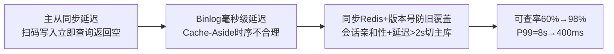
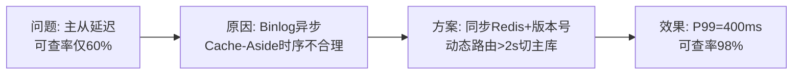

# 0001 软件架构风格 — 论文大纲记忆卡

> 对应范文：`04-软件架构风格论文范文-改写版.md`
> 标题：**论仓库风格在物流追踪系统中的应用**
> 适用考题：无直接真题（储备用）

---

## 论文脉络图

```mermaid
graph TD
    ROOT["<b>论仓库风格在物流追踪系统中的应用</b><br/>2024.01-07 | 50万注册 | 10万日活 | 500万条日轨迹<br/>200余家物流供应商 | B/S架构 | Java+Spring Cloud | 单实例MySQL<br/>角色:系统架构师 | 职责:架构设计+读写分离落地+团队协调"]

    ROOT --> P1["<b>一、项目背景</b><br/>业务痛点:日均10万→500万条 投诉200起/日 频繁超时<br/>技术痛点:MySQL I/O瓶颈 P99:300ms→8s 连接池溢出 可用性99.5%<br/>决策:亟需引入仓库风格读写分离架构改造升级"]

    P1 --> P2["<b>二、理论概述 · Garlan&Shaw五大风格分类体系</b><br/>①数据流:核心构件=过滤器/处理单元,连接件=管道/数据流,控制流=数据驱动单向(子风格:批处理/管道过滤器)<br/>②调用返回:核心构件=模块/对象/层,连接件=方法调用,控制流=显式同步(子风格:主程序子程序/OO/层次结构)<br/>③独立构件:核心构件=独立进程/事件源,连接件=消息传递/事件通道,控制流=隐式调用异步(子风格:进程通信/事件驱动)<br/>④虚拟机:核心构件=规则/指令,连接件=解释引擎,控制流=自定义执行语义(子风格:解释器/基于规则系统,规则与代码分离)<br/>⑤仓库⭐:核心构件=数据存储,连接件=数据访问接口,控制流=间接交互(子风格:黑板/数据库,本项目=读写分离变体)"]

    P2 --> P3["<b>三、理论展开 · 选型对比</b><br/>质量属性分析:仓库风格读写I/O隔离消除磁头和Buffer Pool竞争→性能+可用性最优<br/>CAP定理权衡:CP同步复制→网络分区写入阻塞物流链断裂 vs AP异步+最终一致性→毫秒延迟不崩溃→选AP<br/>三方案对比:单体不分库❌无法解决I/O瓶颈 | 读写分离✅最直接解决I/O竞争 团队15人运维够用 | 分库分表+微服务❌过度设计迁移风险大"]

    P3 --> P4["<b>四、实践应用</b><br/>【架构分层】ACL防腐层三层:策略模式(供应商ID路由解析器)+适配器模式(数据归一化状态码映射时区统一)+工厂模式(处理器创建)<br/>【存储层】一主三从MySQL:主库仅写入 从库1=用户实时查询 从库2=报表导出 从库3=BI分析, Binlog异步同步,不同优先级查询分散不同从库<br/>【缓存层】Redis Cache-Aside:写入同步更新Redis+版本号防旧覆盖,读取优先Redis未命中查从库回填,会话亲和性短时间同从库,延迟>2s切主库<br/><br/>问题1:主从同步延迟→扫码可查率仅60%<br/>原因:Binlog毫秒级异步延迟+Cache-Aside缓存写入时序不合理<br/>方案:事务提交后立即同步Redis+版本号控制+会话亲和性+动态路由延迟>2s切主库<br/>效果:P99:8s→400ms 可查率60%→98%<br/><br/>问题2:恶意无效Key攻击→缓存穿透+雪崩<br/>原因:无前置拦截请求穿透到MySQL+大量Key TTL相同集中过期回源<br/>方案:布隆过滤器前置判定+空值缓存短TTL兜底+TTL正负30%随机偏移<br/>效果:命中率95%+ 数据库负载稳定不波动"]

    P4 --> P5["<b>五、总结成效</b><br/>性能:QPS 500→6000+ | P99 8s→400ms | 平均1.5s→80ms | 主库CPU 95%→45%<br/>可用性:99.5%→99.99% | 可查率60%→98% | 滞留率12%→5%<br/>业务:投诉200→30起/日 支撑双十一高峰连续<br/>不足:布隆误判率低但仍存在需配合限流 | ACL代码随供应商膨胀维护成本高<br/>展望:引入CQRS查询模型完全独立减少Redis依赖 | 推动行业级物流轨迹标准协议"]
```

---

## 实践因果链

### 架构选型链

### CAP 权衡链

### 缓存补偿链

### 问题1: 主从延迟

### 问题2: 恶意Key攻击

---

## 量化数据速记

QPS: 500 → **6000+** | P99: 8s → **400ms** | 平均: 1.5s → **80ms**
可用性: 99.5% → **99.99%** | 主库CPU: 95% → **45%**
可查率: 60% → **98%** | 滞留率: 12% → **5%**
投诉: 200起/日 → **30起/日** | 缓存命中率: **95%+**

---

## 考场注意事项

- ⚠️ 若考「架构风格」：五大风格必须完整列出，每个含构件+连接件+控制流+子风格
- ⚠️ 若考「仓库/数据库风格」：重点论述读写分离 + CAP权衡 + 主从同步 + 缓存补偿
- ⚠️ 不要只写仓库风格一种，必须先覆盖五大分类体系
- ⚠️ 个人职责：架构设计 + 读写分离落地 + 团队协调
