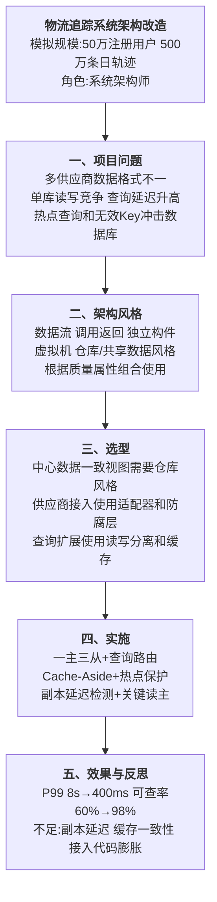

# 0001 软件架构风格 — 论文大纲记忆卡

> 对应范文：`04-软件架构风格论文范文-改写版.md`
>
> 训练标题：**论仓库风格在物流追踪系统中的应用**
>
> **数据说明：本文项目规模和量化指标为论文训练用模拟数据。**

## 一、论文主线



## 二、五类架构风格速记

| 类别 | 核心构件 | 典型连接件 | 适用重点 |
|------|----------|------------|----------|
| 数据流 | 过滤器、处理步骤 | 管道、数据流 | 分阶段转换、批处理和流处理 |
| 调用返回 | 模块、对象、层 | 方法调用、RPC | 分层组织和明确控制流程 |
| 独立构件 | 进程、服务、事件处理器 | 消息、事件通道 | 解耦、并发和异步协作 |
| 虚拟机 | 解释器、规则引擎 | 指令、规则和执行环境 | 规则变化频繁或需自定义语义 |
| 仓库/共享数据 | 中央数据存储、数据访问组件 | 查询和数据访问接口 | 多组件共享统一数据视图 |

> 实际系统通常是混合架构。论文重点不是机械列分类，而是说明为什么某一风格能满足题目中的质量属性。

## 三、选型逻辑

```text
统一轨迹数据视图
→ 需要共享数据中心
→ 选择仓库/数据库风格作为数据核心

多供应商协议不同
→ 需要隔离外部变化
→ 使用适配器和防腐层

读多写少且查询压力大
→ 需要独立扩展读取能力
→ 使用主从复制、查询路由和缓存
```

### 不采用的方案

- **继续单库单实例**：无法缓解读写竞争和故障影响面。
- **立即全面分库分表**：数据迁移和跨分片查询复杂度过高，当前规模下收益不足。
- **仅靠缓存**：不能解决持久化层读写竞争，也不能承担系统事实来源。

## 四、核心实现

### 4.1 数据与接入层

- 供应商适配器负责协议、状态码、时间和字段转换；
- 领域模型与外部模型之间通过防腐层隔离；
- 主库承担写入，多个只读副本分别承载实时查询、报表和分析；
- 路由层根据查询类型、延迟和一致性要求选择数据源。

### 4.2 Cache-Aside 正确口径

```text
读：查缓存
→ 未命中则查数据库
→ 回填缓存

写：更新数据库并提交
→ 删除缓存
→ 必要时通过消息或延迟校验处理并发脏数据
```

不要把“更新数据库后同步写缓存”直接称为标准 Cache-Aside。若采用主动更新缓存，应明确说明这是定制的一致性方案，并处理并发覆盖、失败补偿和顺序问题。

### 4.3 副本延迟与读己之写

- 普通轨迹查询允许短暂最终一致；
- 用户刚提交后的关键查询可短时间读主库；
- 通过版本号、提交时间或会话令牌识别新数据；
- 副本延迟超过阈值时自动摘除或回退主库；
- 不能用“选择 AP”一句话代替具体一致性策略。

### 4.4 缓存穿透与集中失效

- 布隆过滤器拦截明显不存在的 Key；
- 不存在的数据使用短 TTL 空值缓存；
- TTL 增加随机偏移，避免集中失效；
- 热点 Key 使用互斥重建或逻辑过期；
- 限流和监控作为兜底手段。

## 五、实践因果链


## 六、模拟指标统一表

| 指标 | 改造前 | 改造后 |
|------|--------|--------|
| QPS | 500 | 6000+ |
| P99 | 8s | 400ms |
| 平均响应 | 1.5s | 80ms |
| 可用性 | 99.5% | 99.99% |
| 主库 CPU | 95% | 45% |
| 写后可查率 | 60% | 98% |
| 投诉量 | 200 起/日 | 30 起/日 |

## 七、考场检查

- [ ] 是否准确说明五类架构风格及其构件、连接件和适用场景
- [ ] 是否根据质量属性说明为什么选仓库风格
- [ ] 是否承认实际方案是仓库、分层、适配器和缓存的混合架构
- [ ] Cache-Aside 写路径是否为“更新数据库后删除缓存”
- [ ] 是否具体说明副本延迟和读己之写策略
- [ ] 是否避免把 CAP 简化为脱离场景的 CP/AP 二选一
- [ ] 模拟指标是否前后一致且未冒充真实生产数据

---

*当前维护批次：2026-H2｜最后更新：2026-07-31*