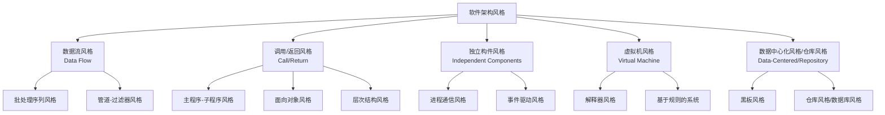
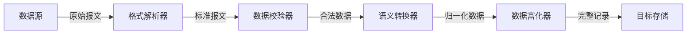
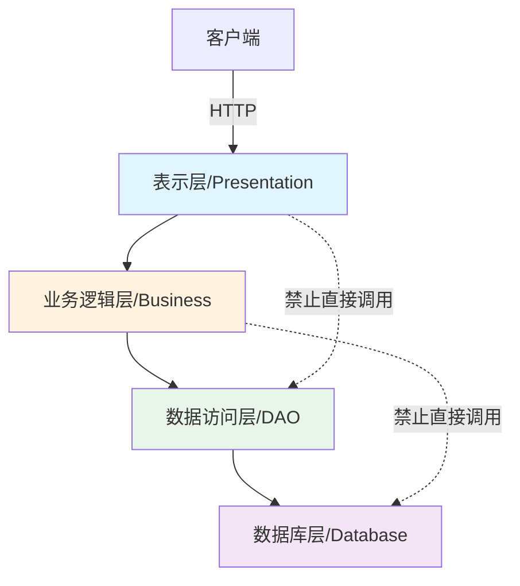
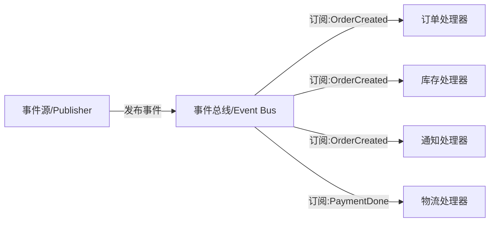
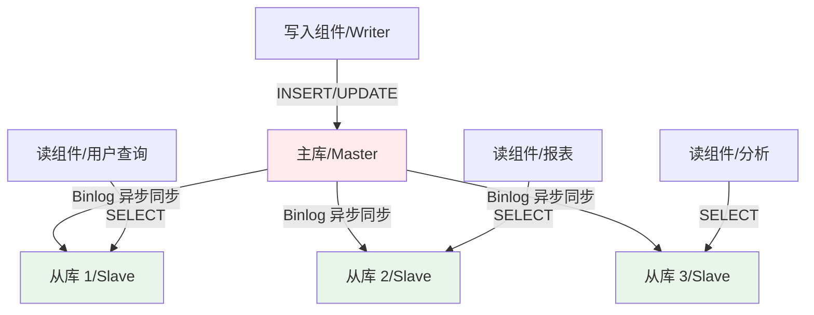
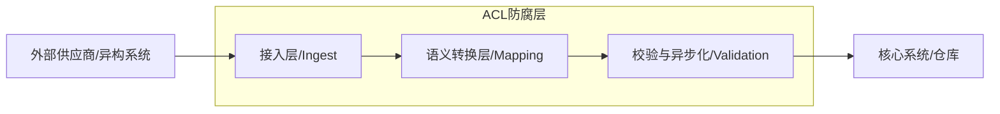
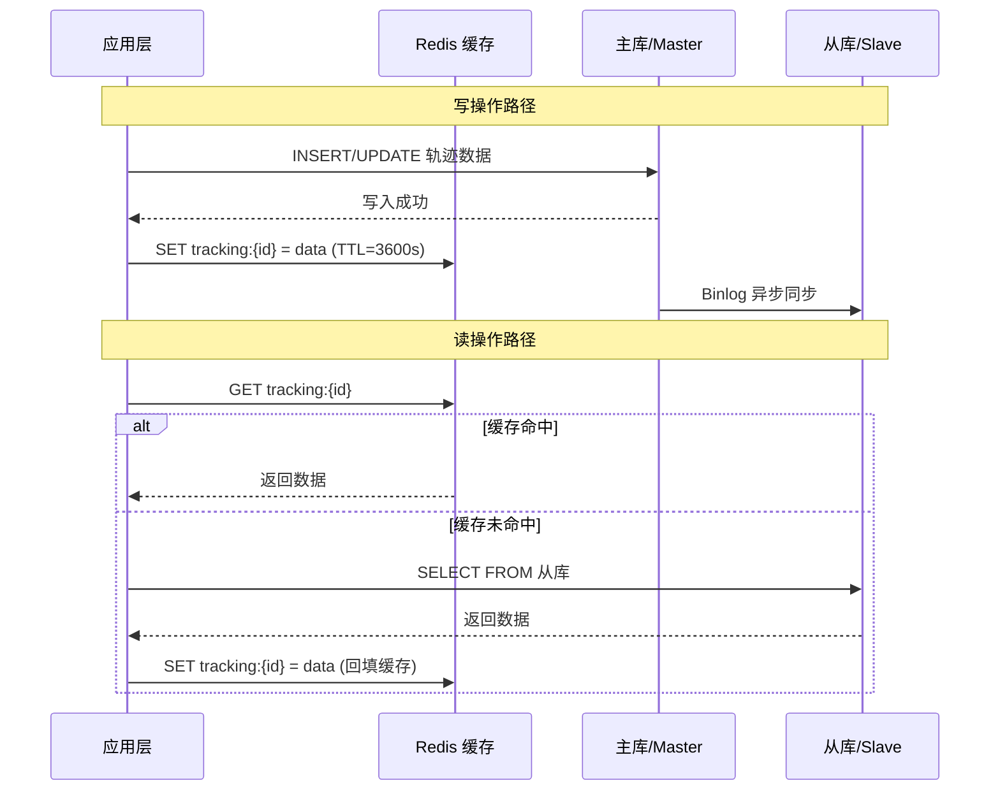
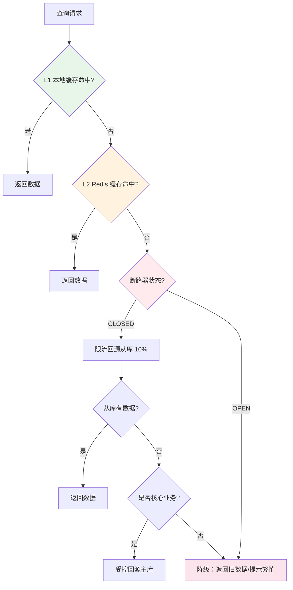

# 软件架构风格核心知识点

> 整理自 Google Gemini 学习对话 | 软考架构师论文专题 | 适用考试：系统架构设计师（2026 年 5 月）

---

## 一、软件架构风格定义与重要性

### 1.1 什么是软件架构风格

软件架构风格（Software Architecture Style）是对系统组织方式的模式化抽象。它定义了一类系统的**构件类型**、**连接件类型**以及**组合约束**，描述了系统中各组件如何交互、如何组织、如何传递数据。

> **架构师视角**：架构风格不是具体的技术选型（如"用 Spring Cloud 还是 Dubbo"），而是更高层次的结构模式（如"采用管道-过滤器风格"或"采用事件驱动风格"）。在论文中，必须先上升到风格层面，再落地到技术实现。

### 1.2 Garlan & Shaw 经典五大分类体系

David Garlan 和 Mary Shaw 在 1996 年提出的分类体系是软考架构师论文的核心理论基础。五大风格如下：



| 风格大类 | 核心构件 | 核心连接件 | 控制流特征 | 典型应用场景 |
|------|------|------|------|------|
| 数据流风格 | 过滤器/处理单元 | 管道/数据流通道 | 数据驱动，单向流动 | ETL、编译器、信号处理 |
| 调用/返回风格 | 模块/对象/层 | 方法调用/接口调用 | 显式同步调用 | 单体应用、OOP 系统、分层 Web 应用 |
| 独立构件风格 | 独立进程/事件源 | 消息传递/事件通道 | 隐式调用/异步通信 | 消息系统、GUI、微服务 |
| 虚拟机风格 | 规则/指令 | 解释引擎/推理机 | 自定义执行语义 | DSL 引擎、业务规则引擎 |
| 仓库风格 | 数据存储 | 数据访问接口 | 组件通过中央仓库间接交互 | 数据库系统、物流追踪系统 |

### 1.3 架构风格与质量属性的映射关系

架构风格直接影响系统的六大质量属性（ISO/IEC 25010）：

| 质量属性 | 最优风格 | 最差风格 | 原因分析 |
|------|------|------|------|
| 性能（Performance） | 管道-过滤器 | 层次结构 | 管道可并行执行，层次需逐层穿越 |
| 可修改性（Modifiability） | 微服务/事件驱动 | 单体主程序 | 独立部署/松耦合降低修改影响范围 |
| 可靠性（Reliability） | 事件驱动/黑板 | 管道-过滤器 | 事件驱动支持异步重试，管道断裂即全线崩溃 |
| 可测试性（Testability） | 管道-过滤器 | 黑板风格 | 过滤器可独立单元测试，黑板依赖全局状态 |
| 安全性（Security） | 层次结构 | 事件驱动 | 层次可在边界集中管控，事件广播难以加密隔离 |
| 可复用性（Reusability） | 管道-过滤器 | 主程序-子程序 | 过滤器是通用组件，子程序耦合主程序上下文 |

---

## 二、数据流风格（Data Flow）

### 2.1 批处理序列风格（Batch Sequential）

批处理序列风格将数据处理分为**若干个独立的阶段**，每个阶段完成特定转换，**前一个阶段完成后才能进入下一个阶段**。

| 特征 | 描述 |
|------|------|
| 数据流 | 阶段性，阶段间无重叠执行 |
| 控制流 | 顺序驱动，前阶段输出 = 后阶段输入 |
| 适用场景 | 离线 ETL、编译器前端→中端→后端、财务报表生成 |
| 优点 | 结构简单、易于理解、每个阶段可独立优化 |
| 缺点 | 串行执行导致延迟高、中间数据需落地存储、扩展性差 |

> **架构师视角**：如果考试题目中出现"每日凌晨批量处理"、"数据分阶段转换"，应优先考虑批处理序列风格。

### 2.2 管道-过滤器风格（Pipe & Filter）

管道-过滤器风格将系统拆分为多个**独立的过滤器（Filter）**，每个过滤器对输入数据执行一种变换，然后通过**管道（Pipe）**传递结果。



| 特征 | 描述 |
|------|------|
| 数据流 | 流式传输，过滤器可并行执行 |
| 控制流 | 数据驱动，有数据即触发处理 |
| 适用场景 | 实时数据清洗、日志处理管线、流媒体编解码 |
| 优点 | 高内聚低耦合、过滤器可复用、支持并行/分布式 |
| 缺点 | 数据转换开销、共享上下文困难、错误处理复杂 |

**批处理序列 vs 管道-过滤器对比**：

| 维度 | 批处理序列 | 管道-过滤器 |
|------|------|------|
| 执行方式 | 阶段串行，前阶段完成才进入下一阶段 | 流式并行，过滤器同时运行 |
| 延迟 | 高（等待整个批次完成） | 低（数据逐过滤器流动） |
| 中间数据存储 | 需落地到临时文件/表 | 内存管道传输 |
| 并行性 | 阶段间不可并行，阶段内可并行 | 过滤器天然并行 |
| 复用性 | 低（阶段定制化） | 高（过滤器通用） |

### 2.3 数据流风格适用场景总结

| 场景特征 | 推荐子风格 | 技术映射 |
|------|------|------|
| 离线批量、每天一次 | 批处理序列 | Hadoop MapReduce、定时 SQL |
| 实时流式、逐条处理 | 管道-过滤器 | Kafka Streams、Flink |
| 数据处理链路由多个独立步骤组成 | 管道-过滤器 | Spring Cloud Stream |

---

## 三、调用/返回风格（Call/Return）

### 3.1 主程序-子程序风格（Main Program & Subroutine）

最经典的架构风格，将系统组织为**一个主程序调用若干子程序（函数/过程）**的层次结构。

| 特征 | 描述 |
|------|------|
| 控制流 | 显式同步调用，调用者等待返回值 |
| 数据流 | 通过参数传递，调用栈管理 |
| 典型场景 | 传统 C/Go 程序、简单的 CRUD 系统 |
| 优点 | 结构清晰、易于理解、调试方便 |
| 缺点 | 紧耦合、扩展困难、单点故障影响全局 |

### 3.2 面向对象风格（Object-Oriented）

将系统组织为**一组相互协作的对象**，对象封装状态和行为，通过消息传递（方法调用）通信。

| 特征 | 描述 |
|------|------|
| 控制流 | 方法调用链，隐式通过对象引用 |
| 数据流 | 封装在对象内部，通过公开接口暴露 |
| 典型场景 | Java/C++ 应用、领域驱动设计（DDD） |
| 优点 | 封装性好、支持继承/多态、易于模拟现实 |
| 缺点 | 对象间依赖复杂、过度设计风险 |

### 3.3 层次结构风格（Layered）

将系统组织为**若干层次**，每一层为上层提供服务，依赖下层，**禁止跨层调用**。



**调用/返回风格子类型对比**：

| 风格 | 耦合度 | 扩展性 | 典型技术 | 适用场景 |
|------|------|------|------|------|
| 主程序-子程序 | 高（调用方强依赖） | 低 | C/Go 函数 | 简单工具程序 |
| 面向对象 | 中（接口解耦） | 中 | Java/Spring | 复杂业务系统 |
| 层次结构 | 低（层间接口化） | 高 | Spring MVC/MyBatis | Web 应用、企业系统 |

**层次结构的关键约束**：

| 约束 | 描述 | 违反后果 |
|------|------|------|
| 层间调用 | 只能调用直接下层，禁止跨层 | 破坏封装，增加耦合 |
| 层内高聚 | 每层职责单一、内部高内聚 | 功能散乱，维护成本高 |
| 数据传递 | 层间传递 DTO/VO，禁止暴露 Entity | 数据泄露、安全风险 |

> **架构师视角**：层次结构在增加跨层功能时面临挑战。例如"需要在表示层直接访问缓存"，这会破坏层次约束。解决方案是引入外观模式（Facade）或依赖注入（DI）容器。

---

## 四、独立构件风格（Independent Components）

### 4.1 进程通信风格（Communicating Processes）

系统由**多个独立运行的进程**组成，进程间通过**显式的消息传递**进行通信。

| 特征 | 描述 |
|------|------|
| 通信方式 | 同步或异步消息，显式发送/接收 |
| 控制流 | 各进程独立控制，消息触发处理 |
| 典型技术 | RPC、Socket、gRPC |
| 适用场景 | 分布式系统、微服务间调用 |

### 4.2 事件驱动风格（Event-Based / Implicit Invocation）

系统由**事件源**和**事件处理器**组成，事件源发布事件，处理器注册感兴趣的事件类型，**当事件发生时系统自动调用注册的处理器**（隐式调用）。



**事件驱动 vs 进程通信对比**：

| 维度 | 事件驱动（隐式调用） | 进程通信（显式调用） |
|------|------|------|
| 耦合方式 | 事件解耦，发布方不知晓订阅方 | 显式引用，调用方知道被调用方 |
| 时序性 | 异步，非阻塞 | 通常同步，阻塞等待 |
| 扩展性 | 高（新增订阅方无需修改发布方） | 低（新增调用需修改调用方） |
| 错误隔离 | 好（一个处理器崩溃不影响其他） | 差（调用链中任一节点崩溃影响全局） |
| 典型场景 | 消息队列、GUI 事件、微服务事件 | RPC 调用、同步 API |

### 4.3 仓库风格（Repository Style）

系统由**一个中央数据存储（仓库）**和**多个独立组件**组成，组件通过访问仓库进行间接交互，**组件之间不直接通信**。

**读写分离是仓库风格的变体**：将仓库拆分为**主库（Master，负责写入）**和**从库（Slave，负责读取）**，通过异步同步机制保持数据一致。



**仓库风格的核心特征**：

| 机制 | 原理说明 | 解决的问题 | 技术实现 |
|------|------|------|------|
| I/O 隔离 | 写库专注顺序写，读库专注随机读 | 消除读写 I/O 竞争 | MySQL 主从复制 |
| 水平扩展 | 从库可独立扩展数量 | 读并发能力提升 | 负载均衡 + 多从库 |
| 异步同步 | Binlog 记录变更并同步到从库 | 主库不受读查询影响 | Binlog + Relay Log |
| 故障隔离 | 从库故障不影响主库写入 | 提高系统可用性 | 自动故障切换 |

---

## 五、虚拟机风格（Virtual Machine）

### 5.1 解释器风格（Interpreter）

系统包含一个**自定义语言的解析器和执行引擎**，通过解释用户定义的脚本或规则来执行计算。

| 特征 | 描述 |
|------|------|
| 构件 | 指令集、解释引擎、执行上下文、存储区 |
| 连接件 | 指令的执行顺序、跳转、循环 |
| 适用场景 | 数据库 SQL 引擎、脚本语言解释器、工作流引擎 |
| 优点 | 用户可编程、灵活性极高、核心引擎可复用 |
| 缺点 | 执行效率低（相比编译执行）、引擎开发复杂度高 |

### 5.2 基于规则的系统（Rule-Based System）

系统由**规则库**和**推理引擎**组成，根据规则和事实进行逻辑推导。

| 特征 | 描述 |
|------|------|
| 构件 | 规则集合（IF-THEN）、事实库、推理引擎 |
| 推理方式 | 正向推理（数据驱动）或反向推理（目标驱动） |
| 适用场景 | 专家系统、风控规则引擎、定价策略引擎 |
| 优点 | 业务规则与代码分离、易于非技术人员维护 |
| 缺点 | 规则冲突检测困难、规则数量增长后性能下降 |

---

## 六、混合风格与实战设计

### 6.1 异构风格组合模式

现实中的大型系统很少仅使用单一风格，而是**多种风格的组合**。

| 组合方式 | 示例 | 逻辑一致性保障 |
|------|------|------|
| 层次 + 管道 | 整体分层，某一层内部用管道-过滤器处理流数据 | 层间通过 DTO 传递，管道输出转为标准 DTO |
| 层次 + 事件 | 层间事件驱动，层内同步调用 | 事件总线作为层间通信的中间件 |
| 仓库 + 管道 | 仓库风格存储数据，管道风格处理数据接入 | ACL 层将异构数据归一化后写入仓库 |
| 仓库 + 事件 | 仓库存储状态，事件驱动状态变更通知 | 数据变更后发布事件，触发下游处理 |

> **架构师视角**：在论文中描述混合风格时，必须说明"不同风格在一起工作时如何保持数据一致和通信流畅"。例如："整体采用仓库风格的读写分离架构，在数据接入层叠加管道-过滤器风格的 ACL 防腐处理层。"

### 6.2 防腐层（ACL）三层架构设计

防腐层（Anti-Corruption Layer）是在**新旧架构或内外系统交接处设立的转换层**，用于隔离外部系统的复杂性，防止"腐蚀"内部核心模型。



**ACL 三层架构职责分解**：

| 层级 | 职责 | 技术实现 | 设计模式 | 输入/输出 |
|------|------|------|------|------|
| 接入层 | 多协议接入、格式识别、报文接收 | Webhook/FTP/SOAP 适配 | Strategy 策略模式 | 异构报文 → 标准 Raw DTO |
| 语义转换层 | 数据归一化、状态映射、时区统一 | 状态机映射表、字符集转换 | Adapter 适配器模式 | Raw DTO → 标准领域模型（DO） |
| 校验与异步化 | 数据校验、去重、投递 MQ | 布隆过滤器、规则引擎 | Factory Method 工厂模式 | 标准 DO → Kafka Topic |

**防腐层适配器实现示例**：

```java
// 适配器模式：将某国邮政的异构报文转换为标准领域模型
public class PostalAdapter implements TrackingEventAdapter {
    @Override
    public TrackingEvent adapt(Object rawMessage) {
        // 某国邮政使用 XML 格式，状态码为整数
        PostalXmlMessage xml = (PostalXmlMessage) rawMessage;
        return TrackingEvent.builder()
            .trackingNo(xml.getWaybillNo())
            .status(mapPostalStatus(xml.getStatus()))  // 0→IN_TRANSIT, 1→DELIVERED
            .timestamp(convertToUTC(xml.getEventTime(), "Asia/Shanghai"))
            .location(normalizeLocation(xml.getLocation()))
            .build();
    }

    private TrackingStatus mapPostalStatus(int postalCode) {
        return switch (postalCode) {
            case 0 -> TrackingStatus.IN_TRANSIT;
            case 1 -> TrackingStatus.DELIVERED;
            case 2 -> TrackingStatus.RETURNED;
            default -> TrackingStatus.UNKNOWN;
        };
    }
}
```

### 6.3 架构演进逻辑与绞杀者模式

架构演进的核心逻辑：**触发点 → 过渡方案 → 目标架构**。

| 阶段 | 内容 | 示例 |
|------|------|------|
| 触发点（Trigger） | 导致架构必须重构的临界指标 | 单表数据量超亿级、P99 延迟超 8 秒、部署时长超 2 小时 |
| 过渡方案 | 从旧架构到新架构的渐进式迁移 | 绞杀者模式（Strangler Fig）：新旧交替逐步替换 |
| 目标架构 | 最终期望的架构形态 | 读写分离 + 缓存补偿 + 防腐层 |

**绞杀者模式的关键原则**：

| 原则 | 描述 | 注意事项 |
|------|------|------|
| 渐进替换 | 按功能模块逐步迁移，不一次性全量切换 | 避免"大爆炸"式重构的风险 |
| 双写兼容 | 新旧系统同时运行，数据双向同步 | 需解决数据一致性冲突 |
| 流量切换 | 通过网关/代理逐步将流量导向新系统 | 先非核心业务，再核心业务 |
| 回滚能力 | 每个阶段都可回退到旧架构 | 保持旧系统可用直至完全验证 |

---

## 七、读写分离风格深度解析（核心案例）

### 7.1 读写分离原理与 I/O 隔离机制

读写分离风格的核心理念是**将读取操作和写入操作物理隔离到不同的数据库实例**，从根本上消除 I/O 竞争。

**读写分离数据流**：

```
应用层写入请求 → 写入路由器 → 主库(Master) → Binlog → 从库1(Slave)
                                                      → 从库2(Slave)
                                                      → 从库3(Slave)
应用层读取请求 → 读取路由器 → 从库1/2/3(负载均衡)
```

**I/O 隔离的三层机制**：

| 隔离层 | 隔离原理 | 解决的具体问题 |
|------|------|------|
| 磁盘 I/O 层 | 主库专注顺序写（Sequential Write），从库专注随机读（Random Read） | 消除 B+ 树索引维护与查询扫描的磁盘头竞争 |
| 内存 I/O 层 | 从库 Buffer Pool 长期驻留高频查询页，不被写入操作挤出 | 提升缓存命中率，从磁盘级降至内存级响应 |
| 连接层 | 写连接池与读连接池物理隔离，避免长查询占用写入连接 | 防止复杂 SQL 阻塞实时写入 |

> **架构师视角**：读写分离不是简单的"加几个从库"。必须同步考虑三个配套机制：数据同步策略（Binlog 异步复制）、读写路由策略（根据 SQL 类型自动路由）、一致性保障（缓存补偿）。

### 7.2 主从同步延迟与 CAP 定理权衡

引入读写分离后，主从之间的**异步同步**必然产生延迟（通常毫秒到秒级）。

**业务现象**：快递员刚扫描完包裹（写入主库），用户立刻在手机上查不到记录（从库还没同步完）。

| 方案 | 一致性等级 | 可用性等级 | 延迟影响 | 适用场景 |
|------|------|------|------|------|
| 强一致性（同步复制） | 最高 | 最低 | 写入需等待所有从库确认 | 金融交易、支付系统 |
| 半同步复制 | 较高 | 中 | 写入需等待至少一个从库确认 | 对一致性要求较高的场景 |
| 最终一致性（异步复制 + 缓存补偿） | 中等 | 最高 | 写入立即返回，从库异步同步 | 物流追踪、内容查询 |

**物流追踪系统的 CAP 决策**：

| 矛盾选项 | 选择 | 理由 |
|------|------|------|
| 保一致性（查询回源主库） | 不选 | 主库在高并发下可能崩溃，导致全系统不可用 |
| 保可用性（优先读从库） | **选择** | 用户延迟几秒看到数据远比系统宕机的影响小 |

> **架构师视角**：在论文中，不能只说"我选了最终一致性"，必须说"我在 A、B 之间权衡，基于系统的核心价值（系统不崩溃比数据绝对实时更重要），最终选择了 A"。

### 7.3 Redis 缓存补偿方案（Cache-Aside 模式）

为弥补主从同步延迟，在写入主库的同时**同步更新 Redis 缓存**，利用内存操作的极速性遮掩数据间隙。

**Cache-Aside 读写时序**：



**缓存补偿方案对比**：

| 方案 | 实现方式 | 延迟 | 复杂度 | 适用场景 | 推荐度 |
|------|------|------|------|------|------|
| Cache-Aside（旁路缓存） | 应用层先查缓存，未命中再查 DB，写入时更新缓存 | 毫秒级 | 低 | 读多写少 | 推荐 |
| Write-Through（写穿模式） | 写入缓存时同步写入 DB | 低 | 中 | 强一致性要求高 | 可选 |
| Write-Behind（写回模式） | 先写缓存，异步批量写 DB | 高 | 高 | 写密集场景 | 不推荐 |
| 时间窗口补偿 | 写入时同时更新缓存 + 版本号，读取时比对版本 | 毫秒级 | 中 | 主从延迟明显 | 强烈推荐 |

**Cache-Aside 模式实现示例**：

```java
// 写操作：先入库，再更新缓存（带版本号防旧数据覆盖）
public void saveTrackingEvent(TrackingEvent event) {
    // 1. 写入主库
    trackingMapper.insert(event);

    // 2. 同步更新 Redis 缓存（带版本号）
    String key = "tracking:" + event.getTrackingNo();
    CacheEntry entry = new CacheEntry(
        event,
        System.currentTimeMillis(),  // 版本号（时间戳）
        3600                         // TTL
    );
    redisTemplate.opsForValue().set(key, entry, 3600, TimeUnit.SECONDS);
}

// 读操作：先查缓存，未命中再查从库
public TrackingEvent getTrackingEvent(String trackingNo) {
    String key = "tracking:" + trackingNo;

    // 1. 优先查 Redis
    CacheEntry cached = (CacheEntry) redisTemplate.opsForValue().get(key);
    if (cached != null) {
        return cached.getData();
    }

    // 2. 缓存未命中，查询从库
    TrackingEvent event = trackingSlaveMapper.selectByTrackingNo(trackingNo);
    if (event != null) {
        // 3. 回填缓存（防止缓存击穿）
        redisTemplate.opsForValue().set(key,
            new CacheEntry(event, System.currentTimeMillis(), 3600),
            3600, TimeUnit.SECONDS);
    }
    return event;
}
```

### 7.4 降级策略：熔断、分级缓存、主库兜底

当 Redis 宕机等极端情况发生时，必须有优雅的降级方案。

**三级降级架构**：



**三级降级策略对比**：

| 降级层级 | 组件 | 触发条件 | 策略动作 | 影响范围 |
|------|------|------|------|------|
| L1 | 本地缓存（Caffeine/Guava） | Redis 完全不可用时 | 返回本地缓存的最热数据（约 1000 条） | 仅影响非实时数据 |
| L2 | 断路器 + 限流 | Redis 部分可用或从库延迟 > 5 秒 | 只允许 10% 核心查询回源，其余返回"数据更新中" | 影响 90% 非核心查询 |
| L3 | 主库兜底 | 从库无数据且为核心业务 | 通过令牌桶限流，允许少量查询穿透到主库 | 仅影响关键业务 |

**断路器模式实现示例**：

```java
// 三级降级链路：L1 Caffeine → L2 Redis → L3 DB Fallback
public TrackingEvent getWithDegradation(String trackingNo) {
    // L1: 本地缓存
    TrackingEvent local = localCache.getIfPresent(trackingNo);
    if (local != null) return local;

    // L2: Redis 缓存
    try {
        CacheEntry cached = redisTemplate.get("tracking:" + trackingNo);
        if (cached != null) {
            localCache.put(trackingNo, cached.getData());
            return cached.getData();
        }
    } catch (RedisConnectionException e) {
        log.warn("Redis 不可用，触发降级", e);
    }

    // L3: 带限流的降级回源
    if (!circuitBreaker.tryAcquire()) {
        // 断路器打开，降级返回提示
        return TrackingEvent.degraded(trackingNo, "数据更新中，请稍后刷新");
    }

    try {
        TrackingEvent event = trackingSlaveMapper.selectByTrackingNo(trackingNo);
        if (event == null && isCoreBusiness(trackingNo)) {
            // 核心业务：受控回源主库
            event = trackingMasterMapper.selectByTrackingNo(trackingNo);
        }
        return event;
    } finally {
        circuitBreaker.release();
    }
}
```

---

## 八、架构风格选型决策矩阵

### 8.1 质量属性敏感度分析

架构选型的核心是识别系统的**敏感点**（影响特定质量属性的决策）和**权衡点**（同时影响多个属性的决策）。

| 质量需求 | 敏感风格 | 避免风格 | 敏感原因 |
|------|------|------|------|
| 高并发读 | 仓库风格（读写分离） | 层次结构 | 读写竞争是最大瓶颈 |
| 实时数据流处理 | 管道-过滤器 | 批处理序列 | 串行执行延迟过高 |
| 松耦合、独立部署 | 事件驱动/微服务 | 主程序-子程序 | 显式调用链紧耦合 |
| 异构系统集成 | 仓库风格 + ACL | 纯管道-过滤器 | 需要中心化数据归一化 |
| 用户界面交互 | 事件驱动（GUI 事件） | 批处理序列 | 用户操作是异步事件驱动 |

### 8.2 风格选型对比表

以"全球物流追踪系统"为例，架构选型过程：

| 评估维度 | 单体不分库 | 读写分离 + 仓库风格 | 分库分表 + 微服务 |
|------|------|------|------|
| 解决 I/O 瓶颈 | 不能 | 直接解决，主从隔离 | 能解决但复杂度高 |
| 实施成本 | 低 | 中 | 高 |
| 运维复杂度 | 低 | 中（需管理主从同步） | 高（服务发现、链路追踪） |
| 扩展性 | 差 | 读方向可扩展 | 全方位可扩展 |
| 一致性保障 | 强一致（单机事务） | 最终一致（需缓存补偿） | 最终一致（需分布式事务） |
| 团队规模适配 | 5 人以下 | 10-20 人 | 50 人以上 |
| 业务读写比 | 任意 | 读 >> 写（8:2）最佳 | 读写均可扩展 |

> **架构师视角**：架构风格的选型不是"越先进越好"，而是"最适合当前业务阶段"。对于日均 5000 万条数据的物流系统，读写分离在"解决问题"和"引入复杂度"之间取得了最优平衡。

---

## 软考高频考点总结

| 考点 | 对应风格 | 考察形式 | 复习优先级 |
|------|------|------|------|
| Garlan & Shaw 五大分类及子风格 | 全部 | 选择题、论文理论部分 | 最高 |
| 管道-过滤器 vs 批处理序列的区别 | 数据流风格 | 选择题（特征对比） | 高 |
| 事件驱动的隐式调用特征 | 独立构件风格 | 选择题、论文核心论点 | 高 |
| 层次结构的约束条件 | 调用/返回风格 | 选择题 | 高 |
| 仓库风格的读写分离变体 | 仓库风格 | 论文核心案例 | 最高 |
| 架构风格与质量属性的映射 | 全部 | 选择题、论文权衡论述 | 最高 |
| 敏感点与权衡点的概念 | 架构评估 | 论文论述 | 高 |
| 混合风格组合方式 | 实战设计 | 论文核心论点 | 中 |
| 绞杀者模式（架构演进） | 架构演进 | 论文反思与展望 | 中 |
| 黑板风格与仓库风格的区别 | 数据中心化风格 | 选择题（概念辨析） | 中 |
| 解释器风格的构件组成 | 虚拟机风格 | 选择题 | 低 |
| CAP 定理在架构中的体现 | 仓库风格 | 论文权衡论述 | 最高 |

---

## 术语对照表

| 中文术语 | 英文术语 | 缩写 | 说明 |
|------|------|------|------|
| 软件架构风格 | Software Architecture Style | — | 系统组织结构的模式化抽象 |
| 数据流风格 | Data Flow Style | — | 以数据流动为核心驱动的风格 |
| 批处理序列风格 | Batch Sequential Style | — | 分阶段串行处理数据的风格 |
| 管道-过滤器风格 | Pipe and Filter Style | — | 数据流经独立变换单元的风格 |
| 调用/返回风格 | Call/Return Style | — | 以方法调用为核心交互的风格 |
| 主程序-子程序风格 | Main Program & Subroutine Style | — | 经典的过程式调用风格 |
| 面向对象风格 | Object-Oriented Style | — | 以对象为基本单元的风格 |
| 层次结构风格 | Layered Style | — | 分层组织、层间依赖约束的风格 |
| 独立构件风格 | Independent Components Style | — | 组件独立运行、通过消息交互的风格 |
| 事件驱动风格 | Event-Driven Style | — | 基于发布-订阅的隐式调用风格 |
| 仓库风格 | Repository Style | — | 通过中央数据存储间接交互的风格 |
| 读写分离 | Read-Write Splitting | — | 仓库风格的变体，主从分离 |
| 虚拟机风格 | Virtual Machine Style | — | 提供自定义执行语义的风格 |
| 解释器风格 | Interpreter Style | — | 解析并执行用户自定义指令的风格 |
| 基于规则的系统 | Rule-Based System | — | 根据规则库进行逻辑推导的系统 |
| 黑板风格 | Blackboard Style | — | 多组件共享全局工作区的风格 |
| 防腐层 | Anti-Corruption Layer | ACL | 隔离外部系统复杂性的转换层 |
| 绞杀者模式 | Strangler Fig Pattern | — | 渐进式替换遗留架构的模式 |
| 质量属性 | Quality Attribute | — | 性能、可靠性、可修改性等系统属性 |
| 敏感点 | Sensitivity Point | — | 影响特定质量属性的架构决策 |
| 权衡点 | Trade-off Point | — | 同时影响多个质量属性的决策 |
| CAP 定理 | CAP Theorem | — | 一致性、可用性、分区容错性三选二 |
| 最终一致性 | Eventual Consistency | — | 数据最终会达成一致，但不保证实时 |
| 强一致性 | Strong Consistency | — | 任何读取都能获取最新写入的数据 |
| Cache-Aside 模式 | Cache-Aside Pattern | — | 应用层优先查缓存的缓存模式 |
| 断路器模式 | Circuit Breaker Pattern | — | 防止级联故障的降级模式 |
| 策略模式 | Strategy Pattern | — | 根据条件动态切换算法的设计模式 |
| 适配器模式 | Adapter Pattern | — | 将不兼容接口转换为目标接口的设计模式 |

*整理时间：2026 年 4 月 | 适用考试：系统架构设计师（2026 年 5 月）*
