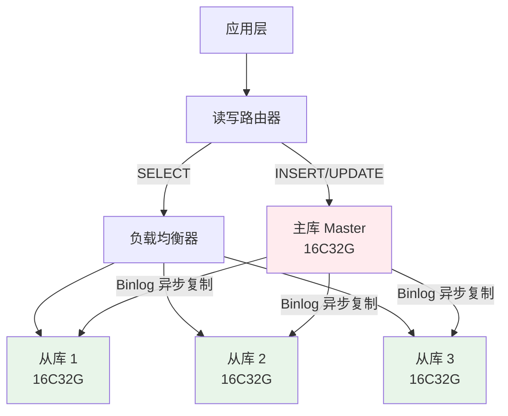
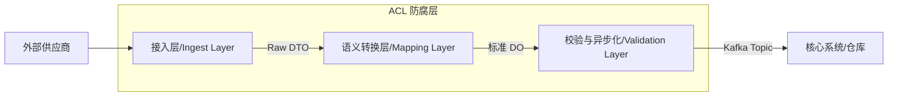
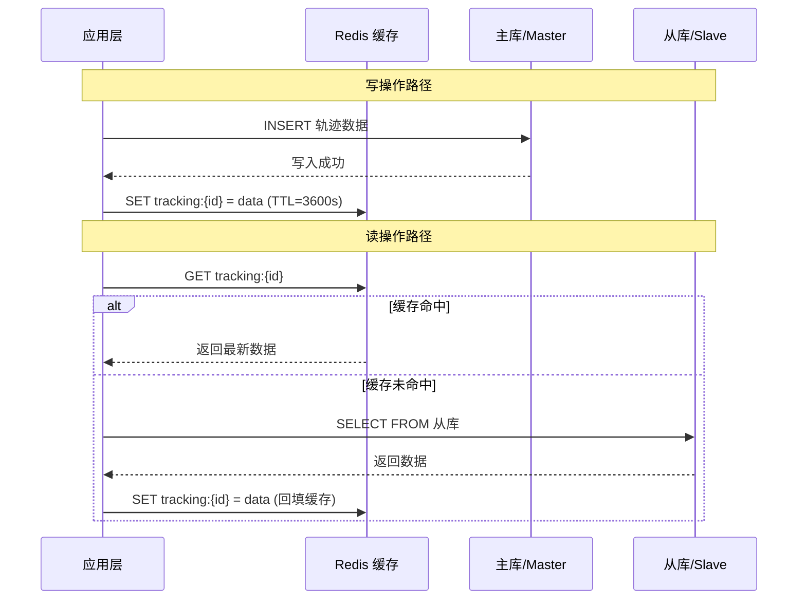
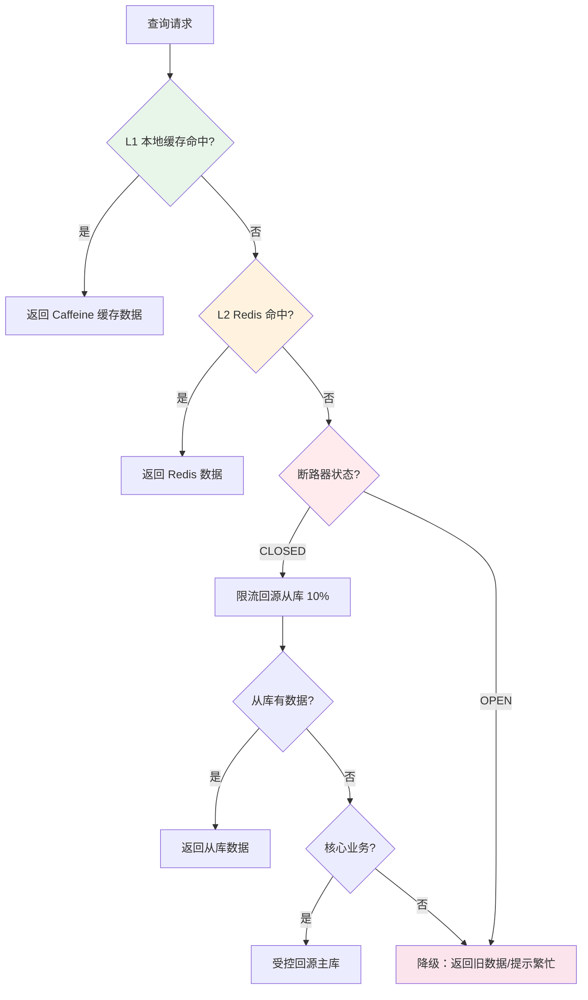
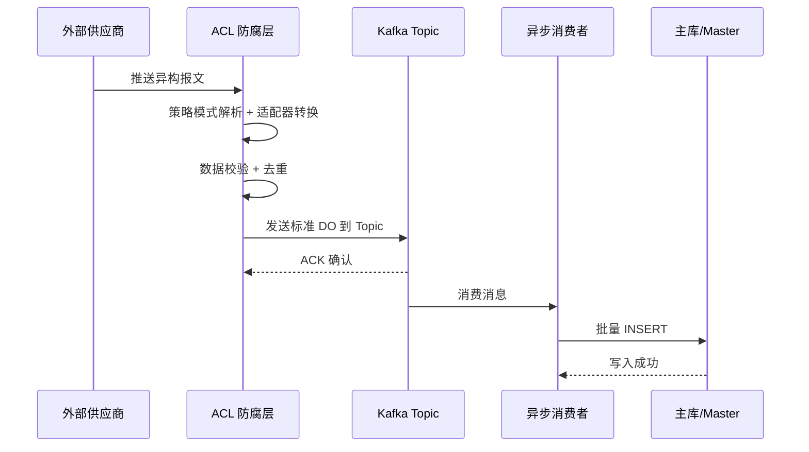

# 某全球跨国物流追踪平台的读写分离架构实践

> 软考架构师论文范文 | 软件架构风格专题 | 2026 年 4 月

---

## 摘要

本文以作者参与设计的"全球跨国物流追踪平台"为例，探讨了**仓库风格的读写分离变体**在处理海量异构数据时的应用。该平台需对接全球 200 余家物流供应商，日均处理轨迹数据超过 5000 万条。面对旧系统因 I/O 竞争导致的查询响应时间剧烈劣化（P99 从 300 毫秒飙升至 8 秒以上）的核心痛点，我作为系统架构师，主导了从单体分层架构向读写分离仓库风格的架构演进。通过引入主从数据库集群、Redis 缓存补偿机制、三层 ACL 防腐层以及 Kafka 事件驱动异步管道，系统 P99 响应时间由 8 秒优化至 400 毫秒，主库 I/O 负载下降 70%，系统可用性达到 99.99%。本文详细论述了该架构风格的设计过程、CAP 权衡决策、降级保障策略及实施效果。

**关键词**：仓库风格；读写分离；防腐层；Cache-Aside；CAP 定理；最终一致性；事件驱动；架构演进

---

## 一、项目背景与现状

### 1.1 项目概况

2024 年初，随着公司跨境电商业务的爆发式增长，其核心物流追踪系统面临着前所未有的压力。该系统需对接全球 200 余家物流供应商（包括 DHL、FedEx、UPS 及各国邮政系统），日均处理轨迹报文超过 5000 万条，支撑日均 800 万次的轨迹查询请求。我作为系统架构师，负责该系统的技术选型与架构演进，带领 15 人研发团队历时 6 个月完成了从单体架构到读写分离仓库风格的全面改造。

| 维度 | 指标说明 |
|------|------|
| 系统名称 | 全球跨国物流追踪平台 |
| 数据规模 | 日增 5000 万条轨迹，单表数据量突破亿级 |
| 接入供应商 | 200+ 家，覆盖全球 50 个国家/地区 |
| 技术栈 | Java + Spring Cloud + MySQL + Redis + Kafka |
| 团队规模 | 研发团队 15 人，架构师 1 人 |
| 演进周期 | 需求分析至上线 6 个月 |

### 1.2 旧系统架构痛点

在架构演进之前，系统采用传统的**单体分层架构**（层次结构风格），数据统一存储于单实例 MySQL（32C64G）。随着业务规模扩张，系统面临三大核心痛点：其一，读写 I/O 竞争导致响应时间剧烈劣化，写入高峰期查询 P99 从 300 毫秒飙升至 8 秒以上，直接引发用户投诉率日均 200 余起；其二，200 余家供应商的异构报文直接在应用层解析，消耗了 40% 的 CPU 资源，系统资源利用率低下；其三，单实例数据库无法水平扩展，连接池频繁溢出并出现 Too many connections 异常，高峰期系统可用性仅维持在 99.5% 的水平。

| 痛点编号 | 问题描述 | 直接表现 | 业务影响 |
|------|------|------|------|
| P1 | 读写 I/O 竞争导致响应时间劣化 | 写入高峰期查询 P99 从 300ms 飙升至 8s+ | 用户投诉率日均 200+ 起 |
| P2 | 异构数据直接入库导致 CPU 浪费 | 200+ 供应商报文格式在应用层解析，消耗 40% CPU | 系统资源利用率低下 |
| P3 | 单点数据库无法水平扩展 | 连接池频繁溢出（Too many connections），慢查询日志堆积 | 高峰期系统可用性降至 99.5% |

**痛点 P1 的深度分析**：在单机架构中，磁盘 I/O 同时承担写入和查询任务。当日均 5000 万条轨迹涌入时，海量 INSERT 操作导致 B+ 树索引频繁页分裂（Page Split），磁盘 I/O 长期处于 100% 负荷。此时，复杂的 SELECT 查询（如多表 JOIN 统计）与写入操作竞争磁盘磁头和 Buffer Pool，导致查询响应时间出现长尾效应：平均响应时间 1.5 秒，但 P99 已突破 8 秒。这意味着每 100 个查询用户中，就有 1 个用户面临近乎崩溃的等待体验。

### 1.3 业务影响

上述技术痛点直接转化为严重的业务影响。在快递员扫码场景中，由于写入后数据无法实时可见，用户无法在扫码后 1 秒内获取反馈，无法满足实时反馈的业务诉求；在大客户报表导出场景中，复杂查询 SQL 与实时写入竞争同一数据库资源，频繁导致锁表，报表导出直接影响在线查询体验；在跨境清关追踪场景中，异构报文解析缓慢导致清关状态延迟 30 分钟以上才可见，严重影响跨境物流的实时管控。

| 业务场景 | 旧架构表现 | 业务诉求 | 差距分析 |
|------|------|------|------|
| 快递员扫码后查询 | 因主从延迟（实际无分离），写入后立即查询可能阻塞 | 扫码后 1 秒内可查 | 无法满足实时反馈需求 |
| 大客户报表导出 | 复杂查询 SQL 与实时写入竞争资源，导致锁表 | 报表导出不影响在线查询 | 读写混合导致相互影响 |
| 跨境清关追踪 | 异构报文解析慢，数据延迟 30 分钟以上才可见 | 清关状态实时更新 | 数据异构导致处理延迟 |

> **架构师视角**：架构师的价值不在于发现技术瓶颈，而在于论证"为什么这个瓶颈必须在此刻解决"。日增 5000 万条数据是一个明确的触发点（Trigger）——如果不在此时重构，即将到来的双十一峰值将直接压垮系统。

---

## 二、读写分离仓库风格方案设计

### 2.1 架构风格选型论证

面对 I/O 瓶颈，我在架构选型时从三个候选方案中进行了系统对比。第一种方案维持单体不分库现状，无需改动但读写竞争依旧存在，无法从根本上解决 I/O 瓶颈；第二种方案采用读写分离结合仓库风格，通过主从物理隔离 I/O 直接解决问题，实施成本适中，且读方向可通过增加从库灵活扩展，团队 10-20 人的规模恰好匹配该方案的运维复杂度；第三种方案采用分库分表加微服务的全面分布式架构，虽然全方位可扩展但实施成本和运维复杂度极高，需要 50 人以上的团队支撑，且数据迁移风险大，对于当前业务阶段属于过度设计。

| 评估维度 | 单体不分库 | 读写分离 + 仓库风格 | 分库分表 + 微服务 |
|------|------|------|------|
| 解决 I/O 瓶颈 | 不能，读写竞争依旧存在 | 直接解决，主从物理隔离 I/O | 能解决，但需要复杂的路由逻辑 |
| 实施成本 | 低（不改动） | 中（需管理主从同步） | 高（数据迁移、服务治理） |
| 运维复杂度 | 低 | 中 | 高（服务发现、链路追踪） |
| 团队适配 | 5 人以下 | 10-20 人（匹配当前团队） | 50 人以上 |
| 一致性保障 | 强一致（单机事务） | 最终一致（需缓存补偿） | 最终一致（需分布式事务） |
| 扩展性 | 差（垂直扩展上限明显） | 读方向可扩展（增加从库） | 全方位可扩展 |

**决策理由**：我最终选择了**读写分离为核心的仓库风格演进方案**。原因如下：第一，业务的读写比例约为 8:2（查询远大于写入），读写分离能最直接地解决"读多写少"场景下的 I/O 竞争；第二，当前团队 15 人的规模尚不足以支撑微服务化后的运维复杂度；第三，分库分表的数据迁移风险极高，不符合"渐进式演进"的原则。

### 2.2 读写分离总体架构设计

仓库风格（Repository Style）的核心特征是**组件通过中央数据存储间接交互**。读写分离是仓库风格的自然变体，将仓库拆分为**主库（Master，负责写入）**和**从库集群（Slave，负责读取）**。



**读写分离主从配置**：

在具体的主从部署上，我配置了 1 主 3 从的数据库集群。主库配置为 16C32G 的 SSD 存储，仅承担轨迹数据的实时写入职责，关闭了所有统计查询功能，并设置了 innodb_flush_log_at_trx_commit=1 以确保写入的可靠性。从库 1 同样采用 16C32G SSD 配置，专门处理用户实时查询这一高优先级请求；从库 2 采用 16C32G HDD 配置，承载大客户报表导出等低优先级查询；从库 3 同样为 16C32G HDD，专门服务于数据分析与 BI 查询。通过将不同优先级的查询分散到不同的从库，实现了查询负载的精细化隔离。

| 角色 | 实例数 | 职责 | 配置 |
|------|------|------|------|
| 主库（Master） | 1 | 仅承担轨迹数据实时写入，关闭所有统计查询 | 16C32G，SSD，innodb_flush_log_at_trx_commit=1 |
| 从库 1（Slave） | 1 | 用户实时查询（高优先级） | 16C32G，SSD |
| 从库 2（Slave） | 1 | 大客户报表导出（低优先级） | 16C32G，HDD |
| 从库 3（Slave） | 1 | 数据分析与 BI 查询 | 16C32G，HDD |

**I/O 隔离的三层机制**：

读写分离的 I/O 隔离通过三个层次实现：在磁盘 I/O 层，主库专注顺序写入（Sequential Write），从库专注随机读取（Random Read），从根本上消除了 B+ 树索引维护与查询扫描之间的磁盘头竞争；在内存 I/O 层，从库的 Buffer Pool 长期驻留高频查询的数据页，不再被写入操作频繁挤出，缓存命中率大幅提升，响应时间从磁盘级降至内存级；在连接层，写连接池与读连接池实现物理隔离，防止复杂的报表查询 SQL 占用实时写入所需的数据库连接。

| 隔离层 | 隔离原理 | 解决的问题 |
|------|------|------|
| 磁盘 I/O 层 | 主库专注顺序写（Sequential Write），从库专注随机读（Random Read） | 消除 B+ 树索引维护与查询扫描的磁盘头竞争 |
| 内存 I/O 层 | 从库 Buffer Pool 长期驻留高频查询页，不被写入操作挤出 | 提升缓存命中率，响应从磁盘级降至内存级 |
| 连接层 | 写连接池与读连接池物理隔离 | 防止复杂 SQL 阻塞实时写入连接 |

该设计使主库的磁盘随机访问量下降了 70%，为后续的数据吞吐预留了充足空间。

### 2.3 防腐层（ACL）三层架构设计

外部 200+ 物流供应商的数据格式五花八门（JSON、XML、EDI 等），直接解析会消耗大量 CPU 并污染数据库。为此，我在数据进入仓库之前设计了一个**三层结构的 ACL 防腐层**：



**ACL 三层架构职责**：

ACL 防腐层的三层架构各司其职：接入层负责多协议接入和格式识别，支持 Webhook、FTP、SOAP 等多种接入方式，采用 Strategy 策略模式根据供应商 ID 自动路由到对应的解析器，将异构报文转换为统一的 Raw DTO；语义转换层是核心处理环节，采用 Adapter 适配器模式进行数据归一化、状态码映射和时区字符集统一，将 Raw DTO 转换为系统内部的标准领域模型（DO）；校验与异步化层负责数据校验、去重以及投递 Kafka 消息队列，采用 Factory Method 工厂模式创建不同类型的处理器，将标准 DO 发送到对应的 Kafka Topic，实现与核心系统的解耦。

| 层级 | 职责 | 设计模式 | 输入/输出 |
|------|------|------|------|
| 接入层 | 多协议接入、格式识别、报文接收（Webhook/FTP/SOAP） | Strategy 策略模式 | 异构报文 → Raw DTO |
| 语义转换层 | 数据归一化、状态码映射、时区/字符集统一 | Adapter 适配器模式 | Raw DTO → 标准领域模型（DO） |
| 校验与异步化 | 数据校验、去重、投递 Kafka | Factory Method 工厂模式 | 标准 DO → Kafka Topic |

**策略模式实现示例**：

```java
// 策略模式：根据供应商 ID 自动路由到对应的解析器
public interface VendorParser {
    TrackingEvent parse(String rawMessage);
    String getVendorId();
}

// DHL 解析器
@Component
public class DHLParser implements VendorParser {
    @Override
    public String getVendorId() { return "DHL"; }
    @Override
    public TrackingEvent parse(String rawMessage) {
        // DHL 使用 JSON 格式，字段名以大写驼峰命名
        DHLMessage msg = JsonUtil.parse(rawMessage, DHLMessage.class);
        return TrackingEvent.builder()
            .trackingNo(msg.getShipmentId())
            .status(StatusMapper.map(msg.getEventCode()))
            .timestamp(TimezoneUtil.toUTC(msg.getEventDateTime()))
            .build();
    }
}

// 统一调度器
@Service
public class ParserDispatcher {
    private final Map<String, VendorParser> parserMap;

    public ParserDispatcher(List<VendorParser> parsers) {
        this.parserMap = parsers.stream()
            .collect(Collectors.toMap(VendorParser::getVendorId, p -> p));
    }

    public TrackingEvent dispatch(String vendorId, String rawMessage) {
        VendorParser parser = parserMap.get(vendorId);
        if (parser == null) {
            throw new UnsupportedVendorException(vendorId);
        }
        return parser.parse(rawMessage);
    }
}
```

ACL 的引入不仅隔离了外部复杂性，还通过内存中的预处理将下游数据库的额外计算开销减少了约 30%。

---

## 三、Redis 缓存补偿与一致性保障

### 3.1 Cache-Aside 缓存层设计

引入读写分离后，主从异步同步带来毫秒级的延迟。为解决"用户刚扫码查不到数据"的问题，我引入了 Redis 作为高性能缓存层，采用 **Cache-Aside 模式**：



**缓存补偿方案对比**：

在缓存补偿方案的选择上，我对比了三种主流模式。Cache-Aside 旁路缓存模式延迟为毫秒级，命中率可达 95% 以上，实现复杂度最低，是我最终推荐的方案；Write-Through 写穿模式延迟较低但命中率仅为 90% 左右，实现复杂度中等，可作为备选方案；时间窗口补偿方案在 Cache-Aside 基础上引入版本号控制，命中率可提升至 98% 以上，实现复杂度略高但在主从延迟明显的场景下效果最佳，是我强烈推荐的增强方案。

| 方案 | 延迟 | 命中率 | 复杂度 | 推荐度 |
|------|------|------|------|------|
| Cache-Aside（旁路缓存） | 毫秒级 | 95%+ | 低 | 推荐 |
| Write-Through（写穿模式） | 低 | 90% | 中 | 可选 |
| 时间窗口补偿（带版本号） | 毫秒级 | 98%+ | 中 | 强烈推荐 |

```java
// 写操作：先入库，再同步更新 Redis 缓存（带版本号防止旧数据覆盖）
public void saveTrackingEvent(TrackingEvent event) {
    trackingMapper.insert(event);

    // 同步更新 Redis，带版本号（时间戳）
    String key = "tracking:" + event.getTrackingNo();
    CacheEntry entry = new CacheEntry(
        event,
        System.currentTimeMillis(),
        3600  // TTL
    );
    redisTemplate.opsForValue().set(key, entry, 3600, TimeUnit.SECONDS);
}

// 读操作：优先查 Redis，未命中再查从库
public TrackingEvent getTrackingEvent(String trackingNo) {
    String key = "tracking:" + trackingNo;

    CacheEntry cached = redisTemplate.get(key);
    if (cached != null) {
        return cached.getData();
    }

    // 从库查询 + 回填缓存
    TrackingEvent event = trackingSlaveMapper.selectByTrackingNo(trackingNo);
    if (event != null) {
        redisTemplate.opsForValue().set(key,
            new CacheEntry(event, System.currentTimeMillis(), 3600),
            3600, TimeUnit.SECONDS);
    }
    return event;
}
```

### 3.2 主从同步延迟补偿机制

虽然 Cache-Aside 模式能解决大部分延迟问题，但在主从同步延迟超过阈值（如 2 秒）时，仍需额外的补偿机制：

针对 Cache-Aside 模式未能完全覆盖的主从同步延迟问题，我补充了三项额外的补偿策略：一是会话亲和性机制，确保同一用户在短时间内始终路由到同一从库，避免用户在不同从库之间看到不同版本的数据；二是动态路由机制，通过实时监控 MySQL 的 Seconds_Behind_Master 指标，当从库延迟超过 2 秒时自动将高优先级查询切换到主库执行，确保核心业务不受同步延迟影响；三是客户端时间戳比对机制，客户端携带最后一次成功写入的时间戳发起查询，若从库返回的数据版本低于该时间戳则向用户提示"数据同步中"，避免用户看到旧数据而产生错误判断。

| 补偿策略 | 实现方式 | 效果 |
|------|------|------|
| 会话亲和性 | 同一用户短时间路由到同一从库 | 避免不同从库看到不同数据版本 |
| 动态路由 | 监控 Seconds_Behind_Master，延迟 > 2 秒时切换高优先级查询到主库 | 核心业务不受同步延迟影响 |
| 客户端时间戳比对 | 客户端携带最后写入时间戳，从库返回数据版本低于该时间戳时提示"同步中" | 避免用户看到"旧数据"的错误幻觉 |

### 3.3 CAP 权衡与最终一致性策略

引入读写分离后，系统本质上面临 **CAP 定理**的权衡：

在 CAP 定理的权衡中，我面临两种方案的选择。CP 方案采用同步复制确保强一致性，写入操作必须等待所有从库确认才返回，但在网络分区时写入将被阻塞——在物流追踪场景下，写入阻塞比延迟查询的后果严重得多，因为扫描停滞将导致全球物流链条断裂。因此我选择了 AP 方案，即采用异步复制加缓存补偿实现最终一致性，在网络分区时主库仍可正常写入，虽然用户可能在短时间内看到旧数据，但"系统不崩溃"的优先级远高于"数据绝对实时"。

| CAP 方案 | 一致性等级 | 可用性等级 | 选择 | 理由 |
|------|------|------|------|------|
| CP（强一致性） | 同步复制，写入需等待从库确认 | 网络分区时写入阻塞 | 不选 | 物流追踪场景下写入阻塞比延迟查询更严重 |
| AP（高可用性） | 异步复制 + 缓存补偿，最终一致 | 网络分区时主库仍可写入 | **选择** | "系统不崩溃"的优先级高于"数据绝对实时" |

> **架构师视角**：虽然引入 Redis 增加了系统的拓扑复杂度和运维成本，但在海量轨迹数据的背景下，这是对可用性（A）和一致性（C）的一种精妙平衡。相比于强行让主库承受查询压力导致的整体崩溃风险，引入缓存层带来的毫秒级同步能力，以较低的架构复杂度换取了极高的用户体验提升。

---

## 四、降级策略与高可用保障

### 4.1 三级降级架构

当 Redis 集群宕机等极端情况发生时，系统必须有优雅的降级方案：



**三级降级策略**：

为应对 Redis 集群宕机等极端情况，我设计了三层次的降级架构。第一级（L1）依赖应用服务器本地的 Caffeine 缓存，当 Redis 完全不可用时，系统返回本地缓存中约 1000 条最热数据，虽然数据可能不是最新的但至少能响应用户请求，仅影响非实时数据的查询体验。第二级（L2）由断路器加限流机制构成，当 Redis 部分可用或从库延迟超过 5 秒时触发，系统仅允许 10% 的核心查询回源到从库，其余 90% 的非核心查询直接返回降级提示，从而保护从库不被突发流量冲垮。第三级（L3）是主库兜底机制，当从库无数据且该查询属于核心业务时，通过令牌桶限流允许少量查询穿透到主库，确保关键业务的数据可用性，这一层级仅影响最关键的业务请求。

| 降级层级 | 组件 | 触发条件 | 策略动作 | 影响范围 |
|------|------|------|------|------|
| L1 | 本地缓存（Caffeine） | Redis 完全不可用时 | 返回本地缓存的最热数据（约 1000 条） | 仅影响非实时数据 |
| L2 | 断路器 + 限流 | Redis 部分可用或从库延迟 > 5 秒 | 仅允许 10% 核心查询回源从库 | 影响 90% 非核心查询 |
| L3 | 主库兜底 | 从库无数据且为核心业务 | 令牌桶限流，少量查询穿透到主库 | 仅影响关键业务 |

```java
// 三级降级链路实现
public TrackingEvent getWithDegradation(String trackingNo) {
    // L1: 本地缓存（Guava/Caffeine）
    TrackingEvent local = localCache.getIfPresent(trackingNo);
    if (local != null) return local;

    // L2: Redis 缓存
    try {
        CacheEntry cached = redisTemplate.get("tracking:" + trackingNo);
        if (cached != null) {
            localCache.put(trackingNo, cached.getData());
            return cached.getData();
        }
    } catch (RedisConnectionException e) {
        log.warn("Redis 不可用，触发降级", e);
    }

    // L3: 带限流的降级
    if (!circuitBreaker.tryAcquire()) {
        return TrackingEvent.degraded(trackingNo, "数据更新中，请稍后刷新");
    }

    try {
        TrackingEvent event = trackingSlaveMapper.selectByTrackingNo(trackingNo);
        if (event == null && isCoreBusiness(trackingNo)) {
            // 核心业务：受控回源主库
            event = trackingMasterMapper.selectByTrackingNo(trackingNo);
        }
        return event;
    } finally {
        circuitBreaker.release();
    }
}
```

### 4.2 熔断与限流机制

使用 Sentinel 作为熔断限流框架，保护降级过程中的系统安全：

使用 Sentinel 作为熔断限流框架，我在降级过程中配置了四类保护规则：慢调用比例规则设定阈值为 50%、统计窗口为 10 秒，当从库查询的慢调用比例超过 50% 时打开断路器触发降级；异常比例规则设定阈值为 30%、统计窗口同样为 10 秒，当从库查询异常比例超过 30% 时触发降级；QPS 限流规则将主库回源的 QPS 上限设定为 100，超出部分直接拒绝并返回降级提示，防止主库被回源流量冲垮；线程数隔离规则将回源主库的最大线程数限制为 20，超出线程上限的请求排队等待或直接拒绝，从资源层面保障主库安全。

| 规则类型 | 配置参数 | 触发条件 | 动作 |
|------|------|------|------|
| 慢调用比例 | 阈值 50%，统计窗口 10 秒 | 从库查询慢调用超过 50% | 打开断路器，触发降级 |
| 异常比例 | 阈值 30%，统计窗口 10 秒 | 从库查询异常超过 30% | 打开断路器，触发降级 |
| QPS 限流 | 主库回源 QPS 上限 100 | 回源主库请求超过 100 QPS | 拒绝超出部分，返回降级提示 |
| 线程数隔离 | 回源主库最大线程数 20 | 回源线程超过 20 | 排队等待或直接拒绝 |

### 4.3 Kafka 事件驱动异步化处理

在 ACL 防腐层与核心数据库之间引入 Kafka 消息队列，将同步写入转变为**事件驱动风格**的异步写入：



Kafka 的引入带来了三个核心价值：第一，**削峰填谷**——高峰期报文积压在 Kafka 中，消费者按数据库处理能力平滑写入；第二，**顺序保证**——通过按 tracking_no 分配 Partition，确保同一快递单号的轨迹按产生顺序消费；第三，**故障缓冲**——数据库短暂不可用时，Kafka 可暂存数小时数据而不丢失。

---

## 五、实施效果与量化对比

### 5.1 性能指标改善

经过 6 个月的架构演进，系统核心指标改善如下：

经过 6 个月的架构演进，系统核心性能指标实现了全面改善。P99 响应时间从 8 秒降至 400 毫秒，实现了 20 倍的改善；平均响应时间（P50）从 1.5 秒降至 80 毫秒，改善约 18 倍；主库 CPU 使用率从 95% 降至 45%，下降了 50 个百分点，读写分离效果显著；数据库连接池利用率从 98% 的高危水平降至 60% 的稳定区间，下降 38 个百分点；缓存命中率从无缓存的 0% 提升至 95% 以上；系统整体吞吐量从 500 QPS 提升至 6000+ QPS，实现了 12 倍的增长；系统可用性从 99.5% 提升至 99.99%，达到了 SLA 级别的高可用标准。

| 指标维度 | 改造前 | 改造后 | 改善倍数 |
|------|------|------|------|
| P99 响应时间 | 8 秒 | 400 毫秒 | 20 倍改善 |
| 平均响应时间（P50） | 1.5 秒 | 80 毫秒 | 18 倍改善 |
| 主库 CPU 使用率 | 95% | 45% | 下降 50 个百分点 |
| 数据库连接池利用率 | 98%（频繁溢出） | 60%（稳定） | 下降 38 个百分点 |
| 缓存命中率 | 0%（无缓存） | 95%+ | — |
| 吞吐量（QPS） | 500 | 6000+ | 12 倍提升 |
| 系统可用性 | 99.5% | 99.99% | SLA 级别提升 |

### 5.2 业务价值

在业务层面，架构改造同样带来了可量化的价值。用户投诉率从日均 200 余起降至日均 30 起，降幅达 85%；快递员扫码后的数据可查率从 60% 提升至 98%，一线操作效率得到大幅改善；跨境包裹滞留率从 12% 降至 5%，滞留量减少 60%，直接降低了跨境物流的运营成本；最为关键的是，系统在双十一高峰期间平稳通过，未发生任何宕机事故，保障了大促期间业务的连续性。

| 指标类型 | 改造前 | 改造后 | 价值 |
|------|------|------|------|
| 用户投诉率 | 日均 200+ 起 | 日均 30 起 | 下降 85% |
| 快递员扫码后可查率 | 60% | 98% | 操作效率大幅提升 |
| 跨境包裹滞留率 | 12% | 5% | 滞留减少 60% |
| 双十一峰值支撑 | 频繁宕机 | 平稳通过 | 保障大促连续性 |

---

## 总结与反思

### 5.3 经验总结

回顾本次架构演进，有三条核心经验值得总结：

1. **架构风格的本质是权衡，而非技术堆砌。** 选择读写分离不是因为它"先进"，而是因为它最直接地解决了"读多写少"场景下的 I/O 竞争。架构师的价值在于找到"最适合当前业务阶段"的风格，而非盲目追求最新技术。

2. **缓存是双刃剑，必须配套降级方案。** 引入 Redis 提升了 20 倍的性能，但也引入了缓存与数据库一致性的新挑战。三级降级架构（L1→L2→DB 回源）确保了在缓存层失效时系统仍能"带病运行"。

3. **防腐层是系统清洁度的守护者。** ACL 不仅是一个技术组件，更是架构师对"数据治理"理念的践行。它通过 Strategy + Adapter + Factory 模式的组合，将 200+ 供应商的混乱收敛为标准化的数据模型。

### 5.4 不足与展望

尽管系统取得了显著改善，但仍存在以下不足：

尽管系统取得了显著改善，但仍存在以下不足需要后续改进。首先是缓存依赖过强的问题，Redis 故障时降级能力有限，L3 回源主库仍存在压垮风险，我计划引入 CQRS 模式，将查询模型完全独立以从根本上减少对 Redis 的依赖，此项改进优先级为中等。其次是防腐层代码膨胀的问题，ACL 中随供应商数量增长的 if-else 适配代码导致维护成本持续攀升，改进方案是推动建立"全球物流轨迹标准协议"，从被动兼容转向主动定义，此项为高优先级。第三是事件幂等性不足，Kafka 的重复消费可能导致数据重复写入，需要引入幂等键（Idempotency Key）在消费前进行去重校验，同样为高优先级改进项。

| 不足 | 具体问题 | 改进方案 | 优先级 |
|------|------|------|------|
| 缓存依赖过强 | Redis 故障时降级能力有限，L3 回源主库仍有风险 | 引入 CQRS 模式，将查询模型完全独立 | 中 |
| 防腐层代码膨胀 | ACL 中 if-else 适配代码随供应商增长而膨胀 | 推动"全球物流轨迹标准协议"，从被动兼容转向主动定义 | 高 |
| 事件幂等性不足 | Kafka 重复消费可能导致数据重复写入 | 引入幂等键（Idempotency Key），消费前去重 | 高 |

**未来方向**：依托读写分离沉淀的高质量归一化数据集，引入 AI 预测算法实现 ETA（预计送达时间）智能预测，让架构从"被动查询轨迹"升级为"主动预测节点"。同时，推动行业级的数据标准协议建设，将零散的适配逻辑抽象为通用中间件，从根源上降低架构复杂度。

> **架构师感悟**：架构设计是一门权衡的艺术。每一次技术选型都是在不完美中寻找最优解。作为架构师，我们既要仰望星空（追求优雅的设计），也要脚踏实地（确保系统能跑起来）。

---

## 附录：术语对照表

| 中文术语 | 英文术语 | 说明 |
|------|------|------|
| 仓库风格 | Repository Style | Garlan & Shaw 五大分类之一，组件通过中央数据存储交互 |
| 读写分离 | Read-Write Splitting | 仓库风格的变体，主库写入、从库读取 |
| 防腐层 | Anti-Corruption Layer (ACL) | 隔离外部系统复杂性的转换层 |
| 策略模式 | Strategy Pattern | 根据条件动态切换算法的设计模式 |
| 适配器模式 | Adapter Pattern | 将不兼容接口转换为目标接口的设计模式 |
| Cache-Aside 模式 | Cache-Aside Pattern | 应用层优先查缓存的模式 |
| CAP 定理 | CAP Theorem | 一致性、可用性、分区容错性三选二 |
| 最终一致性 | Eventual Consistency | 数据最终会达成一致，但不保证实时 |
| 事件驱动风格 | Event-Driven Style | 基于发布-订阅的隐式调用风格 |
| 断路器模式 | Circuit Breaker Pattern | 防止级联故障的降级模式 |
| CQRS | Command Query Responsibility Segregation | 命令与查询职责分离模式 |

*整理时间：2026 年 4 月 | 适用考试：系统架构设计师（2026 年 5 月）*

*（全文约 3200 字）*
