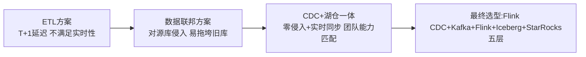
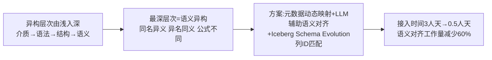
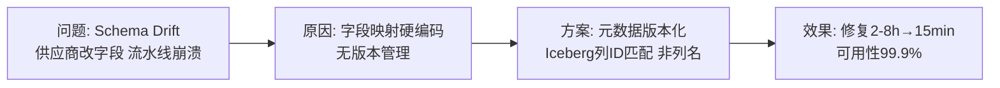
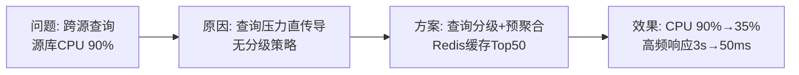

# 0002 多元异构数据集成 — 论文大纲记忆卡

> 对应范文：`04-多元异构数据集成论文范文-改写版.md`
> 标题：**论多源异构数据集成在企业中的应用**
> 适用考题：2021年(数据集成)、2023年(数据中台)、2025年(异构数据)

---

## 论文脉络图

```mermaid
graph TD
    ROOT["<b>论多源异构数据集成在企业中的应用</b><br/>2025.01-07 | 日均5TB增量 峰值TPS 8万+<br/>5套ERP 3套CRM 300+供应商API 20+物流商<br/>角色:系统架构师 | 职责:架构设计+技术选型+核心模块落地"]

    ROOT --> P1["<b>一、项目背景</b><br/>跨境电商全球供应链数据中台<br/>业务痛点:语义不一致→负库存逻辑错误 超卖缺货率上升15%<br/>技术痛点:模式漂移每月3-5次生产事故 每次修复2-8小时<br/>决策:亟需CDC+湖仓一体流式集成方案"]

    P1 --> P2["<b>二、理论概述 · 异构数据四层次</b><br/>①介质与通信异构:不同OS/DBMS/网络环境 最浅层次<br/>②语法异构:SQL表格 vs JSON vs XML vs 非结构化文件<br/>③结构异构:同概念不同组织方式 地址全串vs拆分字段<br/>④语义异构⭐:同名异义 异名同义 计算公式不同 最深层次"]

    P2 --> P3["<b>三、理论展开 · 选型对比</b><br/>质量属性:实时性+零侵入性为核心诉求<br/>三方案对比:ETL❌T+1延迟不满足实时性 | 数据联邦❌对源库有侵入性 易拖垮旧库 | CDC+湖仓一体✅零侵入+实时同步<br/>最终选型:CDC监听Binlog + Kafka传输 + Flink计算 + Iceberg存储 + StarRocks服务"]

    P3 --> P4["<b>四、实践应用</b><br/>【五层架构】采:Flink CDC监听Binlog+API接入 | 传:Kafka+Schema Registry校验 | 算:Flink SQL流批一体+元数据映射 | 存:S3+Iceberg ACID+Schema Evolution | 服:StarRocks统一SQL查询<br/><br/>问题1:模式漂移Schema Drift<br/>→原因:字段映射硬编码 供应商改字段导致流水线崩溃<br/>→方案:元数据版本化+Iceberg Schema Evolution列ID匹配<br/>→效果:修复时间2-8h→15min 可用性99.9%<br/><br/>问题2:跨源查询拖垮源库<br/>→原因:查询压力直传导 日均10万次查询致源库CPU 90%<br/>→方案:查询分级+高频保留联邦 重查询预聚合+Redis缓存Top50<br/>→效果:源库CPU 90%→35% 高频响应3s→50ms"]

    P4 --> P5["<b>五、总结成效</b><br/>性能:延迟24h→3min | TPS 8万→12万 | 接入时间3人天→0.5人天<br/>质量:超卖率下降15% | 语义对齐减少60%(LLM辅助)<br/>不足:LLM复杂业务逻辑推导仍有提升空间 元数据表初期设计简单维护成本高<br/>展望:引入Data Contracts机制 推动数据质量责任向提供方 探索Data Mesh架构"]
```

---

## 实践因果链

### 架构选型链

### 四层异构权衡链

### 问题1: 模式漂移

### 问题2: 跨源查询拖垮

---

## 量化数据速记

延迟: 24h → **3min** | TPS: 8万 → **12万** | 接入时间: 3人天 → **0.5人天**
Schema Drift修复: 2-8h → **15min** | 超卖率: 上升15% → **下降15%**
源库CPU: 90% → **35%** | 高频查询响应: 3s → **50ms**
语义对齐工作量: 逐字段手动 → **LLM辅助减少60%**

---

## 考场注意事项

- ⚠️ 若考「数据集成」：四层次异构必须完整列出（介质→语法→结构→语义），逐层深入
- ⚠️ 若考「异构数据」：重点论述CDC选型理由（ETL延迟、联邦侵入性）+ 五层架构
- ⚠️ 不要只写湖仓一体，必须覆盖异构四层次理论体系
- ⚠️ 个人职责：架构设计 + 技术选型 + 核心模块落地
- ⚠️ 问题必须包含 Schema Drift（元数据版本化）和 查询拖垮源库（分级策略）两个问题
