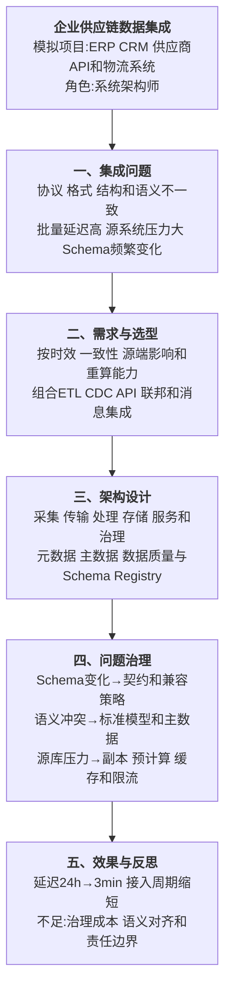

# 0002 多元异构数据集成 — 论文大纲记忆卡

> 对应范文：`04-多元异构数据集成论文范文-2026H2.md`
>
> 训练标题：**论多源异构数据集成在企业供应链平台中的应用**
>
> **数据说明：数据规模、延迟、TPS 和效果指标均为论文训练用模拟数据。**

## 一、论文主线



## 二、异构的四个观察层次

| 层次 | 典型问题 | 主要治理手段 |
|------|----------|--------------|
| 平台与通信 | OS、数据库、协议和网络不同 | 连接器、网关、驱动和协议适配 |
| 语法与格式 | 表、JSON、XML、文件编码不同 | 解析、序列化、格式标准和 Schema |
| 结构 | 字段拆分、层次和主键组织不同 | 映射、规范模型、数据契约和转换规则 |
| 语义 | 同名异义、异名同义、口径和单位不同 | 业务术语表、主数据、指标口径和人工治理 |

这是一种分析框架，不必宣称是所有教材唯一固定的“四层分类”。实际项目还需考虑时效、一致性、数据质量、安全和数据所有权。

## 三、集成方式选择

| 方式 | 适用场景 | 优点 | 主要限制 |
|------|----------|------|----------|
| 批量 ETL/ELT | T+1 报表、大批历史数据、复杂转换 | 吞吐高、可重跑、审计清晰 | 延迟高、批窗口和依赖管理复杂 |
| CDC | 数据库增量变更实时同步 | 延迟低、减少业务代码改造 | 仍消耗日志和网络资源，需处理快照、DDL、重复与顺序 |
| API 集成 | 业务命令、查询和明确服务契约 | 语义清楚、权限和错误可控 | 时间耦合、限流、版本和可用性依赖 |
| 消息/事件 | 异步通知、削峰和多消费者 | 解耦时间、便于扩展消费者 | 幂等、顺序、重试、Schema 演进复杂 |
| 数据联邦 | 低频跨源查询、数据不宜复制 | 数据保持在源端、上线快 | 查询压力传导、跨源优化和一致性困难 |
| 文件交换 | 外部机构、离线批量和监管报送 | 边界清晰、可留档 | 时效低、格式与补传治理复杂 |

> CDC 不是“零侵入”。它通常减少业务代码侵入，但仍需要日志权限、初始快照、资源容量、Schema 变更和安全治理。数据联邦也不是天然会拖垮源库，关键在查询频率、下推能力、隔离和资源限制。

## 四、六层架构

```text
数据源
→ 采集接入：CDC、API、文件、消息
→ 可靠传输：Kafka/Pulsar、重试、死信和回放
→ 处理转换：清洗、标准化、关联、质量校验
→ 存储管理：湖仓、数仓、主数据和元数据
→ 数据服务：SQL、API、指标、搜索和订阅
→ 横向治理：安全、质量、血缘、契约和成本
```

### 4.1 元数据与数据契约

- 技术元数据记录表、字段、类型、分区和血缘；
- 业务元数据记录术语、口径、负责人和适用范围；
- Schema Registry 管理消息结构和兼容策略；
- Data Contract 明确生产者、消费者、SLO、质量规则和变更流程；
- 自动兼容只能处理部分结构变化，不能自动解决业务语义改变。

### 4.2 主数据与语义统一

```text
识别核心实体
→ 定义唯一标识和标准属性
→ 建立匹配、合并和生存规则
→ 明确权威来源与数据负责人
→ 发布 Golden Record
→ 监控冲突和质量
```

LLM 可以辅助字段推荐、术语匹配和文档生成，但最终语义口径必须由业务负责人确认，并经过样本评估和人工审核。

## 五、实践因果链

### 5.1 Schema 变化


Iceberg 等表格式可以借助列 ID 支持部分重命名和演进，但不能保证所有类型变更、删除和语义改变都自动安全。

### 5.2 源库压力


### 5.3 语义冲突


## 六、数据质量与可观测性

| 维度 | 示例指标 |
|------|----------|
| 完整性 | 必填字段缺失率 |
| 唯一性 | 重复实体和重复事件比例 |
| 准确性 | 与权威来源或规则的符合率 |
| 一致性 | 跨系统口径和状态一致率 |
| 及时性 | 数据新鲜度、端到端延迟 |
| 有效性 | 类型、枚举、范围和业务规则通过率 |

同时监控采集 Lag、吞吐、失败率、重试、死信、Schema 变化、血缘影响和消费方 SLO。

## 七、模拟指标统一表

| 指标 | 改造前 | 改造后 |
|------|--------|--------|
| 数据可见延迟 | 24 小时 | 3 分钟 |
| 峰值处理能力 | 8 万 TPS | 12 万 TPS |
| 新数据源接入 | 3 人天 | 0.5 人天 |
| Schema 故障恢复 | 2—8 小时 | 15 分钟 |
| 源库 CPU | 90% | 35% |
| 高频查询 P99 | 3 秒 | 50ms |
| 关键语义冲突 | 基线 | 减少 60% |

## 八、考场检查

- [ ] 是否从平台、格式、结构和语义多个层次说明异构
- [ ] 是否根据时效、一致性、源端影响和重算选择集成方式
- [ ] 是否避免把 CDC 写成完全零侵入
- [ ] 是否说明 Schema 演进不能自动解决语义变化
- [ ] 是否包含元数据、主数据、质量、血缘和数据契约
- [ ] LLM 辅助语义对齐是否保留人工确认和评估
- [ ] 是否说明源系统隔离、限流和安全权限
- [ ] 模拟指标是否前后一致且未冒充真实项目数据

---

*当前维护批次：2026-H2｜最后更新：2026-08-01*