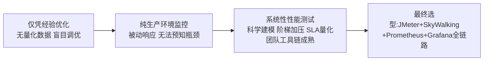
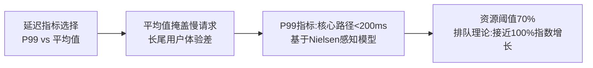
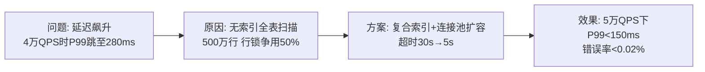
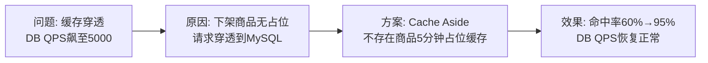

# 0003 测试 — 论文大纲记忆卡

> 对应范文：`03-系统性能测试论文范文-改写版.md`
> 标题：**系统性能测试在电商交易系统中的应用**
> 适用考题：2019年(性能测试)、2022年(软件测试)、2024年(测试策略)

---

## 论文脉络图

```mermaid
graph TD
    ROOT["<b>论系统性能测试在电商交易系统中的应用</b><br/>2024.03-08 | 15微服务模块 日均100万+订单 促销50倍峰值<br/>Spring Cloud+MySQL+Redis集群+Kafka+K8s<br/>角色:系统架构师 | 职责:测试方案设计+SLA定义+核心链路优化"]

    ROOT --> P1["<b>一、项目背景</b><br/>电商交易平台 促销期间流量暴增50倍<br/>业务痛点:核心接口延迟100ms→5s+ 订单转化率暴跌65%<br/>技术痛点:DB连接池耗尽 请求排队超时<br/>决策:亟需系统性性能测试+核心链路优化"]

    P1 --> P2["<b>二、理论概述 · 性能测试四大分类</b><br/>①负载测试⭐:验证预期峰值负载下是否满足SLA 验证需求 不能发现系统极限<br/>②压力测试:逐步加压找到崩溃临界点 暴露薄弱环节 可能导致宕机<br/>③稳定性测试:固定负载持续8-72h 发现慢性问题 内存泄漏<br/>④并发测试:多用户同时访问同一资源 暴露数据一致性问题 超卖 死锁"]

    P2 --> P3["<b>三、理论展开 · SLA设计与测试方法</b><br/>P99延迟优于平均值(掩盖慢请求) 核心交易路径P99<200ms(Nielsen感知模型)<br/>TPS估算:日订单量×80/20法则×3倍安全系数<br/>资源利用率阈值70%(排队理论:接近100%时响应指数增长)<br/>测试环境:1:4缩比 脱敏生产数据保证真实性<br/>工具链:JMeter脚本+1-3s思考时间 阶梯加压1万→5万QPS"]

    P3 --> P4["<b>四、实践应用</b><br/>【工具链】JMeter压测+SkyWalking全链路追踪+Prometheus+Grafana实时监控<br/><br/>问题1:DB慢查询导致延迟飙升<br/>→原因:product_id无索引 全表扫描500万行 行锁争用占查询50%时间<br/>→方案:添加复合索引idx_product_stock 连接池50→200 超时30s→5s<br/>→效果:5万QPS下P99稳定<150ms 错误率<0.02%<br/><br/>问题2:缓存穿透致DB QPS飙升<br/>→原因:下架商品无占位缓存 请求穿透到MySQL QPS达5000<br/>→方案:Cache Aside模式 不存在商品缓存5分钟占位<br/>→效果:命中率60%→95% DB QPS恢复正常"]

    P4 --> P5["<b>五、总结成效</b><br/>性能:P99 5s+→150ms | TPS 3000→35000(约10倍) | 错误率<0.02%<br/>可用性:99.5%→99.995% | 月成本80万→50万(年省360万)<br/>不足:全链路监控缺乏业务指标关联 灰度发布策略需完善<br/>展望:性能测试集成CI/CD流水线 每次提交自动触发基线测试 构建业务监控看板关联技术指标与转化率"]
```

---

## 实践因果链

### 架构选型链

### SLA设计权衡链

### 问题1: DB慢查询

### 问题2: 缓存穿透

---

## 量化数据速记

P99延迟: 5s+ → **150ms** | TPS: 3000 → **35000** | 可用性: 99.5% → **99.995%**
缓存命中率: 60% → **95%** | 月成本: 80万 → **50万**（年省360万）
错误率: 0.15% → **<0.02%** | 连接池: 50 → **200**

---

## 考场注意事项

- ⚠️ 若考「性能测试」：四大分类必须完整列出（负载/压力/稳定性/并发），每类含目的+特点+局限
- ⚠️ 若考「测试策略」：重点论述SLA设计（P99优于平均值）+ TPS估算（80/20法则×3倍安全）
- ⚠️ 强调P99延迟指标 不要写平均延迟 平均会掩盖慢请求
- ⚠️ 资源利用率阈值70%基于排队理论 接近100%时响应指数增长
- ⚠️ 个人职责：测试方案设计 + SLA定义 + 核心链路优化 + 跨团队协调
