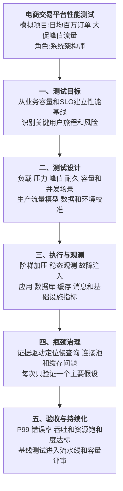
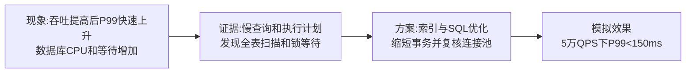

# 0003 测试 — 论文大纲记忆卡

> 对应范文：`03-系统性能测试论文范文-改写版.md`
>
> 训练标题：**论系统性能测试在电商交易平台中的应用**
>
> **数据说明：业务规模、负载模型和效果指标均为论文训练用模拟数据。**

## 一、论文主线



## 二、测试类型选择

性能测试并不存在所有场景都必须采用的固定“四大分类”。应根据目标选择测试类型：

| 测试类型 | 回答的问题 | 典型执行方式 |
|----------|------------|--------------|
| 基线测试 | 当前版本在标准负载下表现如何 | 固定环境和负载，建立可比较基准 |
| 负载测试 | 预期业务负载下是否满足 SLO | 按真实流量模型运行到稳态 |
| 压力测试 | 超出设计负载后如何退化和失败 | 逐步加压至饱和、错误或保护触发 |
| 峰值/突发测试 | 流量快速变化时是否稳定 | 短时间陡增和快速回落 |
| 耐久/稳定性测试 | 长时间运行是否泄漏或劣化 | 持续数小时或数天运行 |
| 容量测试 | 当前资源能支撑多大业务规模 | 调整数据量、并发和资源，建立容量曲线 |
| 并发与竞争测试 | 同时操作共享资源是否正确 | 同 Key、同库存、同账户并发操作 |
| 故障与韧性测试 | 依赖故障时是否降级和恢复 | 注入延迟、断网、实例和依赖故障 |

测试类型的名称在不同资料中可能有重叠。论文重点是目标、负载模型、观测指标和验收标准，而不是机械背分类数量。

## 三、性能目标与负载模型

### 3.1 指标体系

| 类别 | 指标 |
|------|------|
| 用户体验 | P50/P95/P99、页面或接口完成时间 |
| 业务结果 | 下单成功率、支付成功率、库存一致率 |
| 流量 | RPS/QPS/TPS、并发用户、消息吞吐 |
| 可靠性 | 错误率、超时率、重试率、降级率 |
| 资源 | CPU、内存、GC、磁盘、网络、连接和线程 |
| 依赖 | 数据库等待、缓存命中、消息 Lag、外部 API 延迟 |

P99 不是永远优于平均值，而是用于观察尾延迟。完整报告应同时保留分位数、平均值、最大值、错误率和吞吐，并根据业务 SLO 选择重点。

### 3.2 负载模型

```text
历史访问日志和业务预测
→ 识别关键用户旅程
→ 计算请求比例、并发、到达率和思考时间
→ 加入日常、峰值和异常场景
→ 校准数据量、缓存冷热和账户分布
```

不要套用“80/20 × 3 倍安全系数”作为通用 TPS 公式。容量估算应基于实际业务量、峰值窗口、请求放大、增长预测和风险余量。

### 3.3 环境等价性

缩比环境只有在确认组件拓扑、数据量、网络、限额和瓶颈能够按比例映射时才可推算。更可靠的方法是记录差异、进行模型校准，并对关键瓶颈使用接近生产的环境。

## 四、执行方法

```text
环境与数据校验
→ 预热缓存和JIT
→ 小流量冒烟
→ 阶梯加压
→ 每级达到稳态
→ 采集业务、应用和资源指标
→ 找到拐点与瓶颈
→ 修改一个主要因素后复测
```

- 资源利用率没有固定 70% 通用阈值；
- CPU、队列、连接、IO 和外部依赖的饱和点不同；
- 重点观察吞吐停止增长、延迟快速上升和错误率增加的拐点；
- 测试必须设置停止条件，避免破坏共享环境或生产系统。

## 五、实践因果链

### 5.1 慢查询



连接池不是越大越好。扩大连接池可能把压力转移到数据库并增加上下文切换，应根据数据库并发能力、查询时长和排队策略计算，并通过压测验证。

### 5.2 缓存穿透


Cache-Aside 读路径是缓存未命中后读取数据库并回填；写路径通常是更新数据库后删除缓存。空值缓存只是防穿透措施之一。

### 5.3 长时间劣化


## 六、可观测性与结果解释

- 使用关联 ID 将用户请求、日志、指标和追踪连接起来；
- 对客户端、网关、服务、数据库、缓存、消息和基础设施分层观测；
- 区分客户端限速、压测机瓶颈和被测系统瓶颈；
- 报告置信区间、测试重复次数和环境差异；
- 性能提升后重新检查正确性、可用性和成本，避免只优化速度。

## 七、模拟指标统一表

| 指标 | 优化前 | 优化后 |
|------|--------|--------|
| 峰值吞吐 | 3000 TPS | 35000 TPS |
| P99 | 5 秒以上 | 150ms |
| 错误率 | 0.15% | 少于 0.02% |
| 缓存命中率 | 60% | 95% |
| 数据库连接等待 | 明显排队 | 保持在 SLO 内 |
| 72 小时耐久测试 | 延迟持续劣化 | 无持续劣化 |

> 成本变化需要单独做容量和账单分析，不能只由一次性能压测推导“年省多少钱”。

## 八、持续性能工程

- 为关键接口保存版本化基线；
- PR 或日常流水线运行小规模回归测试；
- 发布前进行容量、峰值和耐久测试；
- 生产环境用 SLI/SLO 和真实用户监控验证；
- 性能回归超过阈值时阻止发布或要求明确豁免；
- 定期更新负载模型，防止测试脚本与业务脱节。

## 九、考场检查

- [ ] 是否先定义业务目标、SLO 和关键用户旅程
- [ ] 是否根据目标选择负载、压力、峰值、耐久等测试
- [ ] 是否避免使用固定 TPS 公式和固定资源阈值
- [ ] 是否同时观测尾延迟、吞吐、错误率和资源饱和度
- [ ] 是否用证据定位瓶颈，而不是直接罗列优化手段
- [ ] 连接池调整是否考虑数据库真实容量
- [ ] 是否复测并验证正确性、韧性和成本副作用
- [ ] 模拟指标是否前后一致且未冒充真实项目数据

---

*当前维护批次：2026-H2｜最后更新：2026-07-31*