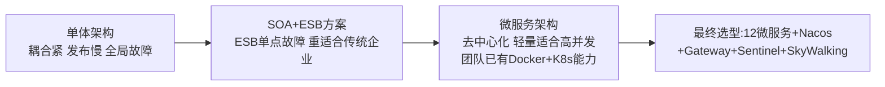
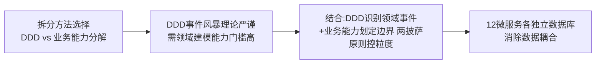
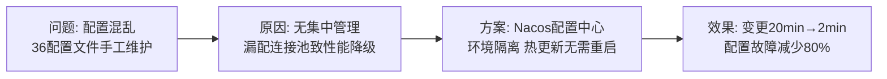
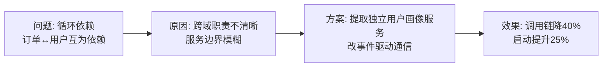

# 0004 微服务 — 论文大纲记忆卡

> 对应范文：`03-微服务论文范文-改写版.md`
> 标题：**微服务架构在在线教育平台中的应用**
> 适用考题：2020年(微服务架构)、2024年(服务拆分)、2025年(微服务治理)

---

## 论文脉络图

```mermaid
graph TD
    ROOT["<b>论微服务架构在在线教育平台中的应用</b><br/>2023.06-2024.01 | 80万行代码单体 50万+注册 5万日活<br/>直播课程+录播+在线题库+学习进度<br/>角色:系统架构师 | 职责:架构设计+服务拆分方案+核心服务割接"]

    ROOT --> P1["<b>一、项目背景</b><br/>在线教育平台 Spring Boot单体80万行<br/>业务痛点:构建重启30min+ 每周1-2次发布 5团队共用一个代码库频繁冲突<br/>技术痛点:一个模块内存泄漏导致全局崩溃 只能整体扩容无法按服务扩缩<br/>决策:亟需微服务架构改造实现独立部署和弹性扩容"]

    P1 --> P2["<b>二、理论概述 · 微服务五大核心特征</b><br/>①服务即组件⭐:独立部署升级 降低变更风险 但增加运维复杂度<br/>②业务能力组织:按领域而非技术层拆分 团队自治但需清晰边界定义<br/>③去中心化数据管理:各服务独立数据库 消除数据耦合但引入分布式一致性<br/>④容错设计⭐:熔断器三态机 关闭→打开→半开 隔离舱模式 提升韧性需治理基础设施<br/>⑤基础设施自动化⭐:CI/CD+Docker+K8s编排 一键部署弹性扩容 高效但初期建设成本高"]

    P2 --> P3["<b>三、理论展开 · 选型对比</b><br/>微服务 vs SOA:SOA用ESB集中通信(企业集成但ESB单点故障) vs 微服务去中心化智能端点(轻量适合互联网高并发)<br/>服务拆分方法:DDD事件风暴识别领域事件→限界上下文映射(理论严谨需建模能力) vs 业务能力分解(直观快速但边界易模糊)<br/>粒度参考:两个披萨团队原则"]

    P3 --> P4["<b>四、实践应用</b><br/>【架构实现】DDD拆分30+领域事件→12微服务(用户/课程/订单/支付/学习记录)各独立MySQL/MongoDB Nacos注册中心AP模式+配置中心 Spring Cloud Gateway+JWT鉴权限流 Sentinel熔断降级 SkyWalking全链路追踪<br/><br/>问题1:配置管理混乱<br/>→原因:12服务×3环境=36配置文件手工维护 漏配DB连接池致性能降级<br/>→方案:Nacos配置中心 环境分组隔离 热更新无需重启<br/>→效果:变更20min→2min 配置致故障减少80%<br/><br/>问题2:服务循环依赖<br/>→原因:订单依赖用户 用户依赖订单 调用链复杂<br/>→方案:提取跨域职责为独立用户画像服务 改为事件驱动通信<br/>→效果:调用链复杂度降40% 启动速度提升25%"]

    P4 --> P5["<b>五、总结成效</b><br/>效率:发布1-2次/周→20+次/天 | 单次部署30min→<2min<br/>韧性:故障全局数小时→单功能秒级隔离 | 代码冲突减少90%<br/>弹性:课程服务独立5倍扩容 | 资源利用率提升60%<br/>不足:服务数量增加运维复杂度升高 分布式事务开销大高频场景突出<br/>展望:引入Service Mesh(Istio)将治理能力下沉基础设施层 混沌工程验证韧性"]
```

---

## 实践因果链

### 架构选型链

### 服务拆分权衡链

### 问题1: 配置管理

### 问题2: 循环依赖

---

## 量化数据速记

发布频率: 1-2次/周 → **20+次/天** | 部署时间: 30min → **<2min**
故障隔离: 全局数小时 → **单功能秒级** | 代码冲突: 频繁 → **减少90%**
资源利用率: 基准 → **提升60%** | 课程服务: 整体扩容 → **独立5倍**

---

## 考场注意事项

- ⚠️ 若考「微服务」：五大特征必须完整列出（服务即组件/业务能力组织/去中心化数据/容错/基础设施自动化）
- ⚠️ 若考「服务拆分」：重点论述DDD方法 + 微服务 vs SOA对比（ESB单点故障 vs 去中心化）
- ⚠️ 不要只写微服务一种，必须对比SOA并说明为什么选微服务
- ⚠️ 容错设计重点写熔断器三态机（关闭→打开→半开）和隔离舱模式
- ⚠️ 个人职责：架构设计 + 服务拆分方案 + 核心服务割接 + 跨团队协调
