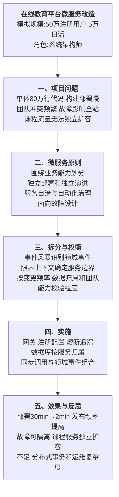

# 0004 微服务 — 论文大纲记忆卡

> 对应范文：`03-微服务论文范文-改写版.md`
>
> 训练标题：**论微服务架构在在线教育平台中的应用**
>
> **数据说明：项目规模、故障和效果指标均为论文训练用模拟数据。**

## 一、论文主线



## 二、核心特征

| 特征 | 价值 | 新增复杂度 |
|------|------|------------|
| 围绕业务能力组织 | 服务边界贴合领域，团队可端到端负责 | 需要领域建模和跨团队协作 |
| 独立部署 | 小范围变更和回滚，降低发布耦合 | 需要 CI/CD、版本和兼容治理 |
| 服务自治 | 技术和数据可以按服务演进 | 容易形成技术栈碎片和重复建设 |
| 数据按服务归属 | 减少共享数据库造成的强耦合 | 引入分布式一致性和查询聚合问题 |
| 面向故障设计 | 熔断、超时、隔离和降级提高韧性 | 需要监控、演练和容量治理 |
| 基础设施自动化 | 支撑大量服务持续交付和弹性运行 | 前期平台建设成本较高 |

## 三、微服务与 SOA 的正确比较

微服务与 SOA 都强调服务化和松耦合，不应简单写成互相排斥。

| 维度 | SOA 常见侧重 | 微服务常见侧重 |
|------|--------------|----------------|
| 主要目标 | 企业应用集成、服务复用和流程编排 | 独立交付、团队自治和快速演进 |
| 服务粒度 | 通常较粗，围绕企业能力 | 通常更小，围绕限界上下文或业务能力 |
| 集成方式 | 可能使用 ESB、服务总线和集中治理 | 倾向轻量协议、API 网关和事件通信 |
| 数据管理 | 可能共享企业数据模型 | 更强调数据按服务归属 |
| 治理方式 | 常见集中标准和统一治理 | 倾向平台能力与团队自治结合 |

> ESB 并不必然是单点故障，微服务也不天然去中心化。应根据实际部署、治理和容灾设计评价。

## 四、服务拆分方法

```text
业务目标和痛点
→ 事件风暴识别领域事件与命令
→ 划分子域和限界上下文
→ 明确数据所有权
→ 分析调用和事务边界
→ 以团队能力、变更频率和独立扩展需求校验粒度
→ 渐进迁移而非一次性重写
```

### 拆分检查

- 高内聚：一个服务围绕明确业务能力；
- 低耦合：跨服务交互有清晰契约；
- 数据归属：一份核心数据有明确权威服务；
- 独立部署：变更不要求多个服务同步发布；
- 独立扩展：热点服务可以单独扩容；
- 团队可维护：粒度与组织能力匹配。

“两披萨团队”只能作为组织规模启发，不是服务粒度的硬性规则。

## 五、架构实现

| 能力 | 典型措施 | 注意事项 |
|------|----------|----------|
| API 入口 | API 网关、认证、限流和路由 | 网关避免承载复杂业务逻辑 |
| 服务发现 | 注册中心或平台原生服务发现 | 处理实例上下线和健康检查 |
| 配置管理 | 集中配置、环境隔离和审计 | 敏感配置使用 Secret 管理 |
| 容错 | 超时、重试、熔断、隔离和降级 | 重试必须考虑幂等和放大效应 |
| 可观测性 | Metrics、Logs、Traces 和统一关联 ID | 先定义 SLI/SLO 再设计告警 |
| 数据一致性 | 本地事务、Outbox、Saga、TCC 等 | 根据一致性要求和业务补偿能力选型 |
| 发布 | CI/CD、灰度、金丝雀和快速回滚 | 保持 API 与事件契约向后兼容 |

## 六、实践因果链

### 6.1 配置治理


### 6.2 循环依赖


### 6.3 渐进迁移

```text
识别变更频繁且可独立的数据边界
→ 使用绞杀者模式抽取服务
→ 建立契约测试和观测基线
→ 小流量灰度
→ 对比指标并回滚或扩大流量
```

## 七、模拟指标统一表

| 指标 | 改造前 | 改造后 |
|------|--------|--------|
| 发布频率 | 每周 1—2 次 | 每天 20+ 次 |
| 单次部署 | 30 分钟 | 少于 2 分钟 |
| 故障影响 | 单模块故障可能影响全站 | 单功能隔离并降级 |
| 代码冲突 | 频繁 | 减少 90% |
| 资源利用率 | 基线 | 提升 60% |
| 热点课程服务 | 随整体扩容 | 独立扩容 5 倍 |

## 八、考场检查

- [ ] 是否说明为什么单体已经不能满足当前质量属性
- [ ] 是否以业务能力和限界上下文说明拆分依据
- [ ] 是否明确服务数据所有权和一致性方案
- [ ] 是否包含超时、重试、熔断、隔离和可观测性
- [ ] 是否把 SOA 与微服务写成有重叠但侧重点不同
- [ ] 是否避免“ESB 必然单点”“微服务天然高可用”等绝对表述
- [ ] 是否说明渐进迁移、灰度和回滚
- [ ] 模拟指标是否前后一致且未冒充真实项目数据

---

*当前维护批次：2026-H2｜最后更新：2026-07-31*