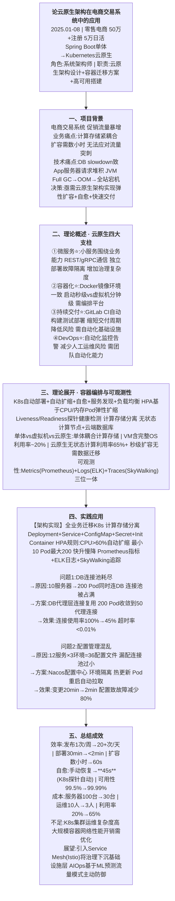
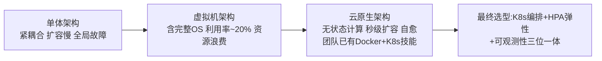
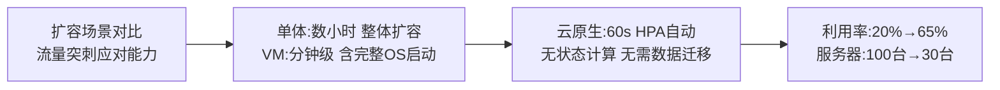
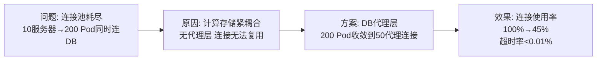
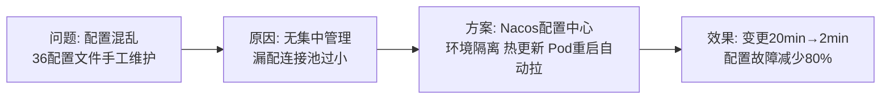

# 0005 云原生 — 论文大纲记忆卡

> 对应范文：`03-云原生论文范文-改写版.md`
> 标题：**云原生架构在电商交易系统中的应用**
> 适用考题：2021年(云原生架构)、2023年(容器化)、2025年(云原生应用)

---

## 论文脉络图

---

## 实践因果链

### 架构选型链

### 云原生vs单体权衡链

### 问题1: DB连接池耗尽

### 问题2: 配置管理

---

## 量化数据速记

发布频率: 1次/周 → **20+次/天** | 部署时间: 30min → **<2min**
扩容响应: 数小时 → **60s**(HPA) | 自愈时间: 手动 → **45s**
可用性: 99.5% → **99.99%** | 资源利用率: 20% → **65%**
服务器: 100台 → **30台** | 运维人员: 10人 → **3人**

---

## 考场注意事项

- ⚠️ 若考「云原生」：四大支柱必须完整列出（微服务/容器化/持续交付/DevOps）
- ⚠️ 若考「容器化」：重点论述K8s编排 + HPA弹性扩缩 + 探针健康检测
- ⚠️ 云原生 vs 单体 vs VM 三者对比必须会写 突出利用率20%→65%差异
- ⚠️ 可观测性三位一体（Metrics+Logs+Traces）是核心加分点
- ⚠️ 个人职责：云原生架构设计 + 容器迁移方案 + 高可用搭建
