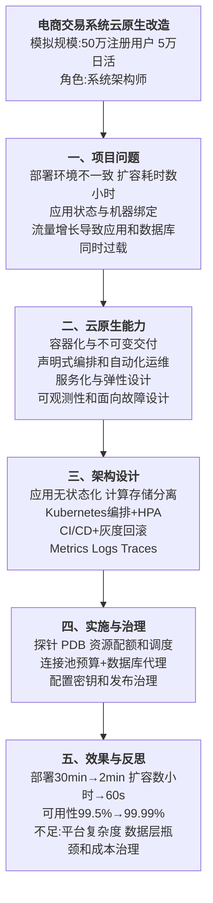
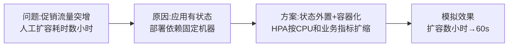
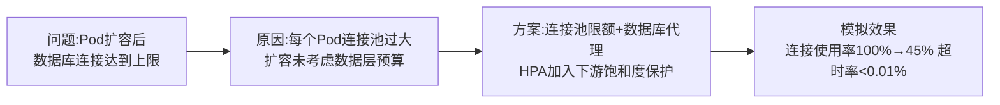
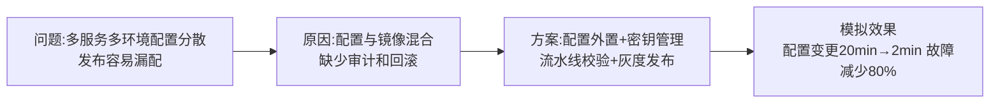

# 0005 云原生 — 论文大纲记忆卡

> 对应范文：`03-云原生论文范文-改写版.md`
>
> 训练标题：**论云原生架构在电商交易系统中的应用**
>
> **数据说明：项目规模、资源利用率和效果指标均为论文训练用模拟数据。**

## 一、论文主线



## 二、云原生能力模型

“云原生四大支柱”并不是所有教材和组织都采用的唯一固定分类。论文应根据题目选择以下能力组织答案：

| 能力 | 主要机制 | 价值 | 风险与前提 |
|------|----------|------|------------|
| 容器化与不可变交付 | 镜像、镜像仓库、不可变版本 | 环境一致、快速启动和回滚 | 镜像安全、供应链和存储管理 |
| 声明式编排 | Deployment、Service、调度和控制器 | 自动部署、自愈和期望状态管理 | 平台学习和集群运维成本 |
| 弹性与无状态设计 | HPA/VPA、负载均衡、状态外置 | 按负载扩缩，提高资源效率 | 下游容量、冷启动和成本上限 |
| 微服务或模块化服务 | 独立部署、业务边界和服务治理 | 缩小变更与故障影响面 | 分布式通信和一致性复杂度 |
| 持续交付 | 流水线、制品晋级、灰度和回滚 | 提高发布频率并降低单次变更风险 | 测试、环境和契约自动化要求 |
| 可观测性 | Metrics、Logs、Traces、Profiles | 定位故障并验证 SLO | 数据量、采样和告警噪声 |
| 面向故障设计 | 探针、PDB、超时、熔断和混沌演练 | 提高韧性和恢复能力 | 需要正确的依赖和容量模型 |

## 三、关键架构设计

### 3.1 无状态化和计算存储分离

- 会话、文件和任务状态从本地实例迁移到外部可靠存储；
- 应用实例可以被随时创建、替换和扩缩；
- 数据库、消息队列和缓存按自身一致性与持久化要求治理；
- “计算存储分离”不代表数据层自动具备无限容量。

### 3.2 Kubernetes 运行治理

| 能力 | 典型配置 | 目的 |
|------|----------|------|
| 健康检查 | Startup、Readiness、Liveness 探针 | 区分启动、接流量和存活状态 |
| 弹性 | HPA 基于 CPU、内存或自定义业务指标 | 根据负载调整副本数 |
| 可用性 | 多副本、反亲和、拓扑分布和 PDB | 减少单节点或维护影响 |
| 资源治理 | Request、Limit、Quota 和优先级 | 保证调度并限制资源争抢 |
| 配置安全 | ConfigMap、Secret、外部密钥系统 | 分离配置和制品，保护敏感信息 |
| 发布 | Rolling、Canary、Blue-Green | 控制风险并支持回滚 |

### 3.3 扩容与数据库容量约束

应用 Pod 扩容可能同时放大数据库连接和请求压力，因此必须建立容量预算：

```text
最大 Pod 数
× 每 Pod 最大连接数
≤ 数据库允许的连接预算
```

治理措施包括：

- 限制每个实例连接池大小；
- 使用数据库代理或连接池化服务；
- HPA 同时参考业务指标和下游饱和度；
- 对热点查询使用缓存、只读副本或异步化；
- 数据库达到保护阈值时限制扩容或启用降级。

## 四、实践因果链

### 4.1 弹性扩容



### 4.2 数据库连接耗尽



### 4.3 配置和发布



## 五、可观测性与验收

```text
业务 SLI：下单成功率、支付成功率、库存一致率
应用 SLI：P50/P95/P99、错误率、吞吐量
平台 SLI：Pod 重启、调度等待、CPU/内存饱和度
依赖 SLI：数据库连接、缓存命中率、消息积压
```

只有建立基线并进行压测、故障演练和灰度对比，才能说明云原生改造有效。

## 六、模拟指标统一表

| 指标 | 改造前 | 改造后 |
|------|--------|--------|
| 发布频率 | 每周 1 次 | 每天 20+ 次 |
| 部署时间 | 30 分钟 | 少于 2 分钟 |
| 扩容响应 | 数小时 | 60 秒 |
| 实例恢复 | 人工处理 | 45 秒内自动替换 |
| 可用性 | 99.5% | 99.99% |
| 资源利用率 | 20% | 65% |
| 服务器规模 | 100 台 | 30 台 |
| 数据库连接使用率 | 100% | 45% |

> 上述数字是同一模拟场景的训练口径。不能把“服务器减少”简单等同于成本必然同比下降，还需考虑托管服务、流量、存储和平台运维成本。

## 七、考场检查

- [ ] 是否根据题目组织云原生能力，而不是宣称只有唯一“四大支柱”
- [ ] 是否说明容器、编排、弹性、持续交付和可观测性的关系
- [ ] 是否区分 Startup、Readiness 和 Liveness 探针
- [ ] 是否说明应用扩容会放大数据库和其他下游压力
- [ ] 是否包含连接池预算、灰度发布和快速回滚
- [ ] 是否使用 SLI/SLO 或可测量指标验证效果
- [ ] 是否说明平台复杂度、安全、成本和数据层瓶颈
- [ ] 模拟指标是否前后一致且未冒充真实生产数据

---

*当前维护批次：2026-H2｜最后更新：2026-07-31*