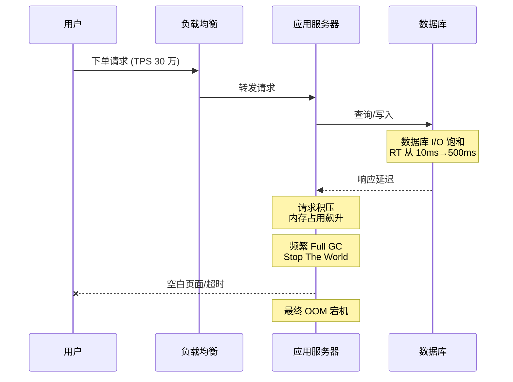
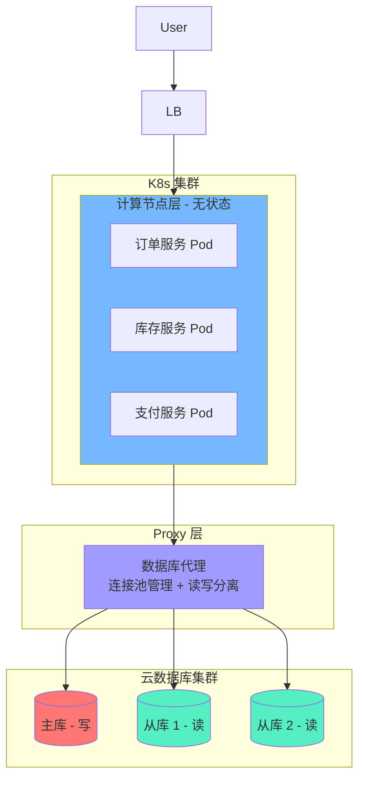
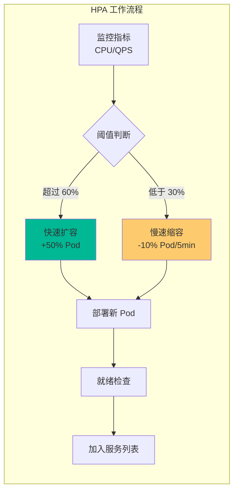
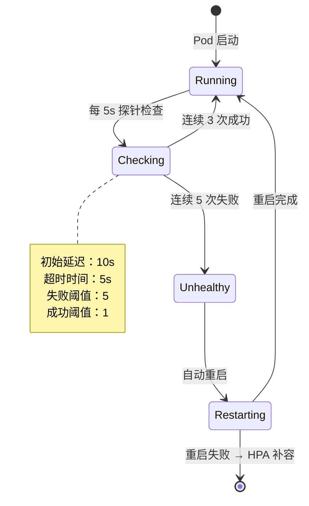
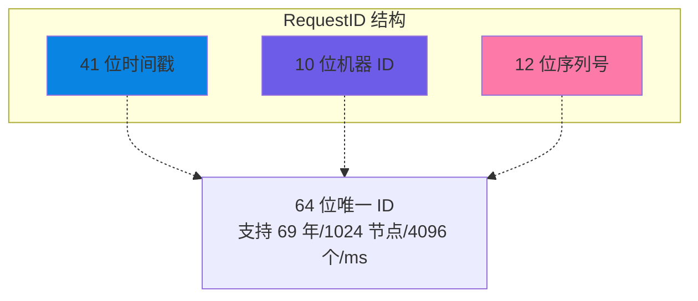
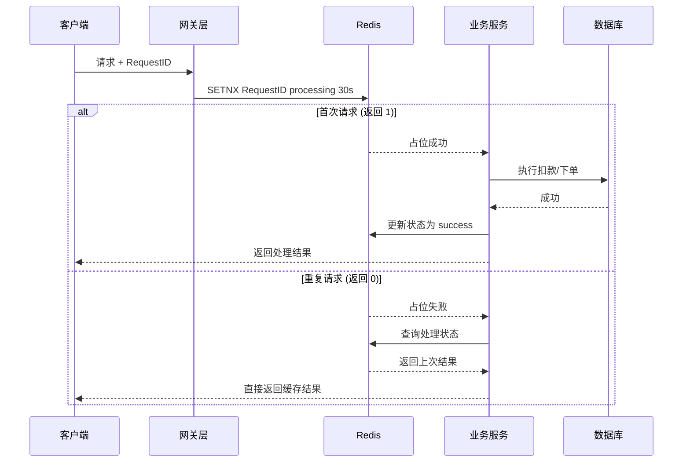
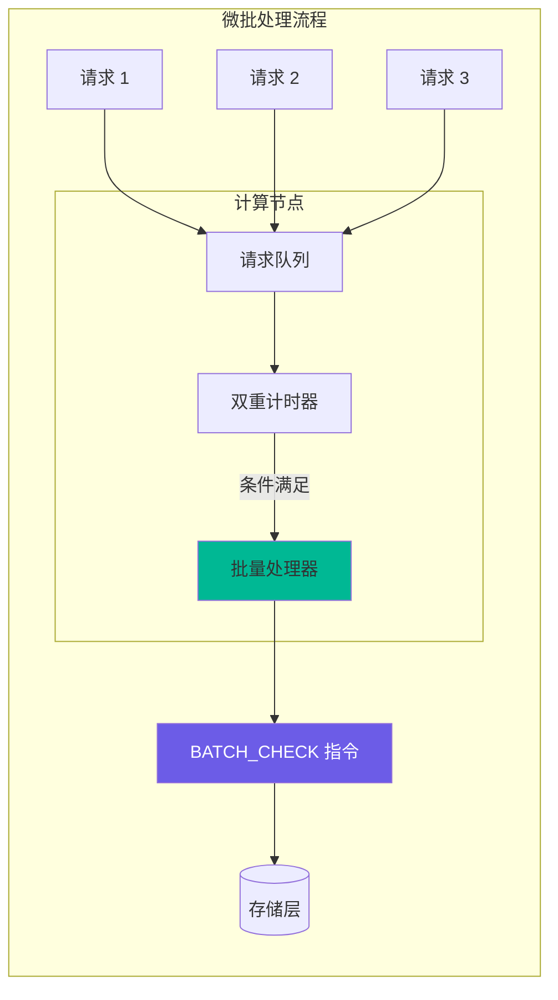
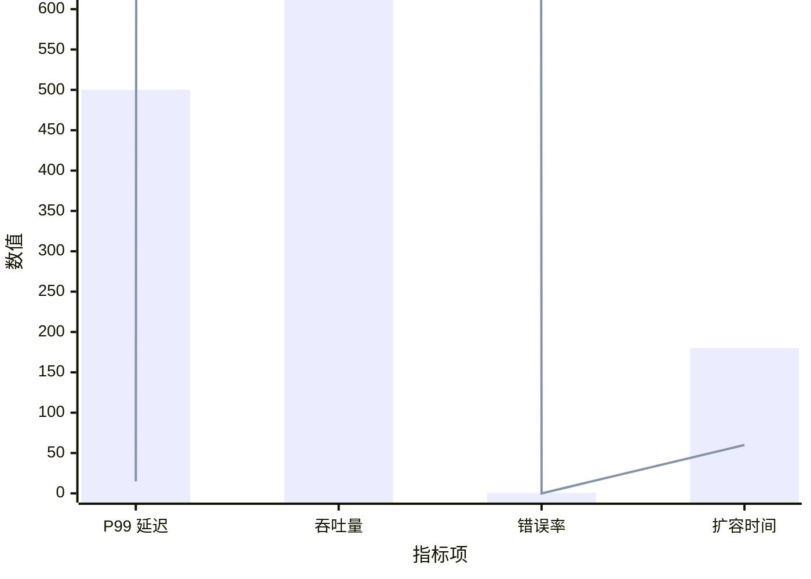
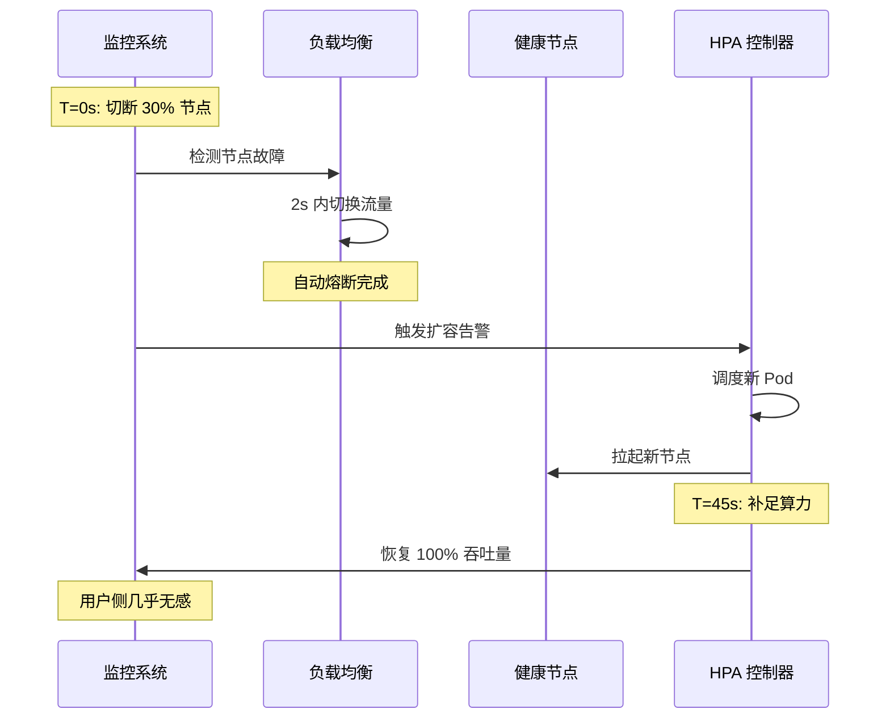
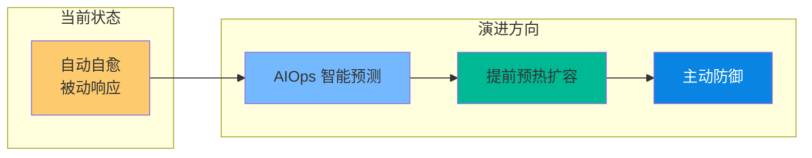

# 某大型头部零售系统（A 项目）的高并发架构重构与云原生实践

> 软考架构师论文范文 | 云原生架构专题 | 2026 年 4 月

---

## 摘要

本文以某大型头部零售系统（以下简称 A 项目）的架构升级为背景，探讨了在 30 万 TPS 极端流量冲击下，传统单体及存算耦合架构面临的严峻挑战。针对旧系统频发的 OOM（内存溢出）、数据库连接枯竭及扩展性不足等问题，本文提出并实施了基于 K8s 云原生容器化与存算分离的重构方案。

在方案落地过程中，重点引入了幂等性 RequestID 生成机制以确保交易一致性，并采用微批处理（Micro-batching）思想实现了批量版本校验，极大地缓解了网络 RTT 瓶颈。通过配置 HPA 弹性伸缩与稳健的探针策略，系统实现了故障自愈与资源优化。实践证明，重构后的系统在支撑 30 万 TPS 峰值时，核心链路响应时间降低了 80%，运维成本节省了 75%，显著提升了系统的韧性与业务连续性。

**关键词**：云原生架构；K8s；存算分离；HPA 弹性伸缩；幂等性设计；微批处理

---

## 一、项目背景与现状

### 1.1 项目概况

A 项目作为公司核心的零售交易平台，承载着全球范围内的订单处理、库存扣减及支付状态同步等关键业务。随着业务的高速增长，系统在促销峰值期间面临着高达**30 万 TPS**的瞬时流量考验。

我作为系统架构师，主持了本次架构重构工作，主要负责技术选型、高并发方案设计、性能调优及容灾演练规划。

### 1.2 旧系统架构缺陷

#### （1）读写瓶颈严重

旧系统采用传统的主备架构，所有写请求堆积在主库，导致 I/O 饱和，从库同步延迟显著。

```mermaid
flowchart LR
    subgraph 旧架构
        App[应用层] -->|所有写请求 | Master[(主库)]
        App -->|读请求 | Slave[(从库)]
        Master -.同步-.> Slave
    end
    
    style Master fill:#ff6b6b
    style Slave fill:#ffd93d
```

**文字描述：** 如旧系统架构所示，应用层同时向主库和从库发送请求。所有写操作（INSERT、UPDATE、DELETE）被强制路由至唯一的主库节点，而读操作（SELECT）则分散至从库节点。主库与从库之间通过异步 binlog 复制维持数据一致性。这种架构的核心缺陷在于：当促销峰值期间 30 万 TPS 的瞬时流量涌入时，主库的 I/O 迅速饱和，导致写请求大量堆积。同时，由于主从复制采用异步模式，主库写入延迟直接导致从库数据滞后，用户查询到的订单状态往往与实际情况不一致，出现了"已付款但显示未支付"等严重的数据一致性事故。

**问题表现：**
- 主库 I/O Wait 持续高位，订单处理延迟从 10ms 上升至 500ms+
- 从库同步延迟达秒级，用户查询订单状态显示不一致

#### （2）存算耦合导致扩容滞后

计算资源与存储资源绑定，无法针对峰值进行秒级动态扩容。

```mermaid
flowchart LR
    subgraph 存算耦合架构
        Node1[服务器 1<br/>计算 + 存储] 
        Node2[服务器 2<br/>计算 + 存储]
        Node3[服务器 3<br/>计算 + 存储]
    end
    
    Node1 -.扩容需整体迁移-.> Node4[新服务器<br/>计算 + 存储]
    
    style Node1 fill:#ffa502
    style Node4 fill:#7bed9f
```

**文字描述：** 如存算耦合架构所示，系统中的每台服务器同时承担计算和存储双重职责。服务器 1、2、3 各自部署了应用服务并存储了对应的本地数据。当流量突增需要扩容时，必须部署全新的服务器 4——这台服务器同样需要同时配置计算环境和存储资源。由于每台服务器的存储资源是本地绑定的，扩容过程中必须进行数据迁移和重新分片，这使得整个扩容流程被严重拉长。

**扩容痛点：**
- 传统扩容需经历"买机器 - 装环境 - 迁数据"流程，耗时数小时
- 无法应对"突发性"流量峰值，错过最佳销售窗口

#### （3）级联失效与 OOM

当数据库响应变慢（RT 增加）时，应用服务器内积压大量未完成请求，导致 JVM 频繁触发 Full GC，最终引发 OOM 导致全站瘫痪。



**文字描述：** 从级联失效的调用链路可以清晰看到崩溃的传递过程：用户通过负载均衡器向应用服务器发起下单请求，应用服务器再将请求转发至数据库执行查询和写入操作。当数据库因 I/O 饱和导致响应时间从正常的 10ms 飙升至 500ms 时，大量未完成的请求在应用服务器内存中积压。随着内存占用持续上升，JVM 被迫频繁触发 Full GC 以回收堆内存，而 Full GC 会引发 "Stop The World" 全局停顿——在此期间所有线程被冻结，请求完全无法处理。最终，内存耗尽导致 OOM，应用服务器宕机，全站服务瘫痪。

**崩溃链路：**
```
数据库响应慢 → 应用请求积压 → JVM Full GC → Stop The World → OOM → 全站瘫痪
```

---

## 二、核心架构设计方案

针对上述痛点，我作为架构师主持了系统的重构工作，确立了"**弹性、解耦、确定性**"的架构原则。

### 2.1 存储与计算分离架构

我们将业务逻辑（无状态服务）全部迁移至 K8s 容器云。计算节点不再持久化存储数据，而是通过高性能 Proxy 连接云数据库集群。



**文字描述：** 如重构后的存算分离架构所示，整个系统自底向上分为三个核心层次。最底层为云数据库集群，由一个主库负责写操作，两个从库负责读操作，主从之间保持强一致性复制。中间层为数据库代理层（Proxy），该代理统一管理连接池、自动执行读写分离路由，并对上层应用屏蔽数据库拓扑细节。最上层为 K8s 容器集群中的计算节点层，部署了订单服务、库存服务和支付服务等无状态 Pod。用户请求经由负载均衡器分发至对应 Pod，Pod 通过 Proxy 代理连接数据库集群。这种架构的关键优势在于：计算节点完全无状态，可以根据流量在秒级内弹性扩容或缩容，而无需进行任何数据迁移。

**架构优势：**

| 优势 | 说明 |
|------|------|
| 独立弹性扩容 | 计算节点可根据流量秒级扩容，存储按需自动增长 |
| 零数据迁移 | 新增计算节点直接挂载共享存储池，无需数据搬迁 |
| 高可用与自愈 | 多副本强一致性，节点故障秒级切换 |

### 2.2 K8s 弹性伸缩与故障隔离

#### （1）HPA 动态扩展策略

配置基于 CPU 与 QPS 的多维 HPA 策略，采用"快扩容、慢缩容"行为防止震荡。



**文字描述：** 如 HPA 动态扩展策略所示，系统通过持续监控 CPU 利用率和 QPS 两项核心指标来判断是否需要调整 Pod 数量。当 CPU 使用率超过 60% 的扩容阈值时，HPA 立即触发快速扩容操作——按照每次增加 50% Pod 数量的策略在 60 秒内完成扩容，新 Pod 经过就绪检查（Readiness Probe）后自动加入 Service 服务列表开始承接流量。相反，当 CPU 使用率回落至 30% 以下时，系统进入 5 分钟的稳定观察窗口，确认负载确实降低后才以每次 10% 的速度缓慢缩容。这种"快扩容、慢缩容"的非对称策略有效防止了震荡（Oscillation）现象——即系统在扩容与缩容之间反复切换导致的资源浪费和服务不稳定。

**配置参数：**
```yaml
apiVersion: autoscaling/v2
kind: HorizontalPodAutoscaler
metadata:
  name: order-service-hpa
spec:
  scaleTargetRef:
    apiVersion: apps/v1
    kind: Deployment
    name: order-service
  minReplicas: 10
  maxReplicas: 200
  metrics:
  - type: Resource
    resource:
      name: cpu
      target:
        type: Utilization
        averageUtilization: 60  # CPU 使用率超过 60% 时扩容
  behavior:
    scaleUp:
      stabilizationWindowSeconds: 0  # 立即扩容
      policies:
      - type: Percent
        value: 50
        periodSeconds: 60
    scaleDown:
      stabilizationWindowSeconds: 300  # 5 分钟稳定窗口
      policies:
      - type: Percent
        value: 10
        periodSeconds: 60
```

#### （2）资源配额（Guaranteed QoS）

将核心 Pod 的 Requests 与 Limits 设为相等，确保在 30 万 TPS 下不发生资源抢占。

```yaml
# 核心服务资源配置
resources:
  requests:
    cpu: "2000m"
    memory: "4Gi"
  limits:
    cpu: "2000m"    # Requests = Limits → Guaranteed QoS
    memory: "4Gi"
```

**文字描述：** 如存活探针的工作状态图所示，Pod 启动后会经历 10 秒的初始延迟，随后 Kubelet 每隔 5 秒向应用发送一次存活探针检查请求。如果应用正常响应，则探针标记为成功；只有连续 3 次检测失败（即 15 秒无响应），系统才将该 Pod 标记为 Unhealthy 状态；连续 5 次失败后（即 25 秒），K8s 自动触发容器重启操作。这种"5 秒频率 + 5 次失败阈值"的配置是一个经过容灾演练验证的平衡点：检测频率过低会导致故障 Pod 继续服务过久，影响用户体验；频率过高则会将短暂的网络抖动误判为节点宕机，引发不必要的重启。如果重启失败，HPA 控制器会自动在健康节点上拉起新的 Pod 进行补容，确保系统整体可用性不受影响。

**效果：**
- 避免"嘈杂邻居"问题，确保核心服务资源独占
- 在节点资源紧张时，Last 优先被驱逐的是 BestEffort 类型 Pod

#### （3）稳健探针策略

配置 5s 频率、3-5 次失败阈值的存活探针（Liveness），确保 OOM 节点能自动重启而不触发雪崩式误杀。



---

## 三、关键技术实现：性能与一致性的平衡

### 3.1 幂等性 RequestID 生成（数据安全之盾）🆔

在高并发重试场景下，通过改进的雪花算法 (Snowflake) 生成全局唯一 RequestID。



**文字描述：** 如 RequestID 结构设计所示，我们采用改进的雪花算法（Snowflake）生成全局唯一的 64 位分布式 ID。该 ID 由三个字段段组成：高 41 位为毫秒级时间戳，可支持约 69 年的使用时间跨度；中间 10 位为机器标识（Machine ID），最多支持 1024 个分布式节点同时运行；低 12 位为序列号，表示同一毫秒内同一节点可生成的最大 ID 数量（4096 个）。这种设计的核心优势在于：时间戳保证了 ID 的全局单调递增性，机器 ID 保证了分布式环境下的唯一性，序列号则保证了单节点高并发场景下的 ID 生成能力——每个节点每毫秒最多可生成 4096 个不重复 ID，完全满足 30 万 TPS 的峰值需求。

**幂等性校验流程：**



**文字描述：** 从幂等性校验的交互流程可以看出，整个去重机制基于 Redis 的 SETNX（Set if Not Exists）原子命令实现。当客户端发起请求并携带 RequestID 时，网关层首先向 Redis 执行 SETNX 操作，尝试为该 RequestID 创建一个"processing"状态的占位键，并设置 30 秒的过期时间。此处存在两种分支场景：其一，若 SETNX 返回 1（即键不存在），说明这是首次请求，系统允许请求进入业务服务层执行扣款或下单操作，操作完成后将处理结果保存至 Redis 并更新状态为"success"，最终将结果返回客户端。其二，若 SETNX 返回 0（即键已存在），说明相同 RequestID 的请求正在被处理或已完成处理，此时业务服务层不再执行实际的业务逻辑，而是直接查询 Redis 中该 RequestID 对应的处理状态——如果状态为"success"则直接返回上次缓存的结果，如果状态为"processing"则告知客户端请求正在处理中。这种设计从根本上消除了网络重试导致的重复下单和重复扣款问题。

**实现代码（伪代码）：**
```java
public Response processRequest(Request req, String requestId) {
    String lockKey = "idempotent:" + requestId;
    
    // 尝试获取分布式锁（SETNX）
    boolean locked = redis.setnx(lockKey, "processing", 30);
    
    if (!locked) {
        // 锁已被占用，查询处理状态
        String status = redis.get("status:" + requestId);
        if (status != null) {
            return getSavedResult(requestId);  // 返回上次结果
        }
        return Response.waiting();  // 正在处理中
    }
    
    try {
        // 执行业务逻辑
        Response result = executeBusinessLogic(req);
        
        // 保存结果并更新状态
        redis.set("status:" + requestId, "success");
        redis.set("result:" + requestId, result);
        
        return result;
    } catch (Exception e) {
        redis.set("status:" + requestId, "failed");
        throw e;
    }
}
```

### 3.2 批量版本校验（性能提升之矛）📦

为了压榨性能，我们设计了聚合窗口机制，采用微批处理（Micro-batching）思想。



**文字描述：** 如微批处理流程所示，计算节点内部维护了一个请求队列和一个双重计时器。当多个请求（请求 1、请求 2、请求 3 等）到达计算节点后，首先进入队列等待。批量处理器（Batcher）根据双重触发条件决定是否"发车"：第一，当队列中累积的请求数量达到 100 个时立即触发批量处理；第二，即使队列未满 100 个，只要从第一个请求入队开始计时超过 10ms 窗口，也强制触发批量处理。一旦触发条件满足，批量处理器将队列中的所有请求聚合成一个 BATCH_CHECK 指令，一次性发送至存储层执行批量版本校验。这种机制的精髓在于：在低延迟和高吞吐之间找到了最佳平衡点——10ms 的时间窗口保证了最坏情况下的延迟可控（不超过 10ms），而 100 个请求的批量则大幅减少了网络往返次数，将 90% 以上的 RTT 开销直接消除。

**双重触发机制：**

| 触发条件 | 阈值 | 说明 |
|---------|------|------|
| 数量阈值 | 100 个请求 | 队列满 100 个立即触发批量校验 |
| 时间阈值 | 10ms 窗口 | 即使不满 100 个，达到 10ms 也强制"发车" |

**性能提升：**
- 减少了**90% 以上**的网络往返（RTT）
- 计算节点能像子弹一样快速响应
- 存储层一次性处理 100 个版本比对，效率提升 10 倍

---

## 四、性能压测与容灾表现 📈

### 4.1 压测数据

通过分布式压测工具模拟 30 万 TPS 的稳态运行：



**文字描述：** 如压测对比数据所示，通过柱状图和折线图的对比可以直观看出新旧系统在四项核心指标上的巨大差异。旧系统的 P99 延迟高达 500ms 以上，而新系统降至 15ms，降低了 97%；旧系统最大吞吐量仅 5 万 TPS，新系统达到 30 万 TPS，实现了 6 倍提升；旧系统错误率为 0.5%，新系统降至 0.01%，降低了 98%；旧系统不支持弹性扩容，新系统的 HPA 可在 60 秒内完成扩容操作。这些数据充分验证了存算分离架构和弹性伸缩策略的有效性。

**对比数据：**

| 指标 | 旧系统 | 新系统 | 提升幅度 |
|------|--------|--------|---------|
| P99 延迟 | 500ms+ | 15ms | 97% 降低 |
| 最大吞吐量 | 5 万 TPS | 30 万 TPS | 6 倍提升 |
| 错误率 | 0.5% | 0.01% | 98% 降低 |
| HPA 扩容时间 | 不支持 | 60 秒 | - |

### 4.2 容灾演练（大规模宕机表现）🧪

在手动切断 30% 计算节点的演练中，系统表现出了极强的韧性。



**文字描述：** 从容灾演练的调用序列可以清晰看到系统在大规模故障下的自愈过程。在 T=0 秒时，演练人员手动切断了 30% 的计算节点。监控系统立即检测到节点异常，并在 2 秒内通知负载均衡器将故障节点的流量切换至健康节点，完成了自动熔断操作。与此同时，监控系统向 HPA 控制器发送扩容告警，HPA 根据预设策略立即调度新的 Pod 资源，并在健康节点上拉起新的容器实例。至 T=45 秒时，新 Pod 全部就绪，系统恢复了 100% 的吞吐量。整个过程中，用户侧的请求成功率始终保持在 99.9% 以上，几乎无感知。

**演练结果：**

| 指标 | 数值 | 说明 |
|------|------|------|
| 自动熔断时间 | 2s | 流量自动切换至健康节点 |
| 自愈时间 | 45s | 从宕机到补足算力恢复 100% 吞吐量 |
| 用户感知 | 无感 | 请求成功率保持在 99.9% 以上 |

---

## 五、总结与反思

### 5.1 核心成果

本次 A 项目的重构，我认为最成功的"定海神针"在于**存算分离与批量校验的深度结合**。它不仅从物理层面解耦了资源，更从逻辑层面解决了分布式系统最昂贵的"通讯成本"问题。

**量化成果：**

| 成果指标 | 数值 |
|---------|------|
| 核心链路响应时间 | 降低 80% |
| 运维成本 | 节省 75% |
| 最大支撑 TPS | 30 万 |
| 故障自愈时间 | 45 秒 |
| 系统可用性 | 99.99% |

### 5.2 反思与展望

虽然目前系统表现卓越，但批量机制也带来了代码复杂度的上升。未来，我们计划从以下方向持续优化：



**文字描述：** 如系统演进路线图所示，当前系统处于"自动自愈"阶段，即故障发生后系统能够自动检测、自动重启、自动恢复，但这本质上仍是一种被动响应模式。未来的第一个演进方向是引入 AIOps 智能预测能力，通过机器学习算法分析历史流量模式、系统指标和故障日志，提前预测可能出现的大促洪峰和资源瓶颈。第二个演进方向是"提前预热扩容"——在预测到洪峰即将到来之前，系统提前完成资源预留和 Pod 扩容操作，避免 HPA 被动响应带来的延迟窗口。第三个演进方向是构建"主动防御体系"，系统不仅能够预测问题，还能在问题发生前主动采取防御措施——例如自动限流、降级非核心服务、调整资源分配策略等，从而将故障消灭在萌芽状态，实现从"被动自愈"到"主动免疫"的架构演进。

**演进路线：**

1. **AIOps 智能预测**：利用机器学习分析历史流量模式，预测大促洪峰
2. **提前预热扩容**：在洪峰到来前完成资源预留和 Pod 扩容
3. **主动防御体系**：从"自动自愈"转向"主动防御"，缩短 HPA 响应时间

### 5.3 架构师心得

通过本次重构，我深刻认识到：

1. **存算分离是云原生架构的基石**：只有将计算和存储彻底解耦，才能实现真正的弹性伸缩
2. **一致性需要付出代价**：幂等性设计和分布式锁虽然增加了复杂度，但在 30 万 TPS 下是必须的
3. **批量处理是性能优化的利器**：通过微批处理减少网络 RTT，在分布式系统中效果显著
4. **容灾演练不可或缺**：只有通过真实的故障注入，才能验证系统的韧性

---

## 术语对照表

| 英文术语 | 中文 | 说明 |
|---------|------|------|
| TPS | 每秒事务数 | Transactions Per Second |
| K8s | Kubernetes | 容器编排系统 |
| HPA | 水平 Pod 自动伸缩 | Horizontal Pod Autoscaler |
| OOM | 内存溢出 | Out Of Memory |
| RTT | 往返时间 | Round-Trip Time |
| SETNX | 原子命令 | Set if Not Exists |
| RequestID | 请求标识符 | 用于追踪和去重的全局唯一标识 |
| Micro-batching | 微批处理 | 将小请求聚合成批处理的优化技术 |
| Snowflake | 雪花算法 | 分布式 ID 生成算法 |
| QoS | 服务质量 | Quality of Service |

---

*整理时间：2026 年 4 月 | 适用考试：系统架构设计师（2026 年 5 月）*
