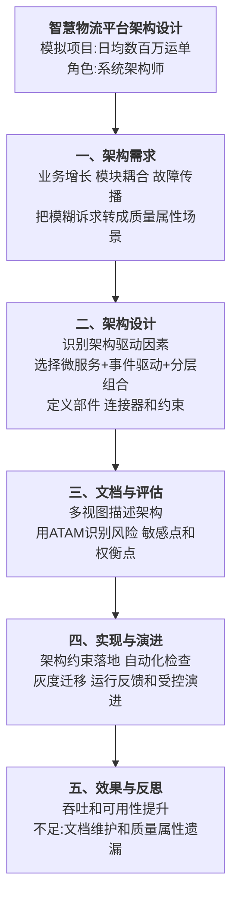

# 0006 ABSD 基于架构的软件设计 — 论文大纲记忆卡

> 对应资料：
> - `01-ABSD 核心知识点.md`
> - `02-ABSD 论文写作框架.md`
> - `03-ABSD 论文范文-改写版.md`
>
> 训练标题：**论基于架构的软件设计在智慧物流平台中的应用**
>
> **数据说明：项目规模和量化指标为论文训练用模拟数据。**

## 一、论文主线



## 二、ABSD 核心思想

ABSD 的重点不是背诵固定步骤，而是以架构为中心，把质量属性、架构决策、评估和演进连接成闭环：

```text
业务目标与约束
→ 架构驱动因素和质量属性场景
→ 架构风格、部件、连接器与约束
→ 多视图文档化
→ 架构评估和风险处理
→ 实现一致性检查
→ 根据运行反馈受控演进
```

不同教材对阶段名称和数量可能存在差异，正式作答应以题目和采用的参考体系为准，不把“六阶段”描述为唯一官方顺序。

## 三、质量属性场景

| 要素 | 问题 | 物流示例 |
|------|------|----------|
| 刺激源 | 谁或什么产生事件 | 用户、设备、外部系统、攻击者 |
| 刺激 | 发生了什么 | 高并发请求、服务故障、接口变化 |
| 环境 | 在什么状态下发生 | 正常、高峰、降级或维护状态 |
| 制品 | 哪部分受到影响 | API 网关、订单服务、消息系统 |
| 响应 | 系统采取什么动作 | 扩容、隔离、重试、降级、告警 |
| 响应度量 | 如何判断合格 | P99、恢复时间、错误率、变更工时 |

示例：

> 在大促高峰环境下，外部用户向订单服务发起每秒 1 万次请求，系统通过限流、水平扩容和异步削峰保持核心下单能力，P99 小于 500ms，错误率小于 0.1%。

## 四、架构设计与评估

### 4.1 部件、连接器和约束

- **部件**：承担计算或数据职责的模块、服务和存储；
- **连接器**：调用、事件、消息、共享数据或协议；
- **约束**：依赖方向、数据所有权、通信方式、部署和安全规则。

### 4.2 ATAM 使用口径

```text
业务驱动因素
→ 架构方案说明
→ 构建质量属性效用树
→ 分析架构方法
→ 识别风险、非风险、敏感点和权衡点
→ 汇总改进建议
```

| 概念 | 含义 | 示例 |
|------|------|------|
| 风险 | 可能无法满足质量属性的决策 | 同步调用链过长导致可用性下降 |
| 非风险 | 在当前场景下有充分理由认为可接受 | 只读报表使用最终一致副本 |
| 敏感点 | 参数变化会显著影响某一质量属性 | 超时阈值影响故障恢复和误判 |
| 权衡点 | 同一决策影响多个质量属性 | 强加密提高安全性但增加延迟 |

## 五、实践因果链

### 5.1 同步耦合


### 5.2 消息表 I/O 竞争


> 物理分库会削弱业务事务与消息记录的本地原子性。采用 Outbox 时应优先保持同一事务边界，再通过分区、归档和 CDC 等方式解决容量问题；若拆库，必须补充新的可靠投递协议。

## 六、架构落地与演进

- 使用 ADR 记录关键架构决策、备选方案和后果；
- 使用组件图、部署图、接口契约和运行视图服务不同干系人；
- 通过依赖规则、契约测试和流水线检查防止架构漂移；
- 采用绞杀者模式和灰度发布降低迁移风险；
- 运行后根据 SLI/SLO、故障和成本数据重新评估；
- 架构文档随决策变更同步更新，而不是一次性产物。

## 七、模拟指标统一表

| 指标 | 改造前 | 改造后 |
|------|--------|--------|
| 峰值吞吐 | 2000 TPS | 12000 TPS |
| 平均响应 | 1500ms | 150ms |
| 可用性 | 99.5% | 99.99% |
| 故障影响 | 全链传播 | 局部隔离与异步补偿 |
| 数据异常率 | 0.5% | 少于 0.01% |

## 八、考场检查

- [ ] 是否把业务诉求转化成可度量的质量属性场景
- [ ] 是否说明架构驱动因素、约束和备选方案
- [ ] 是否定义部件、连接器和关键架构约束
- [ ] 是否通过风险、敏感点和权衡点体现架构评估
- [ ] 是否说明架构如何约束实现并根据运行反馈演进
- [ ] 是否避免把某一阶段划分写成唯一官方标准
- [ ] Outbox 或本地消息表方案是否保持事务边界正确
- [ ] 模拟指标是否前后一致且未冒充真实项目数据

---

*当前维护批次：2026-H2｜最后更新：2026-07-31*