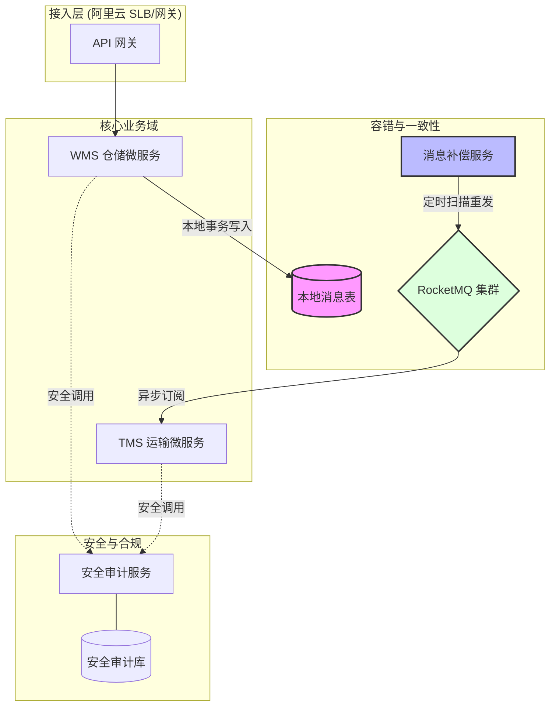

# ABSD 核心知识点

> 整理自 Google Gemini 学习对话 | 软考架构师论文专题

---

## 一、ABSD 定义与核心思想

### 1.1 什么是 ABSD

基于架构的软件设计（Architecture-Based Software Design, ABSD）是一种**以架构为中心、以质量属性为驱动**的软件设计方法论。它强调架构不是开发前的产物，而是贯穿软件全生命周期的蓝图。

> **架构师视角**：ABSD 与传统开发方法的根本区别在于"架构重心前移"——在编码之前就明确系统的非功能性需求，并通过架构决策来满足这些需求。

### 1.2 ABSD 的核心特征

| 特征维度 | 传统开发方法 | ABSD 方法 |
|---------|------------|----------|
| 驱动因素 | 功能需求驱动 | 质量属性驱动 |
| 架构地位 | 开发前的产物 | 贯穿全生命周期的蓝图 |
| 关注重点 | "系统做什么" | "系统如何做" |
| 决策时机 | 编码过程中逐步确定 | 架构阶段显式决策 |
| 评估方式 | 编码后测试验证 | 编码前架构评估（ATAM/SAAM）|
| 变更应对 | 需求变更导致代码重构 | 架构演进受控管理 |

> **表格要点**：ABSD 将架构决策从"编码后的事后验证"提前到"编码前的显式设计"，通过质量属性驱动和架构评估，在设计阶段就发现并解决潜在的架构风险。

### 1.3 ABSD 三要素

ABSD 架构由三个基本要素构成：

| 要素 | 英文 | 定义 | 物流系统示例 |
|------|------|------|------------|
| 部件 | Component | 封装好的计算或数据存储单元 | WMS 仓储服务、TMS 调度服务、消息补偿服务 |
| 连接器 | Connector | 部件间的交互机制 | RocketMQ 消息总线、REST API、gRPC 调用 |
| 约束 | Constraint | 部件和连接器的拓扑结构及行为规则 | WMS 与 TMS 通过事件驱动解耦，禁止同步强依赖 |

### 1.4 ABSD 的核心原则

- **质量属性优先**：性能、可用性、安全性等非功能性需求是架构设计的第一驱动力
- **架构决策显式化**：每个架构选择都应有明确的理由和权衡分析
- **评估前置**：在编码之前通过 ATAM/SAAM 等方法评估架构的合理性
- **受控演进**：架构变更应通过受控的流程管理，而非随意修改

---

## 二、ABSD 六大生命周期

ABSD 方法论定义了架构设计的六个生命周期阶段，论文中必须按照此顺序组织论述。

```
需求获取 → 架构设计 → 架构文档化 → 架构评估 → 架构实现 → 架构演进
```

### 2.1 架构需求获取（Architecture Requirements Elicitation）

| 维度 | 说明 |
|------|------|
| 核心动作 | 从用户需求中提取架构需求，生成质量属性场景 |
| 输入 | 业务需求文档、用户需求、约束条件 |
| 活动 | 需求调研、质量属性识别、场景生成、优先级排序 |
| 输出 | 质量属性场景表、架构需求规格 |
| 关键产出 | 明确系统的性能、可用性、安全性等非功能性需求指标 |

> **架构师视角**：需求获取阶段最重要的是将模糊的业务诉求转化为可度量的质量属性场景。"系统要快"是不可操作的，"系统在 10000 TPS 下响应 < 200ms"才是架构需求。

### 2.2 架构设计（Architecture Design）

| 维度 | 说明 |
|------|------|
| 核心动作 | 选择架构风格，将需求映射为部件和连接器 |
| 输入 | 质量属性场景、架构需求规格 |
| 活动 | 架构风格选择、微服务划分、部件与连接器定义、约束制定 |
| 输出 | 架构设计方案、初始架构图 |
| 关键产出 | 确定系统的整体架构风格（微服务、事件驱动、分层等） |

| 架构风格 | 适用场景 | 物流系统应用 |
|---------|---------|------------|
| 微服务架构 | 高复杂度、需独立扩展 | WMS 与 TMS 拆分为独立服务 |
| 事件驱动架构 | 系统解耦、异步处理 | 出库完成 → 触发调度事件 |
| 分层架构 | 关注点分离 | 接入层、业务层、数据层 |
| 插件化架构 | 功能可扩展 | 支持多种物流承运商插件 |

### 2.3 架构文档化（Architecture Representation）

| 维度 | 说明 |
|------|------|
| 核心动作 | 使用 ADL 或 UML 对架构进行多视图描述 |
| 输入 | 架构设计方案 |
| 活动 | 绘制 4+1 视图、编写架构描述语言（ADL）、文档化约束 |
| 输出 | 架构文档、UML 图、部署图、组件图 |
| 关键产出 | 确保所有干系人对架构理解一致 |

### 2.4 架构评估（Architecture Evaluation）

| 维度 | 说明 |
|------|------|
| 核心动作 | 使用 ATAM/SAAM 等方法评估架构合理性 |
| 输入 | 架构文档、质量属性场景 |
| 活动 | 识别敏感点、权衡点、风险点、非风险点 |
| 输出 | 评估报告、架构改进建议 |
| 关键产出 | 在编码前发现潜在架构缺陷，降低返工成本 |

### 2.5 架构实现（Architecture Implementation）

| 维度 | 说明 |
|------|------|
| 核心动作 | 约束开发团队按照架构蓝图进行开发 |
| 输入 | 架构文档、评估报告 |
| 活动 | 代码审计、架构约束检查、技术栈规范、实现验证 |
| 输出 | 符合架构约束的代码实现 |
| 关键产出 | 确保底层实现不偏离高层架构设计 |

### 2.6 架构演进（Architecture Evolution）

| 维度 | 说明 |
|------|------|
| 核心动作 | 应对需求变更，受控地修改架构 |
| 输入 | 新的业务需求、运行反馈、评估结果 |
| 活动 | 变更分析、影响评估、架构调整、回归验证 |
| 输出 | 演进后的架构、变更记录 |
| 关键产出 | 保持架构的长期生命力和适应性 |

### 2.7 六阶段生命周期总览

| 阶段 | 核心问题 | 关键产出 | 评估方法 |
|------|---------|---------|---------|
| 1. 需求获取 | 系统需要什么质量属性？ | 质量属性场景表 | 场景完整性检查 |
| 2. 架构设计 | 用什么架构风格满足需求？ | 架构设计方案 | 风格适用性分析 |
| 3. 文档化 | 如何清晰描述架构？ | 4+1 视图文档 | 干系人理解一致性 |
| 4. 架构评估 | 架构是否存在风险？ | ATAM 评估报告 | 敏感点/权衡点/风险点分析 |
| 5. 架构实现 | 实现是否符合架构？ | 代码审计结果 | 架构一致性检查 |
| 6. 架构演进 | 架构如何适应变化？ | 演进变更记录 | 变更影响评估 |

---

## 三、质量属性与场景六要素

### 3.1 关键质量属性

| 质量属性 | 英文 | 关注点 | 物流场景示例 |
|---------|------|--------|------------|
| 性能 | Performance | 响应时间、吞吐量、并发能力 | 双 11 期间 10000 TPS 订单处理 |
| 可用性 | Availability | 系统持续运行能力、故障恢复 | 7×24 小时仓储作业不中断 |
| 安全性 | Security | 数据保护、访问控制、防攻击 | 用户隐私数据国密加密 |
| 可修改性 | Modifiability | 功能扩展、代码变更成本 | 新增承运商接口无需重构核心 |
| 易用性 | Usability | 用户操作效率、学习成本 | PDA 拣货界面三步完成操作 |

### 3.2 质量属性场景六要素

质量属性场景是 ABSD 方法论中描述非功能性需求的标准化格式，包含六个要素：

| 要素 | 英文 | 定义 | 物流系统示例 |
|------|------|------|------------|
| 刺激源 | Source | 谁发起的动作？ | 手持 PDA 终端、攻击者、系统管理员 |
| 刺激 | Stimulus | 发生了什么事？ | 每秒 5 万次轨迹上报、数据库断开连接 |
| 制品 | Artifact | 系统哪部分受影响？ | 轨迹处理服务、数据库、API 网关 |
| 环境 | Environment | 发生时的上下文？ | 正常运行、高峰期、过载期、网络波动 |
| 响应 | Response | 系统做了什么？ | 消息队列异步缓冲、自动扩容、记录日志 |
| 响应度量 | Measure | 结果如何量化？ | 延迟 < 2 秒、数据丢失率 = 0、CPU < 80% |

> **架构师视角**：质量属性场景六要素是论文中最能体现"专业性"的部分。不能只说"系统性能很好"，而必须用"系统在高峰期面对 10000 TPS 时，响应延迟 < 200ms"来描述。

### 3.3 物流系统质量属性场景示例

| 质量属性 | 刺激源 | 刺激 | 制品 | 环境 | 响应 | 响应度量 |
|---------|--------|------|------|------|------|---------|
| 可用性 | 消息中间件 | RocketMQ 瞬时故障 | 消息队列集群 | 订单出库高峰期 | 触发本地消息表持久化 + 降级模式 | 数据零丢失，MQ 恢复后 5 分钟内自动补发 |
| 性能 | 用户 | 10000 并发查询请求 | API 网关 + 缓存层 | 正常负载 | 动态读取缓存与盲索引查询 | 响应 < 200ms |
| 安全性 | 攻击者 | 尝试非法抓包订单信息 | 数据传输链路 | 互联网环境 | 全链路国密 SM2/SM4 加密 | 敏感数据解密失败，攻击无效 |
| 可修改性 | 业务方 | 新增一种承运商对接 | 承运商适配器层 | 系统正常运行 | 通过插件化架构加载新适配器 | 新功能上线 < 1 天，无需修改核心代码 |

> **表格要点**：每个质量属性场景都必须用六要素完整描述。以上四个场景分别覆盖了可用性、性能、安全性和可修改性四大核心属性，是论文正文中可直接引用的示例。

### 3.4 质量属性之间的权衡关系

| 权衡对 | 冲突表现 | 架构决策 | 取舍理由 |
|--------|---------|---------|---------|
| 性能 vs 安全性 | 加密算法增加 CPU 消耗和 I/O 延迟 | 分类分级加密，仅对敏感字段加密 | 满足合规前提下，性能损耗控制在 5% 以内 |
| 一致性 vs 可用性 | 强一致性导致线程阻塞和连接池耗尽 | 最终一致性（本地消息表 + MQ） | 物流系统可用性优先，通过补偿机制保证最终一致 |
| 开发成本 vs 可修改性 | 微服务架构增加前期设计和部署成本 | 采用微服务 + 事件驱动 | 前期成本换取后期维护效率和独立扩展能力 |
| 性能 vs 可修改性 | 高度优化的代码难以扩展和修改 | 在核心路径优化，在业务层保持可扩展性 | 关键路径性能优先，非关键路径可修改性优先 |

---

## 四、架构评估方法（ATAM/SAAM）

### 4.1 ATAM — 架构权衡分析法

ATAM（Architecture Tradeoff Analysis Method）是 ABSD 方法论中最核心的架构评估方法。

| 评估要素 | 英文 | 定义 | 物流系统示例 |
|---------|------|------|------------|
| 敏感点 | Sensitivity Point | 对特定质量属性影响显著的架构决策 | SM4 加密算法的复杂度直接影响系统性能（加密越强，延迟越高） |
| 权衡点 | Trade-off Point | 同时影响多个质量属性的架构决策 | 本地消息表保证可靠性但增加数据库写压力 |
| 风险点 | Risk Point | 可能导致架构失败的潜在问题 | 本地磁盘空间满时消息无法持久化导致数据丢失 |
| 非风险点 | Non-Risk Point | 经评估认为不会造成问题的架构决策 | Kafka 3 副本配置对当前业务规模是安全的 |

> **架构师视角**：论文中的 ATAM 评估不能只罗列定义，必须结合具体架构决策，写出"我选择了什么、为什么、权衡了什么、风险在哪里"。

### 4.2 SAAM — 软件架构分析法

| 维度 | ATAM | SAAM |
|------|------|------|
| 评估目标 | 多质量属性综合权衡 | 主要针对可修改性评估 |
| 适用场景 | 架构设计的综合评估 | 系统变更影响分析 |
| 评估方法 | 场景优先级排序 + 架构决策映射 | 场景分类 + 变更成本估算 |
| 产出物 | 敏感点/权衡点/风险点清单 | 可修改性评估报告 |
| 论文应用 | 论文中重点论述 | 论文中可简要提及 |

### 4.3 ATAM 评估流程

```
1. 介绍 ATAM 方法 → 2. 介绍业务驱动 → 3. 介绍架构设计
      ↓
4. 确定架构方法 → 5. 生成质量属性场景树 → 6. 分析架构方法
      ↓
7. 场景优先级排序 → 8. 再次分析架构 → 9. 评估结果呈现
```

### 4.4 ATAM 四要素写作模板

论文中论述 ATAM 评估时，按以下模板组织：

```
在架构评估阶段，我们应用 ATAM（架构权衡分析法）对设计方案进行了系统评估：

1. 敏感点：[架构决策] 对 [质量属性] 的影响显著，表现为 [具体影响描述]。
2. 权衡点：[架构决策] 同时影响 [属性A] 和 [属性B]，我们选择 [方案]，
   理由是 [权衡分析]。
3. 风险点：[架构决策] 存在 [风险描述]，可能导致 [后果]。
4. 非风险点：[架构决策] 经评估认为是安全的，因为 [理由]。
```

---

## 五、架构描述：4+1 视图模型

### 5.1 4+1 视图概述

4+1 视图模型是架构文档化的标准方法，通过五个视角全面描述系统架构。

| 视图 | 英文 | 描述重点 | 关注干系人 |
|------|------|---------|-----------|
| 逻辑视图 | Logical View | 功能需求、类/对象关系、业务概念 | 产品经理、业务开发 |
| 开发视图 | Development View | 模块划分、包结构、库依赖、代码组织 | 开发团队 |
| 过程视图 | Process View | 并发、同步、进程间通信、消息流转 | 运维团队、性能工程师 |
| 物理视图 | Physical View | 硬件部署、网络配置、节点拓扑 | 运维、基础设施团队 |
| 场景视图 | Scenarios (+1) | 核心业务流程、端到端用例 | 所有干系人 |

### 5.2 物流系统 4+1 视图应用示例

| 视图 | WMS & TMS 应用示例 |
|------|-------------------|
| 逻辑视图 | WMS 的"入库管理"类与 TMS 的"调度单"对象的关联关系；订单、库存、运单等核心业务实体 |
| 开发视图 | Maven 多模块结构：wms-core、tms-scheduler、message-compensator、security-audit；Spring Cloud 依赖管理 |
| 过程视图 | WMS 通过本地事务写入 Outbox → 补偿服务扫描 → 发送消息至 RocketMQ → TMS 订阅消费的异步流转过程 |
| 物理视图 | 阿里云 ECS/ACK 集群部署拓扑；PolarDB 主从架构；RocketMQ 3 副本集群；SLB 负载均衡配置 |
| 场景视图 | 双 11 高峰期全链路场景：用户下单 → WMS 拣货 → 本地消息表 → MQ → TMS 调度 → 车辆配送 → 末端签收 |

> **架构师视角**：论文中不要求画出全部 5 个视图，但至少要在架构文档化章节提到"采用了 4+1 视图方法"，并重点描述 2-3 个与论文主题最相关的视图。

### 5.3 架构描述语言（ADL）

| 描述方式 | 用途 | 物流系统应用 |
|---------|------|------------|
| UML 组件图 | 描述系统组件及其接口关系 | WMS 组件、TMS 组件、MQ 组件之间的接口定义 |
| UML 部署图 | 描述硬件和软件的物理部署 | 阿里云 ACK 节点、PolarDB 实例、MQ 集群的部署拓扑 |
| UML 时序图 | 描述组件间的交互时序 | WMS 出库 → Outbox → 补偿服务 → MQ → TMS 的完整时序 |
| ADL | 形式化描述架构约束 | 使用 AADL 或 Acme 描述组件连接约束 |

### 5.4 微服务架构拓扑图



---

## 六、架构战术精选

### 6.1 可靠性战术：本地消息表（Outbox Pattern）

本地消息表是保证分布式系统最终一致性的核心模式。

| 阶段 | 操作 | 说明 |
|------|------|------|
| 本地事务 | 更新业务表 + 插入 Outbox 表 | 在同一数据库事务中完成，保证原子性 |
| 异步投递 | 补偿服务扫描 Outbox → 发送 MQ | 独立进程，不影响业务主流程 |
| 状态确认 | 收到 MQ ACK → 标记 status=1 | 确保消息不重复投递 |
| 失败重试 | status=2 → 计算 next_retry_time → 指数退避 | 避免重试风暴 |

```sql
-- 核心设计：本地消息表结构
CREATE TABLE outbox_message (
    msg_id          VARCHAR(64) PRIMARY KEY,   -- UUID 或雪花算法
    business_id     VARCHAR(64) INDEX,          -- 业务关联 ID（订单号）
    event_type      VARCHAR(32) NOT NULL,       -- 事件类型
    payload         JSON NOT NULL,             -- 加密后的消息体
    status          TINYINT DEFAULT 0,          -- 0-待发送 1-已发送 2-失败
    retry_count     INT DEFAULT 0,             -- 已重试次数
    next_retry_time DATETIME INDEX,             -- 下次重试时间
    create_time     DATETIME NOT NULL,
    update_time     DATETIME ON UPDATE
);
```

| 字段 | 类型 | 作用 |
|------|------|------|
| msg_id | VARCHAR(64) | 全局唯一消息标识，防止重复投递 |
| business_id | VARCHAR(64) | 关联业务单据号，便于问题追溯 |
| event_type | VARCHAR(32) | 事件类型标识，路由到对应消费者 |
| payload | JSON | 消息体内容，存储加密后的业务数据 |
| status | TINYINT | 消息状态机：0→1（成功）或 0→2→重试 |
| retry_count | INT | 重试计数器，配合指数退避算法 |
| next_retry_time | DATETIME | 下次重试时间窗口，避免无效轮询 |

> **表格要点**：本地消息表通过 7 个核心字段实现了消息的完整生命周期管理。status 字段驱动状态机，retry_count 和 next_retry_time 配合实现指数退避重试，确保在 MQ 故障时消息不丢失且不会产生重试风暴。

### 6.2 可用性战术：熔断与限流

| 战术 | 工具 | 触发条件 | 效果 |
|------|------|---------|------|
| 限流 | Sentinel/AHAS | 请求速率超过阈值 | 网关层拒绝超额请求，保护后端服务 |
| 熔断 | Sentinel | 下游服务错误率/超时率超标 | 切断调用链，避免雪崩效应 |
| 降级 | 自定义 | 熔断触发后 | 切换至备用路径（如本地消息表异步处理） |
| 隔离 | Sentinel 线程池 | 不同业务优先级 | 低优先级业务不影响高优先级核心链路 |

> **架构师视角**：物流高峰期（如双 11）系统负载极高，TMS 的路径规划算法计算量大可能导致响应变慢。如果没有熔断限流，WMS 的同步调用会因等待 TMS 响应而耗尽线程池，引发全链路雪崩。

### 6.3 性能战术：缓存与负载均衡

| 战术 | 工具 | 应用场景 | 效果指标 |
|------|------|---------|---------|
| Redis 缓存 | Redis Cluster | 常用库位信息、车辆状态、路由规则 | 缓存命中率 > 90%，DB 查询减少 70% |
| 负载均衡 | 阿里云 SLB | 入口流量分发至多个服务实例 | 单实例 CPU 不超过 70% |
| 读写分离 | PolarDB | WMS 库存查询走从库，写入走主库 | 查询延迟降低 50% |
| 分库分表 | 自定义路由 | 订单表按仓库 ID 分片 | 单表数据量 < 500 万行 |

### 6.4 可靠性战术：心跳检测与冗余

| 战术 | 实现方式 | 适用场景 |
|------|---------|---------|
| 心跳检测 | 定时 Ping/Pong 监控 PDA 终端在线状态 | 物流手持设备管理 |
| 多副本存储 | PolarDB 一主两从，RocketMQ 3 副本 | 核心数据高可用 |
| 异地容灾 | 双机房部署 + 自动切换 | 城市级故障应对 |

### 6.5 架构战术对比总览

| 质量属性 | 首选战术 | 替代战术 | 适用场景 |
|---------|---------|---------|---------|
| 可用性 | 熔断限流 | 冗余多副本、心跳检测 | 依赖服务可能不可用 |
| 性能 | 缓存 + 负载均衡 | 异步处理、分库分表 | 高并发读写 |
| 一致性 | 本地消息表 | Saga 模式、TCC | 跨系统数据同步 |
| 安全性 | 字段加密 + 脱敏 | 数字签名 + 数据信封 | 敏感数据传输存储 |
| 可修改性 | 微服务 + 插件化 | 事件驱动 | 业务快速变化 |

---

## 七、安全架构设计

### 7.1 安全设计原则

| 原则 | 说明 | 物流系统应用 |
|------|------|------------|
| 最小化知晓 | 只有必须知道时才能看到必须看到的数据 | 拣货员只看货位，看不到用户手机号 |
| 分类分级 | 不同敏感等级数据采用不同保护措施 | 手机号加密，物流轨迹明文 |
| 全链路保护 | 传输 + 存储 + 展示三层防护 | TLS 传输、SM4 存储、动态脱敏展示 |
| 审计闭环 | 记录所有敏感数据访问行为 | 非常规大批量查询触发安全预警 |

### 7.2 存储安全：国密 SM4 字段加密

| 加密方案 | 说明 |
|---------|------|
| 加密算法 | 国密 SM4（对称加密），满足国内合规要求 |
| 加密范围 | 手机号、详细地址、身份证号等 PII 字段 |
| 性能权衡 | 仅加密敏感字段，非敏感字段保持明文，性能损耗 < 5% |

> **加密带来的核心问题**：密文无法进行数据库模糊查询和排序。

### 7.3 查询优化：盲索引（Blind Index）

| 组件 | 说明 |
|------|------|
| 盲索引生成 | `HMAC(原始值 + salt)` → 不可逆索引列 |
| 查询流程 | 查询条件 → HMAC 转换 → 匹配索引列 → O(1) 性能 |
| 安全保证 | 索引列不可逆，无法从索引值还原原始数据 |

```
原始数据: 13812345678
    ↓ (SM4 加密)
cipher_phone: 密文存入数据库
    ↓ (HMAC + salt)
index_phone: HMAC 索引用於精确匹配查询
```

| 对比维度 | 传统加密存储 | 盲索引方案 |
|---------|------------|-----------|
| 查询性能 | 全表解密后匹配，O(n) | HMAC 索引匹配，O(1) |
| 安全性 | 密文存储 | 密文存储 + 不可逆索引 |
| 模糊查询 | 不支持 | 不支持（但精确查询高效）|
| 适用场景 | 低查询频率的归档数据 | 高频查询的业务数据 |

### 7.4 传输安全：WMS 与 TMS 的安全握手

| 安全措施 | 实现方式 | 防护目标 |
|---------|---------|---------|
| 链路加密 | TLS 1.3 协议 | 防中间人攻击 |
| 国密签名 | SM2 数字签名 | 数据来源真实性、防篡改 |
| 数据信封 | SM4 加密内容 + SM2 公钥加密 SM4 密钥 | 只有目标系统能解密 |

### 7.5 展示安全：动态脱敏

| 角色 | 可见信息 | 脱敏方式 |
|------|---------|---------|
| 仓库拣货员 | 订单号、商品位、库位 | 姓名：张**，手机：138****5678 |
| 调度专员 | 目的地城市、区域 | 不显示详细街道地址 |
| 快递派送员 | 仅点击"联系用户"时 | 通过虚拟中间号建立连接 |

### 7.6 全链路安全架构总结

```
[数据产生] → [应用层] → [传输层] → [存储层] → [展示层]
     ↓           ↓           ↓          ↓          ↓
  数据采集    SM4 加密   TLS 1.3    SM4 + 盲索引  动态脱敏
             SM2 签名   SM2 验证   HMAC 索引    虚拟中间号
```

| 层级 | 安全措施 | 对应质量属性 |
|------|---------|------------|
| 应用层 | SM4 加密、SM2 签名、数据信封 | 安全性 |
| 传输层 | TLS 1.3、双向认证 | 安全性 |
| 存储层 | SM4 字段加密、盲索引 | 安全性 + 性能 |
| 展示层 | 动态脱敏、角色权限控制 | 安全性 + 易用性 |
| 审计层 | 访问日志记录、异常预警 | 安全性 + 可用性 |

> **架构师视角**：安全性与性能的权衡是 ABSD 评估中必考内容。全字段加密虽然安全但性能损失巨大（+30% I/O），采用分类分级加密 + 盲索引方案可将性能损耗控制在 5% 以内，同时满足《个人信息保护法》的合规要求。

---

## 八、软考高频考点总结

| 考点 | 考试形式 | 论文中的应用 | 重要程度 |
|------|---------|------------|---------|
| ABSD 六阶段 | 选择题、论文论述 | 按顺序论述需求获取→设计→文档化→评估→实现→演进 | ★★★★★ |
| 质量属性场景六要素 | 选择题、论文论述 | 用六要素格式描述具体场景 | ★★★★★ |
| ATAM 四要素 | 选择题、论文论述 | 写出敏感点、权衡点、风险点、非风险点 | ★★★★★ |
| 4+1 视图模型 | 选择题 | 论文中提及采用 4+1 视图文档化 | ★★★★ |
| 三要素（部件/连接器/约束）| 选择题 | 论文背景介绍时提及 | ★★★ |
| SAAM vs ATAM | 选择题 | 论文中以 ATAM 为主，简要提及 SAAM | ★★★★ |
| 架构风格选择 | 论文论述 | 论证为什么选择微服务/事件驱动 | ★★★★★ |
| 架构权衡（性能 vs 安全等）| 论文论述 | ATAM 评估章节的核心内容 | ★★★★★ |

---

## 术语对照表

| 中文 | 英文 | 缩写 |
|------|------|------|
| 基于架构的软件设计 | Architecture-Based Software Design | ABSD |
| 质量属性 | Quality Attribute | QA |
| 质量属性场景 | Quality Attribute Scenario | — |
| 架构权衡分析法 | Architecture Tradeoff Analysis Method | ATAM |
| 软件架构分析法 | Software Architecture Analysis Method | SAAM |
| 敏感点 | Sensitivity Point | — |
| 权衡点 | Trade-off Point | — |
| 风险点 | Risk Point | — |
| 非风险点 | Non-Risk Point | — |
| 部件 | Component | — |
| 连接器 | Connector | — |
| 约束 | Constraint | — |
| 架构描述语言 | Architecture Description Language | ADL |
| 本地消息表 | Outbox Pattern | — |
| 事件驱动架构 | Event-Driven Architecture | EDA |
| 领域驱动设计 | Domain-Driven Design | DDD |
| 边界上下文 | Bounded Context | — |
| 盲索引 | Blind Index | — |
| 仓储管理系统 | Warehouse Management System | WMS |
| 运输管理系统 | Transportation Management System | TMS |

---

*整理时间：2026 年 4 月 | 适用考试：系统架构设计师（2026 年 5 月）*
