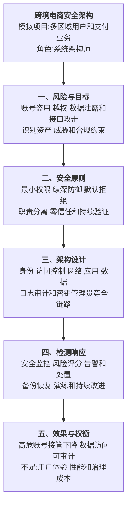

# 0007 系统安全架构设计 — 论文大纲记忆卡

> 对应资料：
> - `01-系统安全架构设计核心知识点.md`
> - `02-系统安全架构设计论文写作框架.md`
> - `03-系统安全架构设计论文范文.md`
>
> 训练标题：**论系统安全架构在跨境电商平台中的应用**
>
> **数据说明：风险、攻击和效果指标均为论文训练用模拟数据。**

## 一、论文主线



## 二、安全目标与原则

常用安全目标包括机密性、完整性、可用性、真实性、可审计性和不可抵赖性。具体分类应以题目和采用的标准为准，不把“CIA+CN”写成唯一固定体系。

| 原则 | 设计含义 | 常见措施 |
|------|----------|----------|
| 最小权限 | 只授予完成任务所需权限 | 默认拒绝、临时授权、定期回收 |
| 纵深防御 | 单层失守不导致全局失守 | 网络、身份、应用、数据多层控制 |
| 职责分离 | 关键操作不由单一主体完成 | 开发与发布分离、双人复核 |
| 安全默认 | 初始配置应安全 | 关闭非必要端口和接口、强制加密 |
| 零信任 | 不因网络位置自动信任 | 持续鉴别、设备与上下文评估 |
| 可恢复性 | 假设防护可能失败 | 备份、灾备、应急响应和演练 |

## 三、威胁驱动设计

```text
识别业务与数据资产
→ 建立数据流和信任边界
→ 识别威胁与攻击路径
→ 评估可能性和影响
→ 选择预防、检测、响应和恢复控制
→ 通过测试、审计和演练验证
```

可使用 STRIDE、攻击树或风险矩阵辅助分析，但论文应说明方法如何落到具体资产和数据流，而不是只列名词。

## 四、分层安全架构

| 层次 | 重点控制 | 常见风险 |
|------|----------|----------|
| 身份层 | MFA、短期令牌、风险鉴别、账号生命周期 | 凭据泄露、会话劫持、撞库 |
| 访问控制 | RBAC/ABAC、PDP/PEP、最小权限 | 越权、权限蔓延、租户隔离失败 |
| 网络与边界 | TLS、WAF、API 网关、微隔离、DDoS 防护 | 扫描、注入、横向移动、流量攻击 |
| 应用层 | 输入校验、依赖治理、安全编码、速率限制 | SQL 注入、XSS、业务逻辑滥用 |
| 数据层 | 分类分级、加密、脱敏、密钥管理、备份 | 泄露、篡改、密钥失控、不可恢复 |
| 运维与供应链 | 制品签名、漏洞扫描、审计、变更控制 | 恶意依赖、镜像污染、未授权变更 |
| 检测响应 | SIEM、UEBA、告警编排、应急预案 | 发现过晚、告警噪声、处置不一致 |

## 五、关键技术边界

### 5.1 JWT

- JWT 只是令牌格式，不天然等于安全或“完全无状态”；
- 使用成熟算法与库，不自创 `SM3 JWT` 签名协议；
- Access Token 短期有效，Refresh Token 需要轮换和撤销；
- 校验签名、发行者、受众、过期时间和唯一标识；
- 高风险场景需要令牌撤销、设备绑定或持续鉴别；
- 浏览器存储方式必须结合 XSS、CSRF 和 SameSite 策略设计。

### 5.2 MFA

MFA 必须组合不同因素类型，不能把“密码+安全问题”视为真正多因素。短信 OTP 可用但抗 SIM 换卡和钓鱼能力有限，高风险后台优先使用硬件密钥或抗钓鱼认证。

### 5.3 加密和密钥

- 传输数据使用 TLS；
- 静态敏感数据按分类分级加密；
- 密钥与密文分离，使用 KMS/HSM 管理生命周期；
- 密码使用专用慢哈希算法和随机盐，不使用通用快速摘要直接存储；
- 数字签名、HMAC 和加密分别解决真实性、完整性和机密性，不能混用概念。

## 六、实践因果链

### 6.1 账号接管


### 6.2 越权访问


### 6.3 审计防篡改

- 日志集中收集并限制写入主体；
- 使用追加写存储、WORM 或签名链增强防篡改能力；
- 时间同步、Trace ID 和用户身份关联；
- 对敏感字段脱敏，避免日志本身成为泄露源；
- 日志防篡改不等于不可抵赖，后者还依赖身份、密钥和证据链可信度。

## 七、检测、响应和恢复

```text
检测异常
→ 分级告警
→ 隔离账号、令牌、主机或网络路径
→ 保全证据并调查影响范围
→ 恢复服务和数据
→ 复盘根因并更新控制
```

恢复设计包括 RTO/RPO、备份不可变性、恢复演练和跨区域容灾。安全架构不能只写“防护”，还要覆盖检测、响应与恢复。

## 八、模拟指标统一表

| 指标 | 改造前 | 改造后 |
|------|--------|--------|
| 高危账号接管 | 基线 | 减少 90% |
| 越权事件 | 每月多起 | 连续 6 个月无确认事件 |
| 高危告警平均发现时间 | 4 小时 | 5 分钟 |
| 平均处置时间 | 8 小时 | 30 分钟 |
| 敏感访问审计覆盖率 | 60% | 100% |
| 灾备恢复验证 | 未定期演练 | 每季度完成恢复演练 |

## 九、考场检查

- [ ] 是否从资产、威胁、风险和合规约束出发
- [ ] 是否覆盖身份、访问控制、应用、数据和运维供应链
- [ ] 是否说明预防、检测、响应和恢复闭环
- [ ] 是否避免把 JWT、MFA、加密等技术写成万能方案
- [ ] 是否区分认证、授权、加密、签名和审计概念
- [ ] 是否包含密钥生命周期和权限回收
- [ ] 是否说明安全性与性能、体验、成本的权衡
- [ ] 模拟指标是否前后一致且未冒充真实项目数据

---

*当前维护批次：2026-H2｜最后更新：2026-07-31*