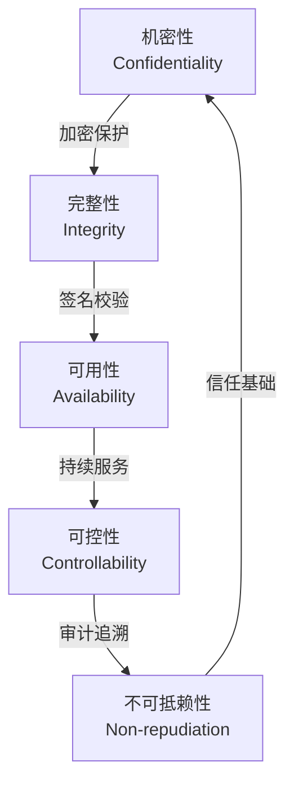
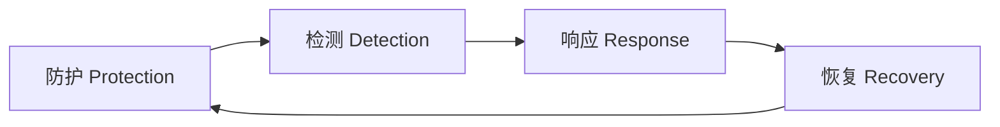
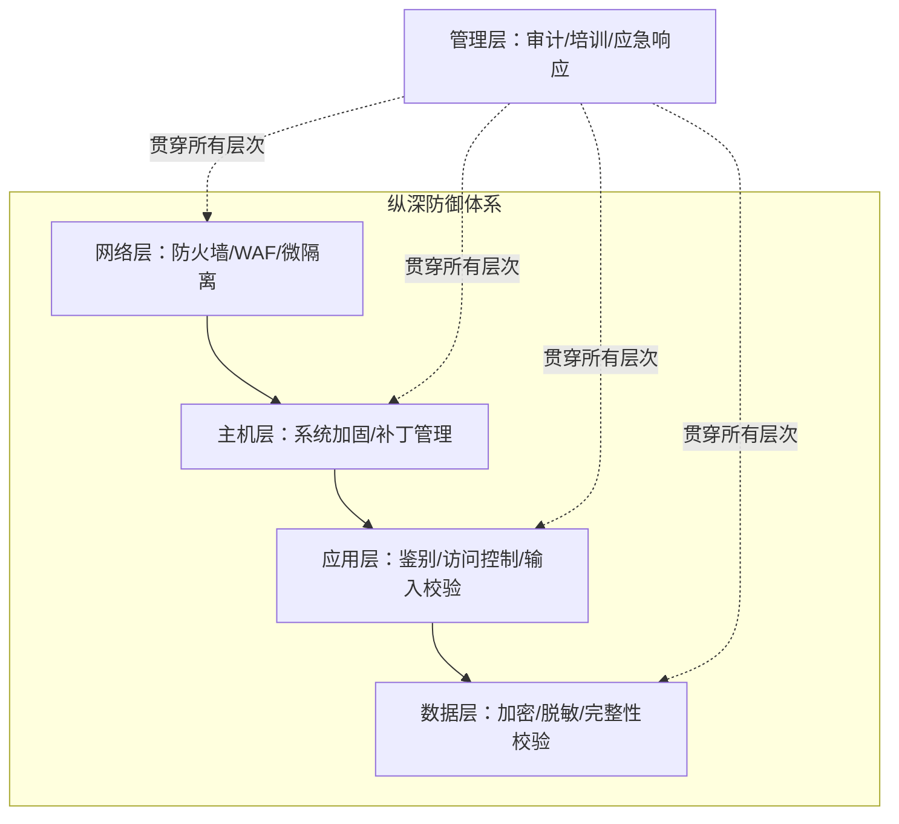
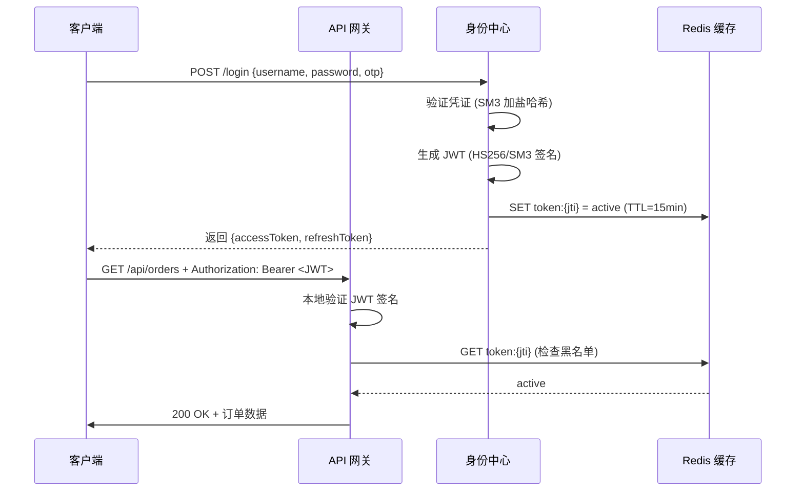
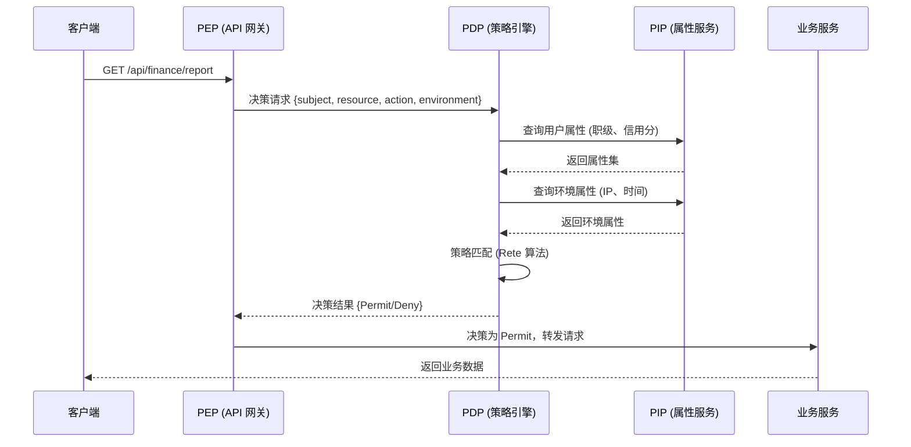
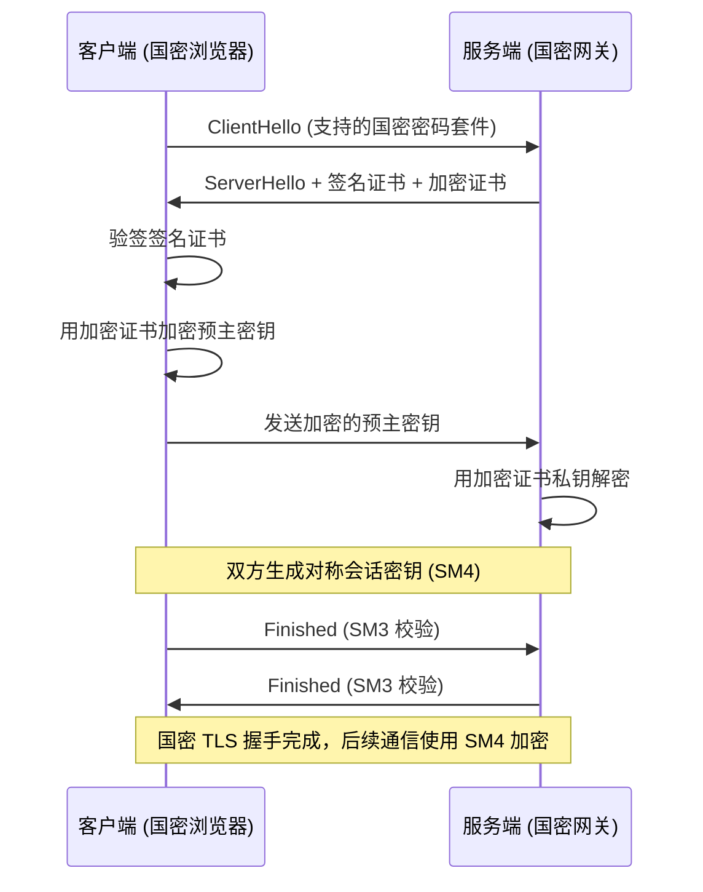
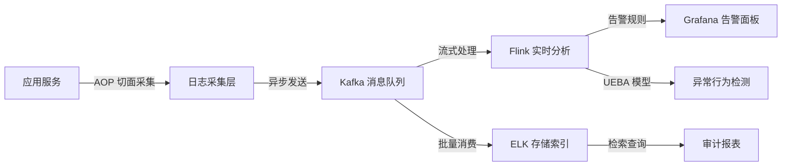

# 系统安全架构设计核心知识点

> 整理自 Google Gemini 学习对话 | 软考架构师论文专题

---

## 一、系统安全架构定义与核心特征

### 1.1 系统安全架构定义

系统安全架构是指在软件系统设计与实现过程中，为保障信息的 **机密性、完整性、可用性、可控性与不可抵赖性** 而构建的多层次防护体系。它不是单一技术的堆叠，而是基于 **风险评估 → 威胁建模 → 防护设计 → 持续审计** 的系统工程。

> **架构师视角**：系统安全架构的核心并非构建"不可逾越的围墙"，而是通过纵深防御体系 **无限拉高攻击者的攻击成本**，同时在安全性与业务连续性之间取得动态平衡。

### 1.2 信息安全五特征 (CIA + CN)

信息安全的所有设计都围绕以下五个核心特征展开，它们也是软考论文的理论基调：

| 特征 | 英文 | 定义 | 典型破坏方式 | 保护技术 |
|------|------|------|-------------|---------|
| 机密性 | Confidentiality | 确保敏感数据仅对授权者可见 | 数据泄露、中间人窃听 | 加密（SM4/AES）、访问控制、脱敏 |
| 完整性 | Integrity | 确保数据未被非法篡改 | 中间人篡改、SQL 注入 | HMAC、数字签名、校验和 |
| 可用性 | Availability | 授权用户可随时访问系统 | DDoS、死锁、单点故障 | 负载均衡、容灾、限流熔断 |
| 可控性 | Controllability | 对资源访问流向的全面掌控 | 权限蔓延、影子 IT | RBAC/ABAC、审计监控 |
| 不可抵赖性 | Non-repudiation | 操作者无法否认其行为 | 伪造交易记录、篡改日志 | 数字签名、审计日志、Hash Chain |



### 1.3 安全架构设计三原则

| 原则 | 英文 | 核心思想 | 违反后果 | 工程实践 |
|------|------|---------|---------|---------|
| 最小权限原则 | Principle of Least Privilege (PoLP) | 仅授予完成工作所需的最低权限 | 权限滥用、数据泄露 | 默认拒绝、按需授权、定期回收 |
| 纵深防御 | Defense in Depth | 多层独立防护，单一防线失守不致全盘崩溃 | 一处突破即全线崩溃 | 网络层 + 主机层 + 应用层 + 数据层 |
| 职责分离 | Segregation of Duties (SoD) | 关键操作需多人协作完成，避免权力集中 | 内部人员单点作案 | 开发/测试/上线权限分离、操作双人复核 |

---

## 二、安全模型与体系框架

### 2.1 PDRR 安全模型

PDRR 模型将安全防护划分为四个循环阶段，构成了安全架构的时间维度：

| 阶段 | 英文 | 核心任务 | 典型技术 |
|------|------|---------|---------|
| 防护 | Protection | 事前预防，构建基础防线 | 防火墙、加密、鉴别、访问控制 |
| 检测 | Detection | 实时发现异常行为 | IDS/IPS、UEBA、日志分析 |
| 响应 | Response | 对安全事件快速处置 | 自动封禁、告警通知、应急切换 |
| 恢复 | Recovery | 灾后数据与业务恢复 | 备份恢复、灾备切换、数据修复 |



### 2.2 PDR 安全模型

PDR 是 PDRR 的简化版本，去掉了"恢复"阶段，强调 **防护时间 > 检测时间 + 响应时间** 的安全公式：

| 模型 | 公式 | 适用场景 |
|------|------|---------|
| PDR | Pt > Dt + Rt | 一般业务系统，强调事前防护 |
| PDRR | Pt > Dt + Rt + 恢复成本 | 核心业务系统，包含灾备要求 |

> **架构师视角**：在论文中引用 PDRR 模型可以为安全设计提供理论框架，评审专家偏好看到模型驱动的设计思路。

### 2.3 纵深防御体系 (Defense in Depth)

纵深防御的核心在于：**假设每一层都可能被突破，因此需要多层独立的防护机制**。

| 防御层次 | 防护对象 | 典型技术 | 失效后果 |
|---------|---------|---------|---------|
| 网络层 | 通信链路与网络边界 | 防火墙、WAF、IPS、微隔离、VLAN | 外部攻击直达应用 |
| 主机层 | 操作系统与运行环境 | 主机加固、补丁管理、最小化安装 | 操作系统被攻陷 |
| 应用层 | 业务逻辑与用户交互 | 鉴别、访问控制、输入校验、CSRF 防护 | 业务逻辑被绕过 |
| 数据层 | 存储中的数据资产 | 加密、脱敏、备份、完整性校验 | 数据泄露或篡改 |
| 管理层 | 制度流程与人员 | 安全审计、培训、应急响应预案 | 管理失控 |



---

## 三、鉴别框架 (Authentication Framework)

### 3.1 五种鉴别方式

| 鉴别方式 | 依据类型 | 典型技术 | 安全性 | 易用性 | 适用场景 |
|---------|---------|---------|-------|-------|---------|
| 所知秘密 | 知识因素 | 口令、PIN 码 | 低 | 高 | 基础身份验证 |
| 拥有物品 | 持有因素 | IC 卡、U 盾、OTP 令牌 | 中 | 中 | 二次认证、后台管理 |
| 生物特征 | 固有因素 | 指纹、人脸、虹膜 | 高 | 中 | 高安全场景、移动支付 |
| 环境特性 | 上下文因素 | IP 白名单、设备指纹、地理位置 | 中 | 高 | 风险自适应鉴别 |
| 递推/第三方 | 委托因素 | OAuth 2.0、SAML、微信/支付宝登录 | 中 | 高 | 跨系统单点登录 |

### 3.2 多因素认证 (MFA)

MFA 要求同时满足 **两种或以上** 不同类型的鉴别方式，显著提升攻击者伪造身份的成本。

| MFA 方案 | 组合方式 | 安全性 | 成本 | 用户体验影响 | 适用场景 |
|---------|---------|-------|------|------------|---------|
| 口令 + 短信 OTP | 所知 + 所有 | 中 | 低 | 中（需接收短信） | 普通用户登录 |
| 口令 + 硬件 Token | 所知 + 所有 | 高 | 高 | 中（需携带设备） | 金融/政务后台 |
| 口令 + 生物识别 | 所知 + 所具 | 高 | 中 | 低（无感验证） | 移动端应用 |
| 口令 + 推送通知 | 所知 + 所有 | 中 | 低 | 低（一键确认） | 企业内部系统 |

> **架构师视角**：全局强制 MFA 会严重影响用户体验。推荐采用 **基于风险评分的自适应鉴别策略**：常规操作仅需口令，高危操作（异地登录、敏感数据下载、改密）才触发 MFA。

### 3.3 JWT 无状态鉴别

JWT (JSON Web Token) 是微服务架构下主流的无状态鉴别方案。

| 对比维度 | Session 方案 | JWT 方案 |
|---------|-------------|---------|
| 状态管理 | 服务端存储 Session（有状态） | 令牌自包含声明（无状态） |
| 扩展性 | 需共享 Session 存储，横向扩展复杂 | 天然支持水平扩展 |
| 性能 | 每次请求需查 Session 存储 | 本地校验签名，性能极高 |
| 撤销机制 | 服务端直接删除 Session | 需黑名单机制（Redis） |
| 跨域支持 | 受 Cookie 同源策略限制 | 通过 Authorization Header 跨域传递 |
| 安全风险 | Session 固定攻击、CSRF | XSS 窃取令牌、令牌过期难控 |



**代码示例：JWT 生成与验证（Java + SM3 签名）**

```java
// 优化前：传统 Session 方案
HttpSession session = request.getSession();
session.setAttribute("userId", user.getId());
// 每次请求都需要查询 Session 存储，数据库 IO 成为瓶颈

// 优化后：JWT 无状态方案
String generateToken(User user) {
    // 使用 SM3 算法生成签名
    Algorithm algorithm = Algorithm.SM3WithSM2(privateKey);
    Date now = new Date();
    Date expiry = new Date(now.getTime() + 15 * 60 * 1000); // 15分钟短效

    return JWT.create()
        .withSubject(user.getId().toString())
        .withClaim("role", user.getRole())
        .withClaim("riskLevel", calculateRiskLevel(user))
        .withIssuedAt(now)
        .withExpiresAt(expiry)
        .withJWTId(UUID.randomUUID().toString()) // JTI，用于黑名单管理
        .sign(algorithm);
}
```

### 3.4 SSO 与 OAuth 2.0

单点登录（SSO）解决跨系统身份统一认证问题。

| 协议 | 适用场景 | 令牌格式 | 特点 |
|------|---------|---------|------|
| OAuth 2.0 | 第三方授权访问 | Access Token (不透明令牌) | 授权码模式最安全，支持细粒度 Scope |
| SAML 2.0 | 企业联邦身份认证 | XML 断言 | 安全性高，但报文冗长、解析开销大 |
| OpenID Connect (OIDC) | 现代身份认证 | JWT (ID Token) | 基于 OAuth 2.0 的身份层，轻量灵活 |

### 3.5 令牌生命周期管理

| 生命周期阶段 | 管理策略 | 技术实现 | 安全考量 |
|-------------|---------|---------|---------|
| 签发 | 双 Token 机制（Access + Refresh） | Access Token 短效（15min），Refresh Token 长效（7d） | 减少令牌泄露窗口 |
| 续签 | 静默续签 | Refresh Token 换取新 Access Token | 避免频繁要求用户重新登录 |
| 主动撤销 | 黑名单机制 | 将 JTI 写入 Redis，网关校验时检查 | 解决 JWT 难以即时撤回的问题 |
| 被动过期 | 自动失效 | JWT 内置 exp 字段，到期自动拒绝 | 无需服务端维护过期令牌 |
| 存储安全 | 客户端安全存储 | Web: httpOnly Cookie; Mobile: Keychain/Keystore | 防止 XSS 窃取令牌 |

**代码示例：JWT 黑名单机制**

```java
// 主动吊销令牌（用户改密/主动登出）
void revokeToken(String jti) {
    redisTemplate.opsForValue().set(
        "token:blacklist:" + jti,
        "revoked",
        15, TimeUnit.MINUTES // TTL 与 Access Token 有效期一致
    );
}

// 网关校验时检查黑名单
boolean isTokenValid(String jti) {
    return !redisTemplate.hasKey("token:blacklist:" + jti);
}
```

---

## 四、访问控制框架 (Access Control Framework)

### 4.1 访问控制模型对比

| 模型 | 英文 | 控制主体 | 灵活性 | 管理成本 | 适用场景 |
|------|------|---------|-------|---------|---------|
| DAC | 自主访问控制 | 资源拥有者 | 高 | 高 | 个人文件系统 |
| MAC | 强制访问控制 | 系统安全标签 | 极低 | 极高 | 军事/政府高密级系统 |
| RBAC | 基于角色的访问控制 | 角色定义 | 中 | 低 | 企业一般业务系统 |
| ABAC | 基于属性的访问控制 | 多维属性组合 | 极高 | 中 | 复杂动态授权场景 |

| 对比维度 | RBAC | ABAC |
|---------|------|------|
| 决策依据 | 用户所属角色 | 主体 + 客体 + 环境 + 操作属性 |
| 策略表达力 | "角色 A 可访问资源 B" | "财务角色在工作时间可从办公网查询订单" |
| 角色爆炸问题 | 是（组合场景需大量角色） | 否（属性组合天然支持） |
| 性能 | 高（简单角色-权限映射） | 低（需实时计算大量策略） |
| 动态性 | 静态授权 | 动态授权 |
| 适用系统 | 组织结构稳定的企业 | 跨境电商等多变场景 |

> **架构师视角**：在跨境电商等复杂场景中，纯 RBAC 会导致"角色爆炸"（如：海外运营-欧洲站-财务-仅工作日），而 ABAC 可通过属性组合优雅解决。

### 4.2 PDP / PEP / PIP 架构模式

XACML 标准定义的三层访问控制架构：

| 组件 | 英文 | 功能 | 部署位置 | 典型实现 |
|------|------|------|---------|---------|
| PEP | Policy Enforcement Point | 拦截请求，向 PDP 发起决策查询并执行决策 | API 网关 / 服务侧车 | Kong / Istio / 自定义拦截器 |
| PDP | Policy Decision Point | 根据策略规则计算 Allow/Deny 决策 | 独立安全服务 | OPA (Open Policy Agent) / 自研引擎 |
| PIP | Policy Information Point | 提供决策所需的动态属性数据 | 属性数据源 | LDAP / 数据库 / 风控系统 |
| PAP | Policy Administration Point | 策略的管理与发布 | 管理后台 | 策略编辑器 + 版本管理 |



### 4.3 权限冲突解决与职责分离 (SoD)

| 冲突场景 | 解决方案 | 原理 |
|---------|---------|------|
| 允许与禁止冲突 | 拒绝优先 (Deny-overrides) | 只要有一条规则禁止，最终决策即为 Deny |
| 多条允许冲突 | 允许优先 (Permit-overrides) | 只要有一条规则允许，最终决策即为 Permit |
| 管理员权力过大 | 职责分离 (SoD) | 关键操作需两人协作（如：申请 + 审批） |
| 角色继承冲突 | 角色继承链最低权限生效 | 子角色继承父角色权限，但不能超越父角色限制 |

---

## 五、加密体系与国密算法

### 5.1 分层加密架构

| 层次 | 防护对象 | 加密协议 | 典型技术 |
|------|---------|---------|---------|
| 传输层 | 网络通信 | TLS 1.3 / 国密 SSL | HTTPS、mTLS（微服务双向认证） |
| 存储层 | 持久化数据 | TDE (透明数据加密) | 列级加密、文件级加密、数据库加密 |
| 应用层 | 业务报文 | 端到端加密 | 字段级加密（SM4/AES）、HMAC 签名 |

### 5.2 国密算法 (SM 系列) vs 国际算法

| 国密算法 | 类型 | 对应国际算法 | 特点 | 适用场景 |
|---------|------|------------|------|---------|
| SM2 | 非对称加密 | RSA / ECC (椭圆曲线) | 256 位强度高于 2048 位 RSA；基于 ECC | 数字签名、身份认证、密钥交换 |
| SM3 | 密码杂凑算法 | SHA-256 | 输出 256 位摘要；抗碰撞性强 | 口令脱敏、JWT 签名、完整性校验 |
| SM4 | 分组对称加密 | AES | 128 位分组，128 位密钥；性能接近 AES | 大数据量存储加密、报文加密 |
| SM9 | 标识密码算法 | IBE (基于身份的加密) | 以用户身份（邮箱/手机号）作为公钥 | 物联网设备认证、内部通信 |

### 5.3 国密双证书机制

国密体系要求使用 **签名证书 + 加密证书** 的双证书机制，与国际体系的单一证书不同：

| 证书类型 | 用途 | 算法 | 生命周期 |
|---------|------|------|---------|
| 签名证书 | 身份识别与数字签名 | SM2 签名 | 较长（1-2 年） |
| 加密证书 | 密文传输与密钥交换 | SM2 加密 | 较短（需定期轮转） |



### 5.4 数据完整性保护

| 技术 | 原理 | 适用场景 | 性能 |
|------|------|---------|------|
| HMAC | 基于密钥 + 哈希的消息认证码 | API 请求签名、支付指令完整性 | 高 |
| 数字签名 | 私钥签名 + 公钥验证 | 合同签署、交易凭证 | 中（非对称计算） |
| 行级校验和 | 每行数据附加哈希值 | 数据库防篡改（含 DBA 篡改检测） | 高 |

---

## 六、安全审计与可观测性

### 6.1 审计日志架构



| 组件 | 功能 | 技术选型 |
|------|------|---------|
| 日志采集 | 无侵入采集敏感操作 | Spring AOP / 中间件插件 |
| 消息缓冲 | 削峰填谷，避免同步入库 | Kafka / RocketMQ |
| 实时分析 | 风险建模与即时告警 | Flink / Spark Streaming |
| 存储检索 | 审计数据持久化与查询 | Elasticsearch + Kibana |

### 6.2 Hash Chain 防篡改

审计日志本身需要防篡改保护，否则攻击者入侵后可 **销毁证据**。Hash Chain 技术通过链式哈希确保日志不可篡改：

```
Log[0]  = Hash(Data[0] + Seed)
Log[1]  = Hash(Data[1] + Log[0])
Log[2]  = Hash(Data[2] + Log[1])
...
Log[N]  = Hash(Data[N] + Log[N-1])
```

验证时只需从 Seed 开始重新计算，任何中间条目的修改都会导致后续所有哈希不匹配。

```java
// Hash Chain 审计日志实现
public class HashChainLogger {
    private byte[] lastHash; // 链式哈希指针

    public HashChainLogger(byte[] seed) {
        this.lastHash = seed;
    }

    public void appendLog(String action, String operator, String detail) {
        byte[] data = (action + operator + detail).getBytes(StandardCharsets.UTF_8);
        byte[] currentHash = SM3Utils.hash(concat(data, lastHash)); // SM3 杂凑
        lastHash = currentHash;

        // 写入日志：包含当前数据 + 前向哈希
        logRepository.save(new AuditLog(action, operator, detail, currentHash));
    }

    public boolean verifyChain(List<AuditLog> logs, byte[] seed) {
        byte[] prevHash = seed;
        for (AuditLog log : logs) {
            byte[] expected = SM3Utils.hash(concat(log.getDataBytes(), prevHash));
            if (!Arrays.equals(expected, log.getHash())) {
                return false; // 检测到篡改
            }
            prevHash = log.getHash();
        }
        return true;
    }
}
```

### 6.3 UEBA 用户实体行为分析

UEBA 不仅记录"谁做了什么"，还分析 **"这么做是否正常"**：

| 异常行为模式 | 检测逻辑 | 响应动作 |
|-------------|---------|---------|
| 深夜大流量下载 | 对比历史基线（工作时段/流量模式） | 阻断 + 告警 + MFA 挑战 |
| 同一 IP 短时大量失败登录 | 频率阈值（如 1 分钟 50 次失败） | 临时封禁 IP + 告警 |
| 权限变更后的异常操作 | 权限变更后首次操作审计 | 二次确认 + 日志高亮 |
| 非常规地理位置登录 | IP 地理位置与用户画像对比 | 触发 OTP 验证 |

### 6.4 差异化审计策略

| 操作类别 | 审计深度 | 存储周期 | 示例 |
|---------|---------|---------|------|
| 普通操作 | 元数据（操作人、时间、结果） | 30 天 | 浏览商品、查询订单 |
| 敏感操作 | 全量报文 + 决策上下文 | 180 天 | 修改密码、导出数据 |
| 高危操作 | 全量报文 + 视频录屏 + Hash Chain | 永久 | 权限变更、系统配置修改 |

> **架构师视角**：全量审计存储成本极高。差异化策略在审计深度与存储成本之间取得平衡，同时确保关键操作可追溯。

---

## 七、零信任架构 (ZTA)

### 7.1 核心原则

| 原则 | 描述 | 与传统架构的差异 |
|------|------|----------------|
| 永不信任 | 内网/外网无区别，所有请求默认不可信 | 传统架构假设内网安全 |
| 始终验证 | 每次访问都需身份验证与授权检查 | 传统架构登录后免检 |
| 最小权限 | 动态授予访问权限，用完即收回 | 传统架构长期授权 |
| 持续评估 | 根据设备、行为、环境持续计算信任评分 | 传统架构一次性认证 |

### 7.2 关键组件

| 组件 | 英文 | 功能 |
|------|------|------|
| 策略引擎 | Policy Engine | 最终决策大脑，综合多维属性输出 Permit/Deny |
| 策略代理 | Policy Agent | 请求的唯一入口，拦截所有未经验证的流量 |
| 信任评分 | Trust Score | 基于设备合规性、地理位置、历史行为动态计算 |

### 7.3 零信任与传统架构对比

| 对比维度 | 传统边界防御 | 零信任架构 |
|---------|------------|-----------|
| 信任假设 | 内网可信、外网不可信 | 任何网络位置均不可信 |
| 认证时机 | 登录时一次性认证 | 每次访问持续验证 |
| 权限授予 | 长期静态授权 | 动态按需授权 |
| 防护重点 | 网络边界（防火墙） | 身份与数据（微隔离） |
| 适用场景 | 固定办公网络 | 远程办公、混合云、物联网 |

---

## 八、架构师权衡方法论

### 8.1 安全 vs 性能

| 冲突场景 | 问题描述 | 权衡方案 | 效果 |
|---------|---------|---------|------|
| 权限校验延迟 | ABAC 实时计算策略导致响应慢 | 分布式缓存 + 版本号失效机制 | 鉴权延迟从 200ms 降至 10ms |
| 加密计算开销 | 全库加密导致数据库性能下降 | 分级加密 + 硬件加速 (HSM) | 核心字段加密，延迟控制在 5ms |
| 审计日志写入 | 同步写日志阻塞业务线程 | Kafka 异步缓冲 + 批量消费 | 业务线程零阻塞，日志不丢失 |

### 8.2 安全 vs 用户体验

| 冲突场景 | 问题描述 | 权衡方案 | 效果 |
|---------|---------|---------|------|
| MFA 操作繁琐 | 每次登录都需要 OTP，运营效率低 | 基于风险评分的自适应鉴别 | 常规登录静默通过，高危操作才触发 MFA |
| 密码复杂度要求 | 强密码策略导致用户遗忘率高 | 生物识别 + 设备信任 | 降低密码复杂度要求，通过生物特征补偿 |
| Session 超时频繁 | 短超时保证安全但频繁要求重登录 | 双 Token 静默续签 | 用户无感，安全与体验兼顾 |

### 8.3 防御强度 vs 成本

| 冲突场景 | 问题描述 | 权衡方案 | 效果 |
|---------|---------|---------|------|
| 全量国密改造 | 全链路国密改造需要硬件投入 | 核心字段优先国密 + 软件过渡 | 满足密评要求，成本可控 |
| 全量硬件加密机 | 全量 HSM 部署成本过高 | 混合模式（核心用 HSM，普通用软件） | 安全与成本平衡 |
| 全量微隔离 | 细粒度微隔离运维成本极高 | 先按业务域粗隔离，逐步细化 | 收缩攻击面，运维可控 |

```java
// 自适应风险鉴别逻辑
public class RiskBasedAuthenticator {
    public AuthLevel determineAuthLevel(LoginContext ctx) {
        int riskScore = calculateRiskScore(ctx);

        if (riskScore < 20) {
            return AuthLevel.SILENT; // 设备指纹匹配，静默通过
        } else if (riskScore < 60) {
            return AuthLevel.PASSWORD_ONLY; // 常规登录，仅需口令
        } else if (riskScore < 80) {
            return AuthLevel.MFA; // 异地/非常用设备，触发 MFA
        } else {
            return AuthLevel.BLOCKED; // 高风险，直接拒绝
        }
    }

    private int calculateRiskScore(LoginContext ctx) {
        int score = 0;
        if (!ctx.isKnownDevice()) score += 30;
        if (ctx.isForeignLocation()) score += 25;
        if (ctx.isOffHours()) score += 15;
        if (ctx.isSensitiveOperation()) score += 30;
        return Math.min(score, 100);
    }
}
```

---

## 九、合规标准映射

### 9.1 等保 2.0 (GB/T 22239)

| 安全层面 | 核心要求 | 对应技术措施 |
|---------|---------|-------------|
| 安全物理环境 | 机房防护、供电保障 | 标准 IDC 托管 |
| 安全通信网络 | 网络隔离、通信加密 | VLAN 隔离、TLS 1.3 |
| 安全区域边界 | 边界防护、入侵防范 | 防火墙、WAF、IPS |
| 安全计算环境 | 身份鉴别、访问控制、安全审计 | MFA、ABAC、Kafka 审计 |
| 安全管理中心 | 集中管控、安全事件处置 | SOC 安全运营中心 |

### 9.2 密评 (商用密码应用安全性评估)

| 评估维度 | 要求 | 对应实现 |
|---------|------|---------|
| 密码算法合规性 | 使用国家密码管理局批准的算法 | SM2/SM3/SM4 替换 RSA/SHA-256/AES |
| 密码模块安全性 | 加密模块通过国家认证 | 国密安全网关 + HSM 硬件加速 |
| 密钥管理安全性 | 密钥生成、存储、分发、销毁合规 | 密钥轮转 + HSM 保护 + 分级管理 |
| 密码应用有效性 | 加密措施在实际场景中有效 | 渗透测试 + 攻防演练验证 |

### 9.3 ISO 27001

| 控制域 | 安全要求 | 系统实现 |
|-------|---------|---------|
| 访问控制 (A.9) | 最小权限、定期权限审查 | RBAC + SoD + 季度权限回收 |
| 密码学 (A.10) | 加密策略与密钥管理 | SM4 存储加密 + TLS 传输加密 |
| 操作安全 (A.12) | 日志记录与监控 | Kafka + ELK + Flink 实时监控 |
| 通信安全 (A.13) | 网络安全与传输保护 | 微隔离 + mTLS + 国密双证书 |

---

## 软考高频考点总结

| 考点 | 题型 | 常考内容 | 答题要点 |
|------|------|---------|---------|
| 信息安全五特征 | 选择题/论文 | CIA+CN 定义与关系 | 论文开头或总结中引用 |
| 鉴别方式分类 | 选择题 | 五种鉴别方式的对比 | 能区分知识/持有/固有/上下文/委托因素 |
| RBAC vs ABAC | 论文 | 两种模型的优缺点对比 | 论文中论述从 RBAC 演进到 ABAC 的理由 |
| JWT 原理 | 论文 | 无状态鉴别的设计 | 需提及黑名单机制解决撤销问题 |
| 国密算法 | 选择题/论文 | SM2/SM3/SM4 对应关系 | 论文中论述国密改造过程 |
| 等保 2.0 | 选择题 | 三级等保核心要求 | 论文中提及符合三级等保 |
| PDP/PEP 架构 | 论文 | XACML 三层架构 | 论文中论述访问控制架构时使用 |
| 安全权衡 | 论文 | 安全与性能的平衡 | 论文第三部分必须体现 |
| 纵深防御 | 论文 | 多层防护体系设计 | 论文中作为整体安全战略论述 |
| Hash Chain | 论文 | 审计日志防篡改 | 论文中体现审计完整性 |

---

## 术语对照表

| 中文术语 | 英文术语 | 缩写/别名 |
|---------|---------|----------|
| 机密性 | Confidentiality | - |
| 完整性 | Integrity | - |
| 可用性 | Availability | - |
| 可控性 | Controllability | - |
| 不可抵赖性 | Non-repudiation | - |
| 多因素认证 | Multi-Factor Authentication | MFA |
| 单点登录 | Single Sign-On | SSO |
| JSON Web 令牌 | JSON Web Token | JWT |
| 基于角色的访问控制 | Role-Based Access Control | RBAC |
| 基于属性的访问控制 | Attribute-Based Access Control | ABAC |
| 策略决策点 | Policy Decision Point | PDP |
| 策略执行点 | Policy Enforcement Point | PEP |
| 策略信息点 | Policy Information Point | PIP |
| 最小权限原则 | Principle of Least Privilege | PoLP |
| 职责分离 | Segregation of Duties | SoD |
| 纵深防御 | Defense in Depth | DiD |
| 零信任架构 | Zero Trust Architecture | ZTA |
| 用户实体行为分析 | User and Entity Behavior Analytics | UEBA |
| 数据变更捕获 | Change Data Capture | CDC |
| 硬件安全模块 | Hardware Security Module | HSM |
| 中间人攻击 | Man-in-the-Middle | MITM |
| 跨站请求伪造 | Cross-Site Request Forgery | CSRF |
| 跨站脚本攻击 | Cross-Site Scripting | XSS |
| 网络应用防火墙 | Web Application Firewall | WAF |
| 入侵检测系统 | Intrusion Detection System | IDS |
| 入侵防御系统 | Intrusion Prevention System | IPS |
| 安全运营中心 | Security Operations Center | SOC |

---

*整理时间：2026 年 4 月 | 适用考试：系统架构设计师（2026 年 5 月）*
