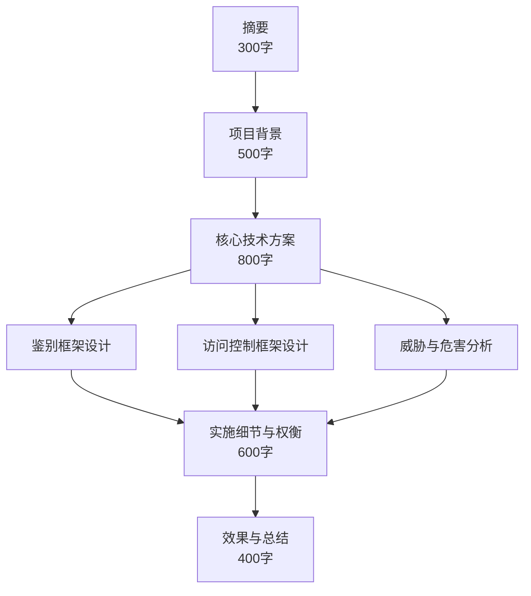

# 系统安全架构设计论文写作框架

> 软考架构师论文专题 | 适用考试：系统架构设计师（2026 年 5 月）

---

## 零、审题方法论

### 0.1 三步审题法

| 步骤 | 动作 | 关注点 | 输出 |
|------|------|-------|------|
| 第一步：识别题型 | 通读题目要求，判断是"理论+实践"型还是"问题解决"型 | 是否要求论述"鉴别与访问控制框架"？是否要求分析"威胁与危害"？ | 确定论文核心章节 |
| 第二步：匹配项目 | 从预研项目库中选择最匹配的项目背景 | 项目规模是否足够大？是否涉及微服务/分布式？安全挑战是否明确？ | 确定项目背景素材 |
| 第三步：列出论点 | 根据题干要求列出 3-4 个核心论点 | 每个论点需包含：技术选型、实施细节、权衡考量 | 确定正文骨架 |

### 0.2 安全架构题型拆解策略

| 题型特征 | 推荐写法 | 核心考点 | 写作侧重点 |
|---------|---------|---------|-----------|
| "论系统安全架构设计及其应用" | 五特征引入 → 鉴别 → 访问控制 → 权衡 | 安全特征理解、框架设计能力 | 理论与项目实践结合 |
| "论鉴别与访问控制框架的设计" | 鉴别框架（50%）+ 访问控制（50%） | JWT/MFA/RBAC/ABAC/PDP/PEP | 两种框架的技术深度 |
| "论安全架构中性能与安全的平衡" | 问题描述 → 权衡分析 → 方案对比 → 实施效果 | 架构师权衡能力 | 量化指标对比 |
| "论零信任架构的实践" | 传统架构痛点 → ZTA 原理 → 组件设计 → 渐进式演进 | 前沿技术理解 | 演进路径与落地挑战 |

### 0.3 题干关键词映射表

| 题干关键词 | 考查方向 | 论文中必须论述的要点 |
|-----------|---------|-------------------|
| "鉴别框架" | 身份认证机制 | 五种鉴别方式、MFA、JWT、SSO、重放攻击防御 |
| "访问控制框架" | 权限管理模型 | RBAC vs ABAC、PDP/PEP/PIP、越权风险 |
| "面临的威胁与危害" | 安全威胁分析 | 垂直/水平越权、重放攻击、撞库、中间人攻击 |
| "平衡/权衡" | 架构师决策能力 | 安全 vs 性能 vs 体验 vs 成本的具体方案 |
| "纵深防御" | 多层防护体系 | 网络层/主机层/应用层/数据层/管理层的分层设计 |
| "合规" | 标准遵循 | 等保 2.0、国密算法、密评 |

---

## 一、论文结构公式

### 1.1 字数分配表

```
摘要 (300 字) → 背景与问题 (500 字) → 核心技术方案 (800 字) → 实施细节 (600 字) → 效果与总结 (400 字)
```

| 章节 | 建议字数 | 核心内容 |
|------|---------|---------|
| 摘要 | 300 字 | 项目背景 + 面临困境 + 技术方案 + 实施效果 |
| 项目背景与个人职责 | 500 字 | 项目规模、安全挑战、架构师职责 |
| 核心技术方案 | 800 字 | 鉴别框架 + 访问控制框架 + 威胁分析 |
| 实施细节与权衡 | 600 字 | 性能优化、体验优化、国密改造 |
| 效果与总结 | 400 字 | 量化成果、等保通过、反思展望 |

### 1.2 安全架构论文专属章节内容指南

| 章节 | 必备要素 | 关键术语 | 避免事项 |
|------|---------|---------|---------|
| 摘要 | 项目规模、核心方案、量化效果 | JWT、ABAC、等保 2.0、国密 | 空洞的"提高了安全性"表述 |
| 背景 | 安全痛点量化、业务影响 | 越权率、泄露事件、合规压力 | 过于冗长的业务描述 |
| 核心设计 | 技术选型理由、架构图描述、威胁分析 | PDP/PEP、MFA、纵深防御 | 只列技术名不解释理由 |
| 实施权衡 | 对比分析、决策过程、量化改善 | 缓存、异步、分级加密 | 只讲方案不讲取舍 |
| 总结 | 具体指标、合规认证、未来方向 | TPS、MTTR、零信任 | 泛泛的"取得良好效果" |

### 1.3 标准考题模板



| 部分 | 内容要点 | 关键术语 |
|------|---------|---------|
| 摘要 | 一句话背景、核心方案、量化成果 | JWT, ABAC, 等保2.0 |
| 背景 | 项目规模、安全痛点、个人职责 | 微服务, 高并发, 敏感数据 |
| 核心-鉴别 | 五种鉴别方式、JWT 无状态、MFA 策略 | MFA, JWT, SM3, 黑名单 |
| 核心-访问控制 | RBAC→ABAC、PDP/PEP、越权分析 | RBAC, ABAC, PDP, PEP |
| 核心-威胁 | 重放攻击、越权访问、中间人攻击 | Replay, IDOR, MITM |
| 实施-性能 | 缓存策略、异步审计、分级加密 | Redis, Kafka, 分级加密 |
| 实施-体验 | 自适应鉴别、双 Token、生物识别 | 风险评分, 静默验证 |
| 总结 | 量化指标、合规认证、反思展望 | TPS, 等保, 零信任 |

---

## 二、摘要写作模板

### 2.1 摘要公式

```
项目背景 + 面临困境 + 技术方案 + 实施效果
```

### 2.2 通用填空模板

```
YYYY 年 MM 月，我参与了 [项目描述] 项目，并在其中担任系统架构师。该系统
面临 [安全挑战 1]、[安全挑战 2] 等严峻挑战。为了确保系统的 [安全特征]，
我主导了系统安全架构的设计与实施。

在鉴别框架中，我采用了 [鉴别技术方案]，有效抵御了 [威胁类型]。在访问控制
框架中，我主导了从 [旧方案] 向 [新方案] 的演进，通过 [架构模式] 实现了
[效果]。针对安全与性能的平衡，我引入了 [优化方案]。最终，系统顺利通过了
[合规认证]，保障了业务的稳健运行。
```

### 2.3 示例：跨境电商安全架构

> 2026 年 4 月，我参与了某大型跨境电商软件系统的重构项目，并在其中担任系统架构师。该系统面临高并发（峰值达 30 万 TPS）、数据高度敏感及多国合规性要求等挑战。为了确保系统的机密性、完整性、可用性、可控性与不可抵赖性，我主导了系统安全架构的设计与实施。
>
> 在鉴别框架中，我采用了基于国密 SM3 算法的多因素认证（MFA）与无状态令牌（JWT）机制，有效抵御了重放攻击与撞库风险。在访问控制框架中，我主导了从 RBAC 向 ABAC 的演进，通过 PDP/PEP 架构实现了细粒度的动态权限管理。针对安全与性能的平衡，我引入了分布式缓存与硬件加速技术。最终，系统顺利通过了国家等级保护 2.0 三级测评，保障了业务的稳健运行。

### 2.4 示例：金融系统安全架构

> 2025 年 9 月，我参与了某银行核心交易系统的安全升级项目，担任系统架构师。系统日均处理交易超 500 万笔，涉及大量用户资金与隐私数据，任何安全漏洞都将导致不可挽回的损失。我主导了全链路安全架构的设计。
>
> 在鉴别框架中，我设计了基于数字证书 + 生物识别的双因素认证体系，结合国密 SM2 算法实现强身份鉴别。在访问控制框架中，我引入了基于属性的动态授权模型（ABAC），实现了按交易金额、风险等级、操作环境的多维度管控。最终，系统通过了密评与等保 2.0 三级双重认证。

### 2.5 摘要写作注意事项

| 正确做法 | 错误做法 |
|---------|---------|
| 包含具体数字（30 万 TPS、500 万笔/日） | "系统规模很大"（无量化描述） |
| 列出核心技术名（JWT、ABAC、SM3） | "采用了先进的安全技术"（过于模糊） |
| 提及合规认证（等保 2.0、密评） | 不提任何合规标准 |
| 分两段：背景 + 方案成果 | 写成一整段超过 400 字 |

---

## 三、正文核心论点

### 3.1 项目背景写法

| 要素 | 写法 | 示例 |
|------|------|------|
| 项目规模 | 用数据说话 | "日处理订单超百万级，峰值 TPS 达 30 万" |
| 旧架构描述 | 简述之前的安全方案 | "旧系统采用 Session + RBAC 的单体安全方案" |
| 痛点量化 | 用安全事件/指标说明 | "越权访问事件月均 15 起，鉴别延迟超 500ms" |
| 业务影响 | 关联安全与业务损失 | "安全事件导致用户流失率达 8%，合规审计不通过" |

### 3.2 鉴别框架论述模板

```
论述逻辑链：
威胁识别 → 方案选型 → 技术实现 → 效果验证
```

**填空模板**：

```
在鉴别框架设计中，我针对 [具体威胁，如"重放攻击"、"撞库攻击"] 的威胁，
选择了 [技术方案，如"JWT + MFA"] 作为核心鉴别机制。

具体而言，[描述技术实现细节：算法、协议、组件]。

为了解决 [技术难点，如"JWT 撤销难"] 的问题，我引入了 [解决方案，如"黑名单机制"]。

最终，鉴别延迟从 [优化前指标] 降至 [优化后指标]，有效抵御了 [威胁类型]。
```

**鉴别方案三选一对比（论文中应展示论证过程）**：

| 方案 | 优点 | 缺点 | 选择理由 |
|------|------|------|---------|
| Session | 实现简单、服务端可控 | 扩展性差、数据库 IO 瓶颈 | ❌ 不适用于微服务 |
| JWT | 无状态、高性能、天然支持水平扩展 | 撤销困难 | ✅ 配合黑名单机制可解决撤销问题 |
| 混合（JWT + Session） | 兼顾灵活性与可控性 | 复杂度高、维护成本大 | ❌ 过度设计 |

### 3.3 访问控制框架论述模板

**填空模板**：

```
在访问控制框架设计中，为了解决 [问题，如"角色爆炸"、"权限维度僵化"]，
我从 [旧方案，如"RBAC"] 演进到 [新方案，如"ABAC"]。

架构上，我采用了 PDP/PEP/PIP 三层解耦设计：[描述各组件功能与部署位置]。

为了解决 [性能问题]，我采用了 [优化方案，如"策略预编译 + 缓存"]。

实施后，权限配置错误率从 [优化前] 降至 [优化后]，鉴权响应时间控制在 [指标] 以内。
```

**访问控制方案三选一对比**：

| 方案 | 适用性 | 复杂度 | 灵活性 | 选择理由 |
|------|-------|-------|-------|---------|
| 纯 RBAC | 组织结构稳定的企业 | 低 | 低 | ❌ 无法应对动态授权场景 |
| 纯 ABAC | 复杂多变的高安全场景 | 高 | 极高 | ✅ 满足细粒度动态授权需求 |
| RBAC + ABAC 混合 | 一般企业 | 中 | 中高 | ✅ 也可选，用 RBAC 管理基础权限，ABAC 处理特殊场景 |

### 3.4 安全权衡论述模板

| 权衡维度 | 问题模板 | 方案模板 | 效果模板 |
|---------|---------|---------|---------|
| 安全 vs 性能 | "[安全方案] 导致 [性能指标] 下降" | "引入 [缓存/异步/分级] 策略" | "响应时间从 [X] 降至 [Y]" |
| 安全 vs 体验 | "[安全措施] 导致用户操作效率下降" | "设计 [自适应/静默] 鉴别" | "日常操作无感，高危操作加强" |
| 强度 vs 成本 | "[强防护方案] 投入成本过高" | "采用 [分级/混合] 防护" | "核心数据强防护，普通数据轻量防护" |

### 3.5 国密改造论述模板

```
在国密改造过程中，我将原有的 [国际算法，如"RSA + SHA-256 + AES"]
替换为国密系列算法 [SM2 + SM3 + SM4]。

改造分为三个层次：
1. 通信层：[描述 TLS 改造、双证书部署]
2. 存储层：[描述字段级加密方案]
3. 应用层：[描述签名验证、口令脱敏改造]

在性能方面，通过 [硬件加速/HSM/密钥缓存] 等手段，将国密算法的计算开销
控制在可接受范围内，[量化指标]。

最终系统顺利通过了商用密码应用安全性评估（密评）。
```

---

## 四、论文题目建议

| 题目 | 适用场景 | 核心考点 | 难度 |
|------|---------|---------|------|
| 论系统安全架构设计及其应用 | 通用安全架构论文 | 五特征、鉴别、访问控制、权衡 | 中等 |
| 论鉴别与访问控制框架的设计 | 专注身份与权限 | JWT、MFA、RBAC、ABAC、PDP/PEP | 中等 |
| 论微服务架构下的安全设计 | 微服务安全场景 | 无状态鉴别、mTLS、服务间鉴权 | 较高 |
| 论零信任架构在企业中的实践 | ZTA 前沿话题 | 持续验证、微隔离、信任评分 | 较高 |
| 论数据安全架构设计 | 数据保护专题 | 加密、脱敏、分级防护、密评 | 中等 |

---

## 五、量化指标参考

### 5.1 性能指标优化参考

| 指标 | 优化前 | 优化后 | 优化手段 |
|------|-------|-------|---------|
| 鉴权响应时间 | 200-500ms | 5-10ms | Redis 缓存 + PDP 预编译 |
| 登录平均耗时 | 3-5s（含 MFA） | 1-2s（自适应） | 风险评分 + 静默验证 |
| 国密 TLS 握手延迟 | +30%（纯软件） | +10%（HSM 加速） | 硬件安全模块 |
| 审计日志写入延迟 | 同步阻塞 50ms | 异步 < 1ms | Kafka 缓冲 |
| JWT 续签成功率 | 95% | 99.9% | 双 Token 静默续签 |

### 5.2 安全事件指标参考

| 指标 | 优化前 | 优化后 | 说明 |
|------|-------|-------|------|
| 越权访问事件 | 月均 15 起 | 0 起 | ABAC 细粒度控制 |
| 撞库成功率 | 12% | < 0.1% | MFA + 速率限制 |
| 重放攻击拦截率 | 无防护 | 100% | Nonce + 时间戳校验 |
| 审计覆盖率 | 60% | 99% | AOP 无侵入采集 |
| 安全漏洞发现率 | 事后发现 | 事前预警 | UEBA 实时分析 |

### 5.3 合规指标参考

| 指标 | 目标 | 达成方式 |
|------|------|---------|
| 等保 2.0 三级评分 | ≥ 85 分 | 五层面技术措施到位 |
| 密评通过率 | 100% | 全链路国密算法替换 |
| 密码算法合规率 | 100% | SM2/SM3/SM4 替换国际算法 |
| 审计日志保留期 | ≥ 180 天 | Kafka + ES 分级存储 |

---

## 六、难点与应对策略

### 6.1 JWT 撤销难题

| 难点 | 描述 | 应对策略 |
|------|------|---------|
| 无状态本质 | JWT 一旦发放，服务端无法主动撤回 | Redis 黑名单 + JTI 校验 |
| Token 泄露 | XSS 窃取后仍可合法使用 | 短效 Access Token（15min）+ httpOnly Cookie |
| 续签安全 | Refresh Token 被窃取可无限续签 | Refresh Token 绑定设备指纹 + 一次性使用 |

### 6.2 ABAC 性能瓶颈

| 难点 | 描述 | 应对策略 |
|------|------|---------|
| 策略计算量大 | 多维属性实时匹配耗时长 | Rete 算法预编译策略树 |
| 属性获取延迟 | PIP 查询数据库/第三方系统慢 | 登录时预加载 + 异步懒加载 |
| 缓存一致性 | 权限变更后缓存未更新 | 版本号机制 + CDC 实时同步 |

### 6.3 国密算法性能损耗

| 难点 | 描述 | 应对策略 |
|------|------|---------|
| SM2 非对称计算慢 | 握手阶段计算量大 | 国密网关 + HSM 硬件加速 |
| SM4 全库加密影响查询 | 密文无法利用索引 | 分级加密 + 确定性哈希索引 |
| 双证书管理复杂 | 签名证书 + 加密证书生命周期不同 | 自动化证书轮转工具 |

### 6.4 安全审计海量日志

| 难点 | 描述 | 应对策略 |
|------|------|---------|
| 日志量级大 | 日均数亿条日志写入 | Kafka 削峰 + Flink 流处理 |
| 存储成本高 | 全量日志存储成本巨大 | 差异化策略（元数据/全量报文/永久保留） |
| 实时性要求 | 高危事件需秒级告警 | Flink CEP 复杂事件处理 |

---

## 七、反思与展望

### 7.1 反思方向

| 反思维度 | 示例方向 | 写作要点 |
|---------|---------|---------|
| 技术选型遗憾 | "初期采用 Session 导致扩展性受限" | 承认不足 + 后续演进 |
| 安全覆盖不足 | "部分边缘系统尚未纳入统一鉴权" | 具体不足 + 改进计划 |
| 零信任演进 | "内网服务间通信尚未实现 mTLS" | 当前状态 → 目标状态 |
| 运维复杂度 | "国密双证书管理增加了运维负担" | 自动化方案 + 工具化 |

### 7.2 示例反思段落

> 回顾整个安全架构设计过程，仍存在若干值得改进之处。首先，系统在建设初期采用 Session 方案存储会话状态，导致无法横向扩展，后续我主导了向 JWT 无状态架构的演进，虽然增加了令牌管理的复杂度，但换取了系统的水平扩展能力。其次，当前架构在微服务间的通信安全方面仍有不足，服务网格（Service Mesh）的 mTLS 双向认证尚未全面覆盖，这是未来向零信任架构演进的重点方向。最后，国密双证书的管理流程目前仍依赖人工操作，下一步计划引入自动化证书生命周期管理工具，降低运维成本。

---

## 八、论文写作 Checklist

### 8.1 写作前

- [ ] 已明确论文题目与核心考点
- [ ] 已选定项目背景（规模足够、安全挑战明确）
- [ ] 已准备好量化指标（优化前后的对比数据）
- [ ] 已复习核心术语（JWT、ABAC、PDP、PEP、等保 2.0、国密算法）
- [ ] 已构思好 3-4 个核心论点

### 8.2 写作中

- [ ] 摘要严格遵循"背景 + 困境 + 方案 + 效果"公式
- [ ] 每段开头有核心句，段落主题明确
- [ ] 核心技术论述包含：技术选型理由 + 实施细节 + 效果验证
- [ ] 包含至少一处架构权衡（安全 vs 性能/体验/成本）
- [ ] 使用专业术语（PDP、PEP、MFA、JWT、RBAC、ABAC）
- [ ] 威胁分析与解决方案呼应（提出威胁 → 论述应对）
- [ ] 包含量化数据（延迟、TPS、错误率等）

### 8.3 写作后

- [ ] 总字数在 2500-3000 字范围内
- [ ] 摘要字数在 300 字左右，不超过 400 字
- [ ] 无空泛表述（如"大幅提高了安全性"无具体数据支撑）
- [ ] 术语中英文对照一致（首次出现标注英文）
- [ ] 结尾包含反思与未来展望
- [ ] 字迹工整、段落分明（手写时注意）

### 8.4 专项检查（安全架构论文）

- [ ] 是否论述了鉴别框架？包含哪些鉴别方式？
- [ ] 是否论述了访问控制框架？是 RBAC 还是 ABAC？
- [ ] 是否分析了面临的威胁及其危害？
- [ ] 是否体现了架构师的权衡思考？
- [ ] 是否提及合规标准（等保 2.0、国密算法）？
- [ ] 是否使用了"失败关闭"（Fail-Closed）等架构师视角表述？
- [ ] 是否提及纵深防御（Defense in Depth）思想？

---

## 九、高分特征与时间分配

### 9.1 评分维度与高分特征

| 评分维度 | 权重 | 高分特征 | 低分特征 |
|---------|------|---------|---------|
| 内容完整性 | 30% | 覆盖鉴别、访问控制、威胁、权衡 | 缺少核心章节 |
| 技术深度 | 25% | 使用 PDP/PEP、JWT、ABAC 等术语并解释 | 仅罗列技术名 |
| 实践结合 | 20% | 有量化指标、具体实施过程 | 纯理论叙述 |
| 架构思维 | 15% | 体现权衡思考、方案对比 | 单一线性叙述 |
| 表达规范 | 10% | 术语准确、逻辑清晰、段落分明 | 术语混乱、逻辑跳跃 |

### 9.2 常见避坑

| 坑点 | 表现 | 避免方法 |
|------|------|---------|
| 泛泛而谈 | "采用了先进的安全技术提高了安全性" | 具体到协议、算法、指标 |
| 技术堆砌 | 罗列 JWT、OAuth、SAML、Kerberos 等但不深入 | 聚焦 1-2 个核心方案深挖 |
| 缺乏权衡 | 只讲方案好，不讲取舍 | 必须包含"为什么选 A 不选 B" |
| 脱离项目 | 纯理论，与项目背景无关 | 每段都关联项目实际 |
| 忽略威胁 | 只讲防护不讲威胁 | 每个防护方案对应一个威胁 |

### 9.3 考试时间分配表

| 阶段 | 时间 | 任务 | 注意事项 |
|------|------|------|---------|
| 审题构思 | 10 分钟 | 读题、选项目、列提纲 | 不要急于动笔 |
| 写摘要 | 15 分钟 | 按公式写摘要 | 控制字数，精炼 |
| 写背景 | 20 分钟 | 项目概况 + 安全挑战 + 职责 | 数据说话 |
| 写核心设计 | 50 分钟 | 鉴别框架 + 访问控制 + 威胁分析 | 技术深度是得分关键 |
| 写实施与权衡 | 30 分钟 | 性能优化 + 体验优化 + 国密改造 | 体现架构师思维 |
| 写总结 | 15 分钟 | 成果 + 反思 + 展望 | 量化指标收尾 |
| 检查 | 10 分钟 | 通读检查、补充遗漏 | 术语一致性 |

---

## 附录：提分关键词库

在论文叙述中使用以下关键词，可显著提升"架构师专业度"评分：

| 关键词 | 使用场景 | 示例句式 |
|-------|---------|---------|
| 攻击成本 (Attack Cost) | 安全目标论述 | "我们的目标并非构建不可逾越的围墙，而是无限拉高攻击者的攻击成本。" |
| 攻击面 (Attack Surface) | 微隔离/网络收缩 | "通过微隔离技术，我们有效收缩了系统在复杂网络环境下的暴露面积。" |
| 失败关闭 (Fail-Closed) | 异常处理原则 | "在安全架构设计中，我坚持'失败关闭'原则，即当鉴权系统出现异常时，默认拒绝所有访问。" |
| 信任链 (Chain of Trust) | 多层安全验证 | "从硬件根密钥到应用层令牌，构建了一条完整的信任链条。" |
| 纵深防御 (Defense in Depth) | 整体安全战略 | "我们构建了从网络层到数据层的五层纵深防御体系。" |
| 按需加密 | 分级加密策略 | "遵循'按需加密'原则，对核心敏感字段强制加密，非敏感数据轻量防护。" |
| 集中决策、分布式执行 | PDP/PEP 架构 | "这种'集中决策、分布式执行'的架构，在实现细粒度控制的同时保障性能。" |
| 差异化审计 | 审计策略 | "设计了差异化审计策略，普通操作仅记录元数据，高危操作全量报文审计。" |

---

*整理时间：2026 年 4 月 | 适用考试：系统架构设计师（2026 年 5 月）*
