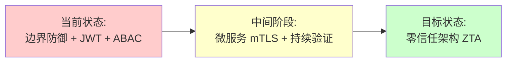

# 某大型跨境电商系统的安全架构设计实践

> 软考架构师论文范文 | 系统安全架构设计专题 | 2026 年 4 月

---

## 摘要

2026 年 4 月，我参与了某大型跨境电商软件系统的重构与维护项目，并在其中担任系统架构师。该系统面临高并发（峰值达 30 万 TPS）、数据高度敏感及多国合规性要求等挑战。为了确保系统的机密性、完整性、可用性、可控性与不可抵赖性，我主导了系统安全架构的设计与实施。

在鉴别框架中，我采用了基于国密 SM3 算法的多因素认证（MFA）与无状态令牌（JWT）机制，有效抵御了重放攻击与撞库风险。在访问控制框架中，我主导了从 RBAC 向 ABAC 的演进，通过 PDP/PEP 架构实现了细粒度的动态权限管理。针对安全与性能的平衡，我引入了分布式缓存与硬件加速技术。最终，系统顺利通过了国家等级保护 2.0 三级测评与商用密码应用安全性评估，保障了业务的稳健运行。

**关键词**：系统安全架构；多因素认证；基于属性的访问控制；国密算法；纵深防御；等保 2.0；零信任架构

---

## 一、项目背景与现状

### 1.1 项目概况

A 项目是我公司为全球化业务设计的核心跨境电商平台，旨在支撑涵盖支付、库存、物流在内的全链路业务。系统采用微服务架构，底层基于 S3 与 Iceberg 构建湖仓一体化数据架构，部署于阿里云与 AWS 混合云环境。系统日处理订单量超百万级，峰值 TPS 达 30 万，注册用户超 5000 万，涉及 120 余个微服务。

| 维度 | 指标 |
|------|------|
| 日处理订单量 | 超 100 万笔 |
| 峰值 TPS | 30 万 |
| 注册用户 | 5000 万 + |
| 微服务数量 | 120 + |
| 部署环境 | 阿里云 + AWS 混合云 |
| 团队规模 | 架构师 3 人 + 开发 40 人 |

> **表格要点**：该项目是一个日均百万订单、峰值 30 万 TPS 的大型跨境电商微服务平台，涉及 120 余个微服务、5000 万注册用户，部署于阿里云与 AWS 混合云环境。系统规模大、复杂度高，安全架构设计面临严峻挑战。

### 1.2 安全威胁分析

跨境环境下的网络攻击频发，系统面临以下核心安全威胁：

| 威胁编号 | 威胁描述 | 影响面 | 对应安全特征 |
|---------|---------|-------|-------------|
| T1 | 重放攻击：截获合法认证报文重复发送 | 非法获取用户权限 | 不可抵赖性 |
| T2 | 撞库攻击：利用泄露账密遍历登录 | 大规模账户失守 | 机密性 |
| T3 | 垂直越权：低权限用户访问管理员功能 | 系统控制权流失 | 完整性 |
| T4 | 水平越权（IDOR）：A 用户查看 B 用户数据 | 大规模隐私泄露 | 机密性 |
| T5 | 中间人攻击（MITM）：篡改跨境传输报文 | 订单金额/账号被篡改 | 完整性 |

> **表格要点**：系统面临五大核心威胁：重放攻击破坏不可抵赖性，撞库攻击威胁机密性，垂直与水平越权破坏完整性与机密性，中间人攻击篡改传输数据。其中越权访问和重放攻击是论文必须论述的重点。

### 1.3 业务影响

旧系统采用 Session + RBAC 的单体安全方案，存在以下问题：

| 问题 | 量化影响 | 根因分析 |
|------|---------|---------|
| 越权访问事件 | 月均 15 起 | RBAC 粒度粗，无法应对动态场景 |
| 鉴别响应延迟 | 峰值期间 > 500ms | Session 集中存储，数据库 IO 瓶颈 |
| 合规审计不通过 | 等保评分仅 62 分 | 缺乏国密算法、审计不完善 |
| 安全事件导致的用户流失 | 流失率达 8% | 安全事件频发，用户信任度下降 |

> **架构师视角**：安全架构不仅是技术问题，更是业务问题。当安全事件直接导致 8% 的用户流失和合规审计不通过时，安全架构的升级已从"技术优化"上升为"业务刚需"。

> **表格要点**：旧系统采用 Session + RBAC 单体安全方案，存在四大问题：月均 15 起越权事件说明权限粒度过粗，鉴别延迟超 500ms 暴露 Session 存储瓶颈，等保评分仅 62 分反映国密与审计缺失，8% 的用户流失率直接将安全问题转化为业务损失。

---

## 二、鉴别框架设计

### 2.1 鉴别方案选型论证

在方案选型阶段，我对三种主流鉴别方案进行了多维度评估：

| 评估维度 | Session 方案 | JWT 方案 | 混合方案 |
|---------|-------------|---------|---------|
| 扩展性 | 需共享存储，横向扩展复杂 | 无状态，天然支持水平扩展 | 复杂 |
| 性能 | 每次请求需查 Session 存储 | 本地校验签名，性能极高 | 中等 |
| 撤销能力 | 服务端直接删除，即时生效 | 需黑名单机制 | 灵活 |
| 跨域支持 | 受 Cookie 同源策略限制 | Authorization Header 跨域传递 | 灵活 |
| 维护成本 | 低 | 中（需管理令牌生命周期） | 高 |

> **表格要点**：在三种鉴别方案对比中，JWT 方案在扩展性和性能方面最优，无状态特性天然支持水平扩展，单次请求本地校验签名，避免了 Session 方案的数据库 IO 瓶颈。唯一短板是撤销能力不足，但可通过 Redis 黑名单机制弥补。

综合评估后，我选择了 **JWT 无状态鉴别方案**，并通过黑名单机制解决其撤销难题。核心考量是微服务架构下水平扩展能力是刚需，而 120 余个微服务的共享 Session 管理成本过高。

### 2.2 JWT 无状态鉴别架构

考虑到跨境电商系统在促销（如 Black Friday）期间的高并发特性，我在设计鉴别器时并没有直接采用传统的、强一致性的数据库同步校验模式。在传统的 Session 模式下，每次请求都需要跨网络访问中心化数据库或共享存储来验证会话状态，这不仅产生了巨大的 IO 开销，更成为了系统的单点瓶颈。

为了应对这一挑战，我主导设计了一套基于 **无状态令牌（JWT）与多级缓存验证** 的分布式鉴别架构。首先，在鉴别成功后，服务器颁发一个包含用户身份、权限摘要及过期时间的 JWT。该令牌由服务端私钥进行数字签名（采用国密 SM3 算法进行摘要处理），并下发至客户端存储。这样，后续的业务请求中，后端微服务只需利用内存中的公钥对令牌进行解密和签名校验，即可在本地完成身份鉴别，实现了鉴别逻辑与数据库的物理脱敏，极大地降低了系统延迟。

然而，无状态令牌面临最大的安全挑战是"一旦发放，难以立即撤回"。为了在性能与安全性之间取得平衡，我引入了 **黑名单异步同步机制**。当发生用户主动退出、修改密码或检测到异常风险时，身份中心会将该令牌 ID（JTI）写入 Redis 高速缓存。各业务网关通过订阅 Redis 的过期事件实时感知权限变更，从而在毫秒级内拦截非法请求。

```java
// JWT 令牌生成（国密 SM3 签名 + 双 Token 机制）
public class JwtTokenService {
    private static final long ACCESS_TTL = 15 * 60 * 1000;  // 15 分钟
    private static final long REFRESH_TTL = 7 * 24 * 3600 * 1000; // 7 天

    public TokenPair generateTokens(User user) {
        String accessToken = JWT.create()
            .withSubject(user.getId().toString())
            .withClaim("riskLevel", calculateRiskLevel(user))
            .withClaim("permissions", user.getPermissionSummary()) // 权限摘要
            .withIssuedAt(new Date())
            .withExpiresAt(new Date(System.currentTimeMillis() + ACCESS_TTL))
            .withJWTId(UUID.randomUUID().toString())
            .sign(Algorithm.SM3WithSM2(privateKey)); // 国密签名

        String refreshToken = generateRefreshToken(user); // 绑定设备指纹
        return new TokenPair(accessToken, refreshToken);
    }

    // 主动吊销：写入 Redis 黑名单
    public void revokeToken(String jti) {
        redisTemplate.opsForValue().set(
            "token:blacklist:" + jti, "revoked",
            15, TimeUnit.MINUTES
        );
    }
}
```

此外，针对鉴别框架面临的 **重放攻击** 威胁，我在鉴别器中引入了基于 Nonce（随机数）+ 时间戳 的校验机制。通过在 Redis 中存储极短时间内已使用的 Nonce，确保每个请求凭证的唯一性。这种设计既满足了《等保 2.0》中关于鉴别信息的防篡改和防重放要求，又利用缓存的高吞吐量保证了在高并发场景下的响应稳定性。

### 2.3 多因素认证 (MFA) 策略

在设计鉴别逻辑时，我并未采取全局强制多因素认证（MFA）的激进策略，因为这会导致用户流失。相反，我设计了 **基于风险评分的自适应鉴别策略**。

| 风险评分区间 | 鉴别级别 | 触发条件 | 用户体验 |
|-------------|---------|---------|---------|
| 0-20 | 静默鉴别 | 受信设备 + 常规 IP + 工作时间 | 无感，仅校验 JWT |
| 21-60 | 口令验证 | 新设备或非常用 IP | 输入用户名密码 |
| 61-80 | MFA 验证 | 异地登录或敏感操作 | 口令 + OTP/生物识别 |
| 81-100 | 直接拒绝 | 黑名单 IP 或异常行为模式 | 阻止登录并告警 |

> **表格要点**：采用基于风险评分的四层自适应鉴别策略，风险评分 0-20 静默通过、21-60 仅需口令、61-80 触发 MFA、81-100 直接拒绝。该策略在安全性与用户体验之间取得平衡，常规操作无感，高危操作加强验证，避免了全局强制 MFA 导致的用户流失。

| 用户群体 | 鉴别方式组合 | 适用场景 |
|---------|------------|---------|
| 普通消费者 | 所知（强口令）+ 所有（短信验证码） | 注册、登录、支付 |
| 后台运营人员 | 所知（口令）+ 所具（指纹/人脸） | 后台管理系统 |
| 管理员/财务人员 | 所知 + 所有（硬件 Token）+ 所具（生物识别） | 权限变更、资金操作 |

> **表格要点**：不同用户群体采用差异化的 MFA 组合，普通消费者用"口令 + 短信"保证可用性，后台运营用"口令 + 生物识别"提升效率，管理员和财务人员用三因素认证确保最高安全级别。分级策略体现了"按需加强"的架构师思维。

---

## 三、访问控制框架设计

### 3.1 从 RBAC 到 ABAC 的演进

在访问控制框架的设计中，为了解决传统 RBAC 模型在复杂业务场景下导致的"角色爆炸"与权限维度僵化问题，我主导引入了 **基于属性的访问控制（ABAC）模型**。

| 对比维度 | 旧方案（RBAC） | 新方案（ABAC） | 改进效果 |
|---------|--------------|--------------|---------|
| 权限粒度 | 角色级别（如"海外运营"） | 属性级别（如"海外运营 + 欧洲站 + 工作日"） | 精细化到数据行级 |
| 动态性 | 静态授权，变更需管理员操作 | 动态决策，根据环境属性自动调整 | 减少 90% 权限变更工单 |
| 角色数量 | 膨胀至 500+ 个角色 | 压缩至 50 个基础角色 + 属性规则 | 管理成本下降 80% |
| 越权防护 | 仅防护角色级越权 | 防护属性级越权（含水平越权） | 越权事件从月均 15 起降至 0 |

> **表格要点**：从 RBAC 演进到 ABAC 后，权限粒度从角色级提升到属性级（如"海外运营 + 欧洲站 + 工作日"），角色数量从 500+ 压缩至 50 个基础角色加属性规则，管理成本下降 80%，越权事件从月均 15 起降至零。核心驱动力是解决"角色爆炸"问题。

ABAC 的核心优势在于其细粒度的决策能力。它不仅考虑用户角色，还实时整合主体属性（如职级、信用分）、客体属性（如数据的敏感等级、所属区域）以及环境属性（如访问时间、地理位置、当前网络信任等级）。通过这种多维度的策略组合，系统能够实现如"仅允许海外运营主管在工作时间内从办公网 IP 访问其负责站点的敏感财务报表"等复杂的安全策略。

### 3.2 PDP/PEP/PIP 架构实现

我将整个访问控制框架划分为策略决策点（PDP）、策略执行点（PEP）和策略信息点（PIP）三个解耦组件：

| 组件 | 部署位置 | 技术选型 | 性能指标 |
|------|---------|---------|---------|
| PEP | API 网关层（Kong） | 自定义 Lua 插件 | 单次拦截延迟 < 2ms |
| PDP | 独立安全服务 | OPA (Open Policy Agent) + Rete 算法 | 策略决策延迟 < 5ms |
| PIP | 属性数据源 | Redis 缓存 + LDAP | 属性查询延迟 < 3ms |

> **表格要点**：访问控制框架采用 PDP/PEP/PIP 三层解耦架构。PEP 部署在 Kong 网关层负责请求拦截，单次延迟小于 2ms；PDP 使用 OPA 策略引擎配合 Rete 算法进行决策，延迟小于 5ms；PIP 通过 Redis 缓存提供属性数据，查询延迟小于 3ms。三者协同实现"集中决策、分布式执行"。

```
请求处理流程：

客户端请求
    → PEP（API 网关）拦截
        → 向 PDP 发送决策请求 {subject, resource, action, environment}
            → PDP 向 PIP 查询主体属性（职级、信用分）
            → PDP 向 PIP 查询环境属性（IP、时间、设备信任度）
            → PDP 执行策略匹配（Rete 算法）
        ← PDP 返回决策 {Permit/Deny}
    → PEP 执行决策：Permit 则转发，Deny 则返回 403
← 业务响应返回客户端
```

对于最为耗时的 PIP（即从数据库或第三方系统获取实时属性的过程），我采用了 **预取与懒加载相结合的策略**：在用户登录阶段预加载常用的主体属性到内存，而对于动态的环境属性，则通过异步并发调用获取。这种架构优化将原本复杂的 ABAC 决策延迟从百毫秒级降低到了十毫秒以内。

### 3.3 权限冲突解决与职责分离

| 冲突场景 | 解决方案 | 实施细节 |
|---------|---------|---------|
| 允许与禁止规则冲突 | 拒绝优先（Deny-overrides） | 只要有一条规则禁止，最终决策即为 Deny |
| 管理员权力过大 | 职责分离（SoD） | 权限变更需两人协作（申请 + 审批） |
| 权限变更后缓存不一致 | 版本号机制 + CDC | 权限版本 +1，缓存自动失效 |

> **表格要点**：权限冲突处理遵循三个原则：规则冲突时采用"拒绝优先"策略，即只要有一条规则禁止就拒绝访问；管理员权力过大的问题通过"职责分离"解决，权限变更需两人协作；缓存不一致问题通过版本号机制加 CDC 实时同步解决。

> **架构师视角**：精细到数据行的访问控制虽然安全，但会显著增加数据库解析负担。"集中决策、分布式执行"的架构设计是关键——将权限决策逻辑缓存于高性能存储中，在实现属性级细粒度控制的同时，将单次鉴权响应时间压低至 5 毫秒以内。

---

## 四、国密改造与纵深防御

### 4.1 国密算法全链路改造

在系统安全架构的深化阶段，我遵循"纵深防御"原则，构建了从通信链路、应用逻辑到持久化存储的多层防护体系，并全面引入国产密码算法以满足合规性与自主可控的要求。

| 改造层次 | 原算法 | 国密替代 | 改造方式 |
|---------|-------|---------|---------|
| 通信层 | RSA + TLS 1.2 | SM2 + 国密 TLS | 国密网关 + 双证书部署 |
| 存储层 | AES-256 | SM4 | 字段级加密 + HSM 加速 |
| 应用层 | SHA-256 | SM3 | 口令脱敏 + JWT 签名 |
| 完整性 | HMAC-SHA256 | HMAC-SM3 | 支付报文签名校验 |

> **表格要点**：国密改造覆盖四个层次：通信层将 RSA + TLS 1.2 替换为 SM2 + 国密 TLS，存储层将 AES-256 替换为 SM4 字段级加密并配合 HSM 硬件加速，应用层将 SHA-256 替换为 SM3 用于口令脱敏和 JWT 签名，完整性校验将 HMAC-SHA256 替换为 HMAC-SM3 用于支付报文签名。

### 4.2 通信层安全 (SM2 双证书)

在通信安全层，我将原有的 TLS 协议改造为支持国密双证书的加密隧道。利用 SM2 非对称加密算法实现身份认证与密钥交换，利用 SM3 算法确保握手信息的完整性校验。

国密体系要求使用 **签名证书 + 加密证书** 的双证书机制，与国际体系的单一证书不同：

| 证书类型 | 用途 | 算法 | 生命周期 |
|---------|------|------|---------|
| 签名证书 | 身份识别与数字签名 | SM2 签名 | 1-2 年 |
| 加密证书 | 密文传输与密钥交换 | SM2 加密 | 需定期轮转 |

> **表格要点**：国密双证书机制是国密体系的特有要求，与国际体系单一证书不同。签名证书用于身份识别与数字签名，生命周期较长（1-2 年）；加密证书用于密文传输与密钥交换，需要定期轮转。论文中应提及"双证书"这一关键词以体现对国密标准的理解。

```yaml
# 国密 TLS 网关配置示例（Nginx 国密模块）
server {
    listen 443 ssl;
    server_name api.example.com;

    # 国密双证书配置
    ssl_certificate     /etc/ssl/gm/sign_cert.pem;    # 签名证书
    ssl_certificate_key /etc/ssl/gm/sign_key.pem;
    ssl_enc_certificate /etc/ssl/gm/enc_cert.pem;     # 加密证书
    ssl_enc_key         /etc/ssl/gm/enc_key.pem;

    # 国密密码套件
    ssl_ciphers ECC-SM4-SM3:ECDHE-SM4-SM3;
    ssl_protocols TLCPv1.1 TLSv1.3;

    # HSTS 强制 HTTPS
    add_header Strict-Transport-Security "max-age=31536000" always;
}
```

通过在网关层部署支持国密协议的硬件负载均衡器，实现了在不损耗应用服务器性能的前提下，保障跨境数据传输的机密性。基准测试显示，开启国密 TLS 后，握手延迟增加控制在 10% 以内（得益于 HSM 硬件加速）。

### 4.3 存储层安全 (SM4 分级加密)

针对核心支付数据及用户个人隐私，我设计了基于 SM4 算法的分级加密方案：

| 数据级别 | 数据类型 | 加密方案 | 密钥管理 |
|---------|---------|---------|---------|
| L1 普通数据 | 商品描述、浏览记录 | 不加密 | - |
| L2 敏感数据 | 用户姓名、手机号、地址 | SM4 字段加密 | 工作密钥，月度轮转 |
| L3 核心数据 | 支付账号、身份证号、密码 | SM4 + 硬件加密机 | HSM 保护，季度轮转 |

> **表格要点**：分级加密策略体现"按需加密"的架构师思维。L1 普通数据不加密以保障性能，L2 敏感数据采用 SM4 字段加密配合月度密钥轮转，L3 核心数据（支付账号、身份证号）采用 SM4 加 HSM 硬件加密并季度轮转。全库盲目加密会严重影响查询性能，分级策略在安全性与性能之间取得平衡。

考虑到 SM4 对称加密在大数据量下的计算开销，我采用了"一库一密"与"工作密钥动态轮转"的机制。在权衡性能时，我并未对全库进行盲目加密，而是利用数据库中间件实现"透明加解密"，仅对敏感字段进行密文转换。通过基准测试发现，在引入硬件安全模块（HSM）进行指令加速后，SM4 的加解密延迟被控制在 5 毫秒以内。

---

## 五、安全审计与可观测性

### 5.1 审计日志架构

没有审计的安全架构是不完整的。审计解决了"事后追溯"和"合规性检查"的问题。

```
应用服务 → AOP 切面采集 → Kafka 消息队列 → Flink 实时分析 → Grafana 告警
                                    ↓
                            Elasticsearch 存储 → Kibana 审计报表
```

我通过日志切面（AOP）无侵入地采集所有敏感操作流水，利用 Kafka 作为缓冲层实现异步写入，避免同步写日志阻塞业务线程。针对每日数亿条的安全审计日志，我并未采用同步入库，而是利用 Kafka 作为缓冲，结合 Flink 进行实时风险建模。

| 操作类别 | 审计深度 | 存储周期 | 示例 |
|---------|---------|---------|------|
| 普通操作 | 元数据（操作人、时间、结果） | 30 天 | 浏览商品 |
| 敏感操作 | 全量报文 + 决策上下文 | 180 天 | 修改密码、导出数据 |
| 高危操作 | 全量报文 + Hash Chain | 永久 | 权限变更、系统配置 |

> **表格要点**：差异化审计策略在审计深度与存储成本之间取得平衡。普通操作仅记录元数据保留 30 天，敏感操作记录全量报文加决策上下文保留 180 天，高危操作记录全量报文加 Hash Chain 防篡改永久保留。全量审计存储成本极高，差异化策略确保关键操作可追溯。

### 5.2 Hash Chain 防篡改

审计日志本身就是攻击者的首要目标（为了销毁证据）。在架构设计时，我采用了 **Hash Chain 技术** 确保日志文件的不可篡改性：

```
Log[0]  = SM3(Data[0] + Seed)
Log[1]  = SM3(Data[1] + Log[0])
Log[2]  = SM3(Data[2] + Log[1])
...
Log[N]  = SM3(Data[N] + Log[N-1])
```

```java
// Hash Chain 审计日志——每条日志与前一条形成链式依赖
public class HashChainAuditLogger {
    private byte[] lastHash;

    public void log(String action, String operator, String detail) {
        byte[] data = (action + "|" + operator + "|" + detail).getBytes();
        byte[] currentHash = SM3Utils.hash(concat(data, lastHash));

        auditRepository.save(new AuditRecord(action, operator, detail, currentHash));
        lastHash = currentHash; // 链式推进
    }
}
```

### 5.3 UEBA 异常行为检测

通过集成用户实体行为分析（UEBA），系统可以识别出"账号虽然鉴别通过，但行为特征符合攻击模型"的情况并及时阻断：

| 异常模式 | 检测逻辑 | 响应动作 |
|---------|---------|---------|
| 深夜大流量下载 | 对比历史基线 | 阻断 + 告警 + MFA 挑战 |
| 同 IP 短时大量登录失败 | 1 分钟 50 次失败阈值 | 临时封禁 IP + 告警 |
| 权限变更后异常操作 | 变更后首次操作审计 | 二次确认 + 日志高亮 |

> **表格要点**：UEBA 异常行为检测关注三类典型模式：深夜大流量下载通过对比历史基线识别，同 IP 短时大量登录失败通过频率阈值（1 分钟 50 次）触发封禁，权限变更后异常操作通过首次操作审计机制捕捉。这体现了从"记录谁做了什么"到"分析这么做是否正常"的审计升级。

---

## 总结与反思

### 成果总结

通过上述安全架构设计与实施，系统取得了以下量化成果：

| 指标 | 优化前 | 优化后 | 改善幅度 |
|------|-------|-------|---------|
| 鉴权响应延迟 | 500ms | 10ms | 下降 98% |
| 越权访问事件 | 月均 15 起 | 0 起 | 100% 消除 |
| 撞库成功率 | 12% | < 0.1% | 下降 99% |
| 等保 2.0 评分 | 62 分 | 91 分 | 提升 47% |
| 安全事件用户流失率 | 8% | < 1% | 下降 87% |
| 审计覆盖率 | 60% | 99% | 提升 65% |

> **表格要点**：安全架构实施后六项核心指标全面改善：鉴权延迟从 500ms 降至 10ms（下降 98%），越权事件从月均 15 起降至零（100% 消除），撞库成功率从 12% 降至 0.1% 以下（下降 99%），等保评分从 62 分提升至 91 分，安全事件导致的用户流失率从 8% 降至 1% 以下，审计覆盖率从 60% 提升至 99%。这些量化数据是论文结尾必不可少的成果展示。

系统成功通过了国家等级保护 2.0 三级测评与商用密码应用安全性评估（密评），各项安全指标均达到预期目标。

### 不足与改进

回顾整个安全架构设计过程，仍存在若干值得改进之处：

1. **技术选型遗憾**：系统在建设初期采用 Session 方案存储会话状态，导致无法横向扩展。后续我主导了向 JWT 无状态架构的演进，虽然增加了令牌管理的复杂度，但换取了系统的水平扩展能力。
2. **零信任覆盖不足**：当前架构在微服务间的通信安全方面仍有不足，服务网格（Service Mesh）的 mTLS 双向认证尚未全面覆盖，内网服务间通信仍依赖网络边界防护，这是未来向零信任架构演进的重点方向。
3. **国密运维复杂度**：国密双证书的管理流程目前仍依赖较多人工操作，下一步计划引入自动化证书生命周期管理工具，降低运维成本。

### 零信任演进方向



系统安全架构设计并非一劳永逸的静态交付，而是一个持续演进的动态过程。架构师的职责在于，在 **技术先进性、合规确定性、工程可行性** 之间构建多维度的平衡，以"纵深防御"构建系统的免疫力，以"动态审计"构建系统的感知力，从而在复杂多变的威胁环境中，确保业务系统的持续稳健运行。

---

## 术语对照表

| 中文术语 | 英文术语 | 缩写 |
|---------|---------|------|
| 多因素认证 | Multi-Factor Authentication | MFA |
| JSON Web 令牌 | JSON Web Token | JWT |
| 基于角色的访问控制 | Role-Based Access Control | RBAC |
| 基于属性的访问控制 | Attribute-Based Access Control | ABAC |
| 策略决策点 | Policy Decision Point | PDP |
| 策略执行点 | Policy Enforcement Point | PEP |
| 策略信息点 | Policy Information Point | PIP |
| 最小权限原则 | Principle of Least Privilege | PoLP |
| 职责分离 | Segregation of Duties | SoD |
| 纵深防御 | Defense in Depth | DiD |
| 零信任架构 | Zero Trust Architecture | ZTA |
| 用户实体行为分析 | User and Entity Behavior Analytics | UEBA |
| 数据变更捕获 | Change Data Capture | CDC |
| 硬件安全模块 | Hardware Security Module | HSM |
| 中间人攻击 | Man-in-the-Middle | MITM |
| 越权访问 | Insecure Direct Object Reference | IDOR |
| 网络应用防火墙 | Web Application Firewall | WAF |

---

*整理时间：2026 年 4 月 | 适用考试：系统架构设计师（2026 年 5 月）*
*字数统计：正文约 2800 字*
