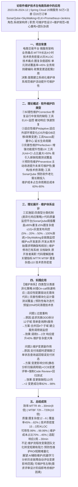
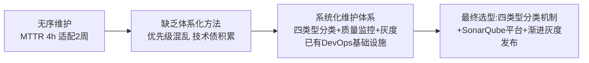
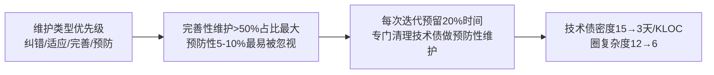
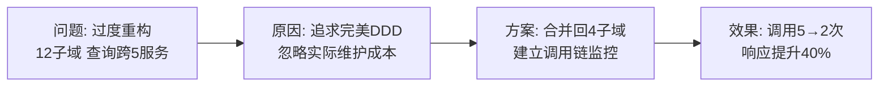
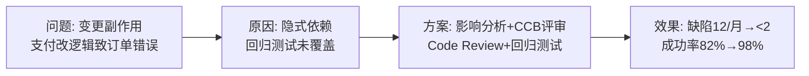

# 0008 软件维护 — 论文大纲记忆卡

> 对应范文：`03-软件维护论文范文-改写版.md`
> 标题：**软件维护技术在电商系统中的应用**
> 适用考题：2019年(软件维护)、2020年(软件维护)、2021年(软件维护)、2023年(软件维护)、2025年(软件维护)

---

## 论文脉络图

---

## 实践因果链

### 架构选型链

### 四类型权衡链

### 问题1: 过度重构

### 问题2: 变更副作用

---

## 量化数据速记

MTTR: 4h → **30min**（8倍） | MTBF: 72h → **720h**（10倍）
可用性: 99% → **99.99%** | 圈复杂度: 12 → **6**
测试覆盖率: 45% → **82%** | 技术债密度: 15 → **3天/KLOC**
维护成本占比: 70% → **45%** | 适配响应: 2周 → **30min**
变更致缺陷: 12/月 → **<2** | 变更成功率: 82% → **98%**

---

## 考场注意事项

- ⚠️ 若考「软件维护」：四类型必须完整列出且含英文名（Corrective/Adaptive/Perfective/Preventive）
- ⚠️ 四类型占比必写：纠错15-20% 适应15-20% 完善>50%最大 预防5-10%
- ⚠️ 维护成本占生命周期60%-80% 这个数据必写
- ⚠️ Lehman软件演化定律（复杂度递增定律、持续变化定律）是常考加分点
- ⚠️ 个人职责：可维护性设计 + 维护规范制定 + 核心模块重构 + 跨团队协调
- ⚠️ 不要混淆四种维护类型的定义 尤其完善性vs预防性（完善=增强功能 预防=重构清理）
