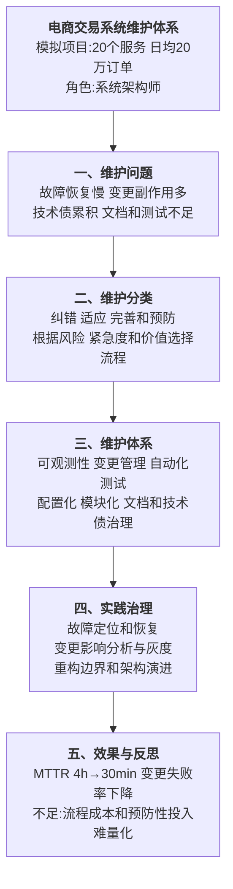

# 0008 软件维护 — 论文大纲记忆卡

> 对应范文：`03-软件维护论文范文-改写版.md`
>
> 训练标题：**论软件维护在电商交易系统中的应用**
>
> **数据说明：系统规模、维护成本和效果指标均为论文训练用模拟数据。**

## 一、论文主线



## 二、四类维护

| 类型 | 目的 | 示例 | 管理重点 |
|------|------|------|----------|
| 纠错性维护 | 修复已发现缺陷 | 修复支付状态错误、内存泄漏 | 快速止损、根因分析和防复发 |
| 适应性维护 | 适应外部环境或约束变化 | 数据库升级、接口政策或平台迁移 | 兼容、迁移、回滚和数据校验 |
| 完善性维护 | 改进功能、性能或体验 | 提升查询性能、增加业务能力 | 价值验证、范围控制和回归测试 |
| 预防性维护 | 降低未来故障和变更成本 | 重构、依赖升级、技术债清理 | 风险优先、持续投入和效果度量 |

四类维护的比例和维护成本占生命周期的比例因行业、系统阶段和统计口径而异。不能把“完善性必然超过 50%”或“维护成本固定占 60%—80%”当作所有项目通用事实，引用时应有来源。

## 三、维护体系

### 3.1 纠错闭环

```text
告警或用户反馈
→ 影响评估和止损
→ 定位根因
→ 修复与验证
→ 灰度发布
→ 复盘和防复发措施
```

需要同时记录 MTTA、MTTR、故障影响、恢复方式和复发率。MTBF 更适合可修复系统的可靠性分析，不应与发布频率或所有软件服务场景机械绑定。

### 3.2 变更管理

- 建立变更请求、风险分级、责任人和回滚计划；
- 对高风险变更进行架构、数据和安全影响分析；
- 使用 Code Review、契约测试、回归测试和静态分析；
- 采用功能开关、金丝雀或蓝绿发布；
- 变更后观测业务指标和技术指标；
- CCB 是否需要取决于组织和风险，低风险变更不应全部走重审批流程。

### 3.3 可维护性设计

| 方向 | 主要措施 |
|------|----------|
| 模块化 | 高内聚、低耦合、明确边界和依赖方向 |
| 可测试性 | 依赖可替换、契约清楚、自动化测试分层 |
| 可观测性 | 日志、指标、追踪、业务事件和统一关联 ID |
| 配置化 | 外部配置、版本、审计、灰度和回滚 |
| 文档化 | ADR、接口契约、运行手册和故障知识库 |
| 依赖治理 | 版本清单、漏洞扫描、升级节奏和兼容策略 |
| 数据演进 | Schema 版本、迁移脚本、双写校验和回滚 |

## 四、技术债治理

技术债不是所有“旧代码”的总称，应记录：

- 形成原因；
- 对变更、故障、安全和成本的影响；
- 本金和持续利息；
- 偿还方案与风险；
- 不偿还的后果；
- 负责人和目标周期。

固定预留 20% 容量可以作为团队策略，但不是通用最佳实践。更合理的是按风险和收益维护债务清单，并在产品计划中显式安排。

## 五、实践因果链

### 5.1 过度拆分


不要把“合并为 4 个子域”当作通用结论。是否合并应由领域边界、事务、一致性、团队和独立扩展需求决定。

### 5.2 变更副作用


### 5.3 故障恢复


## 六、质量度量

单一指标不能代表可维护性，应组合使用：

| 维度 | 指标示例 | 注意事项 |
|------|----------|----------|
| 故障恢复 | MTTA、MTTR、复发率 | 区分发现、止损和永久修复 |
| 变更质量 | 变更失败率、回滚率、逃逸缺陷 | 与变更规模和风险分级一起看 |
| 交付效率 | Lead Time、部署频率 | 频率高不等于质量高 |
| 代码健康 | 复杂度、重复、依赖和漏洞 | 阈值应按语言和模块校准 |
| 测试 | 覆盖率、变异测试、关键路径覆盖 | 覆盖率高不保证断言有效 |
| 技术债 | 债务项、风险、偿还周期 | “天/KLOC”不是通用标准单位 |
| 文档与运营 | Runbook 覆盖、演练通过率 | 文档需要与实际流程同步 |

圈复杂度 10、覆盖率 80% 等可以作为局部提示阈值，但不应被写成所有模块统一的质量标准。

## 七、模拟指标统一表

| 指标 | 改造前 | 改造后 |
|------|--------|--------|
| MTTR | 4 小时 | 30 分钟 |
| 变更导致的缺陷 | 12 起/月 | 少于 2 起/月 |
| 变更成功率 | 82% | 98% |
| 关键路径测试覆盖 | 45% | 82% |
| 高复杂度模块平均复杂度 | 12 | 6 |
| 高风险适配交付周期 | 2 周 | 2 天 |
| 可用性 | 99.0% | 99.9% |

> 可用性 99.99% 对应的年度不可用时间非常少，必须有充分架构与监控证据。训练场景统一使用 99.9%，避免与 MTTR、故障频率等指标互相矛盾。

## 八、持续维护与演进

- 将可维护性需求前移到架构和需求评审；
- 为关键决策建立 ADR；
- 为遗留系统建立特征测试再重构；
- 使用绞杀者模式渐进替换；
- 对依赖和平台升级建立定期节奏；
- 定期演练回滚、恢复和数据修复；
- 复盘不是只写报告，要形成测试、监控或设计上的永久改进。

## 九、考场检查

- [ ] 是否准确区分纠错、适应、完善和预防性维护
- [ ] 是否避免把维护比例和成本比例写成无来源的固定事实
- [ ] 是否覆盖故障、变更、技术债、测试、文档和依赖治理
- [ ] 是否说明重构边界和渐进迁移，而不是为重构而重构
- [ ] 是否组合使用 MTTR、变更失败率等指标
- [ ] 是否避免把覆盖率和圈复杂度阈值当作绝对质量线
- [ ] 指标之间是否逻辑一致并能由措施解释
- [ ] 模拟数据是否未冒充真实项目结果

---

*当前维护批次：2026-H2｜最后更新：2026-07-31*