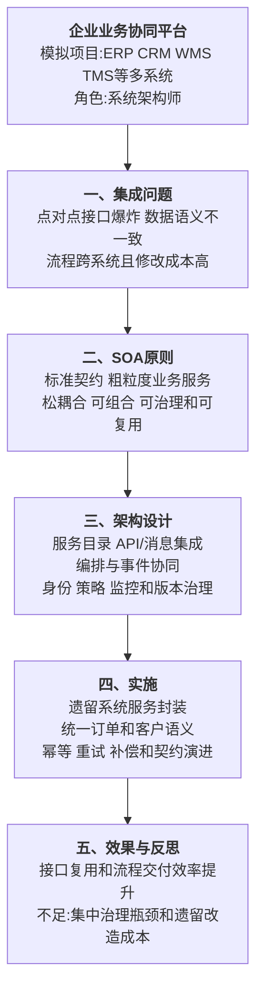

# 0009 SOA 面向服务架构 — 论文大纲记忆卡

> 对应资料：
> - `01-SOA核心知识点.md`
> - `02-SOA论文写作框架.md`
> - `03-SOA论文范文-改写版.md`
>
> 训练标题：**论面向服务架构在企业业务协同平台中的应用**
>
> **数据说明：系统规模、调用量和效果指标均为论文训练用模拟数据。**

## 一、论文主线



## 二、SOA 核心原则

| 原则 | 含义 | 设计检查 |
|------|------|----------|
| 标准服务契约 | 服务接口、数据和策略有明确约定 | 是否定义版本、错误码和兼容规则 |
| 松耦合 | 消费者尽量不依赖实现细节 | 是否依赖内部数据库和私有字段 |
| 服务抽象 | 对外隐藏内部实现 | 是否只暴露稳定业务能力 |
| 服务可复用 | 服务可支持多个业务流程 | 是否为复用而过度泛化 |
| 服务自治 | 服务控制自身逻辑和资源 | 数据所有权与运行责任是否明确 |
| 服务无状态倾向 | 减少跨请求会话依赖 | 长事务状态存放在哪里 |
| 服务可发现 | 服务能力和契约可检索 | 是否维护目录、文档和责任人 |
| 服务可组合 | 服务能编排成业务流程 | 编排失败时如何补偿和恢复 |

SOA 是一组服务化设计原则和治理方法，不等同于 SOAP，也不要求必须部署 ESB。

## 三、服务识别与契约

```text
梳理端到端业务流程
→ 识别稳定业务能力和领域边界
→ 定义服务责任与数据所有权
→ 设计粗粒度业务契约
→ 明确同步、异步和批量交互
→ 制定版本、兼容和退役策略
```

### 服务粒度

- 太细：网络调用多、流程复杂、治理成本高；
- 太粗：复用困难、变更影响面大；
- 应围绕完整业务能力和事务边界设计；
- 高频细粒度内部调用可以保留在服务内部；
- 不因“复用”把所有逻辑抽成通用万能服务。

## 四、集成方式选择

| 方式 | 适用场景 | 优点 | 风险 |
|------|----------|------|------|
| 同步 API | 需要即时结果的查询和命令 | 交互直观、错误可立即返回 | 时间耦合、级联故障和长调用链 |
| 异步消息 | 跨系统通知、削峰和最终一致 | 解耦时间、提高韧性 | 幂等、顺序、重试和可观测性 |
| 批量文件/ETL | 大批数据交换和历史同步 | 吞吐高、便于审计 | 延迟高、格式和补数治理复杂 |
| 事件发布订阅 | 多消费者响应业务事实 | 扩展消费者不改生产者 | 事件语义、版本和所有权要求高 |
| 流程编排 | 明确中心流程和跨服务补偿 | 流程可见、便于统一控制 | 编排器可能形成耦合和瓶颈 |
| 事件协同 | 各服务根据事件自治响应 | 去中心化、局部自治 | 全局流程难理解和排错 |

## 五、ESB、API 网关和消息平台

| 组件 | 主要职责 | 不应承担的内容 |
|------|----------|----------------|
| ESB/集成平台 | 协议转换、路由、适配、策略和旧系统集成 | 大量核心业务逻辑和无边界集中编排 |
| API 网关 | 外部 API 路由、认证、限流、观测 | 领域业务和跨服务长事务 |
| 消息平台 | 可靠事件传输、缓冲、发布订阅 | 业务事实定义和消费者业务逻辑 |
| 服务目录 | 契约、版本、负责人和生命周期 | 运行时请求转发 |

ESB 是否形成单点，取决于集群、容灾和部署设计；更常见的风险是所有转换与业务规则不断堆积，形成组织和变更瓶颈。

## 六、实践因果链

### 6.1 点对点接口爆炸


### 6.2 数据语义不一致


### 6.3 跨系统流程失败


## 七、治理与演进

- 服务目录记录能力、契约、版本、负责人和依赖；
- 契约优先保证向后兼容，破坏性变更使用新版本并设退役窗口；
- 使用消费者驱动契约测试降低升级风险；
- 为同步调用设置超时、重试预算、熔断和隔离；
- 为消息建立幂等键、死信、重放和审计；
- 通过 Trace ID 关联 API、消息和流程状态；
- 定期淘汰低复用、重复或职责混乱的服务。

## 八、模拟指标统一表

| 指标 | 改造前 | 改造后 |
|------|--------|--------|
| 点对点接口 | 180 个 | 70 个标准服务与适配接口 |
| 重复接口 | 基线 | 减少 60% |
| 新流程交付周期 | 8 周 | 2 周 |
| 对账差异 | 0.5% | 0.02% |
| 异常恢复时间 | 4 小时 | 20 分钟 |
| 核心服务可用性 | 99.5% | 99.95% |

## 九、考场检查

- [ ] 是否把 SOA 写成服务原则与治理，而不是 SOAP/ESB 技术清单
- [ ] 是否从业务能力识别服务和数据所有权
- [ ] 是否说明同步、消息、批量和事件方式的选择依据
- [ ] 是否区分 ESB、API 网关、消息平台和服务目录职责
- [ ] 是否包含契约版本、兼容、幂等、补偿和可观测性
- [ ] 是否避免“ESB 必然单点”“服务越细越好”等绝对表述
- [ ] 是否说明 SOA 与微服务、事件驱动可组合使用
- [ ] 模拟指标是否前后一致且未冒充真实项目数据

---

*当前维护批次：2026-H2｜最后更新：2026-07-31*