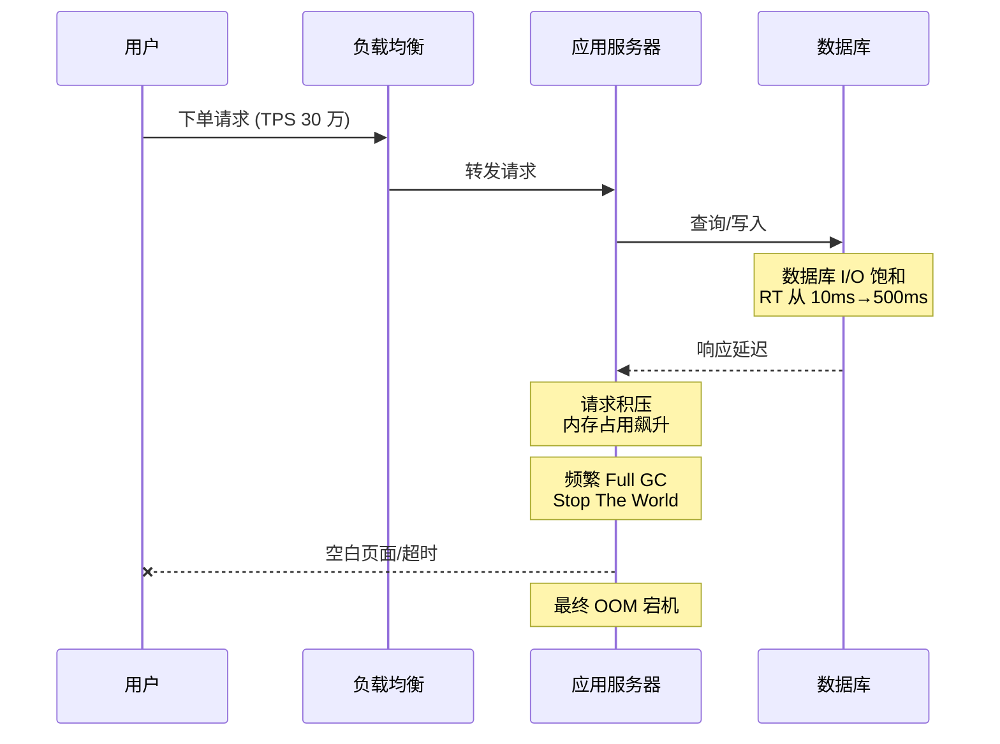
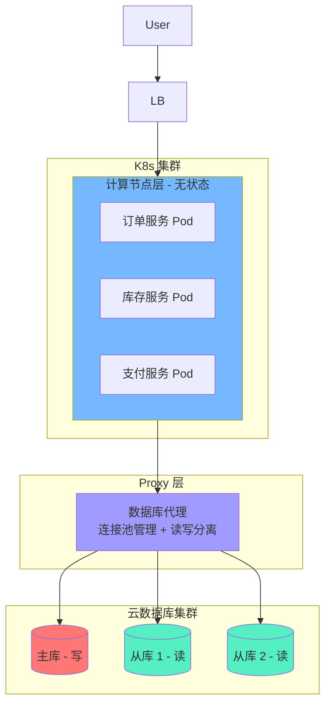
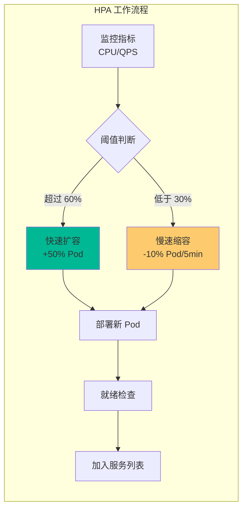
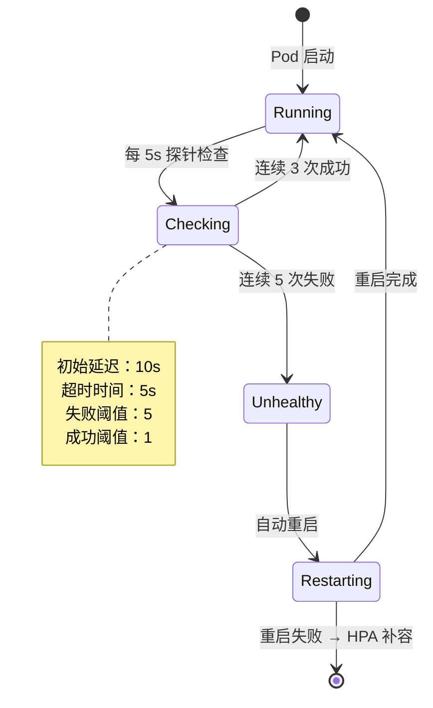
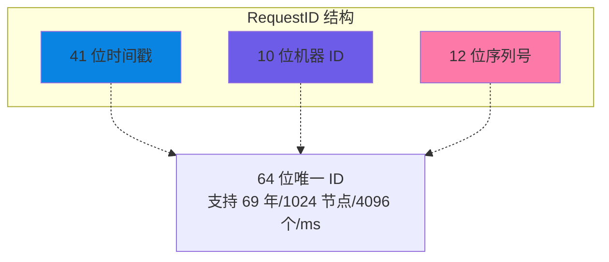
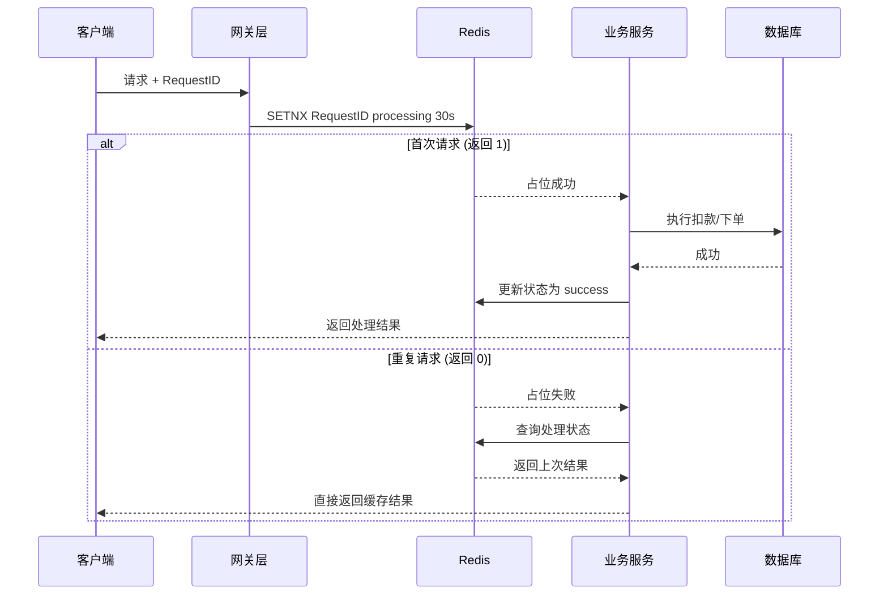
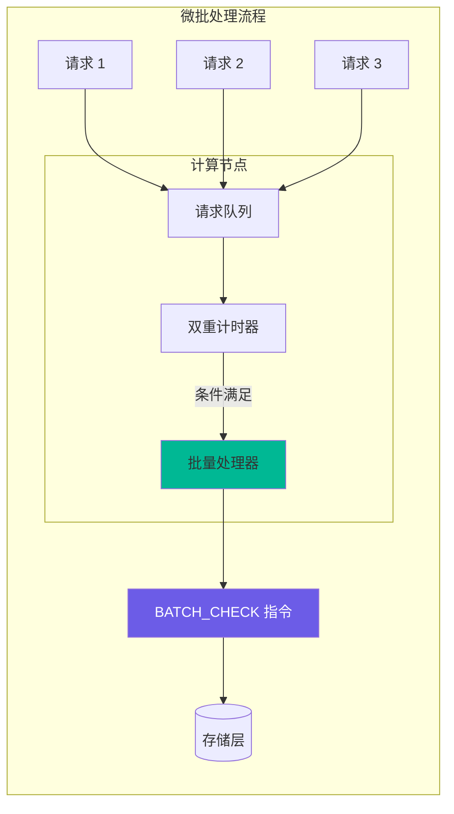
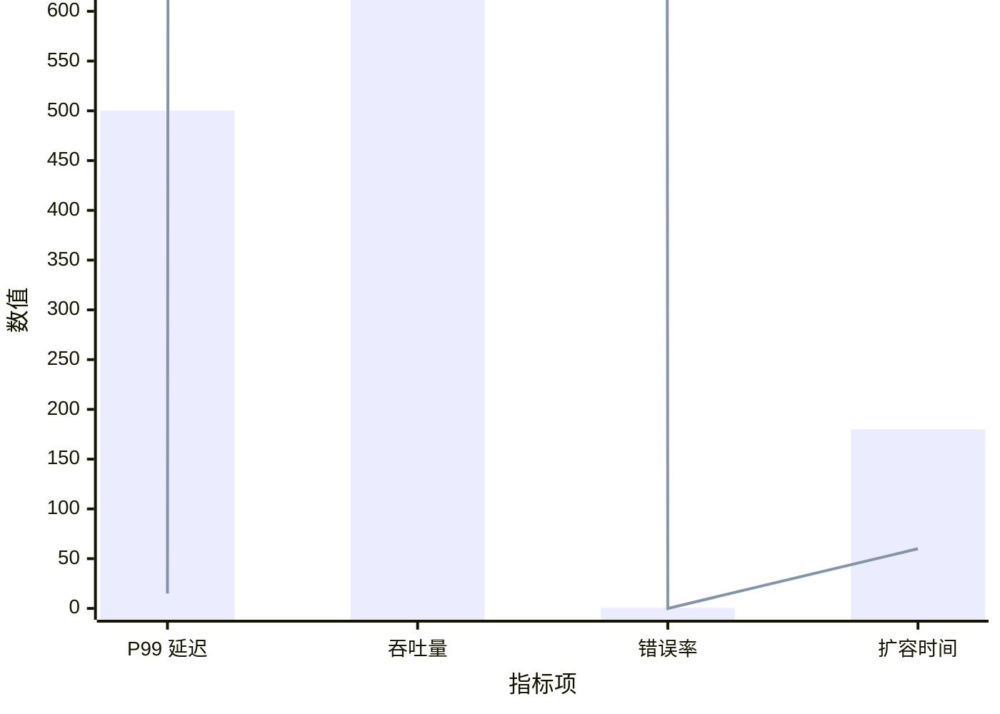
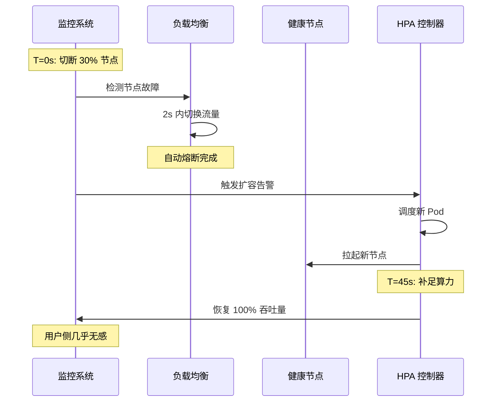
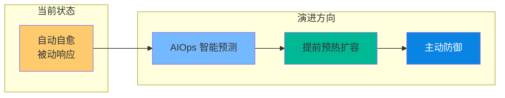

# 某大型头部零售系统（A 项目）的高并发架构重构与云原生实践

> 软考架构师论文范文 | 云原生架构专题 | 2026 年 4 月

---

## 摘要

本文以某大型头部零售系统（以下简称 A 项目）的架构升级为背景，探讨了在 30 万 TPS 极端流量冲击下，传统单体及存算耦合架构面临的严峻挑战。针对旧系统频发的 OOM（内存溢出）、数据库连接枯竭及扩展性不足等问题，本文提出并实施了基于 K8s 云原生容器化与存算分离的重构方案。

在方案落地过程中，重点引入了幂等性 RequestID 生成机制以确保交易一致性，并采用微批处理（Micro-batching）思想实现了批量版本校验，极大地缓解了网络 RTT 瓶颈。通过配置 HPA 弹性伸缩与稳健的探针策略，系统实现了故障自愈与资源优化。实践证明，重构后的系统在支撑 30 万 TPS 峰值时，核心链路响应时间降低了 80%，运维成本节省了 75%，显著提升了系统的韧性与业务连续性。

**关键词**：云原生架构；K8s；存算分离；HPA 弹性伸缩；幂等性设计；微批处理

---

## 一、项目背景与现状

### 1.1 项目概况

A 项目作为公司核心的零售交易平台，承载着全球范围内的订单处理、库存扣减及支付状态同步等关键业务。随着业务的高速增长，系统在促销峰值期间面临着高达**30 万 TPS**的瞬时流量考验。

我作为系统架构师，主持了本次架构重构工作，主要负责技术选型、高并发方案设计、性能调优及容灾演练规划。

### 1.2 旧系统架构缺陷

#### （1）读写瓶颈严重

旧系统采用传统的主备架构，所有写请求堆积在主库，导致 I/O 饱和，从库同步延迟显著。

```mermaid
flowchart LR
    subgraph 旧架构
        App[应用层] -->|所有写请求 | Master[(主库)]
        App -->|读请求 | Slave[(从库)]
        Master -.同步-.> Slave
    end
    
    style Master fill:#ff6b6b
    style Slave fill:#ffd93d
```

**问题表现：**
- 主库 I/O Wait 持续高位，订单处理延迟从 10ms 上升至 500ms+
- 从库同步延迟达秒级，用户查询订单状态显示不一致

#### （2）存算耦合导致扩容滞后

计算资源与存储资源绑定，无法针对峰值进行秒级动态扩容。

```mermaid
flowchart LR
    subgraph 存算耦合架构
        Node1[服务器 1<br/>计算 + 存储] 
        Node2[服务器 2<br/>计算 + 存储]
        Node3[服务器 3<br/>计算 + 存储]
    end
    
    Node1 -.扩容需整体迁移-.> Node4[新服务器<br/>计算 + 存储]
    
    style Node1 fill:#ffa502
    style Node4 fill:#7bed9f
```

**扩容痛点：**
- 传统扩容需经历"买机器 - 装环境 - 迁数据"流程，耗时数小时
- 无法应对"突发性"流量峰值，错过最佳销售窗口

#### （3）级联失效与 OOM

当数据库响应变慢（RT 增加）时，应用服务器内积压大量未完成请求，导致 JVM 频繁触发 Full GC，最终引发 OOM 导致全站瘫痪。



**崩溃链路：**
```
数据库响应慢 → 应用请求积压 → JVM Full GC → Stop The World → OOM → 全站瘫痪
```

---

## 二、核心架构设计方案

针对上述痛点，我作为架构师主持了系统的重构工作，确立了"**弹性、解耦、确定性**"的架构原则。

### 2.1 存储与计算分离架构

我们将业务逻辑（无状态服务）全部迁移至 K8s 容器云。计算节点不再持久化存储数据，而是通过高性能 Proxy 连接云数据库集群。



**架构优势：**

| 优势 | 说明 |
|------|------|
| 独立弹性扩容 | 计算节点可根据流量秒级扩容，存储按需自动增长 |
| 零数据迁移 | 新增计算节点直接挂载共享存储池，无需数据搬迁 |
| 高可用与自愈 | 多副本强一致性，节点故障秒级切换 |

### 2.2 K8s 弹性伸缩与故障隔离

#### （1）HPA 动态扩展策略

配置基于 CPU 与 QPS 的多维 HPA 策略，采用"快扩容、慢缩容"行为防止震荡。



**配置参数：**
```yaml
apiVersion: autoscaling/v2
kind: HorizontalPodAutoscaler
metadata:
  name: order-service-hpa
spec:
  scaleTargetRef:
    apiVersion: apps/v1
    kind: Deployment
    name: order-service
  minReplicas: 10
  maxReplicas: 200
  metrics:
  - type: Resource
    resource:
      name: cpu
      target:
        type: Utilization
        averageUtilization: 60  # CPU 使用率超过 60% 时扩容
  behavior:
    scaleUp:
      stabilizationWindowSeconds: 0  # 立即扩容
      policies:
      - type: Percent
        value: 50
        periodSeconds: 60
    scaleDown:
      stabilizationWindowSeconds: 300  # 5 分钟稳定窗口
      policies:
      - type: Percent
        value: 10
        periodSeconds: 60
```

#### （2）资源配额（Guaranteed QoS）

将核心 Pod 的 Requests 与 Limits 设为相等，确保在 30 万 TPS 下不发生资源抢占。

```yaml
# 核心服务资源配置
resources:
  requests:
    cpu: "2000m"
    memory: "4Gi"
  limits:
    cpu: "2000m"    # Requests = Limits → Guaranteed QoS
    memory: "4Gi"
```

**效果：**
- 避免"嘈杂邻居"问题，确保核心服务资源独占
- 在节点资源紧张时，Last 优先被驱逐的是 BestEffort 类型 Pod

#### （3）稳健探针策略

配置 5s 频率、3-5 次失败阈值的存活探针（Liveness），确保 OOM 节点能自动重启而不触发雪崩式误杀。



---

## 三、关键技术实现：性能与一致性的平衡

### 3.1 幂等性 RequestID 生成（数据安全之盾）🆔

在高并发重试场景下，通过改进的雪花算法 (Snowflake) 生成全局唯一 RequestID。



**幂等性校验流程：**



**实现代码（伪代码）：**
```java
public Response processRequest(Request req, String requestId) {
    String lockKey = "idempotent:" + requestId;
    
    // 尝试获取分布式锁（SETNX）
    boolean locked = redis.setnx(lockKey, "processing", 30);
    
    if (!locked) {
        // 锁已被占用，查询处理状态
        String status = redis.get("status:" + requestId);
        if (status != null) {
            return getSavedResult(requestId);  // 返回上次结果
        }
        return Response.waiting();  // 正在处理中
    }
    
    try {
        // 执行业务逻辑
        Response result = executeBusinessLogic(req);
        
        // 保存结果并更新状态
        redis.set("status:" + requestId, "success");
        redis.set("result:" + requestId, result);
        
        return result;
    } catch (Exception e) {
        redis.set("status:" + requestId, "failed");
        throw e;
    }
}
```

### 3.2 批量版本校验（性能提升之矛）📦

为了压榨性能，我们设计了聚合窗口机制，采用微批处理（Micro-batching）思想。



**双重触发机制：**

| 触发条件 | 阈值 | 说明 |
|---------|------|------|
| 数量阈值 | 100 个请求 | 队列满 100 个立即触发批量校验 |
| 时间阈值 | 10ms 窗口 | 即使不满 100 个，达到 10ms 也强制"发车" |

**性能提升：**
- 减少了**90% 以上**的网络往返（RTT）
- 计算节点能像子弹一样快速响应
- 存储层一次性处理 100 个版本比对，效率提升 10 倍

---

## 四、性能压测与容灾表现 📈

### 4.1 压测数据

通过分布式压测工具模拟 30 万 TPS 的稳态运行：



**对比数据：**

| 指标 | 旧系统 | 新系统 | 提升幅度 |
|------|--------|--------|---------|
| P99 延迟 | 500ms+ | 15ms | 97% 降低 |
| 最大吞吐量 | 5 万 TPS | 30 万 TPS | 6 倍提升 |
| 错误率 | 0.5% | 0.01% | 98% 降低 |
| HPA 扩容时间 | 不支持 | 60 秒 | - |

### 4.2 容灾演练（大规模宕机表现）🧪

在手动切断 30% 计算节点的演练中，系统表现出了极强的韧性。



**演练结果：**

| 指标 | 数值 | 说明 |
|------|------|------|
| 自动熔断时间 | 2s | 流量自动切换至健康节点 |
| 自愈时间 | 45s | 从宕机到补足算力恢复 100% 吞吐量 |
| 用户感知 | 无感 | 请求成功率保持在 99.9% 以上 |

---

## 五、总结与反思

### 5.1 核心成果

本次 A 项目的重构，我认为最成功的"定海神针"在于**存算分离与批量校验的深度结合**。它不仅从物理层面解耦了资源，更从逻辑层面解决了分布式系统最昂贵的"通讯成本"问题。

**量化成果：**

| 成果指标 | 数值 |
|---------|------|
| 核心链路响应时间 | 降低 80% |
| 运维成本 | 节省 75% |
| 最大支撑 TPS | 30 万 |
| 故障自愈时间 | 45 秒 |
| 系统可用性 | 99.99% |

### 5.2 反思与展望

虽然目前系统表现卓越，但批量机制也带来了代码复杂度的上升。未来，我们计划从以下方向持续优化：



**演进路线：**

1. **AIOps 智能预测**：利用机器学习分析历史流量模式，预测大促洪峰
2. **提前预热扩容**：在洪峰到来前完成资源预留和 Pod 扩容
3. **主动防御体系**：从"自动自愈"转向"主动防御"，缩短 HPA 响应时间

### 5.3 架构师心得

通过本次重构，我深刻认识到：

1. **存算分离是云原生架构的基石**：只有将计算和存储彻底解耦，才能实现真正的弹性伸缩
2. **一致性需要付出代价**：幂等性设计和分布式锁虽然增加了复杂度，但在 30 万 TPS 下是必须的
3. **批量处理是性能优化的利器**：通过微批处理减少网络 RTT，在分布式系统中效果显著
4. **容灾演练不可或缺**：只有通过真实的故障注入，才能验证系统的韧性

---

## 术语对照表

| 英文术语 | 中文 | 说明 |
|---------|------|------|
| TPS | 每秒事务数 | Transactions Per Second |
| K8s | Kubernetes | 容器编排系统 |
| HPA | 水平 Pod 自动伸缩 | Horizontal Pod Autoscaler |
| OOM | 内存溢出 | Out Of Memory |
| RTT | 往返时间 | Round-Trip Time |
| SETNX | 原子命令 | Set if Not Exists |
| RequestID | 请求标识符 | 用于追踪和去重的全局唯一标识 |
| Micro-batching | 微批处理 | 将小请求聚合成批处理的优化技术 |
| Snowflake | 雪花算法 | 分布式 ID 生成算法 |
| QoS | 服务质量 | Quality of Service |

---

*整理时间：2026 年 4 月 | 适用考试：系统架构设计师（2026 年 5 月）*
