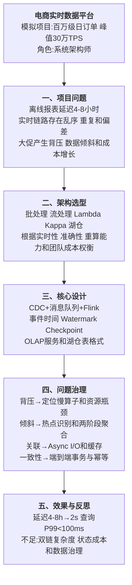
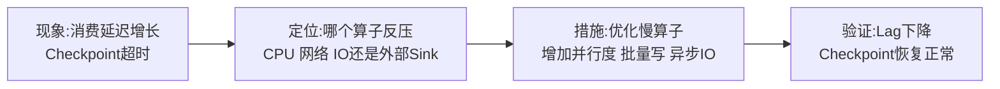

# 0010 大数据架构 — 论文大纲记忆卡

> 对应资料：
> - `01-大数据架构核心知识点.md`
> - `02-大数据架构论文写作框架.md`
> - `03-大数据架构论文范文-改写版.md`
>
> 训练标题：**论大数据架构在电商数据中台中的应用**
>
> **数据说明：项目规模、TPS、延迟和成本指标均为论文训练用模拟数据。**

## 一、论文主线



## 二、架构选型速记

| 架构 | 核心思路 | 优势 | 主要代价 | 适用判断 |
|------|----------|------|----------|----------|
| 批处理 | 对有界数据周期计算 | 吞吐高、逻辑清晰、便于全量重算 | 延迟高 | T+1 报表、历史分析和全量校验 |
| 流处理 | 对无界事件持续计算 | 低延迟、事件驱动 | 状态、乱序和一致性复杂 | 实时监控、风控和告警 |
| Lambda | 批路径与实时路径并存 | 可用全量路径重新校正实时结果 | 两套链路和逻辑维护成本高 | 实时与全量重算均重要且可承担复杂度 |
| Kappa | 统一流式链路，通过日志重放重算 | 一套处理模型，减少重复逻辑 | 依赖可重放日志和正确状态演进 | 事件日志完整、流计算能力成熟 |
| 湖仓一体 | 统一对象存储与开放表格式，多引擎处理 | 数据副本减少、批流共享数据基础 | 元数据、并发写和引擎兼容治理 | 需要统一存储、ACID 表和多计算引擎 |

> 不要写成“Lambda 一定准确、Kappa 一定不准确”或“湖仓会自动消除所有双链问题”。准确性取决于数据源、处理逻辑、状态、写入协议和校验机制。

## 三、核心数据链路

```text
业务数据库 / 日志 / 外部事件
→ CDC 或采集代理
→ Kafka/Pulsar 等可持久化事件日志
→ Flink 等流处理引擎
→ 实时 OLAP / 缓存 / 告警
→ 湖仓表或数据湖保存可重算数据
→ 离线校验、补数和分析服务
```

### 3.1 CDC

- 使用数据库日志捕获增量变更；
- 初始快照与增量日志需要无缝衔接；
- 明确主键、Schema 变更、删除事件和事务边界；
- 下游必须处理重复、乱序和重放；
- CDC 账号遵循最小权限并保护敏感数据。

### 3.2 事件时间与 Watermark

- **处理时间**：事件到达计算节点的时间；
- **事件时间**：业务事件实际发生时间；
- **Watermark**：系统对事件时间进度的估计，用于判断窗口何时可以计算；
- 允许迟到时间越长，结果更完整，但状态和延迟成本越高；
- 超过允许迟到范围的数据应进入侧输出、补偿或重算流程。

## 四、端到端一致性正确口径

Flink Checkpoint 只保证计算状态可以一致恢复，不自动等于端到端 Exactly-Once。

端到端语义需要同时满足：

```text
可重放或事务化 Source
+ 一致的状态快照
+ 支持事务提交或幂等写入的 Sink
+ 稳定的业务主键和去重规则
+ 故障恢复与外部副作用协调
```

| 环节 | 典型机制 |
|------|----------|
| Source | Kafka Offset 与 Checkpoint 协调、CDC 位点保存 |
| State | Checkpoint、Savepoint、状态后端和增量快照 |
| Sink | 两阶段提交、事务写、幂等 Upsert 或去重表 |
| 外部调用 | 幂等键、Outbox、补偿任务，避免不可回滚副作用 |
| 验证 | 对账、数据质量规则、血缘和重算能力 |

## 五、高频问题治理

### 5.1 背压



原则：先定位瓶颈，再扩容。盲目增加 Source 并行度可能让下游更快过载。

### 5.2 数据倾斜


加盐会增加二次聚合和状态复杂度，应只对确认的热点 Key 使用。

### 5.3 实时关联

- 小维表可使用 Broadcast State；
- 大维表可使用 Async I/O 查询外部存储；
- 配置超时、并发上限、缓存和降级；
- 外部系统不可用时避免无限重试拖垮主链；
- 维表更新需要版本和一致性策略。

### 5.4 小文件与成本

- 控制写入并行度和文件滚动策略；
- 定期 Compaction；
- 根据冷热分层选择压缩和存储；
- 使用分区裁剪和列式格式减少扫描；
- 计算弹性必须结合状态恢复和数据倾斜评估。

## 六、模拟指标统一表

| 指标 | 改造前 | 改造后 |
|------|--------|--------|
| 数据可见延迟 | 4—8 小时 | 少于 2 秒 |
| 实时查询 P99 | 无实时服务 | 少于 100ms |
| 峰值处理能力 | 3 万 TPS | 30 万 TPS |
| 对账差异 | 0.5% | 少于 0.01% |
| Checkpoint 时间 | 30 分钟或超时 | 少于 2 分钟 |
| 热点算子 CPU | 95% | 60%—70% |
| 存储成本 | 基线 | 降低 35% |

> 模拟指标要与正文采用同一基线。不能把“处理语义 Exactly-Once”直接写成“业务数据绝对零误差”。

## 七、考场组织方式

```text
业务实时性和数据量问题
→ 批流与存储架构选型
→ 数据采集、处理、存储和服务链路
→ 背压、倾斜、乱序、一致性中的三个重点问题
→ 指标验证、数据治理、成本和不足
```

## 八、考场检查

- [ ] 是否根据实时性、准确性、重算和成本选择 Lambda/Kappa/湖仓
- [ ] 是否说明事件时间、Watermark 和迟到数据处理
- [ ] 是否先定位背压根因，再决定优化或扩容
- [ ] 是否说明热点 Key 和两阶段聚合的代价
- [ ] 是否正确说明端到端 Exactly-Once 的前提
- [ ] 是否包含 Schema、数据质量、血缘和补数能力
- [ ] 是否使用可测量指标验证架构效果
- [ ] 模拟数据是否前后一致且未冒充真实项目数据

---

*当前维护批次：2026-H2｜最后更新：2026-07-31*