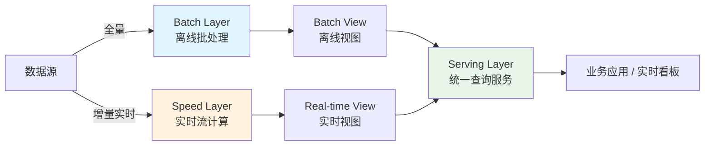
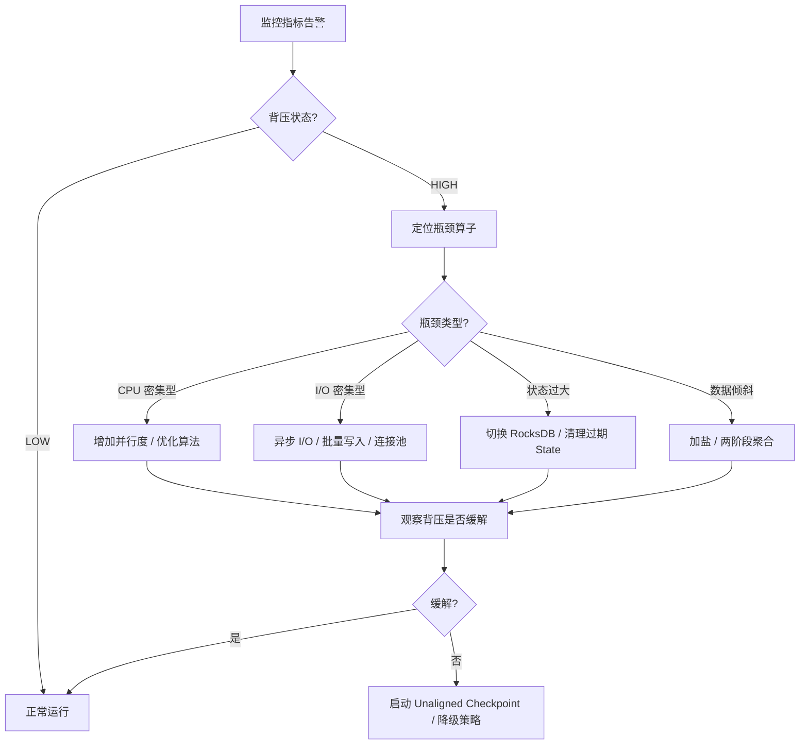

# 大数据架构核心知识点

> 整理自 Google Gemini 学习对话 | 软考架构师论文专题 | 适用考试：系统架构设计师（2026 年 5 月）

---

## 一、大数据架构定义与重要性

在系统架构设计师考试语境下，**大数据架构**是指为满足海量数据（TB/PB 级）的采集、存储、计算、分析和服务需求，而设计的一套由多层组件构成的分布式系统架构。其目标是在保证数据一致性、系统可用性和可扩展性的前提下，实现低延迟的数据处理和实时的数据分析。

### 1.1 大数据 5V 特征与架构映射

| 5V 特征 | 含义 | 架构影响 | 典型技术 |
|---------|------|----------|----------|
| **Volume（海量）** | 数据规模达 TB/PB 级以上 | 必须采用分布式存储，水平扩展 | HDFS、对象存储、分布式数据库 |
| **Velocity（高速）** | 数据产生与消费速度极快 | 需要流式处理管道和低延迟计算 | Kafka、Flink、Spark Streaming |
| **Variety（多样）** | 结构化、半结构化、非结构化并存 | 多源适配与统一数据模型 | Avro/Protobuf、Parquet/ORC |
| **Veracity（真实性）** | 数据质量参差不齐，需清洗校验 | 数据质量管理与一致性保障 | 数据校验规则、Exactly-Once 语义 |
| **Value（价值）** | 从大量数据中提取高价值信息 | OLAP 分析与实时可视化 | ClickHouse、Doris、实时看板 |

### 1.2 大数据架构四大核心原则

| 原则 | 说明 | 设计要点 |
|------|------|----------|
| **可扩展性** | 通过增加节点线性提升处理能力 | 无状态优先、数据分片、水平扩展 |
| **容错性** | 单点故障不影响全局服务 | 副本机制、自动故障转移、幂等写入 |
| **数据一致性** | 保障数据处理结果的准确性 | 两阶段提交、校验核对、补偿机制 |
| **低延迟** | 满足实时分析与决策需求 | 流式计算、内存计算、物化视图 |

### 1.3 考试意义

> **架构师视角**：大数据架构是近五年论文考试的高频方向。其核心考察点不在于"你用了什么组件"，而在于"你如何权衡取舍"——批流如何融合、一致性与延迟如何平衡、数据倾斜如何治理、全链路如何保障。论文写作必须体现架构师的**全局观**和**权衡意识**。

---

## 二、Lambda 架构深度解析

### 2.1 三层架构模型

Lambda 架构由 Nathan Marz 于 2011 年提出，核心思想是**用两条独立的数据处理链路（批处理 + 流处理）分别保障数据的准确性与实时性**，通过 Serving 层合并结果对外提供服务。

```
┌──────────────────────────────────────────────────────┐
│                   Serving Layer                       │
│        （统一查询服务：ClickHouse / Doris）             │
├──────────────────────┬───────────────────────────────┤
│   Batch View         │       Real-time View          │
│  （离线批处理结果）    │    （实时流计算结果）            │
├──────────────────────┤                               │
│   HDFS / Data Lake   │                               │
│   （全量历史数据）      │     Kafka / Pulsar            │
│                      │     （实时消息流）               │
└──────────────────────┴───────────────────────────────┘
```



### 2.2 三层职责详解

| 层级 | 目的 | 延迟要求 | 精度要求 | 典型技术 | 数据范围 |
|------|------|----------|----------|----------|----------|
| **Batch Layer（离线层）** | 存储全量主数据，执行离线批处理，生成高准确率的批处理视图 | 小时 ~ 天级 | **精确一致**，可容忍延迟 | Hadoop MR、Spark SQL、Hive、Flink 批 | 全量历史数据 |
| **Speed Layer（实时层）** | 处理增量数据，弥补批处理延迟，提供近实时视图 | 秒 ~ 分钟级 | **近似一致**，容忍一定误差 | Flink、Spark Streaming、Storm | 最新增量数据 |
| **Serving Layer（服务层）** | 合并批处理视图和实时视图，对外提供统一查询接口 | 毫秒 ~ 秒级 | **最终一致** | ClickHouse、Doris、HBase、Elasticsearch | 合并后的完整视图 |

### 2.3 Lambda vs Kappa vs Lakehouse 架构对比

| 维度 | Lambda 架构 | Kappa 架构 | Lakehouse（湖仓一体） |
|------|-------------|------------|----------------------|
| **核心思想** | 冷热双链路并行 | 统一流处理链路 | 统一存储 + 多引擎计算 |
| **架构复杂度** | **高**（维护两套代码和链路） | **中**（一套流处理代码） | **中**（一套存储 + 多种引擎） |
| **数据延迟** | 实时链路秒级，批处理链路小时级 | 全链路秒级 | 灵活，取决于计算引擎 |
| **数据准确性** | 批处理最终修正，高准确度 | 依赖流处理重放，需精确一次语义 | ACID 事务保障 |
| **运维成本** | 高（两套集群、两套代码） | 中（一套集群） | 中（一套存储，引擎可选） |
| **适用场景** | 金融级对账、实时风控 | 日志处理、事件驱动 | 数据中台、统一分析平台 |
| **存储层** | HDFS + Kafka 双存储 | 日志存储（Kafka 为主） | 对象存储 / HDFS + 表格式 |
| **容错策略** | 批处理链路兜底修正 | 流处理重放 + Checkpoint | ACID 事务 + 快照 |

### 2.4 批处理 vs 流处理详细对比

| 对比项 | 批处理（Batch） | 流处理（Stream） |
|--------|----------------|-----------------|
| 数据边界 | 固定数据集（有界数据） | 持续数据流（无界数据） |
| 触发方式 | 定时调度（如每天凌晨 2 点） | 事件驱动，数据到达即处理 |
| 延迟级别 | 小时 ~ 天 | 毫秒 ~ 秒 |
| 吞吐量 | 极高（批量处理） | 较高（持续处理） |
| 容错机制 | 重跑全量任务 | Checkpoint + State |
| 典型引擎 | Spark、Hive、Flink 批模式 | Flink、Spark Streaming |
| 数据精确度 | 精确（全量数据计算） | 依赖语义保证（At-Least / Exactly-Once） |

> **架构师视角**：Lambda 架构的核心价值在于"冷热双链路"，保证了数据准确性与实时性的平衡。虽然 Kappa 架构和 Lakehouse 架构在不断简化架构复杂度，但 Lambda 在**金融级对账**、**实时风控**等对数据准确性要求极高的场景中，仍然具有不可替代的地位。论文写作时，切忌一味否定 Lambda，而应客观分析其适用边界。

---

## 三、数据采集层 —— CDC 与消息队列

### 3.1 CDC（Change Data Capture）技术

CDC 是一种捕获数据库变更事件（INSERT、UPDATE、DELETE）并实时同步到下游系统的技术。它是大数据架构中**连接业务系统与数据平台的关键纽带**。

| CDC 工具 | 原理 | 支持数据库 | 部署方式 | 适用场景 |
|----------|------|------------|----------|----------|
| **Debezium** | 基于数据库日志解析，Kafka Connect 插件 | MySQL、PostgreSQL、MongoDB、Oracle | 嵌入 Kafka Connect | 多源异构数据库实时同步 |
| **Canal** | 模拟 MySQL Slave 协议解析 Binlog | MySQL（主流） | 独立服务 | MySQL 生态为主的实时同步 |
| **Flink CDC** | 内嵌 Debezium，原生 Flink Source | MySQL、PostgreSQL、Oracle、MongoDB | Flink 作业内 | Flink 流处理管道直接消费 CDC |
| **OGG（Oracle GoldenGate）** | 专有日志解析引擎 | Oracle、MySQL、DB2 | 独立服务 | 企业级 Oracle 数据同步 |

#### MySQL Binlog 捕获机制

MySQL Binlog 是 MySQL Server 层生成的二进制日志，记录所有对数据库数据进行更改的操作。CDC 工具通过以下两种方式读取：

1. **ROW 模式**：记录每一行数据的变更前（before image）和变更后（after image），精度最高，CDC 工具首选。
2. **解析流程**：CDC 工具伪装成 MySQL Slave，向 Master 发送 `BINLOG_DUMP` 命令，Master 将 Binlog 事件逐条推送给 CDC 工具。

```yaml
# Flink CDC 配置示例 —— MySQL 实时同步到 Kafka
source:
  type: mysql
  hostname: 10.0.1.100
  port: 3306
  username: cdc_reader
  password: ${CDC_PASSWORD}
  database-name: order_db
  table-name: orders,order_items
  server-id: 5400-5408          # 模拟 Slave ID 范围
  scan.startup.mode: initial     # initial=全量+增量, latest-offset=仅增量

sink:
  type: kafka
  topic: ods_order_db
  properties.bootstrap.servers: kafka-1:9092,kafka-2:9092,kafka-3:9092
  format: debezium-json
  properties.transactional.id: cdc-mysql-kafka-txn
```

### 3.2 消息队列 —— Kafka 核心机制

#### 分区（Partition）与消费者组（Consumer Group）

| 参数 | 说明 | 调优建议 |
|------|------|----------|
| **Partition 数量** | 决定并发度和消息有序性范围 | 单 Partition 内有序；总分区数 = max(生产者吞吐 / 单分区吞吐, 消费者并发需求) |
| **Consumer Group** | 同一组内每个消费者消费不同分区 | 消费者数 ≤ 分区数；多余消费者空闲 |
| **Replication Factor** | 副本数，保障容错 | 生产环境建议 3；容忍 N-1 个 Broker 故障 |
| **ISR（In-Sync Replica）** | 与 Leader 保持同步的副本集合 | `min.insync.replicas=2` 保证写入至少 2 副本 |
| **acks 参数** | 生产者确认机制 | `acks=all` 用于关键数据；`acks=1` 用于性能优先 |

#### Kafka 分区数决策矩阵

| 场景 | 当前分区 | 问题症状 | 建议操作 | 注意事项 |
|------|----------|----------|----------|----------|
| **初始配置** | 32 | 正常 | 观察 1 ~ 2 周 | 从保守值开始 |
| **扩容第一次** | 32 → 64 | 消费者 Lag 持续增长，CPU 使用率 > 80% | 分区翻倍 | 注意旧数据仍分布在旧分区中 |
| **扩容第二次** | 64 → 128 | Lag 再次增长，Leader 选举延迟增加 | 谨慎扩容 | 文件句柄数、ZK/Controller 压力同步增加 |
| **过度分区** | > 256 | 元数据膨胀、选举变慢、文件句柄耗尽 | **不再扩容** | 应优化消费者性能而非无限增加分区 |

> **架构师视角**：分区数不是越多越好。每增加一个分区，意味着增加一个文件句柄、增加副本同步开销、增加 Leader 选举负担。正确的做法是：先优化消费者的并行处理能力（如批量拉取、异步处理），再考虑分区扩容。考试中常以"Kafka 消费者 Lag 持续增长"为切入点，要求分析原因并给出调优方案。

---

## 四、实时计算引擎 —— Flink 核心机制

### 4.1 Window 窗口机制

Flink 通过 Window 将无界数据流切分为有界的片段进行计算。

| 窗口类型 | 定义 | 适用场景 | 重叠性 | 示例 |
|----------|------|----------|--------|------|
| **Tumbling Window（滚动窗口）** | 固定大小、不重叠的窗口 | 按固定周期统计（如每分钟 UV） | 不重叠 | 每 5 分钟统计一次订单总量 |
| **Sliding Window（滑动窗口）** | 固定大小 + 固定滑动步长，可重叠 | 需要更高频更新的统计 | 重叠 | 每 1 分钟统计过去 5 分钟的数据 |
| **Session Window（会话窗口）** | 基于活跃间隔动态划分 | 用户行为分析（超时即结束） | 不重叠 | 用户 30 分钟无操作即结束会话 |
| **Global Window（全局窗口）** | 所有数据进入同一窗口 | 需配合自定义 Trigger 使用 | 完全重叠 | 配合 CountTrigger 实现按计数触发 |

### 4.2 Watermark 与乱序数据处理

Watermark 是 Flink 处理乱序数据的核心机制，本质上是一个**单调递增的时间戳**，用于告诉系统"在这个时间戳之前的数据已经到齐，可以触发窗口计算"。

- **乱序问题**：由于网络延迟、分布式系统调度等原因，数据到达顺序与事件发生顺序不一致。
- **Watermark 策略**：`Watermark = 当前最大事件时间 - 允许延迟时间`
- **Allowed Lateness**：允许窗口触发后继续接收迟到数据的最大延迟时间。

```
数据流时间轴示意：

事件时间：  10:00  10:01  10:02  10:03  10:04  10:05
            ↓      ↓      ↓      ↓      ↓      ↓
到达顺序：  10:00  10:02  10:01  10:05  10:03  10:04  ← 乱序
            ↓      ↓      ↓      ↓      ↓      ↓
Watermark:  10:00  10:00  10:00  10:02  10:02  10:03  ← 单调递增
                    (允许延迟30s)
```

### 4.3 State 状态管理

Flink 的状态管理是其区别于传统流处理引擎的核心能力。

| State Backend | 存储位置 | 适用场景 | 容量 | 性能 | 容错 |
|---------------|----------|----------|------|------|------|
| **HashMapStateBackend** | JVM 堆内存 | 状态量小（< GB 级）、低延迟要求 | 受限于堆内存 | 极高（纯内存访问） | 异步快照到 Checkpoint |
| **EmbeddedRocksDBStateBackend** | RocksDB（本地磁盘 + 内存缓存） | 状态量大（TB 级）、可容忍一定延迟 | 仅受磁盘容量限制 | 中等（磁盘 I/O 开销） | 增量 Checkpoint |
| **RocksDBStateBackend（远程）** | RocksDB + 远端存储 | 超大状态、需要快速恢复 | 受远端存储限制 | 较低（远程 I/O） | 增量快照 |

#### Checkpoint 调优实战

```yaml
# ── 调优前（默认配置，生产环境经常 OOM 或超时）──
execution.checkpointing:
  interval: 60000          # 1 分钟
  timeout: 600000          # 10 分钟
  mode: EXACTLY_ONCE
  max-concurrent: 1

# ── 调优后（生产环境推荐配置）──
execution.checkpointing:
  interval: 30000          # 30 秒（降低单次快照数据量）
  timeout: 300000          # 5 分钟
  mode: EXACTLY_ONCE
  max-concurrent-checkpoints: 1
  min-pause: 10000         # 两次 Checkpoint 之间至少间隔 10 秒
  tolerable-failed-checkpoints: 3  # 容忍 3 次失败
  incremental: true        # RocksDB 开启增量快照
  state.backend: rocksdb
  state.checkpoints.dir: hdfs://namenode/flink/checkpoints
  state.savepoints.dir: hdfs://namenode/flink/savepoints

# RocksDB 优化
state.backend.rocksdb:
  block.cache-size: 256m
  writebuffer.size: 64m
  writebuffer.count: 4
  compaction.style: LEVEL
```

#### Checkpoint 参数权衡

| 参数 | 调小影响 | 调大影响 | 推荐策略 |
|------|----------|----------|----------|
| **interval（间隔）** | 更频繁快照，恢复点更近；但 CPU/IO 开销增大 | 开销降低；但故障时丢失数据增多 | 30s ~ 60s，根据业务容忍度 |
| **timeout（超时）** | 更容易超时失败 | 等待时间过长，影响故障检测 | 5 ~ 10 分钟 |
| **max-concurrent** | 串行安全；但吞吐受限 | 并行快照；但与业务竞争资源 | 通常设为 1 |
| **incremental（增量）** | 首次全量大；后续增量小 | 每次全量快照，大状态场景极慢 | RocksDB 必须开启 |

> **架构师视角**：Checkpoint 间隔的设定是延迟与吞吐量的经典权衡。间隔越短，故障恢复时丢失的数据越少（RPO 降低），但 Checkpoint 本身会占用 CPU、网络和存储资源，影响正常业务处理的吞吐量。生产环境中一般设定为 **30 秒至 1 分钟**，配合增量快照和 Unaligned Checkpoint 技术，可以在可接受的资源开销下实现秒级 RPO。

---

## 五、背压治理与系统稳定性

### 5.1 背压（Backpressure）定义与成因

背压是指在流处理管道中，**下游算子处理速度跟不上上游算子发送速度**，导致数据在算子之间积压的现象。它不是故障，而是系统的一种**自我保护信号**。

| 背压症状 | 诊断方法 | 根因分类 |
|----------|----------|----------|
| Flink Web UI 显示 Backpressure 状态为 HIGH | 观察 Backpressure 面板 | 下游算子处理瓶颈 |
| Kafka Consumer Lag 持续增长 | `kafka-consumer-groups.sh --describe` | 消费能力不足 |
| 算子间 Buffer 使用率 > 90% | 网络 Buffer 监控 | 网络吞吐瓶颈 |
| Checkpoint 时间持续增长甚至超时 | Checkpoint 耗时监控 | 状态写入慢、磁盘 I/O 瓶颈 |
| 系统 GC 频繁，CPU 在 GC 上耗时占比高 | GC 日志分析 | 内存不足、大 State |

### 5.2 背压传导机制与 Credit-Based Flow Control

Flink 1.5 引入的 **Credit-Based Flow Control** 是一种基于信用额度的反压机制：

```
┌──────────┐    credit=100    ┌──────────┐    credit=50     ┌──────────┐
│  Source  │ ───────────────→ │ Transform│ ────────────────→ │   Sink   │
│          │ ←── 数据积压 ─── │          │ ←── 处理慢 ───── │          │
│ 发送速率  │                 │ 速率降低  │                 │ 速率最低  │
│ 降低      │                 │           │                 │           │
└──────────┘                 └──────────┘                 └──────────┘
      ↑                           ↑                           ↑
   背压传导方向（自右向左，从 Sink 到 Source）
```

1. 每个下游算子向上游发送"信用额度"（Credit），表示自己还能接收多少数据。
2. 上游只有在收到 Credit 后才能发送数据，Credit 用完即停止发送。
3. 背压从最慢的算子（通常是 Sink）开始，逐层向左传导至 Source，最终实现**整体减速而非崩溃**。

### 5.3 背压治理策略

| 策略 | 原理 | 适用场景 | 代价 |
|------|------|----------|------|
| **动态扩缩容** | 根据背压信号自动增加/减少 TaskManager | 周期性负载波动（如大促） | 需要 Kubernetes 集群支持 |
| **多级缓冲** | 在算子间增加 Buffer 层（如本地队列） | 短暂流量尖峰 | 增加内存占用 |
| **算子优化** | 合并算子、减少序列化、优化 KeyBy | 算子本身逻辑复杂 | 代码改造成本 |
| **异步 I/O** | 将同步外部调用改为异步 | 外部服务调用（DB、API） | 增加复杂度 |
| **限流/丢弃** | 主动丢弃低优先级数据或限流 | 非关键监控数据 | 数据丢失 |

#### 背压检测与治理流程图



### 5.4 Unaligned Checkpoint

传统 Checkpoint 需要等待所有算子的 In-Flight Buffer 处理完毕才能开始快照，在背压场景下会导致 Checkpoint 超时。**Unaligned Checkpoint** 将 Buffer 中的数据也一并快照，使 Checkpoint 不再受背压影响。

| 特性 | Aligned Checkpoint（默认） | Unaligned Checkpoint |
|------|---------------------------|---------------------|
| 背压影响 | Checkpoint 可能超时 | 不受背压影响 |
| 快照大小 | 仅 State | State + In-Flight Buffer |
| 恢复速度 | 快 | 略慢（需重放 Buffer） |
| 适用场景 | 正常负载 | 高背压、长延迟场景 |
| 开启方式 | 默认开启 | `execution.checkpointing.unaligned: true` |

### 5.5 背压预防检查清单

| 检查项 | 建议值 / 策略 | 监控指标 |
|--------|--------------|----------|
| Source 读取速率限制 | 根据下游处理能力设置上限 | `source.records-per-second` |
| Buffer 超时时间 | `network.buffer.timeout: 100ms` | `network.bufferPoolUsage` |
| Checkpoint 超时 | 至少是平均耗时的 3 倍 | `checkpoint.duration` |
| 算子链合并 | 轻量算子链式部署，减少网络开销 | 算子拓扑图 |
| 外部服务连接池 | 最大连接数 ≥ 并行度 × 2 | 连接池使用率 |
| GC 调优 | G1GC，堆内存 4GB ~ 8GB | GC 时间占比 < 5% |

> **架构师视角**：背压不是要消除，而是要管理 —— 关键在于"缓而不崩"。一个健康的流处理系统应该能够通过背压信号自动调节处理速率，而不是直接 OOM 或崩溃。论文中如果出现"系统崩溃"而非"背压调节"，说明架构设计缺乏弹性。

---

## 六、多源数据关联技术

### 6.1 核心问题：流数据与维度数据的关联

在实时数据处理中，最常见的场景是将**流式事实数据**（如订单流）与**维度数据**（如用户信息、商品信息）进行关联，以丰富数据的语义。

```
流数据（订单）：                    维度数据（用户表）：
order_id | user_id | amount         user_id | user_name | vip_level
─────────────────────────          ──────────────────────────────
1001     | U001    | 299.00   +     U001    | 张三      | Gold
1002     | U002    | 158.00         U002    | 李四      | Silver
                                  → 关联结果：
                                  order_id | user_name | vip_level | amount
                                  ────────────────────────────────────────
                                  1001     | 张三      | Gold      | 299.00
                                  1002     | 李四      | Silver    | 158.00
```

### 6.2 三种关联策略

| 策略 | 原理 | 适用场景 | 优点 | 缺点 |
|------|------|----------|------|------|
| **Broadcast State（广播状态）** | 将维度表广播到所有并行算子实例的本地状态中 | 维度数据量小（< 百 MB）、更新不频繁 | 零外部依赖、极低延迟 | 维度数据必须能装入内存 |
| **Async I/O + Redis** | 异步查询外部存储（Redis/HBase）获取维度数据 | 维度数据量大、需要实时查询 | 支持大维度表、灵活 | 依赖外部系统、有网络延迟 |
| **De-normalization（宽表）** | 在数据写入时就将维度数据冗余到事实表中 | 维度变更不频繁、查询模式固定 | 查询零关联、性能最高 | 数据冗余、维度变更需同步 |

### 6.3 策略选择矩阵

| 维度数据量 | 更新频率 | 延迟要求 | 推荐策略 |
|------------|----------|----------|----------|
| < 100 MB | 低（天级） | 毫秒级 | **Broadcast State** |
| 100 MB ~ 10 GB | 中（小时级） | 秒级 | **Async I/O + Redis** |
| > 10 GB | 高（分钟级） | 秒级 | **Async I/O + HBase/ClickHouse** |
| 任意大小 | 低 | 毫秒级（查询侧） | **宽表预关联** |

### 6.4 代码实现

#### Async I/O 模式（伪 Java 代码）

```java
public class UserAsyncFunction extends RichAsyncFunction<Order, EnrichedOrder> {

    private transient AsyncRedisClient redisClient;

    @Override
    public void open(Configuration parameters) {
        // 初始化异步 Redis 客户端
        redisClient = new AsyncRedisClient("redis-cluster:6379");
    }

    @Override
    public void asyncInvoke(Order order, ResultFuture<EnrichedOrder> resultFuture) {
        // 异步查询用户维度信息
        CompletableFuture<String> future = redisClient.hget("user:" + order.userId);

        future.whenComplete((userInfo, throwable) -> {
            if (throwable != null) {
                // 降级策略：返回默认用户信息
                resultFuture.complete(
                    Collections.singletonList(order.toEnriched("unknown", "unknown"))
                );
            } else {
                User user = JSON.parseObject(userInfo, User.class);
                resultFuture.complete(
                    Collections.singletonList(order.toEnriched(user.name, user.vipLevel))
                );
            }
        });
    }

    @Override
    public void timeout(Order order, ResultFuture<EnrichedOrder> resultFuture) {
        // 超时处理：使用默认值
        resultFuture.complete(
            Collections.singletonList(order.toEnriched("timeout", "N/A"))
        );
    }
}
```

#### Redis 缓存 + Guava Cache 配置

```java
// Guava Cache 本地二级缓存：减少对 Redis 的访问频率
Cache<String, UserInfo> localCache = CacheBuilder.newBuilder()
    .maximumSize(100_000)                          // 最大 10 万条缓存
    .expireAfterWrite(10, TimeUnit.MINUTES)        // 写入后 10 分钟过期
    .refreshAfterWrite(5, TimeUnit.MINUTES)        // 5 分钟后自动刷新
    .recordStats()                                 // 开启命中率统计
    .build(new CacheLoader<String, UserInfo>() {
        @Override
        public UserInfo load(String userId) {
            // Cache Miss 时回源 Redis
            return redisClient.getUserInfo(userId);
        }
    });

// 查询链路：本地 Cache → Redis → 数据库
public UserInfo getUserInfo(String userId) {
    return localCache.get(userId); // 自动处理缓存加载和刷新
}
```

> **架构师视角**："空间换时间"是宽表设计的核心哲学。将维度数据冗余到事实表中，在查询时避免了关联操作，大幅提升了查询性能。但代价是数据冗余和维度变更时的同步成本。在实际架构中，通常采用**混合策略**：核心维度（如用户等级）用宽表，频繁变更的维度用 Async I/O 实时查询。

---

## 七、数据倾斜治理

### 7.1 数据倾斜定义与典型场景

数据倾斜是指在分布式计算中，**大量数据被分配到少数几个计算节点**上，导致这些节点成为性能瓶颈，而其他节点空闲的现象。

| 倾斜场景 | 根因 | 常见于 |
|----------|------|--------|
| **KeyBy / GroupBy 倾斜** | 某个 Key 的数据量远超其他 Key（如热点用户） | Flink、Spark |
| **Join 倾斜** | 大表与包含大量 Null 或热点值的小表 Join | Spark SQL、Hive |
| **Count Distinct 倾斜** | 去重操作将全部数据汇聚到单个节点 | Flink、Spark |
| **写入倾斜** | 数据按时间分区，当前时间分区写入量过大 | HDFS、Kafka |

### 7.2 两阶段聚合（加盐法）

这是解决 KeyBy 数据倾斜最经典的方法：

```mermaid
graph LR
    subgraph 倾斜前
        A[数据流] -->|KeyBy(user_id)| B[Worker1<br/>100万条]
        A -->|KeyBy(user_id)| C[Worker2<br/>1万条]
        A -->|KeyBy(user_id)| D[Worker3<br/>1万条]
        style B fill:#ffcdd2
    end

    subgraph 加盐打散
        E[数据流] -->|KeyBy(user_id + 随机盐)| F[Worker1<br/>~37万条]
        E[数据流] -->|KeyBy(user_id + 随机盐)| G[Worker2<br/>~37万条]
        E[数据流] -->|KeyBy(user_id + 随机盐)| H[Worker3<br/>~37万条]
    end

    subgraph 二次聚合去盐
        F -->|去掉盐, 再次 KeyBy| I[Worker1]
        G -->|去掉盐, 再次 KeyBy| J[Worker2]
        H -->|去掉盐, 再次 KeyBy| K[Worker3]
        I --> L[最终结果]
        J --> L
        K --> L
    end
```

```java
// 两阶段聚合伪代码

// 第一阶段：加盐局部聚合
DataStream<Tuple2<String, Long>> saltedStream = orderStream
    .map(order -> {
        // 添加随机盐值（0~9）
        int salt = new Random().nextInt(10);
        return Tuple2.of(order.userId + "_" + salt, order.amount);
    })
    .keyBy(t -> t.f0)
    .sum(1);  // 局部求和

// 第二阶段：去盐全局聚合
DataStream<Tuple2<String, Long>> finalResult = saltedStream
    .map(t -> Tuple2.of(t.f0.split("_")[0], t.f1)) // 去除盐值
    .keyBy(t -> t.f0)
    .sum(1);  // 全局求和
```

### 7.3 倾斜检测与解决方法矩阵

| 检测方法 | 适用引擎 | 倾斜解决方法 | 适用场景 |
|----------|----------|-------------|----------|
| Flink Web UI 算子延迟监控 | Flink | 加盐两阶段聚合 | KeyBy 聚合倾斜 |
| Spark UI 各 Task 处理时间差异 | Spark | Broadcast Join | 小表 Join 大表 |
| `EXPLAIN` 分析执行计划 | SQL 引擎 | 过滤 Null 值 / 单独处理热点 | Join 倾斜 |
| 监控各 Partition 数据量 | Kafka | 自定义 Partitioner | 写入倾斜 |
| 热点 Key 自动检测（Top-N 采样） | 通用 | 热点 Key 单独路由 | 动态热点 |

### 7.4 热点 Key 自动检测

```java
// 基于 Top-N 采样的热点 Key 检测
// 每 10 秒统计一次各 Key 的数量，超过阈值即标记为热点
DataStream<KeyCount> hotKeyDetector = stream
    .keyBy(Event::getUserId)
    .window(TumblingProcessingTimeWindows.of(Time.seconds(10)))
    .aggregate(new CountAggregate())
    .filter(count -> count.getCount() > HOT_KEY_THRESHOLD) // 阈值：10000 条/10 秒
    .map(count -> new HotKeyAlert(count.getKey(), count.getCount()));
```

> **架构师视角**：数据倾斜是大数据场景的"终极考题"。在软考论文中，如果出现大数据相关题目，几乎必然会涉及数据倾斜问题。解决思路的核心是：**先检测（监控各节点负载差异），再定位（找到倾斜 Key），最后治理（加盐、Broadcast、过滤、拆分）**。论文中必须体现完整的治理链路，而非只写一种方法。

---

## 八、OLAP 存储与实时看板

### 8.1 ClickHouse 核心特性

ClickHouse 是一个列式存储的 OLAP 数据库，以其极致的查询性能在实时看板场景中广泛应用。

- **列式存储**：只读取查询需要的列，减少 I/O 90% 以上。
- **向量化执行**：利用 SIMD 指令集，一行 CPU 指令处理一批数据。
- **稀疏索引**：默认每 8192 行一个索引标记，兼顾压缩和查询效率。
- **物化视图**：预计算聚合结果，查询时直接使用，大幅提升性能。

### 8.2 OLAP 引擎选型对比

| 特性 | ClickHouse | Apache Doris | Apache Druid |
|------|------------|--------------|--------------|
| **存储模型** | 列式存储 | 列式存储（智能选择） | 列式 + 倒排索引 |
| **查询引擎** | 向量化执行 | 向量化 + MPP 架构 | 基于时间分片的分布式 |
| **写入模型** | 批量写入（不建议单条） | 支持实时单条写入 | 流式实时写入 |
| **Join 能力** | 弱（仅支持单节点 Join） | 强（分布式 Shuffle Join） | 弱（主要面向宽表查询） |
| **并发能力** | 低（适合少并发大查询） | 高（适合高并发查询） | 中高 |
| **运维复杂度** | 中（无内置高可用） | 低（FE + BE 架构简单） | 高（多组件依赖 ZK） |
| **实时看板** | 优秀 | 优秀 | 优秀 |
| **即席查询** | 良好 | 优秀 | 一般 |
| **数据更新** | 支持（Mutation，非实时） | 支持（Unique Key 模型） | 支持（Upsert） |

### 8.3 ClickHouse 物化视图 DDL

```sql
-- 基础订单表
CREATE TABLE orders ON CLUSTER default_cluster
(
    order_id        UInt64,
    user_id         UInt32,
    product_id      UInt32,
    amount          Decimal(10, 2),
    order_time      DateTime,
    status          UInt8
)
ENGINE = MergeTree
PARTITION BY toYYYYMMDD(order_time)
ORDER BY (user_id, order_time)
TTL order_time + INTERVAL 180 DAY;

-- 物化视图：实时统计每日每用户的订单总额
CREATE MATERIALIZED VIEW daily_user_order_stats
ENGINE = SummingMergeTree
PARTITION BY toYYYYMMDD(order_time)
ORDER BY (order_date, user_id)
AS
SELECT
    toDate(order_time) AS order_date,
    user_id,
    count()            AS order_count,
    sum(amount)        AS total_amount,
    avg(amount)        AS avg_amount
FROM orders
GROUP BY order_date, user_id;

-- 查询物化视图（毫秒级响应）
SELECT order_date, user_id, total_amount
FROM daily_user_order_stats
WHERE order_date = '2026-04-20'
ORDER BY total_amount DESC
LIMIT 10;
```

### 8.4 OLAP 引擎选型决策矩阵

| 业务场景 | 推荐引擎 | 核心理由 |
|----------|----------|----------|
| 实时大屏 / 监控看板 | ClickHouse / Doris | 聚合查询极快，物化视图 |
| 用户行为分析（多维下钻） | Doris | Join 能力强，高并发支持好 |
| 时序数据监控 | Druid | 时间分片优化好，实时写入 |
| 统一分析平台 | Doris / StarRocks | 运维简单，功能全面 |
| 海量日志分析 | ClickHouse | 列存压缩比高，写入吞吐大 |

---

## 九、端到端数据一致性保障

### 9.1 三种语义保证

| 语义 | 含义 | 数据结果 | 典型场景 |
|------|------|----------|----------|
| **At-Most-Once（至多一次）** | 数据可能丢失，但不会重复 | 少算 | 日志采集、非关键监控 |
| **At-Least-Once（至少一次）** | 数据不会丢失，但可能重复 | 多算 | 一般业务统计 |
| **Exactly-Once（精确一次）** | 数据不丢失也不重复 | **精确** | 金融对账、计费系统 |

### 9.2 Flink 两阶段提交（Two-Phase Commit）

Flink 通过 **Checkpoint + 两阶段提交协议** 实现端到端 Exactly-Once：

```
阶段 1：预提交（Pre-Commit）
┌─────────┐    Checkpoint Barrier    ┌─────────┐
│  Source │ ───────────────────────→ │  Sink   │
│         │                          │         │
│ 快照状态 │ ───→ Checkpoint 协调器 ←── 预提交事务 │
│         │                          │         │
│         │                          │ 写入 Kafka│
│         │                          │ (未提交) │
└─────────┘                          └─────────┘

阶段 2：提交（Commit）
┌─────────┐                          ┌─────────┐
│  Source │ ───→ 确认快照完成 ─────→ │  Sink   │
│         │                          │         │
│ 继续处理 │ ←── 全局 Checkpoint 完成 ←─ 提交事务 │
│         │                          │ (Kafka) │
└─────────┘                          └─────────┘
```

### 9.3 自动对账机制

| 对账模式 | 执行时机 | 精度 | 成本 | 适用场景 |
|----------|----------|------|------|----------|
| **T+1 离线对账** | 每天凌晨，离线批处理对比 | 精确 | 低 | 金融日终对账 |
| **近实时对账** | 延迟 5 ~ 15 分钟 | 近精确 | 中 | 实时风控 |
| **实时对账** | 延迟秒级 | 近精确 | 高 | 交易监控 |

### 9.4 数据漂移与允许延迟

- **数据漂移（Data Drift）**：事件时间与实际处理时间的偏差，由网络延迟、时钟不同步等引起。
- **Allowed Lateness**：Flink 允许窗口触发后继续处理迟到数据的时间窗口。
- **Side Output**：将无法处理的迟到数据输出到侧输出流，供后续补偿处理。

```java
// Flink 侧输出流处理迟到数据
OutputTag<Order> lateOrderTag = new OutputTag<>("late-orders"){};

SingleOutputStreamOperator<OrderResult> result = orderStream
    .keyBy(Order::getUserId)
    .window(TumblingEventTimeWindows.of(Time.minutes(5)))
    .allowedLateness(Time.minutes(2))       // 允许迟到 2 分钟
    .sideOutputLateData(lateOrderTag)       // 迟到数据进入侧输出
    .aggregate(new OrderAggregate());

// 从侧输出流获取迟到数据，进行补偿处理
DataStream<Order> lateOrders = result.getSideOutput(lateOrderTag);
lateOrders.print("LATE ORDERS: 需要补偿处理");
```

```yaml
# Kafka Producer Exactly-Once 配置
spring:
  kafka:
    producer:
      acks: all                              # 所有 ISR 副本确认
      retries: 3                             # 重试次数
      enable.idempotence: true               # 开启幂等性（单分区 Exactly-Once）
      max.in.flight.requests.per.connection: 5  # 幂等性要求 ≤ 5
      transactional.id: flink-kafka-sink     # 事务 ID（跨分区 Exactly-Once）
      isolation.level: read_committed        # 消费者只读已提交事务
      properties:
        delivery.timeout.ms: 120000
        linger.ms: 5
        batch.size: 32768
        compression.type: zstd               # 压缩算法
```

> **架构师视角**：数据一致性是金融级系统的底线。端到端 Exactly-Once 需要 Source、计算引擎、Sink 三个环节共同配合，任何一个环节的语义降级都会导致整体降级。架构师在设计时必须明确：**"精确一次"不等于"绝对精确"**——它只保证数据在管道中不丢不重，但不解决业务逻辑层面的数据质量问题。

---

## 十、全链路压测与性能调优

### 10.1 压测方法论

全链路压测是从数据采集 → 消息队列 → 流处理 → OLAP 存储的完整链路进行压力测试，以验证系统在实际负载下的表现。

| 阶段 | 动作 | 工具 | 关注指标 |
|------|------|------|----------|
| **基准测试** | 单组件压测，建立性能基线 | JMeter、kafka-producer-perf-test | 吞吐量、延迟、资源使用率 |
| **链路压测** | 全链路联合压测 | 自定义压测工具、ChaosBlade | 端到端延迟、瓶颈定位 |
| **稳定性测试** | 7×24 小时持续压测 | 同上 | 内存泄漏、GC、磁盘增长 |
| **故障注入** | 模拟节点宕机、网络分区 | ChaosBlade、Chaos Monkey | 恢复时间（RTO）、数据丢失量（RPO） |

### 10.2 序列化方案对比

| 格式 | 类型 | 体积（相对 JSON） | 性能 | Schema 管理 | 适用场景 |
|------|------|------------------|------|-------------|----------|
| **JSON** | 文本 | 1.0x（基准） | 低 | 无 | 调试、API |
| **Protobuf** | 二进制 | 0.3x ~ 0.5x | **极高** | 需 .proto 文件 | 高性能管道、跨语言 |
| **Avro** | 二进制 | 0.4x ~ 0.6x | 高 | 需 Schema Registry | Kafka 消息、Hadoop 生态 |
| **MessagePack** | 二进制 | 0.5x ~ 0.7x | 高 | 无 | 轻量级 RPC |

### 10.3 RocksDB I/O 优化

RocksDB 作为 Flink 的 State Backend，其 I/O 性能直接影响流处理性能。

| 优化项 | 配置 | 效果 |
|--------|------|------|
| **NVMe SSD 磁盘** | 将 RocksDB 数据目录指向 NVMe SSD | IOPS 提升 5 ~ 10 倍 |
| **Block Cache** | `block.cache-size: 256m ~ 1g` | 热点数据命中缓存，减少磁盘读取 |
| **Write Buffer** | `writebuffer.size: 64m, count: 4` | 减少刷盘频率，提升写入吞吐 |
| **Compaction 策略** | `compaction.style: LEVEL` | 控制文件数量，减少读取放大 |
| **Bloom Filter** | `filter.policy: bloom, bits_per_key: 10` | 减少不存在 Key 的磁盘读取 |
| **并发优化** | `max.background.compactions: 4` | 充分利用多核 CPU |

### 10.4 Kafka Zstd 压缩

Zstd（Zstandard）是 Facebook 开源的压缩算法，在压缩率和压缩/解压速度之间取得良好平衡。

| 压缩算法 | 压缩率 | 压缩速度 | 解压速度 | CPU 消耗 | 推荐场景 |
|----------|--------|----------|----------|----------|----------|
| **none** | 1.0x | 无限 | 无限 | 无 | 极高性能要求 |
| **gzip** | 0.4x | 低 | 中 | 高 | 带宽受限场景 |
| **snappy** | 0.6x | **高** | **高** | 低 | 默认推荐 |
| **lz4** | 0.55x | 极高 | 极高 | 极低 | 延迟敏感场景 |
| **zstd** | 0.35x | 高 | **极高** | 中 | **生产推荐** |

### 10.5 性能优化检查清单

| 层面 | 优化项 | 建议值 | 预期效果 |
|------|--------|--------|----------|
| **序列化** | 使用 Protobuf 替代 JSON | 体积减少 50% ~ 70% | 网络传输 + 反序列化提速 |
| **Kafka** | 开启 Zstd 压缩 | `compression.type: zstd` | 存储减少 30%，网络减少 30% |
| **Kafka** | 调整 batch.size 和 linger.ms | `batch.size=32768, linger.ms=5` | 提高批次效率 |
| **Flink** | 开启算子链（Operator Chain） | 默认开启 | 减少序列化/反序列化和网络开销 |
| **Flink** | 调整并行度匹配 CPU 核数 | `parallelism = CPU 核数 × 1.5` | 充分利用计算资源 |
| **Flink** | RocksDB 使用 NVMe SSD | 数据目录指向 SSD | 状态读写 I/O 提升 5 ~ 10 倍 |
| **JVM** | 使用 G1GC，堆内存 4 ~ 8 GB | `-XX:+UseG1GC` | GC 停顿 < 200ms |
| **网络** | 增加网络 Buffer 内存 | `taskmanager.network.memory.fraction: 0.2` | 减少背压概率 |
| **OLAP** | 物化视图预聚合 | 核心看板查询走物化视图 | 查询延迟从秒级降至毫秒级 |
| **存储** | 冷热数据分层 | 热数据 SSD，冷数据 HDD | 成本降低 40% ~ 60% |

---

## 十一、数据湖与湖仓一体

### 11.1 数据湖格式对比

| 特性 | Apache Hudi | Apache Iceberg | Delta Lake |
|------|-------------|----------------|------------|
| **发起方** | Uber | Netflix | Databricks |
| **存储格式** | Parquet + Hoodie 元数据 | Parquet + JSON 元数据 | Parquet + _delta_log |
| **事务支持** | ACID（写时复制 COW / 读时合并 MOR） | ACID（乐观并发控制） | ACID（串行化隔离） |
| **更新模式** | COW（写时更新，读快写慢）/ MOR（读时合并，写快读慢） | COW 为主 | COW |
| **Time Travel** | 支持 | 支持 | 支持 |
| **Schema Evolution** | 支持 | **强**（全 Schema 演进） | 支持 |
| **流式写入** | 原生支持 | 支持 | 支持 |
| **引擎兼容性** | Flink、Spark、Hive、Presto | Flink、Spark、Hive、Trino、Presto | Spark（原生）、其他需插件 |
| **小文件治理** | 自动 Compaction（MOR 模式） | 自动 Rewrite（需定期运行） | 自动 OPTIMIZE |
| **社区生态** | 活跃，Flink 集成最佳 | **最活跃**，多引擎支持 | Databricks 主导，Spark 优先 |

### 11.2 架构演进路径

```
传统数仓                数据湖                   湖仓一体（Lakehouse）
┌──────────┐          ┌──────────┐              ┌──────────────────┐
│ 结构化数据 │          │ 原始数据  │              │ 原始数据 + 结构化  │
│ (ETL 入仓)│          │ (各类格式) │              │ 统一存储           │
│          │          │          │              │                  │
│ SQL 查询  │          │ 计算下推   │              │ ACID 事务         │
│ BI 报表   │          │ Schema-on │              │ SQL + ML 统一     │
│          │          │  Read     │              │ Schema Enforcement│
│ 成本高    │          │ 灵活但慢   │              │                  │
│ 不灵活    │          │ 治理差    │              │ 一套存储多引擎     │
└──────────┘          └──────────┘              └──────────────────┘
    2000s                2010s                      2020s
```

| 架构代际 | 代表技术 | 优势 | 劣势 | 适用阶段 |
|----------|----------|------|------|----------|
| **传统数仓（1.0）** | Oracle、Teradata、Hive | 成熟稳定、SQL 生态好 | 成本高、扩展性差、仅支持结构化 | 中小规模、固定报表 |
| **数据湖（2.0）** | HDFS + Spark + Presto | 存储成本低、支持多格式 | 缺乏事务、数据治理差、性能不稳定 | 原始数据存储、探索分析 |
| **Lambda（2.5）** | HDFS + Kafka + Flink | 实时 + 离线双保障 | 架构复杂、运维成本高 | 金融级实时分析 |
| **湖仓一体（3.0）** | Iceberg + Flink + Doris | 统一存储、ACID、多引擎 | 生态仍在成熟中 | 数据中台、统一分析平台 |

> **架构师视角**：Lakehouse 代表了架构简化的趋势 —— 用一套存储系统统一批处理和流处理、数据工程和数据科学。但 Lambda 架构在金融级场景中仍有不可替代性：当**数据准确性**是最高优先级时，"冷热双链路"的兜底机制是 Lakehouse 目前难以完全替代的。论文写作时，应根据实际场景选择最合适的架构，而非盲目追求"最新"。

---

## 十二、软考高频考点总结

| 序号 | 考点 | 考试题型 | 准备要点 | 出现频率 |
|------|------|----------|----------|----------|
| 1 | **Lambda 架构设计与权衡** | 论文 | 三层架构职责、批流融合、优缺点分析 | ★★★★★ |
| 2 | **Flink Checkpoint 机制** | 论文 / 选择题 | Checkpoint 原理、调优参数、Unaligned | ★★★★★ |
| 3 | **背压问题诊断与治理** | 论文 / 案例 | 背压成因、Credit-Based、治理策略 | ★★★★★ |
| 4 | **数据倾斜检测与解决** | 论文 / 案例 | 加盐法、Broadcast Join、两阶段聚合 | ★★★★★ |
| 5 | **CDC 实时数据同步** | 论文 / 选择题 | Binlog 机制、Debezium/Canal 对比 | ★★★★ |
| 6 | **Kafka 分区与消费调优** | 选择题 / 论文 | 分区策略、Consumer Group、ISR | ★★★★ |
| 7 | **Exactly-Once 语义保障** | 论文 / 选择题 | 两阶段提交、幂等性、端到端一致性 | ★★★★ |
| 8 | **多源数据关联策略** | 论文 | Broadcast State、Async I/O、宽表设计 | ★★★★ |
| 9 | **Flink Window 与 Watermark** | 选择题 / 论文 | 窗口类型、乱序处理、Allowed Lateness | ★★★★ |
| 10 | **OLAP 引擎选型** | 选择题 / 案例 | ClickHouse vs Doris vs Druid | ★★★ |
| 11 | **数据湖与湖仓一体** | 选择题 | Hudi vs Iceberg vs Delta、架构演进 | ★★★ |
| 12 | **状态管理与 RocksDB 优化** | 论文 | State Backend 对比、RocksDB 调优 | ★★★ |
| 13 | **端到端延迟优化** | 论文 | 序列化、压缩、算子链、物化视图 | ★★★ |
| 14 | **全链路压测方法** | 案例 | 压测流程、指标体系、故障注入 | ★★ |
| 15 | **数据一致性对账机制** | 案例 | T+1 对账、实时对账、漂移处理 | ★★ |

---

## 十三、术语对照表

| 英文术语 | 中文翻译 | 简要说明 |
|----------|----------|----------|
| Big Data Architecture | 大数据架构 | 面向海量数据处理的分层分布式系统架构 |
| Lambda Architecture | Lambda 架构 | 批处理 + 流处理 + 服务层三层架构 |
| Batch Layer | 离线批处理层 | 处理全量历史数据，生成高精度批处理视图 |
| Speed Layer | 实时流计算层 | 处理增量数据，生成近实时视图 |
| Serving Layer | 统一查询服务层 | 合并批处理和实时视图，对外提供查询 |
| Kappa Architecture | Kappa 架构 | 统一流处理架构，用一条流处理链路替代 Lambda |
| Lakehouse | 湖仓一体 | 融合数据湖和数据仓库优势的统一架构 |
| CDC (Change Data Capture) | 变更数据捕获 | 实时捕获数据库变更事件并同步的技术 |
| Binlog | 二进制日志 | MySQL 记录数据变更的二进制日志文件 |
| Message Queue | 消息队列 | 异步解耦的消息中间件系统 |
| Partition | 分区 | 将 Topic 数据水平切分为多个子集 |
| Consumer Group | 消费者组 | 一组协同消费同一 Topic 的消费者 |
| Backpressure | 背压 | 下游处理慢于上游时的流量控制机制 |
| Credit-Based Flow Control | 基于信用的流控 | 下游通过发送 Credit 控制上游发送速率 |
| Checkpoint | 检查点 | Flink 定期快照 State 以实现故障恢复的机制 |
| State Backend | 状态后端 | 存储 Flink 算子状态的底层存储引擎 |
| RocksDB | RocksDB 存储引擎 | 嵌入式 Key-Value 数据库，Flink 默认状态后端 |
| Watermark | 水位线 | 标记事件时间进度，用于处理乱序数据 |
| Window | 窗口 | 将无界数据流切分为有界片段的机制 |
| Tumbling Window | 滚动窗口 | 固定大小、不重叠的窗口 |
| Sliding Window | 滑动窗口 | 固定大小 + 滑动步长、可重叠的窗口 |
| Session Window | 会话窗口 | 基于活跃间隔动态划分的窗口 |
| Exactly-Once Semantics | 精确一次语义 | 数据不丢失也不重复的处理保证 |
| At-Least-Once Semantics | 至少一次语义 | 数据不丢失但可能重复的处理保证 |
| At-Most-Once Semantics | 至多一次语义 | 数据可能丢失但不重复的处理保证 |
| Two-Phase Commit | 两阶段提交 | 预提交 + 提交的分布式事务协议 |
| Idempotence | 幂等性 | 多次执行结果与一次执行相同的性质 |
| Data Skew | 数据倾斜 | 数据分布不均导致部分节点负载过高 |
| Salting | 加盐 | 在 Key 上添加随机前缀打散数据 |
| Two-Stage Aggregation | 两阶段聚合 | 先局部聚合再加全局聚合的倾斜解决方案 |
| Broadcast State | 广播状态 | 将数据广播到所有并行算子实例的状态 |
| Async I/O | 异步 I/O | 非阻塞的外部数据查询方式 |
| De-normalization | 反规范化 / 宽表 | 将维度数据冗余到事实表中以避免关联 |
| OLAP | 联机分析处理 | 面向数据分析的多维查询处理 |
| Columnar Storage | 列式存储 | 按列而非按行组织数据的存储方式 |
| Vectorized Execution | 向量化执行 | 利用 SIMD 指令集批量处理数据的执行方式 |
| Materialized View | 物化视图 | 预计算并存储的查询结果视图 |
| Unaligned Checkpoint | 非对齐检查点 | 包含 In-Flight Buffer 的 Checkpoint 机制 |
| Data Lake | 数据湖 | 存储原始数据的集中式存储系统 |
| ACID Transaction | ACID 事务 | 原子性、一致性、隔离性、持久性事务保证 |
| Schema Evolution | Schema 演进 | 在不中断服务的情况下修改数据结构 |
| Time Travel | 时间旅行 | 查询历史版本数据的能力 |
| Compaction | 压缩合并 | 合并多个小文件为大文件的过程 |
| COW (Copy On Write) | 写时复制 | 写入时创建新文件版本，读取时无需合并 |
| MOR (Merge On Read) | 读时合并 | 写入时追加日志，读取时合并日志与基础文件 |
| Serialization | 序列化 | 将对象转换为字节流的过程 |
| Protobuf | Protocol Buffers | Google 开发的二进制序列化格式 |
| Avro | Avro 序列化格式 | Apache 开发的行式序列化格式，需 Schema |
| Zstd (Zstandard) | Zstd 压缩算法 | Facebook 开发的高性能压缩算法 |
| NVMe SSD | NVMe 固态硬盘 | 高性能非易失性存储设备 |
| G1GC | G1 垃圾收集器 | Java 的分代垃圾收集器，适合大堆内存 |
| RPO (Recovery Point Objective) | 恢复点目标 | 故障时允许丢失的最大数据量 |
| RTO (Recovery Time Objective) | 恢复时间目标 | 故障后恢复到正常运行所需的最大时间 |
| ISR (In-Sync Replica) | 同步副本 | 与 Leader 保持同步的副本集合 |
| Side Output | 侧输出流 | Flink 中用于输出迟到数据或异常数据的流 |
| Operator Chain | 算子链 | 将多个算子合并执行以减少网络开销的优化 |
| Replication Factor | 副本因子 | 每条消息的副本数量 |
| Leader Election | Leader 选举 | 在分布式系统中选出主节点的过程 |
| Throughput | 吞吐量 | 单位时间内处理的数据量 |
| Latency | 延迟 | 数据从进入到输出所需的时间 |
| Fault Tolerance | 容错性 | 系统在部分组件故障时继续提供服务的能力 |
| Horizontal Scaling | 水平扩展 | 通过增加节点数量提升系统处理能力 |
| Vertical Scaling | 垂直扩展 | 通过增加单节点资源配置提升性能 |
| Stream Processing | 流处理 | 对持续到达的数据流进行实时处理 |
| Batch Processing | 批处理 | 对固定数据集进行离线处理 |
| Real-time Dashboard | 实时看板 | 基于实时数据的可视化展示系统 |
| End-to-End Consistency | 端到端一致性 | 从数据源到最终存储的全链路一致性保障 |
| Data Enrichment | 数据丰富 | 为原始数据附加维度信息的过程 |
| Load Testing | 负载测试 | 模拟实际负载测试系统性能的方法 |
| Chaos Engineering | 混沌工程 | 通过主动注入故障验证系统弹性的方法 |
| Bloom Filter | 布隆过滤器 | 用于快速判断元素是否存在于集合中的概率数据结构 |
| SIMD | 单指令多数据流 | 一条 CPU 指令同时处理多个数据的硬件技术 |

---

*整理时间：2026 年 4 月 | 适用考试：系统架构设计师（2026 年 5 月）*
