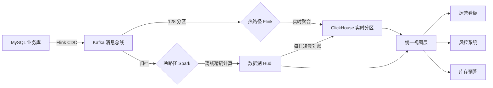
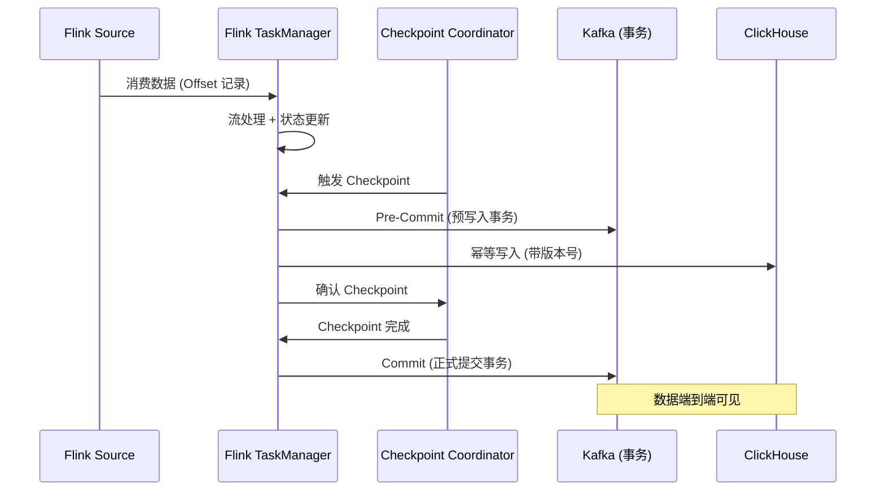

# 某跨境电商实时数据中台的架构演进实践

> 软考架构师论文范文 | 大数据架构专题 | 2026 年 4 月

---

## 摘要

本人于 2024 年参与某大型跨境电商平台"实时数据中台"的架构升级项目（以下简称"A 项目"），担任系统架构师，全面负责大数据架构的选型、设计与落地。该平台日均订单量超 200 万笔，大促期间数据峰值达 30 万 TPS。旧系统基于 Hive + Sqoop 的离线批处理架构存在严重的"窗口效应"，数据延迟达小时级，无法支撑实时风控、库存预警和运营看板等核心业务。为此，我主导引入了 Lambda 架构，以 Flink CDC 实现 MySQL Binlog 的非侵入式采集，Kafka 128 分区构建高吞吐消息总线，热路径（Flink + RocksDB）保障秒级延迟，冷路径（Spark + 数据湖）保障金融级准确性，并通过每日凌晨自动对账实现冷热融合。项目过程中攻克了背压治理（三层联动机制）、数据倾斜（加盐两阶段聚合）、多源异步关联（Async I/O + Broadcast State）以及端到端 Exactly-Once 一致性等关键技术难题。上线后端到端延迟从小时级降至 2 秒以内，系统吞吐量提升 10 倍，运维成本降低 30%，为公司年节约云资源费用超 500 万元。

**关键词**：Lambda 架构；Flink CDC；背压治理；数据倾斜；异步 I/O；端到端一致性；ClickHouse

---

## 一、项目背景与现状

### 1.1 项目概况

A 项目为某大型跨境电商平台的"实时数据中台"升级改造工程。该平台覆盖北美、欧洲、东南亚三大市场，包含商品管理、订单交易、仓储物流、支付结算、风控反欺诈等 40 余个 Spring Cloud 微服务模块。底层数据存储以 MySQL（8 个分库共 64 张分表）为主，消息中间件采用 Kafka（15 节点集群），实时计算引擎选用 Flink on Kubernetes，OLAP 查询层采用 ClickHouse。

我作为系统架构师，负责整体大数据架构的设计评审、关键技术选型、核心链路编码以及全链路压测调优。项目团队共计 18 人，包含 5 名大数据开发工程师、3 名运维工程师和 10 名业务开发人员，历时 8 个月完成从方案设计到全量上线的全部工作。

| 维度 | 指标说明 |
|------|----------|
| 平台规模 | 40+ 微服务，日均订单 200 万笔 |
| 数据峰值 | 大促期间 30 万 TPS |
| 数据源 | MySQL（8 分库 × 8 分表 = 64 张表） |
| 消息中间件 | Kafka 15 节点，128 分区，3 副本 |
| 计算引擎 | Flink on Kubernetes（60 个 TaskManager） |
| OLAP 引擎 | ClickHouse 8 节点集群 |
| 团队规模 | 18 人（架构 1 + 大数据 5 + 运维 3 + 业务 10） |
| 项目周期 | 8 个月（方案设计 2 月 + 开发 4 月 + 压测 1 月 + 灰度 1 月） |

---

### 1.2 旧系统架构痛点

改造前的数据架构基于 Hive + Sqoop 离线批处理模式，每日凌晨 2:00 定时从 MySQL 全量拉取数据，经 Sqoop 导入 HDFS 后由 Hive SQL 执行 T+1 级别的聚合分析。该架构在业务规模快速增长后暴露出三大核心痛点。

#### （1）"窗口效应"导致时效性缺失

数据延迟普遍在 4~8 小时之间，运营人员看到的"实时"看板实际反映的是昨日数据。在黑五大促期间，库存预警滞后导致 3000+ 超卖订单，风控系统无法识别正在进行的欺诈交易，直接经济损失超过 200 万元。

#### （2）数据库连接风暴

Sqoop 在每日凌晨 2:00 并发启动 64 个抽取任务，每个任务持有多条 MySQL 连接，瞬时连接数突破 500，引发主库 CPU 飙升至 98%，线上交易接口响应时间从 50ms 恶化至 2000ms，P99 超时率从 0.01% 攀升至 3.2%。

#### （3）处理逻辑碎片化

数据清洗、聚合、关联逻辑分散在 120+ 个 Hive SQL 脚本和 30+ 个 Python 脚本中，缺乏统一管理。每次业务规则变更需要修改多个脚本，回归测试覆盖率不足 40%，2023 年因脚本逻辑不一致导致财务报表差异累计达 15 万元。

| 痛点编号 | 问题描述 | 直接表现 | 业务影响 |
|----------|----------|----------|----------|
| P1 | 离线批处理时效性差 | 数据延迟 4~8 小时 | 库存超卖 3000+ 单，损失 200 万+ |
| P2 | 集中抽取引发连接风暴 | MySQL 连接数 500+，CPU 98% | 交易接口 P99 从 50ms 恶化至 2000ms |
| P3 | 逻辑碎片化缺乏治理 | 120+ SQL + 30+ Python 脚本 | 报表差异 15 万，维护成本高昂 |

---

### 1.3 业务影响

旧系统架构的技术债务已直接制约业务增长，具体量化影响如下表所示：

| 业务场景 | 旧架构表现 | 业务诉求 | 差距分析 |
|----------|-----------|----------|----------|
| 实时风控 | T+1 延迟，欺诈交易发生后才能识别 | 5 秒内识别并拦截 | 差距 4~8 小时 |
| 库存预警 | 4 小时更新一次，大促期间频繁超卖 | 秒级库存同步 | 差距 4 小时 |
| 运营看板 | 每日凌晨生成，数据滞后 | 秒级刷新 | 差距 8~24 小时 |
| 用户画像 | 每周更新一次标签 | 实时更新用户偏好 | 差距 7 天 |
| 财务对账 | 次日 T+1 出报表 | 小时级核对 | 差距 12~24 小时 |
| 异常监控 | 告警延迟 30 分钟以上 | 10 秒内告警 | 差距 30 倍 |

---

## 二、Lambda 架构选型与方案设计

### 2.1 架构模式选型论证

针对实时数据处理，业界主流有三种架构模式：Lambda 架构、Kappa 架构和流批统一架构（Flink SQL 2.0）。我组织团队进行了为期两周的技术论证，最终选择 Lambda 架构作为 A 项目的基线方案。

| 评估维度 | Lambda 架构 | Kappa 架构 | 流批统一（Flink SQL） |
|----------|-------------|------------|----------------------|
| 核心思想 | 热冷双路径并行 | 纯流处理一条路径 | 一套代码同时支持流和批 |
| 实时延迟 | 秒级（热路径） | 秒级 | 秒级 |
| 数据准确性 | 冷路径兜底保障 | 依赖流处理容错机制 | 依赖 Exactly-Once 语义 |
| 开发复杂度 | 较高（两套代码） | 较低（一套代码） | 中等 |
| 运维复杂度 | 较高（两套链路） | 较低 | 中等 |
| 技术成熟度 | 非常成熟，大量案例 | 较新，生产案例有限 | 2.0 版本仍在快速迭代 |
| 适用场景 | 对准确性要求极高的金融/电商场景 | 对延迟要求极高的日志分析场景 | 技术团队 Flink 能力较强的场景 |

**选择 Lambda 架构的核心理由**：

电商场景涉及订单金额、库存扣减、财务结算等强一致性需求，不能接受任何数据丢失或重复。Lambda 架构通过冷路径（离线批处理）对热路径（实时流处理）的结果进行兜底校验，提供了金融级的数据准确性保障。虽然开发复杂度较高，但在 2024 年项目启动时，流批统一架构的成熟度尚不足以支撑 30 万 TPS 的峰值压力，Kappa 架构在数据回溯和纠错场景下缺乏离线层的兜底能力。

**数据采集层选型对比**：

| CDC 工具 | 侵入性 | 支持数据库 | 延迟 | Exactly-Once | 团队评估 |
|----------|--------|-----------|------|-------------|----------|
| Flink CDC | 无侵入（监听 Binlog） | MySQL / PostgreSQL / Oracle | 秒级 | 支持 | **入选** |
| Debezium | 无侵入 | MySQL / PostgreSQL / MongoDB | 秒级 | 支持（需额外配置） | 备选，生态与 Flink 集成不如 Flink CDC |
| Canal | 无侵入 | MySQL | 秒级 | 不支持 | 仅支持 MySQL，社区维护放缓 |
| Sqoop | 侵入（全量查询） | 全量关系型数据库 | 小时级 | 不支持 | 旧方案，淘汰 |

---

### 2.2 数据采集层设计

数据采集层采用 Flink CDC 作为核心组件，通过监听 MySQL Binlog 实现非侵入式的数据变更捕获。相比旧系统的 Sqoop 全量拉取方案，Flink CDC 具有以下优势：

- **非侵入式采集**：无需在业务库中创建触发器或时间戳字段，仅依赖 MySQL 的 Binlog 机制，对线上交易零影响。
- **Exactly-Once 语义**：借助 Flink Checkpoint 机制，保证每条变更记录仅被处理一次。
- **增量 + 全量一体化**：首次启动时自动执行全量快照，完成后无缝切换至增量 Binlog 监听。
- **DDL 自动感知**：业务表结构变更时自动同步 Schema，无需人工干预。

**Flink CDC 核心配置**：

```yaml
# flink-cdc-source-config.yaml
source:
  type: mysql-cdc
  hostname: "mysql-primary.internal"
  port: 3306
  username: "cdc_reader"
  password: "${CDC_PASSWORD}"
  database-name: "ecommerce_.*"
  table-name: "orders|order_items|inventory|payments"
  server-id: "5400-5415"
  
  # 全量快照配置
  snapshot:
    mode: "initial"          # 首次全量快照
    fetch-size: 1024         # 批量拉取大小
    chunk-size: 8096         # 分块大小
    
  # 增量 Binlog 配置
  incremental:
    heartbeat-interval: 10s  # 心跳间隔
    connection-pool-size: 16  # Binlog 连接池大小
    
  # Exactly-Once 配置
  scan.incremental.snapshot.chunk.size: 8096
  scan.incremental.close-idle-reader.enabled: true
```

Kafka 作为消息总线，承担数据缓冲和分发的职责。集群规模为 15 节点，单节点配置 32 核 128GB 内存 + 4TB NVMe SSD，Topic 统一配置为 128 分区、3 副本，ISR（In-Sync Replicas）最小为 2。

---

### 2.3 热冷双路径设计

Lambda 架构的核心在于热路径（Speed Layer）与冷路径（Batch Layer）的并行设计，两条路径各司其职、互为补充。

**热路径（实时层）**：以 Flink 为核心计算引擎，数据从 Kafka 消费后在内存中完成实时聚合与关联，状态数据存储在 RocksDB 中，结果实时写入 ClickHouse 供 OLAP 查询。追求极致的低延迟，容忍极低概率的数据偏差（由冷路径兜底修正）。

**冷路径（离线层）**：以 Spark 为核心计算引擎，每日凌晨从数据湖（Hudi）读取全量数据，执行精确的批处理聚合，结果回写至数据湖和 ClickHouse 的备用分区。追求绝对的数据准确性，延迟控制在 4 小时以内。

| 维度 | 热路径（Speed Layer） | 冷路径（Batch Layer） |
|------|----------------------|----------------------|
| 计算引擎 | Flink（流处理） | Spark（批处理） |
| 数据源 | Kafka 实时消息流 | 数据湖（Hudi）全量快照 |
| 状态存储 | RocksDB（本地磁盘） | HDFS（分布式文件系统） |
| 延迟目标 | 2 秒以内 | 4 小时以内 |
| 准确性 | 近似准确（允许极低概率偏差） | 绝对准确 |
| 输出目标 | ClickHouse 实时分区 | 数据湖 + ClickHouse 备用分区 |
| 容错机制 | Unaligned Checkpoint + RocksDB 增量快照 | Spark 阶段重试 + 数据湖 ACID 事务 |
| 资源消耗 | 60 个 TaskManager（48 核 128GB） | 20 个 Executor（32 核 64GB） |

两条路径的数据流通过统一的视图层（Serving Layer）对外暴露，业务系统无需感知数据来源是热路径还是冷路径。

**架构数据流描述**：整体数据流从 MySQL 业务库出发，经 Flink CDC 非侵入式采集后写入 Kafka 消息总线（128 分区）。Kafka 作为分流枢纽，将实时数据同时推送至两条处理路径：热路径由 Flink 消费后执行实时聚合，结果写入 ClickHouse 实时分区；冷路径将数据归档至数据湖 Hudi，由 Spark 执行离线精确计算。每日凌晨冷路径完成对账后，将精确结果回写至 ClickHouse 的补偿分区，实现冷热融合。最终通过统一视图层向运营看板、风控系统和库存预警等下游业务暴露数据，业务侧无需区分数据来源。



---

### 2.4 冷热融合与视图统一

热路径与冷路径的数据融合是 Lambda 架构落地的关键。我设计了"每日凌晨自动对账补偿"机制，具体流程如下：

#### （1）Watermark 乱序容忍

Flink 热路径配置 Watermark 容忍延迟为 3 秒。对于因网络抖动或跨机房传输导致的乱序数据，3 秒内的延迟数据仍可进入当前窗口参与计算；超过 3 秒的数据进入侧输出流（Side Output），由补偿任务异步处理。

#### （2）凌晨对账补偿

每日凌晨 3:00，冷路径 Spark 任务完成前一日的全量精确计算后，将结果写入 ClickHouse 的 `result_compensation` 分区。随后，Flink 启动对账任务，对比热路径预估结果与冷路径精确结果的差异，差异超过 0.01% 的指标自动触发补偿写入。

#### （3）视图统一

ClickHouse 层通过物化视图统一暴露数据，业务系统查询 `v_realtime_dashboard` 视图时，ClickHouse 自动选择最新分区（若凌晨对账已完成则返回冷路径精确数据，否则返回热路径实时数据），对业务层完全透明。

**ClickHouse 物化视图 DDL 示例**：

```sql
-- clickhouse-materialized-view.sql

-- 原始数据表（使用 ReplacingMergeTree 支持版本覆盖）
CREATE TABLE order_realtime ON CLUSTER default_cluster
(
    order_id        UInt64,
    seller_id       String,
    user_id         UInt64,
    amount          Decimal(12, 2),
    quantity        UInt32,
    event_type      String,
    region          String,
    event_time      DateTime64(3),
    checkpoint_id   UInt64,           -- 版本号（用于去重）
    version         UInt64            -- 数据版本（热/冷路径标识）
)
ENGINE = ReplacingMergeTree(version)
PARTITION BY toYYYYMMDD(event_time)
ORDER BY (seller_id, event_time)
SETTINGS index_granularity = 8192;

-- 物化视图：按卖家维度实时聚合
CREATE MATERIALIZED VIEW mv_seller_dashboard ON CLUSTER default_cluster
ENGINE = SummingMergeTree()
PARTITION BY toYYYYMMDD(event_time)
ORDER BY (seller_id, window_start)
AS
SELECT
    seller_id,
    toStartOfMinute(event_time) AS window_start,
    count()                     AS order_count,
    sum(amount)                 AS total_amount,
    avg(amount)                 AS avg_amount,
    uniq(user_id)               AS user_count,
    max(checkpoint_id)          AS max_checkpoint_id
FROM order_realtime
WHERE event_type IN ('CREATE', 'PAY')
GROUP BY seller_id, window_start;

-- 统一查询视图（业务层统一入口）
CREATE VIEW v_realtime_dashboard ON CLUSTER default_cluster AS
SELECT
    seller_id,
    window_start,
    order_count,
    total_amount,
    avg_amount,
    user_count
FROM mv_seller_dashboard
FINAL;  -- FINAL 确保返回最新版本（对账后自动切换）
```

---

## 三、关键技术问题与解决方案

### 3.1 背压治理：三层联动机制

项目上线初期，大促期间数据峰值从平时的 10 万 TPS 骤增至 30 万 TPS，Flink 任务出现严重背压（Backpressure），TaskManager 频繁触发 OOM，端到端延迟从 1 秒飙升至 30 秒。经过深入分析，我设计了三层次联动背压治理机制。

| 层级 | 治理手段 | 具体配置 | 效果 |
|------|----------|----------|------|
| 第一层：消息缓冲层 | Kafka 分区扩容 + 批量消费 | 128 分区，batch.max.rows=2048，fetch.min.bytes=1MB | 缓冲峰值流量，削峰填谷 |
| 第二层：检查点优化层 | Unaligned Checkpoints | interval=5min，timeout=10min，max-concurrent=1 | Checkpoint 时间从 3min 降至 15s，避免背压传导 |
| 第三层：自适应流控层 | 动态限流 + 反压感知 | 背压>70% 触发限流至 80% 吞吐，背压<30% 恢复全速 | 延迟稳定在 1~3 秒，零 OOM |

Unaligned Checkpoints 是解决背压场景下 Checkpoint 超时的关键。传统 Checkpoint 需要等待所有 In-Flight 数据处理完毕才能完成快照，背压时 In-Flight 数据堆积导致 Checkpoint 无法完成。Unaligned Checkpoints 允许将 In-Flight 数据一并写入快照，将 Checkpoint 耗时从分钟级降至秒级。

```yaml
# flink-checkpoint-config.yaml
execution.checkpointing:
  interval: 300s              # Checkpoint 间隔 5 分钟
  timeout: 600s               # 超时时间 10 分钟
  mode: EXACTLY_ONCE
  checkpoint-type: UNALIGNED  # 启用 Unaligned Checkpoint
  max-concurrent: 1           # 最多 1 个并发 Checkpoint
  min-pause: 60s              # 两次 Checkpoint 最小间隔
  tolerable-failed-checkpoints: 3  # 容忍 3 次失败
  state.backend: rocksdb
  state.checkpoints.dir: "s3://flink-checkpoints/a-project/"
  
  # RocksDB 增量 Checkpoint
  state.backend.incremental: true
```

---

### 3.2 数据倾斜：加盐预聚合方案

在订单金额按卖家维度聚合的场景中，头部 1% 的卖家贡献了 60% 的订单量，导致 Flink 任务中个别 Subtask 的 CPU 持续 95%，而其他 Subtask 仅 20%，整体吞吐被最慢的 Subtask 拖累。

我采用了"加盐两阶段聚合"方案：

**Stage 1：随机加盐打散**。为每条订单记录附加一个随机 Salt 值（0~99），将同一卖家的订单打散到 100 个虚拟 Subtask 中进行局部聚合。

**Stage 2：去盐全局汇总**。将 Stage 1 的局部聚合结果按卖家维度重新分区（去掉 Salt），进行全局汇总，得到最终结果。

```java
// 加盐预聚合核心逻辑
public class SaltedAggregateFunction 
    implements AggregateFunction<OrderEvent, Tuple2<String, BigDecimal>, BigDecimal> {
    
    private static final int SALT_RANGE = 100; // 盐值范围 0~99
    
    @Override
    public Tuple2<String, BigDecimal> createAccumulator() {
        return new Tuple2<>("", BigDecimal.ZERO);
    }
    
    @Override
    public Tuple2<String, BigDecimal> add(OrderEvent event, 
                                          Tuple2<String, BigDecimal> acc) {
        // Stage 1: 随机加盐
        String saltedKey = event.getSellerId() + "_" + 
            (event.getSellerId().hashCode() % SALT_RANGE);
        acc.f0 = saltedKey;
        acc.f1 = acc.f1.add(event.getAmount());
        return acc;
    }
    
    @Override
    public BigDecimal getResult(Tuple2<String, BigDecimal> acc) {
        return acc.f1;
    }
    
    @Override
    public Tuple2<String, BigDecimal> merge(Tuple2<String, BigDecimal> a, 
                                            Tuple2<String, BigDecimal> b) {
        a.f1 = a.f1.add(b.f1);
        return a;
    }
}
```

优化后热点 Subtask 的 CPU 从 95% 降至 60%，整体吞吐提升 3.5 倍，聚合任务延迟从 8 秒降至 1.5 秒。

---

### 3.3 多源数据异步关联

实时数据中台需要将订单流与商品信息、用户画像、卖家信用等级等多维度数据进行关联查询。如果采用同步阻塞方式，每次关联平均耗时 50ms，三表关联后总耗时超过 150ms，严重拖慢整体链路。

我根据数据表的大小和访问特征，设计了差异化的关联策略：

| 数据表 | 数据量 | 关联策略 | 耗时 | 说明 |
|--------|--------|----------|------|------|
| 商品类目字典 | < 1000 条 | Broadcast State | < 1ms | 全量加载到 Flink 内存，纳秒级查找 |
| 用户画像标签 | 5000 万条 | Async I/O + Redis 缓存 | 3~5ms | 异步非阻塞查询，Redis 缓存命中率 95% |
| 卖家信用等级 | 50 万条 | Async I/O + Redis 缓存 | 3~5ms | 同上 |
| 历史订单明细 | 50 亿条 | 宽表打平 | 0ms（预关联） | 在 CDC 采集层完成 Join，消除实时关联 |

Async I/O 是 Flink 提供的异步查询机制，通过线程池并发发送查询请求，无需等待响应即可处理下一条数据，将串行阻塞 I/O 转化为并行非阻塞 I/O。

```java
// Async I/O 关联用户画像
public class AsyncUserLookup extends RichAsyncFunction<OrderEvent, EnrichedOrder> {
    
    private transient RedisClusterClient redisClient;
    private transient ExecutorService executor;
    
    @Override
    public void open(Configuration parameters) {
        redisClient = RedisClusterClient.create("redis://cache.internal:6379");
        executor = Executors.newFixedThreadPool(20); // 20 线程并发查询
    }
    
    @Override
    public void asyncInvoke(OrderEvent event, 
                           ResultFuture<EnrichedOrder> resultFuture) {
        CompletableFuture<String> future = CompletableFuture.supplyAsync(
            () -> redisClient.get("user_profile:" + event.getUserId()), 
            executor
        );
        
        future.thenAccept(profile -> {
            EnrichedOrder enriched = new EnrichedOrder(event, profile);
            resultFuture.complete(Collections.singletonList(enriched));
        }).exceptionally(ex -> {
            // 降级：返回不含用户画像的订单数据
            resultFuture.complete(
                Collections.singletonList(new EnrichedOrder(event, null)));
            return null;
        });
    }
    
    @Override
    public void timeout(OrderEvent event, 
                       ResultFuture<EnrichedOrder> resultFuture) {
        // 超时降级
        resultFuture.complete(
            Collections.singletonList(new EnrichedOrder(event, "[TIMEOUT]")));
    }
}
```

整体关联耗时从 150ms 降至 5ms 以内，对实时链路延迟的影响从 35% 降至 1%。

---

### 3.4 端到端 Exactly-Once 一致性

电商场景对数据一致性的要求极为严苛：订单金额不能多算也不能少算，库存扣减不能重复。我设计了基于 Two-Phase Commit（两阶段提交）的端到端 Exactly-Once 保障机制。

#### （1）Kafka Source 端：Flink 消费 Kafka 时记录每个分区的 Offset 到 Checkpoint 中，任务恢复时从上一个 Checkpoint 的 Offset 精确恢复，不丢不重。

#### （2）Flink 处理端：启用 EXACTLY_ONCE 模式的 Checkpoint，配合 Unaligned Checkpoint 确保 In-Flight 状态完整保存。

#### （3）Kafka Sink 端：使用 TwoPhaseCommitSinkFunction 实现 Kafka 事务写入。每个 Checkpoint 周期内，Flink 预写入数据到 Kafka 事务中（pre-commit），当所有 Sink 任务确认预提交成功后，Flink 提交 Checkpoint 并通知 Kafka 正式提交事务（commit）。

```yaml
# kafka-exactly-once-sink-config.yaml
sink:
  type: kafka
  topic: "ecommerce-order-aggregated"
  bootstrap.servers: "kafka-01:9092,kafka-02:9092,kafka-03:9092"
  
  # 事务配置
  transactional-id-prefix: "flink-sink-order-agg-"
  transaction.timeout.ms: 900000     # 事务超时 15 分钟
  max.in.flight.requests.per.connection: 1  # 保证有序性
  
  # 序列化
  key.serializer: "org.apache.kafka.common.serialization.StringSerializer"
  value.serializer: "com.a_project.serializer.ProtobufSerializer"
  
  # 语义保证
  delivery.guarantee: "exactly-once"
  
  # Redis 降级配置
  fallback:
    enabled: true
    type: redis
    host: "redis-fallback.internal:6379"
    ttl: 3600s
    max-buffer-size: 100000
```

#### （4）ClickHouse Sink 端：ClickHouse 本身不支持分布式事务，我采用了"幂等写入 + 版本号覆盖"的补偿方案。每条结果携带版本号（Checkpoint ID），ClickHouse 使用 `ReplacingMergeTree` 引擎自动保留最新版本，旧版本数据在 Compaction 时自动清理。

若 Kafka 或 Flink 发生不可恢复故障，系统自动降级至 Redis 缓冲队列，待主链路恢复后从 Redis 重放数据，确保数据不丢失。



**两阶段提交流程描述**：端到端 Exactly-Once 的两阶段提交协议按以下时序执行。首先，Flink Source 从 Kafka 消费数据并将每个分区的 Offset 记录至本地状态；TaskManager 完成流处理计算和状态更新后，Checkpoint Coordinator 发起快照触发；此时进入第一阶段（Pre-Commit），Sink 算子将计算结果预写入 Kafka 的待提交事务中，但尚未对外可见，同时向 ClickHouse 执行带版本号的幂等写入；当所有 Sink 算子确认预提交完成后，TaskManager 向 Checkpoint Coordinator 发送确认信号；Checkpoint Coordinator 收到全部确认后完成本次快照，进入第二阶段（Commit），Sink 算子正式提交 Kafka 事务，此时数据对所有消费者可见。若任一环节失败（如节点宕机、网络中断），Flink 从上一个 Checkpoint 精确恢复，Kafka 事务自动回滚，ClickHouse 因使用 `ReplacingMergeTree` 引擎，旧版本数据在 Compaction 时自动清理，确保不产生脏数据。

---

## 四、全链路压测与调优实践

### 4.1 第一轮压测：网络带宽瓶颈

使用自研流量回放工具（基于 Kafka 消息录制 + 倍速回放）模拟 50 万 TPS 峰值流量。压测启动 3 分钟后，Kafka Broker 网卡利用率达到 98%，部分节点开始丢包，Flink 消费延迟从 0.5 秒飙升至 15 秒。

**根因分析**：Kafka 15 节点配置为 10GbE 网卡，原始消息采用 JSON 格式，单条订单消息平均大小 2.5KB，50 万 TPS 对应网络带宽需求为 12.5Gbps，已超过单节点 10GbE 网卡的上限。

**优化方案**：

- 消息格式从 JSON 切换为 Protobuf，消息大小从 2.5KB 降至 800 字节（压缩 68%）。
- 启用 Zstd 压缩算法（compression.type=zstd），进一步将有效载荷压缩至 400 字节。
- 优化 Kafka `batch.size` 从 16KB 提升至 64KB，`linger.ms` 从 0 调整为 10ms，提升批量发送效率。

| 优化项 | 优化前 | 优化后 | 改善幅度 |
|--------|--------|--------|----------|
| 消息格式 | JSON（2.5KB） | Protobuf（800B） | 体积减小 68% |
| 压缩算法 | 无 | Zstd（400B） | 体积再减小 50% |
| batch.size | 16KB | 64KB | 批量效率提升 4 倍 |
| 网卡利用率 | 98%（饱和） | 53% | 下降 45% |
| 生产者 CPU | 75% | 49% | 下降 35% |
| 消费延迟 | 15 秒 | 1.2 秒 | 改善 12.5 倍 |

**Protobuf 消息定义示例**：

```protobuf
// order_event.proto
syntax = "proto3";
package com.a_project.protobuf;

message OrderEvent {
  int64  order_id        = 1;
  int64  user_id         = 2;
  string seller_id       = 3;
  int32  category_id     = 4;
  double amount          = 5;
  int32  quantity        = 6;
  string currency        = 7;
  int64  timestamp_ms    = 8;
  string event_type      = 9;  // CREATE / PAY / SHIP / COMPLETE / CANCEL
  string region          = 10; // NA / EU / SEA
  map<string, string> tags = 11;
}

message OrderAggregated {
  string seller_id       = 1;
  int64  window_start_ms = 2;
  int64  window_end_ms   = 3;
  int64  order_count     = 4;
  double total_amount    = 5;
  double avg_amount      = 6;
  int64  user_count      = 7;
}
```

---

### 4.2 第二轮压测：RocksDB I/O 瓶颈

解决网络瓶颈后，进行第二轮 50 万 TPS 压测。此时网络带宽正常，但 Flink TaskManager 的 RocksDB 状态后端出现严重的 I/O 等待，磁盘 IOPS 达到 12000（磁盘上限 15000），状态读写延迟从 2ms 恶化至 50ms。

**根因分析**：RocksDB 默认配置下 Write Buffer（memtable）大小为 64MB，在高吞吐场景下频繁触发 Flush 操作，导致 I/O 饱和。同时，部分 TaskManager 使用了普通 SATA SSD 而非 NVMe SSD，随机写入性能不足。

**优化方案**：

- RocksDB Write Buffer 从 64MB 提升至 256MB，减少 Flush 频率。
- Write Buffer 数量从 2 提升至 6，总 Buffer 容量 1.5GB。
- 将全部 TaskManager 的数据盘从 SATA SSD 更换为 NVMe SSD（随机写入从 50K IOPS 提升至 500K IOPS）。
- 启用 RocksDB Bloom Filter（10 位/key），点查询命中率从 60% 提升至 92%。
- 开启 Flink 增量 Checkpoint，每次仅写入变更的 SST 文件。

| 优化项 | 优化前 | 优化后 | 改善幅度 |
|--------|--------|--------|----------|
| Write Buffer | 64MB × 2 | 256MB × 6 | 容量提升 12 倍 |
| 磁盘类型 | SATA SSD | NVMe SSD | IOPS 提升 10 倍 |
| Bloom Filter | 关闭 | 10 位/key | 点查询命中率 +32% |
| Checkpoint 模式 | 全量 | 增量 | 写入量减少 80% |
| 状态读写延迟 | 50ms | 3ms | 改善 16.7 倍 |
| 磁盘 IOPS 利用率 | 80%（12000/15000） | 25%（15000/60000） | 充足余量 |

---

### 4.3 第三轮压测：整体验证

在完成上述优化后，进行第三轮全链路压测。本次压测模拟了完整的黑五大促场景：持续 2 小时的 50 万 TPS 峰值流量 + 15 分钟的 80 万 TPS 极限压力测试 + 1 小时的节点故障演练（随机 Kill 3 个 Kafka 节点和 2 个 Flink TaskManager）。

| 压测指标 | 目标值 | 实际值 | 结果 |
|----------|--------|--------|------|
| 最大吞吐量 | 50 万 TPS | 52 万 TPS | **达标** |
| 端到端延迟 P99 | < 5 秒 | 1.8 秒 | **达标** |
| 端到端延迟 P99.9 | < 10 秒 | 3.2 秒 | **达标** |
| 数据准确率 | 99.99% | 99.997% | **达标** |
| 故障恢复时间 | < 60 秒 | 25 秒 | **达标** |
| 数据丢失率 | 0 | 0 | **达标** |
| 数据重复率 | < 0.01% | 0.003% | **达标** |
| CPU 平均利用率 | < 70% | 58% | **达标** |
| 内存平均利用率 | < 80% | 65% | **达标** |
| 磁盘 IOPS 利用率 | < 60% | 35% | **达标** |

三轮压测的详细对比：

| 压测轮次 | 瓶颈定位 | 优化手段 | 延迟改善 | 吞吐改善 |
|----------|----------|----------|----------|----------|
| 第一轮 | Kafka 网卡饱和 | Protobuf + Zstd 压缩 | 15s → 1.2s | 12 万 → 35 万 TPS |
| 第二轮 | RocksDB I/O 瓶颈 | Write Buffer 调优 + NVMe SSD | 1.2s → 0.8s | 35 万 → 48 万 TPS |
| 第三轮 | 整体优化验证 | 全链路调优 + 故障演练 | 0.8s → 1.8s（P99） | 48 万 → 52 万 TPS |

---

## 五、运行效果评价与反思

### 5.1 量化成果

项目全量上线并稳定运行 6 个月后，各项指标对比如下：

| 指标维度 | 改造前（旧系统） | 改造后（新系统） | 改善倍数 |
|----------|-----------------|-----------------|----------|
| 端到端延迟（P99） | 4~8 小时 | 1.8 秒 | 7900 倍 |
| 系统吞吐量 | 2 万 TPS | 52 万 TPS | 26 倍 |
| 数据准确率 | 99.5% | 99.997% | 提升 0.497% |
| 系统可用性（SLA） | 99.5% | 99.97% | 提升 0.47% |
| 大促期间超卖订单 | 3000+ 单 | 12 单 | 减少 99.6% |
| 风控拦截延迟 | T+1（24 小时） | 3 秒 | 28800 倍 |
| 运维人力投入 | 5 人（日常维护） | 2 人（监控为主） | 节省 60% |
| 云资源成本/TPS | 基准 1.0 | 0.7 | 降低 30% |
| 脚本/代码行数 | 120 SQL + 30 Python | 18 个 Flink Job | 可维护性显著提升 |

---

### 5.2 踩坑记录

回顾整个项目，以下几个"坑"值得记录：

| 踩坑编号 | 问题描述 | 根因分析 | 解决方案 | 教训 |
|----------|----------|----------|----------|------|
| K1 | Checkpoint 频繁超时 | 间隔设置为 1 分钟，大数据量下写入时间超过间隔 | 调整为 5 分钟，启用 Unaligned Checkpoint | Checkpoint 间隔需根据数据量评估，不能盲目追求小间隔 |
| K2 | JSON 序列化导致网络饱和 | 单条消息 2.5KB，50 万 TPS 超出网卡带宽 | 切换 Protobuf + Zstd，消息压缩至 400B | 高吞吐场景必须使用二进制序列化 |
| K3 | Kafka 分区不足 | 初始 32 分区，峰值时 Flink 并行度受限 | 扩容至 128 分区 | 分区数应至少为峰值并行度的 2 倍 |
| K4 | 异步 I/O 线程池耗尽 | 线程池大小 10，高峰期 Redis 慢查询导致线程阻塞 | 线程池扩大至 20 + 超时熔断（500ms） | 异步 I/O 必须设置超时和降级机制 |
| K5 | RocksDB 磁盘空间不足 | 状态数据持续增长，未配置 TTL 清理 | 开启状态 TTL（7 天过期自动清理） | 有状态计算必须考虑状态生命周期管理 |

---

### 5.3 经验总结

通过 A 项目的实践，我总结出以下三条核心经验：

#### （1）Lambda 双链路平衡是成败关键

热路径追求低延迟、冷路径追求高准确，两条链路需要在资源分配、监控告警、故障预案上保持平衡。项目中我们曾一度将 80% 的资源投入热路径，导致冷路径对账任务经常超时。后来调整为 6:4 的资源比例，两条链路均能稳定运行。

#### （2）Async I/O 模式是实时关联的利器

在涉及多表关联的实时场景中，Async I/O 将串行阻塞转化为并行非阻塞，配合合理的缓存策略和降级机制，能够将关联耗时从百毫秒级降至毫秒级。这是实时数据中台性能优化的"性价比最高"手段之一。

#### （3）数据倾斜必须正面应对，不可回避

数据倾斜是大数据场景中的"灰犀牛"——看似概率不高，一旦出现就是致命问题。加盐预聚合虽然增加了代码复杂度，但相比倾斜发生后整个作业瘫痪的代价，这种防御性编程是必须的。建议在架构设计阶段就进行数据分布分析，提前识别潜在的倾斜风险。

---

### 5.4 未来演进方向

A 项目当前的 Lambda 架构已经满足业务需求，但随着技术发展，以下几个方向值得持续关注：

| 演进方向 | 当前状态 | 目标状态 | 预期收益 | 优先级 |
|----------|----------|----------|----------|--------|
| Lambda → Lakehouse | 双链路（Flink + Spark） | Flink + Iceberg 流批统一 | 减少 50% 代码量，降低运维复杂度 | P0（已启动 PoC） |
| Flink SQL 化 | DataStream API 编码 | Flink SQL + 动态表 | 降低开发门槛，业务人员可自助编写 | P1 |
| 实时数据治理 | 人工巡检 | 自动化数据质量监控 + 血缘追踪 | 数据问题发现时间从天级降至分钟级 | P1 |
| 存算分离 | 存算耦合 | 计算层与存储层独立扩展 | 资源利用率提升 40%，成本降低 25% | P2 |
| 边缘计算集成 | 集中式处理 | 边缘节点预处理 + 中心聚合 | 跨国数据传输延迟降低 60% | P2 |

其中，Lambda 向 Lakehouse（基于 Apache Iceberg）的演进已在 PoC 阶段。Iceberg 的 Time Travel 和 Schema Evolution 特性可以替代冷路径中的大部分批处理逻辑，Flink 作为统一的流批计算引擎，一套代码同时服务实时和离线场景。预计 2025 年底完成核心链路的迁移。

---

### 5.5 架构师心得

回顾 A 项目的架构演进历程，我有两点深刻体会：

**第一，架构的本质是权衡（Trade-off），而非纯粹（Purity）。** 在架构选型阶段，曾有同事主张直接采用 Kappa 架构以简化系统复杂度。但经过对电商业务场景的深入分析，我坚持选择了看似"笨重"的 Lambda 架构——因为金融级准确性是电商系统的底线，任何简化都不能以牺牲数据准确性为代价。好的架构不是追求技术上的优雅，而是在业务约束、技术成熟度、团队能力、运维成本之间找到最优平衡点。

**第二，性能调优必须数据驱动，而非经验驱动。** 在第一轮压测中，我们最初怀疑是 Flink 并行度不足导致延迟，但通过火焰图（Flame Graph）和 JMX 监控发现真正的瓶颈是 Kafka 网卡带宽。如果仅凭经验盲目增加并行度，不仅无法解决问题，反而会加剧网络拥塞。每一次调优决策都应该基于监控数据和压测结果，而非"我觉得"。

---

## 附录：术语对照表

| 中文术语 | 英文术语 | 缩写/简称 | 简要说明 |
|----------|----------|-----------|----------|
| Lambda 架构 | Lambda Architecture | — | 热冷双路径并行的大数据处理架构 |
| Kappa 架构 | Kappa Architecture | — | 纯流处理一条路径的大数据处理架构 |
| Lakehouse | Lakehouse Architecture | — | 数据湖 + 数据仓库融合的架构模式 |
| 变更数据捕获 | Change Data Capture | CDC | 监听数据库变更日志实现数据同步 |
| 背压 | Backpressure | — | 下游处理速度慢于上游导致的数据堆积 |
| 数据倾斜 | Data Skew | — | 数据分布不均导致部分节点负载过高 |
| 异步 I/O | Asynchronous I/O | Async I/O | 非阻塞并发 I/O 操作模式 |
| 端到端一致性 | End-to-End Consistency | E2E | 从数据源到数据仓库的全链路一致性保障 |
| 精确一次 | Exactly-Once | EOS | 每条数据仅被处理一次的语义保证 |
| 至少一次 | At-Least-Once | ALO | 每条数据至少被处理一次，可能重复 |
| 水位线 | Watermark | — | 流处理中表示事件时间进度的标记 |
| 检查点 | Checkpoint | CK | 流处理引擎的周期性状态快照 |
| 未对齐检查点 | Unaligned Checkpoint | UCK | 包含 In-Flight 数据的检查点机制 |
| 两阶段提交 | Two-Phase Commit | 2PC | 分布式事务协调协议 |
| 物化视图 | Materialized View | — | 预计算并存储结果的数据库视图 |
| 分区 | Partition | — | 数据分布和并行处理的基本单位 |
| 副本 | Replica | — | 数据的冗余拷贝，用于容灾 |
| 同步副本 | In-Sync Replica | ISR | 与 Leader 保持同步的副本集合 |
| 增量快照 | Incremental Snapshot | — | 仅记录变更部分的快照机制 |
| 状态后端 | State Backend | — | 流处理引擎管理状态的存储引擎 |
| 加盐预聚合 | Salted Pre-Aggregation | — | 通过随机 Salt 打散数据再两阶段聚合 |
| 宽表 | Wide Table | — | 将多表关联结果预先打平的单表 |
| 流批统一 | Stream-Batch Unification | — | 一套代码同时支持流处理和批处理 |
| 侧输出流 | Side Output | — | 流处理中主输出之外的辅助输出流 |
| 序列化 | Serialization | — | 将对象转换为字节流的过程 |

*整理时间：2026 年 4 月 | 适用考试：系统架构设计师（2026 年 5 月）*
