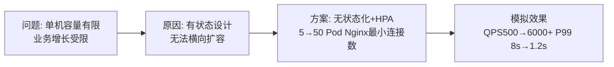
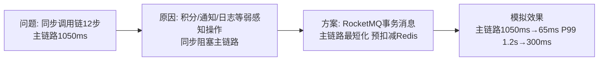
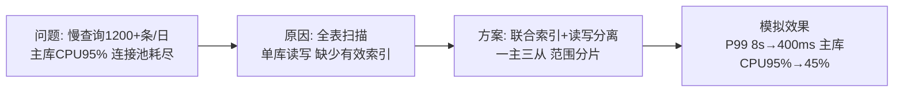

# 0011 性能优化 / 高并发系统设计 — 论文大纲记忆卡

> 对应范文：
> - **考试通用版**：`03-高并发系统设计论文范文-通用版.md`（纯文字，摘要+正文五段，推荐用于限时训练）
> - **技术参考版**：`03-性能优化论文范文-通用版.md`（四阶段版本，适合复习性能优化知识点）
>
> 论文标题：**论高并发系统设计在电商交易系统中的应用**
>
> 适用题型：高并发系统设计、性能优化、负载均衡及相关架构设计题
>
> **数据说明：本文项目规模和量化指标均为论文训练用模拟数据，重点是保证问题、方案和效果之间逻辑一致，不代表真实生产测量结果或官方评分标准。**

---

## 论文脉络图

```mermaid
graph TD
    ROOT["<b>论高并发系统设计在电商交易系统中的应用</b><br/>模拟项目: 电商交易 50万+注册 5万+日活<br/>Spring Boot单体→六方向协同高并发架构<br/>角色:系统架构师 职责:高并发架构方案决策与落地"]

    ROOT --> P1["<b>一、项目背景</b><br/>大促流量暴增10x 系统崩溃<br/>痛点:无限流保护 单机CPU 100% DB连接池耗尽<br/>模拟指标:QPS 500 可用性 95% P99 8s 错误率 35%<br/>决策:六方向协同高并发设计"]

    P1 --> P2["<b>二、理论概述 · 高并发六方向</b><br/>①缓存设计:多级缓存Caffeine→Redis→CDN 穿透/击穿/雪崩防护 Cache-Aside<br/>②异步处理:MQ事务消息 主链路最短化 削峰填谷 最终一致性<br/>③限流降级:令牌桶/滑动窗口 熔断三态 三级降级 Sentinel<br/>④数据库优化:联合索引 读写分离 分库分表 连接池调优<br/>⑤服务拆分:DDD 有界上下文 事件风暴 独立扩展<br/>⑥水平扩容:无状态化改造 HPA 5→50 Pod 负载均衡"]

    P2 --> P3["<b>三、选型协同 · 六方向关系</b><br/>缓存+限流=第一道防线 异步=减压阀 DB=根基加固<br/>服务拆分=结构重塑 水平扩容=规模放大<br/>选型原则:先防守→再优化→后重构 基于紧迫性/成本/团队能力"]

    P3 --> P4["<b>四、实践应用 · 六方向落地</b><br/><br/>缓存+限流:三级缓存 布隆过滤器 TTL偏移 Sentinel令牌桶QPS3000 三级降级<br/>→模拟效果:可用性95%→99.5%<br/><br/>异步+扩容:K8s集群 HPA 5→50 Pod Session→Redis RocketMQ移出弱感知操作<br/>→模拟效果:QPS500→6000+ P99 8s→300ms 主链路1050ms→65ms<br/><br/>数据库+拆分:联合索引 一主三从 按月分片 HikariCP调优 DDD事件风暴3个限界上下文<br/>→模拟效果:P99 8s→400ms 主库CPU95%→45%<br/><br/>问题1:限流误杀→自适应限流→误限流率15%→2%<br/>问题2:主从延迟→强制读主+Redis补偿→可查率70%→98%"]

    P4 --> P5["<b>五、总结成效</b><br/>模拟指标:QPS500→6000+ P99 8s→400ms P50 300ms→50ms<br/>可用性95%→99.99% 错误率35%→0.1%<br/>主链路1050ms→65ms 主库CPU95%→45% 慢查询1200→15<br/>不足:APM监控颗粒度不够 分布式事务开销大 服务拆分成本高<br/>展望:全链路可观测性 DDD微服务拆分 AIOps预测性弹性"]
```

---

## 实践因果链

### 架构选型链

### 限流降级链

### 水平扩展链

### 异步化链

### 数据库优化链

---

## 模拟量化数据速记

> 以下数字只用于保持论文内部一致。根据题目和项目背景可以合理调整，但同一篇论文中不能前后矛盾。

- QPS：500 → **6000+**；P99：8s → **400ms**；P50：300ms → **50ms**
- 可用性：95% → **99.99%**；错误率：35% → **<0.1%**
- 主库 CPU：95% → **45%**；慢查询：1200 条/日 → **<15 条/日**
- 主链路：1050ms → **65ms**；部署规模：3 台 → **50 Pod**

---

## 考场注意事项

- 若考“高并发系统设计”，应围绕缓存、异步、限流、数据库、服务拆分和水平扩容组织答案，但必须根据题目要求取舍，不能机械堆砌六个方向。
- 每个重点方向至少包含原理、选型依据、实施方式、局限和适用条件。
- 量化数据用于增强论证，必须前后一致；模拟数据不能表述为经过真实生产验证或官方要求。
- 个人角色定位为系统架构师，突出架构方案决策、质量属性权衡和落地治理。
- 不足与展望必须与前文方案对应，例如监控颗粒度、分布式事务成本和服务拆分复杂度。
- 考场版使用纯文字，摘要和正文逐项回应题目要求，不使用表格、代码或图。
- 六方向关系可概括为：缓存与限流负责前置保护，异步负责削峰解耦，数据库负责消除数据瓶颈，服务拆分负责边界治理，水平扩容负责容量增长。