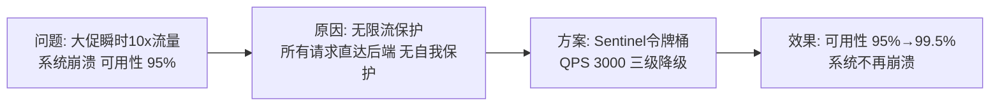
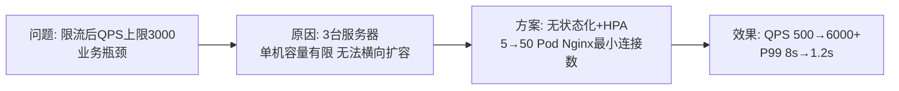
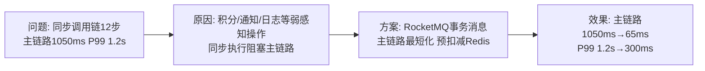
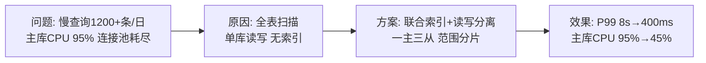

# 0011 性能优化 / 高并发系统设计 — 论文大纲记忆卡

> 对应范文：
> - **考试通用版**：`03-高并发系统设计论文范文-通用版.md`（纯prose，摘要+正文五段，2900字，推荐用于考场）
> - **技术参考版**：`03-性能优化论文范文-通用版.md`（四阶段版本，适合复习性能优化知识点）
> 标题：**论高并发系统设计在电商交易系统中的应用**
> 适用考题：2026年上(论高并发系统设计)、历年系统高并发相关考题

---

## 论文脉络图

```mermaid
graph TD
    ROOT["<b>论高并发系统设计在电商交易系统中的应用</b><br/>2025.01-06 | 电商交易 50万+注册 5万+日活<br/>Spring Boot单体→六方向协同高并发架构<br/>角色:系统架构师 | 职责:高并发架构方案决策与落地"]

    ROOT --> P1["<b>一、项目背景</b><br/>大促流量暴增10x 系统崩溃<br/>痛点:无限流保护 单机CPU 100% DB连接池耗尽<br/>指标:QPS 500 可用性 95% P99 8s 错误率 35%<br/>决策:六方向协同高并发设计"]

    P1 --> P2["<b>二、理论概述 · 高并发六方向</b><br/>①缓存设计⭐:多级缓存Caffeine→Redis→CDN 穿透/击穿/雪崩防护 Cache-Aside<br/>②异步处理⭐:MQ事务消息 主链路最短化 削峰填谷 最终一致性<br/>③限流降级⭐:令牌桶/滑动窗口 熔断三态 三级降级 Sentinel<br/>④数据库优化⭐:联合索引 读写分离 分库分表 连接池调优<br/>⑤服务拆分⭐:DDD 有界上下文 事件风暴 独立扩展<br/>⑥水平扩容⭐:无状态化改造 HPA 5→50 Pod 负载均衡"]

    P2 --> P3["<b>三、选型协同 · 六方向关系</b><br/>缓存+限流=第一道防线(1-2周) 异步=减压阀(2-4周) DB=根基加固(4-12周)<br/>服务拆分=结构重塑(4-12周) 水平扩容=规模放大(2-4周)<br/>选型原则:先防守→再优化→后重构 基于紧迫性/成本/团队能力"]

    P3 --> P4["<b>四、实践应用 · 六方向落地</b><br/><br/>缓存+限流:三级缓存 布隆过滤器 TTL偏移 Sentinel令牌桶QPS3000 三级降级<br/>→可用性 95%→99.5%<br/><br/>异步+扩容:K8s集群 HPA 5→50 Pod Session→Redis RocketMQ移出弱感知操作<br/>→QPS 500→6000+ P99 8s→300ms 主链路1050ms→65ms<br/><br/>数据库+拆分:联合索引 一主三从 按月分片 HikariCP调优 DDD事件风暴3个限界上下文<br/>→P99 8s→400ms 主库CPU 95%→45%<br/><br/>问题1:限流误杀→自适应限流→误限流率15%→2%<br/>问题2:主从延迟→强制读主+Redis补偿→可查率70%→98%"]

    P4 --> P5["<b>五、总结成效</b><br/>QPS:500→6000+(12x) | P99:8s→400ms(20x) | P50:300ms→50ms(6x)<br/>可用性:95%→99.99% | 错误率:35%→0.1%(350x)<br/>主链路:1050ms→65ms(16x) | 主库CPU:95%→45% | 慢查询:1200→15(80x)<br/>不足:APM监控颗粒度不够 分布式事务开销大 服务拆分成本高<br/>展望:全链路可观测性 DDD微服务拆分 AIOps预测性弹性"]
```

---

## 实践因果链

### 架构选型链

### 限流降级链

### 水平扩展链

### 异步化链

### DB优化链

---

## 量化数据速记

QPS: 500 → **6000+** (12倍) | P99: 8s → **400ms** (20倍) | P50: 300ms → **50ms** (6倍)
可用性: 95% → **99.99%** | 错误率: 35% → **<0.1%** (350倍)
主库CPU: 95% → **45%** | 慢查询: 1200条/日 → **<15条/日** (80倍)
主链路: 1050ms → **65ms** (16倍) | 部署: 3台 → **50 Pod** (17倍)

---

## 考场注意事项

- ⚠️ 若考「高并发系统设计」：必须从六个方向论述（缓存/异步/限流/DB/拆分/扩容），每个方向有独立论述，不能只写其中几个
- ⚠️ 每个方向必须包含：原理 + 优势 + 局限性，这是理论概述段的得分点
- ⚠️ 量化数据必须准确记忆：QPS 500→6000+、P99 8s→400ms、可用性 95%→99.99%、主链路 1050ms→65ms，这四组是核心
- ⚠️ 个人职责表述：系统架构师，负责"高并发架构方案决策与落地"，不是开发或运维
- ⚠️ 不足与展望部分不能省略：APM监控颗粒度、分布式事务开销、服务拆分成本三个不足必须写
- ⚠️ 考场写作要求：纯文字叙述（0表格、0代码、0图），摘要+正文五段结构，"我"仅角色句出现，其余用"我们"，使用5条标准过渡句
- ⚠️ 六方向协同关系必须在第3段论述：缓存+限流=第一道防线，异步=减压阀，DB=根基加固，服务拆分=结构重塑，水平扩容=规模放大
