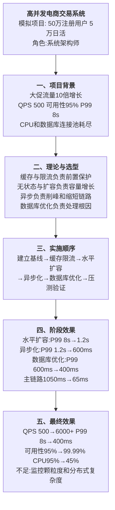
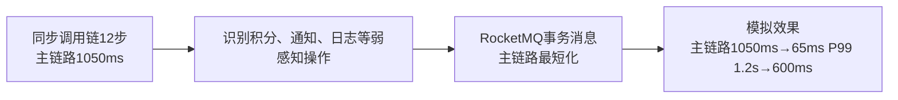
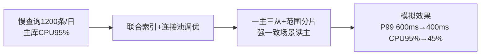

# 0011 性能优化 / 高并发系统设计 — 论文大纲记忆卡

> 对应范文：
> - **考试通用版**：`03-高并发系统设计论文范文-通用版.md`
> - **技术参考版**：`03-性能优化论文范文-通用版.md`
>
> 论文标题：**论高并发系统设计在电商交易系统中的应用**
>
> **数据说明：本文项目规模和量化指标均为论文训练用模拟数据，不代表真实生产测量结果或官方评分标准。**

## 一、论文主线



## 二、六个设计方向

| 方向 | 解决的问题 | 典型措施 | 主要风险 |
|------|------------|----------|----------|
| 缓存 | 热点读压力和响应延迟 | Caffeine、Redis、CDN、Cache-Aside | 一致性、穿透、击穿和雪崩 |
| 限流降级 | 峰值流量导致系统雪崩 | 令牌桶、滑动窗口、熔断、三级降级 | 阈值不合理导致误杀 |
| 水平扩容 | 单机容量有限 | 无状态化、HPA、负载均衡 | 会话、状态和成本治理 |
| 异步处理 | 同步链路过长 | MQ、事务消息、削峰填谷 | 幂等、顺序、重试和最终一致性 |
| 数据库优化 | 慢查询和主库瓶颈 | 索引、读写分离、分片、连接池 | 延迟、热点分片和复杂事务 |
| 服务拆分 | 模块耦合和扩展粒度过粗 | DDD、限界上下文、独立部署 | 分布式复杂度和治理成本 |

## 三、实践因果链

### 3.1 缓存与限流


### 3.2 水平扩容


### 3.3 异步化



### 3.4 数据库优化



## 四、模拟指标统一表

> 同一篇论文必须使用同一条阶段链，不能出现“优化后指标反而变差”的前后矛盾。

| 指标 | 基线 | 扩容后 | 异步后 | 最终 |
|------|------|--------|--------|------|
| QPS | 500 | 6000+ | 6000+ | 6000+ |
| P99 | 8s | 1.2s | 600ms | 400ms |
| 主链路 | 1050ms | 1050ms | 65ms | 65ms |
| 可用性 | 95% | 99.5% | 99.9% | 99.99% |
| 主库 CPU | 95% | 90% | 85% | 45% |
| 慢查询 | 1200 条/日 | 1200 条/日 | 1200 条/日 | 少于 15 条/日 |

这些数字只是训练口径。正式写作时可以根据题目调整，但必须同步修改全文所有位置。

## 五、考场组织方式

```text
项目背景与性能问题
→ 高并发设计原则和质量属性
→ 方案选型及先后顺序
→ 三组问题—原因—方案—效果
→ 最终指标、不足与改进
```

## 六、考场检查

- [ ] 是否逐项回应题目要求，而不是机械罗列六个方向
- [ ] 是否先建立性能基线，再描述优化措施
- [ ] 每项措施是否说明选型依据、局限和适用条件
- [ ] 阶段指标是否呈单调改善且前后一致
- [ ] 是否区分吞吐、延迟、可用性和资源利用率
- [ ] 是否体现系统架构师的权衡和治理职责
- [ ] 模拟数据是否避免冒充真实生产测量结果
- [ ] 考场全文是否使用纯文字，不依赖表格、代码或图

---

*当前维护批次：2026-H2｜最后更新：2026-07-31*