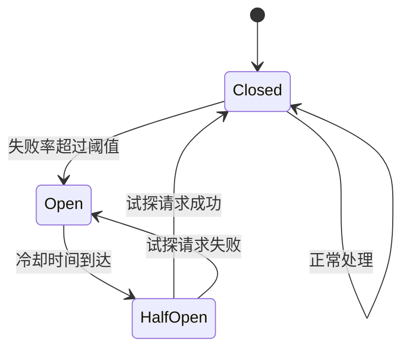
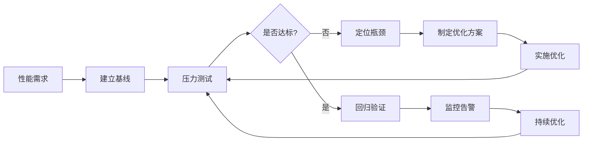
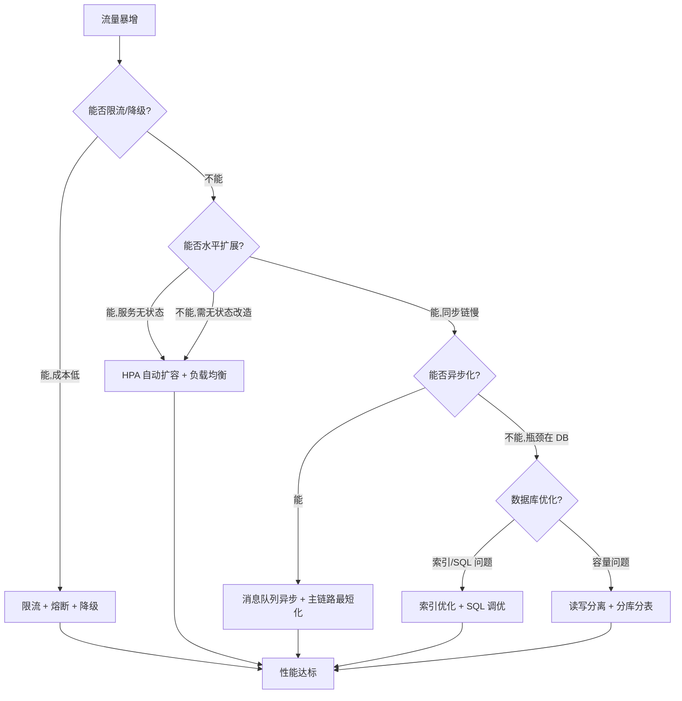

# 性能优化核心知识点

> 整理自 Google Gemini 学习对话 | 软考架构师论文专题

> **说明：** 性能优化是系统架构设计师考试的高频论文方向。本文覆盖限流降级、水平扩展、异步化优化、数据库优化、性能测试与监控等核心主题，并提供软考高频考点速查。

---

## 一、性能优化定义与重要性

### 1.1 定义与目标

**性能优化**是指在不改变系统功能的前提下，通过调整代码、架构、配置等手段，提升系统的响应速度、吞吐量和资源利用率，降低延迟和资源消耗的过程。

**性能优化的三个核心目标：**

| 目标 | 指标 | 典型值 |
|------|------|--------|
| **降低延迟** | 响应时间 RT（Response Time） | P99 < 500ms |
| **提高吞吐** | TPS/QPS（Transactions/Queries Per Second） | 根据业务量级 |
| **提升资源效率** | CPU/内存/磁盘/网络利用率 | CPU 60%~80% |

### 1.2 Amdahl 定律

Amdahl 定律描述了系统中可优化部分对整体性能提升的影响：

```
整体加速比 S = 1 / [(1 - P) + P/N]
```

- `P`：系统中可被优化的部分所占比例（0 < P < 1）
- `N`：优化部分获得的加速比
- `(1 - P)`：系统中不可被优化的部分所占比例

**示例：** 如果系统中 80% 的代码可以加速 4 倍，则整体加速比 = 1 / [(1 - 0.8) + 0.8/4] = 1 / 0.4 = 2.5 倍。

**核心启示：** 当不可优化部分占比很大时，继续优化可优化部分的收益会越来越小。架构师应优先优化系统中耗时占比最大的瓶颈。

### 1.3 性能优化的四个层次

| 层次 | 优化手段 | 成本 | 效果 | 示例 |
|------|---------|------|------|------|
| **代码层** | 算法优化、减少冗余计算、连接池 | 低 | 单点提升 10%~30% | 将 O(n^2) 改为 O(n log n) |
| **缓存层** | 本地缓存、Redis 分布式缓存、CDN | 中 | 读操作提升 10x~100x | 热点商品数据缓存到 Redis |
| **架构层** | 负载均衡、水平扩展、异步化、消息队列 | 高 | 整体吞吐提升数倍 | K8s HPA 自动扩缩容 |
| **数据库层** | 索引优化、SQL 调优、读写分离、分库分表 | 中 | 查询性能提升 10x~100x | 添加联合索引消除全表扫描 |

> **架构师视角：** 优化应遵循"先易后难、先测量后动手"的原则。代码层和缓存层的优化成本最低、见效最快；架构层和数据库层的优化虽然效果显著，但引入的复杂度和运维成本也更高。

### 1.4 性能优化黄金法则：先测量后优化

```
测量（Profiling） → 定位瓶颈（Bottleneck） → 优化（Optimize） → 验证（Verify） → 循环
```

| 步骤 | 关键动作 | 常用工具 |
|------|---------|---------|
| **测量** | 建立性能基线、采集 RT/TPS/CPU 等指标 | JMeter、Prometheus |
| **定位** | 分析调用链路、识别慢 SQL、检查 GC | SkyWalking、EXPLAIN、jstack |
| **优化** | 对症下药：索引/缓存/限流/扩展 | 按具体场景选择 |
| **验证** | 回归测试、对比基线、确认效果 | JMeter 复测、Grafana 对比 |

**关键原则：** 没有测量就没有优化。任何"感觉慢了"的直觉都必须用数据验证。

---

## 二、缓存设计

### 2.1 多级缓存架构

多级缓存是高性能系统的基础架构，通过在数据访问链路的不同层级设置缓存，逐层拦截读请求，减少对数据库的直接访问：

| 层级 | 技术 | 延迟 | 命中率 | 说明 |
|------|------|------|--------|------|
| **L1 本地缓存** | Caffeine、Guava Cache | <1ms | 60%~80% | JVM进程内缓存，最快但多实例间不共享 |
| **L2 分布式缓存** | Redis Cluster、Memcached | 1~5ms | 80%~95% | 跨实例共享，支持持久化和丰富数据结构 |
| **L3 CDN缓存** | CloudFlare、阿里云CDN | 10~50ms | 90%+ | 边缘节点缓存静态资源，拦截最外层流量 |

**架构原则**：数据越靠近用户端，缓存层级越高。静态资源走CDN，热点业务数据走Redis，极热且读多写少的数据额外叠加本地Caffeine缓存。

### 2.2 缓存三大经典问题

**缓存穿透**：查询不存在的数据，缓存中无此Key，请求直接穿透到数据库。
- **防护方案**：布隆过滤器前置拦截（判定Key不存在则直接返回）、空值缓存策略（对不存在的Key缓存短期null值，TTL设30~60秒）。

**缓存击穿**：热点Key在过期瞬间，大量并发请求同时到达数据库。
- **防护方案**：互斥锁（使用Redis SETNX加分布式锁，仅允许一个线程回源查询，其余线程等待）、热点Key永不主动过期（设置超长TTL，由后台任务主动刷新）。

**缓存雪崩**：大量Key在同一时间点集中过期，或缓存服务整体宕机，导致数据库瞬时承受全部流量。
- **防护方案**：TTL随机偏移（在原TTL基础上加减随机值，如±30%使过期时间分散）、多可用区部署Redis集群、服务降级兜底。

### 2.3 缓存一致性策略

缓存与数据库之间的数据一致性是缓存设计的核心难点，常见策略如下：

| 策略 | 读流程 | 写流程 | 一致性 | 适用场景 |
|------|--------|--------|--------|---------|
| **Cache-Aside** | 先查缓存，未命中查数据库并回填 | 先更新数据库，再删除缓存 | 最终一致 | 最常用，读多写少场景 |
| **Read-Through** | 应用只读缓存，缓存未命中时自动回源 | 同Cache-Aside | 最终一致 | 需要封装回源逻辑的场景 |
| **Write-Through** | 同Cache-Aside | 先写缓存，缓存同步写数据库 | 强一致 | 写入量小、一致性要求高的场景 |
| **Write-Behind** | 同Cache-Aside | 只写缓存，异步批量刷数据库 | 弱一致 | 高吞吐写入、允许数据延迟的场景 |

**延迟双删**：在Cache-Aside模式下，写操作时先删除缓存→更新数据库→等待一段延迟（如500ms，覆盖主从同步时间）→再次删除缓存。第二次删除用于兜底"在数据库更新过程中、旧缓存被其他读请求回填"的竞态场景。

### 2.4 缓存淘汰策略

| 策略 | 原理 | 适用场景 |
|------|------|---------|
| **LRU（Least Recently Used）** | 淘汰最久未被访问的数据 | 通用场景，访问具有时间局部性 |
| **LFU（Least Frequently Used）** | 淘汰访问频率最低的数据 | 热点数据相对稳定、长尾访问多 |
| **FIFO（First In First Out）** | 按进入顺序淘汰最早的数据 | 实现简单，性能较差 |
| **TTL过期** | 设置固定过期时间 | 数据时效性强的场景 |

Redis默认使用近似LRU算法（volatile-lru和allkeys-lru两种模式）。

### 2.5 缓存容量规划

缓存不是越大越好。容量规划需考虑：热点数据总量、读写比例、缓存命中率目标、内存成本。一般建议Redis内存使用率不超过75%，预留内存用于AOF重写和RDB快照。对于大Key问题，需定期分析Key分布，避免单个Hash或List过大导致阻塞。

---

## 三、限流与降级

### 2.1 限流算法对比

| 算法 | 原理 | 优点 | 缺点 | 适用场景 |
|------|------|------|------|---------|
| **固定窗口计数器** | 在固定时间窗口内计数，超过阈值则拒绝 | 实现简单、内存占用小 | 临界突变问题（窗口边界处可能两倍流量通过） | 简单场景、低精度要求 |
| **滑动窗口计数器** | 将窗口分为多个子窗口，滑动统计 | 比固定窗口更平滑，减少临界突变 | 内存和计算开销略大 | 对限流精度要求较高的场景 |
| **令牌桶算法** | 固定速率往桶里放令牌，请求需获取令牌才能通过 | 允许突发流量（桶满时可累积令牌） | 实现相对复杂 | API 网关、允许短暂突发流量 |
| **漏桶算法** | 请求先进入桶，固定速率流出处理 | 严格限制处理速率，流量平滑 | 无法应对突发流量，多余请求直接丢弃 | 严格限速率场景、下游系统保护 |

**令牌桶算法示意：**

```
请求 ──→ [ 令牌桶 ] ──→ 有令牌？──Yes──→ 放行
                  │          │
                  │          └──No──→ 拒绝/排队
                  │
       固定速率添加令牌 ↑
```

### 2.2 限流维度

| 维度 | 说明 | 示例 |
|------|------|------|
| **网关限流** | 在 API 网关层统一限流，保护后端所有服务 | Nginx/Kong 按全局 QPS 限流 |
| **应用限流** | 在具体应用内部限流，细粒度控制 | Sentinel 对某个 Service 方法限流 |
| **接口限流** | 对单个 API 接口设置独立限流阈值 | /api/order 限流 1000 QPS |
| **用户限流** | 按用户维度限流，防止单个用户滥用 | 每个用户 ID 最多 100 QPS |

### 2.3 熔断器三态转换



**熔断器状态详解：**

| 状态 | 含义 | 行为 | 转换条件 |
|------|------|------|---------|
| **Closed（关闭）** | 正常运行 | 请求正常转发 | 失败率达到阈值（如 50%）时 → Open |
| **Open（打开）** | 熔断保护 | 直接拒绝所有请求，快速失败 | 冷却时间到达（如 30 秒）→ HalfOpen |
| **Half-Open（半开）** | 试探恢复 | 允许少量请求通过试探 | 试探成功 → Closed；失败 → Open |

> **架构师视角：** 熔断器的参数设定需要基于历史数据和系统容量。失败阈值过低会误杀正常波动，过高则起不到保护作用。一般建议：失败率阈值设为 50%，冷却时间 30~60 秒，半开试探请求数为 1~3 个。

### 2.4 降级策略对比

| 策略 | 说明 | 适用场景 | 用户体验影响 |
|------|------|---------|-------------|
| **默认值降级** | 返回预设的默认值 | 推荐列表、个性化配置 | 低（返回通用内容） |
| **功能降级** | 临时关闭非核心功能 | 大促时关闭评论/推荐 | 中（部分功能不可用） |
| **延迟处理** | 将请求放入队列异步处理 | 非实时任务（如发邮件） | 低（稍后完成） |
| **限流排队** | 超过阈值的请求进入等待队列 | 秒杀场景 | 高（需等待） |

### 2.5 常用限流熔断工具对比

| 工具 | 开发方 | 限流算法 | 熔断 | 降级 | 系统自适应 | 特点 |
|------|--------|---------|------|------|-----------|------|
| **Sentinel** | 阿里 | 全部支持 | 支持 | 支持 | 支持（Load 自适应） | 功能最全面，国内生态好 |
| **Hystrix** | Netflix | 线程池/信号量 | 支持 | 支持 | 不支持 | 已停止维护，不推荐新项目使用 |
| **Resilience4j** | 社区 | 基于 RateLimiter | 支持 | 支持 | 不支持 | 轻量级，函数式 API，Spring Boot 3 首选 |

### 2.6 限流阈值设定方法

> **架构师视角：** 限流阈值不是拍脑袋决定的，而应基于以下三个维度综合计算：

| 维度 | 计算方法 | 示例 |
|------|---------|------|
| **历史峰值** | 取过去 6 个月峰值流量的 1.2~1.5 倍 | 历史峰值 8000 QPS → 阈值设为 10000 |
| **系统容量** | 通过压测确定系统最大承载能力 | 压测发现 12000 QPS 时 CPU 95% → 阈值设为 9000（留 25% 余量） |
| **安全冗余** | 为系统留出 20%~30% 的安全余量 | 容量 10000 → 阈值 7000~8000 |

---

## 四、水平扩展

### 3.1 横向扩展 vs 纵向扩展

| 对比维度 | 横向扩展（Scale Out） | 纵向扩展（Scale Up） |
|---------|---------------------|---------------------|
| **定义** | 增加服务器节点数量 | 增强单台服务器配置 |
| **成本** | 初期成本低，可逐步投入 | 初期成本高（高端硬件昂贵） |
| **上限** | 理论上无上限（受架构制约） | 有物理上限（单台机器极限） |
| **复杂度** | 高（需分布式架构支持） | 低（无需改动架构） |
| **故障影响** | 单点故障影响小 | 单点故障影响大 |
| **弹性** | 支持弹性伸缩（云原生） | 需停机升级硬件 |
| **适用场景** | 互联网高并发、云环境 | 传统企业、单体应用 |

### 3.2 无状态 vs 有状态服务扩展能力

| 特性 | 无状态服务（Stateless） | 有状态服务（Stateful） |
|------|------------------------|-----------------------|
| **定义** | 不保存会话/数据状态，任意实例可处理任意请求 | 需要维护状态信息（Session、数据） |
| **扩展性** | 极好，可随意增减实例 | 差，需要数据同步/迁移 |
| **负载均衡** | 简单，任意策略均可 | 复杂，可能需要粘性会话（Session Stickiness） |
| **故障恢复** | 新实例立即接管 | 需要恢复状态数据 |
| **示例** | Web 服务器、API 网关 | 数据库、缓存、消息队列 |

### 3.3 K8s HPA 弹性扩缩原理

**HPA（Horizontal Pod Autoscaler）** 是 Kubernetes 提供的自动水平扩展机制：

| 参数 | 说明 | 示例值 |
|------|------|--------|
| **minReplicas** | 最小副本数 | 2 |
| **maxReplicas** | 最大副本数 | 10 |
| **targetCPUUtilizationPercentage** | CPU 利用率目标阈值 | 70% |
| **targetMemoryUtilizationPercentage** | 内存利用率目标阈值 | 80% |
| **scaleUp.stabilizationWindowSeconds** | 扩展稳定窗口 | 60 秒 |
| **scaleDown.stabilizationWindowSeconds** | 缩容稳定窗口 | 300 秒 |

**工作原理：**

```
Controller 每 15 秒检查一次:
  实际 CPU 利用率 = 当前所有 Pod CPU 使用量之和 / (Pod 数 × CPU Request)
  期望 Pod 数 = ceil(实际 CPU 利用率 / 目标利用率 × 当前 Pod 数)
  在 [minReplicas, maxReplicas] 范围内取整 → 执行扩缩
```

> **架构师视角：** HPA 配置中，扩缩窗口（stabilizationWindowSeconds）非常关键。扩展窗口太短会导致频繁扩缩抖动，太长则响应慢。建议扩缩比设为 2:1（如扩展 60 秒、缩容 300 秒），因为缩容应该更谨慎。

### 3.4 负载均衡在水平扩展中的作用

| 类型 | 工作层 | 协议 | 特点 | 典型产品 |
|------|--------|------|------|---------|
| **四层 LB（L4）** | 传输层 | TCP/UDP | 性能高、不解析应用协议、NAT 转发 | LVS、F5、云厂商 LB |
| **七层 LB（L7）** | 应用层 | HTTP/HTTPS/gRPC | 可基于 URL/Content 路由、SSL 终结 | Nginx、HAProxy、Envoy |

**对比：**

| 维度 | 四层 LB | 七层 LB |
|------|---------|---------|
| **性能** | 更高（纯转发） | 略低（需解析协议） |
| **路由粒度** | IP + 端口 | URL/路径/Header/Cookie |
| **SSL 处理** | 不处理（透传） | 可终结 SSL（卸载到 LB） |
| **健康检查** | TCP 连接检查 | HTTP 状态码检查 |
| **适用位置** | 入口层（最前端） | 内部服务间、API 网关 |

### 3.5 水平扩展的瓶颈分析

水平扩展并非无限线性，存在以下瓶颈：

| 瓶颈类型 | 原因 | 表现 | 解决方案 |
|---------|------|------|---------|
| **数据库连接数** | 连接池有限，连接数随节点线性增长 | 连接耗尽、查询排队 | 连接池共享、Proxy 层复用连接 |
| **共享存储** | 多节点读写同一存储，I/O 竞争 | 磁盘 I/O 饱和 | 分布式存储、缓存层、分片 |
| **分布式一致性** | 多节点数据同步延迟 | 读旧数据、数据冲突 | 最终一致性、Raft/Paxos |
| **网络带宽** | 节点间通信带宽受限 | 内部调用延迟升高 | 服务网格优化、就近路由 |
| **配置中心压力** | 所有节点拉取配置 | 配置下发延迟 | 本地缓存、增量推送 |

> **架构师视角：** 何时该扩展而非优化？扩展解决的是"并发量"问题（更多用户同时访问），优化解决的是"单请求延迟"问题（每个请求更快）。如果单个请求本身就慢，盲目扩展只会浪费资源，必须先优化再扩展。

---

## 五、服务拆分

### 5.1 微服务拆分原则

服务拆分是高并发系统架构设计的重要环节，合理的拆分可以实现独立部署、独立扩展和故障隔离。核心原则包括：

| 原则 | 说明 | 违反后果 |
|------|------|---------|
| **单一职责** | 每个服务只负责一个业务能力 | 服务边界模糊，变成"分布式单体" |
| **高内聚低耦合** | 服务内部功能紧密相关，服务间依赖尽可能少 | 服务间调用链过长，延迟累积 |
| **数据自治** | 每个服务拥有独立的数据存储，服务间不共享数据库 | 数据层面耦合，无法独立演进 |
| **独立部署** | 服务可以独立发布上线，不影响其他服务 | 部署依赖导致发布窗口受限 |

### 5.2 有界上下文与DDD

**领域驱动设计（DDD）** 是微服务拆分的核论指导。核心概念：

- **限界上下文（Bounded Context）**：领域模型的边界，每个上下文内统一语言、统一模型。一个限界上下文通常对应一个微服务。
- **聚合根（Aggregate Root）**：实体和值对象的聚合入口，保证聚合内数据一致性。
- **实体与值对象**：实体有唯一标识和生命周期，值对象通过属性值区分。
- **领域事件**：业务中发生的重要状态变化，通过事件实现服务间松耦合通信。

**拆分方法**：通过事件风暴（Event Storming）识别领域事件，划分限界上下文。每个限界上下文对应一个微服务，每个微服务拥有独立的数据库。

### 5.3 拆分策略对比

| 拆分维度 | 方法 | 优点 | 缺点 | 适用场景 |
|----------|------|------|------|---------|
| **按业务能力** | 按组织结构和业务流程划分 | 直观易懂，快速落地 | 受组织结构影响，边界模糊 | 业务领域清晰、团队结构稳定 |
| **按DDD子域** | 核心域→核心服务，支撑域→支撑服务，通用域→通用服务 | 理论指导明确，拆分结果与业务一致 | 需要领域建模能力，学习成本高 | 业务复杂、需要长期演进的系统 |
| **按数据边界** | 按数据关联性和访问频率划分 | 数据一致性保障好 | 容易产生循环依赖 | 数据库为中心的系统重构 |
| **按技术关注点** | 按读/写关注点拆分（CQRS） | 读写独立优化 | 架构复杂度高 | 读写比例极度不均衡的场景 |

### 5.4 拆分后的性能考量

服务拆分并非纯性能优化手段，它对性能的影响具有两面性：

| 影响 | 正向 | 负向 |
|------|------|------|
| **扩展能力** | 可针对热点服务独立扩容，资源利用率高 | 服务数量增加，运维复杂度上升 |
| **故障隔离** | 单个服务故障不影响全局 | 网络调用增多，级联故障风险增大 |
| **延迟** | 热点服务独立优化，减少竞争 | 服务间网络延迟增加（通常0.5~2ms/跳） |
| **数据一致性** | 各服务独立数据自治 | 分布式事务开销大，需引入Saga/TCC或最终一致性方案 |

> **架构师视角：** 拆分过细会形成"分布式单体"——大量微服务间存在复杂调用链，单个服务的性能问题会通过调用链传染到全局。业界推荐的"两个披萨团队"原则：一个服务应由不超过两个披萨就能喂饱的小团队全权负责，这是控制服务粒度的实用参考。

---

## 六、异步化与消息队列

### 6.1 异步化优化方法论

| 方法 | 核心思想 | 优点 | 缺点 | 适用场景 |
|------|---------|------|------|---------|
| **消息队列异步解耦** | 将同步调用链中的非核心操作剥离为异步处理 | 降低响应时间、削峰填谷 | 引入消息丢失风险、最终一致性 | 电商订单、通知发送 |
| **事件驱动架构** | 组件通过事件触发执行，天然支持异步和削峰 | 松耦合、高扩展性 | 调试困难、链路追踪复杂 | 订单状态流转、库存变更 |
| **后台任务调度** | 非实时任务交由定时任务或后台线程池处理 | 不占用主线程资源 | 任务堆积时需要扩容消费者 | 报表生成、数据同步 |

### 6.2 主链路最短化原则

**核心理念**：用户请求的处理链路中，只保留"用户强感知"的同步操作，将"用户弱感知"的操作移出主链路。

| 操作类型 | 用户感知度 | 处理方式 | 示例 |
|---------|-----------|---------|------|
| **强感知** | 用户等待结果 | 同步执行 | 订单创建、支付扣款、库存预扣减 |
| **弱感知** | 用户不等待结果 | 异步执行 | 积分计算、短信通知、邮件发送、日志记录 |
| **可延迟** | 用户完全不感知 | 批量延迟执行 | 数据报表、对账任务、冷数据归档 |

### 6.3 消息队列对比

| MQ | 协议 | 吞吐量 | 延迟 | 可靠性 | 适用场景 |
|----|------|--------|------|--------|---------|
| **RocketMQ** | 自定义 | 10万+/s | 毫秒级 | 高（事务消息、消息重试、死信队列） | 电商交易、金融场景 |
| **Kafka** | 自定义 | 百万+/s | 毫秒级 | 中（无事务消息，依赖副本复制） | 日志收集、大数据流处理 |
| **RabbitMQ** | AMQP | 万+/s | 亚毫秒级 | 高（确认机制、持久化） | 企业级消息路由、低延迟场景 |
| **Pulsar** | 自定义 | 百万+/s | 毫秒级 | 高（分层存储、多租户） | 云原生场景、多租户隔离 |

### 6.4 削峰填谷原理

```
生产者（瞬时高峰） ──→ │ 消息队列（蓄水池） │ ──→ 消费者（匀速消费）
    10万条/秒               缓冲堆积               20线程 × 100条/秒 = 2000条/秒
```

| 参数 | 配置建议 | 说明 |
|------|---------|------|
| 消费者并发度 | 根据DB连接数设定 | 确保消费速度不超过DB处理能力 |
| 消息批量大小 | 单条消费（保证顺序）或批量消费（提升吞吐） | 订单类单条，日志类批量 |
| 重试次数 | 3次 | 过多导致消息积压，过少丢失数据 |
| 死信队列 | 必须配置 | 重试耗尽的消息入死信，人工介入 |

### 6.5 消息可靠性保障

| 风险 | 解决方案 | 实现方式 |
|------|---------|---------|
| **消息丢失** | 事务消息 | 先执行本地事务，再提交MQ消息（RocketMQ） |
| **重复消费** | 幂等校验 | 消息携带唯一业务ID，消费端SETNX防重 |
| **顺序错乱** | 分区有序 | 同一业务Key的消息路由至同一Queue |
| **消费失败** | 重试+死信 | 3次重试后入死信队列，人工补偿 |
| **最终一致性** | 定时对账 | 定时任务比对源表与目标表数据差异 |

### 6.6 异步化性能优化效果

| 场景 | 优化前（同步） | 优化后（异步） | 改善 |
|------|--------------|---------------|------|
| 订单创建链路 | 8个同步操作，总耗时 1050ms | 3个同步+5个异步，主链路 65ms | 降低 94% |
| 大促峰值应对 | 瞬时打满DB连接池 | MQ蓄水池缓冲，匀速消费 | DB连接使用率 100%→45% |
| 故障影响面 | 通知服务故障导致下单失败 | 通知服务故障不影响下单，消息堆积后补发 | 故障隔离 |

> **架构师视角：** 异步化是纯性能优化手段，不涉及架构模式的根本变更。它解决的核心问题是"同步调用链过长导致响应时间慢"，通过消息队列削峰填谷，将瞬时峰值压力转化为匀速处理。论文中论述异步化时，要突出"主链路最短化"的思想和事务消息的可靠性保障。

---

## 七、数据库优化

### 7.1 索引设计

| 索引类型 | 原理 | 适用场景 | 限制 |
|---------|------|---------|------|
| **B+树索引** | 多路平衡查找树，叶子节点链表连接 | 范围查询、排序、等值查询 | 树深度增加影响性能 |
| **Hash 索引** | 通过哈希函数直接定位 | 精确等值查询 | 不支持范围查询和排序 |
| **联合索引（复合索引）** | 多列组合的 B+树索引 | 多条件查询（遵循最左前缀原则） | 列顺序影响索引有效性 |
| **覆盖索引** | 索引中包含查询所需的全部列 | 避免回表查询 | 索引体积增大 |
| **全文索引** | 倒排索引，用于文本搜索 | LIKE 模糊搜索、全文检索 | 仅支持特定引擎（如 InnoDB 5.6+） |

> **架构师视角：** 索引不是越多越好。每个索引都会增加 INSERT/UPDATE/DELETE 的开销（需要维护索引树）。一般建议单表索引不超过 5 个，联合索引列数不超过 4 列。写多读少的表要谨慎添加索引。

### 7.2 SQL 优化要点

| 优化项 | 错误写法 | 正确写法 | 原因 |
|--------|---------|---------|------|
| **避免 SELECT \*** | `SELECT * FROM users` | `SELECT id, name FROM users` | 减少网络传输、可利用覆盖索引 |
| **避免全表扫描** | `WHERE age + 1 > 30` | `WHERE age > 29` | 函数运算使索引失效 |
| **避免隐式类型转换** | `WHERE phone = 13800000000` | `WHERE phone = '13800000000'` | 类型不一致导致索引失效 |
| **避免 OR 条件** | `WHERE name = 'a' OR name = 'b'` | `WHERE name IN ('a', 'b')` | IN 更利于优化器选择索引 |
| **分页优化** | `LIMIT 1000000, 10` | 延迟关联/游标分页 | 深翻页需要扫描大量数据 |

### 7.3 慢查询分析流程

```
慢查询日志（Slow Query Log）
       ↓
EXPLAIN 分析执行计划
       ↓
识别问题（全表扫描/临时表/文件排序）
       ↓
索引优化 / SQL 改写
       ↓
EXPLAIN 验证优化效果
       ↓
回归压测确认性能提升
```

**EXPLAIN 关键字段解读：**

| 字段 | 含义 | 理想值 |
|------|------|--------|
| **type** | 访问类型 | 至少 range，最好 ref/eq_ref/const |
| **possible_keys** | 可能使用的索引 | 包含目标索引 |
| **key** | 实际使用的索引 | 不为 NULL |
| **rows** | 预估扫描行数 | 越小越好 |
| **Extra** | 额外信息 | 避免 Using filesort/Using temporary |

### 7.4 读写分离

| 组件 | 说明 | 典型方案 |
|------|------|---------|
| **主从复制** | 主库写入，通过 binlog 异步同步到从库 | MySQL 异步复制（延迟 0~数秒） |
| **半同步复制** | 至少一个从库确认收到 binlog 后主库才提交 | MySQL 半同步（延迟可控，性能略降） |
| **读写路由** | 自动将读请求路由到从库，写请求路由到主库 | MyCat、ShardingSphere-Proxy |

**复制延迟问题：** 主从复制存在延迟，可能导致"写后立即读不到最新数据"。

| 解决方案 | 说明 |
|---------|------|
| **强制主库读** | 关键读操作（如刚写入的数据）强制走主库 |
| **等位复制** | 等待从库追平 binlog 后再返回 |
| **业务层缓存** | 写操作同时将数据写入缓存，读优先走缓存 |

### 7.5 分库分表

| 分片方式 | 原理 | 优点 | 缺点 | 适用场景 |
|---------|------|------|------|---------|
| **水平分片** | 按行拆分，同一表结构分布在多个库/表 | 解决单表数据量过大 | 跨片查询困难 | 单表超过 500 万行 |
| **垂直分片** | 按列拆分，将不常用/大字段列分离 | 减少单行大小、提高缓存命中率 | 需要 JOIN 时跨库 | 列数多、冷热数据分离 |
| **Hash 分片** | 对分片键取 Hash 后决定目标片 | 数据分布均匀 | 扩容需要重新 Hash | 分片键基数大、需要均匀分布 |
| **范围分片** | 按分片键值范围分配（如日期、ID 段） | 范围查询高效 | 数据可能倾斜 | 时间序列数据、按 ID 段分片 |

**分片策略选择：**

| 策略 | 优点 | 缺点 | 适用场景 |
|------|------|------|---------|
| **Hash** | 数据均匀分布 | 扩容复杂（数据迁移量大） | 用户 ID 分片 |
| **一致性 Hash** | 扩容迁移量小 | 数据可能不均匀（需虚拟节点） | 分布式缓存分片 |
| **范围** | 范围查询高效、扩容简单 | 热点问题（最新数据集中） | 按时间分片（日志、订单） |
| **地理分片** | 就近访问、合规 | 跨地域查询困难 | 多地域部署、数据本地化 |

### 7.6 跨片查询处理

| 方案 | 说明 | 适用场景 |
|------|------|---------|
| **全局表** | 在所有分片上复制一份小表（如字典表、配置表） | 数据量小、读多写少 |
| **绑定表** | 关联的表使用相同的分片键，保证在同一个分片 | 主表和子表关联查询 |
| **共享查询** | 由中间件聚合各分片结果后返回 | 跨片统计、分页查询 |
| **异构索引库** | 将数据同步到 ES/ClickHouse 等专用查询引擎 | 复杂查询、多维分析 |

### 7.7 连接池管理

连接池是数据库和高并发系统之间的关键缓冲层，合理的连接池配置直接影响系统性能和稳定性。

**数据库连接池（HikariCP/Druid）核心参数**：

| 参数 | 说明 | 推荐值 | 调优依据 |
|------|------|--------|---------|
| **maximumPoolSize** | 最大连接数 | CPU核数×2 + 磁盘数 | 过多连接导致上下文切换，过少导致请求排队 |
| **minimumIdle** | 最小空闲连接 | 与maximumPoolSize相同（HikariCP推荐固定池） | 避免动态扩缩带来的延迟抖动 |
| **connectionTimeout** | 获取连接超时时间 | 30秒 | 超时说明连接池已满，需扩容或优化慢查询 |
| **maxLifetime** | 连接最大生命周期 | 30分钟（比数据库wait_timeout少几分钟） | 防止使用已失效的连接 |
| **idleTimeout** | 空闲连接超时 | 10分钟 | 仅当minimumIdle < maximumPoolSize时生效 |

**连接泄漏检测**：设置leakDetectionThreshold（如30秒），超过该时间未归还的连接将被记录告警。常见泄漏原因：异常分支未关闭Connection、长时间持有连接执行非DB操作。

**Redis连接池**：Lettuce基于Netty的异步连接模型天然支持连接共享，通常无需连接池；Jedis是同步模型，高并发场景需配置JedisPool。关键参数：maxTotal（最大连接数）、maxIdle（最大空闲）、maxWaitMillis（等待超时）。

> **架构师视角**：水平扩展时，实例数量增加会导致数据库连接数线性增长。100个实例×每实例20个连接=2000个连接，可能接近数据库连接上限。此时应引入Proxy层（如ShardingSphere-Proxy）复用连接，或评估是否需要分库分表。

---

## 八、性能测试与监控

### 6.1 性能测试类型

| 测试类型 | 目的 | 负载特征 | 关注指标 |
|---------|------|---------|---------|
| **负载测试（Load Test）** | 验证系统在预期负载下的表现 | 预期并发量 | RT、TPS、错误率 |
| **压力测试（Stress Test）** | 找到系统崩溃的临界点 | 持续增加负载直到崩溃 | 最大 TPS、崩溃点 |
| **并发测试（Concurrency Test）** | 验证多个用户同时操作时的表现 | 固定高并发 | 响应时间分布、死锁 |
| **稳定性测试（Endurance Test）** | 验证系统长时间运行的稳定性 | 预期负载，持续 24~72 小时 | 内存泄漏、GC 频率 |
| **峰值测试（Spike Test）** | 验证系统在突发流量下的表现 | 瞬间流量翻倍 | 恢复时间、限流/降级触发 |

### 6.2 关键性能指标

| 指标 | 全称 | 说明 | 典型阈值 |
|------|------|------|---------|
| **RT** | Response Time | 请求响应时间 | P50 < 100ms, P99 < 500ms |
| **TPS** | Transactions Per Second | 每秒处理事务数 | 根据业务量级 |
| **QPS** | Queries Per Second | 每秒查询数 | 根据业务量级 |
| **并发用户数** | Concurrent Users | 同时在线活跃用户数 | 根据业务场景 |
| **资源利用率** | Resource Utilization | CPU/内存/磁盘/网络使用率 | CPU < 80%, 内存 < 85% |
| **错误率** | Error Rate | 失败请求占比 | < 0.1% |
| **吞吐量** | Throughput | 单位时间处理的数据量 | 根据网络带宽 |

**RT 分位值说明：**

| 分位值 | 含义 | 示例 |
|--------|------|------|
| **P50（中位数）** | 50% 的请求快于该值 | P50 = 50ms → 一半请求在 50ms 内完成 |
| **P90** | 90% 的请求快于该值 | P90 = 200ms → 10% 的请求超过 200ms |
| **P99** | 99% 的请求快于该值 | P99 = 500ms → 1% 的请求超过 500ms |

> **架构师视角：** 平均值会掩盖长尾延迟问题。一个系统平均 RT 为 50ms，但 P99 可能高达 5 秒。论文中应使用 P90/P99 等分位值来描述性能，而非仅用平均值。

### 6.3 常用压测工具

| 工具 | 类型 | 特点 | 适用场景 |
|------|------|------|---------|
| **JMeter** | GUI + CLI | Java 生态、插件丰富、支持多种协议 | 企业级压测、复杂场景编排 |
| **LoadRunner** | 商业软件 | 功能强大、报告完善、成本高 | 大型企业、传统行业 |
| **Gatling** | Scala DSL | 高并发、异步模型、代码即场景 | 开发者友好、CI 集成 |
| **wrk** | CLI | 极简、高性能、Lua 脚本扩展 | 快速 HTTP 压测 |
| **ab（Apache Bench）** | CLI | 最简工具、单线程 | 快速基准测试 |

### 6.4 APM 监控体系

现代应用性能监控（APM）采用"三位一体"方案：

| 层次 | 数据类型 | 工具 | 说明 |
|------|---------|------|------|
| **Metrics（指标）** | 时序数值数据 | Prometheus + Grafana | CPU、内存、RT、QPS 等聚合指标 |
| **Logs（日志）** | 事件文本记录 | ELK（Elasticsearch + Logstash + Kibana）/ EFK | 应用日志、错误日志、审计日志 |
| **Traces（链路）** | 请求调用链 | SkyWalking / Jaeger / Zipkin | 跨服务调用路径、耗时分解 |

**三者关系：**
- **Metrics 告诉你"哪里出了问题"**（哪个服务 RT 飙升）
- **Traces 告诉你"问题的调用路径"**（哪个环节最慢）
- **Logs 告诉你"问题的具体原因"**（错误堆栈、异常信息）

### 6.5 性能优化闭环流程



---

## 九、渐进式性能优化最佳实践

### 7.1 优化流程

```
先测后优 → 定位瓶颈 → 对症下药 → 回归验证
```

| 阶段 | 动作 | 输出 |
|------|------|------|
| **先测后优** | 压测建立性能基线 | RT/TPS/资源使用率报告 |
| **定位瓶颈** | APM 分析、EXPLAIN、Profiling | 瓶颈定位报告（代码/SQL/架构） |
| **对症下药** | 按瓶颈类型选择优化手段 | 优化方案文档 + 实施 |
| **回归验证** | 复测对比基线 | 性能对比报告 |

### 7.2 渐进式优化漏斗



> **架构师视角：** 性能优化不是一步到位的，而是渐进式的"止血 → 治标 → 治本"过程。止血阶段用限流/降级快速稳定系统；治标阶段通过缓存/索引/扩展缓解压力；治本阶段通过异步化/数据治理从根本上解决问题。论文中体现这一渐进式思维会大幅加分。

### 7.3 性能优化 Checklist

| 序号 | 检查项 | 检查内容 | 优先级 |
|------|--------|---------|--------|
| 1 | **缓存覆盖率** | 热点数据是否已缓存 | P0 |
| 2 | **索引完整性** | 高频查询是否有对应索引 | P0 |
| 3 | **慢 SQL** | 是否存在执行时间 > 1s 的 SQL | P0 |
| 4 | **连接池配置** | 数据库/Redis 连接池大小是否合理 | P1 |
| 5 | **限流策略** | 核心接口是否有 QPS 限制 | P1 |
| 6 | **熔断配置** | 外部依赖是否有熔断保护 | P1 |
| 7 | **GC 调优** | JVM GC 频率和停顿时间是否正常 | P1 |
| 8 | **异步化** | 非核心路径是否异步处理 | P2 |
| 9 | **分页深度** | 是否存在深翻页问题 | P2 |
| 10 | **N+1 查询** | 是否存在循环查询数据库 | P2 |

---

## 十、软考高频考点总结

| 考点名称 | 关联技术 | 历年真题出现频率 | 分值权重 |
|---------|---------|----------------|---------|
| **限流算法** | 令牌桶、漏桶、滑动窗口 | 高频（2020/2021/2023 多次） | 论文 15~20 分 |
| **熔断降级** | Sentinel、Hystrix、三态转换 | 高频（2019/2021/2024） | 论文 10~15 分 |
| **水平扩展** | HPA、负载均衡、无状态服务 | 中频（2020/2022） | 论文 10~15 分 |
| **异步化** | 消息队列、主链路最短化、事务消息、削峰填谷 | 高频（2022/2023/2025） | 论文 15~20 分 |
| **分布式事务** | Saga、TCC、最终一致性 | 中频（2022/2024） | 论文 10~15 分 |
| **数据库索引** | B+树、联合索引、覆盖索引 | 高频（选择题必考） | 选择 2~3 分 + 论文 10 分 |
| **读写分离** | 主从复制、延迟处理 | 中频（2021/2023） | 论文 10~15 分 |
| **分库分表** | 水平分片、Hash 分片、跨片查询 | 中频（2022/2024） | 论文 10~15 分 |
| **性能测试** | 负载测试、压力测试、P99 指标 | 高频（选择题常考） | 选择 2~3 分 + 论文 10 分 |
| **APM 监控** | Prometheus、SkyWalking、ELK | 低频（2023） | 论文 5~10 分 |

---

## 十一、术语对照表

| 中文术语 | 英文术语 | 缩写 | 说明 |
|---------|---------|------|------|
| 响应时间 | Response Time | RT | 请求从发出到收到响应的时间 |
| 每秒事务数 | Transactions Per Second | TPS | 系统每秒处理的完整事务数 |
| 每秒查询数 | Queries Per Second | QPS | 系统每秒处理的查询数 |
| 限流 | Rate Limiting | - | 限制请求速率，保护系统 |
| 熔断 | Circuit Breaking | - | 服务异常时切断请求，防止级联故障 |
| 降级 | Fallback / Degradation | - | 服务不可用时返回备用结果 |
| 水平扩展 | Horizontal Scaling | Scale Out | 增加节点数量提升能力 |
| 纵向扩展 | Vertical Scaling | Scale Up | 增强单节点配置提升能力 |
| 弹性伸缩 | Auto Scaling | - | 根据负载自动调整资源 |
| 领域驱动设计 | Domain-Driven Design | DDD | 按业务领域建模的方法论 |
| 限界上下文 | Bounded Context | BC | 领域模型的边界 |
| 命令查询职责分离 | Command Query Responsibility Segregation | CQRS | 读写使用不同模型 |
| 服务级别协议 | Service Level Agreement | SLA | 服务可用性承诺（如 99.9%） |
| 服务级别目标 | Service Level Objective | SLO | 内部性能目标 |
| 应用性能管理 | Application Performance Management | APM | 应用监控体系 |
| 健康检查 | Health Check | - | 检测服务是否存活 |
| 全表扫描 | Full Table Scan | FTS | 未使用索引，扫描整张表 |
| 执行计划 | Execution Plan | - | 数据库查询的执行路径 |
| 最左前缀原则 | Leftmost Prefix Rule | - | 联合索引的匹配规则 |
| 分库分表 | Database/Table Sharding | - | 将数据分散到多个库/表中 |

---

*整理时间：2026 年 5 月 | 适用考试：系统架构设计师（2026 年 5 月）*
