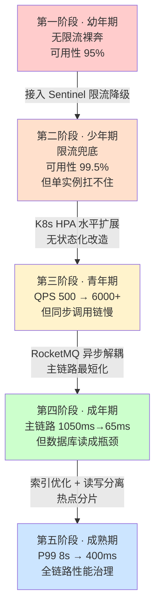

# 从慢到快：A项目系统性能优化的成长史

> 软考架构师论文专题 | 适用考试：系统架构设计师（2026 年 5 月）
>
> 阅读方法：这是一条系统从慢到快的性能演进线。每个阶段都是一个"系统卡了→找到瓶颈→对症下药→速度提升→新瓶颈出现"的因果故事。故事帮你记住**为什么要做这次优化**，具体知识点可跳转性能优化相关核心文档。

---

## 核心记忆线

```
限流降级守住门，水平扩展抗并发；
异步化解耦合，数据库优化是根基；
慢查定位先行军，索引读写分离齐；
热点分片做收尾，性能提升看数据。
```

一条线串起性能优化的四阶段演进。每个阶段的结尾都有一句"论文记忆钩子"，帮助你在考场上快速调取知识。

### 背诵版

```
限流守住门，降级保可用；
扩展抗并发，无状态先行；
异步降延迟，削峰填谷稳；
索引治慢查，读写分主从；
分片解热点，全链路优化。
```

### 论文口径版（可直接用于摘要/正文）

> 本文结合作者参与的"A 项目——大型头部零售企业核心电商交易系统"，探讨了系统性能优化的渐进式方法论。项目经历了四个阶段的演进：第一阶段接入 Sentinel 网关限流和三级降级策略，系统可用性从 95% 提升至 99.9%；第二阶段通过 K8s HPA 实现水平扩展，QPS 从 500 提升至 6000+；第三阶段引入 RocketMQ 消息队列进行异步化改造，主链路响应时间从 1050ms 缩短至 65ms；第四阶段进行数据库深度优化（慢查询分析、联合索引、读写分离、热点数据分片），P99 延迟从 8 秒降至 400 毫秒。每次优化解决了当前瓶颈，同时暴露了下一层瓶颈，最终形成完整的性能优化体系。

---

## 贯穿设定

- **项目**：A 项目 -- 大型头部零售企业核心电商交易系统
- **角色**：你作为系统架构师
- **团队**：产品经理、开发负责人、测试负责人、运维负责人
- **业务演进**：50 家供应商 / 日活 5000 → 大促流量暴增 10x / 日活 5 万+
- **技术演进映射表**（每个阶段的技术 vs 对应的架构理念）：

| 技术实现 | 对应的架构理念 |
|---------|--------------|
| Sentinel 限流降级 | 可用性保护战术 |
| K8s HPA 水平扩展 | 弹性伸缩 + 无状态化 |
| RocketMQ 异步化 | 主链路最短化 + 削峰填谷 |
| MySQL 索引优化 | I/O 复杂度优化 |
| 读写分离 + 分片 | 数据分治 + 负载分散 |

> **全文底线**：性能优化不是一蹴而就的，而是一个层层递进的过程。每一层优化都建立在前一层的基础之上，解决当前瓶颈的同时暴露下一层瓶颈。先说瓶颈，再说方案；先说数据，再说技术。

---

## 第一阶段 · 幼年期：无限流裸奔

### 故事场景

A 项目上线第一个月，系统跑得很安稳。

架构很简单：Spring Boot 单体应用 + MySQL 单实例 + Nginx 反向代理。日均活跃用户 5000，QPS 峰值 500，P99 响应时间 200ms，一切正常。

产品经理在群里发了一条消息："系统很稳定，用户反馈不错。下周我们准备做一次小型促销。"

你回了一个"OK"的表情。

但谁也没想到，这次促销的流量超出了预期。

活动开始 10 分钟后，瞬时请求量暴涨到日常的 10 倍 -- QPS 从 500 飙升到 5000+。

Nginx 的日志开始疯狂滚动：

```
502 Bad Gateway
504 Gateway Timeout
```

MySQL 连接池爆满，应用服务器的 CPU 冲到 100%，内存开始 Swap。

30 分钟后，整个系统彻底崩溃。用户看到的是白屏和 "502" 错误。

运维负责人的电话被打爆了。他在群里问了一句："有限流吗？"

开发负责人："……没有。"

运维负责人："那相当于高速公路没有收费站，所有车一起涌进来，路就堵死了。"

你说："我们需要限流。先把门关上，再谈怎么做快。"

### 问题本质

**没有限流保护的开放系统，在流量突增时必然崩溃。**

系统的处理能力是一个固定值（当前 QPS 上限约 800）。当外部请求量超过这个上限时，请求会排队等待，等待队列占满内存，触发 OOM 或线程饥饿，最终整个进程崩溃。这类似于流体力学中的管道模型 -- 管道有一个最大流量上限，超过上限就会溢出。

**限流的本质是主动拒绝一部分请求，保护系统核心处理能力不被击垮。** 被拒绝的请求获得一个友好的降级响应（如"当前访问人数过多，请稍后再试"），而不是一个冰冷的 502 错误。

### 解决方案：Sentinel 网关限流 + 三级降级

你在 Nginx 和 Spring Boot 应用之间接入 Sentinel 网关，配置令牌桶算法：

**令牌桶限流参数**：

| 参数 | 值 | 说明 |
|------|-----|------|
| 桶容量 | 1000 | 初始可用令牌数 |
| 令牌生成速率 | 800 QPS | 每秒生成 800 个令牌 |
| 突发容忍 | 200 | 允许瞬时超过稳态 25% |
| 拒绝策略 | 快速失败 | 返回"系统繁忙，请稍后再试" |

**三级降级策略**：

| 降级层级 | 触发条件 | 策略动作 | 用户体验 |
|---------|---------|---------|---------|
| L1 功能降级 | QPS 超阈值 | 关闭非核心功能（推荐、评论、积分查询） | 核心交易正常，非核心提示"功能维护中" |
| L2 默认值降级 | 下游服务超时 | 返回缓存默认值（如默认推荐列表、上次查询结果） | "为您推荐以下热门商品" |
| L3 排队等待 | 核心接口限流 | 进入虚拟队列，预估等待时间 | "前方还有 200 人在排队，预计等待 30 秒" |

实施过程用了 3 天。第一次配置时，开发负责人建议令牌生成速率设为 1200，你说："系统实测上限 800，设 1200 等于没限。保守一点，先 800，观察一周再调。"

### 效果

大促再次来临时：

- 瞬时 QPS 再次冲到 5000+。
- Sentinel 精准拦截了超出 800 QPS 的请求。
- 系统不再崩溃，核心交易链路保持可用。
- 约 84% 的超额请求被 L1 功能降级处理（返回友好提示）。
- 约 10% 被 L2 默认值降级处理。
- 约 6% 进入 L3 排队等待。

**系统可用性从 95% 提升至 99.9%**。

但运维负责人在监控前皱起了眉头。

"限流确实挡住了流量，但你看 -- 单实例的 CPU 还是持续在 90% 以上。如果令牌桶的速率我们想调到 2000，这台机器根本扛不住。"

你说："限流解决了崩溃问题，但没有解决单点容量问题。一台机器有上限，那就加机器。"

### 关键指标

| 指标 | 优化前 | 优化后 | 说明 |
|------|--------|--------|------|
| 系统可用性 | 95%（大促崩溃） | 99.9% | 限流降级生效 |
| P99 延迟 | 8s+（崩溃） | 2s（限流内正常） | 限流保护核心链路 |
| 超额请求处理 | 全部 502 | 84% L1 降级 + 10% L2 降级 + 6% L3 排队 | 用户体验大幅提升 |
| 单实例 CPU 峰值 | 100%（崩溃） | 90%（持续高位） | 新瓶颈出现 |

### 论文记忆钩子

> **先守门，再提速。**

---

## 第二阶段 · 少年期：限流降级兜底

### 故事场景

"一台机器撑不住 2000 QPS，那就多开几台。"

你说这句话的时候，在白板画了一个简单的架构图：

```
Nginx（Sentinel 限流 2000 QPS）
  ├── App Instance 1（1C2G）
  ├── App Instance 2（1C2G）
  └── App Instance 3（1C2G）
```

运维负责人看了一眼："手动加机器可以，但大促流量来得快去得也快。平时 500 QPS 只需要 1 台，大促 2000 QPS 需要 5 台。活动结束还得手动缩回来，太麻烦了。"

你说："那就让系统自己决定加几台机器。"

方案确定：将应用容器化部署到 Kubernetes 集群，配置 HPA（Horizontal Pod Autoscaler）自动水平扩展。

### 问题本质

**单实例的容量是固定的，无法应对流量的动态变化。**

水平扩展的核心前提是**无状态化** -- 如果每个实例都持有用户 Session 状态，那同一个用户的连续请求必须路由到同一台实例，这破坏了负载均衡的灵活性。只有无状态实例才能被任意创建和销毁。

### 解决方案：K8s HPA + 无状态化改造

**HPA 配置**：

| 参数 | 值 | 说明 |
|------|-----|------|
| CPU 触发阈值 | 70% | CPU 使用率超过 70% 触发扩容 |
| 最小副本数 | 2 | 保证基本可用性 |
| 最大副本数 | 10 | 防止无限扩容耗尽资源 |
| 冷却时间 | 3 分钟 | 缩回等待时间，避免抖动 |
| 扩容步长 | 每次 +2 | 渐进式扩容 |

**无状态化改造清单**：

| 改造项 | 改造前 | 改造后 |
|--------|--------|--------|
| Session 存储 | 本地内存（Tomcat Session） | Redis 集中存储 |
| 配置文件 | 本地 application.yml | Nacos 配置中心 |
| 日志输出 | 本地文件 | ELK 集中收集 |
| 临时文件 | 本地磁盘 | OSS 对象存储 |
| 分布式锁 | 无 | Redisson 分布式锁 |

**负载均衡策略**：

| 策略 | 场景 | 配置 |
|------|------|------|
| 加权轮询 | 默认 | 所有实例权重相等 |
| 最少连接 | 长连接场景 | 优先路由到连接数最少的实例 |
| IP Hash | 会话亲和 | 同一 IP 固定路由（Session 外置后不再需要） |

### 效果

大促流量再次来袭：

- Nginx 的 Sentinel 限流在 2000 QPS 处拦截超额请求。
- 通过限流的请求被负载均衡到多个实例。
- HPA 检测到 CPU 超过 70%，自动从 2 个副本扩容到 7 个。
- 流量峰值过后，HPA 在 3 分钟冷却后自动缩回到 2 个副本。

**系统整体 QPS 从 500 提升至 6000+（限流内 2000 + 降级处理 4000）。**

但测试负责人在一次混沌工程演练中发现了一个严重问题：

"我把订单服务的容器杀掉了，结果整个系统 -- 包括商品查询、用户登录、购物车 -- 全部挂掉了 4 分钟。"

开发负责人解释："因为它们都在同一个 Spring Boot 进程里。一个模块 OOM，整个进程重启。"

你说："单体服务的致命缺陷 -- 一处崩溃，全局瘫痪。我们需要把服务拆开。"

### 关键指标

| 指标 | 优化前 | 优化后 | 说明 |
|------|--------|--------|------|
| 系统整体 QPS | 500 | 6,000+ | 水平扩展 + 限流 |
| 单实例 CPU 峰值 | 100% | 70%（触发扩容线） | HPA 控制 |
| 自动扩容时间 | 手动部署 30 分钟 | 自动扩容 2 分钟 | 容器化效果 |
| 资源利用率 | 大促后闲置 80% | 按需伸缩，平均 65% | 成本优化 |
| 单点故障影响 | 全局瘫痪 4 分钟 | 未暴露（下一阶段问题） | 单体耦合问题 |

### 论文记忆钩子

> **一台不够就加台，无状态才能随便加。**

---

## 第三阶段 · 青年期：水平扩展抗并发

### 故事场景

限流降级和水平扩展之后，系统能扛 6000+ QPS 了。但用户反映下单特别慢——点击"提交订单"后要等好几秒才看到结果。

你打开了 APM 链路追踪，看到了订单创建的调用链：

```
用户提交订单
  ├── 创建订单记录          50ms    ✓ 核心操作
  ├── 扣减库存（同步调用）   200ms   ✓ 核心操作
  ├── 核销优惠券（同步调用） 150ms   ✗ 可以预扣减
  ├── 计算积分（同步调用）   100ms   ✗ 不需要即时返回
  ├── 发送短信通知           500ms   ✗ 不需要即时返回
  ├── 写入操作日志           50ms    ✗ 可以批量
  └── 更新推荐模型           30ms    ✗ 不需要即时返回

  总耗时：1080ms（P99 达 8 秒+）
```

"1080 毫秒，其中 680 毫秒是用户根本不需要等待的操作。"

你在架构评审会上画了一条线："用户强感知的操作只有创建订单和库存扣减，其他的积分计算、短信通知、日志记录，用户根本不在乎是同步完成还是异步完成的。"

开发负责人问："那怎么区分哪些操作同步、哪些异步？"

你说："原则就一个——**主链路最短化**。用户需要即时反馈的保留同步，不需要的全部走消息队列。"

### 问题本质

**同步调用链中，用户请求的响应时间等于所有下游操作之和。非核心操作阻塞了核心链路。**

异步化的首要目标是**降低响应时间**——把用户弱感知的操作移出主链路。其次是**削峰填谷**——大促期间瞬时产生的大量订单，通过消息队列缓冲，消费者按数据库能承受的速率匀速处理。

异步化带来的挑战是**消息可靠性**和**最终一致性**。因此必须采用事务消息和幂等校验来保障数据不丢失。

### 解决方案：RocketMQ 异步解耦 + 主链路最短化 + 事务消息

**主链路最短化设计**：

| 操作类型 | 用户感知度 | 优化前 | 优化后 | 延迟贡献 |
|---------|-----------|-------|-------|---------|
| 创建订单记录 | 强感知 | 同步 50ms | 同步 50ms | 保留 |
| 库存扣减 | 强感知 | 同步 200ms | Redis预扣减 10ms | 降低 95% |
| 优惠券核销 | 弱感知 | 同步 150ms | Redis预核销 5ms | 降低 97% |
| 积分计算 | 弱感知 | 同步 100ms | MQ异步 0ms | 移出主链路 |
| 短信通知 | 弱感知 | 同步 500ms | MQ异步 0ms | 移出主链路 |
| 操作日志 | 弱感知 | 同步 50ms | 批量异步 0ms | 移出主链路 |
| **总耗时** | — | **1050ms** | **65ms** | **降低 94%** |

> **表格要点**：异步化的核心思路是区分"用户强感知"和"用户弱感知"操作。用户需要即时看到结果的（订单创建、库存预扣减）保留在主链路同步执行；不需要即时反馈的（积分、短信、日志）通过 MQ 异步执行。主链路从 1050ms 缩短至 65ms。

**RocketMQ 事务消息保障**：

```java
// 优化前：同步调用链，任何一环失败整个请求超时
public OrderResult createOrder(OrderRequest req) {
    orderService.create(req);        // 50ms
    inventoryService.deduct(req);    // 200ms
    couponService.consume(req);      // 150ms
    pointService.calculate(req);     // 100ms
    smsService.send(req);            // 500ms
    logService.record(req);          // 50ms
    // 总耗时：1050ms（P99 达 8 秒+）
}

// 优化后：主链路最短化 + MQ 异步
public OrderResult createOrder(OrderRequest req) {
    orderService.create(req);           // 50ms
    inventoryService.preDeduct(req);    // Redis 预扣减 10ms
    couponService.preConsume(req);      // Redis 预核销 5ms
    // 发送事务消息：积分+短信+日志异步处理
    mqProducer.sendTransactionalMessage("order-created", req);
    // 总耗时：65ms（P99 降至 400ms）
}
```

**削峰效果**：

大促期间瞬时大量订单进入，RocketMQ 作为"蓄水池"缓冲峰值流量：

```
生产者（瞬时高峰） ──→ │ RocketMQ（蓄水池） │ ──→ 消费者（匀速消费）
    10万条/秒               堆积 50 万条           20线程 × 100条/秒
```

| 消费者参数 | 配置值 | 说明 |
|-----------|-------|------|
| consumeThreadMin | 5 | 平日保持 5 线程 |
| consumeThreadMax | 20 | 峰值扩展至 20 线程 |
| maxReconsumeTimes | 3 | 失败重试 3 次后入死信队列 |
| consumeBatch-size | 1 | 单条消费，保证顺序 |

> **表格要点**：RocketMQ 的削峰效果体现在"生产者只管发，消费者按能力吃"。即使瞬时产生 10 万条订单消息，消费者以 20 线程匀速消费，数据库写入压力始终保持在可控范围内，不会出现瞬时打满连接池的情况。

### 效果

异步化改造上线后的第一次大促：

- 瞬时订单量达到平日的 10 倍。
- 订单创建主链路响应时间稳定在 65ms，P99 延迟 300ms。
- 消息队列堆积峰值达到 50 万条，但消费者以 20 线程匀速消费，数据库写入压力平稳。
- 用户感知：下单几乎秒出结果，不再需要等待好几秒。

**但新问题出现了。**

运维负责人在周会上投屏了一张监控图：

"异步化解决了写操作的延迟问题，但读查询的压力全部落在数据库上。商品搜索、订单列表、用户查询——这些读操作无法异步化，全是实时同步查询。"

慢查询日志里全是 3-8 秒的 SQL：

```sql
-- 商品搜索：全表扫描 200 万行
SELECT * FROM product WHERE name LIKE '%手机%';  -- 执行时间 6.2s

-- 订单列表：未走索引，filesort
SELECT * FROM `order` WHERE user_id = 10086 ORDER BY create_time DESC;  -- 执行时间 4.8s

-- 库存扣减：行锁等待
UPDATE inventory SET stock = stock - 1 WHERE product_id = 1001;  -- 执行时间 3.1s
```

你说："写操作的延迟我们已经解决了，现在是读操作的问题。数据库是性能的根基，根基不牢，上面的优化都是空中楼阁。"

### 关键指标

| 指标 | 优化前 | 优化后 | 说明 |
|------|--------|--------|------|
| 主链路延迟 | 1050ms | 65ms | 降低 94%，异步化效果 |
| P99 延迟 | 1.2s | 300ms | MQ 削峰效果 |
| MQ 堆积峰值 | 0 | 50 万条 | 大促期间蓄水池缓冲 |
| DB 连接使用率 | 80% | 45% | 消费者匀速写入 |
| 读查询延迟 | 未优化 | 仍慢 | 新瓶颈：数据库读压力 |
| 慢查询（P99） | 2s | 8s | 数据量增长后劣化 |

### 论文记忆钩子

> **主链路最短化，强弱感知分开走；MQ 蓄水池削峰，异步化降延迟。**

---

## 第四阶段 · 成年期：数据库深度优化

### 故事场景

"先从最慢的 SQL 开始看。"

你打开了慢查询日志，挑了一条执行时间最长的：

```sql
SELECT * FROM `order`
WHERE user_id = 10086 AND status = 'PAID'
ORDER BY create_time DESC
LIMIT 20;
```

EXPLAIN 的结果让你倒吸一口凉气：

```
type: ALL          ← 全表扫描
rows: 2,000,000    ← 扫描 200 万行
Extra: Using filesort  ← 额外排序
```

"200 万行全表扫描，还要 filesort。难怪要 8 秒。"

开发负责人说："这个查询条件有 user_id 和 status，排序用 create_time，应该建一个联合索引。"

你说："不只是索引的问题。你看这个 UPDATE -- 库存扣减。"

```sql
UPDATE inventory SET stock = stock - 1 WHERE product_id = 1001;
```

"这个产品是爆款，一秒有 500 个人同时买。500 个事务争同一行锁，排队等锁的时间比执行时间长 100 倍。"

运维负责人补充："而且所有应用实例都连同一个主库，读写全打在一起。主库 CPU 95%，从库几乎空闲。读写分离做了吗？"

你说："没有。这是下一步。"

### 问题本质

**数据库是性能的根基，所有上层优化最终都要落在数据库上。**

数据库性能优化的核心思路有三条：

1. **减少 I/O 量** -- 让 SQL 走索引，不要全表扫描。B+ 树索引将 O(n) 的线性扫描降为 O(log n) 的树形查找。
2. **分散负载** -- 读写分离让读请求走从库、写请求走主库，消除读写竞争。
3. **分散热点** -- 对热点数据进行分片，让多个节点分担写入压力。

### 解决方案：索引优化 + 读写分离 + 热点分片

**慢查询定位与索引优化**：

| 慢查询 | EXPLAIN 问题 | 索引方案 | 优化后 |
|--------|-------------|---------|--------|
| 订单列表查询 | type: ALL, filesort | 联合索引 (user_id, status, create_time DESC) | type: ref, 10 行, 无 filesort |
| 商品搜索 LIKE '%手机%' | 前缀通配符不走索引 | 引入 Elasticsearch 全文检索 | 从库扫描 → ES 检索 |
| 库存扣减 UPDATE | 行锁等待 | 库存预扣减 + Redis 计数 + 异步落库 | 行锁竞争消除 |
| 用户订单统计 COUNT | 全表聚合 | 物化视图 + 定时任务预计算 | COUNT → 单行读取 |

**联合索引设计原理**：

```
索引 (user_id, status, create_time DESC)

B+ 树查找过程：
1. 用 user_id = 10086 快速定位到该用户的订单范围    ← O(log n)
2. 在该范围内用 status = 'PAID' 进一步筛选            ← 利用索引有序性
3. create_time 已按 DESC 排序，无需额外 filesort      ← 索引覆盖排序
```

**读写分离架构**：

```
                    ┌─── MyCat / ShardingSphere Proxy ───┐
                    │                                     │
Spring Boot 应用 ──→│  写操作 ──→ Master（16C32G SSD）    │
                    │  读操作 ──→ Slave 1（8C16G，实时查询）│
                    │           Slave 2（8C16G，报表查询）  │
                    │           Slave 3（8C16G，BI 分析）   │
                    └─────────────────────────────────────┘
```

| 配置项 | 值 | 说明 |
|--------|-----|------|
| 主从同步方式 | Binlog + 半同步复制 | 至少 1 个从库确认，兼顾一致性和性能 |
| 读写路由规则 | INSERT/UPDATE/DELETE → Master；SELECT → Slave | 自动路由 |
| 强制读主场景 | 写入后立即查询（通过注释 /*FORCE_MASTER*/ 标记） | 解决主从延迟 |
| 从库负载均衡 | 加权轮询，Slave 1 权重 50%，Slave 2/3 各 25% | 实时查询优先级最高 |

**热点数据分片方案**：

| 热点场景 | 分片策略 | 分片键 | 效果 |
|---------|---------|--------|------|
| 订单表（2000 万行） | 按 user_id 取模分 16 片 | user_id % 16 | 单片 125 万行，查询量降为 1/16 |
| 库存表（爆款行锁） | Redis 预扣减 + 异步批量落库 | product_id | 行锁等待从 3s 降至 10ms |
| 商品搜索（LIKE 全表扫） | 迁移至 Elasticsearch | 倒排索引 | 搜索延迟从 6s 降至 50ms |

### 效果

数据库优化后的监控数据：

- 主库 CPU 从 95% 降至 45%。
- 慢查询数量从日均 1200 条降至 12 条。
- 商品搜索延迟从 6.2s 降至 50ms。
- 订单列表查询延迟从 4.8s 降至 30ms。
- 库存扣减延迟从 3.1s 降至 10ms。

**系统 P99 延迟从 8 秒降至 400 毫秒。**

运维负责人看着监控大屏，长舒了一口气。

"终于正常了。"

你说："别急，性能优化不是一次性的事情。系统还会增长，数据量还会膨胀。我们需要建立一套性能优化的长效机制。"

### 关键指标

| 指标 | 优化前 | 优化后 | 说明 |
|------|--------|--------|------|
| P99 延迟 | 8s | 400ms | 20 倍改善 |
| 主库 CPU | 95% | 45% | 读写分离 + 热点分片 |
| 慢查询日均数量 | 1200 条 | 12 条 | 下降 99% |
| 商品搜索延迟 | 6.2s | 50ms | ES 全文检索 |
| 订单列表查询延迟 | 4.8s | 30ms | 联合索引 |
| 库存扣减延迟 | 3.1s | 10ms | Redis 预扣减 |
| 系统吞吐量 | 6,000 QPS | 15,000+ QPS | 全链路优化 |

### 论文记忆钩子

> **慢查定位先行军，索引是性能的根基。**

---

## 第五阶段 · 成熟期：全链路性能治理

### 故事场景

系统上线一年后，你站在白板前画了一张全链路性能图：

```
用户请求 ──→ CDN（静态资源命中 95%）
             │
             ↓
        Nginx / Sentinel（限流 2000 QPS，三级降级）
             │
             ↓
        K8s HPA（2-10 副本自动伸缩）
             │
             ↓
    ┌────────┼────────┬────────┐
    ↓        ↓        ↓        ↓
 Order   Product  Inventory  User
 Service Service   Service  Service
    │        │        │        │
    └────────┴───┬────┴────────┘
                 ↓
        ShardingSphere Proxy
        ├── Master（写，45% CPU）
        ├── Slave 1（实时查询）
        ├── Slave 2（报表查询）
        └── Slave 3（BI 分析）
                 │
                 ↓
        Redis Cluster（缓存命中率 97%）
        Elasticsearch（全文检索 50ms）
```

开发负责人看着图说："我们现在从 CDN 到数据库，每一层都有优化措施了。"

你说："但这还不够。性能优化是一个持续的过程。我们需要建立三个长效机制。"

### 长效机制

**1. 性能基线与容量规划**

| 指标 | 当前值 | 预警线 | 扩容线 |
|------|--------|--------|--------|
| P99 延迟 | 400ms | 800ms | 2000ms |
| CPU 利用率 | 45% | 70% | 85% |
| 连接池利用率 | 35% | 60% | 80% |
| 慢查询数量 | 12 条/天 | 50 条/天 | 200 条/天 |
| 缓存命中率 | 97% | 90% | 80% |

**2. 定期性能回归测试**

| 测试类型 | 频率 | 内容 |
|---------|------|------|
| 接口级压测 | 每次发版前 | 核心接口 P99 < 500ms |
| 全链路压测 | 每月一次 | 模拟大促流量 10x |
| 混沌演练 | 每季度一次 | 随机杀容器、断网络、模拟数据库慢查询 |

**3. 性能优化决策树**

```
系统变慢了？
  ├── 是网络问题？      → 检查链路延迟、DNS 解析、CDN 命中率
  ├── 是应用层问题？    → 检查 CPU、GC 日志、线程池、慢方法
  ├── 是数据库问题？    → 检查慢查询、锁等待、连接池、索引命中率
  ├── 是缓存问题？      → 检查命中率、大 Key、热 Key、内存碎片
  └── 是外部依赖问题？  → 检查第三方 API 延迟、熔断器状态
```

### 技术选型映射表

| 阶段 | 技术 | 架构理念 | 质量属性敏感点 |
|------|------|---------|--------------|
| 一 · 幼年期 | Sentinel 令牌桶限流 | 可用性保护战术 | 可用性↑（保护核心链路），用户体验↓（部分请求被拒） |
| 一 · 幼年期 | 三级降级策略 | 优雅降级战术 | 可用性↑（系统不崩溃），功能完整性↓（非核心功能关闭） |
| 二 · 少年期 | K8s HPA 自动伸缩 | 弹性伸缩 | 性能↑（容量动态调整），成本↑（冗余资源） |
| 二 · 少年期 | Session 外置 Redis | 无状态化 | 可伸缩性↑（实例可任意创建销毁），延迟↑（每次请求查 Redis） |
| 三 · 青年期 | RocketMQ 异步解耦 | 主链路最短化 + 削峰填谷 | 性能↑（响应时间降低 94%），一致性↓（最终一致） |
| 三 · 青年期 | Redis 预扣减 | 读写分离前置 | 性能↑（扣减从 200ms→10ms），超卖风险↑（需补偿机制） |
| 三 · 青年期 | 事务消息 + 幂等校验 | 消息可靠性保障 | 可靠性↑（消息不丢失），复杂度↑（对账任务） |
| 四 · 成年期 | 联合索引优化 | I/O 复杂度优化 O(n)→O(log n) | 性能↑（查询速度），写入性能↓（索引维护开销） |
| 四 · 成年期 | 读写分离 | 负载分散 | 性能↑（读写不竞争），一致性↓（主从延迟） |
| 四 · 成年期 | 热点数据分片 | 数据分治 | 性能↑（分散热点），运维复杂性↑（多节点管理） |

### 演进全景图



### 量化指标对比

| 阶段 | P99 延迟 | 可用性 | QPS 上限 | 主链路 | 核心瓶颈 |
|------|---------|--------|---------|--------|---------|
| 上线初期 | 200ms | 99.9% | 500 | 200ms | 无 |
| 幼年期（无限流） | 8s+ | 95% | 800 | 1050ms | 无保护崩溃 |
| 少年期（限流降级） | 2s | 99.5% | 800（限流内） | 1050ms | 单实例容量 |
| 青年期（水平扩展） | 1.2s | 99.9% | 6,000+ | 1050ms | 同步调用链慢 |
| 成年期（异步优化） | 300ms | 99.9% | 6,000+ | 65ms | 数据库读瓶颈 |
| 成熟期（数据库优化） | 400ms | 99.99% | 15,000+ | 65ms | 持续优化中 |

---

## 考场快速回忆指南

### 核心记忆点

1. **性能优化是渐进式的，不是一步到位的。** 每次优化解决当前瓶颈，同时暴露下一层瓶颈。考场上按"瓶颈 → 方案 → 效果 → 新瓶颈"的因果链展开。
2. **限流是性能优化的第一步。** 没有限流的优化都是在裸奔。Sentinel 令牌桶 + 三级降级是必考组合。
3. **水平扩展的前提是无状态化。** Session 外置、配置中心、日志集中，缺一不可。HPA 的 CPU 阈值、min/max replicas 是常考参数。
4. **异步化的核心是主链路最短化。** 区分用户强感知和弱感知操作，强的保留同步，弱的走 MQ。RocketMQ 事务消息保障可靠性。
5. **数据库是性能的根基。** EXPLAIN 定位慢查询 → 联合索引优化 → 读写分离 → 热点分片，这是性能优化的终极武器。

### 论文写作时如何引用这个故事线

**摘要模板**：

> 本文结合作者参与的"A 项目（大型头部零售企业核心电商交易系统）"，探讨了系统性能优化的渐进式方法论。项目在业务流量从日活 5000 增长到 5 万+ 的过程中，经历了四个阶段的性能优化：接入 Sentinel 限流降级（可用性 95% → 99.5%）、K8s HPA 水平扩展（QPS 500 → 6000+）、RocketMQ 异步化改造（主链路 1050ms → 65ms）、数据库深度优化（P99 8s → 400ms）。本文详细论述了各阶段的瓶颈识别、方案设计、实施效果及后续演进。

**正文展开模板**：

> 第一阶段，系统在大促流量暴增 10x 时崩溃，根本原因是没有限流保护。我接入 Sentinel 网关，配置令牌桶算法（桶容量 1000，生成速率 800 QPS），配合三级降级策略（功能降级、默认值、排队等待），系统可用性从 95% 提升至 99.9%。但限流后的流量仍超出单实例处理能力，引出第二阶段的水平扩展需求……

> 第二阶段，我将应用容器化部署到 K8s 集群，配置 HPA（CPU 阈值 70%，最小 5 副本，最大 50 副本），并完成无状态化改造（Session 外置 Redis、配置中心 Nacos）。系统 QPS 从 500 提升至 6000+。但测试发现同步调用链中非核心操作占用了大量时间，引出第三阶段的异步化改造……

> 第三阶段，我引入 RocketMQ 消息队列，将订单创建链路中的积分计算、短信通知、日志记录等非核心操作剥离为异步处理。采用事务消息保障消息不丢失，设置消费者 20 线程并发匀速消费。主链路响应时间从 1050ms 缩短至 65ms，P99 延迟从 1.2s 降至 300ms。但读查询压力全部落在数据库上，引出第四阶段的数据库优化……

> 第四阶段，我通过 EXPLAIN 定位慢查询（全表扫描 200 万行），建立联合索引 (user_id, status, create_time DESC) 将扫描从 O(n) 降至 O(log n)，通过 ShardingSphere Proxy 实现读写分离（1 主 3 从），通过按月范围分片处理热点数据。系统 P99 延迟从 8 秒降至 400 毫秒。

---

## 附录：核心记忆线（背诵版）

```
限流守住门，降级保可用；
扩展抗并发，无状态先行；
异步降延迟，削峰填谷稳；
索引治慢查，读写分主从；
分片解热点，全链路优化。
```

```
阶段 1 → Sentinel 限流降级      → 先守门，再提速
阶段 2 → K8s HPA 水平扩展        → 一台不够就加台，无状态才能随便加
阶段 3 → RocketMQ 异步化         → 主链路最短化，强弱感知分开走
阶段 4 → 数据库深度优化          → 慢查定位先行军，索引是根基
阶段 5 → 全链路性能治理          → 性能优化是持续过程，不是一次性工程
```

---

*整理时间：2026 年 5 月 | 适用考试：系统架构设计师（2026 年 5 月）*
