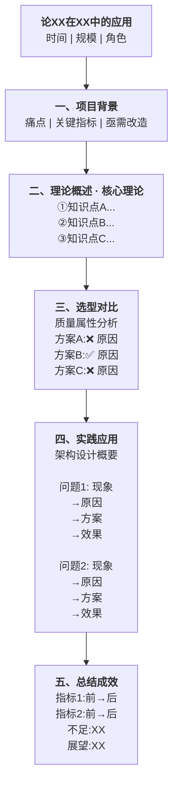

# 论文专题新主题文档创建规范

> 本文档定义了论文专题下新增主题文件夹（如 005-xxx、006-xxx）的目录结构和文档格式要求，后续新增主题请参考此规范执行。

---

## 一、目录结构

每个新主题使用 **三位数字编号 + 主题名称** 作为文件夹名，置于 `02-论文专题/` 目录下：

```
02-论文专题/
  001-云原生/
  002-测试/
  003-软件维护/
  004-SOA/
  005-{新主题名}/          ← 按此规范创建
    01-{主题名}核心知识点.md
    02-{主题名}论文写作框架.md
    03-{主题名}论文范文.md
```

每个主题文件夹内固定包含 **3 个 Markdown 文件**，按两位数字序号递增。

---

## 二、文档 01——核心知识点 (`01-{主题名}核心知识点.md`)

**用途**：技术参考资料，作为该主题的知识库。

### 必需结构

| 序号 | 章节 | 说明 |
|------|------|------|
| 标题 | `# {主题名}核心知识点` | 一级标题 |
| 副标题 | `> 整理自 Google Gemini 学习对话 \| 软考架构师论文专题` | 引用块 |
| 一 | 主题定义与重要性 | 定义、特征、核心原则 |
| 二~六+ | 技术深度内容 | 对比表格、架构图、代码片段、流程图、最佳实践等 |
| 倒数第二 | `## 软考高频考点总结` | 考点映射表 |
| 倒数第一 | `## 术语对照表` | 中英术语对照表 |
| 页脚 | `*整理时间：2026 年 4 月 \| 适用考试：系统架构设计师（2026 年 5 月）*` | 斜体 |

### 格式要求

- **对比表格**：大量使用 Markdown 表格进行技术对比（如 A vs B、优化前 vs 优化后）
- **架构图**：使用 ASCII 艺术图或 Mermaid 图
- **代码块**：使用带语言标记的代码块（java、yaml、sql、bash），展示"优化前"和"优化后"对比
- **架构师视角标注**：使用引用块 `> **架构师视角**：` 标注关键判断
- **Emoji**：章节标题可使用 Emoji 增强可读性

---

## 三、文档 02——论文写作框架 (`02-{主题名}论文写作框架.md`)

**用途**：考试论文写作指南，包含模板、示例和检查清单。

### 必需结构

| 序号 | 章节 | 说明 |
|------|------|------|
| 标题 | `# {主题名}论文写作框架` | 一级标题 |
| 副标题 | `> 软考架构师论文专题 \| 适用考试：系统架构设计师（2026 年 5 月）` | 引用块 |
| 零 | `## 零、审题方法论` | 三步审题法、题型拆解（可选，但推荐保留） |
| 一 | `## 一、论文结构公式` | 标准论文结构 + 字数分配表 |
| 二 | `## 二、摘要写作模板` | 摘要公式、模板、2 个领域示例 |
| 三 | `## 三、正文核心论点` | 核心论点 + 示例段落 |
| 四 | `## 四、论文题目建议` | 推荐题目表格 |
| 五 | `## 五、量化指标参考` | 优化前/后指标对比表 |
| 六 | `## 六、难点与应对策略` | 难点场景 + 论文可用表述 |
| 七 | `## 七、反思与展望` | 反思方向 + 示例段落 |
| 八 | `## 八、论文写作 Checklist` | 写作前/中/后检查清单 |
| 附加 | `## 高分论文特征` / `## 考试时间分配` | 评分标准、时间管理表 |
| 页脚 | 统一页脚格式 | 斜体 |

### 通用公式（必须包含）

**摘要公式**：
```
项目背景 + 面临困境 + 技术方案 + 实施效果
```

**标准论文结构**（字数分配表必须包含）：
```
摘要 (300 字) → 背景与问题 (500 字) → 核心技术方案 (800 字) → 实施细节 (600 字) → 效果与总结 (400 字)
```

---

## 四、文档 03——论文范文 (`03-{主题名}论文范文.md`)

**用途**：完整的示范论文，展示写作框架的实际应用。

### 必需结构

| 序号 | 章节 | 说明 |
|------|------|------|
| 标题 | `# 某{描述词}{项目类型}的{动作}实践` | 项目描述型标题 |
| 副标题 | `> 软考架构师论文范文 \| {主题名}专题 \| 2026 年 4 月` | 引用块 |
| 摘要 | `## 摘要` | 2-3 段：背景、方案、成果 |
| 关键词 | `**关键词**：` | 分号分隔 |
| 一 | `## 一、项目背景与现状` | 含 1.1 项目概况、1.2 旧系统问题、1.3 业务影响 |
| 二 | `## 二、{技术}方案设计` 或 `## 二、架构选型与{主题名}论证` | 选型论证 |
| 三~五 | 技术实现细节 | 含代码、YAML、SQL、架构图 |
| 末节 | `## 总结与反思` 或 `## 运行效果评价与反思` | 成果、经验教训、未来方向、架构师感悟 |
| 附录 | `## 术语对照表` | 中英术语对照 |
| 页脚 | 统一页脚格式 | 斜体，可附字数说明 |

### 内容约定

- **项目代号**：统一使用"A 项目"，如"某大型头部零售企业的核心电商交易系统"
- **角色定位**：始终以"系统架构师"身份，负责"技术选型"、"架构设计"、"核心方案决策与落地"
- **量化要求**：所有效果必须有具体数字，如"P99 延迟从 5s+ 降至 150ms"、"MTTR 从 4 小时降至 30 分钟"
- **字数要求**：目标 2000-2500 字（SOA 类可扩展至 2500-3000 字）
- **表格文字双表达**：每个表格下方必须追加一段 `> **表格要点**：` 引用块，用文字概括表格核心结论。考虑到实际考试时没有足够时间画表，这段文字描述可以直接用于考场作答。表格用于复习时系统学习，文字描述用于考场快速表达。

---

## 五、通用 Markdown 格式规范

### 标题层级

```
#           一级标题（文档标题）
## 一、      二级标题（中文数字编号：一、二、三...）
### 1.1      三级标题（阿拉伯数字编号：1.1, 1.2 或 (1), (2)）
####         四级标题（子子章节）
```

### 表格

- 每篇文档至少包含 10 个 Markdown 表格
- 常用类型：对比表、指标表、术语表、检查清单

### 代码块

```
带语言标记，展示"优化前" vs "优化后"对比
```

### 图

- 优先使用 Mermaid 图（流程图、时序图、状态图）
- 也可使用 ASCII 艺术图作为补充

### 引用块

- `> **架构师视角**：` 用于标注关键判断
- `> ` 用于引用考试题目或重点强调

### 分隔线

- `---` 用于主要章节之间

---

## 六、创建新主题的快速清单

- [ ] 创建文件夹 `005-{主题名}/`
- [ ] 创建 `01-{主题名}核心知识点.md`，包含必需结构和统一页脚
- [ ] 创建 `02-{主题名}论文写作框架.md`，包含摘要公式、结构公式和 Checklist
- [ ] 创建 `03-{主题名}论文范文.md`，包含完整示范论文和术语对照表
- [ ] 确认所有文档使用统一的副标题和页脚格式
- [ ] 确认标题层级遵循 `# → ## 一、 → ### 1.1 → ####` 规范
- [ ] 确认每篇文档至少包含 10 个表格
- [ ] 更新 `02-论文专题.md` 中的考点优先级表（如适用）
- [ ] 更新 `真题状态表.md`（如适用）

---

## 七、大纲记忆卡规范 (`00-大纲记忆卡.md`)

> 每个专题文件夹内新增一份大纲记忆卡，用于考前快速记忆论文脉络。
> 文件命名固定为 `00-大纲记忆卡.md`，置于主题文件夹最前面。

### 用途

将长篇论文浓缩为 **一页 Mermaid 可视化图**，从上到下垂直串联，方便考前 5 分钟快速回忆全文脉络、核心数据和考场注意事项。

### 必需结构

| 序号 | 章节 | 说明 |
|------|------|------|
| 标题 | `# {编号} {主题名} — 论文大纲记忆卡` | 如 `# 0001 软件架构风格 — 论文大纲记忆卡` |
| 元信息 | 引用块 | 对应范文文件名、论文标题、适用考题 |
| 一 | `## 论文脉络图` | Mermaid graph TD 从上到下垂直串联 |
| 二 | `## 实践因果链` | Mermaid flowchart LR 问题→原因→方案→效果 |
| 三 | `## 量化数据速记` | 简洁文字格式，一行 2-3 组数据 |
| 四 | `## 考场注意事项` | 3-5 条注意事项 |

### 格式要求

#### 1. 论文脉络图（Mermaid）

- 使用 `graph TD`（从上到下布局）
- **单列垂直排列**：标题 → 项目背景 → 理论概述 → 选型对比 → 实践应用 → 总结成效
- **不要左右分支**：每个节点只有一个子节点，依次串联
- 节点文本使用 `""` 双引号包裹
- 换行使用 `<br/>`（不要用 `\n`）
- 重点文字可用 `<b>加粗</b>` 标记

**结构模板：**



**注意事项：**
- 节点文本中避免使用 `|` 字符（mermaid 会误解析为表格分隔符）
- 不要用 `*`、`_` 等 markdown 符号在节点文本中，改用 `<b>` 标签
- 五大风格、四种维护类型等分类知识用 `①②③④⑤` 编号列出
- 每个问题/方案/效果用 `→` 连接形成因果链

#### 2. 实践因果链（Mermaid）

- 使用 `flowchart LR`（从左到右）
- 每个因果链用 `### 链名称` 小标题分隔
- 必须包含以下链（视论文内容增减）：

**架构选型链**（为什么选这个方案而不是其他）：


**CAP/理论权衡链**（质量敏感点分析）：


**问题因果链**（每个实践问题独立一条）：


#### 3. 量化数据速记

- **不用表格**，使用简洁文字格式
- 每行 2-3 组数据，用 `|` 分隔
- 格式：`指标名: 优化前 → **优化后**`
- 示例：
```
QPS: 500 → **6000+** | P99: 8s → **400ms** | 平均: 1.5s → **80ms**
可用性: 99.5% → **99.99%** | 主库CPU: 95% → **45%**
投诉: 200起/日 → **30起/日** | 缓存命中率: **95%+**
```

#### 4. 考场注意事项

- 使用 `- ⚠️` 前缀
- 3-5 条，不超过 5 条
- 内容包括：对应子问题、必写知识点、不要遗漏的点、不要写的点

### 创建新大纲卡的快速清单

- [ ] 文件命名为 `00-大纲记忆卡.md`，置于主题文件夹内
- [ ] 包含元信息（范文名、论文标题、适用考题）
- [ ] 论文脉络图使用 `graph TD` 从上到下垂直串联
- [ ] 实践因果链包含：架构选型链 + 理论权衡链 + 各问题因果链
- [ ] 量化数据使用简洁文字格式，不用表格
- [ ] 节点文本用 `""` 包裹，换行用 `<br/>`
- [ ] 考场注意事项 3-5 条
- [ ] 全文内容控制在一屏内可看完
