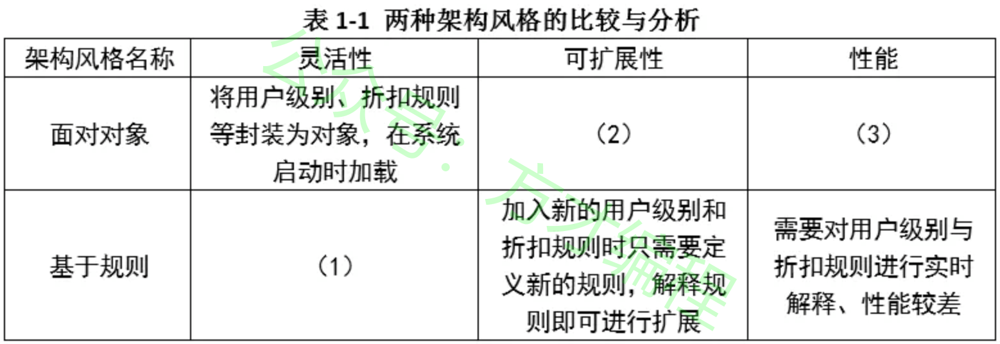
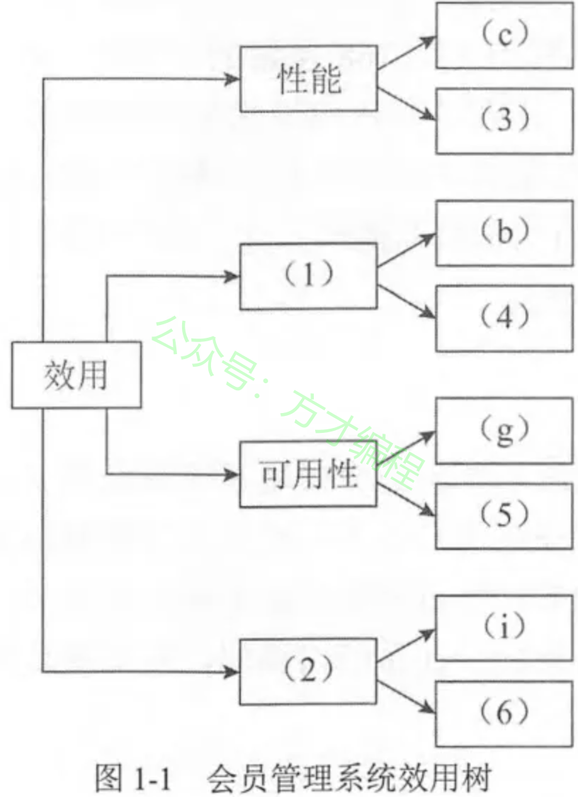
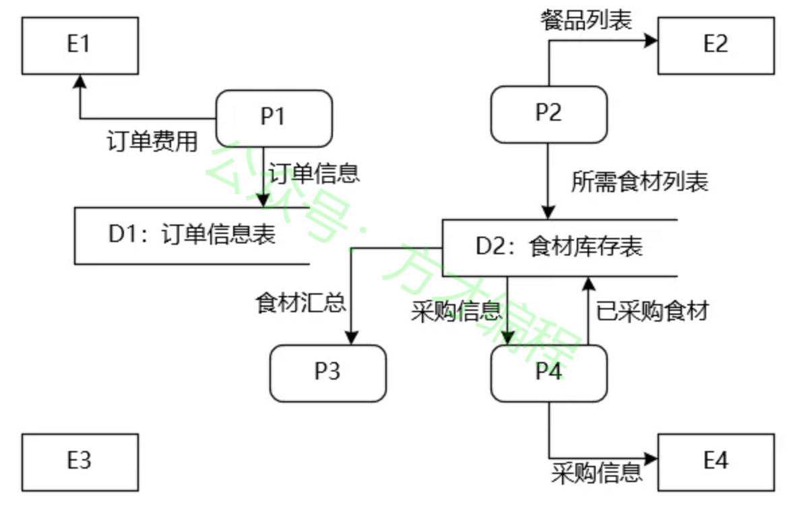
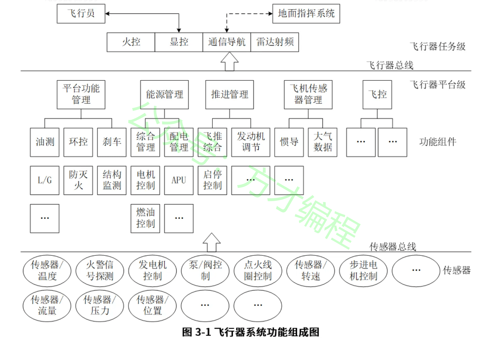
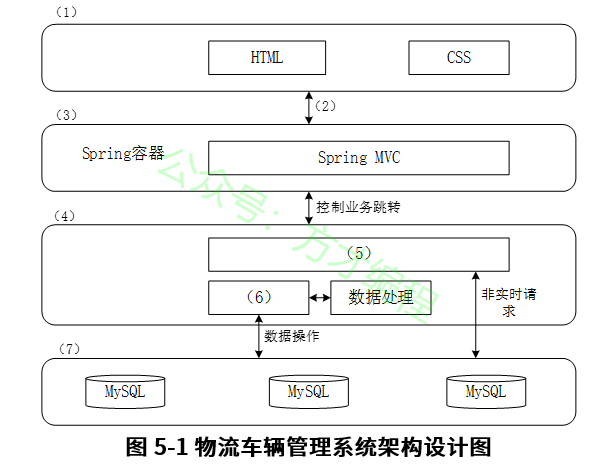

# 2019年11月 系统架构设计师 案例分析真题

> 来源：方才coding 软考真题

---

## 第1大题：软件架构设计与评估

### 试题1

阅读以下关于软件架构设计与评估的叙述，在答题纸上回答问题1和问题2。
【说明】
某电子商务公司为了更好地管理用户，提升企业销售业绩，拟开发一套用户管理系统。该系统的基本功能是根据用户的消费级别、消费历史、信用情况等指标将用户划分为不同的等级，并针对不同等级的用户提供相应的折扣方案 。在需求分析与架构设计阶段，电子商务公司提出的需求、质量属性描述和架构特性如下 ：
（a）用户目前分为普通用户、银卡用户、金卡用户和白金用户四个等级，后续需要能够根据消费情况进行动态调整；
（b）系统应该具备完善的安全防护措施，能够对黑客的攻击行为进行检测与防御；
（c）在正常负载情况下，系统应在0.5秒内对用户的商品查询请求进行响应；
（d）在各种节假日或公司活动中，针对所有级别用户，系统均能够根据用户实时的消费情况动态调整折扣力度；
（e）系统主站点断电后，应在5秒内将请求重定向到备用站点；
（f）系统支持中文昵称，但用户名要求必须以字母开头，长度不少于8个字符；
（g）当系统发生网络失效后，需要在15秒内发现错误并启用备用网络；
（h）系统在展示商品的实时视频时，需要保证视频画面具有1024×768像素的分辨率，40帧/秒的速率；
（i）系统要扩容时，应保证在10人月内完成所有的部署与测试工作；
（j）系统应对用户信息数据库的所有操作都进行完整记录；
（k）更改系统的Web界面接口必须在4人周内完成；
（l）系统必须提供远程调试接口，并支持远程调试 。
在对系统需求、质量属性描述和架构特性进行分析的基础上，该系统架构师给出了两种候选的架构设计方案，公司目前正在组织相关专家对系统架构进行评估。
问题 1
（13 分）针对用户级别与折扣规则管理功能的架构设计问题，李工建议采用面向对象的架构风格，而王工则建议采用基于规则的架构风格。请指出该系统更适合采用哪种架构风格，并从用户级别、折扣规则定义的灵活性、可扩展性和性能三个方面对这两种架构风格进行比较与分析，填写表1-1中的（1）~（3）空白处。

---
### 试题2

阅读以下关于软件架构设计与评估的叙述，在答题纸上回答问题1和问题2。
【说明】
某电子商务公司为了更好地管理用户，提升企业销售业绩，拟开发一套用户管理系统。该系统的基本功能是根据用户的消费级别、消费历史、信用情况等指标将用户划分为不同的等级，并针对不同等级的用户提供相应的折扣方案 。在需求分析与架构设计阶段，电子商务公司提出的需求、质量属性描述和架构特性如下 ：
（a）用户目前分为普通用户、银卡用户、金卡用户和白金用户四个等级，后续需要能够根据消费情况进行动态调整；
（b）系统应该具备完善的安全防护措施，能够对黑客的攻击行为进行检测与防御；
（c）在正常负载情况下，系统应在0.5秒内对用户的商品查询请求进行响应；
（d）在各种节假日或公司活动中，针对所有级别用户，系统均能够根据用户实时的消费情况动态调整折扣力度；
（e）系统主站点断电后，应在5秒内将请求重定向到备用站点；
（f）系统支持中文昵称，但用户名要求必须以字母开头，长度不少于8个字符；
（g）当系统发生网络失效后，需要在15秒内发现错误并启用备用网络；
（h）系统在展示商品的实时视频时，需要保证视频画面具有1024×768像素的分辨率，40帧/秒的速率；
（i）系统要扩容时，应保证在10人月内完成所有的部署与测试工作；
（j）系统应对用户信息数据库的所有操作都进行完整记录；
（k）更改系统的Web界面接口必须在4人周内完成；
（l）系统必须提供远程调试接口，并支持远程调试 。
在对系统需求、质量属性描述和架构特性进行分析的基础上，该系统架构师给出了两种候选的架构设计方案，公司目前正在组织相关专家对系统架构进行评估。
问题 2
（12 分）在架构评估过程中，质量属性效用树（utility tree）是对系统质量属性进行识别和优先级排序的重要工具。请将合适的质量属性名称填入图1-1中（1）、（2）空白处，并选择题干描述的（a）
（l）填入（3）
（6）空白处，完成该系统的效用树。

---

## 第2大题：系统建模与分析

### 试题3

阅读下列说明，回答问题1至问题3 ，将解答填入答题纸的对应栏内。
【说明】
某软件企业为快餐店开发一套在线订餐管理系统，主要功能包括：
（1）在线订餐：已注册客户通过网络在线选择快餐店所提供的餐品种类和数量后提交订单，系统显示订单费用供客户确认，客户确认后支付订单所列各项费用。
（2）厨房备餐：厨房接收到客户已付款订单后按照订单餐品列表选择各类食材进行餐品加工。
（3）食材采购：当快餐店某类食材低于特定数量时自动向供应商发起采购信息，包括食材类型和数量。供应商接收到采购信息后按照要求将食材送至快餐店并提交已采购的食材信息。系统自动更新食材库存 。
（4）生成报表：每个周末和月末，快餐店经理会自动收到系统生成的统计报表，报表中详细列出了本周或本月订单的统计信息以及库存食材的统计信息。现采用数据流图对上述订餐管理系统进行分析与设计，系统未完成的0层数据流图。如图2-1 所示。
问题 1
（8分）根据订餐管理系统功能说明，请在图2-1所示数据流图中给出外部实体E1
E4和加工P1
P4的具体名称。

---
### 试题4

阅读下列说明，回答问题1至问题3 ，将解答填入答题纸的对应栏内。
【说明】
某软件企业为快餐店开发一套在线订餐管理系统，主要功能包括：
（1）在线订餐：已注册客户通过网络在线选择快餐店所提供的餐品种类和数量后提交订单，系统显示订单费用供客户确认，客户确认后支付订单所列各项费用。
（2）厨房备餐：厨房接收到客户已付款订单后按照订单餐品列表选择各类食材进行餐品加工。
（3）食材采购：当快餐店某类食材低于特定数量时自动向供应商发起采购信息，包括食材类型和数量。供应商接收到采购信息后按照要求将食材送至快餐店并提交已采购的食材信息。系统自动更新食材库存 。
（4）生成报表：每个周末和月末，快餐店经理会自动收到系统生成的统计报表，报表中详细列出了本周或本月订单的统计信息以及库存食材的统计信息。现采用数据流图对上述订餐管理系统进行分析与设计，系统未完成的0层数据流图。如图2-1 所示。
问题 2
（8 分）根据数据流图规范和订餐管理系统功能说明，请说明在图2-1中需要补充哪些数据流可以构造出完整的0层数据流图。

---
### 试题5

阅读下列说明，回答问题1至问题3 ，将解答填入答题纸的对应栏内。
【说明】
某软件企业为快餐店开发一套在线订餐管理系统，主要功能包括：
（1）在线订餐：已注册客户通过网络在线选择快餐店所提供的餐品种类和数量后提交订单，系统显示订单费用供客户确认，客户确认后支付订单所列各项费用。
（2）厨房备餐：厨房接收到客户已付款订单后按照订单餐品列表选择各类食材进行餐品加工。
（3）食材采购：当快餐店某类食材低于特定数量时自动向供应商发起采购信息，包括食材类型和数量。供应商接收到采购信息后按照要求将食材送至快餐店并提交已采购的食材信息。系统自动更新食材库存 。
（4）生成报表：每个周末和月末，快餐店经理会自动收到系统生成的统计报表，报表中详细列出了本周或本月订单的统计信息以及库存食材的统计信息。现采用数据流图对上述订餐管理系统进行分析与设计，系统未完成的0层数据流图。如图2-1 所示。
问题 3
（9 分）根据数据流图的含义，请说明数据流图和系统流程图之间有哪些方面的区别。

---

## 第3大题：数据库与系统设计

### 试题6

阅读以下关于嵌入式系统开放式架构相关技术的描述，在答题纸上回答问题1至问题3。
【说明】
信息物理系统（Cyber Physical Systems，CPS）技术已成为未来宇航装备发展的重点关键技术之一。某公司长期从事嵌入式系统的研制工作 ，随着公司业务范围不断扩展，公司决定进入宇航装备的研制领域。为了做好前期准备，公司决定让王工程师负责编制公司进军宇航装备领域的战略规划。王工经调研和分析，认为未来宇航装备将向着网络化、智能化和综合化的目标发展，CPS 将会是宇航装备的核心技术，公司应构建基于CPS技术的新产品架构，实现超前的技术战略储备。
问题 1
（9 分）通常CPS结构分为感知层、网络层和控制层，请用300字以内文字说明CPS的定义，并简要说明各层的含义。

---
### 试题7

阅读以下关于嵌入式系统开放式架构相关技术的描述，在答题纸上回答问题1至问题3。
【说明】
信息物理系统（Cyber Physical Systems，CPS）技术已成为未来宇航装备发展的重点关键技术之一。某公司长期从事嵌入式系统的研制工作 ，随着公司业务范围不断扩展，公司决定进入宇航装备的研制领域。为了做好前期准备，公司决定让王工程师负责编制公司进军宇航装备领域的战略规划。王工经调研和分析，认为未来宇航装备将向着网络化、智能化和综合化的目标发展，CPS 将会是宇航装备的核心技术，公司应构建基于CPS技术的新产品架构，实现超前的技术战略储备。
问题 2
（10 分）王工在提交的战略规划中指出：飞行器中的电子设备是一个大型分布式系统，其传感器、控制器和采集器分布在飞机各个部位，相互间采用高速总线互连，实现子系统间的数据交换，而飞行员或地面指挥系统根据飞行数据的汇总决策飞行任务的执行。图3-1给出了飞行器系统功能组成图。
请参考图3-1给出的功能图，依据你所掌握的CPS知识，说明以下所列的功能分别属于CPS结构中的哪层，哪项功能不属于CPS任何一层。
1.飞行传感器管理
2.步进电机控制
3.显控
4.发电机控制
5.环控
6.配电管理
7.转速传感器
8.传感器总线
9.飞行员
10.火警信号探测

---
### 试题8

阅读以下关于嵌入式系统开放式架构相关技术的描述，在答题纸上回答问题1至问题3。
【说明】
信息物理系统（Cyber Physical Systems，CPS）技术已成为未来宇航装备发展的重点关键技术之一。某公司长期从事嵌入式系统的研制工作 ，随着公司业务范围不断扩展，公司决定进入宇航装备的研制领域。为了做好前期准备，公司决定让王工程师负责编制公司进军宇航装备领域的战略规划。王工经调研和分析，认为未来宇航装备将向着网络化、智能化和综合化的目标发展，CPS 将会是宇航装备的核心技术，公司应构建基于CPS技术的新产品架构，实现超前的技术战略储备。
问题 3
王工在提交的战略规划中指出：未来宇航领域装备将呈现网络化、智能化和综合化等特征，形成集群式的协同能力，安全性尤为重要。在宇航领域的CPS系统中，不同层面上都会存在一定的安全威胁。请用100字以内文字说明CPS系统会存在哪三类安全威胁，并对每类安全威胁至少举出两个例子说明。

---

## 第4大题：Web应用架构

### 试题9

阅读以下关于分布式数据库缓存设计的叙述，在答题纸上回答问题1至问题3。
【 说明 】
某初创企业的主营业务是为用户提供高度个性化的商品订购业务，其业务系统支持PC端、手机App等多种访问方式。系统上线后受到用户普遍欢迎，在线用户数和订单数量迅速增长，原有的关系数据库服务器不能满足高速并发的业务要求。
为了减轻数据库服务器的压力，该企业采用了分布式缓存系统，将应用系统经常使用的数据放置在内存，降低对数据库服务器的查询请求，提高了系统性能。在使用缓存系统的过程中，企业碰到了一系列技术问题。
问题 1
该系统使用过程中，由于同样的数据分别存在于数据库和缓存系统中，必然会造成数据同步或数据不一致性的问题。该企业团队为解决这个问题，提出了如下解决思路：应用程序读数据时，首先读缓存，当该数据不在缓存时，再读取数据库；应用程序写数据时，先写缓存，成功后再写数据库；或者先写数据库，再写缓存。
王工认为该解决思路并未解决数据同步或数据不一致性的问题，请用100字以内的文字解释其原因 。
王工给出了一种可以解决该问题的数据读写步骤如下 ：
读数据操作的基本步骤 ：
1.根据key读缓存；
2.读取成功则直接返回；
3.若key不在缓存中时，根据key（a）；
4.读取成功后，（b）；
5.成功返回 。
写数据操作的基本步骤 ：
1.根据key值写（c）；
2.成功后（d）；
3.成功返回。
请填写完善上述步骤中（a）~（d）处的空白内容。

---
### 试题10

阅读以下关于分布式数据库缓存设计的叙述，在答题纸上回答问题1至问题3。
【 说明 】
某初创企业的主营业务是为用户提供高度个性化的商品订购业务，其业务系统支持PC端、手机App等多种访问方式。系统上线后受到用户普遍欢迎，在线用户数和订单数量迅速增长，原有的关系数据库服务器不能满足高速并发的业务要求。
为了减轻数据库服务器的压力，该企业采用了分布式缓存系统，将应用系统经常使用的数据放置在内存，降低对数据库服务器的查询请求，提高了系统性能。在使用缓存系统的过程中，企业碰到了一系列技术问题。
问题 2
（8 分）缓存系统一般以key/value形式存储数据，在系统运维中发现，部分针对缓存的查询，未在缓存系统中找到对应的key，从而引发了大量对数据库服务器的查询请求，最严重时甚至导致了数据库服务器的宕机。
经过运维人员的深入分析，发现存在两种情况：
（1）用户请求的key值在系统中不存在时，会查询数据库系统，加大了数据库服务器的压力；
（2）系统运行期间，发生了黑客攻击，以大量系统不存在的随机key发起了查询请求，从而导致了数据库服务器的宕机 。经过研究，研发团队决定，当在数据库中也未查找到该key时，在缓存系统中为key设置空值，防止对数据库服务器发起重复查询 。
请用100字以内文字说明该设置空值方案存在的问题，并给出解决思路。

---
### 试题11

阅读以下关于分布式数据库缓存设计的叙述，在答题纸上回答问题1至问题3。
【 说明 】
某初创企业的主营业务是为用户提供高度个性化的商品订购业务，其业务系统支持PC端、手机App等多种访问方式。系统上线后受到用户普遍欢迎，在线用户数和订单数量迅速增长，原有的关系数据库服务器不能满足高速并发的业务要求。
为了减轻数据库服务器的压力，该企业采用了分布式缓存系统，将应用系统经常使用的数据放置在内存，降低对数据库服务器的查询请求，提高了系统性能。在使用缓存系统的过程中，企业碰到了一系列技术问题。
问题 3
（6 分）缓存系统中的key一般会存在有效期，超过有效期则key失效；有时也会根据LRU算法将某些key移出内存。当应用软件查询key时，如key失效或不在内存，会重新读取数据库，并更新缓存中的key。
运维团队发现在某些情况下，若大量的key设置了相同的失效时间，导致缓存在同一时刻众多key同时失效，或者瞬间产生对缓存系统不存在key的大量访问，或者缓存系统重启等原因，都会造成数据库服务器请求瞬时爆量，引起大量缓存更新操作，导致整个系统性能急剧下降，进而造成整个系统崩溃。请用100字以内文字，给出解决该问题的两种不同思路。

---

## 第5大题：嵌入式与实时系统

### 试题12

阅读以下关于Web系统架构设计的叙述，在答题纸上回答问题1至问题3。
【说明】
某公司拟开发一个物流车辆管理系统，该系统可支持各车辆实时位置监控、车辆历史轨迹管理、违规违章记录管理、车辆固定资产管理、随车备品及配件更换记录管理、车辆寿命管理等功能需求。其非功能性需求如下：
（1）系统应支持大于50个终端设备的并发请求；
（2）系统应能够实时识别车牌，识别时间应小于1s；
（3）系统应7×24小时工作；
（4）具有友好的用户界面；
（5）可抵御常见SQL注入攻击 ；
（6）独立事务操作响应时间应小于3s；
（7）系统在故障情况下，应在1小时内恢复；
（8）新用户学习使用系统的时间少于1小时 。
面对系统需求 ，公司召开项目组讨论会议，制订系统设计方案 ，最终决定基于分布式架构设计实现该物流车辆管理系统，应用Kafka、Redis数据缓存等技术实现对物流车辆自身数据、业务数据进行快速、高效的处理。
问题 1
（4分）请将上述非功能性需求（1）~（8）归类到性能、安全性、可用性、易用性这四类非功能性需求。

---
### 试题13

阅读以下关于Web系统架构设计的叙述，在答题纸上回答问题1至问题3。
【说明】
某公司拟开发一个物流车辆管理系统，该系统可支持各车辆实时位置监控、车辆历史轨迹管理、违规违章记录管理、车辆固定资产管理、随车备品及配件更换记录管理、车辆寿命管理等功能需求。其非功能性需求如下：
（1）系统应支持大于50个终端设备的并发请求；
（2）系统应能够实时识别车牌，识别时间应小于1s；
（3）系统应7×24小时工作；
（4）具有友好的用户界面；
（5）可抵御常见SQL注入攻击 ；
（6）独立事务操作响应时间应小于3s；
（7）系统在故障情况下，应在1小时内恢复；
（8）新用户学习使用系统的时间少于1小时 。
面对系统需求 ，公司召开项目组讨论会议，制订系统设计方案 ，最终决定基于分布式架构设计实现该物流车辆管理系统，应用Kafka、Redis数据缓存等技术实现对物流车辆自身数据、业务数据进行快速、高效的处理。
问题 2
（14 分）经项目组讨论，完成了该系统的分布式架构设计，如图5-1所示。请从下面给出的（a）
（j）中进行选择，补充完善图5-1中（1）
（7）处空白的内容。
（a）数据存储层
（b）Struct2
（c）负载均衡层
（d）表现层
（e）HTTP协议
（f）Redis数据缓存
（g）Kafka分发消息
（h）分布式通信处理层
（i）逻辑处理层
（j）CDN内容分发

---
### 试题14

阅读以下关于Web系统架构设计的叙述，在答题纸上回答问题1至问题3。
【说明】
某公司拟开发一个物流车辆管理系统，该系统可支持各车辆实时位置监控、车辆历史轨迹管理、违规违章记录管理、车辆固定资产管理、随车备品及配件更换记录管理、车辆寿命管理等功能需求。其非功能性需求如下：
（1）系统应支持大于50个终端设备的并发请求；
（2）系统应能够实时识别车牌，识别时间应小于1s；
（3）系统应7×24小时工作；
（4）具有友好的用户界面；
（5）可抵御常见SQL注入攻击 ；
（6）独立事务操作响应时间应小于3s；
（7）系统在故障情况下，应在1小时内恢复；
（8）新用户学习使用系统的时间少于1小时 。
面对系统需求 ，公司召开项目组讨论会议，制订系统设计方案 ，最终决定基于分布式架构设计实现该物流车辆管理系统，应用Kafka、Redis数据缓存等技术实现对物流车辆自身数据、业务数据进行快速、高效的处理。
问题 3
该物流车辆管理系统需抵御常见的SQL注入攻击，请用200字以内的文字说明什么是SQL注入攻击，并列举出两种抵御SQL注入攻击的方式。

---

## 附录：提取的图片

- `img_qr_5b2991402eee.png`：微信小程序二维码，已省略
- `img_exam_ac10203aa6cf.png`：第1大题第1小题架构图/表格图
- `img_logo_fb5107e4dc49.jpeg`：站点 Logo，已省略
- `img_exam_47fb6c868d27.png`：第1大题第2小题架构图/表格图
- `img_exam_8a165cedd0c1.png`：第2大题第1小题架构图/表格图
- `img_exam_5b1f4ad82e04.png`：第3大题第2小题架构图/表格图
- `img_exam_f6c9e2cd4f74.png`：第5大题第2小题架构图/表格图
