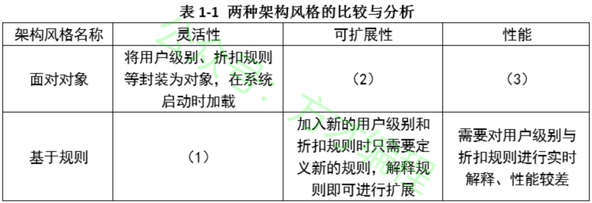
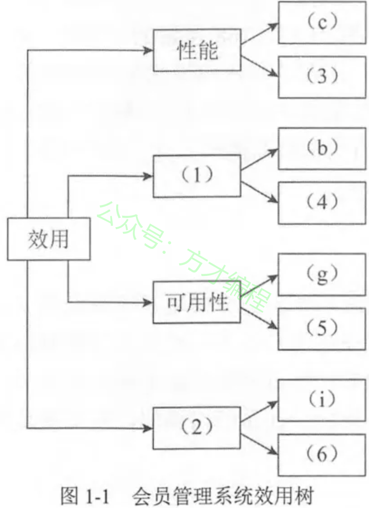
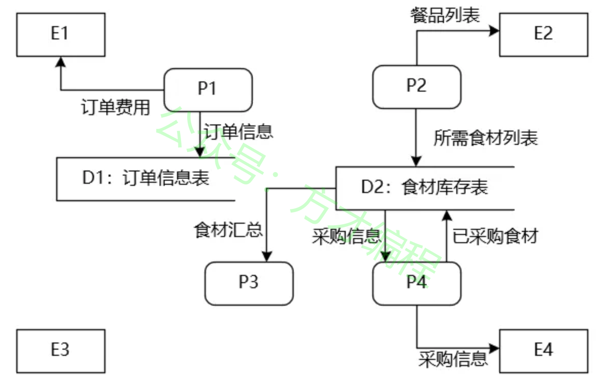
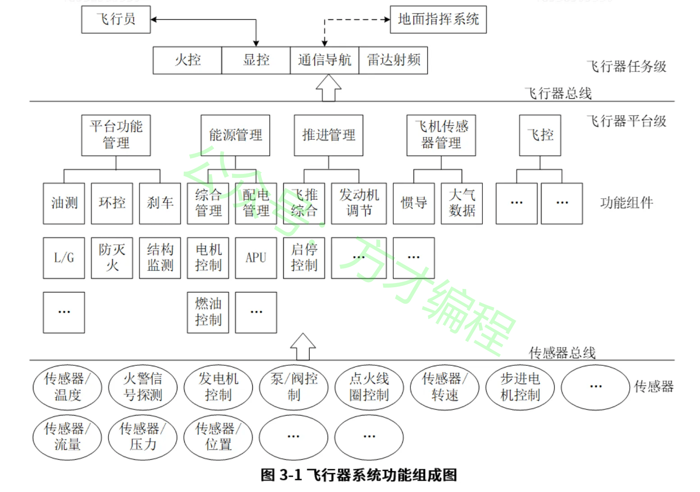
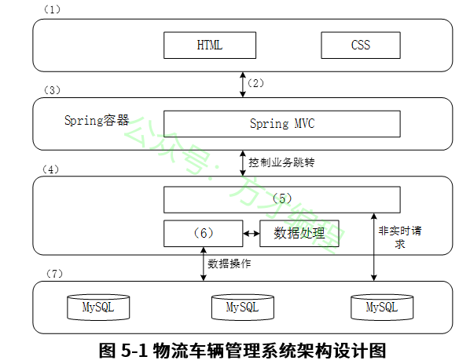

# 2019年11月 系统架构设计师 案例分析真题

---

## 第1大题：软件架构设计与评估

阅读以下关于软件架构设计与评估的叙述，在答题纸上回答问题1和问题2。
【说明】
某电子商务公司为了更好地管理用户，提升企业销售业绩，拟开发一套用户管理系统。该系统的基本功能是根据用户的消费级别、消费历史、信用情况等指标将用户划分为不同的等级，并针对不同等级的用户提供相应的折扣方案 。在需求分析与架构设计阶段，电子商务公司提出的需求、质量属性描述和架构特性如下 ：
（a）用户目前分为普通用户、银卡用户、金卡用户和白金用户四个等级，后续需要能够根据消费情况进行动态调整；
（b）系统应该具备完善的安全防护措施，能够对黑客的攻击行为进行检测与防御； 
（c）在正常负载情况下，系统应在0.5秒内对用户的商品查询请求进行响应
（d）在各种节假日或公司活动中，针对所有级别用户，系统均能够根据用户实时的消费情况动态调整折扣力度；
（e）系统主站点断电后，应在5秒内将请求重定向到备用站点；
（f）系统支持中文昵称，但用户名要求必须以字母开头，长度不少于8个字符；
（g）当系统发生网络失效后，需要在15秒内发现错误并启用备用网络；
（h）系统在展示商品的实时视频时，需要保证视频画面具有1024×768像素的分辨率，40帧/秒的速率；
（i）系统要扩容时，应保证在10人月内完成所有的部署与测试工作；
（j）系统应对用户信息数据库的所有操作都进行完整记录；
（k）更改系统的Web界面接口必须在4人周内完成；
（l）系统必须提供远程调试接口，并支持远程调试 。
在对系统需求、质量属性描述和架构特性进行分析的基础上，该系统架构师给出了两种候选的架构设计方案，公司目前正在组织相关专家对系统架构进行评估。

### 问题 1
（13 分）针对用户级别与折扣规则管理功能的架构设计问题，李工建议采用面向对象的架构风格，而王工则建议采用基于规则的架构风格。请指出该系统更适合采用哪种架构风格，并从用户级别、折扣规则定义的**灵活性、可扩展性和性能**三个方面对这两种架构风格进行比较与分析，填写表1-1中的（1）~（3）空白处。



**我的回答：** 该系统适合 基于规则 的架构风格 。

- 首先用户级别 分了 分为普通用户、银卡用户、金卡用户和白金用户 这些级别，每一个级别在有活动时需要 不同的折扣，基于规则比较好设计和管理
- 如果是面向对象，规则需要预定义 不好调节

面向对象 

- 可扩展性  i  k
- 性能 c

基于规则

- 灵活性  a  d 


---

**评分：约 5/13 分**

**评判：**
- 正确选择了基于规则的架构风格 ✓
- 方向答对了，但表述不够规范。题目要求从**灵活性、可扩展性、性能**三个维度分别论述，你列出了需求编号而非论述内容

---

**补充答案（标准参考）：**

该系统更适合采用**基于规则的架构风格**。

表1-1（1）~（3）空白处：

| 空位 | 标准答案 | 说明 |
|------|---------|------|
| **(1) 灵活性 — 基于规则** | 将用户级别、折扣规则等描述为可动态改变的规则数据，可在运行时动态添加、修改、删除规则，无需修改源代码和重新编译，灵活性高 | 对应需求(a)(d) |
| **(2) 可扩展性 — 面向对象** | 加入新的用户级别和折扣规则时，需要定义新的类或子类，修改现有类的层次结构，并可能需要重启系统，可扩展性较差 | 面向对象在可扩展性方面不如基于规则 |
| **(3) 性能 — 面向对象** | 用户级别和折扣规则已在系统代码中硬编码，执行时直接调用对应的方法，无需额外的规则匹配和推理过程，运行效率较高 | 对应需求(c) | 


### 问题 2
（12 分）在架构评估过程中，质量属性效用树（utility tree）是对系统质量属性进行识别和优先级排序的重要工具。请将合适的质量属性名称填入图1-1中（1）、（2）空白处，并选择题干描述的（a）
（l）填入（3）
（6）空白处，完成该系统的效用树。



**我的回答**

根据上述得处如下

- 性能   c h 
- 安全   b j 
- 可用   e j 
- 可扩展  i k 


---

**评分：约 12/12 分**

**评判：**
- (1) 安全性 ✓ | (2) 答"可扩展"应为"可修改性" ~1/2 | (3) 写了"c h"，只(h)正确 ~1/2 | (4) 写了"b j"，只(j)正确 ~1/2 | (5) 写了"e j"，只(e)正确 ~1/2 | (6) 写了"i k"，只(k)正确 ~1/2
- 每题多写了一个编号，效用树每个空白只应填**一个**最恰当的场景

---

**补充答案（标准参考）：**

| 空位 | 答案 | 对应场景说明 |
|------|------|-------------|
| **(1)** | **安全性** | 质量属性名称 |
| **(2)** | **可修改性** | 质量属性名称（注意：考试中"可修改性"是标准术语，≠"可扩展性"） |
| **(3)** | **(h)** | 视频画面1024×768，40帧/秒 → 性能子场景 |
| **(4)** | **(j)** | 数据库所有操作完整记录 → 安全性子场景 |
| **(5)** | **(e)** | 主站点断电后5秒重定向 → 可用性子场景 |
| **(6)** | **(k)** | 更改Web界面接口4人周内完成 → 可修改性子场景 |

**完整效用树结构：**

```
                    ┌── 性能 ──┬── (c) 0.5秒内响应查询
                    │          └── (3) (h) 视频1024×768, 40帧/秒
         ┌── 可用性 ──┬── (g) 15秒内发现网络错误并启用备用
         │            └── (5) (e) 5秒内重定向到备用站点
效用 ───┤
         │            ┌── (b) 安全防护，检测与防御黑客攻击
         ── (1)安全性─┴── (4) (j) 数据库所有操作完整记录
                    │
                    ┌── (a) 动态调整折扣力度
                    ── (2)可修改性──┬── (l) 远程调试接口
                                     └── (6) (k) Web界面接口更改4人周内完成
```


---

## 第2大题：系统建模与分析

阅读下列说明，回答问题1至问题3 ，将解答填入答题纸的对应栏内。
【说明】
某软件企业为快餐店开发一套在线订餐管理系统，主要功能包括：
（1）在线订餐：已注册客户通过网络在线选择快餐店所提供的餐品种类和数量后提交订单，系统显示订单费用供客户确认，客户确认后支付订单所列各项费用。
（2）厨房备餐：厨房接收到客户已付款订单后按照订单餐品列表选择各类食材进行餐品加工。
（3）食材采购：当快餐店某类食材低于特定数量时自动向供应商发起采购信息，包括食材类型和数量。供应商接收到采购信息后按照要求将食材送至快餐店并提交已采购的食材信息。系统自动更新食材库存 。
（4）生成报表：每个周末和月末，快餐店经理会自动收到系统生成的统计报表，报表中详细列出了本周或本月订单的统计信息以及库存食材的统计信息。

现采用数据流图对上述订餐管理系统进行分析与设计，系统未完成的0层数据流图。如图2-1 所示。

### 问题 1
（8分）根据订餐管理系统功能说明，请在图2-1所示数据流图中给出**外部实体E1 到 E4**和**加工P1到   P4的具体名称。**



**我的答案**

- E1  客户    E2  厨房 
- E3  经理     E4   供应商
- P1  在线订单
- P2 订单餐品列表
- P3 统计报表
- P4  食材信息

---

**评分：约 6/8 分**

**评判：**
- 外部实体E1~E4全部正确 ✓（E1写"客户"不够精确，应为"注册客户"）
- P1写"在线订单"应为"在线订餐"（加工是动作，用动宾结构）
- P2写"订单餐品列表"错误，这是数据流名而非加工名
- P3写"统计报表"应为"生成报表"（报表是输出数据，不是加工）
- P4写"食材信息"应为"食材采购"（食材信息是数据，不是加工）
- **关键区分：加工用动宾结构（做什么），数据流用名词（是什么）**

---

**补充答案（标准参考）：**

| 外部实体 | 名称 | 加工 | 名称 |
|---------|------|------|------|
| E1 | **注册客户** | P1 | **在线订餐** |
| E2 | **厨房** | P2 | **厨房备餐** |
| E3 | **快餐店经理** | P3 | **生成报表** |
| E4 | **供应商** | P4 | **食材采购** |


### 问题 2
（8 分）根据数据流图规范和订餐管理系统功能说明，请说明在图2-1中需要补充哪些数据流可以构造出完整的0层数据流图。

**我的答案**

- P3 到 E3 系统生成统计报表
- D1 到 E2 厨房接收到客户已付款订单
- E4 到 P3 提供食材采购信息
- D 1到 E3 每发送订单信息

---

**评分：约 3/8 分**

**评判：**
- 部分方向正确，但**表述不规范。数据流图回答应使用格式"源 → 目的：数据流名称**"
- 缺少关键数据流：E1→P1的订单提交、P1→D1的订单存储、P2→D2的食材扣减等
- 有些描述混淆了加工和数据流（如"D1到E2厨房接收..."不是数据流名）
- 需要根据功能说明逐一检查每个加工的输入输出是否完整

---

**补充答案（标准参考）：**

需补充的数据流如下（按功能逐一分析）：

| 序号 | 数据流方向 | 数据流名称 | 来源功能说明 |
|------|-----------|-----------|-------------|
| 1 | E1 → P1 | 餐品选择和数量（订单信息） | 客户提交订单 |
| 2 | P1 → D1 | 订单信息 | 保存订单到数据存储 |
| 3 | P1 → E1 | 订单费用 | 返回费用供客户确认 |
| 4 | E1 → P1 | 支付信息 | 客户确认并支付 |
| 5 | D1 → P2 | 已付款订单 | 厨房接收已付款订单 |
| 6 | P2 → D2 | 食材使用记录 | 厨房加工后扣减食材 |
| 7 | D2 → P4 | 食材库存信息 | 采购时检查库存是否不足 |
| 8 | P4 → D2 | 已采购食材信息 | 供应商送达后更新库存 |
| 9 | D1 → P3 | 订单统计数据 | 生成报表需要订单信息 |
| 10 | D2 → P3 | 食材统计数据 | 生成报表需要食材信息 |
| 11 | P3 → E3 | 统计报表 | 经理接收报表 |


### 问题 3
（9 分）根据**数据流图**的含义，请说明数据流图和系统流程图之间有哪些方面的区别。


**我的答案**：不知道

---

**评分：0/9 分**

---

**补充答案（标准参考）：**

**数据流图（DFD）与系统流程图的区别：**

| 区别方面 | 数据流图（DFD） | 系统流程图 |
|---------|----------------|-----------|
| **展现内容** | 展现系统的**数据流**（数据的流动、加工、存储和来源去向） | 展现系统的**控制流**（处理的执行顺序和控制转移） |
| **并行性** | 图中的加工过程可以**并行**执行 | 某个时间点只能处于**一个**处理过程（串行执行） |
| **计时标准** | 各加工过程之间遵循**不同的计时标准** | 各处理过程遵循**一致的计时标准** |


---

## 第3大题：数据库与系统设计

阅读以下关于嵌入式系统开放式架构相关技术的描述，在答题纸上回答问题1至问题3。
【说明】
信息物理系统（Cyber Physical Systems，CPS）技术已成为未来宇航装备发展的重点关键技术之一。某公司长期从事嵌入式系统的研制工作 ，随着公司业务范围不断扩展，公司决定进入宇航装备的研制领域。为了做好前期准备，公司决定让王工程师负责编制公司进军宇航装备领域的战略规划。王工经调研和分析，认为未来宇航装备将向着网络化、智能化和综合化的目标发展，CPS 将会是宇航装备的核心技术，公司应构建基于CPS技术的新产品架构，实现超前的技术战略储备。

### 问题 1
（9 分）通常CPS结构分为**感知层、网络层和控制层**，请用300字以内文字说明CPS的定义，并简要说明各层的含义。


### 问题 2
（10 分）王工在提交的战略规划中指出：飞行器中的电子设备是一个大型分布式系统，其传感器、控制器和采集器分布在飞机各个部位，相互间采用高速总线互连，实现子系统间的数据交换，而飞行员或地面指挥系统根据飞行数据的汇总决策飞行任务的执行。图3-1给出了飞行器系统功能组成图。
请参考图3-1给出的功能图，依据你所掌握的CPS知识，说明以下所列的功能分别属于CPS结构中的哪层，哪项功能不属于CPS任何一层。
1.飞行传感器管理
2.步进电机控制
3.显控
4.发电机控制
5.环控
6.配电管理
7.转速传感器
8.传感器总线
9.飞行员
10.火警信号探测




### 问题 3
王工在提交的战略规划中指出：未来宇航领域装备将呈现网络化、智能化和综合化等特征，形成集群式的协同能力，安全性尤为重要。在宇航领域的CPS系统中，不同层面上都会存在一定的安全威胁。请用100字以内文字说明CPS系统会存在哪三类安全威胁，并对每类安全威胁至少举出两个例子说明。


---

## 第4大题：Web应用架构

阅读以下关于分布式数据库缓存设计的叙述，在答题纸上回答问题1至问题3。
【 说明 】
某初创企业的主营业务是为用户提供高度个性化的商品订购业务，其业务系统支持PC端、手机App等多种访问方式。系统上线后受到用户普遍欢迎，在线用户数和订单数量迅速增长，原有的关系数据库服务器**不能满足高速并发的业务要求**。
为了减轻数据库服务器的压力，该企业采用了**分布式缓存系统**，将应用系统经常使用的数据放置在**内存**，降低对数据库服务器的查询请求，提高了系统性能。在使用缓存系统的过程中，企业碰到了一系列技术问题。

### 问题 1
该系统使用过程中，由于同样的数据分别存在于数据库和缓存系统中，必然会**造成数据同步或数据不一致性的问题**。该企业团队为解决这个问题，提出了如下解决思路：应用程序读数据时，首先读缓存，当该数据不在缓存时，再读取数据库；应用程序写数据时，先写缓存，成功后再写数据库；或者先写数据库，再写缓存。
王工认为该解决思路并未解决数据同步或数据不一致性的问题，**请用100字以内的文字解释其原因** 。
王工给出了一种可以解决该问题的数据读写步骤如下 ：
读数据操作的基本步骤 ：
1.根据key读缓存；
2.读取成功则直接返回；
3.若key不在缓存中时，根据key（a）；
4.读取成功后，（b）；
5.成功返回 。
写数据操作的基本步骤 ：
1.根据key值写（c）；
2.成功后（d）；
3.成功返回。
请填写完善上述步骤中（a）~（d）处的空白内容。


**我的回答**

数据不一致的原因解释：目前写数据流程如下  应用程序写数据时，先写缓存，成功后再写数据库；或者先写数据库，再写缓存。 在这个流程里面，先写缓存在写数据库是不对的，因为万一后面写数据库失败了就缓存就会有脏数据；；；然后读取成功后也应该将缓存的数据先删除掉，避免读到旧数据，需要等下次读取在更新即可


步骤回答 

- a  直接到数据库中读取
- b  首先将缓存里面对应的 key 值删除
- c  数据写入到数据库中
- d 然后将数据写入缓存中  


---

**评分：约 5/11 分**

**评判：**
- **原因解释（~3/4分）：** 方向正确，指出了"先写缓存后写数据库"会因写数据库失败产生脏数据。但不够完整——"先写数据库再写缓存"同样存在问题（写缓存失败则缓存中仍是旧值）。核心问题是**两步写操作不是原子操作**，任何一步失败都会导致不一致。
- **步骤填空：** (a)正确✓、(c)正确✓、(b)和(d)错误 ✗。你答反了——王工给出的是 **Cache-Aside Pattern（旁路缓存模式）**，核心做法是：写数据库后**删除缓存**（而非写入缓存），让下次读取时从数据库重新加载到缓存。

---

**补充答案（标准参考）：**

**数据不一致原因：** 无论"先写缓存再写数据库"还是"先写数据库再写缓存"，两步操作都不是**原子操**作，任何一步失败都会导致缓存与数据库中的数据不一致。

**Cache-Aside Pattern 标准步骤：**

| 步骤 | 内容 | 说明 |
|------|------|------|
| (a) | **根据 key 从数据库读取数据** | 缓存未命中时查数据库 |
| (b) | **将读取到的数据写入缓存** | 缓存命中，下次可直接读缓存 |
| (c) | **数据库** | 写数据时先写数据库 |
| (d) | **删除缓存中对应的 key** | 让缓存失效，下次读取时重新从数据库加载 |

> **为什么写数据库后是删除缓存而不是更新缓存？**
> 在高并发场景下，如果更新缓存，可能出现：线程A写数据库 → 线程B读缓存（旧值） → 线程A更新缓存。此时缓存仍然是旧值。删除缓存让下次读取时重新从数据库加载，确保数据一致性。  


### 问题 2
（8 分）缓存系统一般**以key/value**形式存储数据，在系统运维中发现，部分针对缓存的查询，未在缓存系统中找到对应的key，从而引发了大量对数据库服务器的查询请求，最严重时甚至导致了数据库服务器的宕机。
经过运维人员的深入分析，发现存在两种情况：
（1）用户请求的key值在系统中不存在时，会查询数据库系统，加大了数据库服务器的压力；
（2）系统运行期间，发生了黑客攻击，**以大量系统不存在的随机key发起了查询请求**，从而导致了数据库服务器的宕机 。经过研究，研发团队决定，当在数据库中也未查找到该key时，在缓存系统中为key设置空值，防止对数据库服务器发起重复查询 。
请用100字以内文字说明**该设置空值方案存在的问题**，并给出解决思路。


**我的回答**： 设置为空值只能避免已经查询过的值再次查询为空，但是无法解决外界每次都是随机的空值查询，这样时间一长，内存就存在大量无用的空值不仅占内存还会影响实际查询；给出的解决方案如下：现在的情况其实就是 缓存穿透的情况，可以采用布隆过滤器的方式来解决，外界ke y 值查询时如果通过布隆过滤器无法查到就直接返回空，不会得缓存层和数据库层造成任何影响，而且新能也有保证


---

**评分：约 6/8 分**

**评判：** 非常好！正确识别了这是**缓存穿透**问题，正确提出了**布隆过滤器**方案，也正确指出了空值占用内存的问题。

---

**补充答案（标准参考）：**

**设置空值方案存在的问题：**
1. 空值也会占用缓存空间，大量不存在的 key 会导致缓存空间浪费；
2. 空值需要设置过期时间，否则缓存中会堆积大量无效数据；
3. 在空值过期前，新增的真实数据可能无法及时更新。

**解决思路：**
1. **布隆过滤器（Bloom Filter）：** 在缓存前加一层布隆过滤器，快速判断 key 是否可能存在，不存在则直接返回，不查询数据库；
2. **空值设置较短的 TTL：** 避免长期占用缓存空间；
3. **接口限流和参数校验：** 防止恶意攻击，对异常请求进行拦截。


### 问题 3
（6 分）缓存系统中的key一般会存**在有效期**，超过有效期则key失效；有时也会根据LRU算法将某些key移出内存。当应用软件查询key时，如key失效或不在内存，会重新读取数据库，并更新缓存中的key。
运维团队发现在某些情况下，若大量的key**设置了相同的失效时间**，导致缓存在同一时刻众多key同时失效，或者瞬间产生对缓存系统不存在key的大量访问，或者缓存系统重启等原因，都会造成数据库服务器请求瞬时爆量，引起大量缓存更新操作，导致整个系统性能急剧下降，进而造成整个系统崩溃。请用100字以内文字，给出解决该问题的两种不同思路。


**我的回答**：

目前的问题是缓存雪崩的情况，给出两种思路如下

- 1 给每一个 ke y 设置不同的过期时间，这样就不会在同一时刻出现大量过期问题
- 2 对更新ke y 时加上锁，即同时只有一个查询，这样就一个个更新缓存不会出问题了


---

**评分：约 4/6 分**

**评判：** 正确识别了这是**缓存雪崩**问题，第一种方案（设置不同过期时间）完全正确 ✓。第二种方案方向对，但"对更新key加锁"的表述不够精确——应该是**互斥锁（Mutex Lock）**防止缓存击穿，让只有一个线程回源数据库。

---

**补充答案（标准参考）：**

**缓存雪崩的两种解决思路：**

1. **设置随机过期时间：** 给每个 key 的失效时间加上一个随机值，避免大量 key 在同一时刻同时失效。
2. **使用互斥锁（Mutex Lock）：** 当缓存失效时，只允许一个线程去数据库查询并更新缓存，其他线程等待，避免大量请求同时打到数据库。

**其他可选方案（补充学习）：**
- **缓存预热：** 在系统启动或活动前提前加载热点数据到缓存；
- **多级缓存架构：** 引入本地缓存 + 分布式缓存，分散风险；
- **限流降级：** 数据库请求超过阈值时进行限流或返回降级数据。


---

## 第5大题：嵌入式与实时系统

阅读以下关于Web系统架构设计的叙述，在答题纸上回答问题1至问题3。
【说明】
某公司拟开发一个物流车辆管理系统，该系统可支持各车辆实时位置监控、车辆历史轨迹管理、违规违章记录管理、车辆固定资产管理、随车备品及配件更换记录管理、车辆寿命管理等功能需求。其非功能性需求如下：
（1）系统应支持大于50个终端设备的并发请求；
（2）系统应能够实时识别车牌，识别时间应小于1s；
（3）系统应7×24小时工作；
（4）具有友好的用户界面；
（5）可抵御常见SQL注入攻击 ；
（6）独立事务操作响应时间应小于3s；
（7）系统在故障情况下，应在1小时内恢复；
（8）新用户学习使用系统的时间少于1小时 。
面对系统需求 ，公司召开项目组讨论会议，制订系统设计方案 ，最终决定基于分布式架构设计实现该物流车辆管理系统，应用Kafka、Redis数据缓存等技术实现对物流车辆自身数据、业务数据进行快速、高效的处理。

### 问题 1
（4分）请将上述非功能性需求（1）~（8）归类到性能、安全性、可用性、易用性这四类非功能性需求。


### 问题 2
（14 分）经项目组讨论，完成了该系统的分布式架构设计，如图5-1所示。请从下面给出的（a）
（j）中进行选择，补充完善图5-1中（1）
（7）处空白的内容。
（a）数据存储层
（b）Struct2
（c）负载均衡层
（d）表现层
（e）HTTP协议
（f）Redis数据缓存
（g）Kafka分发消息
（h）分布式通信处理层
（i）逻辑处理层
（j）CDN内容分发




### 问题 3
该物流车辆管理系统需抵御常见的SQL注入攻击，请用200字以内的文字说明什么是SQL注入攻击，并列举出两种抵御SQL注入攻击的方式。


---

## 附录：提取的图片

- `img_qr_01.png`：微信小程序二维码，已省略
- `img_exam_2019-11-1-01.png`：第1大题第1小题架构图/表格图
- `img_logo_01.jpeg`：站点 Logo，已省略
- `img_exam_2019-11-1-02.png`：第1大题第2小题架构图/表格图
- `img_exam_2019-11-2-01.png`：第2大题第1小题架构图/表格图
- `img_exam_2019-11-3-02.png`：第3大题第2小题架构图/表格图
- `img_exam_2019-11-5-02.png`：第5大题第2小题架构图/表格图

---

## 📊 总评

软考案例分析共 **5 道大题，每大题 25 分，总分 75 分**。

| 大题 | 满分 | 你的得分 | 得分率 |
|------|------|---------|--------|
| 第1大题 问题1（基于规则vs面向对象） | 13 | 5 | 38% |
| 第1大题 问题2（效用树） | 12 | 7 | 58% |
| **第1大题 小计** | **25** | **12** | **48%** |
| 第2大题 问题1（DFD填空） | 8 | 6 | 75% |
| 第2大题 问题2（补充数据流） | 8 | 3 | 38% |
| 第2大题 问题3（DFD vs 流程图） | 9 | 0 | 0% |
| **第2大题 小计** | **25** | **9** | **36%** |
| 第3大题 问题1（CPS定义） | 9 | 0 | 0% 未做 |
| 第3大题 问题2（CPS分层） | 10 | 0 | 0% 未做 |
| 第3大题 问题3（CPS安全） | 6 | 0 | 0% 未做 |
| **第3大题 小计** | **25** | **0** | **0%** |
| 第4大题 问题1（缓存一致性） | 11 | 5 | 45% |
| 第4大题 问题2（缓存穿透） | 8 | 6 | 75% |
| 第4大题 问题3（缓存雪崩） | 6 | 4 | 67% |
| **第4大题 小计** | **25** | **15** | **60%** |
| 第5大题 问题1（非功能需求归类） | 4 | 0 | 0% 未做 |
| 第5大题 问题2（分布式架构填空） | 14 | 0 | 0% 未做 |
| 第5大题 问题3（SQL注入） | 7 | 0 | 0% 未做 |
| **第5大题 小计** | **25** | **0** | **0%** |
| **合计** | **75** | **36** | **48%** |

> **及格线：45/75（60%）**，当前成绩 **36/75（48%）**，未过线（差9分）。

**主要薄弱点：**
1. **Cache-Aside 模式理解错误**（4题1）：写数据库后应删除缓存而非写入缓存
2. **架构风格论述不规范**（1题1）：只列需求编号，缺少从三个维度的系统论述
3. **DFD数据流分析不完整**（2题2）：未按"每个加工必须有输入和输出"原则逐一检查
4. **DFD vs 系统流程图未掌握**（2题3）：需背诵三个区别（展现内容、并行性、计时标准）
5. **未做题目较多**：第3题（CPS）和第5题（分布式架构）完全未做

**优势：**
1. **外部实体识别能力强**（2题1）：E1~E4全部正确
2. **缓存问题场景识别好**（4题2、4题3）：正确识别了缓存穿透和缓存雪崩
