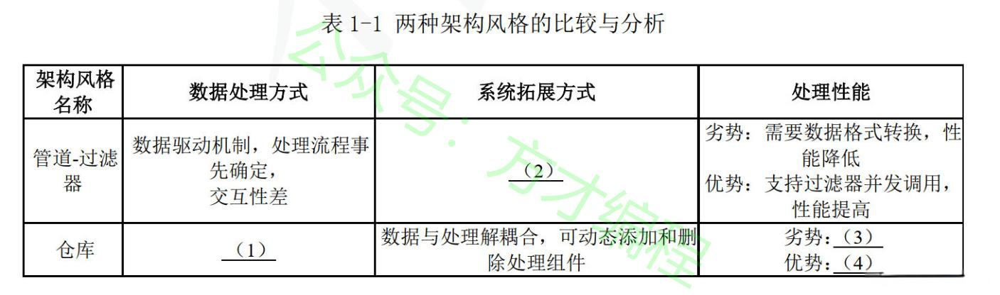
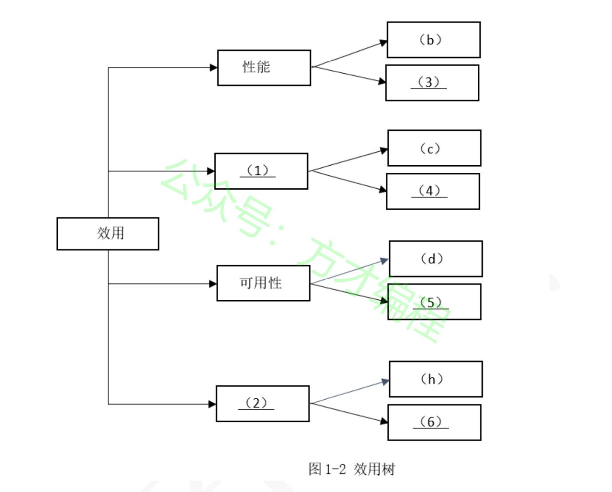
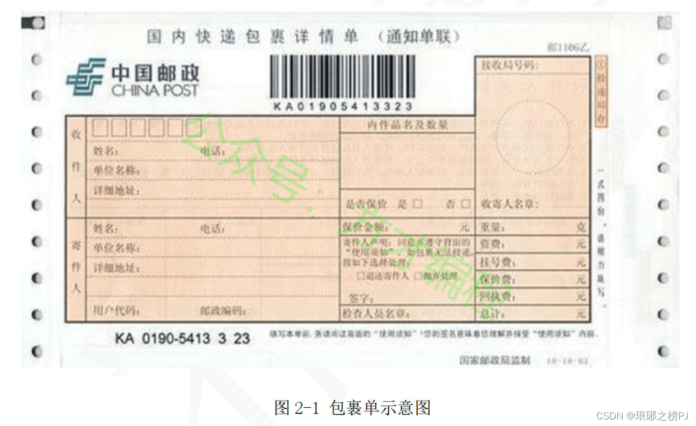
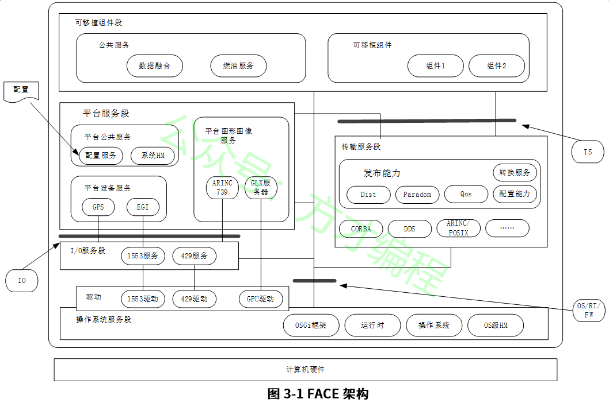
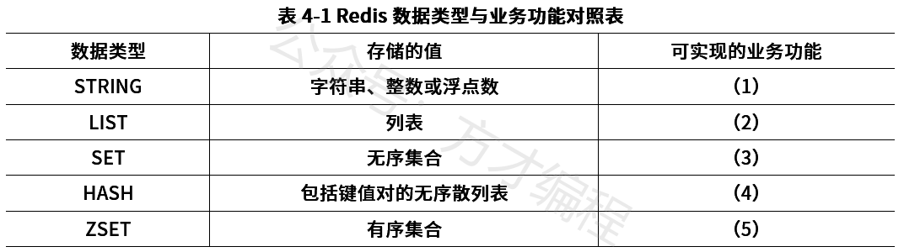
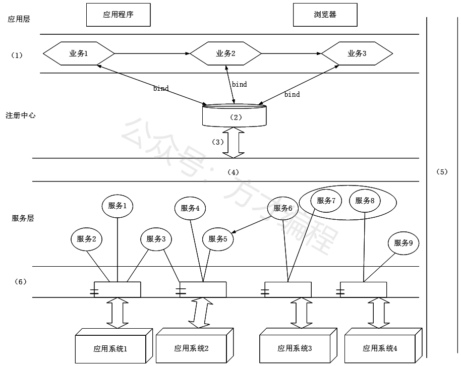

# 2020年11月 系统架构设计师 案例分析真题

> 来源：方才coding 软考真题

---

## 第1大题：软件架构设计与评估

### 试题1

阅读以下关于软件架构设计与评估的叙述，在答题纸上回答问题1和问题2。
[说明]
某公司拟开发--套在线软件开发系统，支持用户通过浏览器在线进行软件开发活动。该系统的重要功能包括代码编辑、语法高亮显示、代码编译、系统调试、代码仓库管理等。在需求分析与架构设计阶段，公司提出的需求和质量属性描述如下:
a)根据用户的付费情况对用户进行分类，并根据类别提供相应的开发功能;
b)在正常负载情况下，系统应该在0.2s内对用户的界面操作请求进行响应;
c)系统应该具备完善的安全防护措施，能够对黑客的攻击行为进行检测和防御;
d)系统主站点断电后，应在3s内将请求重定向到备用站点;
e)系统支持中文昵称，但用户名必须以字母开头，长度不少于8个字符; .
f)系统宕机后，需要在15s内发现错误并启用备用系统;
g)在正常负载情况下，用户的代码提交请求应在0. 5s内完成;
h)系统支持硬件设备灵活扩容，应保证在2人天内完成所有的部署与测试工作;
i)系统需要针对代码仓库的所有操作进行详细记录，便于后期查阅与审计;
j)更改系统web界面风格需要在4人天内完成;
k)系统本身需要提供远程调试接口，支持开发团队进行远程排错;
在对系统需求、质量属性和架构特性进行分析的基础上，该公司的系统架构师给出了两种候选的架构设计方案，公司目前正在组织相关专家对候选系统架构进行评估。
问题 1
(13 分)针对该系统的功能，李工建议采用管道过滤器(pipe and filter) 的架构风格，而王工则建议采用仓库(repository)架构风格。请指出该系统更适合采用哪种架构风格，并针对系统的主要功能，从数据处理方式、系统的可扩展性和处理性能三个方面对这两种架构风格进行比较与分析，填写表1-1中的(1)~ (4)空白处。

---
### 试题2

阅读以下关于软件架构设计与评估的叙述，在答题纸上回答问题1和问题2。
[说明]
某公司拟开发--套在线软件开发系统，支持用户通过浏览器在线进行软件开发活动。该系统的重要功能包括代码编辑、语法高亮显示、代码编译、系统调试、代码仓库管理等。在需求分析与架构设计阶段，公司提出的需求和质量属性描述如下:
a)根据用户的付费情况对用户进行分类，并根据类别提供相应的开发功能;
b)在正常负载情况下，系统应该在0.2s内对用户的界面操作请求进行响应;
c)系统应该具备完善的安全防护措施，能够对黑客的攻击行为进行检测和防御;
d)系统主站点断电后，应在3s内将请求重定向到备用站点;
e)系统支持中文昵称，但用户名必须以字母开头，长度不少于8个字符; .
f)系统宕机后，需要在15s内发现错误并启用备用系统;
g)在正常负载情况下，用户的代码提交请求应在0. 5s内完成;
h)系统支持硬件设备灵活扩容，应保证在2人天内完成所有的部署与测试工作;
i)系统需要针对代码仓库的所有操作进行详细记录，便于后期查阅与审计;
j)更改系统web界面风格需要在4人天内完成;
k)系统本身需要提供远程调试接口，支持开发团队进行远程排错;
在对系统需求、质量属性和架构特性进行分析的基础上，该公司的系统架构师给出了两种候选的架构设计方案，公司目前正在组织相关专家对候选系统架构进行评估。
问题 2
(12 分)在架构评估过程中，质量属性效用树(utilitytree)是对系统质量属性进行识别和优先级排序的重要工具。请将合适的质量属性名称填入图1-1中(1)、(2) 空白处，并选择题干描述的(a)
(k)填入(3)
(6) 空白处，完成该系统的效用树。

---

## 第2大题：系统建模与分析

### 试题3

阅读下列说明，回答问题1至问题3，将解答填入答题纸的对应栏内。
[说明]
某企业委托软件公司开发一-套包裹信息管理系统，以便于对该企业通过快递收发的包裹信息进行统一管理。在系统设计阶段，需要对不同快递信息的包裹单信息进行建模，其中，邮政包裹单如图2-1所示:
问题 1
(14 分)请说明关系型数据库开发中，逻辑数据模型设计过程包含哪些任务?该包裹单的逻辑数据模型中应该包含哪些实体?并指出每个关系模式的主键属性。

---
### 试题4

阅读下列说明，回答问题1至问题3，将解答填入答题纸的对应栏内。
[说明]
某企业委托软件公司开发一-套包裹信息管理系统，以便于对该企业通过快递收发的包裹信息进行统一管理。在系统设计阶段，需要对不同快递信息的包裹单信息进行建模，其中，邮政包裹单如图2-1所示:
问题 2
请说明什么是超类实体?结合图中包裹单信息，试设计一种超类实体，给出完整的属性列表。

---
### 试题5

阅读下列说明，回答问题1至问题3，将解答填入答题纸的对应栏内。
[说明]
某企业委托软件公司开发一-套包裹信息管理系统，以便于对该企业通过快递收发的包裹信息进行统一管理。在系统设计阶段，需要对不同快递信息的包裹单信息进行建模，其中，邮政包裹单如图2-1所示:
问题 3
请说明什么是派生属性?结合图2-1中包裹单信息说明哪个属性是派生属性。

---

## 第3大题：数据库与系统设计

### 试题6

阅读以下关于开放式嵌入式软件架构设计的相关描述，回答问题1至问题3。
[说明]
某公司一直从事宇航系统研制任务，随着宇航产品综合化、网络化技术发展的需要，公司的业务量急剧增加，研制新的软件架构已迫在眉睫。公司架构师王工广泛调研了多种现代架构的基础，建议采用基于FACE (Future Airborne Capability Environment)的宇航系统开放式软件架构，以实现宇航系统的跨平台复用，实现宇航软件高质量、低成本的开发。公司领导肯定了王工的提案，并指出公司要全面实施基于FACE的开放式软件架构，应注意每个具体项目在实施中如何有效实现从需求到架构设计的关系，掌握基于软件需求的软件架构设计方法，并做好开放式软件架构中各段间的接口标准化设计工作。
问题 1
(9分)王工指出，软件开发中需求分析是根本，架构设计是核心，不考虑软件需求便进行软件架构设计很可能导致架构设计的失败，因此，如何把软件需求映射到软件架构至关重要。请从描述语言、非功能性需求描述、需求和架构的一致性等三个方面，用 300字以内的文字说明软件需求到架构的映射存在哪些难点。

---
### 试题7

阅读以下关于开放式嵌入式软件架构设计的相关描述，回答问题1至问题3。
[说明]
某公司一直从事宇航系统研制任务，随着宇航产品综合化、网络化技术发展的需要，公司的业务量急剧增加，研制新的软件架构已迫在眉睫。公司架构师王工广泛调研了多种现代架构的基础，建议采用基于FACE (Future Airborne Capability Environment)的宇航系统开放式软件架构，以实现宇航系统的跨平台复用，实现宇航软件高质量、低成本的开发。公司领导肯定了王工的提案，并指出公司要全面实施基于FACE的开放式软件架构，应注意每个具体项目在实施中如何有效实现从需求到架构设计的关系，掌握基于软件需求的软件架构设计方法，并做好开放式软件架构中各段间的接口标准化设计工作。
问题 2
(10分)图3-1是王工给出的FACE架构布局，包括操作系统、I/O 服务、平台服务、传输服务和可移植组件等5个段;操作系统、I/0 和传输等3个标准接口。请分析图3-1给出的FACE架构的相关信息，用300字以内的文字简要说明FACE5个段的含义。

---
### 试题8

阅读以下关于开放式嵌入式软件架构设计的相关描述，回答问题1至问题3。
[说明]
某公司一直从事宇航系统研制任务，随着宇航产品综合化、网络化技术发展的需要，公司的业务量急剧增加，研制新的软件架构已迫在眉睫。公司架构师王工广泛调研了多种现代架构的基础，建议采用基于FACE (Future Airborne Capability Environment)的宇航系统开放式软件架构，以实现宇航系统的跨平台复用，实现宇航软件高质量、低成本的开发。公司领导肯定了王工的提案，并指出公司要全面实施基于FACE的开放式软件架构，应注意每个具体项目在实施中如何有效实现从需求到架构设计的关系，掌握基于软件需求的软件架构设计方法，并做好开放式软件架构中各段间的接口标准化设计工作。
问题 3
(6 分)FACE架构的核心能力是可支持应用程序的跨平台执行和可移植性，要达到可移植能力，必须解决应用程序的紧耦合和封装的障碍。请用200字以内的文字简要说明在可移植性上，应用程序的紧耦合和封装问题的主要表现分别是什么，并给出解决方案。

---

## 第4大题：Web应用架构

### 试题9

阅读以下关于数据库缓存的叙述，在答题纸上回答问题1至问题3。
[说明]
某互联网文化发展公司因业务发展，需要建立网上社区平台，为用户提供一个对网络文化产品(如互联网小说、电影、漫画等)进行评论、交流的平台。该平台的部分功能如下:
(a)用户帖子的评论计数器;
(b)支持粉丝列表功能;
(c)支持标签管理;
(d)支持共同好友功能等;
(e)提供排名功能，如当天最热前10名帖子排名、热搜榜前5排名等;
(f)用户信息的结构化存储;
(g)提供好友信息的发布/订阅功能。
该系统在性能上需要考虑高性能、高并发，以支持大量用户的同时访问。开发团队经过综合考虑，在数据管理上决定采用Redis+数据库(缓存+数据库)的解决方案。
问题 1
(10分)Redis支持丰富的数据类型，并能够提供--些常见功能需求的解决方案。请选择题干描述的(a)~(g) 功能选项，填入表4-1中(1)~ (5)的空白处。

---
### 试题10

阅读以下关于数据库缓存的叙述，在答题纸上回答问题1至问题3。
[说明]
某互联网文化发展公司因业务发展，需要建立网上社区平台，为用户提供一个对网络文化产品(如互联网小说、电影、漫画等)进行评论、交流的平台。该平台的部分功能如下:
(a)用户帖子的评论计数器;
(b)支持粉丝列表功能;
(c)支持标签管理;
(d)支持共同好友功能等;
(e)提供排名功能，如当天最热前10名帖子排名、热搜榜前5排名等;
(f)用户信息的结构化存储;
(g)提供好友信息的发布/订阅功能。
该系统在性能上需要考虑高性能、高并发，以支持大量用户的同时访问。开发团队经过综合考虑，在数据管理上决定采用Redis+数据库(缓存+数据库)的解决方案。
问题 2
(7分)该网上社区平台需要为用户提供7×24小时的不间断服务。同时在系统出现宕机等故障时，能在最短时间内通过重启等方式重新建立服务。为此，开发团队选择了Redis 持久化支持。Redis有两种持久化方式，分别是RDB(Redis DataBase)持久化方式和AOF (Append OnlyFile)持久化方式。开发团队最终选择了RDB方式。请用200字以内的文字，从磁盘更新频率、数据安全、数据一致性、 重启性能和数据文件大小五个方面比较两种方式，并简要说明开发团队选择RDB的原因。

---
### 试题11

阅读以下关于数据库缓存的叙述，在答题纸上回答问题1至问题3。
[说明]
某互联网文化发展公司因业务发展，需要建立网上社区平台，为用户提供一个对网络文化产品(如互联网小说、电影、漫画等)进行评论、交流的平台。该平台的部分功能如下:
(a)用户帖子的评论计数器;
(b)支持粉丝列表功能;
(c)支持标签管理;
(d)支持共同好友功能等;
(e)提供排名功能，如当天最热前10名帖子排名、热搜榜前5排名等;
(f)用户信息的结构化存储;
(g)提供好友信息的发布/订阅功能。
该系统在性能上需要考虑高性能、高并发，以支持大量用户的同时访问。开发团队经过综合考虑，在数据管理上决定采用Redis+数据库(缓存+数据库)的解决方案。
问题 3
(8分)缓存中存储当前的热点数据，Redis 为每个KEY值都设置了过期时间，以提高缓存命中率。为了清除非热点数据，Redis 选择“定期删除+惰性删除”策略。如果该策略失效，Redis内存使用率会越来越高，一般应采用内存淘汰机制来解决。请用100字以内的文字简要描述该策略的失效场景，并给出三种内存淘汰机制。

---

## 第5大题：嵌入式与实时系统

### 试题12

阅读以下关于Web系统设计的叙述，在答题纸上回答问题1至问题3。
【说明】
某银行拟将以分行为主体的银行信息系统，全面整合为由总行统一管理维护的银行信息系统，实现统一的用户账户管理、转账汇款、自助缴费、理财投资、贷款管理、网上支付、财务报表分析等业务功能。但是，由于原有以分行为主体的银行信息系统中，多个业务系统采用异构平台、数据库和中间件，使用的报文交换标准和通信协议也不尽相同，使用传统的EAI解决方案根本无法实现新的业务模式下异构系统间灵活的交互和集成。因此，为了以最小的系统改进整合现有的基于不同技术实现的银行业务系统，该银行拟采用基于ESB的面向服务架构（SOA）集成方案实现业务整合。
问题 1
请分别用200字以内的文字说明什么是面向服务架构（SOA）以及ESB在SOA中的作用与特点。

---
### 试题13

阅读以下关于Web系统设计的叙述，在答题纸上回答问题1至问题3。
【说明】
某银行拟将以分行为主体的银行信息系统，全面整合为由总行统一管理维护的银行信息系统，实现统一的用户账户管理、转账汇款、自助缴费、理财投资、贷款管理、网上支付、财务报表分析等业务功能。但是，由于原有以分行为主体的银行信息系统中，多个业务系统采用异构平台、数据库和中间件，使用的报文交换标准和通信协议也不尽相同，使用传统的EAI解决方案根本无法实现新的业务模式下异构系统间灵活的交互和集成。因此，为了以最小的系统改进整合现有的基于不同技术实现的银行业务系统，该银行拟采用基于ESB的面向服务架构（SOA）集成方案实现业务整合。
问题 2
基于该信息系统整合的实际需求，项目组完成了基于SOA的银行信息系统架构设计方案。该系统架构图如图5-1所示：
请从（a）~ （j）中选择相应内容填入图5-1的（1）~ （6），补充完善架构设计图。
（a）数据层
（b）界面层
（c）业务层
（d）bind
（e）企业服务总线ESB
（f） XML
（g）安全验证和质量管理
（h）publish
（i）UDDI
（j）组件层
（k）BPEL

---
### 试题14

阅读以下关于Web系统设计的叙述，在答题纸上回答问题1至问题3。
【说明】
某银行拟将以分行为主体的银行信息系统，全面整合为由总行统一管理维护的银行信息系统，实现统一的用户账户管理、转账汇款、自助缴费、理财投资、贷款管理、网上支付、财务报表分析等业务功能。但是，由于原有以分行为主体的银行信息系统中，多个业务系统采用异构平台、数据库和中间件，使用的报文交换标准和通信协议也不尽相同，使用传统的EAI解决方案根本无法实现新的业务模式下异构系统间灵活的交互和集成。因此，为了以最小的系统改进整合现有的基于不同技术实现的银行业务系统，该银行拟采用基于ESB的面向服务架构（SOA）集成方案实现业务整合。
问题 3
针对银行信息系统的数据交互安全性需求，列举3种可实现信息系统安全保障的措施。

---

## 附录：提取的图片

- `img_qr_5b2991402eee.png`：微信小程序二维码，已省略
- `img_exam_c3324053d4ea.png`：第1大题第1小题架构图/表格图
- `img_logo_fb5107e4dc49.jpeg`：站点 Logo，已省略
- `img_exam_9579e230005c.png`：第1大题第2小题架构图/表格图
- `img_exam_47662d38a3df.png`：第2大题第1小题架构图/表格图
- `img_exam_936cdb8502ea.png`：第3大题第2小题架构图/表格图
- `img_exam_0f41747427a1.png`：第4大题第1小题架构图/表格图
- `img_exam_141314cfd1b4.png`：第5大题第2小题架构图/表格图
