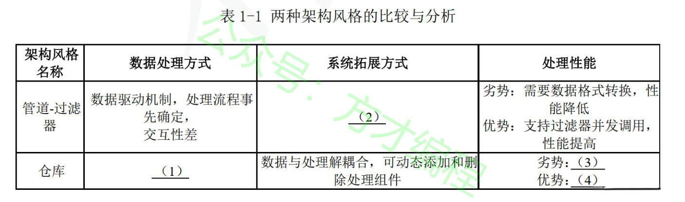
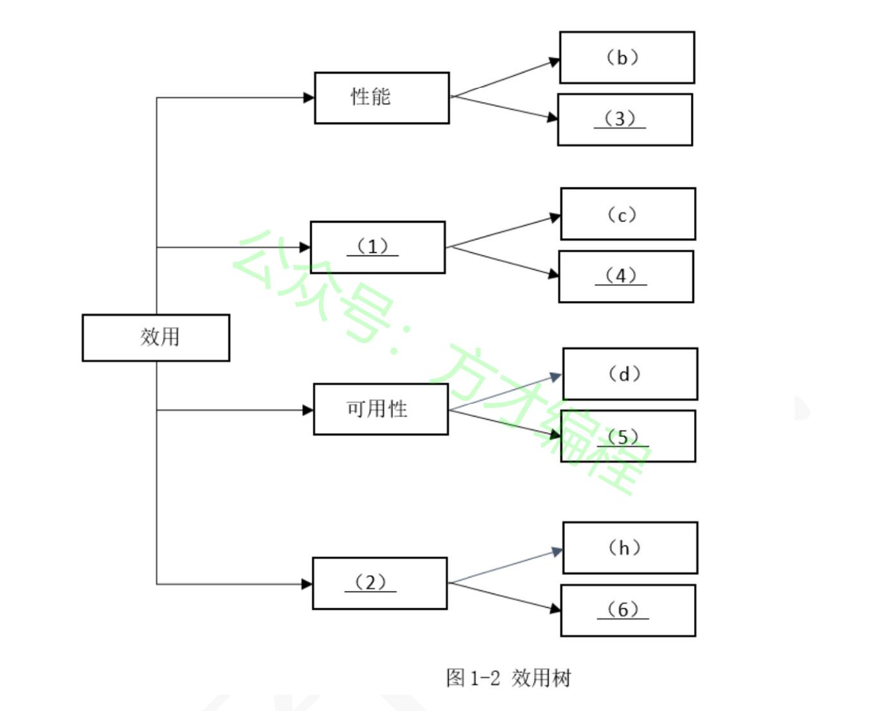
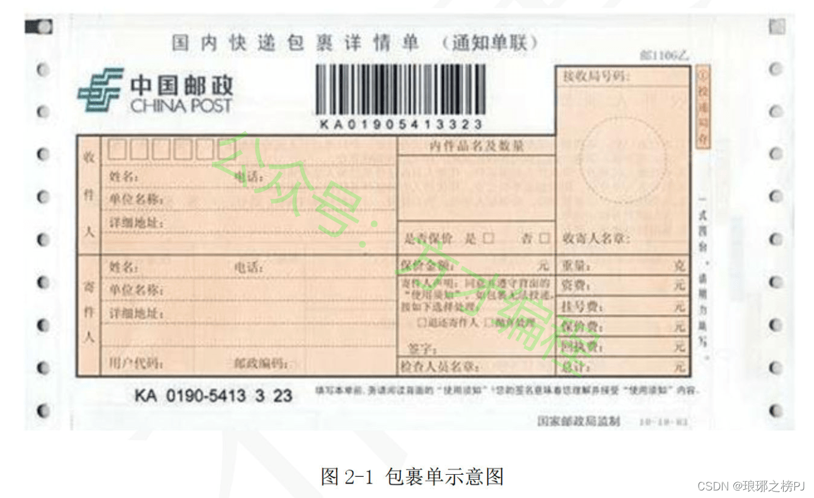
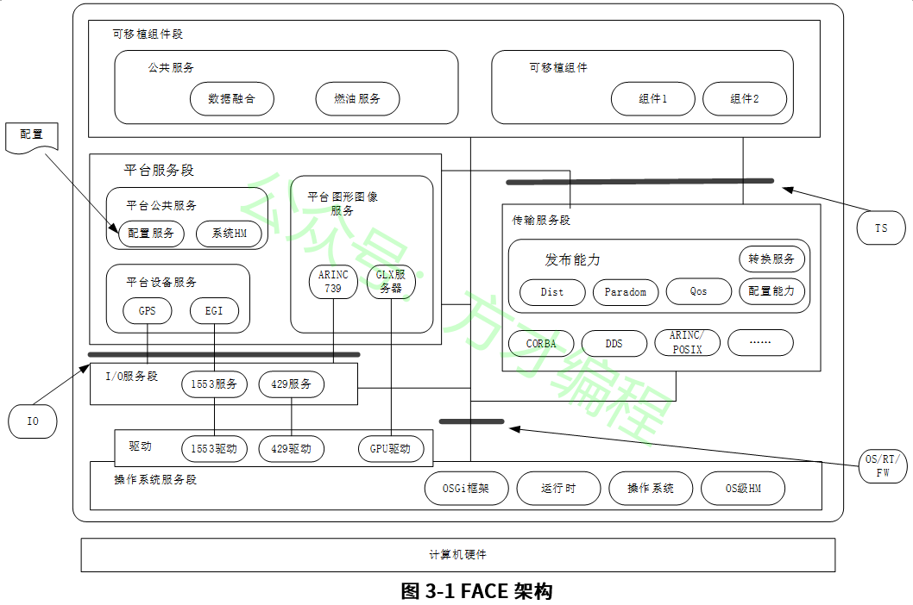
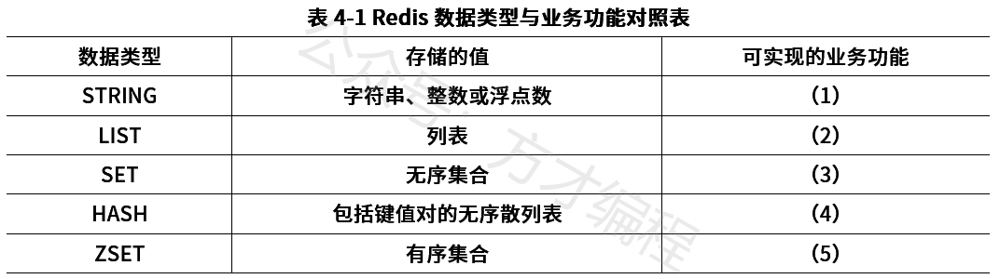
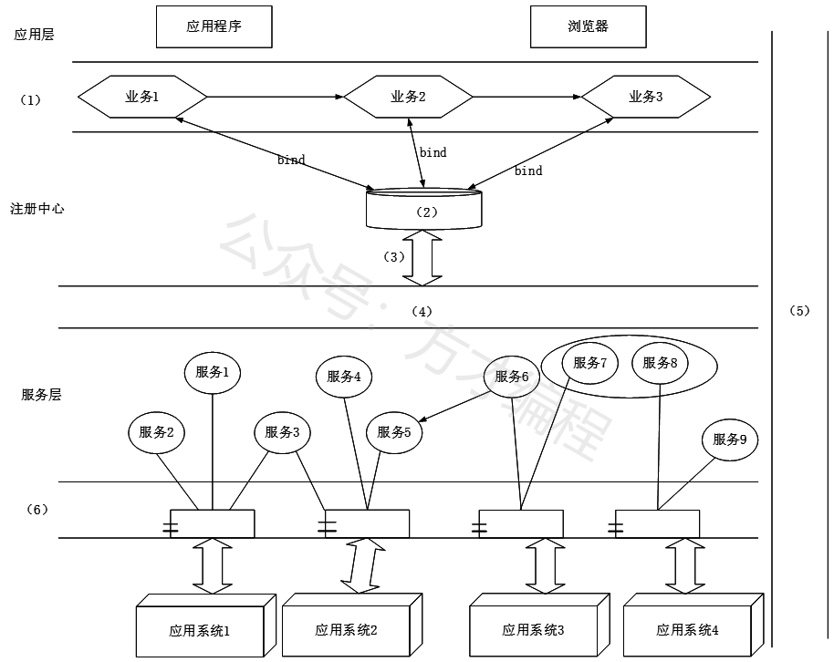

# 2020年11月 系统架构设计师 案例分析真题

---

## 第1大题：软件架构设计与评估

阅读以下关于软件架构设计与评估的叙述，在答题纸上回答问题1和问题2。
[说明]
某公司拟开发--套在线软件开发系统，支持用户通过浏览器在线进行软件开发活动。该系统的重要功能包括代码编辑、语法高亮显示、代码编译、系统调试、代码仓库管理等。在需求分析与架构设计阶段，公司提出的需求和质量属性描述如下:
a)根据用户的付费情况对用户进行分类，并根据类别提供相应的开发功能;
b)在正常负载情况下，系统应该在0.2s内对用户的界面操作请求进行响应;
c)系统应该具备完善的安全防护措施，能够对黑客的攻击行为进行检测和防御;
d)系统主站点断电后，应在3s内将请求重定向到备用站点;
e)系统支持中文昵称，但用户名必须以字母开头，长度不少于8个字符; .
f)系统宕机后，需要在15s内发现错误并启用备用系统;
g)在正常负载情况下，用户的代码提交请求应在0. 5s内完成;
h)系统支持硬件设备灵活扩容，应保证在2人天内完成所有的部署与测试工作;
i)系统需要针对代码仓库的所有操作进行详细记录，便于后期查阅与审计;
j)更改系统web界面风格需要在4人天内完成;
k)系统本身需要提供远程调试接口，支持开发团队进行远程排错;
在对系统需求、质量属性和架构特性进行分析的基础上，该公司的系统架构师给出了两种候选的架构设计方案，公司目前正在组织相关专家对候选系统架构进行评估。

### 问题 1
(13 分)针对该系统的功能，李工建议采用**管道过滤器(pipe and filter)** 的架构风格，而王工则建议采用仓库(repository)架构风格。**请指出该系统更适合采用哪种架构风格**，并针对系统的主要功能，从数据处理方式、系统的可扩展性和处理性能三个方面对这两种架构风格进行比较与分析，**填写表1-1中的(1)~ (4)空白处**。

**我的答案**

更适合采用 仓库 风格，原因如下

- 数据处理方式：因为是在线软件开发系统 ，处理流程不需要先确定，且对交互性要求比较高，而提干中需求和质量属性 的 b 和 g 都表示需要很高的交互性
- 系统拓展方式：在线软件开发环境，数据和处理解耦，可动态添加和删除组件，但是管道过滤器不可以，数据和处理是在一条处理线上的，而提干中需求和质量属性 的h 和 j  都表示需要很高的交互性
- 处理性能：仓库风格不需要格式转换

填空

（1） 处理流程不确定，交互性好

（2）数据和处理属于需要保持一致，属于高耦合

（3） 优势：数据不需要格式转换  劣势：并发调用不行

---

**评分：约 8/13 分**

**评判：**
- 架构风格选择正确（仓库风格）✓，5分
- (1) 答到"处理流程不确定，交互性好" ✓ 核心点命中 — 得2分
- (2) 答"数据和处理高耦合" — 这描述的是仓库风格的特点，但(2)应对应管道过滤器 — 得0分
- (3) 形式上有优势+劣势，但"不需要格式转换"不是性能维度的描述，"并发调用不行"实际是管道过滤器的特点 — 得1分
- (4) 未作答 ✗ — 0分

---

**补充答案（标准参考）：**

更适合采用**仓库（Repository）架构风格**。

表1-1填空：

- **(1)** 数据存储在中心仓库，处理流程独立，支持交互式处理。
- **(2)** 数据与处理紧密关联，调整处理流程需要系统重新启动。
- **(3)** 数据与处理分离，需要加载数据，性能降低。
- **(4)** 数据处理组件之间一般无依赖关系，可并发调用，提高性能。

### 问题 2
(12 分)在架构评估过程中，质量属性效用树(utilitytree)是对系统质量属性进行识别和优先级排序的重要工具。请将合适的质量属性名称填入图1-1**中(1)(2) 空白处**，选择题干描述的(a)(k)填入**(3)(6) 空白**处，完成该系统的效用树。

**我的答案：**

（1）安全性  （2）可维护性

（3） g     (4)     i   (5)  f      (6) j

---

**评分：约 11/12 分**

**评判：**
- (1) 安全性 ✓ 正确
- (2) 可维护性 — 标准答案为**可修改性**，可维护性是更宽泛的概念，效用树中应使用标准术语 — 扣1分
- (3) g ✓ 正确
- (4) i ✓ 正确
- (5) f ✓ 正确
- (6) j ✓ 正确

---

**补充答案（标准参考）：**

- **(1)** 安全性
- **(2)** 可修改性
- **(3)** g
- **(4)** i
- **(5)** f
- **(6)** j

---

## 第2大题：系统建模与分析

阅读下列说明，回答问题1至问题3，将解答填入答题纸的对应栏内。
[说明]
某企业委托软件公司开发一-套**包裹信息管理系统**，以便于对该企业通过快递收发的包裹信息进行统一管理。在系统设计阶段，需要对不同快递信息的包裹单信息进行建模，其中，邮政包裹单如图2-1所示:

### 问题 1
(14 分)请说明关系型数据库开发中，**逻辑数据模型设计过程包含哪些任务**?   

该包裹单的逻辑数据模型中应该**包含哪些实体**?

并指出**每个关系模式的主键属性**。

**我的答案**

逻辑数据模型设计过程包含哪些任务 

- 需要识别实体，然后得到实体有哪些属性
- 需要识别各实体之间有哪些关系
- 然后将各实体之间的业务联合起来进行模型设计

实体有：收件人/寄件人/检查人员

- 收件人  主键 姓名
- 寄件人 主键 姓名
- 检查人员  逐渐 检查人员名章

---

**评分：约 6/14 分**

**评判：**
- 设计任务描述偏简略，缺少规范化设计、确定完整性约束、确定用户视图等关键步骤 — 扣3分
- 实体识别：答了收件人/寄件人/检查人员，但缺少**包裹单**和**快递公司**两个核心实体 — 扣3分
- 主键设置：答"姓名"不正确，姓名会重复不唯一，应为**电话/编号** — 扣2分
- "检查人员"不是包裹单逻辑数据模型中的独立实体

---

**补充答案（标准参考）：**

**逻辑数据模型设计过程包含的任务：**
1. 确定数据模型
2. 将E-R图转换成为指定的数据模型
3. 确定完整性约束
4. 确定用户视图

**包裹单逻辑数据模型中包含的实体及主键：**
- **收件人**（主键：电话）
- **寄件人**（主键：电话）
- **包裹单**（主键：编号）

### 问题 2
请说明什么是**超类实体**?  结合图中包裹单信息，试设计一种超类实体，给出完整的属性列表。

**我的答案**   不知道

---

**评分：0/6 分**

**评判：**
- 未作答，完全失分

---

**补充答案（标准参考）：**

**超类实体的定义：** 超类实体是将几个实体中的公共属性概括出来，提升为一个高层次的实体。子类实体继承超类实体的所有属性和联系，同时还可以拥有自己特有的属性（泛化 Generalization）。

**设计的超类实体——用户：**
- 姓名
- 电话
- 单位名称
- 详细地址

（收件人和寄件人可以泛化为"用户"超类实体）

---

### 问题 3
请说明什么是**派生属性**?  结合图2-1中包裹单信息说明哪个属性是派生属性。

**我的答案：**

- 派生属性：既可以通过其他属性推导出的属性  
  -  寄件人里面的邮政编码
  - 总计 金额 派生属性

---

**评分：约 4/6 分**

**评判：**
- 派生属性定义基本正确 ✓
- "总计金额"是派生属性 ✓ 正确（由资费、挂号费、保价费、回执费计算得出）
- "邮政编码"作为派生属性不够准确 — 扣2分

---

**补充答案（标准参考）：**

**派生属性的定义：** 派生属性是指某个实体的非主键属性由该实体其他非主键属性通过计算推导得出，不需要直接存储。

**该包裹单中的派生属性：** **总计** — 由资费、挂号费、保价费、回执费计算得出，所以是派生属性。

---

## 第3大题：数据库与系统设计

阅读以下关于开放式嵌入式软件架构设计的相关描述，回答问题1至问题3。
[说明]
某公司一直从事宇航系统研制任务，随着宇航产品综合化、网络化技术发展的需要，公司的业务量急剧增加，研制新的软件架构已迫在眉睫。公司架构师王工广泛调研了多种现代架构的基础，建议采用基于FACE (Future Airborne Capability Environment)的宇航系统开放式软件架构，以实现宇航系统的跨平台复用，实现宇航软件高质量、低成本的开发。公司领导肯定了王工的提案，并指出公司要全面实施基于FACE的开放式软件架构，应注意每个具体项目在实施中如何有效实现从需求到架构设计的关系，掌握基于软件需求的软件架构设计方法，并做好开放式软件架构中各段间的接口标准化设计工作。

### 问题 1
(9分)王工指出，软件开发中需求分析是根本，架构设计是核心，不考虑软件需求便进行软件架构设计很可能导致架构设计的失败，因此，如何把软件需求映射到软件架构至关重要。请从描述语言、非功能性需求描述、需求和架构的一致性等三个方面，**用 300字以内的文字说明软件需求到架构的映射存在哪些难点**。

---

### 问题 2
(10分)图3-1是王工给出的FACE架构布局，包括操作系统、I/O 服务、平台服务、传输服务和可移植组件等5个段;操作系统、I/0 和传输等3个标准接口。请分析图3-1给出的FACE架构的相关信息，用300字以内的文字简要说明FACE5个段的含义。

### 问题 3
(6 分)FACE架构的核心能力是可支持应用程序的跨平台执行和可移植性，要达到可移植能力，必须解决应用程序的紧耦合和封装的障碍。请用200字以内的文字简要说明在可移植性上，应用程序的紧耦合和封装问题的主要表现分别是什么，并给出解决方案。

---

## 第4大题：Web应用架构

阅读以下关于**数据库缓存的叙述**，在答题纸上回答问题1至问题3。
[说明]
某互联网文化发展公司因业务发展，需要**建立网上社区平台**，为用户提供一个对网络文化产品(如互联网小说、电影、漫画等)进行评论、交流的平台。该平台的部分功能如下:
(a)用户帖子的评论计数器;
(b)支持粉丝列表功能;
(c)支持标签管理;
(d)支持共同好友功能等;
(e)提供排名功能，如当天最热前10名帖子排名、热搜榜前5排名等;
(f)用户信息的结构化存储;
(g)提供好友信息的发布/订阅功能。
该系统在性能上需要考虑高性能、高并发，以支持大量用户的同时访问。开发团队经过综合考虑，在数据管理上决定采用**Redis+数据库(缓存+数据库)**的解决方案。

### 问题 1
(10分) Redis支持丰富的数据类型，并能够提供--些常见功能需求的解决方案。请选择题干描述的(a)~(g) 功能选项，填入表4-1中(1)~ (5)的空白处。

**我的答案**       g 

(1)  f  a 

(2) b

(3) d

(4)  c g 

(5)   e 

---

**评分：约 4/10 分**

**评判：**
- (1) STRING 对应 (a) ✓，但多了 (f) ✗ — f 应该归 HASH
- (2) LIST 对应 (b) ✓，但漏了 (g) ✗ — g 发布/订阅应归 LIST
- (3) SET 对应 (d) ✓，但漏了 (c) ✗ — c 标签管理应归 SET
- (4) HASH 对应 (c)(g) 全部错位 ✗ — 应该是 (f)
- (5) ZSET 对应 (e) ✓ 正确

**错误原因分析：** 混淆了 HASH 和 STRING 的适用场景；发布/订阅基于 LIST 实现应归 LIST；标签去重应归 SET。

---

**补充答案（标准参考）：**

| 编号 | Redis 数据类型 | 对应功能 |
|------|---------------|---------|
| (1) String | (a) 评论计数器 |
| (2) List / (g) Pub/Sub | (b) 粉丝列表、(g) 好友发布/订阅 |
| (3) Set | (c) 标签管理、(d) 共同好友 |
| (4) Hash | (f) 用户信息结构化存储 |
| (5) Sorted Set | (e) 排名/热搜功能 |

### 问题 2
(7分)该网上社区平台需要为用户提供**7×24小时的不间断服务**。同时在系统出现宕机等故障时，能在最短时间内通过重启等方式重新建立服务。为此，开发团队选择了Redis 持久化支持。Redis有两种持久化方式，分别是**RDB(Redis DataBase)**持久化方式和**AOF (Append OnlyFile)**持久化方式。开发团队最终选择了RDB方式。请用200字以内的文字，从磁盘更新频率、数据安全、数据一致性、 重启性能和数据文件大小五个方面比较两种方式，并简要说明开发团队选择**RDB**的原因。

**我的答案**

- 磁盘更新频率  RDB 更新比较少，AOF 更新很多
- 数据安全 RDB  高，AOF 较低
- 数据一致性 RDB  高，AOF 低
-  重启性能 RDB 慢，AOF 快
- 数据文件大小 RDB 大，AOF 小

通过上述对比，该系统在性能上需要考虑高性能、高并发，以支持大量用户的同时访问，选择 **RDB** 比较好，因为该方式 性能高，更新快在内存操作，大量用户访问比较适合

---

**评分：约 2/7 分**

**评判：**
- 磁盘更新频率：正确 ✓
- 数据安全：**答反了** ✗ — AOF 安全性更高（实时记录），RDB 安全性较低（可能丢失间隔数据）
- 数据一致性：**答反了** ✗ — AOF 一致性更高（记录每次写操作）
- 重启性能：**答反了** ✗ — RDB 重启快（加载快照），AOF 重启慢（重放日志）
- 数据文件大小：**答反了** ✗ — RDB 文件小（压缩快照），AOF 文件大（追加日志）
- 原因说明：结论正确（选RDB）但论据完全颠倒

---

**补充答案（标准参考）：**

| 比较维度 | RDB | AOF |
|---------|-----|-----|
| 磁盘更新频率 | 指定时间间隔快照，更新少 | 实时记录每次写操作，更新频繁 |
| 数据安全 | 较低，快照间隔内数据可能丢失 | 较高，通过追加日志保证数据安全 |
| 数据一致性 | 较低，快照时刻数据，可能丢失部分数据 | 较高，记录每次写操作，数据更完整一致 |
| 重启性能 | 快，直接加载快照文件 | 慢，需重新执行日志中的写操作 |
| 数据文件大小 | 小，压缩快照 | 大，记录每次写操作 |

**选择 RDB 的原因：** RDB 在重启性能方面更优，能够在最短时间内重新建立服务，符合 7×24 小时不间断服务需求。同时 RDB 相对简单，易于管理和维护。

### 问题 3
(8分) 缓存中存储当前的热点数据，Redis 为每个KEY值都设置了过期时间，以提高缓存命中率。为了清除非热点数据，Redis 选择“**定期删除+惰性删除**”策略。如果该策略失效，Redis内存使用率会越来越高，一般应采用内存淘汰机制来解决。请用100字以内的文字简要描述该策略的失效场景，并给出三种内存淘汰机制。

**我的答案**

失效场景：虽然对每个key 都是设置了过期时间，但是也有可能在同一时间有大量的 key 同时失效，这是就会出现缓存雪崩的问题，可能导致宕机；由于现在是 “**定期删除+惰性删除** 的方式，如果时间过的比较就就会出现内存存在很多非热点数据，导致内存占用较高

三种内存淘汰策略

- 给每一个KEY都设置不同过期时间进行自动删除内存数据
- 

---

**评分：约 3/8 分**

**评判：**
- 失效场景：提到”大量 key 同时失效”方向正确 ✓，但混淆了”缓存雪崩”概念。题目问的是定期+惰性删除策略本身的失效场景，即过期 key 未被定期扫描到且未被访问触发惰性删除，持续占用内存 — 得2分
- 内存淘汰策略：仅写了1条且不完整，未答出标准的内存淘汰机制 — 得1分

---

**补充答案（标准参考）：**

**失效场景：** 大量过期的 key 在定期删除策略的随机抽查中未被抽到，同时在这段时间内外部也没有访问这些 key 的动作（惰性删除未触发），导致过期 key 持续占用内存不被释放。

**三种内存淘汰机制（任选三种）：**
1. **volatile-lru**：从已设置过期时间的数据集中，淘汰最近最少使用的数据
2. **volatile-ttl**：从已设置过期时间的数据集中，淘汰即将过期的数据
3. **volatile-random**：从已设置过期时间的数据集中，任意选择数据淘汰
4. **allkeys-lru**：从全部数据集中淘汰最近最少使用的数据
5. **allkeys-random**：从全部数据集中任意选择数据淘汰
6. **noeviction**：不淘汰，内存满时写操作返回错误 

---

## 第5大题：嵌入式与实时系统

阅读以下关于Web系统设计的叙述，在答题纸上回答问题1至问题3。
【说明】
某银行拟将以分行为主体的银行信息系统，全面整合为由总行统一管理维护的银行信息系统，实现统一的用户账户管理、转账汇款、自助缴费、理财投资、贷款管理、网上支付、财务报表分析等业务功能。但是，由于原有以分行为主体的银行信息系统中，多个业务系统采用异构平台、数据库和中间件，使用的报文交换标准和通信协议也不尽相同，使用传统的EAI解决方案根本无法实现新的业务模式下异构系统间灵活的交互和集成。因此，为了以最小的系统改进整合现有的基于不同技术实现的银行业务系统，该银行拟采用基于ESB的面向服务架构（SOA）集成方案实现业务整合。

### 问题 1
请分别用200字以内的文字说明什么是面向服务架构（SOA）以及ESB在SOA中的作用与特点。

### 问题 2
基于该信息系统整合的实际需求，项目组完成了基于SOA的银行信息系统架构设计方案。该系统架构图如图5-1所示：
请从（a）~ （j）中选择相应内容填入图5-1的（1）~ （6），补充完善架构设计图。
（a）数据层
（b）界面层
（c）业务层
（d）bind
（e）企业服务总线ESB
（f） XML
（g）安全验证和质量管理
（h）publish
（i）UDDI
（j）组件层
（k）BPEL

---

### 问题 3
针对银行信息系统的数据交互安全性需求，列举3种可实现信息系统安全保障的措施。

---

## 附录：提取的图片

- `img_qr_01.png`：微信小程序二维码，已省略
- `img_exam_2020-11-1-01.png`：第1大题第1小题架构图/表格图
- `img_logo_01.jpeg`：站点 Logo，已省略
- `img_exam_2020-11-1-02.png`：第1大题第2小题架构图/表格图
- `img_exam_2020-11-2-01.png`：第2大题第1小题架构图/表格图
- `img_exam_2020-11-3-02.png`：第3大题第2小题架构图/表格图
- `img_exam_2020-11-4-01.png`：第4大题第1小题架构图/表格图
- `img_exam_2020-11-5-02.png`：第5大题第2小题架构图/表格图

---

## 📊 总评

| 大题 | 满分 | 你的得分 | 得分率 |
|------|------|---------|--------|
| 第1题 问题1 | 13 | 8 | 62% |
| 第1题 问题2 | 12 | 11 | 92% |
| 第2题 问题1 | 14 | 6 | 43% |
| 第2题 问题2 | 6 | 0 | 0% |
| 第2题 问题3 | 6 | 4 | 67% |
| 第4题 问题1 | 10 | 4 | 40% |
| 第4题 问题2 | 7 | 2 | 29% |
| 第4题 问题3 | 8 | 3 | 38% |
| **合计** | **76** | **37** | **49%** |

**主要薄弱点：**
1. **RDB vs AOF 对比全面答反**（4题2）：5个维度中有4个完全颠倒，需重点复习 Redis 持久化机制的底层原理
2. **超类实体概念完全不了解**（2题2）：数据库建模中的泛化/特化关系是常见考点，需补充学习
3. **逻辑数据模型设计不完整**（2题1）：缺少包裹单、快递公司等核心实体识别，主键设计不合理
4. **Redis 内存淘汰机制掌握不足**（4题3）：只写了1条且不完整，需背诵 6 种淘汰策略（volatile-lru、volatile-ttl、volatile-random、allkeys-lru、allkeys-random、noeviction）
5. **架构风格比较表格填空不完整**（1题1）：第(4)空未作答，管道过滤器vs仓库风格的比较需更系统化
