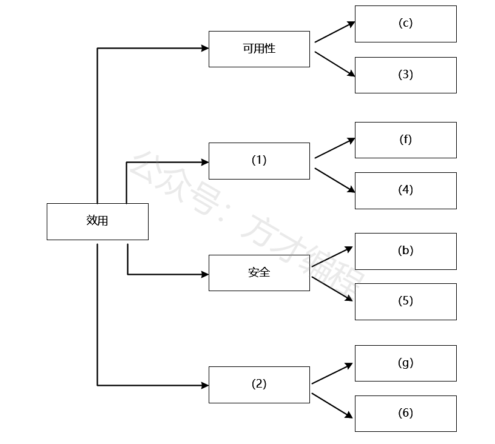
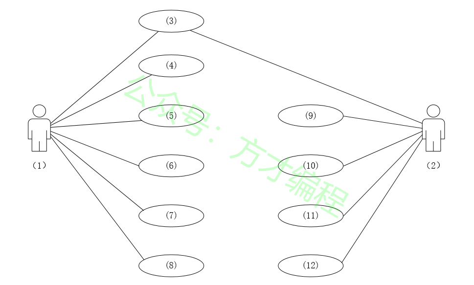
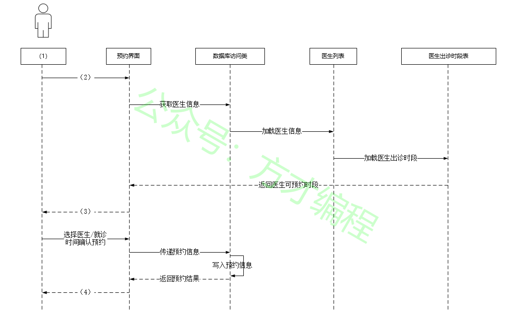
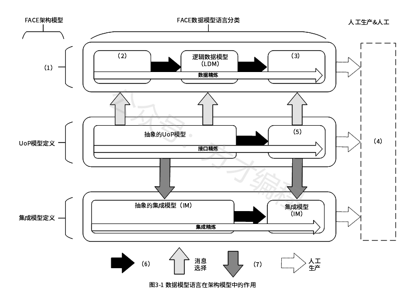
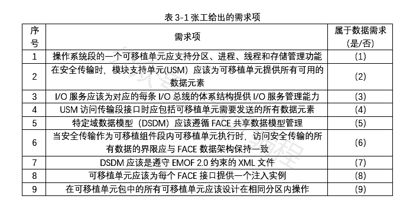
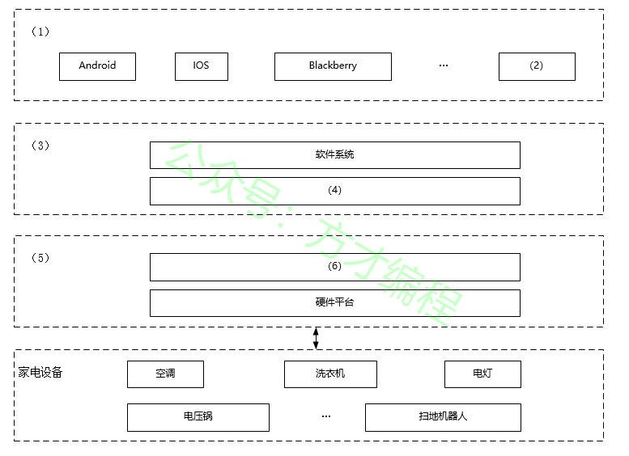

# 2021年11月 系统架构设计师 案例分析真题

> 来源：方才coding 软考真题

---

## 第1大题：软件架构设计与评估

### 试题1

阅读以下关于软件架构设计与评估的叙述，在答题纸上回答问题1和问题2。
【说明】
某公司拟开发一套机器学习应用开发平台，支持用户使用浏览器在线进行基于机器学习的智能应用开发活动。
该平台的核心应用场景是用户通过拖拽算法组件灵活定义机器学习流程，采用自助方式进行智能应用设计、实现与部署，并可以开发新算法组件加入平台中。在需求分析与架构设计阶段，公司提出的需求和质量属性描述如下：
（a）平台用户分为算法工程师、软件工程师和管理员等三种角色，不同角色的功能界面有所不同；
（b）平台应该具备数据库保护措施，能够预防核心数据库被非授权用户访问；
（c）平台支持分布式部署，当主站点断电后，应在20秒内将请求重定向到备用站点；
（d）平台支持初学者和高级用户两种界面操作模式，用户可以根据自己的情况灵活选择合适的模式；
（e）平台主站点宕机后，需要在15秒内发现错误并启用备用系统；
（f）在正常负载情况下，机器学习流程从提交到开始执行，时间间隔不大于5秒；
（g）平台支持硬件扩容与升级，能够在3人•天内完成所有部署与测试工作；
（h）平台需要对用户的所有操作过程进行详细记录，便于审计工作；
（i）平台部署后，针对界面风格的修改需要在3人•天内完成；
（j）在正常负载情况下，平台应在0.5秒内对用户的界面操作请求进行响应；
（k）平台应该与目前国内外主流的机器学习应用开发平台的界面风格保持一致；
（l）平台提供机器学习算法的远程调试功能，支持算法工程师进行远程调试。
在对平台需求、质量属性描述和架构特性进行分析的基础上，公司的架构师给出了三种候选的架构设计方案，公司目前正在组织相关专家对平台架构进行评估。架构进行评估。
问题 1
(9分)在架构评估过程中，质量属性效用树（utility tree）是对系统质量属性进行识别和优先级排序的重要工具。 请将合适的质量属性名称填入图1-1中(1)、(2)空白处，并从题干中的(a)-(l)中选择合适的质量属性描述，填入(3)-(6)空白处，完成该平台的效用树。

---
### 试题2

阅读以下关于软件架构设计与评估的叙述，在答题纸上回答问题1和问题2。
【说明】
某公司拟开发一套机器学习应用开发平台，支持用户使用浏览器在线进行基于机器学习的智能应用开发活动。
该平台的核心应用场景是用户通过拖拽算法组件灵活定义机器学习流程，采用自助方式进行智能应用设计、实现与部署，并可以开发新算法组件加入平台中。在需求分析与架构设计阶段，公司提出的需求和质量属性描述如下：
（a）平台用户分为算法工程师、软件工程师和管理员等三种角色，不同角色的功能界面有所不同；
（b）平台应该具备数据库保护措施，能够预防核心数据库被非授权用户访问；
（c）平台支持分布式部署，当主站点断电后，应在20秒内将请求重定向到备用站点；
（d）平台支持初学者和高级用户两种界面操作模式，用户可以根据自己的情况灵活选择合适的模式；
（e）平台主站点宕机后，需要在15秒内发现错误并启用备用系统；
（f）在正常负载情况下，机器学习流程从提交到开始执行，时间间隔不大于5秒；
（g）平台支持硬件扩容与升级，能够在3人•天内完成所有部署与测试工作；
（h）平台需要对用户的所有操作过程进行详细记录，便于审计工作；
（i）平台部署后，针对界面风格的修改需要在3人•天内完成；
（j）在正常负载情况下，平台应在0.5秒内对用户的界面操作请求进行响应；
（k）平台应该与目前国内外主流的机器学习应用开发平台的界面风格保持一致；
（l）平台提供机器学习算法的远程调试功能，支持算法工程师进行远程调试。
在对平台需求、质量属性描述和架构特性进行分析的基础上，公司的架构师给出了三种候选的架构设计方案，公司目前正在组织相关专家对平台架构进行评估。架构进行评估。
问题 2
(16分)针对该系统的功能，赵工建议采用解释器（interpreter）架构风格，李工建议采用管道过滤器（pipe-and-filter）的架构风格，王工则建议采用隐式调用（implicit invocation）架构风格。请针对平台的核心应用场景，从机器学习流程定义的灵活性和学习算法的可扩展性两个方面对三种架构风格进行对比与分析，并指出该平台更适合采用哪种架构风格。

---

## 第2大题：系统建模与分析

### 试题3

阅读以下关于软件系统设计与建模的叙述，在答题纸上回答问题1至问题3。
【说明】
某医院拟委托软件公司开发一套预约挂号管理系统，以便为患者提供更好的就医体验，为医院提供更加科学的预约管理。本系统的主要功能描述如下：(a)注册登录，(b)信息浏览，(c)账号管理，(d)预约挂号，(e)查询与取消预约，(F)号源管理，(g)报告查询，(h)预约管理，(i)报表管理和(j)信用管理等。
问题 1
(6 分)若采用面向对象方法对预约挂号管理系统进行分析，得到如图2-1所示的用例图。请将合适的参与者名称填入图2-1中的(1)和(2)处，使用题干给出的功能描述(a)
(j)，完善用例(3)
(12)的名称，将正确答案填在答题纸上。

---
### 试题4

阅读以下关于软件系统设计与建模的叙述，在答题纸上回答问题1至问题3。
【说明】
某医院拟委托软件公司开发一套预约挂号管理系统，以便为患者提供更好的就医体验，为医院提供更加科学的预约管理。本系统的主要功能描述如下：(a)注册登录，(b)信息浏览，(c)账号管理，(d)预约挂号，(e)查询与取消预约，(F)号源管理，(g)报告查询，(h)预约管理，(i)报表管理和(j)信用管理等。
问题 2
(10分)预约人员(患者)登录系统后发起预约挂号请求，进入预约界面。进行预约挂号时使用数据库访问类获取医生的相关信息，在数据库中调用医生列表，并调取医生出诊时段表，将医生出诊时段反馈到预约界面，并显示给预约人员；预约人员选择医生及就诊时间后确认预约，系统反馈预约结果，并向用户显示是否预约成功。
采用面向对象方法对预约挂号过程进行分析，得到如图2-2所示的顺序图，使用题干中给出的描述，完善图2-2中对象(1)，及消息(2)~(4)的名称，将正确答案填在答题纸上，请简要说明在描述对象之间的动态交互关系时，协作图与顺序图存在哪些区别。

---
### 试题5

阅读以下关于软件系统设计与建模的叙述，在答题纸上回答问题1至问题3。
【说明】
某医院拟委托软件公司开发一套预约挂号管理系统，以便为患者提供更好的就医体验，为医院提供更加科学的预约管理。本系统的主要功能描述如下：(a)注册登录，(b)信息浏览，(c)账号管理，(d)预约挂号，(e)查询与取消预约，(F)号源管理，(g)报告查询，(h)预约管理，(i)报表管理和(j)信用管理等。
问题 3
(9分)采用面向对象方法开发软件，通常需要建立对象模型、动态模型和功能模型，请分别介绍这3种模型，并详细说明它们之间的关联关系，针对上述模型，说明哪些模型可用于软件的需求分析？

---

## 第3大题：数据库与系统设计

### 试题6

阅读以下关于嵌入式数据架构设计的相关描述，在答题纸上回答问题1至问题3。
【说明】
数据架构(Data architecture）是系统架构设计的主要工作之一。它主要用于描述业务数据以及数据间的关系。数据架构着重考虑“数据需求”，关注的是持久化数据的组织。数据架构的设计过程主要包括：数据定义、数据分布与数据管理。某公司为了适应宇航装备的持续发展，提升本公司的核心竞争力，改变原来事件驱动的架构设计模式。公司领导将新产品架构规划工作交给张工。张工经过分析、调研给出了本企业宇航产品的未来架构规划方案。
问题 1
（9分）张工在规划方案中指出：宇航装备要实现以数据为中心的架构设计模式，就应改变传统的各个子系统独 的设计方式，打破原宇航装备的生产关系。为了达到这个目标，我们首先要解决装备数据的共享、管理和存储等问题，做好顶层的数据架构规划工作。请用300字以内的文字说明数据定义、数据分布与数据管理的具体内涵。

---
### 试题7

阅读以下关于嵌入式数据架构设计的相关描述，在答题纸上回答问题1至问题3。
【说明】
数据架构(Data architecture）是系统架构设计的主要工作之一。它主要用于描述业务数据以及数据间的关系。数据架构着重考虑“数据需求”，关注的是持久化数据的组织。数据架构的设计过程主要包括：数据定义、数据分布与数据管理。某公司为了适应宇航装备的持续发展，提升本公司的核心竞争力，改变原来事件驱动的架构设计模式。公司领导将新产品架构规划工作交给张工。张工经过分析、调研给出了本企业宇航产品的未来架构规划方案。
问题 2
（7分）张工在规划方案中提出公司未来产品设计要遵从一种开放式的架构体系，并在此基础上完善数据架构的设计工作，形成一套规格化的数据模型语言。张工给出了基于FACE（Future Airborne Capability Environment)架构的新产品架构，其中，图3-1说明了数据模型语言在架构模型中的作用。
请根据你所掌握的数据架构的相关知识，从以下a
g中进行选择，填充完善图3-1中的（1）
（7）空格。
a.数据模型定义
b.平台数据模型（PDM）
c.UoP（Unit of Portability）数据模型（UM）
d.提炼
e.传输定义
f.代码和配置
g.概念数据模型（CDM）

---
### 试题8

阅读以下关于嵌入式数据架构设计的相关描述，在答题纸上回答问题1至问题3。
【说明】
数据架构(Data architecture）是系统架构设计的主要工作之一。它主要用于描述业务数据以及数据间的关系。数据架构着重考虑“数据需求”，关注的是持久化数据的组织。数据架构的设计过程主要包括：数据定义、数据分布与数据管理。某公司为了适应宇航装备的持续发展，提升本公司的核心竞争力，改变原来事件驱动的架构设计模式。公司领导将新产品架构规划工作交给张工。张工经过分析、调研给出了本企业宇航产品的未来架构规划方案。
问题 3
（9分）“数据需求”是数据架构设计中需要着重考虑的问题。在张工给出的基于FACE架构的新产品架构中，分别就架构中的各个部分逐条给出了需求项。请判断表3-1给出的9项需求是否属于数据需求。

---

## 第4大题：Web应用架构

### 试题9

阅读以下关于数据库设计的叙述，在答题纸上回答问题1至问题3。
【说明】
某医药销售企业因业务发展，需要建立线上药品销售系统，为用户提供便捷的互联网药品销售服务。该系统除了常规药品展示、订单、用户交流与反馈功能外，还需要提供当前热销产品排名、评价分类管理等功能。通过对需求的分析，在数据管理上初步决定采用关系数据库（MySQL）和数据库缓存（Redis）的混合架构实现。
经过规范化设计之后，该系统的部分数据库表结构如下所示。
供应商（供应商ID，供应商名称，联系方式，供应商地址）；
药品（药品ID，药品名称，药品型号，药品价格，供应商ID）；
药品库存（药品ID，当前库存数量）；
订单（订单号码，药品ID，供应商ID，药品数量，订单金额）。
问题 1
（9分）在系统初步运行后，发现系统数据访问性能较差。经过分析，刘工认为原来数据库规范化设计后，关系表过于细分，造成了大量的多表关联查询，影响了性能。例如当用户查询商品信息时，需要同时显示该药品的信息、供应商的信息、当前库存等信息。
为此，刘工认为可以采用反规范化设计来改造药品关系的结构，以提高查询性能。修改后的药品关系结构为：
药品(药品ID，药品名称，药品型号，药品价格，供应商ID，供应商名称，当前库存数量) ；
请用200字以内的文字说明常见的反规范化设计方法，并说明用户查询商品信息应该采用哪种反规范化设计方法。

---
### 试题10

阅读以下关于数据库设计的叙述，在答题纸上回答问题1至问题3。
【说明】
某医药销售企业因业务发展，需要建立线上药品销售系统，为用户提供便捷的互联网药品销售服务。该系统除了常规药品展示、订单、用户交流与反馈功能外，还需要提供当前热销产品排名、评价分类管理等功能。通过对需求的分析，在数据管理上初步决定采用关系数据库（MySQL）和数据库缓存（Redis）的混合架构实现。
经过规范化设计之后，该系统的部分数据库表结构如下所示。
供应商（供应商ID，供应商名称，联系方式，供应商地址）；
药品（药品ID，药品名称，药品型号，药品价格，供应商ID）；
药品库存（药品ID，当前库存数量）；
订单（订单号码，药品ID，供应商ID，药品数量，订单金额）。
问题 2
王工认为，反规范化设计可提高查询的性能，但必然会带来数据的不一致性问题。请用200字以内的文字说明在反规范化设计中，解决数据不一致性问题的三种常见方法，并说明该系统应该采用哪种方法。

---
### 试题11

阅读以下关于数据库设计的叙述，在答题纸上回答问题1至问题3。
【说明】
某医药销售企业因业务发展，需要建立线上药品销售系统，为用户提供便捷的互联网药品销售服务。该系统除了常规药品展示、订单、用户交流与反馈功能外，还需要提供当前热销产品排名、评价分类管理等功能。通过对需求的分析，在数据管理上初步决定采用关系数据库（MySQL）和数据库缓存（Redis）的混合架构实现。
经过规范化设计之后，该系统的部分数据库表结构如下所示。
供应商（供应商ID，供应商名称，联系方式，供应商地址）；
药品（药品ID，药品名称，药品型号，药品价格，供应商ID）；
药品库存（药品ID，当前库存数量）；
订单（订单号码，药品ID，供应商ID，药品数量，订单金额）。
问题 3
该系统采用了Redis来实现某些特定功能(如当前热销药品排名等)，同时将药品关系数据放到内存以提高商品查询的性能，但必然会造成Redis和MySQL的数据实时同步问题。
（1）Redis的数据类型包括String、 Hash、 List、 Set和ZSet等，请说明实现当前热销药品排名的功能应该选择使用哪种数据类型。
（2）请用200字以内的文字解释说明解决Redis和MySQL数据实时同步问题的常见方案。

---

## 第5大题：嵌入式与实时系统

### 试题12

阅读以下关于Web系统架构设计的叙述，在答题纸上回答问题1至问题3。
【说明】
某公司拟开发一个智能家居管理系统，该系统的主要功能需求如下：1)用户可使用该系统客户端实现对家居设备的控制，且家居设备可向客户端反馈实时状态；2)支持家居设备数据的实时存储和查询；3)基于用户数据，挖掘用户生活习惯，向用户提供家居设备智能化使用建议。
基于上述需求，该公司组建了项目组，在项目会议上，张工给出了基于家庭网关的传统智能家居管理系统的设计思路，李工给出了基于云平台的智能家居系统的设计思路。经过深入讨论，公司决定采用李工的设计思路。
问题 1
(8分)请用400字以内的文字简要描述基于家庭网关的传统智能家居管理系统和基于云平台的智能家居管理系统在网关管理、数据处理和系统性能等方面的特点，以说明项目组选择李工设计思路的原因。

---
### 试题13

阅读以下关于Web系统架构设计的叙述，在答题纸上回答问题1至问题3。
【说明】
某公司拟开发一个智能家居管理系统，该系统的主要功能需求如下：1)用户可使用该系统客户端实现对家居设备的控制，且家居设备可向客户端反馈实时状态；2)支持家居设备数据的实时存储和查询；3)基于用户数据，挖掘用户生活习惯，向用户提供家居设备智能化使用建议。
基于上述需求，该公司组建了项目组，在项目会议上，张工给出了基于家庭网关的传统智能家居管理系统的设计思路，李工给出了基于云平台的智能家居系统的设计思路。经过深入讨论，公司决定采用李工的设计思路。
问题 2
(12分)请从下面给出的(a) ~ (j) 中进行选择，补充完善图5-1中空(1) ~ (6)处的内容，协助李工完成该系统的架构设计方案。
(a) Wi-Fi
(b) 蓝牙
(c)驱动程序
(d)数据库
(e)家庭网关
(f)云平台
(g)微服务
(h)用户终端
(i)鸿蒙
(j)TCP/IP

---
### 试题14

阅读以下关于Web系统架构设计的叙述，在答题纸上回答问题1至问题3。
【说明】
某公司拟开发一个智能家居管理系统，该系统的主要功能需求如下：1)用户可使用该系统客户端实现对家居设备的控制，且家居设备可向客户端反馈实时状态；2)支持家居设备数据的实时存储和查询；3)基于用户数据，挖掘用户生活习惯，向用户提供家居设备智能化使用建议。
基于上述需求，该公司组建了项目组，在项目会议上，张工给出了基于家庭网关的传统智能家居管理系统的设计思路，李工给出了基于云平台的智能家居系统的设计思路。经过深入讨论，公司决定采用李工的设计思路。
问题 3
(5分)该系统需实现用户终端与服务端的双向可靠通信，请用300字以内的文字从数据传输可靠性的角度对比分析TCP和UDP通信协议的不同，并说明该系统应采用哪种通信协议。

---

## 附录：提取的图片

- `img_qr_5b2991402eee.png`：微信小程序二维码，已省略
- `img_exam_109248406d2f.png`：第1大题第1小题架构图/表格图
- `img_logo_fb5107e4dc49.jpeg`：站点 Logo，已省略
- `img_exam_32e5408d80d5.png`：第2大题第1小题架构图/表格图
- `img_exam_cc40917a0733.png`：第2大题第2小题架构图/表格图
- `img_exam_35c6c98dd013.png`：第3大题第2小题架构图/表格图
- `img_exam_1c4ef4dc2b65.png`：第3大题第3小题架构图/表格图
- `img_exam_abca94beed08.png`：第5大题第2小题架构图/表格图
