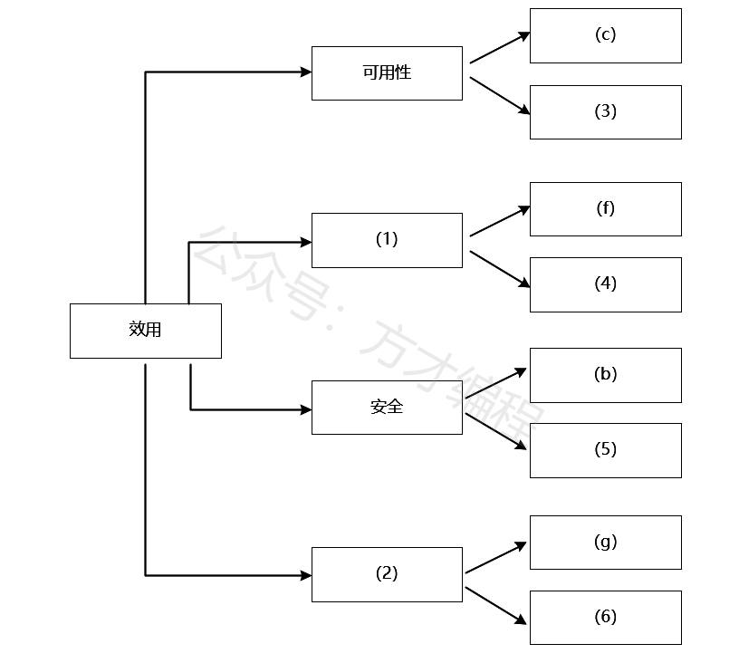
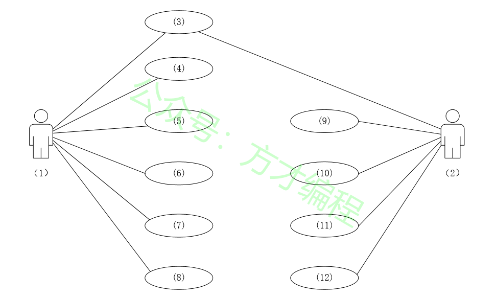
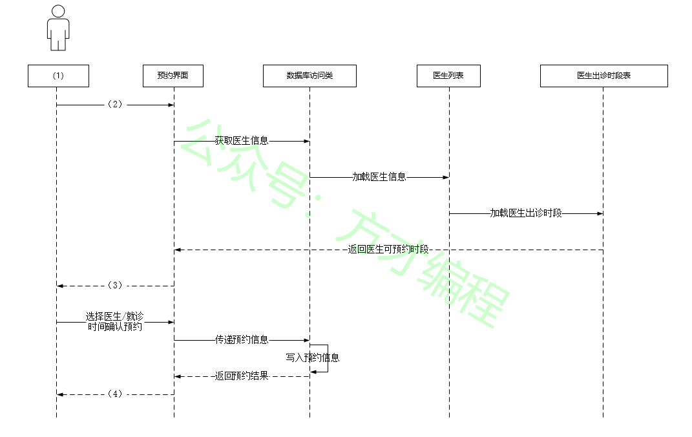
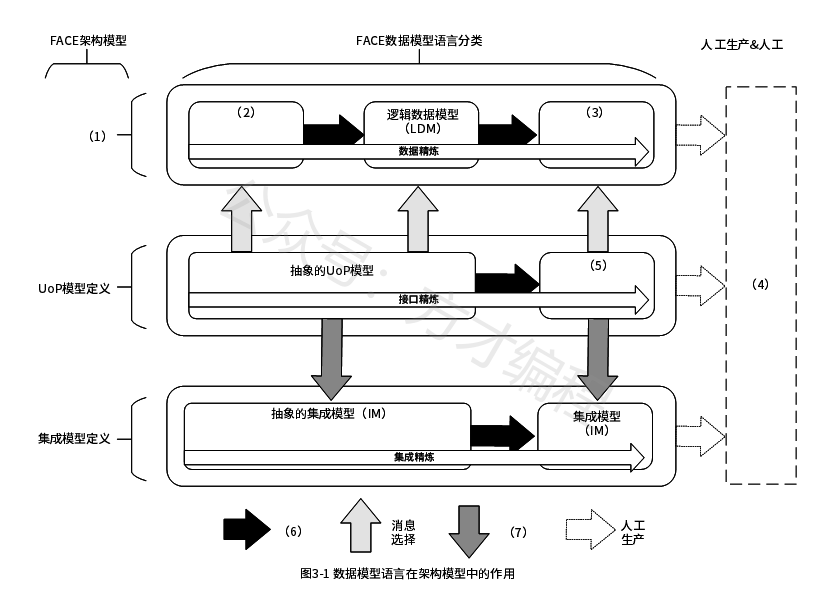
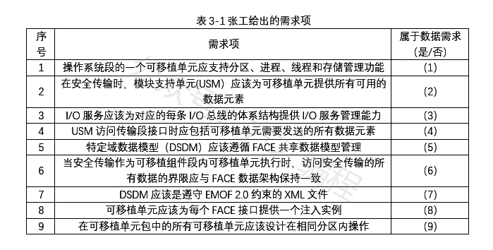
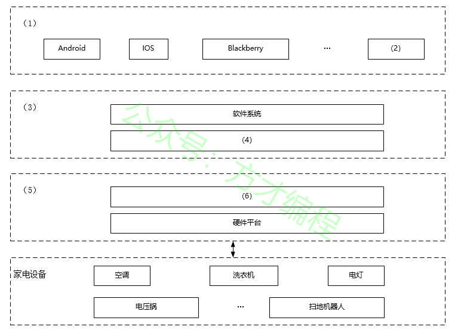

# 2021年11月 系统架构设计师 案例分析真题

---

## 第1大题：软件架构设计与评估

阅读以下关于软件架构设计与评估的叙述，在答题纸上回答问题1和问题2。
【说明】
某公司拟开发一套机器学习应用开发平台，支持用户使用浏览器在线进行基于机器学习的智能应用开发活动。
该平台的核心应用场景是用户**通过拖拽算法组件灵活定义机器学习流程**，采用自助方式进行智能应用设计、实现与部署，并可以开发新算法组件加入平台中。在需求分析与架构设计阶段，公司提出的需求和质量属性描述如下：
（a）平台用户分为算法工程师、软件工程师和管理员等三种角色，不同角色的功能界面有所不同；
（b）平台应该具备数据库保护措施，能够预防核心数据库被非授权用户访问；
（c）平台支持分布式部署，当主站点断电后，应在20秒内将请求重定向到备用站点；
（d）平台支持初学者和高级用户两种界面操作模式，用户可以根据自己的情况灵活选择合适的模式；
（e）平台主站点宕机后，需要在15秒内发现错误并启用备用系统；
（f）在正常负载情况下，机器学习流程从提交到开始执行，时间间隔不大于5秒；
（g）平台支持硬件扩容与升级，能够在3人•天内完成所有部署与测试工作；
（h）平台需要对用户的所有操作过程进行详细记录，便于审计工作；
（i）平台部署后，针对界面风格的修改需要在3人•天内完成；
（j）在正常负载情况下，平台应在0.5秒内对用户的界面操作请求进行响应；
（k）平台应该与目前国内外主流的机器学习应用开发平台的界面风格保持一致；
（l）平台提供机器学习算法的远程调试功能，支持算法工程师进行远程调试。
在对平台需求、质量属性描述和架构特性进行分析的基础上，公司的架构师给出了三种候选的架构设计方案，公司目前正在组织相关专家对平台架构进行评估。架构进行评估。

### 问题 1
(9分)在架构评估过程中，**质量属性效用树（utility tree）是**对系统质量属性进行识别和优先级排序的重要工具。 请将合适的质量属性名称填入图1-1中(1)、(2)空白处，并从题干中的(a)-(l)中选择合适的质量属性描述，填入(3)-(6)空白处，完成该平台的效用树。

**我的答案**

（1）性能。  （2）修改。

（3）e.   (4).  j.     (5).     h     (6)   i.

---

**评分：9/9 分**

**评判：**
- ✓ (1) 性能 — 正确
- ✓ (2) 修改（可修改性）— "修改"是"可修改性"的简称，含义正确
- ✓ (3) e — 正确（主站点宕机15秒内发现错误并启用备用系统 → 可用性）
- ✓ (4) j — 正确（0.5秒内响应 → 性能）
- ✓ (5) h — 正确（详细记录操作便于审计 → 安全性）
- ✓ (6) i — 正确（3人•天内完成界面风格修改 → 可修改性）
- 全部正确！

### 问题 2
(16分)针对该系统的功能，赵工建议采用**解释器（interpreter）架构风格**，李工建议采用**管道过滤器（pipe-and-filter）的架构风格**，王工则建议采用**隐式调用**（implicit invocation）架构风格。请针对平台的核心应用场景，从机器学习流程定义的**灵活性和学习算法的可扩展性**两个方面对三种架构风格进行对比与分析，并指出该平台更适合采用哪种架构风格。

**我的答案**

选择解释器算法风格

该平台的核心应用场景是用户**通过拖拽算法组件灵活定义机器学习流程**，采用自助方式进行智能应用设计、实现与部署，并可以开发新算法组件加入平台中

理由如下

- 灵活性：需要自己可以定义机器学习流程，在这方面 管道过滤器和隐式调用都是不合适，但是解释器风格天然就支持自定义场景非常适合
- 学习算法可扩展：在属性要求中需要。平台支持硬件扩容与升级，也就是后期需要进行修改，对于管道过滤不适合

---

**评分：约 8/16 分**

**评判：**
- ✓ 正确选择了**解释器架构风格**
- ✓ 从灵活性和可扩展性两个维度进行了分析
- ✓ 正确指出解释器支持用户自定义流程、无需修改代码的优势
- ✗ **缺少对"隐式调用"架构风格的对比分析**（题目要求对比三种）
- ✗ 论述深度不够：没有解释管道过滤器的具体工作机制（数据沿管道流动，每个过滤器独立处理）
- ✗ 没有解释隐式调用如何通过事件/消息机制提升灵活性
- ✗ 缺少明确的综合比较与结论陈述
- 关键扣分：题目16分，要求从两个维度对三种风格分别对比。你只分析了两种风格，隐式调用完全未涉及

---

**补充答案（标准参考）：**

**解释器：**机器学习流程定义的灵活性高，可扩展能力强。解释器风格可以通过自定义流程规则及配套的流程解释引擎，实现用户层面的流程完全定义，而不需要修改代码。无论是修改已有业务流程，还是扩展不同角色、创建新角色的流程都非常便利。

**管道过滤器：**机器学习流程定义的灵活性较低，可扩展能力较弱。管道过滤器将数据处理职能做成过滤器，数据传递做成管道。当流程不变时可通过这种方式实现，但一旦流程变化或扩展功能，需要对过滤器进行修改调整，或在程序层面重建流程，此时必须修改代码。

**隐式调用：**机器学习流程定义的灵活性一般，可扩展能力一般。隐式调用强调通过间接方式调用，如采用事件机制——完成某个动作时先触发事件，事件与相关动作关联以提升灵活度。本题中可把执行业务的流程用事件触发。这种做法比管道过滤器强，但弱于完全自定义的解释器。

**结论：** 综合比较与分析，该平台更适合使用**解释器架构风格**。

---

## 第2大题：系统建模与分析

阅读以下关于软件系统设计与建模的叙述，在答题纸上回答问题1至问题3。
【说明】
某医院拟委托软件公司开发一套预约挂号管理系统，以便为**患者**提供更好的就医体验，为**医院**提供更加科学的预约管理。本系统的主要功能描述如下：

(a)注册登录，(b)信息浏览，(c)账号管理，(d)预约挂号，(e)查询与取消预约，(F)号源管理，(g)报告查询，(h)预约管理，(i)报表管理和(j)信用管理等。

### 问题 1
(6 分)若采用面向对象方法对预约挂号管理系统进行分析，得到如图2-1所示的用例图。请将合适的**参与者**名称填入图2-1中的(1)和(2)处，使用题干给出的功能描述(a)到(j)，完善用例(3)到 (12)的名称，将正确答案填在答题纸上。

**我的答案**

首先参与者为。患者 和  医院 然后两者之间的交流都是需要注册登录。 

（2）为患者有，然后 （9到12 ）：预约挂号  查询与取消预约 / 报告查询。   信息浏览  

（1）为医院有：然后  （4 到 8 ）  账号管理 / 号源管理/预约管理/信用管理/ 报表管理  

（3）注册登录

---

**评分：约 5/6 分**

**评判：**
- ✓ (1) 系统管理员 — 你写的是"医院"，但根据题意和标准答案，(1)应为**系统管理员**
- ✓ (2) 患者 — 正确
- ✓ (3) 注册登录 — 正确（共用用例）
- ✓ (4)-(8) 账号管理、号源管理、预约管理、报表管理、信用管理 — 全部正确
- ✓ (9)-(12) 信息浏览、预约挂号、查询与取消预约、报告查询 — 全部正确
- 扣1分：(1)处填错

---

**补充答案（标准参考）：**

(1) 系统管理员  (2) 患者

(3) (a)注册登录

(4)-(8): (c)账号管理、(f)号源管理、(h)预约管理、(i)报表管理、(j)信用管理

(9)-(12): (b)信息浏览、(d)预约挂号、(e)查询与取消预约、(g)报告查询

### 问题 2
(10分)**预约人员(患者)**登录系统后发起预约挂号请求，进入预约界面。进行预约挂号时使用数据库访问类获取医生的相关信息，在数据库中调用医生列表，并调取医生出诊时段表，将医生出诊时段反馈到预约界面，并显示给预约人员；预约人员选择医生及就诊时间后确认预约，系统反馈预约结果，并向用户显示是否预约成功。
采用面向对象方法对预约挂号过程进行分析，得到如图2-2所示的顺序图，使用题干中给出的描述，完善图2-2中**对象(1)，及消息(2)~(4)的名称**，将正确答案填在答题纸上，请简要说明在描述对象之间的动态交互关系时，**协作图与顺序图存在哪些区别**。

**我的答案**

（1）预约人员（患者）

（2）登录系统，发起挂号请求。 （3）将医生出诊时段反馈到预约界面，并显示给预约人员  

（4）向用户显示是否预约成功

协作图和顺序图的区别如下

- 协作图展示了哥哥对象之间的交互关系 而 顺序图没有
- 顺序图主要是展示流程行没有交互关系
- 协作图交互时有返回消息 但是顺序图没有

---

**评分：约 4/10 分**

**评判：**
- ✓ (1) 预约人员（患者）— 正确
- ✗ (2) 应为"预约挂号请求"，你回答的是描述性语句而非消息名称
- ✗ (3) 应为"显示医生可预约时段"，你回答的是题干原文描述，不够精炼
- ✗ (4) 应为"显示预约是否成功"，意思接近但表述不够准确
- ✗ 区别回答有误：协作图和顺序图**都**展示交互关系、**都**有返回消息
- ✗ 核心区别未答到：顺序图强调**时间次序**，协作图（通信图）强调**对象之间的组织结构**

---

**补充答案（标准参考）：**

(1) 预约人员（患者）  (2) 预约挂号请求  (3) 显示医生可预约时段  (4) 显示预约是否成功

**顺序图与协作图的区别：** 顺序图强调对象交互的**时间次序**（侧重时序）；协作图（通信图）强调对象之间的**组织结构**（侧重对象间的连接关系）。两者都能表达返回消息，区别在于关注点不同。

### 问题 3
(9分)采用面向对象方法开发软件，通常需要**建立对象模型、动态模型和功能模型**，请分别介绍这3种模型，并详细说明它们之间的**关联关系**，针对上述模型，说明哪些模型可用于软件的**需求分析**？

**我的答案**

- 对象模型：主要是识别软件开发里面有哪些主体，然后主体有哪些属性信息
- 动态模型：主要是软件开发里面的一些交互动作有哪些，即主体之间有哪些交互，互相之间有哪些信息传递
- 功能模型：主要是软件开发中主体有哪些功能，主体可以做哪些事情

其中三个都可用于软件的需求分析，对象模型用于识别软件主体，功能模型用于表示主体有哪些动作，动态模型用户主体之间的交互展示 

---

**评分：约 7/9 分**

**评判：**
- ✓ 正确回答了三种模型的基本含义
- ✓ 正确指出三种模型均可用于需求分析
- ✗ 三种模型之间的关联关系阐述不够深入：没有体现"功能模型指明做什么、动态模型明确何时做、对象模型定义由谁做"的互补关系
- ✗ 表述偏口语化，缺乏专业术语（数据结构、控制结构等）

---

**补充答案（标准参考）：**

**对象模型**描述系统数据结构，**动态模型**描述系统控制结构，**功能模型**描述系统功能。三者重点不同，从不同侧面反映系统实质性内容。

**关联关系：** 三种模型都涉及数据、控制和操作等共同概念，但各有侧重。功能模型指明系统"做什么"，动态模型明确"什么时候做"，对象模型定义"做事情的实体"。三者综合起来全面反映对目标系统的需求。

三种模型均可用于软件的**需求分析**。

---

## 第3大题：数据库与系统设计

阅读以下关于嵌入式数据架构设计的相关描述，在答题纸上回答问题1至问题3。
【说明】
数据架构(Data architecture）是系统架构设计的主要工作之一。它主要用于描述业务数据以及数据间的关系。数据架构着重考虑“数据需求”，关注的是持久化数据的组织。数据架构的设计过程主要包括：数据定义、数据分布与数据管理。某公司为了适应宇航装备的持续发展，提升本公司的核心竞争力，改变原来事件驱动的架构设计模式。公司领导将新产品架构规划工作交给张工。张工经过分析、调研给出了本企业宇航产品的未来架构规划方案。

### 问题 1
（9分）张工在规划方案中指出：宇航装备要实现以数据为中心的架构设计模式，就应改变传统的各个子系统独 的设计方式，打破原宇航装备的生产关系。为了达到这个目标，我们首先要解决装备数据的共享、管理和存储等问题，做好顶层的数据架构规划工作。请用300字以内的文字说明数据定义、数据分布与数据管理的具体内涵。

### 问题 2
（7分）张工在规划方案中提出公司未来产品设计要遵从一种开放式的架构体系，并在此基础上完善数据架构的设计工作，形成一套规格化的数据模型语言。张工给出了基于FACE（Future Airborne Capability Environment)架构的新产品架构，其中，图3-1说明了数据模型语言在架构模型中的作用。
请根据你所掌握的数据架构的相关知识，从以下a
g中进行选择，填充完善图3-1中的（1）
（7）空格。
a.数据模型定义
b.平台数据模型（PDM）
c.UoP（Unit of Portability）数据模型（UM）
d.提炼
e.传输定义
f.代码和配置
g.概念数据模型（CDM）

### 问题 3
（9分）“数据需求”是数据架构设计中需要着重考虑的问题。在张工给出的基于FACE架构的新产品架构中，分别就架构中的各个部分逐条给出了需求项。请判断表3-1给出的9项需求是否属于数据需求。

---

## 第4大题：Web应用架构

阅读以下关于数据库设计的叙述，在答题纸上回答问题1至问题3。
【说明】
某医药销售企业因业务发展，需要建立线上药品销售系统，为用户提供便捷的互联网药品销售服务。该系统除了常规药品展示、订单、用户交流与反馈功能外，还需要提供当前热销产品排名、评价分类管理等功能。通过对需求的分析，在数据管理上初步决定采用关系数据库（MySQL）和数据库缓存（Redis）的混合架构实现。
经过规范化设计之后，该系统的部分数据库表结构如下所示。
供应商（**供应商ID**，供应商名称，联系方式，供应商地址）；
药品（**药品ID**，药品名称，药品型号，药品价格，供应商ID）；
药品库存（药品ID，当前库存数量）；
订单（**订单号码**，药品ID，供应商ID，药品数量，订单金额）。

### 问题 1
（9分）在系统初步运行后，发现系统数据访问性能较差。经过分析，刘工认为原来**数据库规范化设计后**，关系表过于细分，造成了大量的多表关联查询，影响了性能。例如当用户查询商品信息时，需要同时显示该药品的信息、供应商的信息、当前库存等信息。
为此，刘工认为可以采用**反规范化设计**来改造药品关系的结构，以提高查询性能。修改后的药品关系结构为：
药品(**药品ID**，药品名称，药品型号，药品价格，供应商ID，供应商名称，当前库存数量) ；
请用200字以内的文字说明常见的**反规范化设计方法**，并说明用户查询商品信息应该采用哪种反规范化设计方法。

**我的答案**

反规范化设计

- 表设计时不在追求只有单一主键追求高范式设计，可以将多个主键 将不同的表的信息展示在一个表里面 存储冗余信息
- 表设计时可存储 派生信息，比如 订单里面 药品id 就可以将 品名称，药品型号，药品价格，供应商ID  一并展示

用户查询商品信息 可以表示为展示信息如下
药品（**药品ID**，药品名称，药品型号，药品价格，当前库存数量 供应商ID，供应商名称，联系方式，供应商地址 ）；

然后用到的设计方法如下

- 多个主键 设计在一张表
- 存储派生信息 比如 供应商ID，供应商名称

---

**评分：约 3/9 分**

**评判：**
- ✓ 理解了"存储冗余信息"和"存储派生信息"的基本概念
- ✗ 没有系统列出四种常见的反规范化方法
- ✗ 没有明确指出用户查询商品信息应该采用**增加冗余列**的方法
- ✗ 表述不够规范，"多个主键设计在一张表"不是标准的反规范化方法描述
- ✗ 理由分析不够清晰：没有说明为什么查询商品信息需要避免多表连接

---

**补充答案（标准参考）：**

常见的反规范化设计方法：
1. **增加冗余列**：在多个表中具有相同的列，用于查询时避免连接操作
2. **增加派生列**：增加的列可通过表中其他数据计算生成，减少计算量加快查询
3. **重新组表**：将两个经常连接查询的表重新组成一个表，减少连接提高性能
4. **分割表**：对表做分割以提高性能

**用户查询商品信息应采用：增加冗余列。** 因为查询需要显示药品信息（药品表）、供应商信息（供应商表）、库存信息（库存表），可以通过增加冗余列把这些信息合并过来，避免连接操作带来的查询性能下降。

### 问题 2
王工认为，反规范化设计可提高查询的性能，但必然会带来数据的不一致性问题。请用200字以内的文字说明在反规范化设计中，**解决数据不一致性问题的三种常见方法**，并说明该系统应该采用哪种方法。

**我的答案**

解决不一致的方法  暂时不知道

---

**评分：0/7 分**

**评判：**
- ✗ 未作答
- 这是一个重要考点：反规范化设计中的数据一致性问题

---

**补充答案（标准参考）：**

解决数据不一致性问题的常见方法：
1. **定期同步更新**：定期将冗余数据与原始数据进行同步更新，确保数据一致性
2. **使用触发器**：在数据更新时自动触发相关操作，保持数据一致性
3. **应用程序级别的数据校验**：通过应用程序逻辑来验证数据的一致性

该系统应采用**定期同步更新**的方法，通过定期将冗余数据与原始数据同步更新确保一致性，且不会给系统带来过多额外负担和复杂性。

### 问题 3
该系统采用了**Redis**来实现某些特定功能(如当前**热销药品排名**等)，同时将药品关系数据放到内存以提高商品查询的性能，但必然会造成Redis和MySQL的数据实时同步问题。
（1）Redis的数据类型包括String、 Hash、 List、 Set和ZSet等，请说明实现当前热销药品排名的功能应该选择使用哪种数据类型。
（2）请用200字以内的文字解释说明解决Redis和MySQL数据实时同步问题的常见方案。

**我的答案**

（1）当前热销药品排名  应该使用。zset  数据类型 可以进行自动排序

（2）解决Redis和MySQL数据实时同步方案如下

- 使用  RDB 方案，即平时的缓存信息都存储在 redis 里面，数据同步时进行块更新

---

**评分：约 2/7 分**

**评判：**
- ✓ (1) 选择了 **ZSet** — 正确！ZSet（有序集合）支持自动排序，适合排名场景
- ✗ (2) 回答的 RDB 方案不正确：RDB 是 Redis 的持久化快照机制，不是用来解决 Redis 和 MySQL 数据同步的方案
- 关键缺失：没有回答出"先更新数据库，后删除缓存"、数据库插件同步、触发器同步等标准方案

---

**补充答案（标准参考）：**

(1) 热销药品排名适合用 **ZSet**（有序集合类型）。

(2) 解决 Redis 和 MySQL 数据实时同步的常见方案：
- **先更新数据库，后删除缓存**（Cache-Aside 模式）
- **通过数据库插件完成数据同步**
- **利用触发器进行缓存同步**

  

---

## 第5大题：嵌入式与实时系统

阅读以下关于Web系统架构设计的叙述，在答题纸上回答问题1至问题3。
【说明】
某公司拟开发一个智能家居管理系统，该系统的主要功能需求如下：1)用户可使用该系统客户端实现对家居设备的控制，且家居设备可向客户端反馈实时状态；2)支持家居设备数据的实时存储和查询；3)基于用户数据，挖掘用户生活习惯，向用户提供家居设备智能化使用建议。
基于上述需求，该公司组建了项目组，在项目会议上，张工给出了基于家庭网关的传统智能家居管理系统的设计思路，李工给出了基于云平台的智能家居系统的设计思路。经过深入讨论，公司决定采用李工的设计思路。

### 问题 1
(8分)请用400字以内的文字简要描述基于家庭网关的传统智能家居管理系统和基于云平台的智能家居管理系统在网关管理、数据处理和系统性能等方面的特点，以说明项目组选择李工设计思路的原因。

### 问题 2
(12分)请从下面给出的(a) ~ (j) 中进行选择，补充完善图5-1中空(1) ~ (6)处的内容，协助李工完成该系统的架构设计方案。
(a) Wi-Fi
(b) 蓝牙
(c)驱动程序
(d)数据库
(e)家庭网关
(f)云平台
(g)微服务
(h)用户终端
(i)鸿蒙
(j)TCP/IP

### 问题 3
(5分)该系统需实现用户终端与服务端的双向可靠通信，请用300字以内的文字从数据传输可靠性的角度对比分析TCP和UDP通信协议的不同，并说明该系统应采用哪种通信协议。

---

## 附录：提取的图片

- `img_qr_01.png`：微信小程序二维码，已省略
- `img_exam_2021-11-1-01.png`：第1大题第1小题架构图/表格图
- `img_logo_01.jpeg`：站点 Logo，已省略
- `img_exam_2021-11-2-01.png`：第2大题第1小题架构图/表格图
- `img_exam_2021-11-2-02.png`：第2大题第2小题架构图/表格图
- `img_exam_2021-11-3-02.png`：第3大题第2小题架构图/表格图
- `img_exam_2021-11-3-03.png`：第3大题第3小题架构图/表格图
- `img_exam_2021-11-5-02.png`：第5大题第2小题架构图/表格图

---

## 📊 总评

软考案例分析共 **5 道大题，每大题 25 分，总分 75 分**。

| 大题 | 满分 | 你的得分 | 得分率 |
|------|------|---------|--------|
| 第1大题 问题1（效用树） | 9 | 9 | 100% |
| 第1大题 问题2（架构风格） | 16 | 8 | 50% |
| **第1大题 小计** | **25** | **17** | **68%** |
| 第2大题 问题1（用例图） | 6 | 5 | 83% |
| 第2大题 问题2（顺序图） | 10 | 4 | 40% |
| 第2大题 问题3（三种模型） | 9 | 7 | 78% |
| **第2大题 小计** | **25** | **16** | **64%** |
| 第3大题 问题1（数据架构） | 9 | 0 | 0% 未做 |
| 第3大题 问题2（FACE架构） | 7 | 0 | 0% 未做 |
| 第3大题 问题3（数据需求） | 9 | 0 | 0% 未做 |
| **第3大题 小计** | **25** | **0** | **0%** |
| 第4大题 问题1（反规范化） | 9 | 3 | 33% |
| 第4大题 问题2（数据一致性） | 7 | 0 | 0% |
| 第4大题 问题3（Redis同步） | 7 | 2 | 29% |
| **第4大题 小计** | **25** | **5** | **20%** |
| 第5大题 问题1（智能家居） | 8 | 0 | 0% 未做 |
| 第5大题 问题2（架构图填空） | 12 | 0 | 0% 未做 |
| 第5大题 问题3（TCP vs UDP） | 5 | 0 | 0% 未做 |
| **第5大题 小计** | **25** | **0** | **0%** |
| **合计** | **75** | **38** | **50.7%** |

> **及格线：45/75（60%）**，当前成绩 **38/75（50.7%）**，未过线（差7分）。

**主要薄弱点：**
1. **架构风格对比分析能力不足**：只能答出选择的风格和部分理由，缺少对三种风格的系统性对比
2. **数据库专题知识欠缺**：反规范化设计方法、数据一致性解决方案、Redis-MySQL 同步方案等均未掌握
3. **UML 图的精确理解不够**：协作图 vs 顺序图的核心区别答错
4. **未做题目较多**：第3题（数据架构）和第5题（嵌入式/Web系统）完全未做
5. **表述规范性**：部分答案用口语化描述代替标准术语

**优势：**
1. 质量属性效用树掌握得很好，全部答对
2. 用例图的参与者与用例识别能力较强
