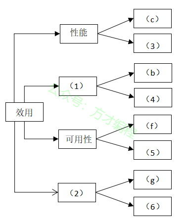
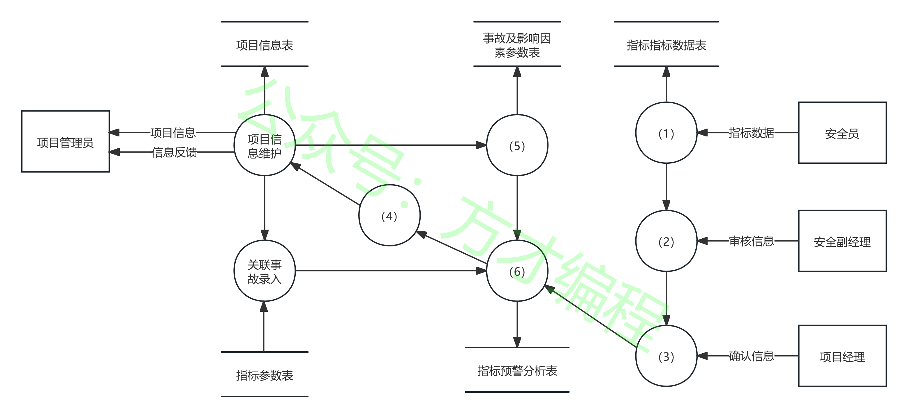
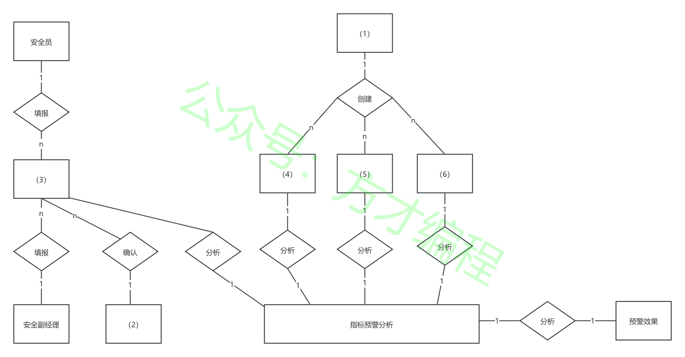
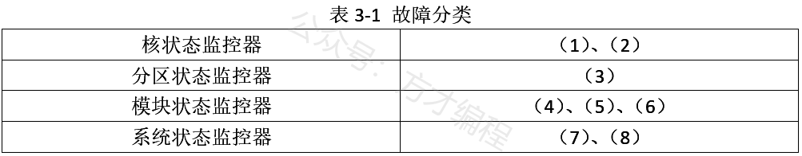
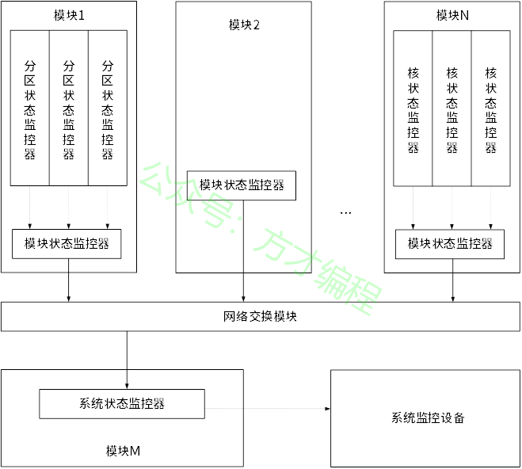
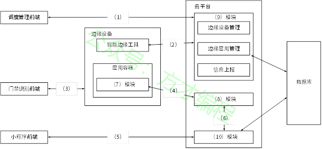

# 2022年11月 系统架构设计师 案例分析真题

> 来源：方才coding 软考真题

---

## 第1大题：软件架构设计与评估

### 试题1

阅读以下关于软件架构设计与评估的叙述，在答题纸上回答问题1和问题2。
【说明】
某电子商务公司拟升级其会员与促销管理系统，向用户提供个性化服务，提高用户的粘性。在项目立项之初，公司领导层一致认为本次升级的主要目标是提升会员管理方式的灵活性，由于当前用户规模不大，业务也相对简单，系统性能方面不做过多考虑。新系统除了保持现有的四级固定会员制度外，还需要根据用户的消费金额、偏好、重复性等相关特征动态调整商品的折扣力度，并支持在特定的活动周期内主动筛选与活动主题高度相关的用户集合，提供个性化的打折促销活动。
在需求分析与架构设计阶段，公司提出的需求和质量属性描述如下：
（a）管理员能够在页面上灵活设置折扣力度规则和促销活动逻辑，设置后即可生效；
（b）系统应该具备完整的安全防护措施，支持对恶意攻击行为进行检测与报警；
（c）在正常负载情况下，系统应在0.3秒内对用户的界面操作请求进行响应；
（d）用户名是系统唯一标识，要求以字母开头，由数字和字母组合而成，长度不少于6个字符；
（e）在正常负载情况下，用户支付商品费用后在3秒内确认订单支付信息；
（f）系统主站点电力中断后，应在5秒内将请求重定向到备用站点；
（g）系统支持横向存储扩展，要求在2人•天内完成所有的扩展与测试工作；
（h）系统宕机后，需要在10秒内感知错误，并自动启动热备份系统；
（i）系统需要内置接口函数，支持开发团队进行功能调试与系统诊断；
（j）系统需要为所有的用户操作行为进行详细记录，便于后期查阅与审计；
（k）支持对系统的外观进行调整和配置，调整工作需要在4•人天内完成。
在对系统需求、质量属性描述和架构特性进行分析的基础上，系统架构师给出了两种候选的架构设计方案，公司目前正在组织相关专家对系统架构进行评估。
问题 1
(12分)在架构评估过程中，质量属性效用树（utility tree）是对系统质量属性进行识别和优先级排序的重要工具。请将合适的质量属性名称填入图1-1中(1)、(2)空白处，并选择题干描述的(a)～(k)填入(3)～(6)空白处，完成该系统的效用树。

---
### 试题2

阅读以下关于软件架构设计与评估的叙述，在答题纸上回答问题1和问题2。
【说明】
某电子商务公司拟升级其会员与促销管理系统，向用户提供个性化服务，提高用户的粘性。在项目立项之初，公司领导层一致认为本次升级的主要目标是提升会员管理方式的灵活性，由于当前用户规模不大，业务也相对简单，系统性能方面不做过多考虑。新系统除了保持现有的四级固定会员制度外，还需要根据用户的消费金额、偏好、重复性等相关特征动态调整商品的折扣力度，并支持在特定的活动周期内主动筛选与活动主题高度相关的用户集合，提供个性化的打折促销活动。
在需求分析与架构设计阶段，公司提出的需求和质量属性描述如下：
（a）管理员能够在页面上灵活设置折扣力度规则和促销活动逻辑，设置后即可生效；
（b）系统应该具备完整的安全防护措施，支持对恶意攻击行为进行检测与报警；
（c）在正常负载情况下，系统应在0.3秒内对用户的界面操作请求进行响应；
（d）用户名是系统唯一标识，要求以字母开头，由数字和字母组合而成，长度不少于6个字符；
（e）在正常负载情况下，用户支付商品费用后在3秒内确认订单支付信息；
（f）系统主站点电力中断后，应在5秒内将请求重定向到备用站点；
（g）系统支持横向存储扩展，要求在2人•天内完成所有的扩展与测试工作；
（h）系统宕机后，需要在10秒内感知错误，并自动启动热备份系统；
（i）系统需要内置接口函数，支持开发团队进行功能调试与系统诊断；
（j）系统需要为所有的用户操作行为进行详细记录，便于后期查阅与审计；
（k）支持对系统的外观进行调整和配置，调整工作需要在4•人天内完成。
在对系统需求、质量属性描述和架构特性进行分析的基础上，系统架构师给出了两种候选的架构设计方案，公司目前正在组织相关专家对系统架构进行评估。
问题 2
(13分)针对该系统的功能，李工建议采用面向对象的架构风格，将折扣力度计算和用户筛选分别封装为独立对象，通过对象调用实现对应的功能；王工则建议采用解释器（interpreters）架构风格，将折扣力度计算和用户筛选条件封装为独立的规则，通过解释规则实现对应的功能。请针对系统的主要功能，从折扣规则的可修改性、个性化折扣定义灵活性和系统性能三个方面对这两种架构风格进行比较与分析，并指出该系统更适合采用哪种架构风格。

---

## 第2大题：系统建模与分析

### 试题3

阅读以下关于软件系统设计与建模的叙述，在答题纸上回答问题1至问题3。
【说明】
煤炭生产是国民经济发展的主要领域之一，其煤矿的安全非常重要。某能源企业拟开发一套煤矿建设项目安全预警系统，以保护煤矿建设项目从业人员生命安全。本系统的主要功能包括如下(a)～(h)所述。
(a) 项目信息维护
(b) 影响因素录入
(c) 关联事故录入
(d) 安全评价得分
(e) 项目指标预警分析
(f) 项目指标填报
(g) 项目指标审核
(h)项目指标确认
问题 1
（9分）王工根据煤矿建设项目安全预警系统的功能要求，设计完成了系统的数据流图，如图2-1所示。请使用题干中描述的功能(a)～(h)，补充完善空(1)～(6)处的内容，并简要介绍数据流图在分层细化过程中遵循的数据平衡原则。

---
### 试题4

阅读以下关于软件系统设计与建模的叙述，在答题纸上回答问题1至问题3。
【说明】
煤炭生产是国民经济发展的主要领域之一，其煤矿的安全非常重要。某能源企业拟开发一套煤矿建设项目安全预警系统，以保护煤矿建设项目从业人员生命安全。本系统的主要功能包括如下(a)～(h)所述。
(a) 项目信息维护
(b) 影响因素录入
(c) 关联事故录入
(d) 安全评价得分
(e) 项目指标预警分析
(f) 项目指标填报
(g) 项目指标审核
(h)项目指标确认
问题 2
（9分）请根据【问题1】中数据流图表示的相关信息，补充完善煤矿建设项目安全预警系统总体E-R图（见图2-2）中实体(1)～(6)的具体内容，将正确答案填在答题纸上。

---
### 试题5

阅读以下关于软件系统设计与建模的叙述，在答题纸上回答问题1至问题3。
【说明】
煤炭生产是国民经济发展的主要领域之一，其煤矿的安全非常重要。某能源企业拟开发一套煤矿建设项目安全预警系统，以保护煤矿建设项目从业人员生命安全。本系统的主要功能包括如下(a)～(h)所述。
(a) 项目信息维护
(b) 影响因素录入
(c) 关联事故录入
(d) 安全评价得分
(e) 项目指标预警分析
(f) 项目指标填报
(g) 项目指标审核
(h)项目指标确认
问题 3
（7分）在结构化分析和设计过程中，数据流图和数据字典是常用的技术手段，请用200字以内的文字简要说明它们在软件需求分析和设计阶段的作用。

---

## 第3大题：数据库与系统设计

### 试题6

阅读以下关于嵌入式系统故障检测和诊断的相关描述，在答题纸上回答问题1至问题3。
【说明】
系统的故障检测和诊断是宇航系统提高装备可靠性的主要技术之一，随着装备信息化的发展，分布式架构下的资源配置越来越多、资源布局也越来越分散，这对系统的故障检测和诊断方法提出了新的要求。为了适应宇航装备的分布式综合化电子系统的发展，解决由于系统资源部署的分散性，造成系统状态的综合和监控困难的问题，公司领导安排张工进行研究。张工经过分析、调研提出了针对分布式综合化电子系统架构的故障检测和诊断的方案。
问题 1
(8分)张工提出：宇航装备的软件架构可采用四层的层次化体系结构，即模块支持层、操作系统层、分布式中间件层和功能应用层。为了有效、方便地实现分布式系统的故障检测和诊断能力，方案建议将系统的故障检测和诊断能力构建在分布式中间件内，通过使用心跳或者超时探测技术来实现故障检测器。请用300字以内的文字分别说明心跳检测和超时探测技术的基本原理及特点。

---
### 试题7

阅读以下关于嵌入式系统故障检测和诊断的相关描述，在答题纸上回答问题1至问题3。
【说明】
系统的故障检测和诊断是宇航系统提高装备可靠性的主要技术之一，随着装备信息化的发展，分布式架构下的资源配置越来越多、资源布局也越来越分散，这对系统的故障检测和诊断方法提出了新的要求。为了适应宇航装备的分布式综合化电子系统的发展，解决由于系统资源部署的分散性，造成系统状态的综合和监控困难的问题，公司领导安排张工进行研究。张工经过分析、调研提出了针对分布式综合化电子系统架构的故障检测和诊断的方案。
问题 2
(8分)张工针对分布式综合化电子系统的架构特征，给出了初步设计方案，指出每个节点的故障监测与诊断器主要负责监控系统中所有的故障信息，并将故障信息进行综合分析判断，使用故障诊断器分析出故障原因，给出解决方案和措施。系统可以给模块的每个处理机器核配置核状态监控器、给每个分区配置分区状态监控器、给每个模块配置模块状态监控器、给系统配置系统状态监控器，如图3-1所示。
请根据下面给出的分布式综合化电子系统可能产生的故障(a)～(h)，判断这些故障分别属于哪类监控器检测的范围，完善表3-1的(1)～(8)的空白。
(a)应用程序除零
(b)看门狗故障
(c)任务超时
(d)网络诊断故障
(e)BIT检测故障
(f)分区堆栈溢出
(g)操作系统异常
(h)模块掉电

---
### 试题8

阅读以下关于嵌入式系统故障检测和诊断的相关描述，在答题纸上回答问题1至问题3。
【说明】
系统的故障检测和诊断是宇航系统提高装备可靠性的主要技术之一，随着装备信息化的发展，分布式架构下的资源配置越来越多、资源布局也越来越分散，这对系统的故障检测和诊断方法提出了新的要求。为了适应宇航装备的分布式综合化电子系统的发展，解决由于系统资源部署的分散性，造成系统状态的综合和监控困难的问题，公司领导安排张工进行研究。张工经过分析、调研提出了针对分布式综合化电子系统架构的故障检测和诊断的方案。
问题 3
(9分)张工在方案中指出，本系统的故障诊断采用故障诊断器实现，它可综合多种故障信息和系统状态，依据智能决策数据库提供的决策策略判定出故障类型和处理方法。智能决策数据库中的策略可以对故障开展定性或定量分析。通常，在定量分析中，普遍采用基于解析模型的方法和数据驱动的方法。张工在方案中提出该系统定量分析时应采用基于解析模型的方法。但是此提议受到王工的反对，王工指出采用数据驱动的方法更适合分布式综合化电子系统架构的设计。请用300字以内的文字，说明数据驱动方法的基本概念，以及王工提出采用此方法的理由。

---

## 第4大题：Web应用架构

### 试题9

阅读以下关于数据库缓存的叙述，在答题纸上回答问题1至问题3。
【说明】
某大型电商平台建立了一个在线 B2B 商店系统，并在全国多地建设了货物仓储中心，通过提前备货的方式来提高货物的运送效率。但是在运营过程中，发现会出现很多跨仓储中心调货从而延误货物运送的情况。为此，该企业计划新建立一个全国仓储货物管理系统，在实现仓储中心常规管理功能之外，通过对在线 B2B 商店系统中订单信息进行及时的分析和挖掘，并通过大数据分析预测各地仓储中心中各类货物的配置数量，从而提高运送效率，降低成本。
当用户通过在线 B2B 商店系统选购货物时，全国仓储货物管理系统会通过该用户所在地址、商品类别以及仓储中心的货物信息和地址，实时为用户订单反馈货物起运地（某仓储中心）并预测送达时间。反馈送达时间的响应时间应小于1秒。
为满足反馈送达时间功能的性能要求，设计团队建议在全国仓储货物管理系统中采用数据缓存集群的方式，将仓储中心基本信息、商品类别以及库存数量放置在内存的缓存中，而仓储中心的其它商品信息则存储在数据库系统。
问题 1
（9分）设计团队在讨论缓存和数据库的数据一致性问题时，李工建议采取数据实时同步更新方案，而张工则建议采用数据异步准实时更新方案。请用200字以内的文字，简要介绍两种方案的基本思路，说明全国仓储货物管理系统应该采用哪种方案，并说明采取该方案的原因。

---
### 试题10

阅读以下关于数据库缓存的叙述，在答题纸上回答问题1至问题3。
【说明】
某大型电商平台建立了一个在线 B2B 商店系统，并在全国多地建设了货物仓储中心，通过提前备货的方式来提高货物的运送效率。但是在运营过程中，发现会出现很多跨仓储中心调货从而延误货物运送的情况。为此，该企业计划新建立一个全国仓储货物管理系统，在实现仓储中心常规管理功能之外，通过对在线 B2B 商店系统中订单信息进行及时的分析和挖掘，并通过大数据分析预测各地仓储中心中各类货物的配置数量，从而提高运送效率，降低成本。
当用户通过在线 B2B 商店系统选购货物时，全国仓储货物管理系统会通过该用户所在地址、商品类别以及仓储中心的货物信息和地址，实时为用户订单反馈货物起运地（某仓储中心）并预测送达时间。反馈送达时间的响应时间应小于1秒。
为满足反馈送达时间功能的性能要求，设计团队建议在全国仓储货物管理系统中采用数据缓存集群的方式，将仓储中心基本信息、商品类别以及库存数量放置在内存的缓存中，而仓储中心的其它商品信息则存储在数据库系统。
问题 2
（9分）随着业务的发展，仓储中心以及商品的数量日益增加，需要对集群部署多个缓存节点，提高缓存的处理能力。李工建议采用缓存分片方法，把缓存的数据拆分到多个节点分别存储，减轻单个缓存节点的访问压力，达到分流效果。缓存分片方法常用的有哈希算法和一致性哈希算法，李工建议采用一致性哈希算法来进行分片。请用200字以内的文字简要说明两种算法的基本原理，并说明李工采用一致性哈希算法的原因。

---
### 试题11

阅读以下关于数据库缓存的叙述，在答题纸上回答问题1至问题3。
【说明】
某大型电商平台建立了一个在线 B2B 商店系统，并在全国多地建设了货物仓储中心，通过提前备货的方式来提高货物的运送效率。但是在运营过程中，发现会出现很多跨仓储中心调货从而延误货物运送的情况。为此，该企业计划新建立一个全国仓储货物管理系统，在实现仓储中心常规管理功能之外，通过对在线 B2B 商店系统中订单信息进行及时的分析和挖掘，并通过大数据分析预测各地仓储中心中各类货物的配置数量，从而提高运送效率，降低成本。
当用户通过在线 B2B 商店系统选购货物时，全国仓储货物管理系统会通过该用户所在地址、商品类别以及仓储中心的货物信息和地址，实时为用户订单反馈货物起运地（某仓储中心）并预测送达时间。反馈送达时间的响应时间应小于1秒。
为满足反馈送达时间功能的性能要求，设计团队建议在全国仓储货物管理系统中采用数据缓存集群的方式，将仓储中心基本信息、商品类别以及库存数量放置在内存的缓存中，而仓储中心的其它商品信息则存储在数据库系统。
问题 3
（7分）全国仓储货物管理系统开发完成，在运营一段时间后，系统维护人员发现大量黑客故意发起非法的商品送达时间查询请求，造成了缓存穿透。张工建议尽快采用布隆过滤器方法解决。请用200字以内的文字解释布隆过滤器的工作原理和优缺点。

---

## 第5大题：嵌入式与实时系统

### 试题12

阅读以下关于 Web 系统架构设计的叙述，在答题纸上回答问题1至问题3。
【说明】
某公司拟开发一套基于边缘计算的智能门禁系统，用于如园区、新零售、工业现场等存在来访、被访业务的场景。来访者在来访前，可以通过线上提前预约的方式将自己的个人信息记录在后台，被访者在系统中通过此请求后，来访者在到访时可以直接通过“刷脸”的方式通过门禁，无需做其他验证。此外，系统的管理员可对正在运行的门禁设备进行管理。
基于项目需求，该公司组建项目组，召开了项目讨论会。会上，张工根据业务需求并结合边缘计算的思想，提出本系统可由访客注册模块、模型训练模块、端侧识别模块与设备调度平台模块等四项功能组成。李工从技术层面提出该系统可使用 Flask 框架与 SSM 框架为基础来开发后台服务器，将开发好的系统通过 Docker 进行部署，并使用 MQTT 协议对 Docker 进行管理。
问题 1
（5分）MQTT 协议在工业物联网中得到广泛的应用，请用300字以内的文字简要说明 MQTT 协议。

---
### 试题13

阅读以下关于 Web 系统架构设计的叙述，在答题纸上回答问题1至问题3。
【说明】
某公司拟开发一套基于边缘计算的智能门禁系统，用于如园区、新零售、工业现场等存在来访、被访业务的场景。来访者在来访前，可以通过线上提前预约的方式将自己的个人信息记录在后台，被访者在系统中通过此请求后，来访者在到访时可以直接通过“刷脸”的方式通过门禁，无需做其他验证。此外，系统的管理员可对正在运行的门禁设备进行管理。
基于项目需求，该公司组建项目组，召开了项目讨论会。会上，张工根据业务需求并结合边缘计算的思想，提出本系统可由访客注册模块、模型训练模块、端侧识别模块与设备调度平台模块等四项功能组成。李工从技术层面提出该系统可使用 Flask 框架与 SSM 框架为基础来开发后台服务器，将开发好的系统通过 Docker 进行部署，并使用 MQTT 协议对 Docker 进行管理。
问题 2
（14分）在会议上，张工对功能模块进行了更进一步的说明：访客注册模块用于来访者提交申请与被访者确认申请，主要处理提交来访申请、来访申请审核业务，同时保存访客数据，为训练模块准备训练数据集；模型训练模块用于使用访客数据进行模型训练，为端侧设备的识别业务提供模型基础；端侧识别模块在边缘门禁设备上运行，使用训练好的模型来识别来访人员，与云端服务协作完成访客来访的完整业务；设备调度平台模块用于对边缘门禁设备进行管理，管理人员能够使用平台对边缘设备进行调度管理与状态监控，实现云端协同。
图5-1给出了基于边缘计算的智能门禁系统架构图，请结合 HTTP 协议和 MQTT 协议的特点，为图5-1中（1）～（6）处选择合适的协议；并结合张工关于功能模块的描述，补充完善图5-1中（7）～（10）处的空白。

---
### 试题14

阅读以下关于 Web 系统架构设计的叙述，在答题纸上回答问题1至问题3。
【说明】
某公司拟开发一套基于边缘计算的智能门禁系统，用于如园区、新零售、工业现场等存在来访、被访业务的场景。来访者在来访前，可以通过线上提前预约的方式将自己的个人信息记录在后台，被访者在系统中通过此请求后，来访者在到访时可以直接通过“刷脸”的方式通过门禁，无需做其他验证。此外，系统的管理员可对正在运行的门禁设备进行管理。
基于项目需求，该公司组建项目组，召开了项目讨论会。会上，张工根据业务需求并结合边缘计算的思想，提出本系统可由访客注册模块、模型训练模块、端侧识别模块与设备调度平台模块等四项功能组成。李工从技术层面提出该系统可使用 Flask 框架与 SSM 框架为基础来开发后台服务器，将开发好的系统通过 Docker 进行部署，并使用 MQTT 协议对 Docker 进行管理。
问题 3
（6分）请用300字以内的文字，从数据通信、数据安全和系统性能等方面简要分析在传统云计算模型中引入边缘计算模型的优势。

---

## 附录：提取的图片

- `img_qr_5b2991402eee.png`：微信小程序二维码，已省略
- `img_exam_47fc7e482bb6.png`：第1大题第1小题架构图/表格图
- `img_logo_fb5107e4dc49.jpeg`：站点 Logo，已省略
- `img_exam_8fcc283d7b7c.png`：第2大题第1小题架构图/表格图
- `img_exam_e2f6936678a7.png`：第2大题第2小题架构图/表格图
- `img_exam_0fc854e77617.png`：第3大题第2小题架构图/表格图
- `img_exam_15308127ef52.png`：第3大题第2小题架构图/表格图
- `img_exam_9123f0f23c56.png`：第5大题第2小题架构图/表格图
