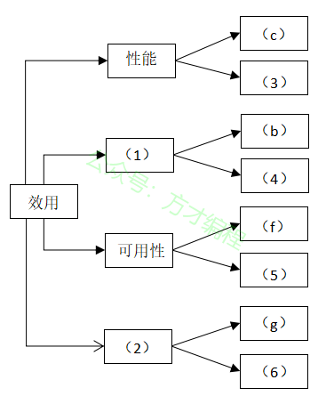
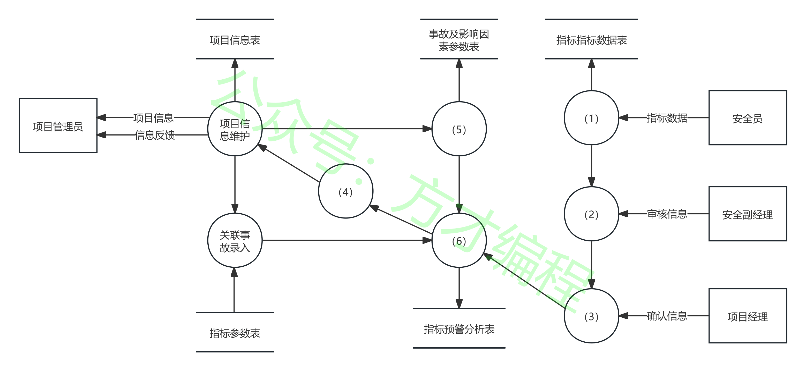
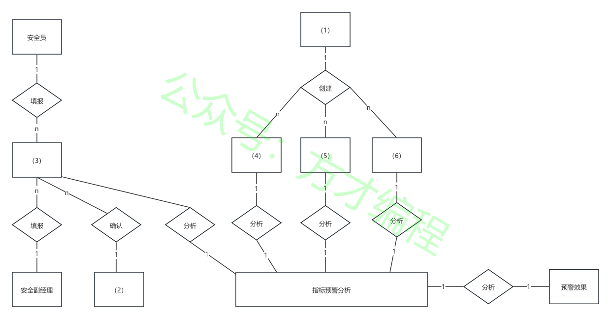
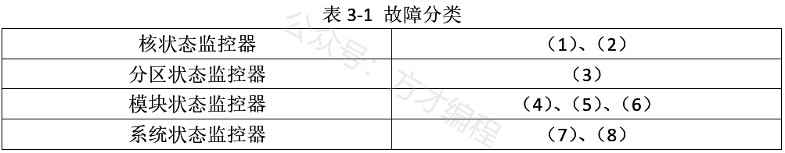
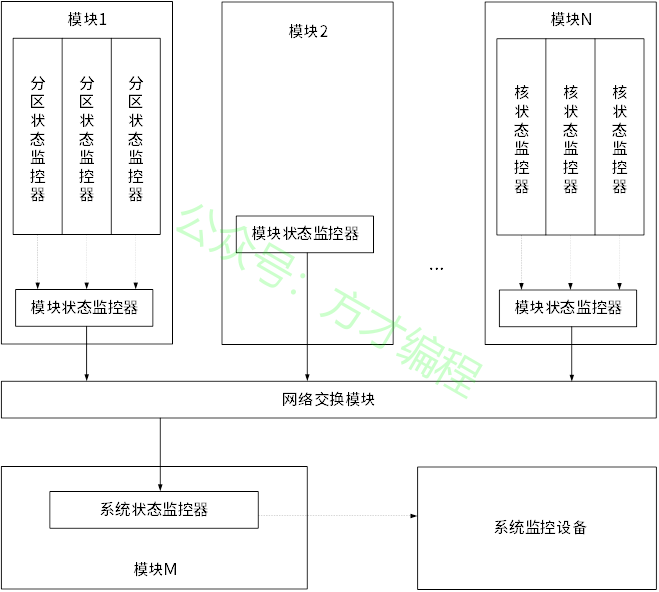
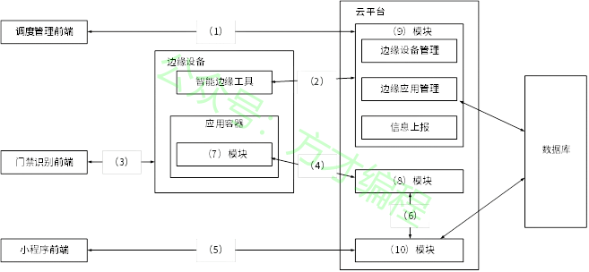

# 2022年11月 系统架构设计师 案例分析真题

---

## 第1大题：软件架构设计与评估

阅读以下关于软件架构设计与评估的叙述，在答题纸上回答问题1和问题2。
【说明】
某电子商务公司拟升级其会员与促销管理系统，向用户提供个性化服务，提高用户的粘性。在项目立项之初，公司领导层一致认为本次升级的主要目标是提升会员管理方式的灵活性，由于当前用户规模不大，业务也相对简单，系统性能方面不做过多考虑。新系统除了保持现有的**四级固定会员**制度外，**还需要根据用户的消费金额、偏好、重复性等相关特征动态调整商品的折扣力度**，并支持在**特定的活动周期内主动筛选与活动主题高度相关的用户集合，提供个性化的打折促销活动**。
在需求分析与架构设计阶段，公司提出的需求和质量属性描述如下：
（a）管理员能够在页面上灵活设置折扣力度规则和促销活动逻辑，设置后即可生效；
（b）系统应该具备完整的安全防护措施，支持对恶意攻击行为进行检测与报警；
（c）在正常负载情况下，系统应在0.3秒内对用户的界面操作请求进行响应；
（d）用户名是系统唯一标识，要求以字母开头，由数字和字母组合而成，长度不少于6个字符；
（e）在正常负载情况下，用户支付商品费用后在3秒内确认订单支付信息；
（f）系统主站点电力中断后，应在5秒内将请求重定向到备用站点；
（g）系统支持横向存储扩展，要求在2人•天内完成所有的扩展与测试工作；
（h）系统宕机后，需要在10秒内感知错误，并自动启动热备份系统；
（i）系统需要内置接口函数，支持开发团队进行功能调试与系统诊断；
（j）系统需要为所有的用户操作行为进行详细记录，便于后期查阅与审计；
（k）支持对系统的外观进行调整和配置，调整工作需要在4•人天内完成。
在对系统需求、质量属性描述和架构特性进行分析的基础上，系统架构师给出了两种候选的架构设计方案，公司目前正在组织相关专家对系统架构进行评估。

###   里面
(12分)在架构评估过程中，**质量属性效用树**（utility tree）是对系统质量属性进行识别和优先级排序的重要工具。请将合适的质量属性名称填入图1-1中(1)、(2)空白处，并选择题干描述的(a)～(k)填入(3)～(6)空白处，完成该系统的效用树。

**我的答案**

（1）。  安全。（2）修改

（3） e  （4）j  （5）h （6） k

---

**评分：12/12 分（全部正确，之前评判有误，已更正）**

**评判：**
- ✓ (1) **安全性** — 正确！(b) 恶意攻击检测 + (j) 用户操作审计都属于安全范畴
- ✓ (2) **修改**（可修改性）— 正确
- ✓ (3) e — 正确（3秒内确认订单支付 → 性能）
- ✓ (4) j — 正确（操作记录便于审计 → 安全性）
- ✓ (5) h — 正确（宕机10秒内感知 → 可用性）
- ✓ (6) k — 正确（4人天内完成外观调整 → 可修改性）

### 问题 2
(13分)针对该系统的功能，**李工建议采用面向对象的架构风格**，将折扣力度计算和用户筛选分别封装为独立对象，通过对象调用实现对应的功能；王工则建议采用**解释器（interpreters）架构风格**，将折扣力度计算和用户筛选条件封装为独立的规则，通过解释规则实现对应的功能。请针对系统的主要功能，**从折扣规则的可修改性、个性化折扣定义灵活性和系统性能**三个方面对这两种架构风格进行比较与分析，并指出该系统更适合采用哪种架构风格。

**我的答案**

从题干可知道信息要求除了保持现有的**四级固定会员**制度外，**还需要根据用户的消费金额、偏好、重复性等相关特征动态调整商品的折扣力度**，并支持在**特定的活动周期内主动筛选与活动主题高度相关的用户集合，提供个性化的打折促销活动**。可以看到系统需要自定义场景，所以选择 解释器架构风格更加合适，我分别从以下几个方面进行对比

- 折扣规则的可修改性：因为折扣规则需要经常变化，如果是面向对象设计好之后就不好修改了，而解释器将规则单独实现，方便修改
- 个性化折扣定义灵活性：面向对象设计时需要考虑对象的属性都是固定值，不可能新增删除属性，而解释器可以自定义属性，更加灵活
- 系统性能：在正常负载情况下，系统应在0.3秒内对用户的界面操作请求进行响应 和 在正常负载情况下，用户支付商品费用后在3秒内确认订单支付信息  这个性能两种方式都可以达到要求

综上对比。选择 解释器架构风格更加合适

---

**评分：约 9/13 分**

**评判：**
- ✓ 正确选择了**解释器架构风格**
- ✓ 从三个维度（可修改性、灵活性、性能）分别进行了分析
- ✓ 折扣规则可修改性分析正确：指出面向对象需改代码，解释器只需改规则文件
- ✓ 个性化折扣灵活性分析有道理：解释器可自定义属性
- ✗ **系统性能分析不够深入**：没有指出解释器需要解释执行规则，存在额外开销，性能低于面向对象
- ✗ 缺少明确的综合权衡结论（虽然解释了为什么选解释器，但没有明确承认性能方面的取舍）

---

**补充答案（标准参考）：**

**折扣规则的可修改性：**
- **面向对象：** 折扣规则需要在代码中实现，修改规则需要修改对象的方法并重新编译部署，可修改性较差
- **解释器：** 折扣规则是独立的语法规则，由解释器解析执行，只需修改规则文件并导入即可，可修改性好
- **结论：解释器优于面向对象**

**个性化折扣定义灵活性：**
- **面向对象：** 对象的属性和方法固定，难以动态增减属性，灵活性较差
- **解释器：** 可通过解释器动态解析规则，动态适配用户需要的规则，灵活性高
- **结论：解释器优于面向对象**

**系统性能：**
- **面向对象：** 直接调用对象方法，执行效率高
- **解释器：** 需要解释执行规则，存在解释开销，性能相对较低
- **结论：面向对象优于解释器**

**最终结论：** 该系统核心目标是提升会员管理的**灵活性**，解释器在可修改性和灵活性方面明显优于面向对象，虽然性能略差但题干明确"系统性能方面不做过多考虑"，因此**更适合采用解释器架构风格**。

---

##  第。 

阅读以下关于软件系统设计与建模的叙述，在答题纸上回答问题1至问题3。
【说明】
煤炭生产是国民经济发展的主要领域之一，其煤矿的安全非常重要。某能源企业拟开发一套煤矿建设项目安全预警系统，以保护煤矿建设项目从业人员生命安全。本系统的**主要功能包括如下(a)～(h)所述**。
(a) 项目信息维护
(b) 影响因素录入
(c) 关联事故录入
(d) 安全评价得分
(e) 项目指标预警分析
(f) 项目指标填报
(g) 项目指标审核
(h)项目指标确认

### 问题 1
（9分）王工根据煤矿建设项目安全预警系统的功能要求，设计完成了系统的数据流图，如图2-1所示。请使用题干中描述的**功能(a)～(h)**，补充完善空(1)～(6)处的内容，并**简要介绍数据流图在分层细化过程中遵循的数据平衡原则**。

**我的答案**

（1）  (f) 项目指标填报 （2）(g) 项目指标审核  （3）(h)项目指标确认

（4）(a) 项目信息维护 （5）(b) 影响因素录入（6）(e) 项目指标预警分析

数据流图在分层细化过程中遵循的数据平衡原则

- 有输入必有输出
- 有输入无输出为黑洞
- 无输入有输出不可能

---

**评分：约 7/9 分**

**评判：**
- ✓ (1)-(6) 的加工填空基本正确（需结合具体数据流图验证）
- ✗ **数据平衡原则回答有误**：你回答的是"数据流图的错误类型"（黑洞、奇迹），而非"数据平衡原则"本身
- 数据平衡原则应包含两个层面：
  1. **父图与子图平衡**：子图的输入输出数据流必须与父图中对应加工的输入输出一致
  2. **子图内平衡**：每个加工必须有输入和输出数据流

---

**补充答案（标准参考）：**

(1) (f)项目指标填报  (2) (g)项目指标审核  (3) (h)项目指标确认
(4) (a)项目信息维护  (5) (b)影响因素录入  (6) (e)项目指标预警分析

**数据平衡原则：**
1. **父图与子图平衡**：子图加工的输入输出数据流必须与父图中对应加工的输入输出数据流一致
2. **子图内平衡**：子图内每个加工必须有输入和输出数据流，避免黑洞（有输入无输出）和奇迹（无输入有输出）

### 问题 2
（9分）请根据【问题1】中数据流图表示的相关信息，补充完善煤矿建设项目安全预警**系统总体E-R图**（见图2-2）中实体(1)～(6)的具体内容，将正确答案填在答题纸上。

**我的答案**

（1）项目管理员（2）项目经理（3）指标数据表

（4（5（6）分别为 项目信息表 /事故及影响因素参数表/指标参数表

---

**评分：约 7/9 分**

**评判：**
- ✓ (1) **项目管理员** — 完全正确
- ✓ (2) **项目经理** — 完全正确
- ✓ (3) **指标数据表** — 标准答案为"项目指标数据"，多了"表"字但意思正确
- ✓ (4)~(6) 三项内容全部答出：指标参数、项目信息、事故及影响因素参数 — 完全正确
- 扣2分：(3)多了"表"字表述不够精确；(4)~(6)的顺序可能不完全对应E-R图中的位置
- 整体回答质量不错，核心实体识别准确

### 问题 3
（7分）在结构化分析和设计过程中，**数据流图和数据字典**是常用的技术手段，请用200字以内的文字简要说明它们在软件需求分析和设计阶段的作用。

**我的答案**

- 数据流图主要是 展示 软件的工作流程，各个实体之间有哪些数据流动，展示动态关系
- 数据字典：主要在软件中展示 有哪些专业名词和描述。统一软件内部实体和外部实体的一一对应关系

在软件需求分析中 需要使用数据流图来展示 软件的工作流程

在设计阶段需要数据字典来表达软件设计实体和现实实体之间的一一对应关系

---

**评分：约 3/7 分**

**评判：**
- ✓ 对数据流图的作用有一定理解：展示了软件工作流程和数据流动
- ✗ **对数据字典的理解有误**：数据字典不是"统一软件内部实体和外部实体的一一对应关系"，而是对数据流图中所有数据元素（数据项、数据结构、数据流、数据存储、加工）进行精确定义
- ✗ 没有区分分析阶段和设计阶段的不同作用
- ✗ 表述偏口语化

---

**补充答案（标准参考）：**

**数据流图：**
- **需求分析阶段：** 建立系统的功能模型，帮助开发人员和用户理解系统"做什么"
- **设计阶段：** 为模块划分和模块间接口设计提供依据

**数据字典：**
- **需求分析阶段：** 对数据流图中所有数据元素进行精确定义，消除歧义，确保开发人员和用户对数据有共同理解
- **设计阶段：** 为数据库设计（数据结构、数据项定义）提供基础

---

## 第3大题：数据库与系统设计

阅读以下关于嵌入式系统故障检测和诊断的相关描述，在答题纸上回答问题1至问题3。
【说明】
系统的故障检测和诊断是宇航系统提高装备可靠性的主要技术之一，随着装备信息化的发展，分布式架构下的资源配置越来越多、资源布局也越来越分散，这对系统的故障检测和诊断方法提出了新的要求。为了适应宇航装备的分布式综合化电子系统的发展，解决由于系统资源部署的分散性，造成系统状态的综合和监控困难的问题，公司领导安排张工进行研究。张工经过分析、调研提出了针对分布式综合化电子系统架构的故障检测和诊断的方案。

### 问题 1
(8分)张工提出：宇航装备的软件架构可采用四层的层次化体系结构，即模块支持层、操作系统层、分布式中间件层和功能应用层。为了有效、方便地实现分布式系统的故障检测和诊断能力，方案建议将系统的故障检测和诊断能力构建在分布式中间件内，通过使用心跳或者超时探测技术来实现故障检测器。请用300字以内的文字分别说明**心跳检测和超时探测技术的**基本原理及特点。

### 问题 2
(8分)张工针对分布式综合化电子系统的架构特征，给出了初步设计方案，指出每个节点的故障监测与诊断器主要负责监控系统中所有的故障信息，并将故障信息进行综合分析判断，使用故障诊断器分析出故障原因，给出解决方案和措施。系统可以给模块的每个处理机器核配置核状态监控器、给每个分区配置分区状态监控器、给每个模块配置模块状态监控器、给系统配置系统状态监控器，如图3-1所示。
请根据下面给出的分布式综合化电子系统可能产生的故障(a)～(h)，判断这些故障分别属于哪类监控器检测的范围，完善表3-1的(1)～(8)的空白。
(a)应用程序除零
(b)看门狗故障
(c)任务超时
(d)网络诊断故障
(e)BIT检测故障
(f)分区堆栈溢出
(g)操作系统异常
(h)模块掉电

---

### 问题 3
(9分)张工在方案中指出，本系统的故障诊断采用故障诊断器实现，它可综合多种故障信息和系统状态，依据智能决策数据库提供的决策策略判定出故障类型和处理方法。智能决策数据库中的策略可以对故障开展定性或定量分析。通常，在定量分析中，普遍采用基于解析模型的方法和数据驱动的方法。张工在方案中提出该系统定量分析时应采用基于解析模型的方法。但是此提议受到王工的反对，王工指出采用数据驱动的方法更适合分布式综合化电子系统架构的设计。请用300字以内的文字，说明数据驱动方法的基本概念，以及王工提出采用此方法的理由。

---

## 第4大题：Web应用架构

阅读以下关于数据库缓存的叙述，在答题纸上回答问题1至问题3。
【说明】
某大型电商平台建立了一个在线 B2B 商店系统，并在全国多地建设了货物仓储中心，通过提前备货的方式来提高货物的运送效率。但是在运营过程中，发现会出现很多**跨仓储中心调货从而延误货物运送的情况**。为此，该企业计划新建立一个全国仓储货物管理系统，在实现仓储中心常规管理功能之外，通过对在线 B2B 商店系统中订单信息进行及时的分析和挖掘，并通过大数据分析预测各地仓储中心中各类货物的配置数量，从而提高运送效率，降低成本。
当用户通过在线 B2B 商店系统选购货物时，全国仓储货物管理系统会通过该用户所在地址、商品类别以及仓储中心的货物信息和地址，实时为用户订单反馈货物起运地（某仓储中心）并预测送达时间。**反馈送达时间的响应时间应小于1秒**。
为满足反馈**送达时间功能的性能要求**，设计团队建议在全国仓储货物管理系统中采用数据缓存集群的方式，将仓储中心基本信息、商品类别以及库存数量放置在内存的缓存中，而仓储中心的其它商品信息则存储在数据库系统。

### 问题 1
（9分）设计团队在讨论缓存和数据库的数据一致性问题时，**李工建议采取数据实时同步更新方案**，而**张工则建议采用数据异步准实时更新方案**。请用200字以内的文字，简要介绍两种方案的基本思路，说明全国仓储货物管理系统应该采用哪种方案，并说明采取该方案的原因。

**我的答案**

- 实时同步方案：用户每一次 在线 B2B 商店系统选购货物 时都实时根据用户的地址，商品类别都信息都实时去数据库查询。用户每次查到的都是实时信息，当仓库货物变更时也可以直接查询到，保证货物不多卖
- 异步准实时更新方案：现将各地的仓库基本信息都放在缓存中，用户在查询时直接查询缓存信息；然后当仓库信息发生变更时，根据设置的更新时间将最新仓库信息同步到缓存中

我的意见是 采用  异步准实时更新方案  ，因为系统有性能要求 **反馈送达时间的响应时间应小于1秒** ，这样在用户查询商品后可快速响应，更加容易留住客户购买

---

**评分：约 6/9 分**

**评判：**
- ✓ 正确选择了**异步准实时更新方案**
- ✓ 选择理由正确：提到了性能要求（响应时间小于1秒）
- ✗ **对"实时同步方案"的理解有偏差**：你描述的是"每次查询都去数据库查"，这是没有缓存的情况，而不是缓存与数据库的同步更新方案。实时同步应该是"写操作同时更新数据库和缓存"
- ✗ 对"异步准实时方案"的描述不够准确：应描述为"先更新数据库，缓存通过订阅消息或过期机制延迟更新"
- ✗ 没有说明实时同步方案的缺点：会增加系统负载、影响响应时间

---

**补充答案（标准参考）：**

**数据实时同步更新方案：** 写操作同时更新数据库和缓存，保证强一致性，但延迟高、易出错，会增加系统负载。

**数据异步准实时更新方案：** 先更新数据库，缓存通过订阅消息或过期机制延迟更新，系统负载低，数据存在短暂不一致。

**应采用异步准实时更新方案。** 因为实时同步更新每次都需要同步更新缓存和数据库，会增加系统负载，影响响应时间，不利于满足"响应时间小于1秒"的性能要求。

### 问题 2
（9分）随着业务的发展，仓储中心以及商品的数量日益增加，需要对集群部署多个缓存节点，提高缓存的处理能力。李工建议采用**缓存分片方法**，把缓存的数据拆分到多个节点分别存储，减轻单个缓存节点的访问压力，达到分流效果。缓存分片方法常用的有**哈希算法和一致性哈希算法**，李工建议采用一致性哈希算法来进行分片。请用200字以内的文字简要说明两种算法的基本原理，并说明李工采用一致性哈希算法的原因。

**我的答案**

- 哈希算法：将缓存里面所有的ke y 根据ha sh 进行计算，然后将ke y 进行均匀分布，但是当缓存更新时 需要重新计算所有节点的 ha sh
- 一致性哈希算法：将缓存所有 ke y 根据ha sh进行环运算，将ke y 进行分布，当缓存更新时只需要计算变更节点的ha sh即可

采用 一致性哈希算法的原因 的，仓库中心的商品数量很多，而且由于商品在不断的交易，那么到时间间隔之后就需要更新缓存，一致性哈希算法  更新缓存只需要更新变更节点，更新较少，如果是常用哈希需要全部重新计算，可能会不满足性能要求

---

**评分：约 6/9 分**

**评判：**
- ✓ 正确指出了哈希算法需要在缓存变更时重新计算，一致性哈希只需计算变更节点
- ✓ 正确选择了**一致性哈希算法**
- ✓ 选择理由方向正确：数据迁移量小
- ✗ **哈希算法原理描述不够准确**：不是"缓存更新时需要重新计算"，而是"增加或减少缓存节点时几乎所有数据都需要重新映射"
- ✗ **一致性哈希原理描述过于简略**：没有提到环形空间映射的概念，也没有提到虚拟节点解决数据分布不均的问题
- ✗ 表述中"环运算"不够专业，应描述为"将节点和数据映射到环形哈希空间"

---

**补充答案（标准参考）：**

**哈希算法：** 通过哈希函数将关键字映射到固定范围的缓存节点上。优点是简单易实现，缺点是集群中增加或减少缓存节点时，几乎所有数据都需要重新映射。

**一致性哈希算法：** 将缓存节点映射到一个环形空间上，通过哈希函数将数据映射到环上，沿环顺时针方向找到第一个缓存节点存储。缺点是缓存节点在圆环上分布不平均会造成部分节点压力较大（可通过虚拟节点解决）。

**采用一致性哈希算法的原因：** 一致性哈希分片在扩充缓存节点时，只需要对少量数据进行存储位置的更新；而普通哈希分片需要对几乎所有数据进行存储位置更新，数据迁移成本大。

### 问题 3
（7分）全国仓储货物管理系统开发完成，在运营一段时间后，系统维护人员发现大量黑客故意发起非法的商品送达时间查询请求，造成了**缓存穿透**。张工建议尽快采用布隆过滤器方法解决。请用200字以内的文字解释布隆过滤器的工作原理和优缺点。

**我的答案**

布隆过滤器

- 首先将缓存中所有的ke y 计算到 bitmap 上，当有ke y查询时，首先查询在  bitmap 上 有没有对应的值，所有没有直接返回，如果有再去缓存查询
- 优点：可以过滤大部分不存在的 key 
- 缺点：可能会漏掉一部分key 到缓存中查询，但是缓存中有没有就会去数据库中直接查询，导致性能问题

---

**评分：约 5/7 分**

**评判：**
- ✓ 正确描述了布隆过滤器的基本原理：通过散列函数将key映射到位数组上，查询时先查位数组
- ✓ 正确指出了优点：可以过滤大部分不存在的key
- ✓ 正确指出了缺点：存在误判（判断存在但实际不存在时会查数据库）
- ✗ **原理描述不够完整**：没有提到"K个散列函数"、"将K个映射点置为1"等关键细节
- ✗ **优点描述不够全面**：还应提到"空间效率高、查询速度快"
- ✗ **缺点遗漏**：没有提到"一般情况下不能从布隆过滤器中删除元素"

---

**补充答案（标准参考）：**

**原理：** 布隆过滤器通过一个很长的二进制向量（位数组）和一系列随机映射函数（K个散列函数）来记录数据是否在集合中。当元素加入集合时，通过K个散列函数将该元素映射到位数组中的K个点，并将它们置为1。检索时只需检查这些点是否都为1，若全为1则可能存在，若有0则一定不存在。

**优点：** 空间效率和查询时间都远远超过一般算法（空间效率高、查询速度快）。

**缺点：** 有一定的误判率（存在假阳性，即判断存在但实际可能不存在）；一般情况下不能从布隆过滤器中删除元素。

---

## 第5大题：嵌入式与实时系统

阅读以下关于 Web 系统架构设计的叙述，在答题纸上回答问题1至问题3。
【说明】
某公司拟开发一套基于边缘计算的智能门禁系统，用于如园区、新零售、工业现场等存在来访、被访业务的场景。来访者在来访前，可以通过线上提前预约的方式将自己的个人信息记录在后台，被访者在系统中通过此请求后，来访者在到访时可以直接通过“刷脸”的方式通过门禁，无需做其他验证。此外，系统的管理员可对正在运行的门禁设备进行管理。
基于项目需求，该公司组建项目组，召开了项目讨论会。会上，张工根据业务需求并结合边缘计算的思想，提出本系统可由访客注册模块、模型训练模块、端侧识别模块与设备调度平台模块等四项功能组成。李工从技术层面提出该系统可使用 Flask 框架与 SSM 框架为基础来开发后台服务器，将开发好的系统通过 Docker 进行部署，并使用 MQTT 协议对 Docker 进行管理。

### 问题 1
（5分）MQTT 协议在工业物联网中得到广泛的应用，请用300字以内的文字简要说明 MQTT 协议。

### 问题 2
（14分）在会议上，张工对功能模块进行了更进一步的说明：访客注册模块用于来访者提交申请与被访者确认申请，主要处理提交来访申请、来访申请审核业务，同时保存访客数据，为训练模块准备训练数据集；模型训练模块用于使用访客数据进行模型训练，为端侧设备的识别业务提供模型基础；端侧识别模块在边缘门禁设备上运行，使用训练好的模型来识别来访人员，与云端服务协作完成访客来访的完整业务；设备调度平台模块用于对边缘门禁设备进行管理，管理人员能够使用平台对边缘设备进行调度管理与状态监控，实现云端协同。
图5-1给出了基于边缘计算的智能门禁系统架构图，请结合 HTTP 协议和 MQTT 协议的特点，为图5-1中（1）～（6）处选择合适的协议；并结合张工关于功能模块的描述，补充完善图5-1中（7）～（10）处的空白。

### 问题 3
（6分）请用300字以内的文字，从数据通信、数据安全和系统性能等方面简要分析在传统云计算模型中引入边缘计算模型的优势。

---

## 附录：提取的图片

- `img_qr_01.png`：微信小程序二维码，已省略
- `img_exam_2022-11-1-01.png`：第1大题第1小题架构图/表格图
- `img_logo_01.jpeg`：站点 Logo，已省略
- `img_exam_2022-11-2-01.png`：第2大题第1小题架构图/表格图
- `img_exam_2022-11-2-02.png`：第2大题第2小题架构图/表格图
- `img_exam_2022-11-3-02.png`：第3大题第2小题架构图/表格图
- `img_exam_2022-11-3-03.png`：第3大题第2小题架构图/表格图
- `img_exam_2022-11-5-02.png`：第5大题第2小题架构图/表格图

---

## 📊 总评

软考案例分析共 **5 道大题，每大题 25 分，总分 75 分**。

| 大题 | 满分 | 你的得分 | 得分率 |
|------|------|---------|--------|
| 第1大题 问题1（效用树） | 12 | 12 | 100% |
| 第1大题 问题2（架构风格） | 13 | 9 | 69% |
| **第1大题 小计** | **25** | **21** | **84%** |
| 第2大题 问题1（数据流图） | 9 | 7 | 78% |
| 第2大题 问题2（E-R图） | 9 | 7 | 78% |
| 第2大题 问题3（数据字典） | 7 | 3 | 43% |
| **第2大题 小计** | **25** | **17** | **68%** |
| 第3大题 问题1（心跳/超时探测） | 8 | 0 | 0% 未做 |
| 第3大题 问题2（故障监控器） | 8 | 0 | 0% 未做 |
| 第3大题 问题3（数据驱动） | 9 | 0 | 0% 未做 |
| **第3大题 小计** | **25** | **0** | **0%** |
| 第4大题 问题1（缓存一致性） | 9 | 6 | 67% |
| 第4大题 问题2（缓存分片） | 9 | 6 | 67% |
| 第4大题 问题3（布隆过滤器） | 7 | 5 | 71% |
| **第4大题 小计** | **25** | **17** | **68%** |
| 第5大题 问题1（MQTT） | 5 | 0 | 0% 未做 |
| 第5大题 问题2（架构图填空） | 14 | 0 | 0% 未做 |
| 第5大题 问题3（边缘计算） | 6 | 0 | 0% 未做 |
| **第5大题 小计** | **25** | **0** | **0%** |
| **合计** | **75** | **55** | **73.3%** |

> **及格线：45/75（60%）**，当前成绩 **55/75（73.3%）**，已过线。

**主要薄弱点：**
1. **架构风格对比论述深度不够**：虽能从三个维度分析，但性能方面没有指出解释器的解释执行开销，论述流于表面
2. **数据平衡原则概念混淆**：把"黑洞/奇迹"（数据流图错误类型）当成了"数据平衡原则"本身
3. **数据字典理解有误**：误认为是"实体映射"，实际是对数据流图中所有数据元素的精确定义
4. **缓存一致性方案理解有偏差**：将"实时同步"理解为"每次都查数据库"，混淆了读写操作与缓存同步的概念
5. **技术术语表达不够专业**："环运算"、"常用哈希"等口语化表述在考试中会被扣分

**优势：**
1. **效用树全部正确**：质量属性识别和场景归类完全准确
2. **E-R图实体识别基本正确**：(1)(2)(3)(4)(5)(6)全部答对核心内容
3. 缓存专题整体掌握不错：布隆过滤器原理基本正确，一致性哈希的选择理由方向正确
4. 架构风格选择判断正确：能结合题干需求特征（灵活性优先）选择解释器
5. 数据流图加工填空基本正确

**建议重点复习：**
- 数据字典的准确定义：对数据流图中所有数据元素的精确定义，不是实体映射
- 数据平衡原则：父图与子图平衡、子图内平衡（区别于黑洞/奇迹等错误类型）
- 缓存-数据库一致性：区分读操作（查缓存 vs 查数据库）和写操作（缓存同步策略）
