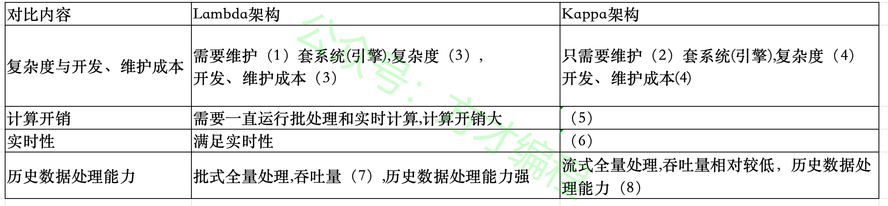
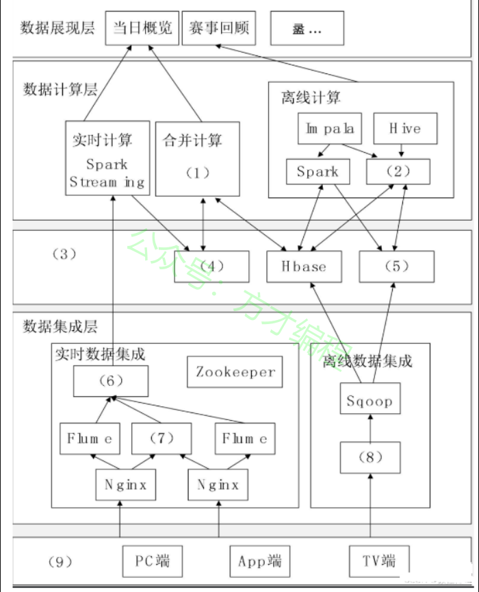
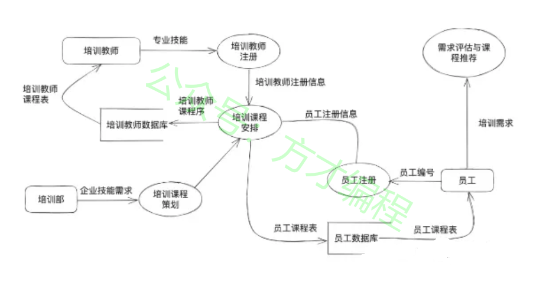
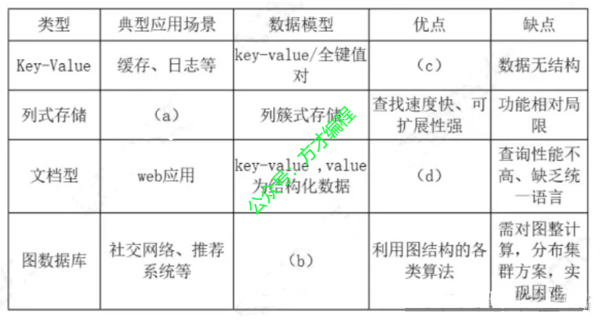
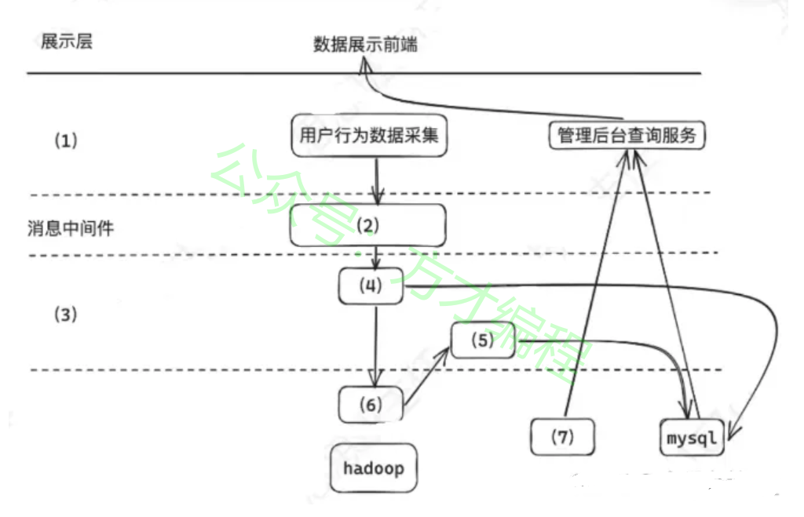

# 2023年11月 系统架构设计师 案例分析真题

> 来源：方才coding 软考真题
> **注意**：本年份真题文件不完整，缺少部分题目。

---

## 第1大题：软件架构设计与评估

### 试题1

某网作为某电视台在互联网上的大型门户入口，某一年成为某奥运会中国大陆地区的特权转播商，独家全程直播了某奥运会全部的赛事，积累了庞大稳定的用户群，这些用户在使用各类服务过程中产生了大量数据，对这些海量数据进行分析与挖掘，将会对节目的传播及商业模式变现起到重要的作用。该奥运期间需要对增量数据在当日概览和赛事回顾两个层面上进行分析。
其中，当日概览模块需要秒级刷新直播在线人数、网站的综合浏览量、页面停留时间、视频的播放次数和平均播放时间等千万级数据量的实时信息，而传统的分布式架构采用重新计算的方式分析实时数据在不扩充以往集群规模的情况下，无法在几秒内分析出重要的信息。
赛事回顾模块需要展现自定义时间段内的历史最高在线人数、逐日播放走势、直播最高在线人数和点播视频排行等海量数据的统计信息，由于该奥运期间产生的数据通常不需要被经常索引、更新，因此要求采用不可变方式存储所有的历史数据，以保证历史数据的准确性。
问题 1
(8分)请根据Lambda架构和Kappa架构特点，填写以下表格。

---
### 试题2

某网作为某电视台在互联网上的大型门户入口，某一年成为某奥运会中国大陆地区的特权转播商，独家全程直播了某奥运会全部的赛事，积累了庞大稳定的用户群，这些用户在使用各类服务过程中产生了大量数据，对这些海量数据进行分析与挖掘，将会对节目的传播及商业模式变现起到重要的作用。该奥运期间需要对增量数据在当日概览和赛事回顾两个层面上进行分析。
其中，当日概览模块需要秒级刷新直播在线人数、网站的综合浏览量、页面停留时间、视频的播放次数和平均播放时间等千万级数据量的实时信息，而传统的分布式架构采用重新计算的方式分析实时数据在不扩充以往集群规模的情况下，无法在几秒内分析出重要的信息。
赛事回顾模块需要展现自定义时间段内的历史最高在线人数、逐日播放走势、直播最高在线人数和点播视频排行等海量数据的统计信息，由于该奥运期间产生的数据通常不需要被经常索引、更新，因此要求采用不可变方式存储所有的历史数据，以保证历史数据的准确性。
问题 2
（9 分）下图1给出了某网奥运的大数据架构图，请根据下面的(a)~(n)的相关技术，判断这些技术属于架构图的哪个部分，补充完善下图1的(1)-(9)的空白处

---
### 试题3

某网作为某电视台在互联网上的大型门户入口，某一年成为某奥运会中国大陆地区的特权转播商，独家全程直播了某奥运会全部的赛事，积累了庞大稳定的用户群，这些用户在使用各类服务过程中产生了大量数据，对这些海量数据进行分析与挖掘，将会对节目的传播及商业模式变现起到重要的作用。该奥运期间需要对增量数据在当日概览和赛事回顾两个层面上进行分析。
其中，当日概览模块需要秒级刷新直播在线人数、网站的综合浏览量、页面停留时间、视频的播放次数和平均播放时间等千万级数据量的实时信息，而传统的分布式架构采用重新计算的方式分析实时数据在不扩充以往集群规模的情况下，无法在几秒内分析出重要的信息。
赛事回顾模块需要展现自定义时间段内的历史最高在线人数、逐日播放走势、直播最高在线人数和点播视频排行等海量数据的统计信息，由于该奥运期间产生的数据通常不需要被经常索引、更新，因此要求采用不可变方式存储所有的历史数据，以保证历史数据的准确性。
问题 3
（8 分）大数据的架构包括了Lambda架构和Kappa架构，Lambda架构分解为三层,即(1)、(2)和(3)，Kappa架构不同于Lambda同时计算流计算和批计算并合并视图，Kappa只会通过流计算一条的数据链路计算并产生视图。请问该系统的大数据架构是基于哪种架构搭建的大数据平台处理奥运会大规模视频网络观看数据。

---

## 第2大题：系统建模与分析

### 试题4

阅读下列说明，回答问题1至问题2，将解答填入答题纸的对应栏内。
【说明】
说明:某软件公司为企业开发一套员工在线教育系统，支持员工利用业余时间开展专业技术培训，提升员工技能。在项目开展初期，采用结构化分析进行开发，并对系统中培训部员工和培训教师的相关功能进行分析，具体需求如下:(1)培训部根据企业技术发展需求，负责策划培训课程，并形成课程计划，针对不同的员工设置不同的课程;(2)员工首先在系统进行注册，填写自己的编号，学历，专业，岗位等信息，生成员工注册信息，然后将自己的培训需求录入系统，系统自动评估并进行课程推荐，员工确认后形成课程需求;(3)培训教室也通过系统进行注册，填写自己的编号、学历、专业等信息，形成培训教师注册信息(4)系统根据课程计划、员工注册信息，课程需求和培训教师注册信息，为员工和培训教师生成对应的课程表。
工时系统分析师对上述流程进行了审核，并指出需补充数据字典，从而更完整地对系统建。
问题1
数据流图(DFD)是结构分析方法的重要工具。请用300字以内的文字描述DFD的定义
问题2
项目组针对题干描述的业务需求，初步绘制了系统流图(2-1)，情分析途中的三类错误并对每类错误进行简单解释。

---

## 第4大题：Web应用架构

### 试题5

阅读下列说明，回答问题1至问题3，将解答填入答题纸的对应栏内。
【说明】
某国际大型企业拟向企业开发一个在线社交网络服务(SNS)系统，让企业内部的员工能够通过类似社交网络的方式进行工作和自我管理以实现企业内部员工高效、透明、便捷的沟通与协作。其基本的工序包括:
企业内部部门、员工等基本信息的维护和管理
2、提供常见的SNS服务，如Blog，WiKi,数钱，RSS，即时通信和邮件等
3、提供社交网络，推荐系统等基本功能提高业务协作
除了上述功能性的需求外，还需要满足系统的可拓展、灵活部署以及高性能和高可用性需求企业设计系统小组.
问题1
李工建议采用SNS中常见的NOSQL数据库技术，原因是传统的关系数据库不能满足实际需求，请用200 字内说明该系统不能采用传统关系数据库的原因，并给出NOSQL数据的基本特点.
问题2
李工对当前主流的 NOSQL数据库镜像了调研形成了如下表：
问题3（8分）
针对李工的建议，王工认为单纯使用NOSQL数据库无法完全满足系统要求，考虑到系统功能所涉及到数据类型建议使用混合数据库模型来实现，请用100字以内文字说明。混合数据库式如何组织?

---

## 第5大题：嵌入式与实时系统

### 试题6

阅读下列说明，回答问题1至问题3，将解答填入答题纸的对应栏内。
【说明】
某公司拟开发一个电商平台用户行为分析系统，该系统可支持对电商平台用户行为数据的采集和实时/高效数据处理分析，统计分析用户访问情况。搜集PV/ UV商品热度等相关数据。系统应具备以下能力
(1)对海量用户行为数据的存储和处理能力。
(2)为适应用户行为的随机性，保证系统不会被爆发的日志数据压垮，系统应具备对突发流量的处理能力。
(3)对用户数据的隐私保护能力，针对项目需求，公司召开会议，会上张工提出对于海量的行为数据，传统的文件存储和关系型数据库，均无法完全解决当前系统问题，应基于大数据技术设计并实现系统，李工提出同时需要数据脱敏的方法解决用户隐私的问题。
问题1
根据项目要求，该系统需考虑电商平台用户行为的随机性，需具有应对突发流量数据的处理能力。请基于大数据相关技术的了解，说明可选那个技术支持流系统应对突发流量暴增情况?并用200字以内说明该技术优势?
问题2
根据张工建议，项目组拟采用大数据技术开发该系统。图5给出本项目架构设计方案，请选择(a)-(m)选项中选出合适的内容，完善(1)~(7)处
(a)网络层、(b)业务层、 (c)接入层、(d)数据处理、(e)数据采集(f) Flink 实时计算、(g)Flink 批处理、(h) HBase 、 (i) Redis 、 (j)NoSQLase 、(k)kafka、(l)边缘计算、(m) 设备层
问题3 （8分）
根据李工的建议，项目组拟应用数据脱敏方法对该系统的敏感数据进行脱敏。请用300字以内文字说明常用的5种数据脱敏方法。

---

## 附录：提取的图片

- `img_qr_5b2991402eee.png`：微信小程序二维码，已省略
- `img_exam_159382cdd95a.png`：第1大题第1小题架构图/表格图
- `img_logo_fb5107e4dc49.jpeg`：站点 Logo，已省略
- `img_exam_04badff14308.png`：第1大题第2小题架构图/表格图
- `img_exam_af15219bafb8.jpeg`：第2大题第1小题架构图/表格图
- `img_exam_6a835a7e8393.jpeg`：第4大题第1小题架构图/表格图
- `img_exam_e4e71a211676.jpeg`：第5大题第1小题架构图/表格图
