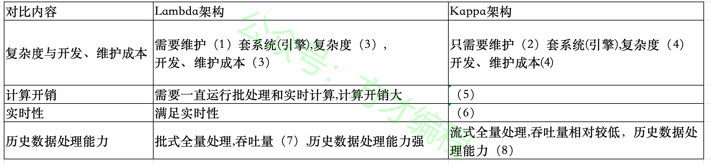
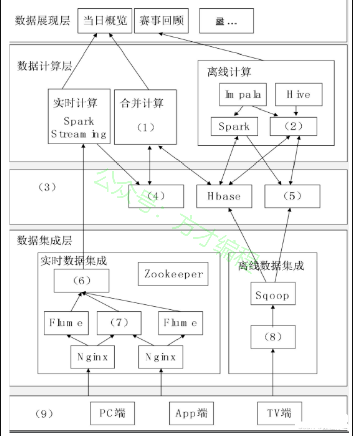
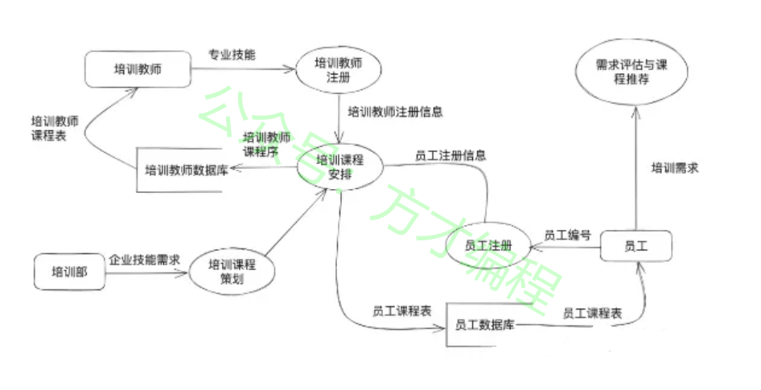
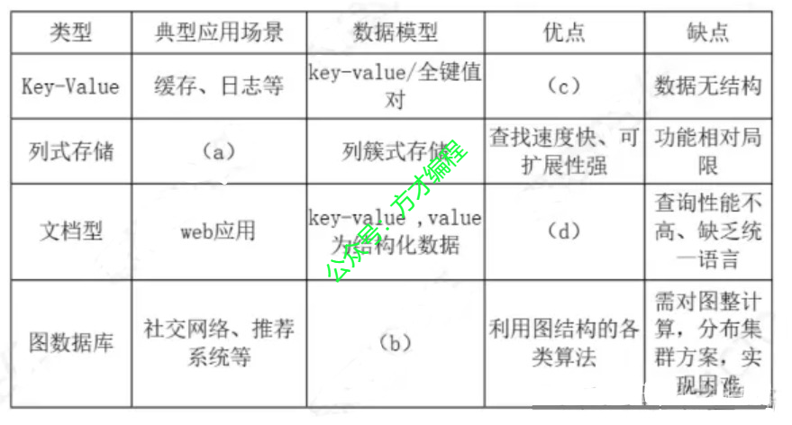
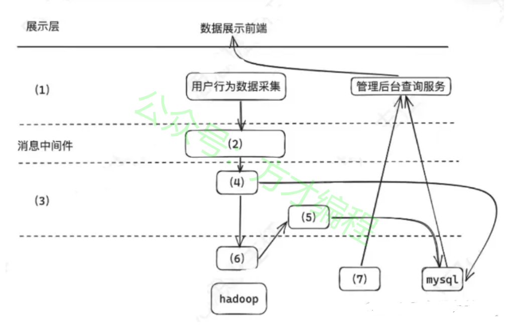

# 2023年11月 系统架构设计师 案例分析真题

> **注意**：**本年份真题文件缺第三题不完整**。

---

## 第1大题：软件架构设计与评估

某网作为某电视台在互联网上的大型门户入口，某一年成为某奥运会中国大陆地区的特权转播商，独家全程直播了某奥运会全部的赛事，积累了庞大稳定的用户群，这些用户在使用各类服务过程中产生了大量数据，对这些海量数据进行分析与挖掘，将会对节目的传播及商业模式变现起到重要的作用。该奥运期间需要对增量数据在**当日概览**和**赛事回顾**两个层面上进行分析。
其中，当日概览模块需要**秒级**刷新直播在线人数、网站的综合浏览量、页面停留时间、视频的播放次数和平均播放时间等千万级数据量的实时信息，而传统的分布式架构采用重新计算的方式分析实时数据在不扩充以往集群规模的情况下，无法在几秒内分析出重要的信息。
赛事回顾模块需要展现自定义时间段内的历史最高在线人数、逐日播放走势、直播最高在线人数和点播视频排行等海量数据的统计信息，由于该奥运期间产生的数据通常不需要被经常索引、更新，因此要求采用不可变方式存储所有的历史数据，以保证历史数据的准确性。

### 问题 1
(8分)请根据**Lambda架构和Kappa架构特点**，填写以下表格。

**我的答案**

（1）2  （2）1

 （3）高  （4） 低

（5） 只需要进行流处理，开销小（6）不满足实时性（7）高  （8）弱

---

**评分：约 7/8 分**

**评判：**
- ✓ (1)=2、(2)=1、(3)=高、(4)=低、(5)=只需要进行流处理开销小、(7)=高、(8)=弱，全部正确
- ✗ (6)="不满足实时性"错误。Kappa 架构是纯流处理架构，天然**满足实时性**。Lambda 和 Kappa 在实时性上都能满足，区别不在于实时性，而在于历史数据处理能力和计算开销
- 关键扣分：仅(6)错误，其余7空全对

---

**补充答案（标准参考）：**

| 对比内容 | Lambda架构 | Kappa架构 |
|---------|-----------|-----------|
| **复杂度与开发维护成本** | 需要维护**2**套系统(引擎)，复杂度**高**，开发维护成本**高** | 只需维护**1**套系统(引擎)，复杂度**低**，开发维护成本**低** |
| **计算开销** | 需同时运行批处理和实时计算，开销大 | **只需进行流处理，开销小** |
| **实时性** | 满足实时性 | **满足实时性** |
| **历史数据处理能力** | 批式全量处理，吞吐量**高**，历史数据处理能力强 | 流式全量处理，吞吐量相对较低，历史数据处理能力**弱** |

### 问题 2
（9 分）下图1给出了某网奥运的大数据架构图，请根据下面的**(a)~(n)的相关技术**，判断这些技术属于架构图的哪个部分，补充完善下**图1的(1)-(9)的空白处**

**我的答案**

没有选项 暂时没法做答

---

**评分：0/9 分**

**评判：**
-  未作答。虽然题目没有给出显式选项列表，但可以根据架构图的上下文推断答案

---

**补充答案（标准参考）：**

根据架构图各层的功能和技术栈，标准答案如下：

| 编号 | 答案 | 说明 |
|------|------|------|
| (1) | **Spark SQL** | 合并计算：合并批处理和流处理结果 |
| (2) | **MapReduce** | 离线计算引擎，与 Impala、Hive、Spark 并列 |
| (3) | **数据存储层** | 位于数据计算层和数据集成层之间的层级名称 |
| (4) | **Redis** | 缓存存储，与 HBase 并列在存储层 |
| (5) | **HDFS** | Hadoop 分布式文件系统，底层存储 |
| (6) | **Kafka** | 实时数据集成消息队列，Flume 数据汇入 |
| (7) | **Flume** | 日志采集组件，与上方 Flume 并列采集 Nginx 日志 |
| (8) | **业务数据库/RDBMS** | Sqoop 的数据源（离线数据集成从关系型数据库抽取） |
| (9) | **客户端/用户端** | 数据源终端：PC端、App端、TV端 |

### 问题 3
（8 分）大数据的架构包括了Lambda架构和Kappa架构，Lambda架构分解为三层,即(1)、(2)和(3)，**Kappa架构不同于Lambda同时计算流计算和批计算并合并视图**，Kappa只会通过流计算一条的数据链路计算并产生视图。请问该系统的大数据架构是基于哪种架构搭建的大数据平台处理奥运会大规模视频网络观看数据。

**我的答案**

Lambda架构分解为三层： 流处理层/批处理层/加速层 

我认为  Lambda架构 比较合适，原因如下

- 当日概览模块需要**秒级**刷新 ，说明是需要实时处理数据的，只有   Lambda架构  合适
- 赛事回顾模块 需要展示历史信息，虽然两中架构都适合，但是 Lambda架构 对历史数据的处理速度较快

综上   Lambda架构  更加合适

---

**评分：约 5/8 分**

**评判：**
-  Lambda 三层分解方向正确（批处理层、速度层、服务层），但命名不够标准（"流处理层"应为"速度层 Speed Layer"，"加速层"应为"服务层 Serving Layer"）
-  选择 Lambda 架构正确
-  理由基本合理：当日概览需实时性 + 赛事回顾需处理海量历史数据，Lambda 能同时满足
-  扣分点：三层名称不够准确；"Kappa 对历史数据处理速度较快"表述有误，应是 Kappa 历史数据处理能力**较弱**（流式全量处理吞吐量低）

---

**补充答案（标准参考）：**

Lambda 架构分解为三层：
1. **批处理层（Batch Layer）**：处理全量历史数据，生成高精度批处理视图（Hadoop/Spark）
2. **速度层（Speed Layer）**：处理增量实时数据，弥补批处理延迟（Storm/Flink/Spark Streaming）
3. **服务层（Serving Layer）**：合并批处理和实时结果，对外提供统一查询接口

**该系统应基于 Lambda 架构搭建**，原因：
- 当日概览模块需要**秒级刷新**实时信息，Lambda 的速度层（Speed Layer）可满足实时性需求
- 赛事回顾模块需要处理**海量历史数据**的统计分析，Lambda 的批处理层（Batch Layer）对全量历史数据吞吐量高、处理能力强
- Kappa 架构虽然也满足实时性，但历史数据处理能力较弱（流式全量处理吞吐量低），不适合该场景的海量历史数据分析需求

---

## 第2大题：系统建模与分析

阅读下列说明，回答问题1至问题2，将解答填入答题纸的对应栏内。
【说明】
说明:某软件公司为企业开发一套员工在线教育系统，支持员工利用业余时间开展专业技术培训，提升员工技能。在项目开展初期，采用结构化分析进行开发，并对系统中培训部员工和培训教师的相关功能进行分析，具体需求如下:、

(1)培训部根据企业技术发展需求，负责策划培训课程，并形成课程计划，针对不同的员工设置不同的课程;

(2)员工首先在系统进行注册，填写自己的编号，学历，专业，岗位等信息，生成员工注册信息，然后将自己的培训需求录入系统，系统自动评估并进行课程推荐，员工确认后形成课程需求;

(3)培训教师也通过系统进行注册，填写自己的编号、学历、专业等信息，形成培训教师注册信息

(4)系统根据课程计划、员工注册信息，课程需求和培训教师注册信息，为员工和培训教师生成对应的课程表。

工时系统分析师对上述流程进行了审核，并指出需补充数据字典，从而更完整地对系统建。

### 问题1

**数据流图(DFD)**是结构分析方法的重要工具。请用300字以内的文字描述DFD的定义

**我的答案**

**数据流图(DFD)** 是表达软件设计时数据如何流转的图形，表达了各个实体之间数据流的交换和应用

---

**评分：约 2/8 分**

**评判：**
-  回答过于简略，仅表达了"数据流转"的概念
-  缺少 DFD 的四个核心要素：**外部实体**（数据源/终点）、**加工/处理**（数据变换）、**数据流**（数据 movement）、**数据存储**（数据仓库）
-  缺少对 DFD 核心作用的描述：描述系统中数据的**变换过程**和**流动方向**，不涉及控制逻辑和时序
-  缺少对 DFD 分层特性的说明（顶层图→0层图→子图逐层分解）

---

**补充答案（标准参考）：**

**数据流图（Data Flow Diagram, DFD）** 是一种图形化建模工具，用于描述系统中数据的**流动**和**变换过程**。DFD 由四个核心元素组成：
1. **外部实体**（External Entity）：位于系统边界之外，是数据的来源或去向（人或组织）
2. **加工/处理**（Process）：对输入数据进行变换，产生输出数据
3. **数据流**（Data Flow）：数据在元素之间的流动方向，用带标签的箭头表示
4. **数据存储**（Data Store）：数据暂存或持久化的位置

DFD 采用**分层分解**方法，从顶层图（Context Diagram）到 0 层图，再到各级子图，逐层细化描述系统的数据处理过程。DFD 关注"数据如何流动和变换"，不涉及控制逻辑和时间顺序。

### 问题2

项目组针对题干描述的业务需求，初步绘制了系统流图(2-1)，情分析途中的**三类错误**并对每类错误进行简单解释。

**我的答案**

- 需求评估与课程推荐有输入没输出：员工确认后形成课程需求没有被培训部捕获到，需要将该信息流向系统

---

**评分：约 2/9 分**

**评判：**
-  正确找出了"需求评估与课程推荐"加工的黑洞错误（只有输入无输出）
-  仅找出 **1 类**错误，题目要求找出 **3 类**错误
-  遗漏的错误：
  - **灰洞/输入不足**："培训课程安排"加工从"员工数据库"直接获取数据，未经过加工处理（数据流从存储直接到加工，缺少中间的数据流来源）
  - **外部实体与数据存储直连**（或灰洞）：员工→员工注册之间的"员工编号"数据流未经过加工，外部实体的数据应通过加工进入系统

---

**补充答案（标准参考）：**

DFD 图中的三类错误：

1. **黑洞（Black Hole）**：
   - **位置**："需求评估与课程推荐"加工
   - **解释**：该加工只有输入数据流（培训需求），没有输出数据流，数据进入后消失，如同被黑洞吞噬。应补充输出数据流（如"课程推荐结果"）指向相关加工或数据存储。

2. **灰洞/输入不足（Gray Hole）**：
   - **位置**："培训课程安排"加工
   - **解释**：该加工需要生成课程表，但"员工数据库"直接连接到该加工，缺少必要的输入数据流（如"课程计划"、"培训教师注册信息"等），输入数据不足以产生所需的输出。

3. **外部实体与数据存储直接连接**（或黑洞）：
   - **位置**：员工→员工数据库之间的数据流
   - **解释**：外部实体（员工）与数据存储（员工数据库）之间不应有直接的数据流，必须经过加工处理。员工数据应先经过"员工注册"加工，再写入员工数据库。

> **DFD 基本规则**：①每个加工必须有输入和输出；②数据流不能直接在外部实体之间流动；③数据流不能直接在外部实体和数据存储之间流动；④数据流不能直接在两个数据存储之间流动。

---

## 第4大题：Web应用架构

阅读下列说明，回答问题1至问题3，将解答填入答题纸的对应栏内。
【说明】
某国际大型企业拟向企业开发一个在线社交网络服务(SNS)系统，让企业内部的员工能够通过类似社交网络的方式进行工作和自我管理以实现企业内部员工高效、透明、便捷的沟通与协作。其基本的工序包括:
1、企业内部部门、员工等基本信息的维护和管理
2、提供常见的SNS服务，如Blog，WiKi,数钱，RSS，即时通信和邮件等
3、提供社交网络，推荐系统等基本功能提高业务协作
除了上述功能性的需求外，还需要满足系统的可拓展、灵活部署以及高性能和高可用性需求企业设计系统小组.

### 问题1
李工建议采用SNS中常见的NOSQL数据库技术，原因是传统的关系数据库不能满足实际需求，请用200 字内说明该系统不能采用**传统关系数据库的原因**，并给出**NOSQL数据的基本特点.**

**我的答案**

NOSQL数据特点如下

- 不仅仅是满足数据SQL 查询，还满足其他查询
- 不同传统的关系数据库的key-vALUE模式， NOSQL 的 value可进行自定义数据结构和扩展

不能采用**传统关系数据库的原因**如下

- SNS 需要满足 可拓展、灵活部署以及高性能和高可用性 在这几点上，选择  NOSQL 更加合适，因为 传统数据库拓展不是很方便
- SNS服务，如Blog，WiKi,数钱，RSS，即时通信和邮件等  ，可以看到需要做到这些服务，那么对数据结构的设计要求就很高，需要分别为每一种服务都去设计数据存储结构，但是如果是   NOSQL，那么就可以统一采取key-value的方式存储，key进行统一管理，然后 value针对不同业务进行设计即可

---

**评分：约 3/8 分**

**评判：**
-  NoSQL 特点理解有误：NoSQL 是 "**Not Only SQL**"（不仅仅是 SQL），不是"不仅仅是满足 SQL 查询"。NoSQL 的核心特点是灵活的数据模型（无固定 Schema）、易水平扩展、无复杂事务（遵循 BASE 理论）
-  "NoSQL 的 value 可进行自定义数据结构和扩展"表述不够准确。NoSQL 有四种主要类型：Key-Value、列式存储、文档型、图数据库，各有不同数据模型
-  不用传统关系数据库的原因方向正确（可扩展性、灵活部署），但缺少关键点：**高并发访问**、**海量非结构化数据**、**复杂关系查询**（社交网络的"好友的好友"需要大量 JOIN 操作）
-  "统一采取 key-value 方式存储"过于简化，SNS 系统需要多种 NoSQL 数据库类型配合

---

**补充答案（标准参考）：**

**不能采用传统关系数据库的原因：**
1. **可扩展性差**：关系数据库主要支持垂直扩展（Scale-up），SNS 系统数据量爆炸式增长，需要水平扩展（Scale-out）
2. **固定 Schema**：关系数据库需要预定义表结构，SNS 功能快速迭代，频繁修改表结构成本高
3. **高并发性能瓶颈**：SNS 系统面临百万级并发读写，关系数据库在锁和事务隔离上易成为瓶颈
4. **复杂关系查询**：社交关系形成图结构，"好友的好友"等查询需大量多表 JOIN，性能低下
5. **非结构化数据处理弱**：SNS 产生大量帖子、图片、评论等非结构化数据，不适合关系表结构

**NoSQL 数据库的基本特点：**
1. **灵活的数据模型**（Schema-free）：无需预定义表结构，支持动态数据结构
2. **易水平扩展**（Scalability）：原生支持分布式集群，可横向扩展
3. **无复杂事务**：遵循 BASE 理论（基本可用、软状态、最终一致性），不保证 ACID
4. **高性能**：针对特定场景优化（如 Key-Value 高速读写、图数据库关系查询）
5. **高可用**：内置副本和故障转移机制

### 问题2
李工对当前主流的 NOSQL数据库镜像了调研形成了如下表：

**我的答案**

（a）数据湖

（b）key-value ，根据value进行图存储

（c）查找速度块，方便建立索引

（d）查找速度快，扩展性强

---

**评分：约 3/9 分**

**评判：**
-  (c) "查找速度快，方便建立索引"和 (d) "查找速度快，扩展性强"方向基本正确，各有部分得分
-  (a) "数据湖"不准确。列式存储的典型场景是**数据仓库/大数据分析**（如日志分析、OLAP 查询）
-  (b) "key-value，根据value进行图存储"表述混乱。图数据库的数据模型是**节点（Node）、边（Edge）、属性（Property）**，不是 key-value
-  (c) 更准确的表述应为"读写性能高/查询速度快"
-  (d) 更准确的表述应为"数据结构灵活/无需预定义 Schema/扩展性强"

---

**补充答案（标准参考）：**

| 编号 | 答案 | 说明 |
|------|------|------|
| (a) | **数据仓库/大数据分析/OLAP 查询** | 列式存储（如 HBase、Cassandra）适合大规模数据分析、日志处理场景 |
| (b) | **节点、边、属性 / 图结构（Node、Edge、Property）** | 图数据库用节点表示实体、边表示关系、属性存储附加信息 |
| (c) | **读写性能高 / 查询速度快** | Key-Value 存储通过哈希表实现，O(1) 时间复杂度，适合缓存和高速读写 |
| (d) | **数据结构灵活 / 无需预定义 Schema / 扩展性强** | 文档型（如 MongoDB）每条文档可有不同的字段结构，无需预先定义表结构 |

### 问题3（8分）
针对李工的建议，王工认为单纯使用NOSQL数据库无法完全满足系统要求，考虑到系统功能所涉及到数据类型建议使用混合数据库模型来实现，请用100字以内文字说明。混合数据库式如何组织?

**我的答案**

- 首先对于 企业内部部门、员工等基本信息的维护和管理 适合采用 传统关系型数据库进行管理，因为这些属性关系属性很强

- 常见的SNS服务，如Blog，WiKi,数钱，RSS，即时通信和邮件 需要使用 NOSQL数据库 进行存储

- 然后主入口可采用 传统关系型数据库进行管理

---

**评分：约 4/8 分**

**评判：**
-  方向正确：结构化数据（员工、部门信息）用关系型数据库，SNS 服务用 NoSQL
-  缺少具体的 NoSQL 类型选择：社交网络和推荐系统适合**图数据库**（Neo4j），Blog/Wiki 等半结构化数据适合**文档型数据库**（MongoDB），缓存/会话适合 **Key-Value**（Redis）
-  "主入口采用传统关系型数据库"表述不够清晰，缺少技术层面说明（如何整合、数据同步等）

---

**补充答案（标准参考）：**

混合数据库按数据类型和访问模式组织：
1. **关系型数据库（RDBMS）**：存储企业内部部门、员工等结构化基本信息，利用其强一致性和复杂事务支持
2. **图数据库（Neo4j 等）**：存储社交网络关系、推荐系统数据，利用图算法高效查询"好友的好友"等关系
3. **文档型数据库（MongoDB 等）**：存储 Blog、Wiki 等半结构化内容，灵活支持不同文档结构
4. **Key-Value 存储（Redis 等）**：用于缓存、会话管理、即时消息等高速读写场景

各数据库通过**应用层统一调度**，根据数据访问模式路由到对应的存储引擎，实现优势互补。

---

## 第5大题：嵌入式与实时系统

阅读下列说明，回答问题1至问题3，将解答填入答题纸的对应栏内。
【说明】
某公司拟开发一个电商平台用户行为分析系统，该系统可支持对电商平台用户行为数据的采集和实时/高效数据处理分析，统计分析用户访问情况。搜集PV/ UV商品热度等相关数据。系统应具备以下能力
(1)对海量用户行为数据的存储和处理能力。
(2)为适应用户行为的随机性，保证系统不会被爆发的日志数据压垮，系统应具备对突发流量的处理能力。
(3)对用户数据的隐私保护能力，针对项目需求，公司召开会议，会上张工提出对于海量的行为数据，传统的文件存储和关系型数据库，均无法完全解决当前系统问题，应基于大数据技术设计并实现系统，李工提出同时需要数据脱敏的方法解决用户隐私的问题。

### 问题1
根据项目要求，该系统需考虑电商平台用户行为的随机性，需具有应对突发流量数据的处理能力。请基于大数据相关技术的了解，说明可选**那个技术支持流系统应对突发流量暴增情况**?并用200字以内说明该技术优势?

### 问题2
根据张工建议，项目组拟采用大数据技术开发该系统。图5给出本项目架构设计方案，请选择(a)-(m)选项中选出合适的内容，完善(1)~(7)处
(a)网络层、(b)业务层、 (c)接入层、(d)数据处理、(e)数据采集(f) Flink 实时计算、(g)Flink 批处理、(h) HBase 、 (i) Redis 、 (j)NoSQLase 、(k)kafka、(l)边缘计算、(m) 设备层

### 问题3 （8分）
根据李工的建议，项目组拟应用数据脱敏方法对该系统的敏感数据进行脱敏。请用300字以内文字说明常用的5种数据脱敏方法。

---

## 附录：提取的图片

- `img_qr_01.png`：微信小程序二维码，已省略
- `img_exam_2023-11-1-01.png`：第1大题第1小题架构图/表格图
- `img_logo_01.jpeg`：站点 Logo，已省略
- `img_exam_2023-11-1-02.png`：第1大题第2小题架构图/表格图
- `img_exam_2023-11-2-02.jpeg`：第2大题第1小题架构图/表格图
- `img_exam_2023-11-4-02.jpeg`：第4大题第1小题架构图/表格图
- `img_exam_2023-11-5-02.jpeg`：第5大题第1小题架构图/表格图

---

## 📊 总评

软考案例分析共 **5 道大题，每大题 25 分，总分 75 分**。（第3大题文件不完整，跳过；第5大题未作答）

| 大题 | 满分 | 你的得分 | 得分率 |
|------|------|---------|--------|
| 第1大题 问题1 | 8 | 7 | 87.5% |
| 第1大题 问题2 | 9 | 0 | 0% |
| 第1大题 问题3 | 8 | 5 | 62.5% |
| **第1大题 小计** | **25** | **12** | **48.0%** |
| 第2大题 问题1 | 8 | 2 | 25.0% |
| 第2大题 问题2 | 9 | 2 | 22.2% |
| **第2大题 小计** | **25** | **4** | **16.0%** |
| 第4大题 问题1 | 8 | 3 | 37.5% |
| 第4大题 问题2 | 9 | 3 | 33.3% |
| 第4大题 问题3 | 8 | 4 | 50.0% |
| **第4大题 小计** | **25** | **10** | **40.0%** |
| **已做合计** | **75** | **26** | **34.7%** |

> **及格线：45/75（60%）**，当前成绩 **26/75（34.7%）**，**未及格**。

**主要薄弱点：**
1. **DFD/结构化分析方法**（第2大题）：DFD 定义缺少四要素（外部实体、加工、数据流、数据存储），DFD 错误分析仅找出 1/3 类错误。需系统复习 DFD 建模方法
2. **NoSQL 基础概念**（第4大题）：对 NoSQL 的理解有偏差（"Not Only SQL"含义、四种类型的区别），图数据库数据模型概念不清。建议重点复习 NoSQL 四大类型的对比
3. **架构图填空**（第1大题问题2）：面对无显式选项的架构图填空缺乏信心，需加强大数据架构各层技术栈的熟悉度

**优势：**
1. **Lambda/Kappa 架构对比**（第1大题问题1）：8 空答对 7 空，对两种架构的核心差异理解较好
2. **架构选择推理能力**（第1大题问题3）：能根据场景需求（实时性+历史数据处理）正确选择 Lambda 架构并给出合理论述
3. **混合数据库思路**（第4大题问题3）：能正确识别不同数据类型对应不同数据库的混合使用思路
