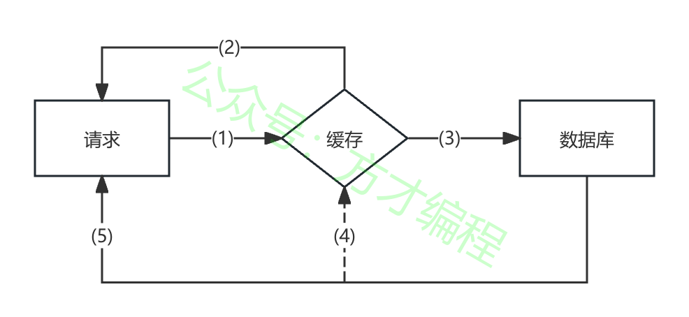
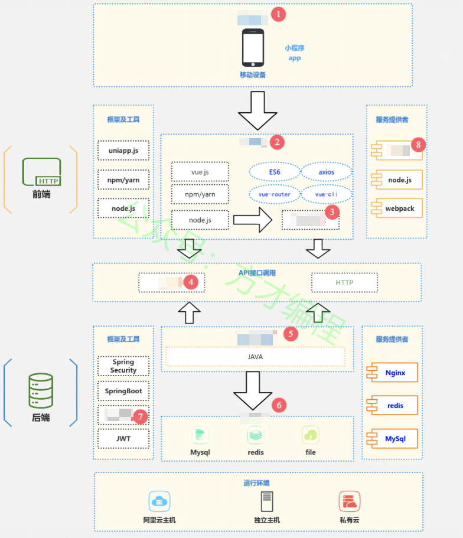
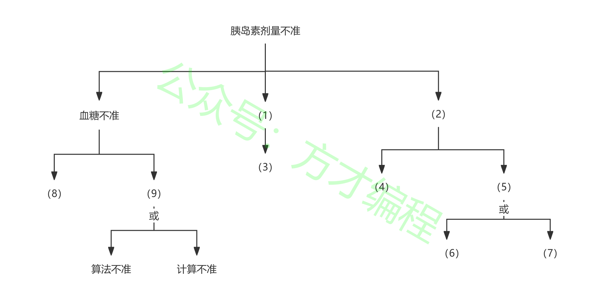

# 2024年11月 系统架构设计师 案例分析真题

> 来源：方才coding 软考真题

---

## 第1大题：软件架构设计与评估

### 试题1

阅读以下关于软件架构设计与评估的叙述，在答题纸上回答问题1和问题2。
【说明】
某软件公司拟为一所大型写字楼开发一套访客登记系统，以提升访客管理的效率和安全性。在系统需求分析与架构设计阶段，用户提出的部分需求和关键质量属性场景如下：
（a）网络失效后，系统需要在 3 分钟内发现并启用备用网络系统；
（b）对查询请求处理时间的要求将影响系统的数据传输协议和处理过程的设计；
（c）系统能够抵御 99.999% 的黑客攻击；
（d）能够连续运行的时间不小于240小时；
（e）系统可以数据进行导入导出，要求在1分钟内完成数据导出导出；
（f）系统根据用户量访问量的增加拓展空间，要求在3天完成；
（g）系统分为三个不同的国家语言，支持搜索自动填充补全等；
公司目前正在组织系统开发的相关人员对系统架构进行评估。
问题 1
（14分）在架构评估过程中，质量属性效用树是对系统质量属性进行识别和优先级排序的重要工具。请给出合适的质量属性，填入图中（1）、（7）空白处；并选择题干描述的（a）～（m），填入（2）（3）（4）（5）（6）空白处。

---
### 试题2

阅读以下关于软件架构设计与评估的叙述，在答题纸上回答问题1和问题2。
【说明】
某软件公司拟为一所大型写字楼开发一套访客登记系统，以提升访客管理的效率和安全性。在系统需求分析与架构设计阶段，用户提出的部分需求和关键质量属性场景如下：
（a）网络失效后，系统需要在 3 分钟内发现并启用备用网络系统；
（b）对查询请求处理时间的要求将影响系统的数据传输协议和处理过程的设计；
（c）系统能够抵御 99.999% 的黑客攻击；
（d）能够连续运行的时间不小于240小时；
（e）系统可以数据进行导入导出，要求在1分钟内完成数据导出导出；
（f）系统根据用户量访问量的增加拓展空间，要求在3天完成；
（g）系统分为三个不同的国家语言，支持搜索自动填充补全等；
公司目前正在组织系统开发的相关人员对系统架构进行评估。
问题 2
（11分）针对质量属性可靠性可以使用ping/echo和心跳模式实现，请分别简述ping/echo和心跳的实现原理。张工认为从资源利用率的角度来看心跳比较适合，简述理由？

---

## 第2大题：系统建模与分析

### 试题3

阅读以下关于数据库缓存架构的叙述，在答题纸上回答问题1-3。
某电商平台使用缓存来存储热点商品数据。旁路缓存模式是常见的一种缓存模式，其核心是将缓存模块设置为I/O路径的一个非强制性组成部分。这意味着缓存模块可以根据需要灵活地加入或移除，而不会影响原有的I/O路径的完整性。在这种模式下，缓存是一个附加组件，提供了一个可选的数据访问路径。
问题 1
（10分）根据旁路缓存模式的读数据原理，以获取商品信息为例，填写下图中（1）到（5）的空白。

---
### 试题4

阅读以下关于数据库缓存架构的叙述，在答题纸上回答问题1-3。
某电商平台使用缓存来存储热点商品数据。旁路缓存模式是常见的一种缓存模式，其核心是将缓存模块设置为I/O路径的一个非强制性组成部分。这意味着缓存模块可以根据需要灵活地加入或移除，而不会影响原有的I/O路径的完整性。在这种模式下，缓存是一个附加组件，提供了一个可选的数据访问路径。
问题 2
（6分）根据旁路缓存模式写数据原理，填写下图中（1）（2）的空白。

---
### 试题5

阅读以下关于数据库缓存架构的叙述，在答题纸上回答问题1-3。
某电商平台使用缓存来存储热点商品数据。旁路缓存模式是常见的一种缓存模式，其核心是将缓存模块设置为I/O路径的一个非强制性组成部分。这意味着缓存模块可以根据需要灵活地加入或移除，而不会影响原有的I/O路径的完整性。在这种模式下，缓存是一个附加组件，提供了一个可选的数据访问路径。
问题 3
（9分）王工使用了多线程技术进行缓存处理，线程1负责写入，线程2负责读取，可能存在数据不一致性问题，请解释其原因，并给出3个以上的解决办法。

---

## 第3大题：数据库与系统设计

### 试题6

阅读以下关于数据库缓存架构的叙述，在答题纸上回答问题1-3。
【说明】
某智能科技公司承接了一项开发服务型机器人的重要项目，该机器人旨在应用于大型商场，为顾客提供导购、信息咨询以及简单的货物搬运等服务。在项目开发过程中，选用了嵌入式系统架构，并决定采用机器人操作系统 ROS 来构建机器人的软件平台。
问题 1
（8分）请用150字说明ROS定义和特点。ROS2与ROS1相比哪些地方做了改进，请用150 字描述。

---
### 试题7

阅读以下关于数据库缓存架构的叙述，在答题纸上回答问题1-3。
【说明】
某智能科技公司承接了一项开发服务型机器人的重要项目，该机器人旨在应用于大型商场，为顾客提供导购、信息咨询以及简单的货物搬运等服务。在项目开发过程中，选用了嵌入式系统架构，并决定采用机器人操作系统 ROS 来构建机器人的软件平台。
问题 2
（8分）请将符合的描述的 ROS 的通信机制名称填入下方空格处。
（1）是一种单向通信模型，在通信双方中，发布方发布数据，订阅方订阅数据，数据流单向的由发布方传输到订阅方。（2）是一种基于请求响应的通信模型，在通信双方中，客户端发送请求数据到服务端，服务端响应结果给客户端。（3）是一种带有连续反馈的通信模型，在通信双方中，客户端发送请求数据到服务端，服务端响应结果给客户端，但是在服务端接收到请求到产生最终响应的过程中，会发送中间连续的反馈（进度）信息到客户端。（4）是一种基于共享的通信模型，在通信双方中，服务端可以设置数据，而客户端可以连接服务端并操作服务端数据。

---
### 试题8

阅读以下关于数据库缓存架构的叙述，在答题纸上回答问题1-3。
【说明】
某智能科技公司承接了一项开发服务型机器人的重要项目，该机器人旨在应用于大型商场，为顾客提供导购、信息咨询以及简单的货物搬运等服务。在项目开发过程中，选用了嵌入式系统架构，并决定采用机器人操作系统 ROS 来构建机器人的软件平台。
问题 3
（9分）立足系统架构，ROS2可以划分为三层。请解析ROS2架构每一层含义。

---

## 第4大题：Web应用架构

### 试题9

阅读以下关于数据库缓存架构的叙述，在答题纸上回答问题1-3。
【说明】
某电商企业计划开发一款商品推荐系统，并接入微信小程序，以提升用户购物体验，增加商品销量。该企业组建了项目团队，团队成员包括项目经理、架构师、开发工程师、测试工程师等。在技术选型方面，架构师经过调研和评估，选择了 Elasticsearch 作为搜索引擎，利用其强大的分词功能和分布式架构，实现对海量商品数据的高效存储和检索。
问题 1
（6分）Elasticsearch中内置了很多分词器，请用150字说明Simple, Whitespace, Keyword 分词引擎的特点差异。

---
### 试题10

阅读以下关于数据库缓存架构的叙述，在答题纸上回答问题1-3。
【说明】
某电商企业计划开发一款商品推荐系统，并接入微信小程序，以提升用户购物体验，增加商品销量。该企业组建了项目团队，团队成员包括项目经理、架构师、开发工程师、测试工程师等。在技术选型方面，架构师经过调研和评估，选择了 Elasticsearch 作为搜索引擎，利用其强大的分词功能和分布式架构，实现对海量商品数据的高效存储和检索。
问题 2
（12分）请根据下图所示的商品推荐系统架构图，将下列名称填写空白处的内容（原题是红色标注处挖空）。
备选名称：接入层、显示层、应用层、业务逻辑层、控制层、网络层、数据访问层、数据层、Mybatis, Nginx, Flink，Javascript, Node.js, RESTful，Elasticsearch，kafka。

---
### 试题11

阅读以下关于数据库缓存架构的叙述，在答题纸上回答问题1-3。
【说明】
某电商企业计划开发一款商品推荐系统，并接入微信小程序，以提升用户购物体验，增加商品销量。该企业组建了项目团队，团队成员包括项目经理、架构师、开发工程师、测试工程师等。在技术选型方面，架构师经过调研和评估，选择了 Elasticsearch 作为搜索引擎，利用其强大的分词功能和分布式架构，实现对海量商品数据的高效存储和检索。
问题 3
（7分）该方案中使用了RESTful风格，请用150字描述如何使用前后端分离如何实现RESTful。

---

## 第5大题：嵌入式与实时系统

### 试题12

阅读下列说明，在答题纸上回答问题1-3。
【说明】
随着科技的进步与医疗需求的增长，某医疗科技公司计划开发一套智能胰岛素注射系统，旨在为糖尿病患者提供更精准、便捷且安全的胰岛素注射方案。
系统的核心流程如下：患者需先使用配套的血糖仪进行血糖测量，血糖仪会将实时测量得到的血糖数据，通过蓝牙等无线通信技术，快速且准确地传输至胰岛素泵系统。胰岛素泵系统内置了先进的算法模型，该模型会结合患者的个体信息（如年龄、体重、病史等）以及实时测量的血糖数据，自动、精准地计算出本次需要注射的胰岛素剂量。
计算完成后，胰岛素泵系统会依据计算所得的剂量，自动控制泵设备，将适量的胰岛素准确无误地注射到患者体内。
问题 1
（10分）请用150字简要说明危险驱动的安全分析4个步骤的内容。

---
### 试题13

阅读下列说明，在答题纸上回答问题1-3。
【说明】
随着科技的进步与医疗需求的增长，某医疗科技公司计划开发一套智能胰岛素注射系统，旨在为糖尿病患者提供更精准、便捷且安全的胰岛素注射方案。
系统的核心流程如下：患者需先使用配套的血糖仪进行血糖测量，血糖仪会将实时测量得到的血糖数据，通过蓝牙等无线通信技术，快速且准确地传输至胰岛素泵系统。胰岛素泵系统内置了先进的算法模型，该模型会结合患者的个体信息（如年龄、体重、病史等）以及实时测量的血糖数据，自动、精准地计算出本次需要注射的胰岛素剂量。
计算完成后，胰岛素泵系统会依据计算所得的剂量，自动控制泵设备，将适量的胰岛素准确无误地注射到患者体内。
问题 2
（9分）胰岛素剂量传输不准会带来一些安全问题，请将下列内容填入下方的空格处，完善可能导致胰岛素剂量不准的原因。
备选选项：（a）血糖传感器错误（b）传输系统异常（c）血糖计算不准（d）定时器失效（e）泵信号失效（f）错误时间推送预定的量（g）算法错误（h）计算错误（i）胰岛素计算错误

---
### 试题14

阅读下列说明，在答题纸上回答问题1-3。
【说明】
随着科技的进步与医疗需求的增长，某医疗科技公司计划开发一套智能胰岛素注射系统，旨在为糖尿病患者提供更精准、便捷且安全的胰岛素注射方案。
系统的核心流程如下：患者需先使用配套的血糖仪进行血糖测量，血糖仪会将实时测量得到的血糖数据，通过蓝牙等无线通信技术，快速且准确地传输至胰岛素泵系统。胰岛素泵系统内置了先进的算法模型，该模型会结合患者的个体信息（如年龄、体重、病史等）以及实时测量的血糖数据，自动、精准地计算出本次需要注射的胰岛素剂量。
计算完成后，胰岛素泵系统会依据计算所得的剂量，自动控制泵设备，将适量的胰岛素准确无误地注射到患者体内。
问题 3
（6分）请用300字论述形式化开发和软件测试技术各自的特点。

---

## 附录：提取的图片

- `img_qr_5b2991402eee.png`：微信小程序二维码，已省略
- `img_exam_483c4f822338.png`：第1大题第1小题架构图/表格图
- `img_logo_fb5107e4dc49.jpeg`：站点 Logo，已省略
- `img_exam_9891b953a7c5.png`：第2大题第1小题架构图/表格图
- `img_exam_d4639ea2a217.png`：第2大题第2小题架构图/表格图
- `img_exam_88f4338ad43d.png`：第4大题第2小题架构图/表格图
- `img_exam_9a079df6cfdc.png`：第5大题第2小题架构图/表格图
