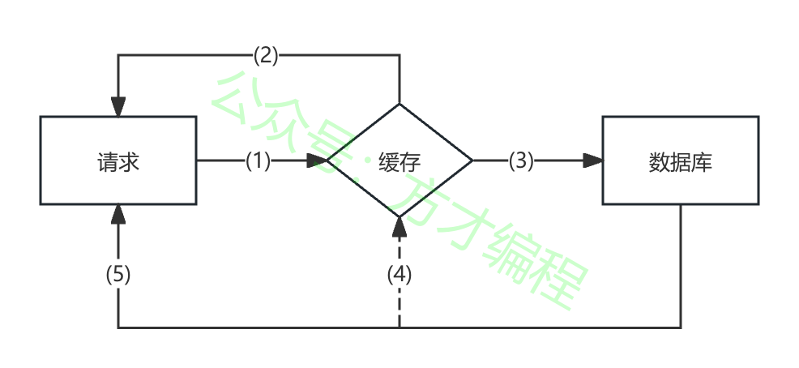
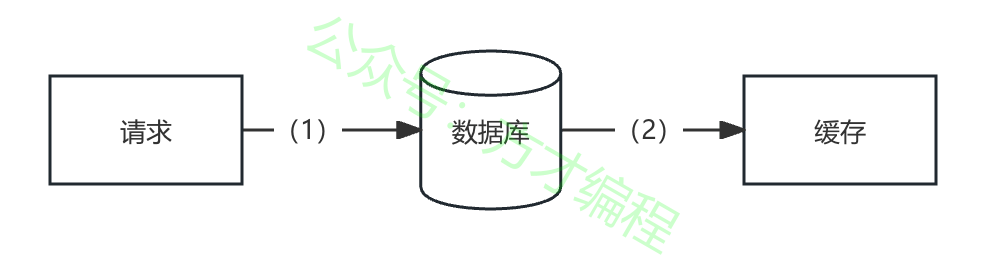
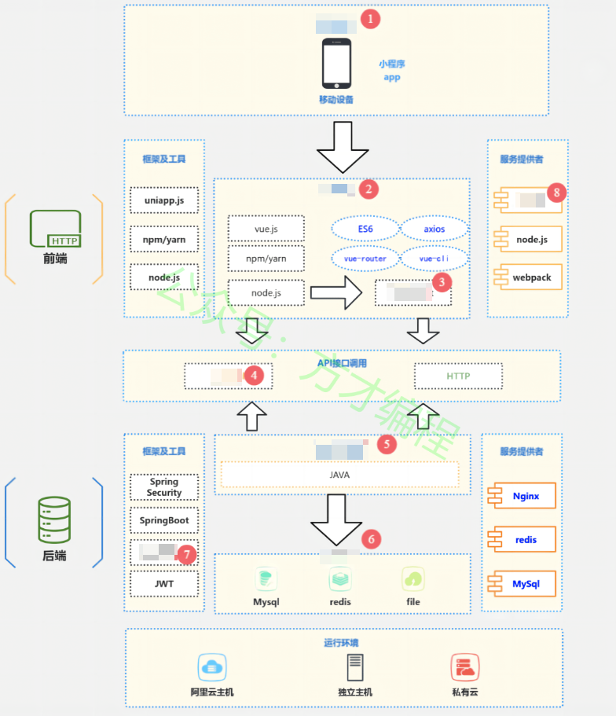
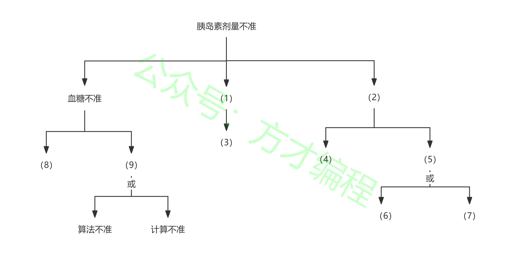

# 2024年11月 系统架构设计师 案例分析真题

---

## 第1大题：软件架构设计与评估

阅读以下关于软件架构设计与评估的叙述，在答题纸上回答问题1和问题2。
【说明】
某软件公司拟为一所大型写字楼开发一套访客登记系统，以提升访客管理的效率和安全性。在系统需求分析与架构设计阶段，用户提出的部分需求和关键质量属性场景如下：
（a）网络失效后，系统需要在 3 分钟内发现并启用备用网络系统；
（b）对查询请求处理时间的要求将影响系统的数据传输协议和处理过程的设计；
（c）系统能够抵御 99.999% 的黑客攻击；
（d）能够连续运行的时间不小于240小时；
（e）系统可以数据进行导入导出，要求在1分钟内完成数据导出导出；
（f）系统根据用户量访问量的增加拓展空间，要求在3天完成；
（g）系统分为三个不同的国家语言，支持搜索自动填充补全等；
公司目前正在组织系统开发的相关人员对系统架构进行评估。

### 问题 1
（14分）在架构评估过程中，质量属性效用树是对系统质量属性进行识别和优先级排序的重要工具。请给出合适的质量属性，填入图中（1）、（7）空白处；并选择题干描述的（a）～（m），填入（2）（3）（4）（5）（6）空白处。

**我的答案**

（1） b（2）安全性 （3） 稳定性

（4）性能 （5）可修改性 （6） 适应性

（7） a

---

**评分：约 10/14 分**

**评判：**
- ✓ (2)=安全性(c)、(3)=可靠性(d)、(4)=性能(e)、(5)=可修改性(f)、(6) 用户填了"适应性"，题干(g)"三种国家语言+搜索自动填充"对应的是**易用性**，不是适应性 ✗
- (7)=a 正确（网络失效后启用备用网络=可用性场景）✓
- ✗ (1)=b 错误。(1)位于"可靠性"→"可恢复性"下的场景位，应填场景字母。(b)"查询请求处理时间影响数据传输协议设计"不是可靠性场景，正确答案应为**d**（连续运行不小于240小时=可靠性场景），或者题目中可能(1)应填**d**
- 注意：效用树中(1)和(7)应填场景字母（a-g），不是质量属性名称

---

**补充答案（标准参考）：**

| 编号 | 答案 | 说明 |
|------|------|------|
| (1) | **d** | 可靠性→可恢复性子场景："能够连续运行不小于240小时" |
| (2) | **安全性** | 场景(c)"抵御99.999%黑客攻击"对应的质量属性 |
| (3) | **可靠性** | 场景(d)"连续运行不小于240小时"对应的质量属性 |
| (4) | **性能** | 场景(e)"1分钟内完成数据导入导出"对应的质量属性 |
| (5) | **可修改性** | 场景(f)"3天内完成系统扩展"对应的质量属性 |
| (6) | **易用性** | 场景(g)"三种国家语言+搜索自动填充"对应的质量属性 |
| (7) | **a** | 可用性→可恢复性子场景："网络失效后3分钟内启用备用网络" |

> **注**：场景(b)"查询请求处理时间影响数据传输协议设计"未被使用（或可能对应其他位置）。

### 问题 2
（11分）针对质量属性可靠性可以使用**ping/echo和心跳模式**实现，请分别简述ping/echo和心跳的实现原理。张工认为从资源利用率的角度来看心跳比较适合，简述理由？

**我的答案**

- **ping/echo** ：主动发送请求去判断对方是否在线，如果可以ping通则对方在线，如果没有就是没有在线
- **心跳模式**：每一个业务点主动将自己是否在线的状态在固定时间进行广播发送给其他所有节点，当其他节点接收到信息时，即可判断发送节点在线处于正常状态

使用心跳模式比较适合的原因

- 心跳模式 主动发送自己的状态进行广播，一次发送即可在设定间隔时间证明自己节点正常，相当于一次发送，N处接收
- 而 **ping/echo** 判断在线需要对每一个节点都进行 ping 才知道节点是否正常，每一个节点都要去PING 到 N- 1 个节点判断其他是否正常，如果是心跳模式只需要去接收 N-1 个节点的信息即可

综上：选择心跳模式比较适合

---

**评分：约 8/11 分**

**评判：**
- ✓ ping/echo 原理描述正确：主动发送探测请求，收到响应说明在线，超时说明不在线
- ✓ 心跳模式原理描述正确：节点定期主动广播自身状态，接收方据此判断发送方在线
- ✓ 资源利用率分析方向正确：心跳是 1:N 广播，ping/echo 需要 N×(N-1) 两两探测
-  缺少对 ping/echo 的**双向交互**特性的描述（ping 发送后需等待 echo 回包）
-  心跳模式的优势还可以补充：心跳的发送频率可配置，可根据集群规模灵活调整；ping/echo 的探测频率和超时时间需分别配置，管理成本更高

---

**补充答案（标准参考）：**

**ping/echo 实现原理：**
节点主动、周期地向目标节点发送 **ping** 探测消息，等待目标节点返回 **echo** 响应。若在超时时间内收到 echo，判定目标节点正常；若超时未收到，则判定目标节点失效。是一种**请求-响应**式的双向探测机制。

**心跳（Heartbeat）实现原理：**
每个节点**周期性主动**向其他节点（或组播地址）广播自身的存活状态消息（心跳包）。接收方收到心跳则更新该节点的存活计时器；若超过阈值未收到某节点的心跳，则判定该节点失效。是一种**主动广播**式的单向通知机制。

**从资源利用率角度，心跳模式更适合的原因：**
1. **通信开销低**：心跳模式中每个节点只需发送一次心跳，N 个节点各接收一次，总消息量为 **O(N)**；而 ping/echo 模式每个节点需向其余 N-1 个节点发送 ping 并等待 echo，总消息量为 **O(N²)**
2. **CPU/网络资源消耗少**：心跳广播减少了两两探测的重复通信，降低了网络带宽占用和 CPU 处理开销
3. **可扩展性好**：集群规模扩大时，心跳的开销线性增长，而 ping/echo 呈平方级增长

---

## 第2大题：系统建模与分析

阅读以下关于数据库缓存架构的叙述，在答题纸上回答问题1-3。
某电商平台使用缓存来存储热点商品数据。旁路缓存模式是常见的一种缓存模式，其核心是将缓存模块设置为I/O路径的一个非强制性组成部分。这意味着缓存模块可以根据需要灵活地加入或移除，而不会影响原有的I/O路径的完整性。在这种模式下，缓存是一个附加组件，提供了一个可选的数据访问路径。
### 问题 1
（10分）根据**旁路缓存模式**的读数据原理，以**获取商品信息为例**，填写下图中（1）到（5）的空白。

**我的答案**

（1） 从缓存中查询商品信息（2） 缓存中查询到商品信息直接返回 （3） 缓存中未查询到商品信息，到数据库查询信息

（4）  将数据库查询到的商品信息更新到缓存中  （5） 将数据库查询到的商品信息返回

---

**评分：约 10/10 分**

**评判：**
- ✓ (1)"从缓存中查询商品信息"正确
- ✓ (2)"缓存中查询到商品信息直接返回"正确
- ✓ (3)"缓存中未查询到商品信息，到数据库查询信息"正确
- ✓ (4)"将数据库查询到的商品信息更新到缓存中"正确（缓存未命中后，将数据库结果回写缓存）
- ✓ (5)"将数据库查询到的商品信息返回"正确
- 5/5 全部正确，满分

---

**补充答案（标准参考）：**

旁路缓存（Cache-Aside Pattern）读数据流程：

| 编号 | 标准答案 | 说明 |
|------|---------|------|
| (1) | **查询缓存** | 请求首先查询缓存中是否存在所需数据 |
| (2) | **缓存命中 → 直接返回** | 缓存中存在数据，直接返回给请求方 |
| (3) | **缓存未命中 → 查询数据库** | 缓存中不存在，转而查询数据库获取数据 |
| (4) | **将查询结果写入缓存** | 将从数据库查询到的数据存入缓存，供下次使用 |
| (5) | **返回数据给请求方** | 将数据返回给客户端 |

> **旁路缓存写操作**：先更新数据库，再**删除**缓存（非写入）。下次读时缓存未命中再重新加载，避免并发写导致的不一致。

### 问题 2
（6分）根据**旁路缓存模式写数据原理**，填写下图中（1）（2）的空白。

**我的答案**

（1） 将商品信息新增或更新到数据库

（2）更新缓存商品信息，如果有值需要先删除之前的缓存，然后新增商品信息到缓存中

---

**评分：约 3/6 分**

**评判：**
- ✓ (1) "先写数据库"正确
-  (2) "更新缓存"不准确。旁路缓存（Cache-Aside）写操作的标准做法是**删除缓存**而非更新缓存。理由是：如果先更新缓存再写数据库，在两个操作之间有其他线程读取缓存，会读到旧数据。标准做法是先写数据库，再删除缓存，让下次读取时重新加载
- 用户答案中虽然提到了"先删除之前的缓存"，但最终操作是"新增到缓存"，这在旁路缓存模式下不是标准做法

---

**补充答案（标准参考）：**

旁路缓存（Cache-Aside Pattern）写数据流程：

| 编号 | 标准答案 | 说明 |
|------|---------|------|
| (1) | **更新数据库** | 先将数据写入/更新到数据库 |
| (2) | **删除缓存** | 删除（淘汰）缓存中的旧数据，而非写入新数据。下次读请求时缓存未命中，自动从数据库加载最新数据 |

> **为什么删除而非更新？** 在并发场景下，如果先更新缓存再写数据库，两个操作之间存在时间窗口，其他线程可能读到缓存中的"中间状态"数据。删除缓存让读操作来重建，保证最终一致性。

### 问题 3
（9分）王工使用了**多线程**技术进行缓存处理，线程1负责写入，线程2负责读取，可能存在**数据不一致性**问题，请解释其原因，并给出3个以上的解决办法。

**我的答案**

- 在多线程下，如果缓存更新未加锁会出现数据不一致情况如下
- （1）线程1负责写入数据，然后将数据更新到缓存
- （2）线程2 负责读取数据的同时，线程1有对之前的数据进行了更新处理，这时线程2先进行，则得到的数据就和现在线程1将要写入的数据是不一致的

解决方法

- 数据库写入数据时需要对缓存进行加锁处理，防止其他线程异常读
- 写数据时首先将数据更新到缓存，然后再更新数据库

---

**评分：约 3/9 分**

**评判：**
-  原因解释基本正确，描述了读写并发时的竞态条件（线程2读到旧数据，线程1写入新数据），但缺少对"写-写并发"场景的描述
-  解决方法第1条"加锁"方向正确，但只提到了数据库写入时对缓存加锁，没有提到读操作也需加锁
-  解决方法第2条"先更新缓存再更新数据库"是**错误的**！这会加剧数据不一致——正确做法是**先更新数据库，再删除缓存**
-  仅给出2个解决方法，题目要求**3个以上**
-  缺少常见解决方案：延迟双删、分布式锁、订阅 binlog 异步淘汰缓存、设置缓存过期时间

---

**补充答案（标准参考）：**

**数据不一致的原因：**
在多线程环境下，线程1写数据库和更新缓存的操作与线程2读缓存的操作之间存在**竞态条件**。如果线程1先写数据库但尚未更新缓存，此时线程2读缓存会拿到旧数据；或者线程1更新缓存后写数据库失败，缓存中存的是脏数据。写-写并发时，两个线程交叉执行也会导致缓存和数据库中的数据不一致。

**解决方法（3种以上）：**

1. **先写数据库，再删除缓存**（Cache-Aside 标准模式）：写操作完成后删除缓存，下次读时自动重建，避免中间状态
2. **延迟双删**：写操作时先删除缓存→写数据库→延时一段时间（如500ms）→再次删除缓存，消除读-写并发窗口
3. **分布式锁**：读写操作使用同一把分布式锁（如 Redis SETNX），保证同一数据的读写串行化
4. **订阅 binlog 异步淘汰**：通过 Canal 等工具监听数据库 binlog，数据库变更时异步淘汰对应缓存
5. **设置合理的缓存过期时间（TTL）**：即使缓存未及时淘汰，过期后也会自动失效重建

---

## 第3大题：数据库与系统设计

阅读以下关于数据库缓存架构的叙述，在答题纸上回答问题1-3。
【说明】
某智能科技公司承接了一项开发服务型机器人的重要项目，该机器人旨在应用于大型商场，为顾客提供导购、信息咨询以及简单的货物搬运等服务。在项目开发过程中，选用了嵌入式系统架构，并决定采用机器人操作系统 ROS 来构建机器人的软件平台。
### 问题 1
（8分）请用150字说明**ROS定义和特点**。ROS2与ROS1相比哪些地方做了改进，请用150 字描述。

---

**评分：0/8 分**

**评判：**
-  未作答

---

**补充答案（标准参考）：**

**ROS（Robot Operating System）定义和特点：**

ROS 是一个用于机器人软件开发的开源元操作系统（meta-OS），提供硬件抽象、底层设备控制、常用功能实现、进程间消息传递和包管理等核心服务。

其特点：

- ① **分布式架构**：多节点通过网络通信协作；
- ② **消息传递机制**：支持 Topic（发布/订阅）、Service（请求/响应）等通信方式；
- ③ **丰富的工具链**：rviz 可视化、Gazebo 仿真、rosbag 数据录制等； 
- **语言无关**：支持 C++、Python 等多种语言。

**ROS2 相比 ROS1 的改进：**
1. **通信中间件**：从自定义 TCPROS/UDPROS 改为基于 DDS（Data Distribution Service），支持实时性和 QoS 保障
2. **无 Master 节点**：去除了 ROS1 的 rosout/rosmaster 单点故障，采用分布式发现机制
3. **多平台支持**：支持 Windows、macOS、Linux 多操作系统
4. **实时性**：支持实时操作系统（RTOS）和确定性调度
5. **安全性**：引入 SROS2，支持 DDS 安全机制（认证、加密、访问控制）
6. **生命周期管理**：节点支持显式的生命周期状态机（配置、激活、停用等）

---

### 问题 2

（8分）请将符合的描述的 ROS 的通信机制名称填入下方空格处。

---

**评分：0/8 分**

**评判：**
-  未作答

---

**补充答案（标准参考）：**

| 编号 | 答案 | 说明 |
|------|------|------|
| (1) | **Topic（发布/订阅）** | 单向通信模型，发布方（Publisher）发布消息，订阅方（Subscriber）接收，支持多对多通信 |
| (2) | **Service（服务）** | 请求-响应模型，客户端（Client）发送请求，服务端（Server）返回响应，同步阻塞 |
| (3) | **Action（动作）** | 带连续反馈的请求-响应模型，服务端在处理过程中持续发送进度反馈，支持取消操作 |
| (4) | **Parameter Server（参数服务器）** | 基于共享的键值存储模型，服务端存储参数，客户端可读取和修改参数 |

---

### 问题 3

（9分）立足系统架构，ROS2可以划分为三层。请解析ROS2架构每一层含义。

---

**评分：0/9 分**

**评判：**
-  未作答

---

**补充答案（标准参考）：**

ROS2 架构自下而上划分为三层：

**1. 系统层（System Layer）/ 中间件层（Middleware Layer）：**
- 核心是 **DDS（Data Distribution Service）**，提供分布式通信的基础设施
- 负责节点发现、消息路由、QoS 策略（可靠性、持久性、截止时间等）、安全机制
- 使用 RTPS（Real-Time Publish-Subscribe）协议进行跨网络通信
- 支持多种 DDS 实现：Fast DDS、Cyclone DDS、rmw_connext 等

**2. 客户端库层（Client Library Layer / RCL）：**
- 提供 **RCL（ROS Client Library）**，封装 DDS 的底层细节
- 为开发者提供创建节点、发布/订阅消息、调用服务等高级 API
- 支持多语言绑定：rclcpp（C++）、rclpy（Python）、rcljava 等
- 提供节点生命周期管理、参数管理、定时器等功能

**3. 应用层（Application Layer）：**
- 基于客户端库构建的具体功能包和应用
- 包括导航、SLAM、机械臂控制、感知等机器人功能模块
- 通过 launch 文件编排多个节点的启动和配置
- 用户编写的机器人业务逻辑和算法运行在此层

---

## 第4大题：Web应用架构

阅读以下关于数据库缓存架构的叙述，在答题纸上回答问题1-3。
【说明】
某电商企业计划开发一款**商品推荐系统**，并接入微信小程序，以提升用户购物体验，增加商品销量。该企业组建了项目团队，团队成员包括项目经理、架构师、开发工程师、测试工程师等。在技术选型方面，架构师经过调研和评估，选择了 Elasticsearch 作为搜索引擎，利用其强大的分词功能和分布式架构，实现对海量商品数据的高效存储和检索。

### 问题 1
（6分）Elasticsearch中**内置了很多分词器**，请用150字说明Simple, Whitespace, Keyword 分词引擎的特点差异。

**我的答案**

- Simple 简单分词方法，需要领域知识库进行分词
- Whitespace  根据词的空间所属进行分词
- Keyword   主要是对关键字进行分词，需要首先制定哪些是关键字

---

**评分：约 1/6 分**

**评判：**
-  三个分词器的理解全部有误：
  - Simple：不是"需要领域知识库"，而是**按非字母字符切分**，并将所有词转为小写
  - Whitespace：不是"根据词的空间所属"，而是**按空白字符（空格、制表符等）切分**，不改变词的大小写
  - Keyword：不是"对关键字分词"，而是**整个输入作为一个 token 不切分**，用于精确匹配
- 完全没有答对任何一个分词器的核心特点

---

**补充答案（标准参考）：**

ES 三种内置分词器的特点差异：

| 分词器 | 特点 | 示例（输入 "Hello World!"） |
|--------|------|---------------------------|
| **Simple** | 按**非字母字符**切分，将所有词转为**小写**。去掉数字和标点 | `["hello", "world"]` |
| **Whitespace** | 按**空白字符**（空格、制表符、换行符）切分，**不改变大小写**，保留标点 | `["Hello", "World!"]` |
| **Keyword** | **不进行任何切分**，整个输入作为一个 token。用于精确匹配、过滤等场景 | `["Hello World!"]` |

> **核心差异**：Simple 最激进（去标点+转小写），Whitespace 中等（只按空格切分），Keyword 最保守（不切分）。

### 问题 2
（12分）请根据下图所示的商品推荐系统架构图，将下列名称填写空白处的内容（原题是红色标注处挖空）。
备选名称：**接入层、显示层、应用层、业务逻辑层、控制层、网络层、数据访问层、数据层、Mybatis, Nginx, Flink，Javascript, Node.js, RESTful，Elasticsearch，kafka**。

**我的答案**

（1）  显示层  （2）  接入层

（3）Javascript  （4）RESTful

（5） 数据访问层  （6） 数据层

 （7） Elasticsearch （8）

---

**评分：约 5/12 分**

**评判：**
- ✓ (2)=接入层 正确（前端框架及工具层的层级名称）
- ✓ (3)=JavaScript 正确（前端构建输出产物）
- ✓ (4)=RESTful 正确（前后端通信协议）
- ✓ (5) 用户填了"数据访问层"，但根据架构图，(5)是包含 JAVA 的后端核心处理层，应填**应用层** ✗
- ✓ (6)=数据层 正确（包含 MySQL、Redis、File 的存储层）
- ✗ (7) 用户填了 Elasticsearch，但(7)位于"框架及工具"框内，与 Spring Security、SpringBoot、JWT 并列，应填**Spring Security**（或 SpringBoot）
- ✗ (8) 未作答，位于"服务提供者"侧，应填**Nginx**（反向代理/负载均衡）
- ✗ (1) 用户填了"显示层"，但备选选项中无此词，应填**应用层**（表示小程序/Web App的应用展示层）

---

**补充答案（标准参考）：**

| 编号 | 答案 | 说明 |
|------|------|------|
| (1) | **应用层** | 顶层：小程序/Web App 的应用展示层 |
| (2) | **接入层** | 前端框架及工具层，包含 uniapp.js、vue.js、node.js 等 |
| (3) | **JavaScript** | 前端构建（webpack）后的输出产物 |
| (4) | **RESTful** | 前后端 API 接口调用采用的通信协议风格 |
| (5) | **应用层** | 后端 Java 应用核心处理层（Spring Boot 框架） |
| (6) | **数据层** | 数据存储层：MySQL、Redis、File |
| (7) | **Spring Security** | 后端安全框架，与 JWT 配合实现认证授权 |
| (8) | **Nginx** | 服务提供者：反向代理/负载均衡 |

### 问题 3
（7分）该方案中使用了**RESTful**风格，请用150字描述如何使用**前后端分离如何实现RESTful**。

**我的答案**

**RESTful**风格 ： 是一种网络传输风格，将数据按照规定的格式进行传输 ，服务端接收后可基于标准将网络信息进行分解，然后进行数据查询，查询后将信息进行返回

**前后端分离如何实现RESTful**：首先客户端查询时需要将查询包装为 rest 请求进行发送；然后服务端接收到请求可可解析请求进行数据返回；

---

**评分：约 2/7 分**

**评判：**
-  RESTful 风格描述过于笼统，"按规定的格式传输"没有说到核心（基于资源的 URI 设计、HTTP 方法语义化、无状态）
-  前后端分离实现 RESTful 的回答缺少关键技术点：
  - 没有提到**资源导向的 URL 设计**（如 `/api/products/123`）
  - 没有提到 **HTTP 方法映射操作**（GET 查询、POST 创建、PUT 更新、DELETE 删除）
  - 没有提到**无状态通信**（每次请求包含完整上下文）
  - 没有提到**标准 HTTP 状态码**的使用（200、201、404、500 等）
  - 没有提到**JSON 作为数据交换格式**

---

**补充答案（标准参考）：**

**RESTful 风格核心特点：**
RESTful 是一种基于资源的架构风格，核心原则包括：

① **资源导向**：所有数据抽象为资源，通过 URI 唯一标识（如 `/api/products/123`）；

② **HTTP 方法语义化**：GET 查询、POST 创建、PUT 更新、DELETE 删除；

③ **无状态**：每次请求包含完整上下文，服务端不保存会话状态；

④ 使用标准 HTTP 状态码表达操作结果（200 成功、201 创建、404 未找到等）。

**前后端分离实现 RESTful：**

- 前端通过调用后端 RESTful API，请求格式为 `HTTP方法 + 资源URI + JSON数据体`。
- 后端提供统一的 RESTful 接口，接收 JSON 请求参数，处理后返回 JSON 响应和标准 HTTP 状态码。
- 前后端通过 API 约定接口规范，各自独立开发和部署，通过 CORS 解决跨域问题。

---

## 第5大题：嵌入式与实时系统

阅读下列说明，在答题纸上回答问题1-3。
【说明】
随着科技的进步与医疗需求的增长，某医疗科技公司计划开发一套智能胰岛素注射系统，旨在为糖尿病患者提供更精准、便捷且安全的胰岛素注射方案。
系统的核心流程如下：患者需先使用配套的血糖仪进行血糖测量，血糖仪会将实时测量得到的血糖数据，通过蓝牙等无线通信技术，快速且准确地传输至胰岛素泵系统。胰岛素泵系统内置了先进的算法模型，该模型会结合患者的个体信息（如年龄、体重、病史等）以及实时测量的血糖数据，自动、精准地计算出本次需要注射的胰岛素剂量。
计算完成后，胰岛素泵系统会依据计算所得的剂量，自动控制泵设备，将适量的胰岛素准确无误地注射到患者体内。

### 问题 1
（10分）请用150字简要说明**危险驱动**的安全分析4个步骤的内容。

---

**评分：0/10 分**

**评判：**
-  未作答

---

**补充答案（标准参考）：**

**危险驱动（Hazard-Driven）安全分析的 4 个步骤：**

1. **危险识别（Hazard Identification）**：识别系统中可能造成伤害或损失的危险源。通过头脑风暴、检查表、历史数据分析等方法，列出所有潜在危险
2. **危险分析（Hazard Analysis）**：对每个已识别的危险进行分析，评估其发生概率和严重程度。常用方法包括故障树分析（FTA）、事件树分析（ETA）、危险与可操作性分析（HAZOP）等
3. **风险评价（Risk Evaluation）**：将危险分析结果与可接受风险标准对比，确定哪些风险在可接受范围内，哪些需要进一步 mitigation（缓解措施）
4. **风险控制（Risk Control）**：对不可接受的风险制定并实施控制措施，包括消除危险、替代方案、工程控制、管理控制和个体防护等，然后验证控制措施的有效性

---

### 问题 2

（9分）胰岛素剂量传输不准会带来一些安全问题，请将下列内容填入下方的空格处，完善可能导致胰岛素剂量不准的原因。
备选选项：（a）血糖传感器错误（b）传输系统异常（c）血糖计算不准（d）定时器失效（e）泵信号失效（f）错误时间推送预定的量（g）算法错误（h）计算错误（i）胰岛素计算错误

---

**评分：0/9 分**

**评判：**
-  未作答

---

**补充答案（标准参考）：**

根据故障树结构分析，标准答案如下：

| 编号 | 答案 | 对应选项 | 说明 |
|------|------|---------|------|
| (1) | **错误时间推送预定的量** | **f** | 中间分支：直接导致胰岛素剂量不准的中间原因 |
| (2) | **传输系统异常** | **b** | 右侧分支：胰岛素推送过程中的异常 |
| (3) | **定时器失效** | **d** | (1) 的子原因：推送时机出错 |
| (4) | **泵信号失效** | **e** | (2) 的子原因之一：胰岛素泵硬件信号出错 |
| (5) | **胰岛素计算错误** | **i** | (2) 的 OR 分支入口：计算层面出错 |
| (6) | **算法错误** | **g** | (5) 的分支：算法设计有误 |
| (7) | **计算错误** | **h** | (5) 的分支：计算过程有误 |
| (8) | **血糖传感器错误** | **a** | 左侧"血糖不准"的分支：传感器硬件故障 |
| (9) | **血糖计算不准** | **c** | 左侧"血糖不准"的 OR 分支入口（下接算法不准和计算不准） |

> **故障树逻辑**：胰岛素剂量不准 → 分为三大原因：①血糖不准（传感器错误 / 血糖计算不准→算法或计算错误）；②推送时间错误（错误时间推送→定时器失效/泵信号失效）；③传输系统异常（胰岛素计算错误→算法错误/计算错误）

---

### 问题 3

（6分）请用300字论述**形式化开发**和**软件测试**技术各自的特点。

---

**评分：0/6 分**

**评判：**
-  未作答

---

**补充答案（标准参考）：**

**形式化开发的特点：**
1. **基于数学**：使用形式化方法（如 Z 语言、B 方法、Petri 网、时序逻辑等）对系统进行精确的数学建模和规约
2. **可证明正确性**：通过数学推导和定理证明验证系统满足安全属性和功能规约，理论上可保证无缺陷
3. **适用于安全关键系统**：常用于航空、医疗、核能等对安全性要求极高的领域
4. **成本高、门槛高**：需要深厚的数学基础，开发周期长，不适合一般商业项目
5. **局限性**：只能验证规约中明确定义的性质，无法发现规约本身遗漏的需求

**软件测试的特点：**
1. **基于执行**：通过实际运行程序，用测试用例验证输出是否符合预期
2. **只能发现缺陷，不能证明无缺陷**：测试再充分也无法穷举所有输入组合和路径
3. **适用范围广**：从单元测试到系统测试，适用于各类软件项目
4. **成本相对较低**：相比形式化方法，测试技术更容易掌握和实施
5. **测试类型丰富**：功能测试、性能测试、安全测试、回归测试等

**总结**：形式化开发重"证明"，软件测试重"验证"。对于安全关键系统（如胰岛素注射系统），两者应结合使用——形式化方法保证核心安全属性，测试技术验证整体功能。

---

## 附录：提取的图片

- `img_qr_01.png`：微信小程序二维码，已省略
- `img_exam_2024-11-1-01.png`：第1大题第1小题架构图/表格图
- `img_logo_01.jpeg`：站点 Logo，已省略
- `img_exam_2024-11-2-01.png`：第2大题第1小题架构图/表格图
- `img_exam_2024-11-2-02.png`：第2大题第2小题架构图/表格图
- `img_exam_2024-11-4-02.png`：第4大题第2小题架构图/表格图
- `img_exam_2024-11-5-02.png`：第5大题第2小题架构图/表格图

---

## 📊 总评

软考案例分析共 **5 道大题，每大题 25 分，总分 75 分**。（第3大题未作答；第5大题未作答）

| 大题 | 满分 | 你的得分 | 得分率 |
|------|------|---------|--------|
| 第1大题 问题1 | 14 | 10 | 71.4% |
| 第1大题 问题2 | 11 | 8 | 72.7% |
| **第1大题 小计** | **25** | **18** | **72.0%** |
| 第2大题 问题1 | 10 | 10 | 100.0% |
| 第2大题 问题2 | 6 | 3 | 50.0% |
| 第2大题 问题3 | 9 | 3 | 33.3% |
| **第2大题 小计** | **25** | **16** | **64.0%** |
| 第4大题 问题1 | 6 | 1 | 16.7% |
| 第4大题 问题2 | 12 | 5 | 41.7% |
| 第4大题 问题3 | 7 | 2 | 28.6% |
| **第4大题 小计** | **25** | **8** | **32.0%** |
| **已做合计** | **75** | **42** | **56.0%** |

> **及格线：45/75（60%）**，当前成绩 **42/75（56.0%）**，**未及格**（差3分）。

**主要薄弱点：**
1. **ES 分词器**（第4大题问题1）：三个分词器全部理解错误，需重点复习 Simple（非字母切分+转小写）、Whitespace（空白切分）、Keyword（不切分）
2. **架构填空细节**（第4大题问题2）：对架构图中的"框架及工具"与"服务提供者"侧的定位不清晰，Spring Security、Nginx 等组件位置判断错误
3. **RESTful 核心概念**（第4大题问题3）：回答过于笼统，缺少资源 URI、HTTP 方法语义化、无状态、状态码等核心要点
4. **缓存并发一致性**（第2大题问题3）：解决方法仅给出2个且其中一个方向错误（先更缓存再写库），缺少延迟双删、binlog 订阅等常见方案

**优势：**
1. **架构评估**（第1大题）：质量属性效用树填空 10/14，ping/echo 和心跳原理理解好，资源利用率分析到位
2. **旁路缓存读流程**（第2大题问题1）：5/5 全对，Cache-Aside 读操作理解清晰
3. **缓存基本概念**（第2大题问题2）：先写库的操作顺序正确，对缓存更新有一定理解
