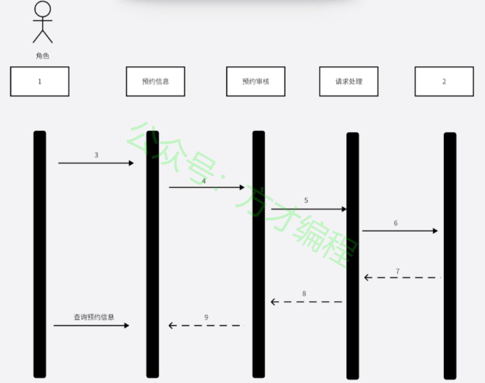
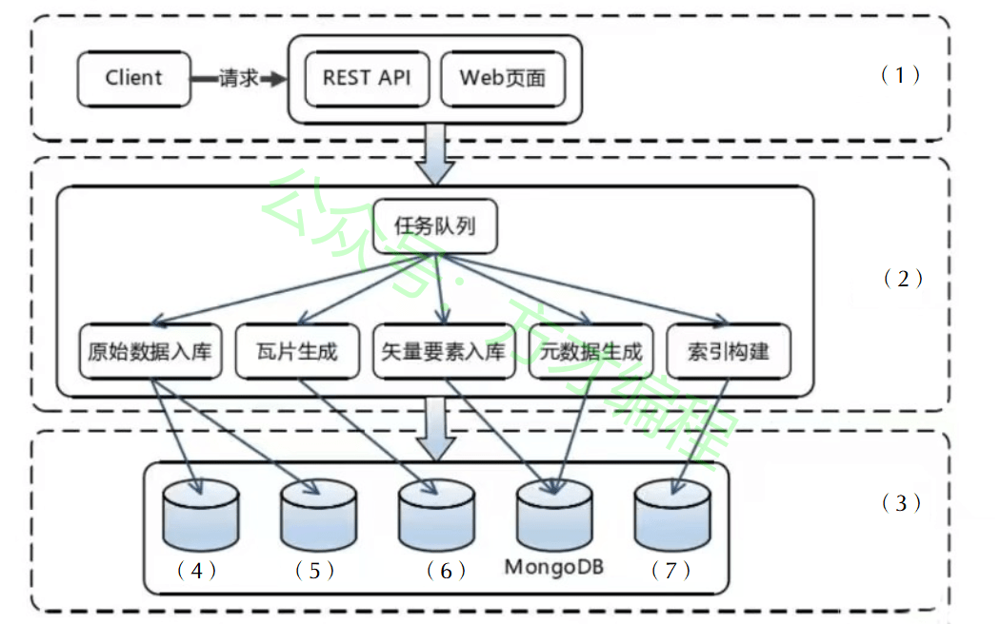

# 2024年5月 系统架构设计师 案例分析真题

> 来源：方才coding 软考真题

---

## 第1大题：软件架构设计与评估

### 试题1

方才coding
首页
教程
软考真题
软考训练营
资源
From Zero To Hero！积跬步以至千里！
点我^~^
点我修改昵称
24年5月系统架构真题 - 第1题

---
### 试题2

方才coding
首页
教程
软考真题
软考训练营
资源
From Zero To Hero！积跬步以至千里！
点我^~^
点我修改昵称
24年5月系统架构真题 - 第2题

---
### 试题3

方才coding
首页
教程
软考真题
软考训练营
资源
From Zero To Hero！积跬步以至千里！
点我^~^
点我修改昵称
24年5月系统架构真题 - 第3题

---

## 第2大题：系统建模与分析

### 试题4

方才coding
首页
教程
软考真题
软考训练营
资源
From Zero To Hero！积跬步以至千里！
点我^~^
点我修改昵称
24年5月系统架构真题 - 第4题

---
### 试题5

方才coding
首页
教程
软考真题
软考训练营
资源
From Zero To Hero！积跬步以至千里！
点我^~^
点我修改昵称
24年5月系统架构真题 - 第5题

---
### 试题6

方才coding
首页
教程
软考真题
软考训练营
资源
From Zero To Hero！积跬步以至千里！
点我^~^
点我修改昵称
24年5月系统架构真题 - 第6题

---
### 试题7

方才coding
首页
教程
软考真题
软考训练营
资源
From Zero To Hero！积跬步以至千里！
点我^~^
点我修改昵称
24年5月系统架构真题 - 第7题

---

## 第3大题：数据库与系统设计

### 试题8

方才coding
首页
教程
软考真题
软考训练营
资源
From Zero To Hero！积跬步以至千里！
点我^~^
点我修改昵称
24年5月系统架构真题 - 第8题

---
### 试题9

方才coding
首页
教程
软考真题
软考训练营
资源
From Zero To Hero！积跬步以至千里！
点我^~^
点我修改昵称
24年5月系统架构真题 - 第9题

---
### 试题10

方才coding
首页
教程
软考真题
软考训练营
资源
From Zero To Hero！积跬步以至千里！
点我^~^
点我修改昵称
24年5月系统架构真题 - 第10题

---

## 第4大题：Web应用架构

### 试题11

方才coding
首页
教程
软考真题
软考训练营
资源
From Zero To Hero！积跬步以至千里！
点我^~^
点我修改昵称
24年5月系统架构真题 - 第11题

---
### 试题12

方才coding
首页
教程
软考真题
软考训练营
资源
From Zero To Hero！积跬步以至千里！
点我^~^
点我修改昵称
24年5月系统架构真题 - 第12题

---
### 试题13

方才coding
首页
教程
软考真题
软考训练营
资源
From Zero To Hero！积跬步以至千里！
点我^~^
点我修改昵称
24年5月系统架构真题 - 第13题

---

## 第5大题：嵌入式与实时系统

### 试题14

方才coding
首页
教程
软考真题
软考训练营
资源
From Zero To Hero！积跬步以至千里！
点我^~^
点我修改昵称
24年5月系统架构真题 - 第14题

---

## 附录：提取的图片

- `img_qr_5b2991402eee.png`：微信小程序二维码，已省略
- `img_logo_fb5107e4dc49.jpeg`：站点 Logo，已省略
- `img_exam_ebd10b1af211.png`：第2大题第1小题架构图/表格图
- `img_exam_5b8d99623dbc.png`：第4大题第1小题架构图/表格图
