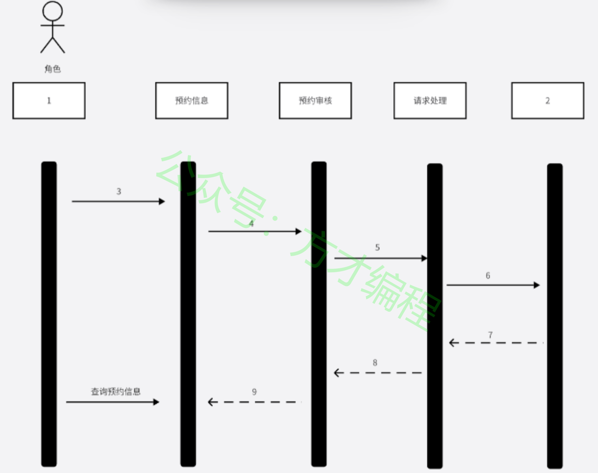
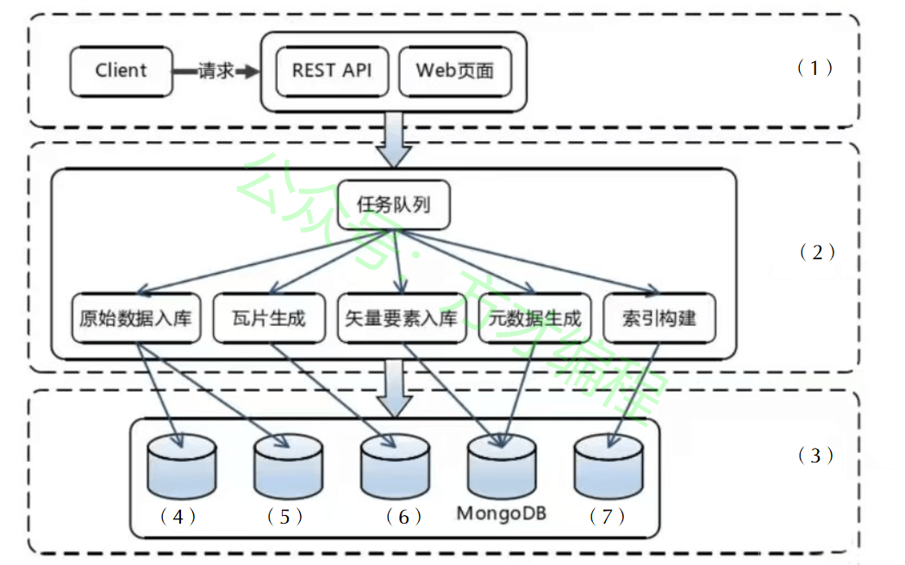

# 2024年5月 系统架构设计师 案例分析真题

> 来源：方才coding 软考真题

---

## 第1大题：软件架构设计与评估

### 试题1

简述微服务架构，并对比单体架构和微服务架构微服务架构的优缺点。

---
### 试题2

质量效用树填空

---
### 试题3

用质量属性6要素描述可用性质量属性场景描述。

---

## 第2大题：系统建模与分析

访问者从微信公众号进入xx系统，发送预约申请，预约通过审核后，自动发送给被访者，被访者处理完毕后，处理完毕消息会通知访问者和门禁管理人员。

---
### 试题1

在序列图存在哪三种消息？

### 试题2

请根据这个业务场景，补充序列图中标数字部分。

---
### 试题3

系统分析设计过程中两种交互图的选取原则。

---
### 试题4

序列图表示条件分支序列片段有哪些。

---

## 第3大题：数据库与系统设计

在分布式系统中，由于多个节点同时操作共享资源，容易产生竞争条件和资源冲突问题。为了保证数据一致性和系统的稳定性，需要一种有效的分布式锁机制来协调各节点对共享资源的访问。为了简化分布式锁的实现并提高性能，张工提出了一种利用数据库主键索引的方法来实现分布式锁。该方法的核心思想是利用数据库的唯一性约束和事务特性，通过对特定记录的插入和删除操作来实现锁的获取和释放。

### 试题1

(9分)基于数据库实现分布式锁的缺点。

---
### 试题2

(10分)举一个产生Redis分布式锁死锁的场景。

---
### 试题3

根据描述，在括号中填入对应的zset指令，存入秒杀的分数命令()，获取分数范围的命令()，获取分数()。

---

## 第4大题：Web应用架构

---
### 试题1

(11分)把下面的选项根据自身作用填写到系统架构图中。处理层、接口层、存储层、MySQL、ES、HDFS、HBase

### 试题2

MongoDB如何存储非结构性数据的，MongoDB矢量化存储的优点。

---
### 试题3

该系统中HDFS使用热数据、温数据和冷数据存储的原因。

---

## 第5大题：嵌入式与实时系统 【缺失】

---

## 附录：提取的图片

- `img_qr_5b2991402eee.png`：微信小程序二维码，已省略
- `img_logo_fb5107e4dc49.jpeg`：站点 Logo，已省略
- `img_exam_ebd10b1af211.png`：第2大题第1小题架构图/表格图
- `img_exam_5b8d99623dbc.png`：第4大题第1小题架构图/表格图
