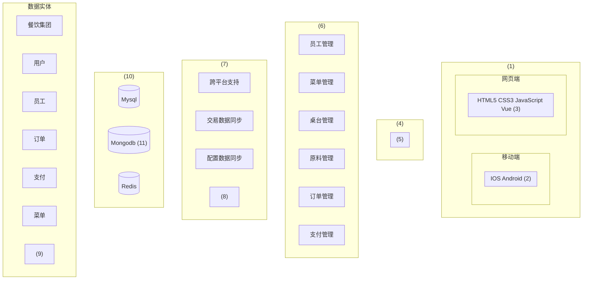
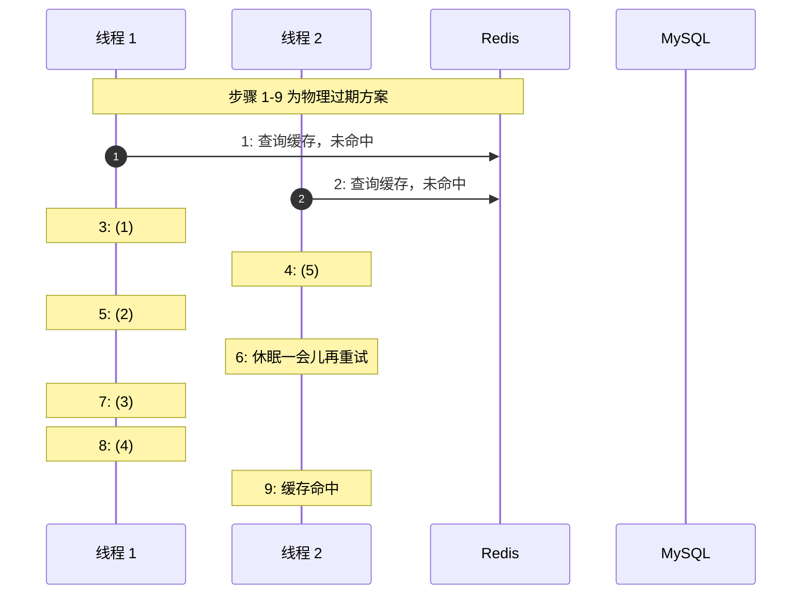
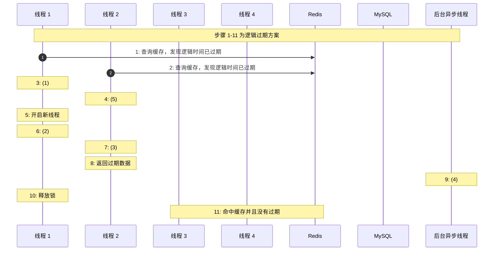

# 2025年11月 系统架构设计师 案例分析真题

> 来源：方才coding 软考真题  
> 总题数：12题（共4道大题，每题含3个小问）

---

## 第一大题：电动车充电管理系统（质量属性分析）

**案例背景：**

某市计划建设一套电动车充电管理系统，为城市中的集中式充电站、路侧分布式充电桩以及用户手机 APP 提供统一的接入与管理服务。

---

### 试题一

系统需满足如下质量需求场景（a～n）：

| 编号 | 场景描述 |
|------|----------|
| a | 当用户通过手机 APP 或现场终端发起"开始充电"操作后，系统必须在 **3 秒内**给出响应结果（成功/失败及原因），否则视为超时。 |
| b | 在充电站方圆 200 米范围内，即使同时有超过 **300 个设备**在充电或等待充电口分配，系统 **CPU 使用率仍需控制在 40% 以下**，保证系统性能稳定。 |
| c | 当运营方提出集成新的第三方支付或计费 API 时，自提出需求之日起，须在 **10 个工作日内**完成设计、开发、联调和上线，不影响原有业务功能。 |
| d | 当系统发生软件故障或节点宕机时，从故障发生到恢复正常对外服务的时间 **不得超过 5 分钟**。 |
| e | 系统需支持模拟雷电、暴雨、冰雹等恶劣天气场景下的充电过程，包括电压波动、网络抖动等，用于**环境仿真测试**。 |
| f | 系统需支持远程调用测试接口（如开放 RESTful 或 gRPC 的测试端点），便于第三方测试平台进行**自动化回归测试**。 |
| g | 对于用户敏感信息（如用户账号、密码、位置信息等），系统需采用 **AES-256 加密算法**进行存储与传输加密，防止数据泄露。 |
| h | 系统支持多语言界面、多种交互模式（触屏、键鼠等），并满足针对视力、听力或肢体障碍用户的**无障碍使用标准**（如放大字体、语音播报等），以提高易用性与可访问性。 |
| i | 系统整体采用模块化设计，要求运维人员在不依赖开发人员参与的前提下，能在 **2 小时内**通过手动配置快速替换故障模块（如更换计费模块、风控模块），保证业务连续性。 |
| j | 针对普通新用户，从首次接触系统到能独立完成一次充电操作的时间，**不应超过 60 秒**，体现系统的易学性和操作简单。 |
| k | 系统前端界面需在不同分辨率与不同类型终端设备（手机、平板、PC、大屏）上**自适应显示**，保证布局清晰、控件可用。 |
| l | 系统需支持**计划内的滚动升级**：在升级某个业务子系统时，已建立的充电会话不能中断，正在充电的用户不受影响，仅新建会话可能短暂切换到备用节点。 |
| m | 系统需支持通过配置文件方式新增或调整充电策略（如分时电价、阶梯计费策略），**无需重新编译和发布应用程序**。 |
| n | 当用户手机暂时没有网络时，APP 自动进入安全模式，从本地安全缓存中展示用户最近一次充电记录和账户关键信息，保证基本信息可见，待网络恢复后自动同步最新数据。 |

请将上述场景（a～n）填入下表对应位置：

| 序号 | 质量属性 | 匹配的选项 |
|------|----------|------------|
| 1 | 可用性 | |
| 2 | 安全性 | |
| 3 | 性能 | |
| 4 | 可修改性 | |
| 5 | 可测试性 | |
| 6 | 易用性 | |

---

### 试题二

质量属性场景一般包含哪 **6 个组成部分**？并指出如下场景中"**集成新 API**"以及"**故障恢复时间不超过 5 分钟**"分别对应哪两个组成部分。

> 场景 c)：当运营方提出集成新的第三方支付或计费 API 时，自提出需求之日起，须在 10 个工作日内完成设计、开发、联调和上线，不影响原有业务功能。
>
> 场景 d)：当系统发生软件故障或节点宕机时，从故障发生到恢复正常对外服务的时间不得超过 5 分钟。

---

### 试题三

用户个人信息、位置信息可能长度较长，而 **AES-256 为定长 128bit（16 字节）块加密算法**。对于超长数据，系统应如何处理才能正确进行加密？请从处理流程上进行说明。

---

## 第二大题：云–端一体点菜系统（DDD 领域驱动设计）

**案例背景：**

某连锁餐饮集团建设了"云–端一体的点菜系统"。

**终端侧（端）：**部署在门店的收银机、服务员手持 PAD、自助点餐机等，负责：
1. 桌台管理与点菜下单；
2. 本地订单暂存与支付；
3. 与云端同步菜品、价格等基础数据。

**云端系统（云）：**部署在集团数据中心或公有云，负责：
1. 菜品基础信息管理（菜品、原料、定价、上下架等）；
2. 订单管理（汇总各门店订单、对账、结算）；
3. 餐厅菜品与菜单配置（不同门店的可售菜品组合）；
4. 员工与权限管理；
5. 报表分析与运营决策。

企业计划采用 **领域驱动设计（DDD）** 方法，对复杂的业务域进行建模和拆分，同时需要考虑云端与终端之间的网络质量不稳定（弱网、间歇断网）的情况，保证点单业务"**尽量可用 + 数据最终一致**"。

---

### 试题四

简要说明 **领域驱动设计（DDD）的基本思想**，并给出"**限界上下文**"的严格定义，并说明其在复杂系统（如本点菜系统）中的作用和好处。

---

### 试题五

请将下列要素归入合适的架构层：

> a. 基础能力层、b. 日志采集、c. 桌台、d. 包裹、e. Ktor、f. Realm、g. Ajax、h. Spring Security、i. 网络层、j. SQLite、k. 业务层、l. 服务层、m. 原料、n. 表示层、o. 设备层、p. 统一代理能力、q. 持久层、r. 领域上下文

系统架构分层图如下（图中 `(1)` ~ `(11)` 为需要填入的位置）：

---

### 试题六

在**网络质量较差甚至间歇性断网**的情况下，点单业务可能遇到哪些典型问题（**至少列出 3 种**），请结合本案例给出对应的解决思路。

---

## 第三大题：电商平台 MySQL + Redis 缓存架构（缓存击穿问题）

**案例背景：**

某互联网电商平台采用 **MySQL + Redis** 的缓存架构。核心接口为"**查询商品详情**"，日常峰值 QPS 达到几万。

系统目前使用 **Cache-Aside 模式**：先查 Redis 缓存，命中则直接返回；未命中时访问数据库，并把结果写回 Redis，设置过期时间（TTL）。

近期运维发现：某些**热点商品在缓存失效瞬间**，会出现大量请求同时击穿缓存、直接访问数据库，导致数据库连接数飙升、接口响应超时，影响系统整体可用性。

架构组组织评审，提出了两种优化思路：

- **方案一（王工）：基于互斥锁的物理过期方案。** 仍然依赖 Redis TTL，缓存正常按过期时间删除。当缓存未命中时，只有拿到互斥锁的线程才允许去数据库重建缓存，其它线程等待或重试。

- **方案二（李工）：逻辑过期方案。** 不依赖互斥锁做强同步，可返回过期数据。Redis 中存储"业务数据 + 逻辑过期时间字段"，可以不设置或设置很长 TTL。访问时若发现逻辑过期，可以先返回旧数据，同时由获取到非互斥锁的线程或后台异步线程去数据库重建缓存。

---

### 试题七

请根据王工"**基于互斥锁的缓存查询过程**"（物理过期方案）的主要处理步骤，把下方的序列图补充完整。

---

### 试题八

请给出李工"**逻辑过期方案（可返回过期数据）**"的缓存查询过程的主要处理步骤，把下方的序列图补充完整。

---

### 试题九

从以下维度分析两种方法的优劣：

- **实现复杂度**
- **数据一致性**
- **性能影响**
- **内存占用**
- **适用场景**

---

## 第四大题：嵌入式智能融合操作系统

**案例背景：**

某科技公司希望在其嵌入式产品线上全面提升智能化能力，计划研发一套"**嵌入式智能融合操作系统**"。项目目标强调 **AI 与操作系统深度融合**，以实现统一的智能调度、更高效的数据流动、边云协同以及更智能的用户交互体验。

但在项目需求讨论阶段，老王与老李对"**AI for OS（AI 支撑操作系统）**"与"**OS for AI（操作系统支撑 AI）**"的关系理解不清；同时对智能化操作系统的内涵、智能功能、轻量化内核等关键概念也较为模糊。

为推进项目立项，公司要求项目组完成以下问题的分析。

---

### 试题十

给出"**智能化操作系统**"的定义，并列举 **5 个以上典型的智能化功能**。

---

### 试题十一

根据公司"嵌入式智能融合 OS"建设目标，老王老李需要判断系统能力属于：**AI for OS** 还是 **OS for AI**，现给出 11 项系统能力，请分类并说明理由：

| 编号 | 项目 | 判断 |
|------|------|------|
| a | 智能化调度 | |
| b | 系统动态调优 | |
| c | 获得无限算力（扩容） | |
| d | 获得推理能力（AI 加速框架） | |
| e | 更好的可靠性 | |
| f | 更好的安全性 | |
| g | 运维简单化（智能化运维） | |
| h | 云端–边端协同 | |
| i | 虚拟隔离环境 | |
| j | 人机交互 AI 化 | |
| k | 智能化数据流动 | |

---

### 试题十二

说明"**轻量化内核**"的定义与主要特点。

---

## 附录：提取的图片

| 来源文件 | 说明 |
|----------|------|
| 软考真题202_img_1.png | 云–端一体点菜系统架构分层图（已在试题五中用 mermaid 复刻） |
| 其余 PNG/JPEG | 网站二维码、Logo 等 UI 装饰元素，已省略 |
