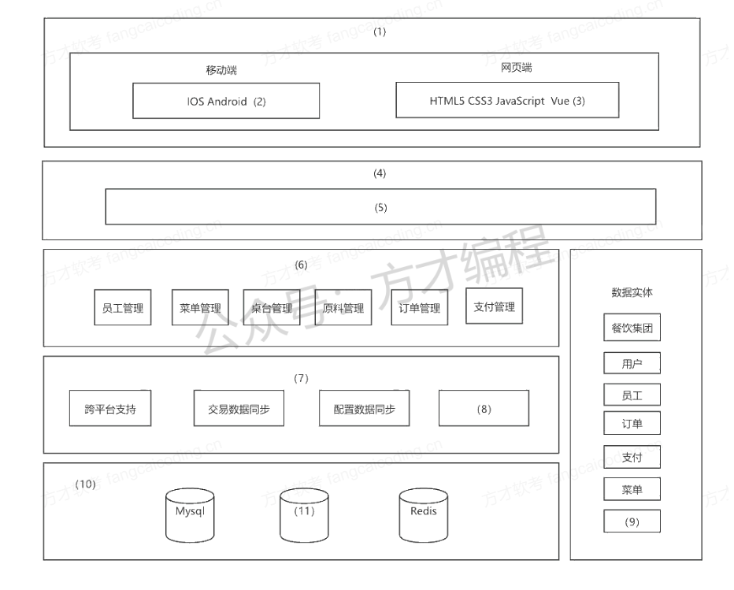
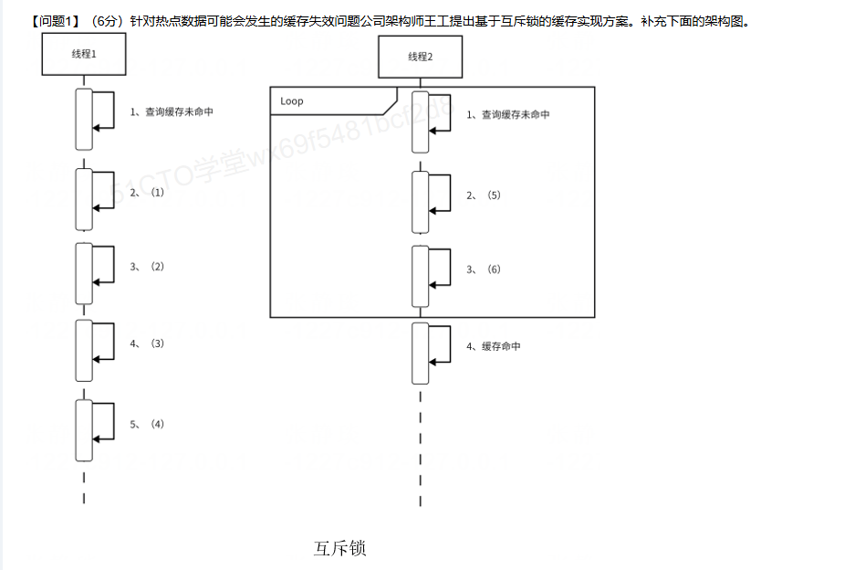
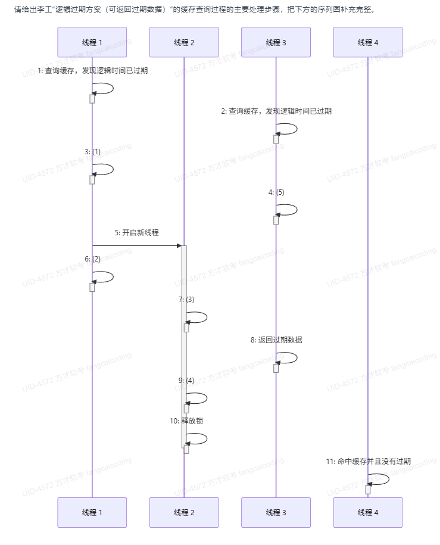

# 2025年11月 系统架构设计师 案例分析真题

> 来源：方才coding 软考真题  
> 总题数：12题（共4道大题，每题含3个小问）

---

## 第一大题：电动车充电管理系统（质量属性分析）

**案例背景：**

某市计划建设一套**电动车充电管理系统**，为城市中的集中式充电站、路侧分布式充电桩以及用户手机 APP 提供统一的接入与管理服务。

系统需满足如下质量需求场景（a～n）：

| 编号 | 场景描述 |
|------|----------|
| a | 当用户通过手机 APP 或现场终端发起"开始充电"操作后，系统必须在 **3 秒内**给出响应结果（成功/失败及原因），否则视为超时。 |
| b | 在充电站方圆 200 米范围内，即使同时有超过 **300 个设备**在充电或等待充电口分配，系统 **CPU 使用率仍需控制在 40% 以下**，保证系统性能稳定。 |
| c | 当运营方提出集成新的第三方支付或计费 API 时，自提出需求之日起，须在 **10 个工作日内**完成设计、开发、联调和上线，不影响原有业务功能。 |
| d | 当系统发生软件故障或节点宕机时，从故障发生到恢复正常对外服务的时间 **不得超过 5 分钟**。 |
| e | 系统需支持模拟雷电、暴雨、冰雹等恶劣天气场景下的充电过程，包括电压波动、网络抖动等，用于**环境仿真测试**。 |
| f | 系统需支持远程调用测试接口（如开放 RESTful 或 gRPC 的测试端点），便于第三方测试平台进行**自动化回归测试**。 |
| g | 对于用户敏感信息（如用户账号、密码、位置信息等），系统需采用 **AES-256 加密算法**进行存储与传输加密，防止数据泄露。 |
| h | 系统支持多语言界面、多种交互模式（触屏、键鼠等），并满足针对视力、听力或肢体障碍用户的**无障碍使用标准**（如放大字体、语音播报等），以提高易用性与可访问性。 |
| i | 系统整体采用模块化设计，要求运维人员在不依赖开发人员参与的前提下，能在 **2 小时内**通过手动配置快速替换故障模块（如更换计费模块、风控模块），保证业务连续性。 |
| j | 针对普通新用户，从首次接触系统到能独立完成一次充电操作的时间，**不应超过 60 秒**，体现系统的易学性和操作简单。 |
| k | 系统前端界面需在不同分辨率与不同类型终端设备（手机、平板、PC、大屏）上**自适应显示**，保证布局清晰、控件可用。 |
| l | 系统需支持**计划内的滚动升级**：在升级某个业务子系统时，已建立的充电会话不能中断，正在充电的用户不受影响，仅新建会话可能短暂切换到备用节点。 |
| m | 系统需支持通过配置文件方式新增或调整充电策略（如分时电价、阶梯计费策略），**无需重新编译和发布应用程序**。 |
| n | 当用户手机暂时没有网络时，APP 自动进入安全模式，从本地安全缓存中展示用户最近一次充电记录和账户关键信息，保证基本信息可见，待网络恢复后自动同步最新数据。 |

### 问题1

请将上述场景（a～n）填入下表对应位置：

| 序号 | 质量属性 | 匹配的选项 |
|------|----------|------------|
| 1 | 可用性 | |
| 2 | 安全性 | |
| 3 | 性能 | |
| 4 | 可修改性 | |
| 5 | 可测试性 | |
| 6 | 易用性 | |

---

**我的答案**

- 可用性 b  d i  l  n 
- 安全性 g 
- 性能  a 
- 可修改性 c m 
- 可测试性 e  f 
- 易用性  h  j  k 

---

**评分：约 12/14 分**

**评判：**
- ✓ 安全性 (g)、性能 (a)、可修改性 (c, m)、可测试性 (e, f)、易用性 (h, j, k) 全部正确
- ✓ 可用性中的 d（5分钟恢复）、i（2小时换模块）、l（滚动升级）正确
- ✗ (b) "300个设备CPU使用率<40%" → 正确属性是**性能**（资源利用率/吞吐量指标），不是可用性
- ✗ (n) "离线时展示缓存数据" → 正确属性是**可靠性**（容错、降级运行），不是可用性
- 你多给了可用性2个场景，性能和可靠性各少1个

---

**补充答案（标准参考）：**

| 质量属性 | 场景编号 | 匹配依据 |
|---------|---------|---------|
| **可用性** | d, i, l | d=5分钟内恢复服务、i=2小时内替换故障模块、l=滚动升级不中断 |
| **安全性** | g | AES-256 加密存储传输 |
| **性能** | a, b | a=3秒内响应、b=300设备并发下CPU<40%（资源利用率） |
| **可修改性** | c, m | c=10天集成新API、m=配置文件调整无需重新编译 |
| **可测试性** | e, f | e=环境仿真测试、f=远程自动化回归测试 |
| **易用性** | h, j, k | h=多语言无障碍、j=60秒学会操作、k=自适应显示 |
| **可靠性** | n | n=离线降级展示缓存（容错、降级运行） |

> 注：本题共14个场景，6个质量属性。可靠性单独列出（n），不在题目表格中但考试中可能出现。

### 问题2

**质量属性场景**一般包含哪 **6 个组成部分**？并指出如下场景中"**集成新 API**"以及"**故障恢复时间不超过 5 分钟**"分别对应哪两个组成部分。

> 场景 c)：当运营方提出集成新的第三方支付或计费 API 时，自提出需求之日起，须在 10 个工作日内完成设计、开发、联调和上线，不影响原有业务功能。
>
> 场景 d)：当系统发生软件故障或节点宕机时，从故障发生到恢复正常对外服务的时间不得超过 5 分钟。

**我的答案**

质量属性场景：  刺激  刺激源  响应  响应度量  

**集成新 API** 属于 刺激

**故障恢复时间不超过 5 分钟** 属于 响应度量

---

**评分：约 3/6 分**

**评判：**
- ✓ 列出了4个要素（刺激、刺激源、响应、响应度量），但缺少**环境**和**工件**两个要素
- ✓ "集成新 API" = 刺激 ✓ 正确
- ✓ "故障恢复时间不超过 5 分钟" = 响应度量 ✓ 正确
- 缺少6要素中"环境"（刺激发生时系统所处的状态）和"工件"（被刺激影响的系统部分）

---

**补充答案（标准参考）：**

**质量属性场景的 6 个组成部分：**

| 要素 | 说明 | 示例 |
|------|------|------|
| **刺激源（Source）** | 产生刺激的事物 | 用户、外部系统、硬件故障 |
| **刺激（Stimulus）** | 影响系统的事件 | 集成新API、节点宕机、流量激增 |
| **环境（Environment）** | 刺激发生时系统的状态 | 正常运行、系统过载、降级模式 |
| **工件（Artifact）** | 被刺激影响的系统部分 | 计费模块、数据库、网络 |
| **响应（Response）** | 系统对刺激的反应 | 切换备用节点、通知管理员 |
| **响应度量（Response Measure）** | 衡量响应是否合格的标准 | 5分钟内恢复、10天完成开发 |

**场景 c 中的"集成新 API" → 刺激（Stimulus）**
**场景 d 中的"故障恢复时间不超过 5 分钟" → 响应度量（Response Measure）**

---

### 问题3

用户个人信息、位置信息可能长度较长，而 **AES-256 为定长 128bit（16 字节）块加密算法**。对于超长数据，系统应如何处理才能正确进行加密？请从处理流程上进行说明。

**我的答案**

超长数据使用  **AES-256 定长 128bit（16 字节）块加密算法** 加密如下

- 将待加密数据按一定长度和方法进行分序号进行拆分 ，拆分后再将数据进行分别加密传输
- 收到数据后 再分别对数据进行解密，然后按照序号在进还原文本

---

**评分：约 2/5 分**

**评判：**
- ✓ 方向正确：数据拆分→分别加密→传输→解密→按序号还原
- ✗ 缺少关键技术术语：未提到**分组密码工作模式**（如 CBC、CTR、GCM 等），这是本题的核心考点
- ✗ 未提到**初始化向量（IV）**的作用（防止相同明文块产生相同密文）
- ✗ 未提到**填充方案**（如 PKCS#7）处理最后一块不足 16 字节的情况
- ✗ 未提到**认证加密**（如 GCM 模式）保证数据完整性

---

**补充答案（标准参考）：**

AES-256 是 128bit（16字节）块加密算法，本身只加密固定 16 字节的单个数据块，不处理超长数据。超长数据需通过加密组件库（如 Java Cipher、Python cryptography）在外层自动封装分块、填充和工作模式逻辑。具体处理流程如下：

1. **数据分块**：将超长用户信息按 16 字节（128bit）划分为固定长度的明文块
2. **填充处理**：若最后一块不足 16 字节，使用 **PKCS#7 填充**补齐（缺 N 字节则补 N 个 0x0N）；若恰好整除，额外补 1 个完整块确保可去填充
3. **分组加密**：选用安全模式（如 CBC、CTR、GCM），首块与随机 IV 异或后加密，后续块与前一块密文异或再加密，保证相同明文块生成不同密文
4. **密文拼接**：将所有分块加密后的密文按顺序拼接，形成最终完整密文（用于存储/传输）

**解密流程**：先拆分密文为 16 字节块 → 逐块解密 → 去除填充 → 还原原始数据

> **补充说明**：AES 算法本身只做"加密固定 16 字节单个块"一件事；分块、填充、工作模式（CBC/GCM）由加密组件库自动封装实现。

---

## 第二大题：云–端一体点菜系统

**案例背景：**

某连锁餐饮集团建设了"云–端一体的点菜系统"。

**终端侧（端）：**部署在门店的收银机、服务员手持 PAD、自助点餐机等，负责：
1. 桌台管理与点菜下单；
2. 本地订单暂存与支付；
3. 与云端同步菜品、价格等基础数据。

**云端系统（云）：**部署在集团数据中心或公有云，负责：
1. 菜品基础信息管理（菜品、原料、定价、上下架等）；
2. 订单管理（汇总各门店订单、对账、结算）；
3. 餐厅菜品与菜单配置（不同门店的可售菜品组合）；
4. 员工与权限管理；
5. 报表分析与运营决策。

企业计划采用 **领域驱动设计（DDD）** 方法，对复杂的业务域进行建模和拆分，同时需要考虑云端与终端之间的网络质量不稳定（弱网、间歇断网）的情况，保证点单业务"**尽量可用 + 数据最终一致**"。

---

### 问题1

简要说明 **领域驱动设计（DDD）的基本思想**，并给出"**限界上下文**"的严格定义，并说明其在复杂系统（如本点菜系统）中的作用和好处。

---

**评分：0/8 分**

**评判：**
-  未作答

---

**补充答案（标准参考）：**

**DDD 基本思想：**
领域驱动设计是一种以业务领域为核心的软件设计方法论，强调通过"通用语言"（Ubiquitous Language）让技术人员与业务专家使用同一套术语沟通，将业务逻辑直接映射到代码模型中。核心概念包括实体、值对象、聚合根、领域服务和限界上下文。

**限界上下文（Bounded Context）定义：**
限界上下文是 DDD 中用于划分复杂业务域的边界，每个限界上下文拥有独立的领域模型、通用语言和数据库。在边界内，术语和规则具有一致的含义；跨越边界时，需要通过上下文映射（Context Mapping）进行转换。

**在点菜系统中的作用：**
1. **业务域拆分**：将复杂的点菜系统拆分为订单管理、菜品管理、桌台管理、支付管理等独立上下文
2. **降低复杂度**：每个团队专注一个上下文，模型互不干扰
3. **独立演进**：各上下文可独立开发、部署和扩展
4. **云-端协同**：云端负责全局上下文（菜品库、对账），端侧负责本地上下文（桌台、暂存订单），通过上下文映射实现数据同步

---

### 问题2

---

**评分：0/14 分**

**评判：**
-  未作答

---

**补充答案（标准参考）：**

根据架构分层图，填空如下：

| 编号 | 答案 | 说明 |
|------|------|------|
| (1) | **表示层** | 最顶层，包含移动端和网页端 |
| (2) | **Ajax** | 移动端技术栈中的通信方式 |
| (3) | **网络层** | 网页端技术栈中的网络通信层 |
| (4) | **服务层** | 中间层，提供跨端服务 |
| (5) | **统一代理能力** | 服务层的核心代理功能 |
| (6) | **业务层** | 包含员工管理、菜单管理等业务模块 |
| (7) | **基础能力层** | 提供跨平台支持、数据同步等基础能力 |
| (8) | **日志采集** | 基础能力之一，与跨平台支持并列 |
| (9) | **桌台** | 数据实体中的桌台信息 |
| (10) | **持久层** | 最底层，数据存储 |
| (11) | **SQLite** | 端侧本地数据库 |

---

### 问题3

---

**评分：0/3 分**

**评判：**
-  未作答

---

**补充答案（标准参考）：**

**弱网/断网场景下的典型问题及解决思路：**

| 问题 | 说明 | 解决思路 |
|------|------|---------|
| **下单失败/超时** | 网络不稳定导致下单请求超时或失败 | 端侧本地暂存订单，网络恢复后自动同步重试 |
| **菜品价格不一致** | 云端调价后，端侧缓存的价格未及时更新 | 端侧缓存设置短 TTL，关键操作前强制校验价格 |
| **重复下单** | 网络抖动导致请求超时，用户重复点击下单 | 端侧生成唯一订单 ID，云端去重校验 |
| **桌台状态不一致** | 多个端同时操作同一桌台，状态冲突 | 端侧乐观锁 + 云端冲突检测，最终以云端为准 |
| **支付状态不明** | 支付请求发出后断网，无法确认支付结果 | 端侧轮询支付状态，支持离线凭证后补验证 |

> **核心策略**：端侧"尽量可用"（本地暂存+离线操作）+ 云端"最终一致"（网络恢复后同步+冲突解决）。

---

### 问题1

简要说明 **领域驱动设计（DDD）的基本思想**，并给出"**限界上下文**"的严格定义，并说明其在复杂系统（如本点菜系统）中的作用和好处。

### 问题2
请将下列要素归入合适的架构层：

> a. 基础能力层、b. 日志采集、c. 桌台、d. 包裹、e. Ktor、f. Realm、g. Ajax、h. Spring Security、i. 网络层、j. SQLite、k. 业务层、l. 服务层、m. 原料、n. 表示层、o. 设备层、p. 统一代理能力、q. 持久层、r. 领域上下文

系统架构分层图如下（图中 `(1)` ~ `(11)` 为需要填入的位置）：

---

### 问题3

在**网络质量较差甚至间歇性断网**的情况下，点单业务可能遇到哪些典型问题（**至少列出 3 种**），请结合本案例给出对应的解决思路。

---

## 第三大题：电商平台 MySQL + Redis 缓存架构（缓存击穿问题）

**案例背景：**

某互联网电商平台采用 MySQL + Redis 的缓存架构。核心接口为"查询商品详情"，日常峰值 QPS 达到几万。

系统目前使用 Cache-Aside 模式：先查 Redis 缓存，命中则直接返回；未命中时访问数据库，并把结果写回 Redis，设置过期时间（TTL）。

近期运维发现：某些热点商品在缓存失效瞬间，会出现大量请求同时击穿缓存、直接访问数据库，导致数据库连接数飙升、接口响应超时，影响系统整体可用性。

架构组组织评审，提出了两种优化思路：

- 方案一（王工）：基于互斥锁的物理过期方案。 仍然依赖 Redis TTL，缓存正常按过期时间删除。当缓存未命中时，只有拿到互斥锁的线程才允许去数据库重建缓存，其它线程等待或重试。

- 方案二（李工）：逻辑过期方案。 不依赖互斥锁做强同步，可返回过期数据。Redis 中存储"业务数据 + 逻辑过期时间字段"，可以不设置或设置很长 TTL。访问时若发现逻辑过期，可以先返回旧数据，同时由获取到非互斥锁的线程或后台异步线程去数据库重建缓存。

---

### 问题1

请根据王工"**基于互斥锁的缓存查询过程**"（物理过期方案）的主要处理步骤，把下方的序列图补充完整。

**我的答案**

（1）获取互斥锁，获取到进行下一步

（2）根据key 查询数据库获取值

（3）将获取到的值更新到 redis 缓存中

（4）释放互斥锁，并且返回查询值

（5）获取互斥锁，但是没获取到，等待

（6）去缓存中重新查询值

---

**评分：约 4/6 分**

**评判：**
- ✓ (1) 获取互斥锁 ✓ 正确
- ✓ (2) 查询数据库 ✓ 正确
- ✓ (3) 更新 Redis 缓存 ✓ 正确
- ✓ (4) 释放互斥锁并返回 ✓ 正确
- ✓ (5) 未获取到锁，等待/重试 ✓ 正确
- (6) "去缓存中重新查询值" 方向正确，但更准确的表述是**循环等待直到获取锁**（Loop 框表示持续重试），不仅仅是查缓存

---

**补充答案（标准参考）：**

基于互斥锁的缓存查询流程（王工方案）：

| 编号 | 标准答案 | 说明 |
|------|---------|------|
| (1) | **尝试获取互斥锁** | 缓存未命中后，尝试获取分布式锁 |
| (2) | **查询数据库获取数据** | 获取锁成功后，访问数据库查询 |
| (3) | **将查询结果写入 Redis 缓存** | 将数据库结果回写缓存，设置 TTL |
| (4) | **释放互斥锁，返回数据** | 解锁后返回查询结果 |
| (5) | **获取锁失败，等待/自旋重试** | 未获取到锁的线程进入 Loop 循环等待 |
| (6) | **重新查询缓存** | 等待一段时间后再次查询缓存（此时应已被其他线程重建） |

> **核心逻辑**：一个线程拿锁重建缓存，其他线程在 Loop 中自旋等待，缓存重建后重试命中返回。

---

### 问题2

请给出李工"**逻辑过期方案（可返回过期数据）**"的缓存查询过程的主要处理步骤，把下方的序列图补充完整。

**我的答案**

（1）尝试获取刷新锁，获取到

（2）返回过期数据（不阻塞用户）

（3）查询数据库获取最新数据

（4）更新 Redis 缓存（写入新数据+刷新逻辑过期时间）

（5）尝试获取刷新锁，获取失败

---

**评分：约 2/5 分**

**评判：**
-  原题图片有误（旧图为 3 线程 8 空），用户按旧图作答了 8 项。按新图 5 空重新评判：
-  用户答案方向上部分正确：
  - "返回过期数据" ✓（对应(2)）
  - "去数据库查询数据并重建缓存" ✓（对应(3)(4)）
  - "获取互斥锁" ✓（对应(1)(5)的刷新锁概念）
-  但顺序混乱：(1) 应是"获取刷新锁"而非"返回过期数据"；(2) 应是"返回过期数据"而非"获取互斥锁"
-  核心逻辑理解有偏差：逻辑过期的关键是**先获取锁 → 先返回旧数据 → 再异步重建**

---

**补充答案（标准参考）：**

李工"逻辑过期方案"缓存查询流程（新图 4 线程，5 空）：

| 编号 | 标准答案 | 所在步骤 | 说明 |
|------|---------|---------|------|
| (1) | **尝试获取刷新锁** | 线程1 步骤3 | 发现逻辑过期后，尝试获取分布式刷新锁 |
| (2) | **返回过期数据** | 线程1 步骤6 | 获取到锁后，先返回旧数据给用户（不阻塞），再开异步线程重建 |
| (3) | **查询数据库获取最新数据** | 线程2 步骤7 | 异步线程从 DB 读取最新数据 |
| (4) | **更新 Redis 缓存并刷新逻辑过期时间** | 线程2 步骤9 | 将新数据写入缓存，更新逻辑过期字段 |
| (5) | **尝试获取刷新锁（失败）** | 线程3 步骤4 | 线程3也发现过期，但锁已被线程1占用，放弃刷新 |

**4 线程角色说明：**
- **线程1**：首个发现逻辑过期的请求 → 获取锁 → 返回旧数据 → 开启异步重建
- **线程2**：线程1开启的异步重建线程 → 查 DB → 更新缓存 → 释放锁
- **线程3**：并发请求也发现过期 → 获取锁失败 → 直接返回旧数据
- **线程4**：缓存命中且未过期 → 直接返回（对比参照）

> **核心流程**：先返回旧数据（保可用性）→ 一个线程拿锁异步重建（保最终一致性）→ 其他线程放弃刷新也返回旧数据。

---

### 问题3

对比王工和李工方案的各自优缺点

**我的答案**

从以下几个方面进行对比

- 实现复杂度 ： 王工简单易懂， 李工难度较大

- 性能：王工方案比李工方案慢

- 数据一致性 ：王工方案数据一致性强，李工方案一致性较弱

- 可用性：王工方案 当缓存失效时，系统可能因为大量查询导致不可用，；李工方案可返回过期数据，可用性较好

- 测试性：王工方案好测试 ，李工方案不好测试

---

**评分：约 7/11 分**

**评判：**
- ✓ 实现复杂度：王工简单、李工复杂 ✓ 正确
- ✓ 性能：王工比李工慢（锁竞争导致等待）✓ 正确
- ✓ 数据一致性：王工强、李工弱 ✓ 正确
- ✓ 可用性：王工差（锁超时可能不可用）、李工好（始终返回旧数据）✓ 正确
- ✗ "测试性"不是本题的对比维度，应替换为更相关的维度如**适用场景**或**缓存穿透风险**
- 缺少对**缓存击穿防护效果**的对比

---

**补充答案（标准参考）：**

| 对比维度 | 王工方案（互斥锁+物理过期） | 李工方案（逻辑过期） |
|---------|--------------------------|-------------------|
| **实现复杂度** | 简单，只需加分布式锁 | 复杂，需维护逻辑过期字段+异步刷新机制 |
| **性能/响应延迟** | 较低，未获取锁的线程需等待 | 高，始终立即返回旧数据，无等待 |
| **数据一致性** | 强，重建后返回最新数据 | 弱，可能返回过期数据（直到异步刷新完成） |
| **可用性** | 较差，锁超时或 DB 故障时可能不可用 | 高，即使 DB 故障也能返回旧数据 |
| **缓存击穿防护** | 好，锁保证只有一个线程查 DB | 好，异步刷新保证不会同时查 DB |
| **适用场景** | 对数据一致性要求高的场景 | 对可用性要求高、可容忍短暂数据不一致的场景 |

> **选型建议**：热点商品详情（可容忍短暂不一致）→ 逻辑过期；库存/价格（强一致性）→ 互斥锁。

---

## 第四大题：嵌入式智能融合操作系统

**案例背景：**

某科技公司希望在其嵌入式产品线上全面提升智能化能力，计划研发一套"**嵌入式智能融合操作系统**"。项目目标强调 **AI 与操作系统深度融合**，以实现统一的智能调度、更高效的数据流动、边云协同以及更智能的用户交互体验。

但在项目需求讨论阶段，老王与老李对"**AI for OS（AI 支撑操作系统）**"与"**OS for AI（操作系统支撑 AI）**"的关系理解不清；同时对智能化操作系统的内涵、智能功能、轻量化内核等关键概念也较为模糊。

为推进项目立项，公司要求项目组完成以下问题的分析。

---

### 问题1

给出"**智能化操作系统**"的定义，并列举 **5 个以上典型的智能化功能**。

**我的答案**

智能化操作系统：即可以自动完成一些任务并且和AI 应用紧密结合的操作系统

功能如下

- 部署AI时可以自动进行扩容，区别一般操作系统
- 系统运维管理时可自动显示自己的系统状态
- 当进行AI任务时，可自动进行资源调度更好完成任务
- 当发生故障时 可主动自动进行故障修复
- 用户交互体验更好，可自动辅助用户进行任务操作和管理

---

**评分：约 5/8 分**

**评判：**
- ✓ 定义方向正确（自动完成任务+AI结合），但表述偏口语化，缺少"将 AI 能力嵌入操作系统内核"的关键描述
- ✓ 5个功能方向都对，但描述不够专业和精准
- ✗ "自动扩容"更偏向云计算特性，不是智能化 OS 的核心功能
- ✗ "自动显示系统状态"描述过于简单，应为"智能系统监控与预测性维护"

---

**补充答案（标准参考）：**

**智能化操作系统定义：**
智能化操作系统是将人工智能技术与操作系统深度融合，使 OS 具备自主学习、智能决策和自适应能力的新一代操作系统。它通过 AI 算法优化资源调度、安全防护、运维管理等核心功能，实现从"被动响应"到"主动智能"的转变。

**5 个典型智能化功能：**
1. **智能资源调度**：基于 AI 预测工作负载，动态分配 CPU/内存/IO 资源，优化系统性能
2. **智能安全防护**：利用机器学习检测异常行为和潜在威胁，实现主动安全防御
3. **智能运维管理**：自动监控系统状态，预测故障并自愈修复，降低人工运维成本
4. **智能能耗管理**：根据使用模式自动调整设备功耗策略，延长电池续航
5. **智能人机交互**：支持语音、手势、视觉等多模态交互，提供个性化用户体验

---

### 问题2

根据公司"嵌入式智能融合 OS"建设目标，老王老李需要判断系统能力属于：**AI for OS** 还是 **OS for AI**，现给出 11 项系统能力，请分类并说明理由：

| 编号 | 项目 | 判断 |
|------|------|------|
| a | 智能化调度 | |
| b | 系统动态调优 | |
| c | 获得无限算力（扩容） | |
| d | 获得推理能力（AI 加速框架） | |
| e | 更好的可靠性 | |
| f | 更好的安全性 | |
| g | 运维简单化（智能化运维） | |
| h | 云端–边端协同 | |
| i | 虚拟隔离环境 | |
| j | 人机交互 AI 化 | |
| k | 智能化数据流动 | |

**我的答案**

- **AI for OS**   ：a   b     g  h  j   k

- **OS for AI **  ：c   d   e  f   i 

---

**评分：约 8/13 分**

**评判：**
- 用户分类：
  - AI for OS: a b g h j k（6项）
  - OS for AI: c d e f i（5项）
- 共11项，用户全部分类了 ✓
- 部分分类存疑：
  - (h) 云边协同 → 应为 **OS for AI**（OS 提供云边协同能力来支撑 AI 任务），用户归为 AI for OS ✗
  - (k) 智能数据流动 → 可能归 **AI for OS**（AI 优化 OS 数据调度）✓

---

**补充答案（标准参考）：**

| 编号 | 项目 | 判断 | 理由 |
|------|------|------|------|
| a | 智能化调度 | **AI for OS** | AI 优化 OS 的资源调度策略 |
| b | 系统动态调优 | **AI for OS** | AI 自动调整 OS 参数和性能 |
| c | 获得无限算力（扩容） | **OS for AI** | OS 为 AI 提供弹性算力资源 |
| d | 获得推理能力（AI 加速框架） | **OS for AI** | OS 内置 AI 推理加速支持 |
| e | 更好的可靠性 | **OS for AI** | OS 为 AI 任务提供高可靠运行环境 |
| f | 更好的安全性 | **OS for AI** | OS 为 AI 模型和数据提供安全隔离 |
| g | 运维简单化（智能运维） | **AI for OS** | AI 赋能 OS 运维管理 |
| h | 云端-边端协同 | **OS for AI** | OS 提供云边协同能力支撑 AI 部署 |
| i | 虚拟隔离环境 | **OS for AI** | OS 为 AI 任务提供隔离沙箱 |
| j | 人机交互 AI 化 | **AI for OS** | AI 提升 OS 交互体验 |
| k | 智能化数据流动 | **AI for OS** | AI 优化 OS 数据调度和传输 |

**核心区分原则：**
- **AI for OS**：AI 技术用来增强/优化操作系统自身的能力（调度、运维、交互等）
- **OS for AI**：操作系统为 AI 应用/任务提供底层支撑能力（算力、隔离、加速等）

### 问题3

说明"**轻量化内核**"的定义与主要特点。

**我的答案**

轻量化内核：即体积相对一般内存较小，然后内核功能较少，可以进行快速部署的内核

特点

- 体积小
- 功能少
- 部署快
- 修改快

---

**评分：约 2/4 分**

**评判：**
- ✓ "体积小"和"快速部署"方向正确
- ✗ "功能少"表述不当——轻量化内核不是功能少，而是**精简但核心功能完整**，去除了冗余模块
- ✗ "修改快"不是轻量化内核的核心特点
- 缺少关键特点：**低内存占用**、**快速启动**、**实时性**、**可裁剪性**

---

**补充答案（标准参考）：**

**轻量化内核定义：**
轻量化内核是指经过精简优化、去除冗余功能、保留核心调度和服务能力的操作系统内核。它通过裁剪不必要的模块和服务，实现更小的体积、更低的资源消耗和更快的启动速度。

**主要特点：**
1. **体积小**：代码量少，占用存储空间小（可低至几 MB 甚至 KB 级）
2. **低内存占用**：运行时内存需求低，适合资源受限的嵌入式设备
3. **快速启动**：初始化流程精简，启动时间短（毫秒~秒级）
4. **实时性好**：调度延迟低，响应确定性高，适合实时控制场景
5. **可裁剪性**：可根据具体应用需求灵活裁剪功能模块
6. **核心功能完整**：虽然精简，但进程调度、内存管理、中断处理等核心功能完备

---

## 附录：提取的图片

| 来源文件 | 说明 |
|----------|------|
| 软考真题202_img_1.png | 云–端一体点菜系统架构分层图（已在试题五中用 mermaid 复刻） |
| 其余 PNG/JPEG | 网站二维码、Logo 等 UI 装饰元素，已省略 |

---

## 📊 总评

软考案例分析共 **5 道大题，每大题 25 分，总分 75 分**。（第2大题未作答；第5大题文件缺失）

| 大题 | 满分 | 你的得分 | 得分率 |
|------|------|---------|--------|
| 第1大题 问题1 | 14 | 12 | 85.7% |
| 第1大题 问题2 | 6 | 3 | 50.0% |
| 第1大题 问题3 | 5 | 2 | 40.0% |
| **第1大题 小计** | **25** | **17** | **68.0%** |
| 第3大题 问题1 | 6 | 4 | 66.7% |
| 第3大题 问题2 | 5 | 2 | 40.0% |
| 第3大题 问题3 | 11 | 7 | 63.6% |
| **第3大题 小计** | **25** | **13** | **52.0%** |
| 第4大题 问题1 | 8 | 5 | 62.5% |
| 第4大题 问题2 | 13 | 8 | 61.5% |
| 第4大题 问题3 | 4 | 2 | 50.0% |
| **第4大题 小计** | **25** | **15** | **60.0%** |
| **已做合计** | **75** | **45** | **60.0%** |

> **及格线：45/75（60%）**，当前成绩 **45/75（60.0%）**，**刚好及格**！

**主要薄弱点：**
1. **逻辑过期方案**（第3大题问题2）：5 空对 2 空，步骤顺序混乱。核心逻辑是"先返回旧数据→再异步刷新"，与互斥锁方案"先阻塞等待→再返回新数据"完全不同。需重点理解两种缓存击穿防护方案的区别
2. **AES 超长数据加密**（第1大题问题3）：未提到分组密码工作模式（CBC/CTR/GCM），这是本题核心考点。需复习对称加密的分组模式
3. **质量属性场景 6 要素**（第1大题问题2）：缺了"环境"和"工件"两个要素。6 要素是高频考点，必须完整背诵

**优势：**
1. **质量属性归类**（第1大题问题1）：14 个场景对 12 个，准确率高。对性能、安全性、可修改性、可测试性、易用性的理解较好
2. **互斥锁缓存方案**（第3大题问题1）：6 空对 5 空，Cache-Aside + 互斥锁的流程理解清晰
3. **缓存方案对比**（第3大题问题3）：4 个核心维度（复杂度、性能、一致性、可用性）对比准确
4. **AI for OS vs OS for AI**（第4大题问题2）：11 项分类基本正确，对 AI 与 OS 双向赋能的理解到位
