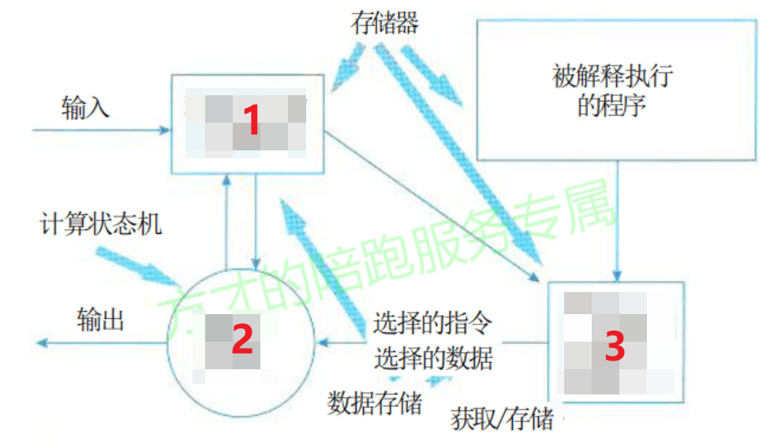
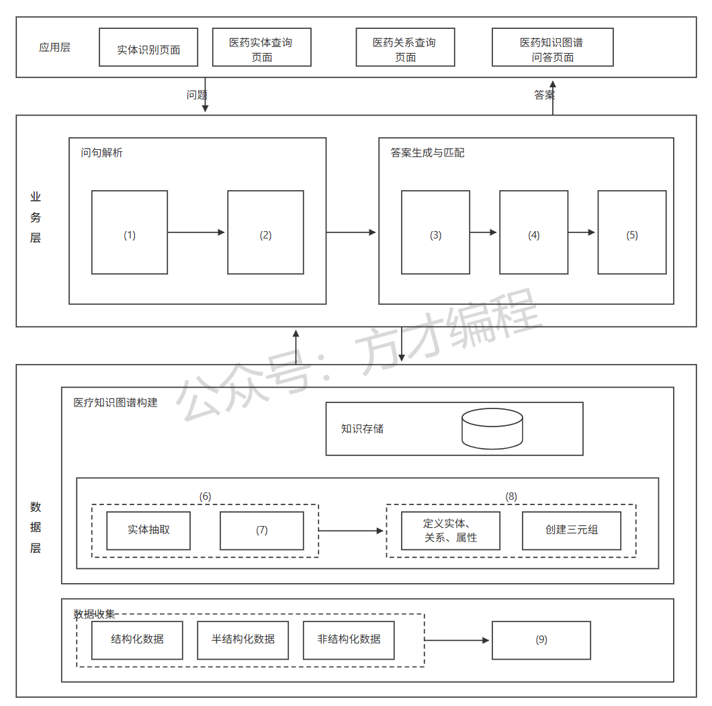
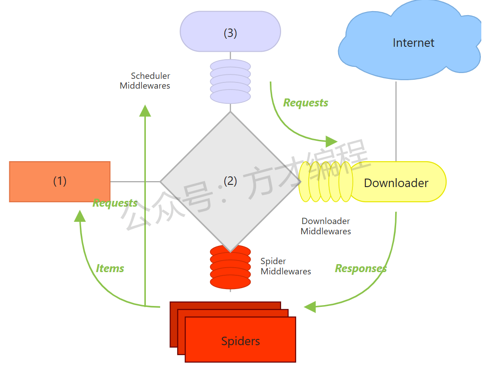

# 2025年5月 系统架构设计师 案例分析真题

> 来源：方才coding 软考真题

---

## 第1大题：软件架构设计与评估

### 试题1

某公司开发一个在线大模型训练平台，支持Python代码编写、模型训练和部署，用户通过python编写模型代码，将代码交给系统进行模型代码的解析，最终由系统匹配相应的计算机资源进行输出，用户不需要关心底层硬件平台。
问题1
（12分）列举了所有需求列表，填写对应的质量属性：
a、系统发生错误时，不影响正常运行时发送一个消息给系统管理员
b、方便用户操作，满足一般用户使用的快捷键设置
c、系统界面适配用户提供的屏幕尺寸比例
d、用户提交训练任务时应该在一分钟内提供硬件和资源，并开始任务运行
e、数据库发生故障时，能够在 20 分钟内切换至备用数据库，保证平台继续运行
f、系统出现故障时，平台能够继续正常运行并通知管理员，同时应提供相关的操作日志、系统日志、访问日志和调试日志等信息
g、支持远程用户进行测试和操作，但需限定为注册用户
h、系统应支持来自不同终端设备（如浏览器、命令行工具、移动设备等）和操作系统（如 Windows、Linux、macOS）的注册用户同时远程访问与操作平台，系统需能正确解析并响应各类客户端的指令，保证功能一致性与协同操作能力
i、当系统功能需要调整时，应在 3 天内完成功能修改和部署上线
j、系统支持切换不同的语言，方便不同语言背景用户使用
k、服务器发生故障后，立即切换到备用服务，保证业务的连续性
l、系统需具备良好的异常容错机制，部分模块出错不应影响平台整体运行

---
### 试题2

某公司开发一个在线大模型训练平台，支持Python代码编写、模型训练和部署，用户通过python编写模型代码，将代码交给系统进行模型代码的解析，最终由系统匹配相应的计算机资源进行输出，用户不需要关心底层硬件平台。
问题2
（ 13分）解释器风格架构的组成图填空（6分），以及解释为什么该模型平台适合解释器风格（7分）

---

## 第2大题：系统建模与分析

### 试题3

方才coding
首页
教程
软考真题
软考训练营
资源
From Zero To Hero！积跬步以至千里！
点我^~^
点我修改昵称
25年5月系统架构师真题 - 第3题

---
### 试题4

方才coding
首页
教程
软考真题
软考训练营
资源
From Zero To Hero！积跬步以至千里！
点我^~^
点我修改昵称
25年5月系统架构师真题 - 第4题

---
### 试题5

方才coding
首页
教程
软考真题
软考训练营
资源
From Zero To Hero！积跬步以至千里！
点我^~^
点我修改昵称
25年5月系统架构师真题 - 第5题

---

## 第3大题：数据库与系统设计

### 试题6

某互联网企业开发了一个电商系统，系统中的商品信息、用户购物车、热销榜单等高频数据均存储在 Redis 中以提高访问效率。随着业务规模扩大，单实例 Redis 出现了性能瓶颈和单点故障风险。为提升系统的可用性、扩展性和数据容灾能力，技术团队决定采用 Redis 的主从复制架构，将写操作集中在主节点（Master），将读操作分散到多个从节点（Slave）中。同时，系统还需支持主从自动同步机制，确保在主库故障后可以快速切换至从库，保障业务连续性。
问题1
（10分）redis主从同步，要求按图填空，首次全量同步过程；
sequenceDiagram
    participant Client as 客户端
    participant Master as Redis 主库
    participant Slave as Redis 从库

    %% 1. 从库向主库发送请求
    Slave->>Master: 1：(1)
    activate Master
    
    %% 2. 主库内部操作
    Master->>Master: 2：(2)
    deactivate Master

    %% 3. 客户端写操作
    Client->>Master: 3：写操作
    activate Master
    
    %% 4. 主库处理写操作（通常是缓冲）
    Master->>Master: 4：(3)
    
    %% 5. 主库向从库发送数据
    Master->>Slave: 5：(4)
    deactivate Master
    
    activate Slave
    %% 6. 从库恢复状态
    Slave->>Slave: 6：恢复成 BGSAVE 执行前的状态
    
    %% 7. 主库继续向从库发送数据
    Master->>Slave: 7：(5)
    
    %% 8. 从库最终恢复
    Slave->>Slave: 8：恢复成 BGSAVE 执行后的状态
    deactivate Slave

---
### 试题7

某互联网企业开发了一个电商系统，系统中的商品信息、用户购物车、热销榜单等高频数据均存储在 Redis 中以提高访问效率。随着业务规模扩大，单实例 Redis 出现了性能瓶颈和单点故障风险。为提升系统的可用性、扩展性和数据容灾能力，技术团队决定采用 Redis 的主从复制架构，将写操作集中在主节点（Master），将读操作分散到多个从节点（Slave）中。同时，系统还需支持主从自动同步机制，确保在主库故障后可以快速切换至从库，保障业务连续性。
问题2
（6分）增量复制的流程图填空。
sequenceDiagram
    participant Client as 客户端
    participant Master as Redis 主库
    participant Slave as Redis 从库

    %% 为什么：客户端触发数据写入，复制链路从此开始
    Client->>Master: 1：写操作
    activate Master

    %% 为什么：主库先记录/缓冲该写入，确保可被复制到从库
    Master->>Master: 2：(1)

    %% 为什么：主库将变更通过复制通道发送到从库
    Master->>Slave: 3：(2)
    deactivate Master
    activate Slave

    %% 为什么：从库应用接收到的命令，使自身状态与主库一致
    Slave->>Slave: 4：(3)
    deactivate Slave

---
### 试题8

某互联网企业开发了一个电商系统，系统中的商品信息、用户购物车、热销榜单等高频数据均存储在 Redis 中以提高访问效率。随着业务规模扩大，单实例 Redis 出现了性能瓶颈和单点故障风险。为提升系统的可用性、扩展性和数据容灾能力，技术团队决定采用 Redis 的主从复制架构，将写操作集中在主节点（Master），将读操作分散到多个从节点（Slave）中。同时，系统还需支持主从自动同步机制，确保在主库故障后可以快速切换至从库，保障业务连续性。
问题3
（9分）数据库持久化方案，请列举两种，并说明。【ps：这个问题的题目并没有明确提及是Redis的持久化，
问的就是数据库的持久化，同时结合本题上下文，回答Redis的持久化机制是更加合适
】

---

## 第4大题：Web应用架构

### 试题9

方才coding
首页
教程
软考真题
软考训练营
资源
From Zero To Hero！积跬步以至千里！
点我^~^
点我修改昵称
25年5月系统架构师真题 - 第9题

---
### 试题10

方才coding
首页
教程
软考真题
软考训练营
资源
From Zero To Hero！积跬步以至千里！
点我^~^
点我修改昵称
25年5月系统架构师真题 - 第10题

---
### 试题11

方才coding
首页
教程
软考真题
软考训练营
资源
From Zero To Hero！积跬步以至千里！
点我^~^
点我修改昵称
25年5月系统架构师真题 - 第11题

---

## 第5大题：嵌入式与实时系统

### 试题12

某市农业信息化管理部门计划建设一个基于区块链的农产品全流程溯源平台，实现从农田到餐桌全过程的数据上链，提升农产品质量追溯的透明度和可信度。为此，项目团队需对区块链的技术架构和各个层次进行深入理解和设计。
问题1
（12分）请简要说明区块链技术的六个层次，并简要描述每一层的功能和作用。

---
### 试题13

某市农业信息化管理部门计划建设一个基于区块链的农产品全流程溯源平台，实现从农田到餐桌全过程的数据上链，提升农产品质量追溯的透明度和可信度。为此，项目团队需对区块链的技术架构和各个层次进行深入理解和设计。
问题2
（9分）区块链应用在农产品的检验流程中，有三个角色，数据录入者，检查者，核验者，请说明三个角色在检验流程中具体会怎样？

---
### 试题14

某市农业信息化管理部门计划建设一个基于区块链的农产品全流程溯源平台，实现从农田到餐桌全过程的数据上链，提升农产品质量追溯的透明度和可信度。为此，项目团队需对区块链的技术架构和各个层次进行深入理解和设计。
问题3
（4分）智能合约是什么？

---

## 附录：提取的图片

- `img_qr_5b2991402eee.png`：微信小程序二维码，已省略
- `img_logo_fb5107e4dc49.jpeg`：站点 Logo，已省略
- `img_exam_70b4eb5c354f.png`：第1大题第2小题架构图/表格图
- `img_exam_47a5a936cdd0.png`：第2大题第1小题架构图/表格图
- `img_exam_14d93de87af4.png`：第2大题第2小题架构图/表格图
